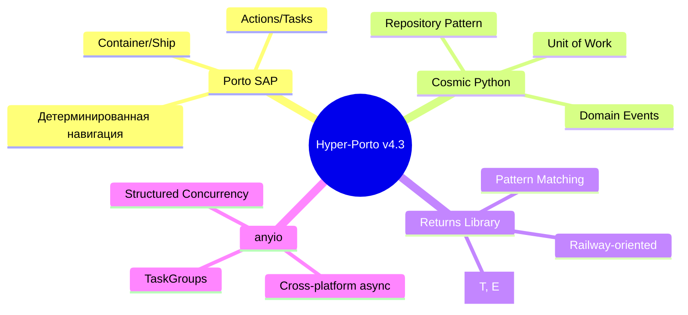
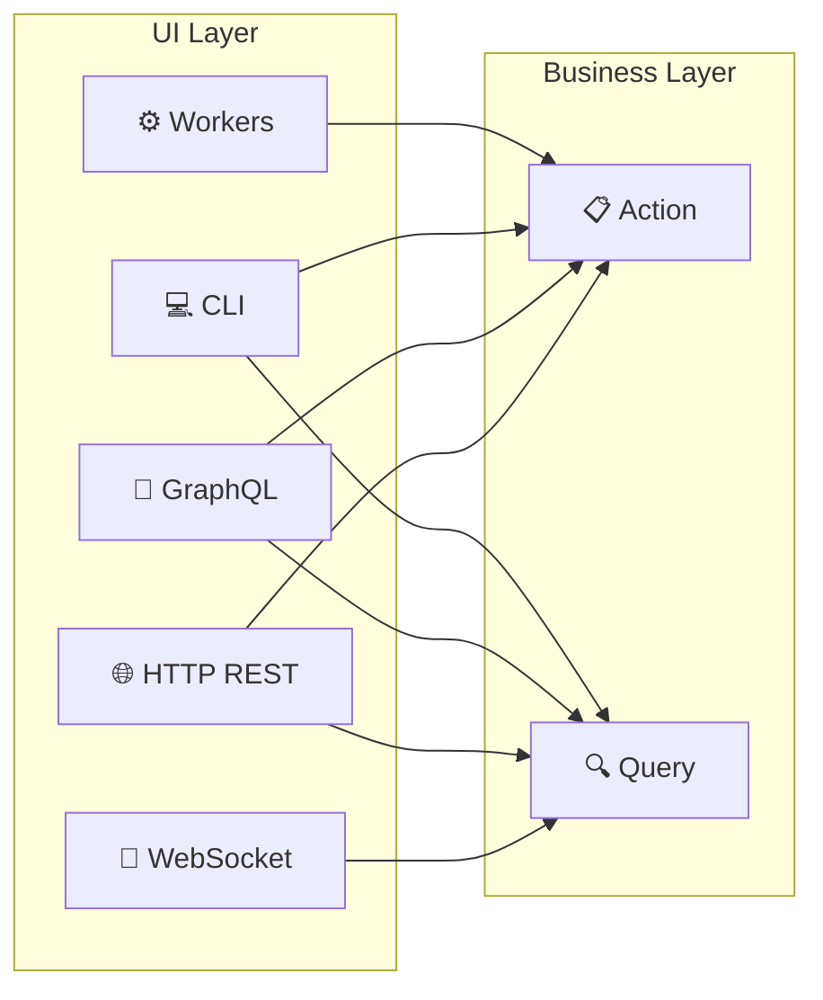
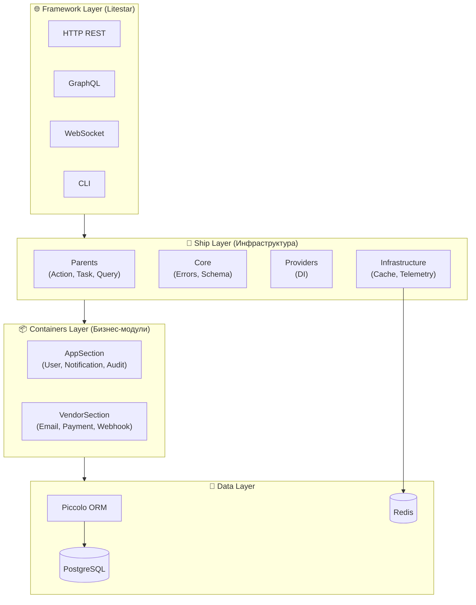
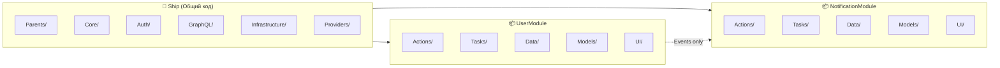
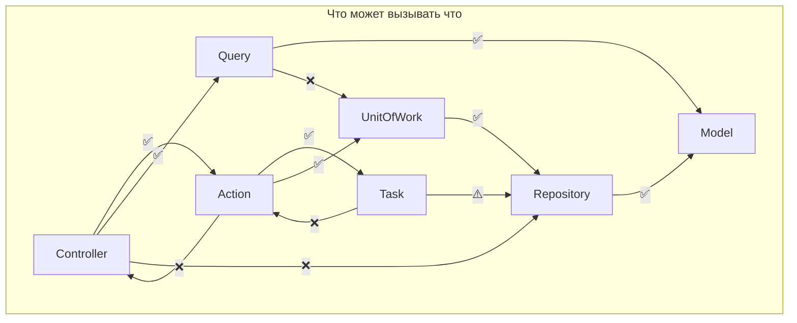
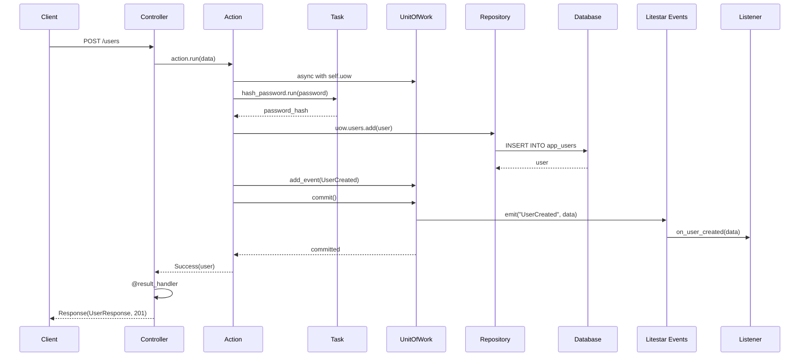
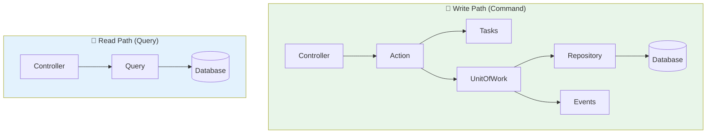
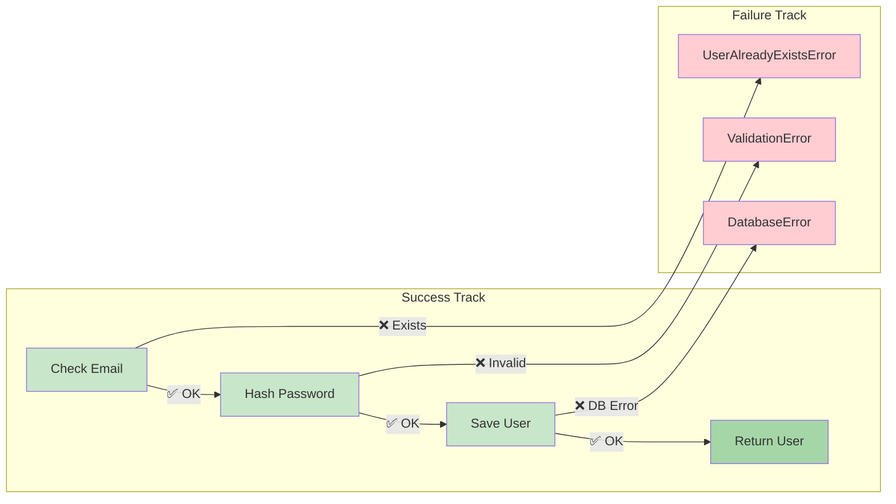
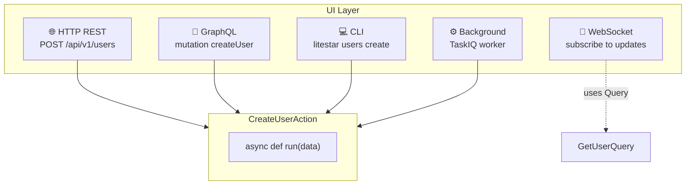
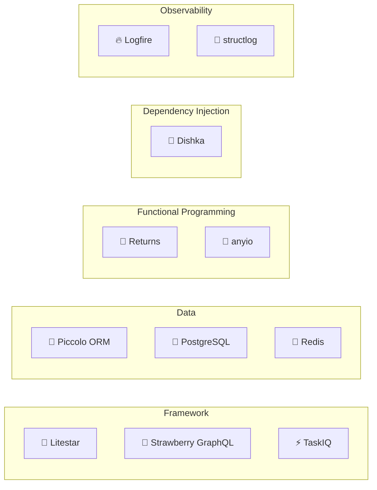

<div align="center">

# 🚀 Hyper-Porto v4.3

### Функциональная архитектура для Python бэкендов

[](https://www.python.org/downloads/)
[](https://litestar.dev/)
[](https://opensource.org/licenses/MIT)
[](https://github.com/astral-sh/ruff)

*Porto SAP + Cosmic Python + Returns + anyio = Production-Ready Architecture*

</div>

---

## 📋 Оглавление

- [🎯 Что такое Hyper-Porto](#-что-такое-hyper-porto)
- [✨ Ключевые особенности](#-ключевые-особенности)
- [🏗️ Архитектура](#️-архитектура)
- [📦 Структура проекта](#-структура-проекта)
- [🧩 Компоненты системы](#-компоненты-системы)
- [🔄 Поток данных](#-поток-данных)
- [🚂 Railway-Oriented Programming](#-railway-oriented-programming)
- [📡 Транспорты (UI Layer)](#-транспорты-ui-layer)
- [📚 Tech Stack](#-tech-stack)
- [🚀 Быстрый старт](#-быстрый-старт)
- [📖 API документация](#-api-документация)
- [🧪 Тестирование](#-тестирование)
- [📜 Конституция проекта](#-конституция-проекта)

---

## 🎯 Что такое Hyper-Porto

**Hyper-Porto** — это синтез лучших архитектурных практик, объединённых с функциональным программированием для создания масштабируемых, поддерживаемых и типобезопасных Python бэкендов.



### 🧠 Ключевая идея

| Источник | Что берём | Результат |
|----------|-----------|-----------|
| **Porto** | Структура папок, Container/Ship, Actions/Tasks | Детерминированная навигация по коду |
| **Cosmic Python** | Repository, UoW, Domain Events | Чистота бизнес-логики |
| **Returns** | Result[T, E], Railway-oriented programming | Явная обработка ошибок |
| **anyio** | Structured Concurrency, TaskGroups | Безопасная конкурентность |

---

## ✨ Ключевые особенности

### 🎨 Функциональный подход

```python
# Каждый Action возвращает Result[T, E] — явный контракт
async def run(self, data: CreateUserRequest) -> Result[AppUser, UserError]:
    if await self.uow.users.find_by_email(data.email):
        return Failure(UserAlreadyExistsError(email=data.email))  # ← Явная ошибка
    
    async with self.uow:
        user = AppUser(email=data.email, name=data.name, ...)
        await self.uow.users.add(user)
        self.uow.add_event(UserCreated(user_id=user.id))
        await self.uow.commit()
    
    return Success(user)  # ← Явный успех
```

### 🏷️ Типобезопасность

```python
# Generics для Action: Input, Output, Error
class CreateUserAction(Action[CreateUserRequest, AppUser, UserError]):
    async def run(self, data: CreateUserRequest) -> Result[AppUser, UserError]: ...

# Pattern Matching для обработки результата
match result:
    case Success(user):
        return UserResponse.from_entity(user)
    case Failure(UserNotFoundError(user_id=uid)):
        raise DomainException(error)
```

### 🔌 Мульти-транспортность



---

## 🏗️ Архитектура

### Архитектурные слои



### Ship vs Containers



---

## 📦 Структура проекта

```
hyper-porto/
├── 📁 docs/                          # Документация архитектуры
│   ├── 00-philosophy.md              # Философия и принципы
│   ├── 01-architecture.md            # Архитектурные слои
│   ├── 02-project-structure.md       # Структура папок
│   ├── 03-components.md              # Action, Task, Repository, Query
│   ├── 04-result-railway.md          # Result и Railway-oriented
│   ├── 05-concurrency.md             # anyio и TaskGroups
│   └── ...                           # Другие документы
│
├── 📁 specs/                         # Спецификации
│   └── CONSTITUTION.md               # Конституция проекта
│
├── 📁 src/                           # Исходный код
│   ├── App.py                        # 🚀 Litestar Application Factory
│   ├── Main.py                       # Entry point
│   │
│   ├── 📁 Ship/                      # 🚢 Общая инфраструктура
│   │   ├── Auth/                     # JWT, Guards, Middleware
│   │   ├── CLI/                      # Click команды
│   │   ├── Configs/                  # Pydantic Settings
│   │   ├── Core/                     # Errors, BaseSchema, Types
│   │   ├── Decorators/               # @result_handler, @audited
│   │   ├── GraphQL/                  # Strawberry интеграция
│   │   ├── Infrastructure/           # Cache, Telemetry, Workers
│   │   ├── Parents/                  # Action, Task, Query, Repository
│   │   └── Providers/                # Dishka DI провайдеры
│   │
│   └── 📁 Containers/                # 📦 Бизнес-модули
│       │
│       ├── 📁 AppSection/            # Основные модули
│       │   ├── UserModule/           # 👤 Пользователи
│       │   ├── NotificationModule/   # 🔔 Уведомления
│       │   ├── AuditModule/          # 📋 Аудит
│       │   ├── SearchModule/         # 🔍 Поиск
│       │   └── SettingsModule/       # ⚙️ Настройки
│       │
│       └── 📁 VendorSection/         # Интеграции
│           ├── EmailModule/          # 📧 Email
│           ├── PaymentModule/        # 💳 Платежи
│           └── WebhookModule/        # 🔗 Вебхуки
│
├── 📁 tests/                         # Тесты
├── pyproject.toml                    # Dependencies
├── piccolo_conf.py                   # Piccolo ORM config
└── docker-compose.yml                # Docker services
```

### Структура Container (на примере UserModule)

```
UserModule/
├── __init__.py                 # user_router export
│
├── 📁 Actions/                 # 🎬 Use Cases (CQRS Commands)
│   ├── CreateUserAction.py
│   ├── UpdateUserAction.py
│   ├── DeleteUserAction.py
│   ├── AuthenticateAction.py
│   ├── ChangePasswordAction.py
│   └── RefreshTokenAction.py
│
├── 📁 Tasks/                   # ⚙️ Атомарные операции
│   ├── HashPasswordTask.py
│   ├── VerifyPasswordTask.py
│   ├── GenerateTokenTask.py
│   └── SendWelcomeEmailTask.py
│
├── 📁 Queries/                 # 📖 CQRS Read-операции
│   ├── GetUserQuery.py
│   └── ListUsersQuery.py
│
├── 📁 Data/                    # 💾 Data Layer
│   ├── Repositories/
│   │   └── UserRepository.py
│   ├── Schemas/
│   │   ├── Requests.py         # Pydantic Request DTOs
│   │   └── Responses.py        # Pydantic Response DTOs
│   └── UnitOfWork.py           # UserUnitOfWork
│
├── 📁 Models/                  # 📋 Piccolo ORM Tables
│   ├── User.py                 # AppUser Table
│   ├── PiccoloApp.py           # Для миграций
│   └── migrations/
│
├── 📁 UI/                      # 🖥️ Presentation Layer
│   ├── API/
│   │   ├── Controllers/
│   │   │   ├── UserController.py
│   │   │   └── AuthController.py
│   │   └── Routes.py
│   ├── CLI/
│   │   └── Commands.py
│   ├── GraphQL/
│   │   ├── Types.py
│   │   └── Resolvers.py
│   ├── WebSocket/
│   │   └── Handlers.py
│   └── Workers/
│       └── Tasks.py            # TaskIQ background tasks
│
├── Events.py                   # 📨 Domain Events
├── Listeners.py                # 🎧 Event Listeners
├── Errors.py                   # ❌ Pydantic frozen errors
└── Providers.py                # 💉 Dishka DI
```

---

## 🧩 Компоненты системы

### Диаграмма компонентов

```mermaid
classDiagram
    class Action {
        <<abstract>>
        +run(data: InputT) Result[OutputT, ErrorT]
    }
    
    class Task {
        <<abstract>>
        +run(data: InputT) OutputT
    }
    
    class SyncTask {
        <<abstract>>
        +run(data: InputT) OutputT
    }
    
    class Query {
        <<abstract>>
        +execute(input: InputT) OutputT
    }
    
    class Repository {
        <<abstract>>
        +add(entity: T) T
        +get(id: UUID) T | None
        +update(entity: T) T
        +delete(entity: T) None
    }
    
    class UnitOfWork {
        +add_event(event: DomainEvent)
        +commit()
        +rollback()
    }
    
    class Controller {
        +@post("/") create()
        +@get("/") list()
        +@get("/{id}") get()
    }
    
    Controller --> Action : uses
    Controller --> Query : uses
    Action --> Task : orchestrates
    Action --> UnitOfWork : uses
    UnitOfWork --> Repository : contains
    UnitOfWork --> DomainEvent : publishes
```

### Таблица компонентов

| Компонент | Назначение | Слой | Возвращает |
|-----------|------------|------|------------|
| **Action** | Use Case (CQRS Command) | Business | `Result[T, E]` |
| **Task** | Атомарная операция (async) | Business | `T` |
| **SyncTask** | Атомарная операция (sync) | Business | `T` |
| **Query** | CQRS Query (read-only) | Business | `T` |
| **Repository** | Абстракция над ORM | Data | `T \| None` |
| **UnitOfWork** | Транзакции + Events | Data | Context manager |
| **Controller** | HTTP endpoints | UI | `Response` |
| **Resolver** | GraphQL endpoints | UI | `Type` |
| **Listener** | Event handler | Infrastructure | Side effects |

### Правила зависимостей



---

## 🔄 Поток данных

### HTTP Request Flow



### CQRS: Чтение vs Запись



---

## 🚂 Railway-Oriented Programming

### Концепция Railway



### Пример использования Result

```python
from returns.result import Result, Success, Failure

class CreateUserAction(Action[CreateUserRequest, AppUser, UserError]):
    async def run(self, data: CreateUserRequest) -> Result[AppUser, UserError]:
        # Step 1: Check if email exists → Failure track if exists
        existing = await self.uow.users.find_by_email(data.email)
        if existing:
            return Failure(UserAlreadyExistsError(email=data.email))
        
        # Step 2: Hash password
        password_hash = await anyio.to_thread.run_sync(
            self.hash_password.run, data.password
        )
        
        # Step 3: Save user within transaction
        async with self.uow:
            user = AppUser(
                email=data.email,
                password_hash=password_hash,
                name=data.name,
            )
            await self.uow.users.add(user)
            self.uow.add_event(UserCreated(user_id=user.id, email=user.email))
            await self.uow.commit()
        
        # Success track
        return Success(user)
```

### Pattern Matching для обработки

```python
# В Controller с @result_handler (автоматически)
@post("/")
@result_handler(UserResponse, success_status=201)
async def create_user(
    self,
    data: CreateUserRequest,
    action: FromDishka[CreateUserAction],
) -> Result[AppUser, UserError]:
    return await action.run(data)

# В CLI (ручной match)
match result:
    case Success(user):
        console.print(f"[green]✓[/green] User created: {user.id}")
    case Failure(UserAlreadyExistsError(email=email)):
        console.print(f"[red]✗[/red] Email {email} already exists")
    case Failure(error):
        console.print(f"[red]✗[/red] Error: {error.message}")
```

---

## 📡 Транспорты (UI Layer)

### Один Action — много транспортов



### HTTP REST (Litestar Controllers)

```python
class UserController(Controller):
    path = "/users"
    tags = ["Users"]

    @post("/")
    @result_handler(UserResponse, success_status=HTTP_201_CREATED)
    async def create_user(
        self,
        data: CreateUserRequest,
        action: FromDishka[CreateUserAction],
    ) -> Result[AppUser, UserError]:
        return await action.run(data)

    @get("/{user_id:uuid}")
    async def get_user(
        self,
        user_id: UUID,
        query: FromDishka[GetUserQuery],
    ) -> UserResponse:
        user = await query.execute(GetUserQueryInput(user_id=user_id))
        if user is None:
            raise DomainException(UserNotFoundError(user_id=user_id))
        return UserResponse.from_entity(user)
```

### GraphQL (Strawberry)

```python
@strawberry.type
class UserMutation:
    @strawberry.mutation
    async def create_user(
        self,
        input: CreateUserInput,
        info: strawberry.Info,
    ) -> CreateUserPayload:
        action = await get_dependency(info, CreateUserAction)
        result = await action.run(input.to_pydantic())
        
        match result:
            case Success(user):
                return CreateUserPayload(user=UserType.from_pydantic(user))
            case Failure(error):
                return CreateUserPayload(error=UserErrorType(
                    message=error.message,
                    code=error.code,
                ))
```

### CLI (Click + Litestar)

```python
@users_group.command(name="create")
@click.option("--email", "-e", required=True)
@click.option("--password", "-p", required=True)
@click.option("--name", "-n", required=True)
@with_container
async def create_user(container, email: str, password: str, name: str):
    action = await container.get(CreateUserAction)
    result = await action.run(CreateUserRequest(email=email, password=password, name=name))
    
    match result:
        case Success(user):
            console.print(f"[green]✓[/green] User created: {user.id}")
        case Failure(error):
            console.print(f"[red]✗[/red] Error: {error.message}")
            raise SystemExit(1)
```

### WebSocket (Litestar Channels)

```python
@websocket("/ws/users/{user_id:uuid}")
async def user_updates_handler(
    socket: WebSocket,
    user_id: UUID,
    channels: ChannelsPlugin,
) -> None:
    await socket.accept()
    
    async with channels.start_subscription([f"user:{user_id}"]) as subscriber:
        async with anyio.create_task_group() as tg:
            tg.start_soon(handle_commands, socket)
            tg.start_soon(handle_channel_messages, socket, subscriber)
```

### Background Workers (TaskIQ)

```python
@broker.task
@inject
async def create_user_async_task(
    email: str,
    password: str,
    name: str,
    action: FromDishka[CreateUserAction],
) -> dict:
    result = await action.run(CreateUserRequest(email=email, password=password, name=name))
    
    match result:
        case Success(user):
            await send_welcome_email_task.kiq(email=user.email, name=user.name)
            return {"status": "created", "user_id": str(user.id)}
        case Failure(error):
            return {"status": "failed", "error": error.message}
```

---

## 📚 Tech Stack

### Основные технологии



### Полный список зависимостей

| Категория | Библиотека | Версия | Назначение |
|-----------|------------|--------|------------|
| **Web** | `litestar[standard]` | ≥2.12.0 | ASGI фреймворк |
| **GraphQL** | `strawberry-graphql[litestar]` | ≥0.230 | GraphQL сервер |
| **Background** | `taskiq`, `taskiq-redis` | ≥0.11 | Task queue |
| **FP** | `returns` | ≥0.23 | Result, Maybe, flow |
| **Async** | `anyio` | ≥4.0 | Structured concurrency |
| **Resilience** | `tenacity` | ≥8.2 | Retry логика |
| **Cache** | `cashews` | ≥7.0 | Async кэширование |
| **DI** | `dishka` | ≥1.4.0 | Dependency Injection |
| **ORM** | `piccolo[all]` | ≥1.0 | Async ORM + миграции |
| **Validation** | `pydantic` | ≥2.0 | DTO валидация |
| **Observability** | `logfire[asgi]` | ≥0.50 | Tracing + logging |
| **Security** | `bcrypt`, `PyJWT` | ≥4.0, ≥2.0 | Password hashing, JWT |

---

## 🚀 Быстрый старт

### Требования

- Python 3.12+
- PostgreSQL 15+
- Redis 7+

### Установка

```bash
# 1. Клонирование репозитория
git clone <repository-url>
cd hyper-porto

# 2. Создание виртуального окружения
python -m venv .venv
source .venv/bin/activate  # Linux/macOS
# или .venv\Scripts\activate  # Windows

# 3. Установка зависимостей
pip install -e ".[dev]"

# 4. Копирование конфигурации
cp env.example .env
# Отредактируйте .env под ваши настройки

# 5. Запуск Docker сервисов
docker-compose up -d

# 6. Применение миграций
litestar db migrate

# 7. Запуск сервера
litestar run --reload
```

### Проверка работы

```bash
# Health check
curl http://localhost:8000/health

# Создание пользователя через API
curl -X POST http://localhost:8000/api/v1/users \
  -H "Content-Type: application/json" \
  -d '{"email": "user@example.com", "password": "password123", "name": "John Doe"}'

# Создание пользователя через CLI
litestar users create -e user@example.com -p password123 -n "John Doe"
```

---

## 📖 API документация

### Доступные endpoints

После запуска сервера доступны:

| URL | Описание |
|-----|----------|
| `http://localhost:8000/api/docs` | 📚 OpenAPI (Scalar) |
| `http://localhost:8000/graphql` | 🔮 GraphQL Playground |
| `http://localhost:8000/health` | 💚 Health Check |

### REST API

```
# Users
POST   /api/v1/users           # Создание пользователя
GET    /api/v1/users           # Список пользователей
GET    /api/v1/users/{id}      # Получение пользователя
PATCH  /api/v1/users/{id}      # Обновление пользователя
DELETE /api/v1/users/{id}      # Удаление пользователя

# Auth
POST   /api/v1/auth/login      # Аутентификация
GET    /api/v1/auth/me         # Текущий пользователь
POST   /api/v1/auth/refresh    # Обновление токена
POST   /api/v1/auth/logout     # Выход

# Notifications
GET    /api/v1/notifications                # Список уведомлений
POST   /api/v1/notifications/{id}/read      # Отметить как прочитанное

# Webhooks
POST   /api/v1/webhooks        # Регистрация вебхука
GET    /api/v1/webhooks        # Список вебхуков
```

### GraphQL

```graphql
# Queries
query {
  user(id: "uuid") {
    id
    email
    name
    isActive
    createdAt
  }
  
  users(limit: 20, offset: 0, activeOnly: true) {
    users { id email name }
    total
  }
}

# Mutations
mutation {
  createUser(input: {
    email: "user@example.com"
    password: "password123"
    name: "John Doe"
  }) {
    user { id email }
    error { message code }
  }
}
```

### CLI команды

```bash
# Litestar CLI
litestar --help                    # Все доступные команды
litestar run --reload              # Запуск dev сервера
litestar users --help              # Управление пользователями
litestar users create              # Создание пользователя
litestar users list                # Список пользователей
litestar db migrate                # Применение миграций
litestar db make-migrations        # Создание миграций
```

---

## 🧪 Тестирование

### Структура тестов

```
tests/
├── conftest.py              # Фикстуры pytest
├── unit/                    # Unit тесты
│   └── containers/
│       └── user_module/
│           ├── test_actions.py
│           └── test_tasks.py
├── integration/             # Integration тесты
│   └── test_repositories.py
└── e2e/                     # End-to-end тесты
    └── test_api.py
```

### Запуск тестов

```bash
# Все тесты
pytest

# С покрытием
pytest --cov=src --cov-report=html

# Только unit тесты
pytest tests/unit/

# Конкретный тест
pytest tests/unit/containers/user_module/test_actions.py -v
```

---

## 📜 Конституция проекта

### Неизменяемые правила

#### 1️⃣ Архитектура

- Все бизнес-модули в `Containers/`
- Общий код в `Ship/`
- Containers **НЕ** импортируют друг друга
- Межмодульное взаимодействие — только через Events

#### 2️⃣ Обработка ошибок

- Actions **ВСЕГДА** возвращают `Result[T, E]`
- Pattern Matching для обработки
- Все ошибки — Pydantic frozen модели

#### 3️⃣ Импорты

```python
# ✅ ПРАВИЛЬНО — абсолютные импорты
from src.Containers.AppSection.UserModule.Actions.CreateUserAction import CreateUserAction

# ❌ ЗАПРЕЩЕНО — относительные импорты
from ....Actions.CreateUserAction import CreateUserAction
```

#### 4️⃣ Типизация

- Все функции типизированы
- mypy strict mode
- Pydantic для всех DTO (не dataclass)

#### 5️⃣ Зависимости

- Dishka для DI (не Service Locator)
- Стандартные библиотеки (не велосипеды)

| Задача | Используй |
|--------|-----------|
| Result | `returns` |
| Async | `anyio` |
| Retry | `tenacity` |
| Cache | `cashews` |
| Events | `litestar.events` |

#### 6️⃣ Именование

| Компонент | Паттерн | Пример |
|-----------|---------|--------|
| Action | `{Verb}{Noun}Action` | `CreateUserAction` |
| Task | `{Verb}{Noun}Task` | `HashPasswordTask` |
| Query | `{Verb}{Noun}Query` | `GetUserQuery` |
| Repository | `{Noun}Repository` | `UserRepository` |
| Error | `{Noun}Error` | `UserNotFoundError` |
| Event | `{Noun}{Verb}` | `UserCreated` |

---

## 🗺️ Roadmap

- [x] Core architecture (Porto + Result)
- [x] User management module
- [x] Authentication (JWT)
- [x] GraphQL API
- [x] WebSocket support
- [x] Background workers
- [x] Notification system
- [x] Audit logging
- [x] Search module
- [x] Webhook integration
- [ ] Redis cache backend
- [ ] Rate limiting
- [ ] API versioning
- [ ] Multi-tenancy

---

## 📝 Лицензия

MIT License — см. [LICENSE](LICENSE)

---

<div align="center">

## 🤝 Contributing

Pull requests приветствуются! Для крупных изменений сначала откройте issue.

---

**Hyper-Porto v4.3** — *Функциональная архитектура для Python бэкендов*

🚢 Porto + 🐍 Cosmic Python + 🦀 Returns + ⚡ anyio = 🚀 Production-Ready

</div>
