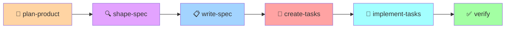

# 📝 Spec-Driven Development

> Разработка через спецификации с использованием Agent OS

---

## 🎯 Философия

```
Спецификация → План → Задачи → Код

НЕ: Идея → Код → Документация
```

**Spec-Driven Development (SDD)** инвертирует традиционный подход:
- Спецификация — источник истины
- Код — производная спецификации
- Изменение требований = изменение спецификации → регенерация

---

## 📋 Workflow



### Шаги

| Шаг | Команда | Описание |
|-----|---------|----------|
| 1 | `agent-os/plan-product` | Планирование продукта: mission, roadmap, tech-stack |
| 2 | `agent-os/shape-spec` | Формирование требований, уточнение неясностей |
| 3 | `agent-os/write-spec` | Написание формальной спецификации |
| 4 | `agent-os/create-tasks` | Разбивка на задачи с группировкой |
| 5 | `agent-os/implement-tasks` | Реализация (простой режим) |
| 5' | `agent-os/orchestrate-tasks` | Реализация (с subagents, продвинутый режим) |

---

## 🏛️ Plan Product (Планирование продукта)

Первый шаг — определить mission, roadmap и tech stack продукта.

### Что создаётся

```
agent-os/product/
├── mission.md      # Видение и стратегия продукта
├── roadmap.md      # Фазы разработки
└── tech-stack.md   # Технологический стек
```

### Команда

```bash
agent-os/plan-product
```

AI-агент:
1. Собирает информацию о продукте (цели, пользователи, фичи)
2. Создаёт `mission.md` с видением продукта
3. Создаёт `roadmap.md` с фазами разработки
4. Создаёт `tech-stack.md` с выбранными технологиями

### Пример mission.md

```markdown
# Mission: Hyper-Porto App

## Видение
Модульный бэкенд на архитектуре Porto с функциональным подходом.

## Целевая аудитория
- Backend разработчики
- Команды, использующие DDD

## Ключевые ценности
- Изоляция модулей (Containers)
- Явная обработка ошибок (Result)
- Типобезопасность
```

---

## 🔍 Shape Spec (Формирование требований)

Сбор и уточнение требований перед написанием спецификации.

### Процесс

1. **Инициализация** — создание папки спецификации
2. **Сбор требований** — уточняющие вопросы
3. **Визуальные материалы** — загрузка макетов/скриншотов

### Команда

```bash
agent-os/shape-spec Система управления пользователями с регистрацией и JWT
```

### Что создаётся

```
agent-os/specs/YYYY-MM-DD-user-management/
└── planning/
    ├── requirements.md   # Собранные требования
    └── visuals/          # Загруженные макеты
```

### Пример диалога

```
AI: Для уточнения требований, ответьте на вопросы:

1. Какие роли пользователей нужны? (admin, user, guest)
2. Нужен ли OAuth/социальный вход?
3. Требуется ли 2FA?
4. Какой срок жизни JWT токена?

Также загрузите визуальные материалы, если есть.
```

---

## 📋 Write Spec (Написание спецификации)

Создание формальной спецификации на основе собранных требований.

### Команда

```bash
agent-os/write-spec
```

### Что создаётся

```
agent-os/specs/YYYY-MM-DD-user-management/
├── spec.md              # Формальная спецификация
└── planning/
    ├── requirements.md
    └── visuals/
```

### Структура spec.md

```markdown
# Specification: [Feature Name]

## Goal
[1-2 предложения о цели]

## User Stories
- As a [user type], I want to [action] so that [benefit]

## Specific Requirements

**Регистрация пользователя**
- Email должен быть уникальным
- Пароль минимум 8 символов
- После регистрации отправляется welcome email

**Аутентификация**
- Вход по email + пароль
- Выдача JWT токена
- Refresh token для продления сессии

## Visual Design
[Ссылки на макеты из planning/visuals/]

## Existing Code to Leverage
[Какой существующий код можно переиспользовать]

## Out of Scope
- OAuth в первой версии
- 2FA в первой версии
```

---

## 📝 Create Tasks (Создание задач)

Разбивка спецификации на конкретные задачи.

### Команда

```bash
agent-os/create-tasks
```

### Что создаётся

```
agent-os/specs/YYYY-MM-DD-user-management/
├── spec.md
├── tasks.md             # Список задач
└── planning/
```

### Структура tasks.md

```markdown
# Tasks: User Management

## Task Group 1: Foundation

### 1.1 Создать Container структуру
- [ ] Создать Containers/AppSection/UserModule/
- [ ] Добавить Actions/, Tasks/, Data/, Models/, UI/
- [ ] Создать __init__.py файлы

### 1.2 Определить Models
- [ ] Создать Models/User.py с Piccolo Table
- [ ] Добавить миграцию
- [ ] Запустить миграцию

## Task Group 2: Core Logic

### 2.1 Реализовать CreateUserAction
- [ ] Создать Actions/CreateUserAction.py
- [ ] Добавить HashPasswordTask
- [ ] Добавить ValidateEmailTask
- [ ] Return Result[User, UserError]

### 2.2 Реализовать AuthenticateAction
- [ ] Создать Actions/AuthenticateAction.py
- [ ] Добавить VerifyPasswordTask
- [ ] Добавить GenerateTokenTask
- [ ] Return Result[AuthToken, AuthError]

## Task Group 3: API Layer

### 3.1 Создать UserController
- [ ] POST /users — регистрация
- [ ] POST /auth/login — аутентификация
- [ ] GET /users/me — текущий пользователь

## Checklist
- [ ] Все Actions покрыты тестами
- [ ] Миграции работают
- [ ] API документирован
```

---

## 🚀 Implement Tasks (Реализация)

Два режима реализации:

### Простой режим

```bash
agent-os/implement-tasks
```

AI-агент:
1. Читает `tasks.md`
2. Спрашивает какие task groups реализовать
3. Реализует последовательно
4. Отмечает выполненные задачи `[x]`
5. Запускает верификацию после завершения

### Продвинутый режим (с subagents)

```bash
agent-os/orchestrate-tasks
```

Позволяет:
- Назначать разные subagents на разные task groups
- Указывать какие стандарты применять к каждой группе
- Параллельная работа нескольких агентов

Создаёт `orchestration.yml`:

```yaml
task_groups:
  - name: foundation
    claude_code_subagent: backend-specialist
    standards:
      - all
  - name: api-layer
    claude_code_subagent: api-specialist
    standards:
      - backend/*
      - global/error-handling.md
```

---

## 📁 Структура agent-os/specs/

```
agent-os/specs/
├── 2026-01-18-user-management/
│   ├── spec.md              # Спецификация
│   ├── tasks.md             # Список задач
│   ├── orchestration.yml    # Настройки оркестрации (опционально)
│   ├── planning/
│   │   ├── requirements.md  # Собранные требования
│   │   └── visuals/         # Макеты и скриншоты
│   └── verifications/
│       └── final-verification.md  # Отчёт верификации
│
├── 2026-01-20-order-processing/
│   └── ...
│
└── 2026-01-25-payment-integration/
    └── ...
```

---

## 🔧 Интеграция с Hyper-Porto

### Маппинг Spec → Container

```
User Story → Action
Acceptance Criteria → Tests
Data Model → Models + Repository
API Contract → Controller + Schemas
```

### Пример трансформации

**Spec:**
```markdown
### Регистрация пользователя
- Email должен быть уникальным
- Пароль минимум 8 символов
- После регистрации отправляется welcome email
```

**Container:**
```
UserModule/
├── Actions/
│   └── CreateUserAction.py      # Use Case
├── Tasks/
│   ├── ValidateEmailTask.py     # Критерий: email
│   ├── HashPasswordTask.py      # Критерий: пароль
│   └── SendWelcomeEmailTask.py  # Критерий: welcome email
├── Data/
│   └── Repositories/
│       └── UserRepository.py    # Критерий: уникальность
└── Tests/
    └── test_create_user.py      # Все критерии
```

---

## 📋 Чеклист Spec-Driven Development

```markdown
## Перед началом разработки

- [ ] Продукт спланирован (mission, roadmap, tech-stack)
- [ ] Требования собраны и уточнены (shape-spec)
- [ ] Спецификация написана (write-spec)
- [ ] Все [NEEDS CLARIFICATION] разрешены

## Задачи

- [ ] Задачи созданы (create-tasks)
- [ ] Task groups логически сгруппированы
- [ ] Зависимости между задачами учтены

## После реализации

- [ ] Все задачи отмечены [x]
- [ ] Верификация пройдена
- [ ] Код соответствует спецификации
- [ ] Тесты проходят
```

---

## 🤖 Subagents

Agent OS использует специализированных subagents:

| Subagent | Назначение |
|----------|------------|
| `spec-initializer` | Создание папки спецификации |
| `spec-shaper` | Сбор и уточнение требований |
| `spec-writer` | Написание формальной спецификации |
| `tasks-list-creator` | Создание списка задач |
| `implementer` | Реализация задач |
| `implementation-verifier` | Верификация реализации |
| `product-planner` | Планирование продукта |

Subagents находятся в `.claude/agents/agent-os/`.

---

## 🗣️ Словарь сленга

Agent OS понимает сленг разработчиков. Полный словарь: `agent-os/slang/dictionary.md`

**Примеры:**
- "накидай экшн" → Создать Action
- "запили эндпоинт" → Создать REST endpoint
- "пульни евент" → Опубликовать Event через UoW

> 💡 **Совет:** Словарь можно дополнять своими терминами!

---

## 📚 Связанные ресурсы

| Ресурс | Путь |
|--------|------|
| Команды Agent OS | `.claude/commands/agent-os/` |
| Subagents | `.claude/agents/agent-os/` |
| Стандарты | `agent-os/standards/` |
| Шаблоны кода | `agent-os/templates/` |
| Workflows | `agent-os/workflows/` |
| Словарь сленга | `agent-os/slang/dictionary.md` |

---

<div align="center">

**Следующий раздел:** [08-libraries.md](08-libraries.md) — Используемые библиотеки

</div>
