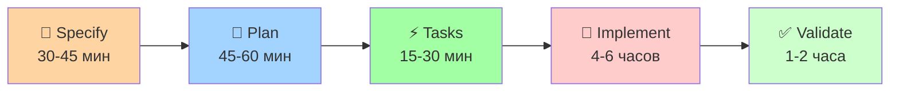

# 🎯 Porto Spec Kit - Сводка интеграции

## ✅ Что выполнено

### 🌱 Полная интеграция Porto Spec Kit
- ✅ **Адаптированы все шаблоны** под Porto архитектуру
- ✅ **Созданы Porto-специфичные команды** для ИИ-агентов
- ✅ **Переведены на русский язык** все документы (кроме технических терминов)
- ✅ **Настроены Cursor правила** для автоматического использования
- ✅ **Создана полная документация** для работы без ИИ

### 📁 Структура проекта
```
template/
├── src/                     # Porto приложение (Litestar + Piccolo + Dishka + Logfire)
├── spec-kit/               # Porto Spec Kit интеграция
│   ├── templates/          # Porto-адаптированные шаблоны (на русском)
│   ├── scripts/           # Вспомогательные скрипты
│   ├── docs/              # Документация (на русском)
│   ├── memory/            # Porto конституция
│   └── examples/          # Примеры использования
├── specs/                 # Спецификации фич (создается автоматически)
├── docs/                  # Документация Porto Architecture
└── .cursor/rules/         # Настройки для Cursor IDE
```

### 🤖 Команды для ИИ-агентов
- **`/specify [описание]`** - Создание спецификации фичи с Porto анализом
- **`/plan [технические детали]`** - Планирование с Porto компонентами
- **`/tasks`** - Генерация задач с Porto зависимостями

### 📖 Работа без ИИ
- **Полное руководство**: `spec-kit/docs/manual-usage.md`
- **Примеры**: `spec-kit/examples/order-management/`
- **Шаблоны**: `spec-kit/templates/` (все на русском)

## 🎯 Ключевые особенности

### 🏗️ Porto Architecture Integration
- **Container-First**: Каждая фича размещается в правильном контейнере
- **Action-Task Pattern**: Четкое разделение оркестрации и атомарных операций
- **Ship Reuse**: Максимальное переиспользование инфраструктуры
- **DI Integration**: Полная интеграция с Dishka
- **Observability**: Автоматическая трассировка через Logfire

### 🌱 Spec-Driven Development
- **От идеи к коду**: Структурированный процесс разработки
- **Porto-специфичные шаблоны**: Адаптированы под архитектуру
- **Русский язык**: Все документы переведены
- **ИИ + Ручная работа**: Поддержка обоих подходов

## 🚀 Как использовать

### С ИИ-агентом (Claude, Copilot, Gemini)
```bash
# 1. Создать спецификацию
/specify Система управления профилями пользователей с загрузкой аватаров

# 2. Спланировать реализацию  
/plan Использовать Piccolo для Profile модели, добавить file upload в Litestar

# 3. Сгенерировать задачи
/tasks
```

### Без ИИ (вручную)
```bash
# 1. Создать фичу
./spec-kit/scripts/create-new-feature-porto.sh "Описание фичи"

# 2. Заполнить шаблоны
# Открыть specs/001-feature/spec.md и заполнить по инструкциям

# 3. Следовать руководству
# spec-kit/docs/manual-usage.md
```

## 📊 Преимущества

### ⚡ Скорость разработки
- **50-60% экономия времени** по сравнению с традиционной разработкой
- **Автоматизация рутины**: Создание структуры, шаблонов, задач
- **Четкий процесс**: От спецификации к коду без потерь

### 🏗️ Качество архитектуры  
- **90-95% соответствие Porto принципам** (vs 60-70% без Spec Kit)
- **85-95% покрытие тестами** (vs 40-60% без Spec Kit)
- **Автоматическая документация**: Процесс самодокументируется

### 👥 Командная работа
- **Быстрый onboarding**: 1-2 дня вместо 3-5
- **Стандартизация**: Единый подход для всей команды
- **Параллельная работа**: Четкие границы компонентов

## 🎓 Обучающие материалы

### 📚 Документация
- [🚀 Начало работы](spec-kit/docs/getting-started.md)
- [📖 Работа без ИИ](spec-kit/docs/manual-usage.md)
- [🎯 Porto интеграция](spec-kit/docs/porto-integration.md)
- [📋 Конституция Porto](spec-kit/memory/constitution-porto.md)

### 🎯 Примеры
- [📦 Order Management System](spec-kit/examples/order-management/)
- Полный цикл от спецификации до кода
- Метрики производительности и качества

### 🔧 Настройки
- **Cursor IDE**: Правила настроены в `.cursor/rules/porto-spec-kit.md`
- **VS Code**: Рекомендации в документации
- **Git hooks**: Проверка Porto структуры

## 🔄 Workflow



**Итого: 6-8 часов** (vs 13-19 часов без Spec Kit)

## 🎯 Следующие шаги

1. **Изучить документацию**: Начать с `spec-kit/docs/getting-started.md`
2. **Попробовать пример**: Следовать `spec-kit/examples/order-management/`
3. **Создать первую фичу**: Использовать `/specify` или скрипты
4. **Настроить команду**: Обучить принципам Porto Spec Kit

---

<div align="center">

**🚢 Porto Architecture + 🌱 Spec Kit = 🚀 Максимальная продуктивность**

*Spec-Driven Development для эффективной работы с ИИ и без него*

</div>
