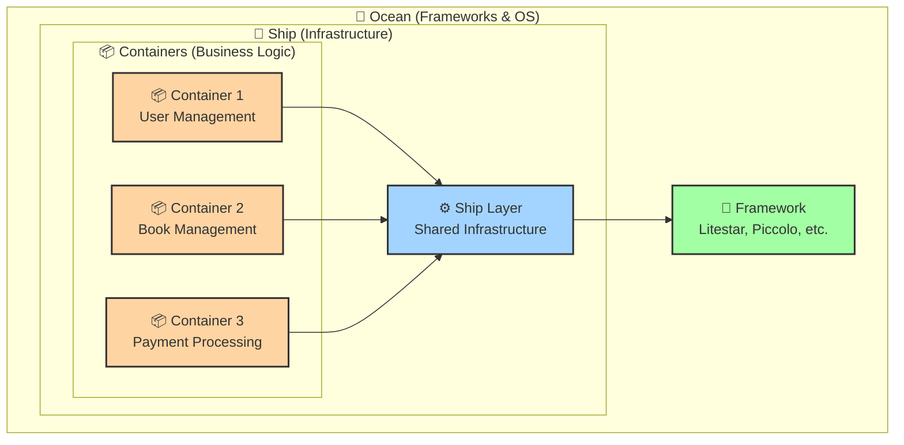
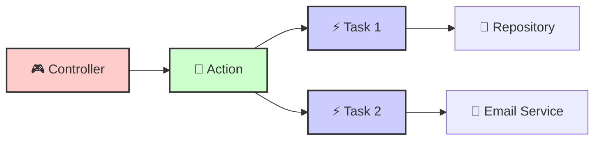
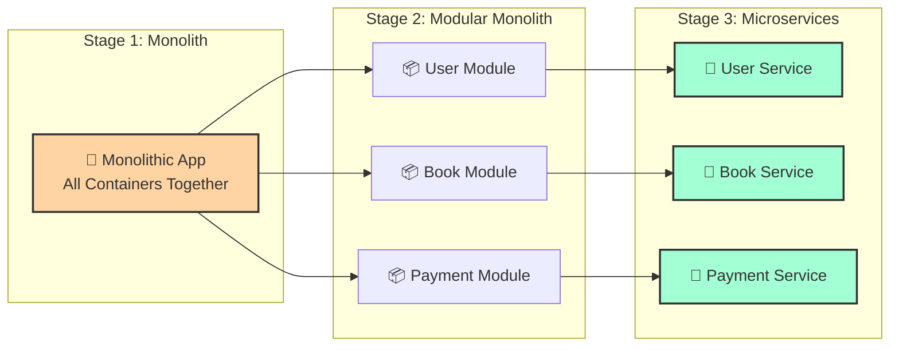

# 📖 Введение в Porto Architecture

## 🌟 Что такое Porto?

**Porto** - это современный архитектурный паттерн для разработки программного обеспечения, который обеспечивает:

- 🎯 **Чёткую организацию кода**
- 🔄 **Масштабируемость от монолита к микросервисам**
- 🤖 **Совместимость с AI-инструментами разработки**
- 🧩 **Модульность и переиспользование компонентов**

> "Простота - это высшая степень утончённости" - Леонардо да Винчи

## 🚢 Метафора корабля

Porto использует метафору **грузового корабля** для объяснения архитектуры:



### 📦 Containers (Контейнеры)
- Содержат **бизнес-логику** вашего приложения
- Каждый контейнер - это **независимый модуль**
- Легко переносятся между проектами

### 🚢 Ship (Корабль)
- **Инфраструктурный код**, общий для всех контейнеров
- Обеспечивает **базовую функциональность**
- Изолирует от фреймворка

### 🌊 Ocean (Океан)
- **Фреймворки и библиотеки** (Litestar, Piccolo, etc.)
- **Операционная система** и runtime
- Всё, на чём "плавает" ваше приложение

## 🎯 Основные принципы Porto

### 1️⃣ Single Responsibility (Единая ответственность)
Каждый компонент отвечает только за одну задачу:

```python
# ✅ Хорошо: Task с одной ответственностью
class CreateUserTask:
    async def run(self, name: str, email: str) -> User:
        """Создаёт пользователя в базе данных"""
        return await User.insert(name=name, email=email)

# ❌ Плохо: Task с множественной ответственностью
class UserTask:
    async def create_and_send_email_and_log(self, data):
        # Слишком много ответственностей!
        pass
```

### 2️⃣ Separation of Concerns (Разделение ответственности)
Бизнес-логика отделена от инфраструктуры:



### 3️⃣ Modularity (Модульность)
Каждый контейнер - независимый модуль:

```
📦 Containers/
├── 📁 AppSection/          # Основная бизнес-логика
│   ├── 📦 User/           # Модуль пользователей
│   ├── 📦 Book/           # Модуль книг
│   └── 📦 Order/          # Модуль заказов
└── 📁 VendorSection/       # Внешние сервисы
    ├── 📦 Payment/        # Модуль оплаты
    └── 📦 Notification/   # Модуль уведомлений
```

## 🔄 Эволюция архитектуры

Porto позволяет начать с **монолита** и постепенно переходить к **микросервисам**:



## 🤖 AI-Friendly Architecture

Porto идеально подходит для работы с **AI-инструментами** разработки:

### ✨ Почему AI любит Porto?

1. **Чёткие границы компонентов** - AI легко понимает структуру
2. **Единая ответственность** - Предсказуемый код
3. **Стандартные паттерны** - AI знает, что ожидать
4. **Описательные имена** - `CreateUserAction`, `SendEmailTask`

### 🤝 Работа с GitHub Copilot

```python
# AI легко генерирует код для Porto компонентов:

class UpdateBookAction:
    """AI понимает назначение по имени"""
    
    def __init__(self, find_book_task: FindBookTask, 
                 update_book_task: UpdateBookTask):
        # Copilot автоматически предложит dependency injection
        self.find_book = find_book_task
        self.update_book = update_book_task
    
    async def run(self, book_id: int, data: dict) -> Book:
        # AI сгенерирует логичную последовательность
        book = await self.find_book.run(book_id)
        updated_book = await self.update_book.run(book, data)
        return updated_book
```

## 🎓 Преимущества Porto

### Для разработчиков
- 📚 **Понятная структура** - легко ориентироваться в коде
- 🔄 **Переиспользование** - компоненты легко переносить
- 🧪 **Тестируемость** - каждый компонент тестируется отдельно
- 🐛 **Отладка** - проблемы локализованы в компонентах

### Для команд
- 👥 **Параллельная работа** - разработчики не мешают друг другу
- 📖 **Документируемость** - структура сама себя документирует
- 🎯 **Стандартизация** - единый подход для всей команды
- 🚀 **Быстрый onboarding** - новички быстро понимают проект

### Для бизнеса
- 💰 **Снижение затрат** - меньше времени на поддержку
- 📈 **Масштабируемость** - легко добавлять функции
- 🔧 **Гибкость** - быстрая адаптация к изменениям
- ⏱️ **Time to Market** - быстрая разработка новых фич

## 🚀 Когда использовать Porto?

### ✅ Porto подходит для:
- **Средних и крупных проектов** с долгим жизненным циклом
- **Команд от 2+ разработчиков**
- **Проектов с изменяющимися требованиями**
- **API и backend приложений**
- **Проектов, планирующих масштабирование**

### ⚠️ Porto может быть избыточен для:
- Простых скриптов и утилит
- Прототипов и MVP
- Проектов с жёстко фиксированными требованиями
- Одноразовых решений

## 📚 Основы, на которых построен Porto

Porto объединяет лучшие практики из:

- **Domain Driven Design (DDD)** - фокус на бизнес-логике
- **Clean Architecture** - независимость от фреймворков
- **SOLID принципы** - качественный объектно-ориентированный дизайн
- **MVC паттерн** - разделение представления и логики
- **Action Domain Responder** - улучшенный MVC для API

## 🎯 Следующие шаги

Теперь, когда вы понимаете основы Porto, переходите к:

1. [**Детальной архитектуре**](02-architecture.md) - глубокое погружение в паттерн
2. [**Структуре проекта**](03-project-structure.md) - организация файлов
3. [**Компонентам**](04-components.md) - изучение всех типов компонентов
4. Быстрый запуск: `uv run python run.py` или Docker (`docker-compose up`)
5. OpenAPI UI: `/api/docs`

---

<div align="center">

**💡 Совет**: Porto - это не догма, а набор рекомендаций. Адаптируйте его под свои нужды!

[← Назад к содержанию](README.md) | [Далее: Архитектура →](02-architecture.md)

</div>
