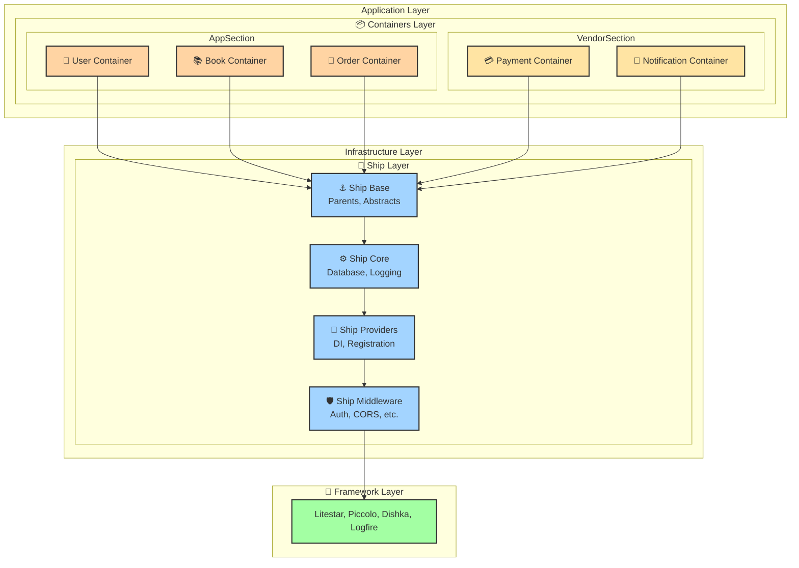
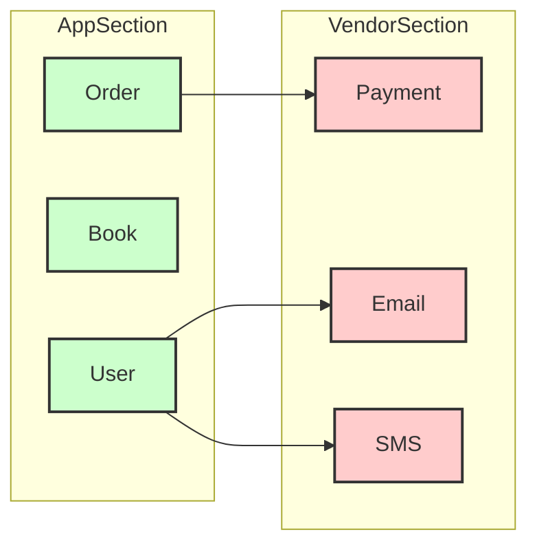
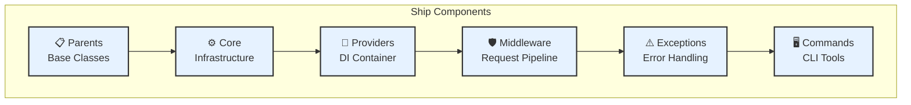
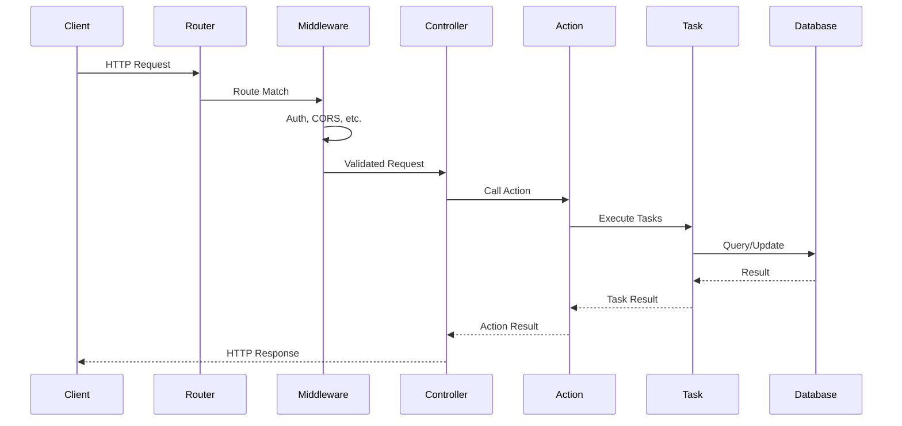
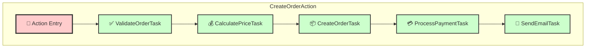
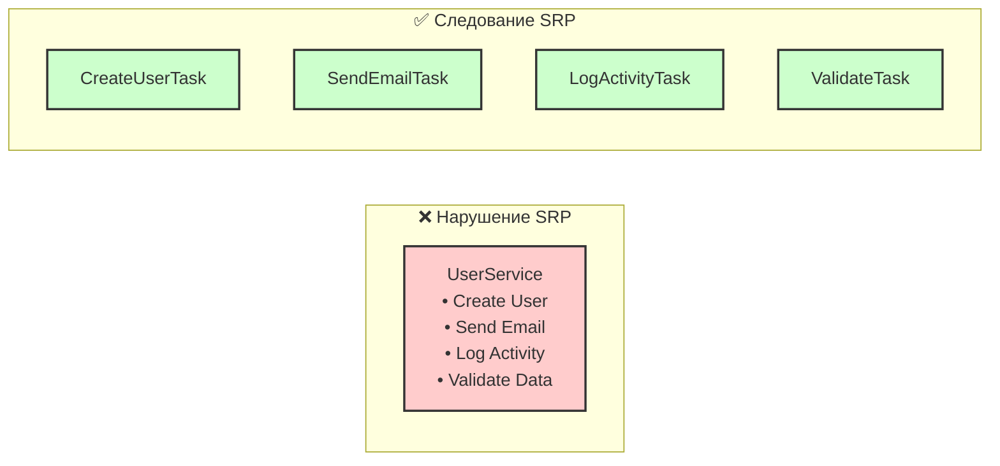
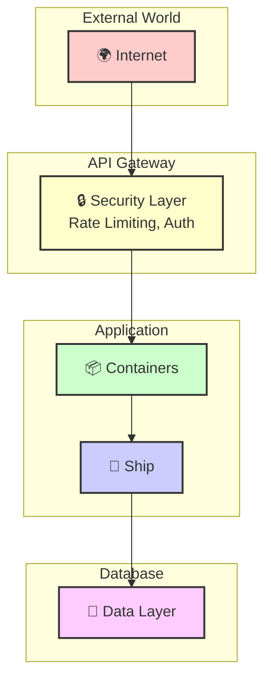
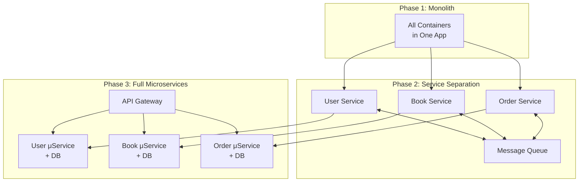

# 🏛️ Архитектура Porto - Детальное описание

## 📐 Архитектурные слои

Porto организует код в **два основных слоя**, каждый со своей ответственностью:



## 📦 Containers Layer (Слой контейнеров)

### 🎯 Назначение
Containers Layer содержит всю **бизнес-логику** приложения. Каждый контейнер - это независимый модуль, инкапсулирующий определённую функциональность.

### 📂 Структура контейнера

```
📦 Book/                        # Контейнер управления книгами
├── 📁 Actions/                 # Бизнес-операции
│   ├── CreateBookAction.py    # Создание книги
│   ├── UpdateBookAction.py    # Обновление книги
│   └── DeleteBookAction.py    # Удаление книги
├── 📁 Tasks/                   # Атомарные задачи
│   ├── CreateBookTask.py      # Задача создания
│   ├── FindBookTask.py        # Задача поиска
│   └── ValidateBookTask.py    # Задача валидации
├── 📁 Models/                  # Модели данных
│   └── Book.py                # Модель книги
├── 📁 UI/                      # Пользовательский интерфейс
│   ├── 📁 API/                # REST API
│   │   ├── Controllers/       # Контроллеры
│   │   ├── Routes/           # Маршруты
│   │   └── Transformers/     # Трансформеры данных
│   ├── 📁 CLI/               # Командная строка
│   └── 📁 Web/               # Веб-интерфейс
├── 📁 Data/                   # DTO и схемы
├── 📁 Exceptions/             # Исключения контейнера
├── 📁 Managers/               # Менеджеры и сервисы
└── Providers.py              # DI провайдеры
```

### 🔄 Sections (Секции)

Контейнеры группируются в **секции** для логической организации:

- **AppSection** - основная бизнес-логика приложения
- **VendorSection** - интеграции с внешними сервисами



## 🚢 Ship Layer (Слой корабля)

### 🎯 Назначение
Ship Layer содержит **инфраструктурный код**, общий для всех контейнеров. Он изолирует бизнес-логику от деталей фреймворка.

### 📂 Структура Ship

```
🚢 Ship/
├── 📁 Parents/              # Базовые классы
│   ├── Action.py           # Базовый Action
│   ├── Task.py            # Базовый Task
│   ├── Model.py           # Базовая Model
│   ├── Controller.py      # Базовый Controller
│   └── Repository.py      # Базовый Repository
├── 📁 Core/                # Ядро системы
│   ├── Database.py        # Подключение к БД
│   ├── Logging.py         # Логирование
│   └── Cache.py          # Кеширование
├── 📁 Configs/            # Конфигурации
│   └── App.py            # Настройки приложения
├── 📁 Providers/          # DI провайдеры
│   └── App.py            # Главный провайдер
├── 📁 Middleware/         # Middleware
│   ├── Auth.py           # Аутентификация
│   └── CORS.py           # CORS
├── 📁 Exceptions/         # Обработчики исключений
├── 📁 Commands/           # CLI команды
└── App.py                 # Фабрика приложения
```

### 🔧 Компоненты Ship Layer



## 🔄 Поток данных (Data Flow)

### 📥 Входящий запрос



### 🎯 Action-Task взаимодействие



## 🎨 Компоненты Porto

### 🎯 Main Components (Основные компоненты)

#### 1. Actions
**Назначение**: Orchestration слой, координирует выполнение Tasks

```python
class CreateBookAction(Action):
    """Создание новой книги"""
    
    def __init__(self, 
                 validate_task: ValidateBookTask,
                 create_task: CreateBookTask,
                 notify_task: NotifyTask):
        self.validate = validate_task
        self.create = create_task
        self.notify = notify_task
    
    async def run(self, data: BookDTO) -> Book:
        # 1. Валидация
        await self.validate.run(data)
        # 2. Создание
        book = await self.create.run(data)
        # 3. Уведомление
        await self.notify.run(book)
        return book
```

#### 2. Tasks
**Назначение**: Атомарные операции с единой ответственностью

```python
class CreateBookTask(Task):
    """Создание книги в БД"""
    
    async def run(self, data: BookDTO) -> Book:
        return await Book.insert(
            title=data.title,
            author=data.author,
            isbn=data.isbn
        )
```

#### 3. Models
**Назначение**: Представление данных и бизнес-правил

```python
class Book(Model, table=True):
    """Модель книги"""
    
    id: int = Integer(primary_key=True)
    title: str = Varchar(length=255)
    author: str = Varchar(length=100)
    isbn: str = Varchar(length=13, unique=True)
    created_at: datetime = Timestamp()
    
    def is_available(self) -> bool:
        """Бизнес-логика проверки доступности"""
        return not self.is_borrowed
```

#### 4. Controllers
**Назначение**: Обработка HTTP запросов

```python
class BookController(Controller):
    """Контроллер книг"""
    
    @post("/books")
    async def create(self, 
                     data: BookDTO,
                     action: CreateBookAction) -> Book:
        """Создание книги"""
        return await action.run(data)
```

### 🔧 Optional Components (Опциональные компоненты)

- **Repositories** - абстракция доступа к данным
- **Transformers** - преобразование данных для API
- **Validators** - валидация данных
- **Services** - внешние сервисы
- **Events** - обработка событий
- **Jobs** - фоновые задачи

## 🏗️ Принципы проектирования

### 1. Single Responsibility Principle (SRP)
Каждый компонент имеет одну причину для изменения:



### 2. Dependency Inversion Principle (DIP)
Зависимость от абстракций, а не от конкретных реализаций:

```python
# Ship/Parents/Repository.py
class Repository(ABC):
    @abstractmethod
    async def find(self, id: int): ...
    
    @abstractmethod
    async def save(self, entity): ...

# Containers/Book/Repositories/BookRepository.py
class BookRepository(Repository):
    async def find(self, id: int) -> Book:
        return await Book.objects.get(id=id)
    
    async def save(self, book: Book) -> Book:
        return await book.save()
```

### 3. Don't Repeat Yourself (DRY)
Переиспользование кода через наследование и композицию:

```python
# Ship/Parents/Action.py
class Action(ABC):
    """Базовый класс для всех Actions"""
    
    @abstractmethod
    async def run(self, *args, **kwargs):
        """Главный метод выполнения"""
        pass
    
    async def log(self, message: str):
        """Общий метод логирования"""
        logfire.info(message)
```

## 🔐 Безопасность и изоляция

### Изоляция слоёв


## 📊 Масштабирование

### От монолита к микросервисам



## 🎯 Преимущества архитектуры

### 📈 Масштабируемость
- Легко добавлять новые контейнеры
- Простое разделение на микросервисы
- Горизонтальное масштабирование

### 🧪 Тестируемость
- Изолированное тестирование компонентов
- Моки и стабы через DI
- Чёткие границы тестирования

### 🔧 Поддерживаемость
- Понятная структура кода
- Легко находить и исправлять баги
- Простое добавление новых функций

### 🚀 Производительность
- Асинхронное выполнение
- Оптимизация на уровне Tasks
- Кеширование результатов

## 📚 Следующие шаги

Изучите детали реализации:

1. [**Структура проекта**](03-project-structure.md) - файловая организация
2. [**Компоненты**](04-components.md) - детали каждого компонента
3. [**Примеры кода**](05-examples.md) - практическая реализация

---

<div align="center">

**🏛️ Porto Architecture - Build Clean, Scale Smart!**

[← Введение](01-introduction.md) | [Структура проекта →](03-project-structure.md)

</div>
