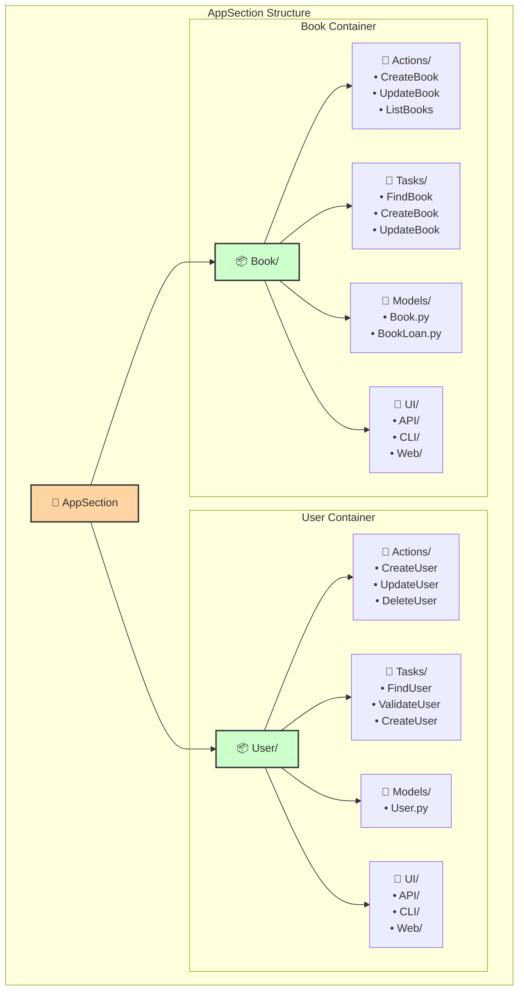
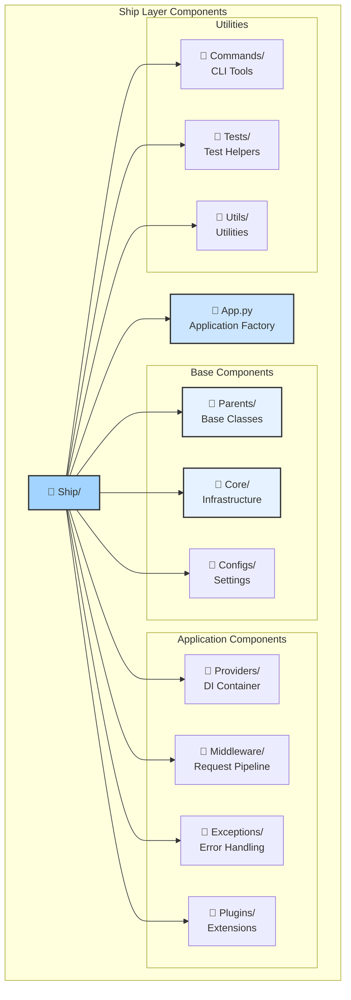
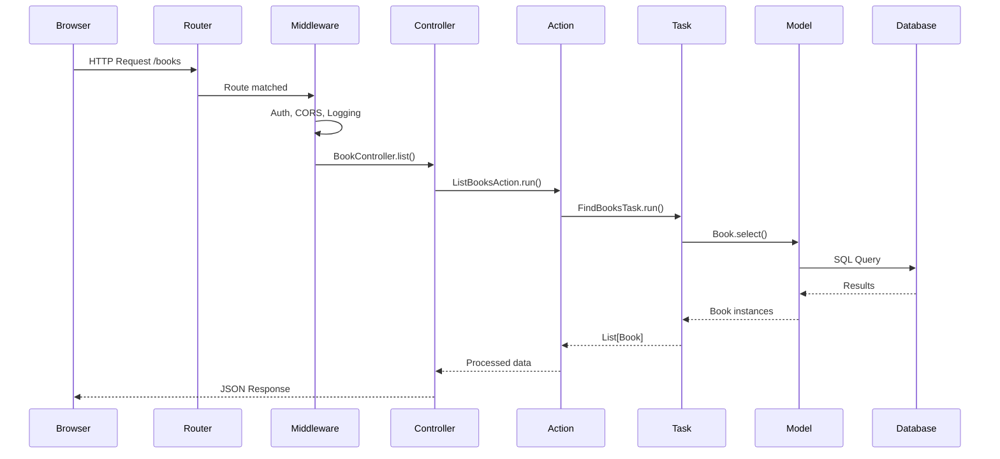
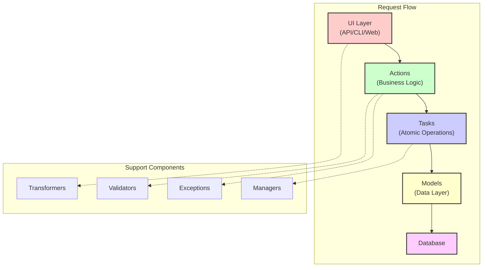

# 📁 Структура проекта Porto

## 🗂️ Обзор структуры

```
📦 template/                      # Корень проекта
├── 📁 src/                      # Исходный код приложения
│   ├── 📁 Containers/           # Бизнес-логика (Porto Containers)
│   │   ├── 📁 AppSection/      # Основные модули приложения
│   │   └── 📁 VendorSection/   # Внешние интеграции
│   ├── 📁 Ship/                # Инфраструктура (Porto Ship)
│   ├── 📄 Bootstrap.py          # Точка входа с auto-tracing
│   └── 📄 Main.py              # Альтернативная точка входа
├── 📁 data/                    # Данные приложения (SQLite)
├── 📁 docs/                    # Документация проекта
├── 📁 spec-kit/                # Porto Spec Kit (шаблоны, доки, скрипты)
├── 📁 examples/                # Примеры использования
├── 📄 piccolo_conf.py          # Конфигурация Piccolo ORM
├── 📄 pyproject.toml           # Зависимости и настройки
├── 📄 docker-compose.yml       # Docker конфигурация
├── 📄 Dockerfile               # Docker образ
├── 📄 Makefile                 # Команды автоматизации
└── 📄 README.md               # Описание проекта
```

## 📦 Containers Layer - Детальная структура

### 🎯 AppSection - Основная бизнес-логика



### 📦 Структура одного контейнера

```
📦 Book/                          # Контейнер управления книгами
├── 📄 __init__.py               # Инициализация контейнера
├── 📄 _Init__.py                # Авто-импорты (опционально)
├── 📁 Actions/                  # Бизнес-операции
│   ├── 📄 __init__.py
│   ├── 📄 CreateBook.py        # Action создания книги
│   ├── 📄 UpdateBook.py        # Action обновления книги
│   ├── 📄 DeleteBook.py        # Action удаления книги
│   ├── 📄 GetBook.py          # Action получения книги
│   └── 📄 ListBooks.py        # Action списка книг
├── 📁 Tasks/                   # Атомарные задачи
│   ├── 📄 __init__.py
│   ├── 📄 CreateBook.py       # Task создания в БД
│   ├── 📄 FindBook.py         # Task поиска
│   ├── 📄 UpdateBook.py       # Task обновления
│   └── 📄 DeleteBook.py       # Task удаления
├── 📁 Models/                  # Модели данных
│   ├── 📄 __init__.py
│   ├── 📄 Book.py             # Основная модель книги
│   └── 📄 BookLoan.py         # Модель аренды книги
├── 📁 Data/                    # DTO и схемы
│   ├── 📄 __init__.py
│   ├── 📄 BookDTO.py          # Data Transfer Objects
│   └── 📄 BookSchema.py       # Pydantic схемы
├── 📁 Exceptions/              # Исключения контейнера
│   ├── 📄 __init__.py
│   └── 📄 BookExceptions.py   # Специфичные исключения
├── 📁 Managers/                # Менеджеры и сервисы
│   ├── 📄 __init__.py
│   ├── 📄 BookServerManager.py # Серверная логика
│   └── 📄 UserClientManager.py # Клиентская логика
├── 📁 UI/                      # Пользовательский интерфейс
│   ├── 📁 API/                # REST API
│   │   ├── 📁 Controllers/    # HTTP контроллеры
│   │   │   └── 📄 BookController.py
│   │   ├── 📁 Routes/        # Маршруты
│   │   │   └── 📄 book_routes.py
│   │   └── 📁 Transformers/  # Преобразователи данных
│   │       └── 📄 BookTransformer.py
│   ├── 📁 CLI/               # Интерфейс командной строки
│   │   └── 📄 book_commands.py
│   └── 📁 Web/               # Веб-интерфейс
│       └── 📄 book_views.py
├── 📁 migrations/             # Миграции Piccolo
│   └── 📄 _Init__.py
├── 📄 PiccoloApp.py          # Конфигурация Piccolo для контейнера
├── 📄 Providers.py           # DI провайдеры контейнера
└── 📄 shortcuts.py           # Вспомогательные функции
```

### 🔌 VendorSection - Внешние интеграции

```
📁 VendorSection/
├── 📦 Payment/                 # Интеграция с платежами
│   ├── 📁 Models/
│   │   ├── 📄 Payment.py     # Модель платежа
│   │   └── 📄 PaymentMethod.py # Методы оплаты
│   ├── 📄 PiccoloApp.py
│   └── 📄 Providers.py
└── 📦 Notification/           # Система уведомлений
    ├── 📁 Models/
    │   └── 📄 Notification.py # Модель уведомления
    ├── 📄 PiccoloApp.py
    └── 📄 Providers.py
```

## 🚢 Ship Layer - Детальная структура



### 📂 Ship структура файлов

```
🚢 Ship/
├── 📄 __init__.py              # Инициализация Ship
├── 📄 App.py                   # Фабрика приложения
├── 📁 Parents/                 # Базовые классы
│   ├── 📄 __init__.py
│   ├── 📄 Action.py           # Базовый класс Action
│   ├── 📄 Task.py             # Базовый класс Task
│   ├── 📄 Model.py            # Базовый класс Model
│   ├── 📄 Controller.py       # Базовый класс Controller
│   ├── 📄 Repository.py       # Базовый класс Repository
│   ├── 📄 Manager.py          # Базовый класс Manager
│   ├── 📄 Exception.py        # Базовый класс Exception
│   └── 📄 Transformer.py      # Базовый класс Transformer
├── 📁 Core/                   # Ядро системы
│   ├── 📄 __init__.py
│   ├── 📄 Database.py         # Конфигурация БД
│   └── 📄 Logging.py          # Конфигурация логирования
├── 📁 Configs/                # Конфигурации
│   ├── 📄 __init__.py
│   └── 📄 App.py             # Настройки приложения
├── 📁 Providers/             # DI провайдеры
│   ├── 📄 __init__.py
│   └── 📄 App.py            # Главный провайдер
├── 📁 Middleware/            # Middleware компоненты
│   └── 📄 __init__.py
├── 📁 Exceptions/            # Обработчики исключений
│   ├── 📄 __init__.py
│   └── 📄 Handlers.py       # Глобальные обработчики
├── 📁 Plugins/               # Плагины
│   ├── 📄 __init__.py
│   └── 📄 LogfirePlugin.py  # Интеграция Logfire
├── 📁 Commands/              # CLI команды
│   └── 📄 __init__.py
├── 📁 Tests/                 # Тестовые утилиты
│   └── 📄 __init__.py
└── 📁 Utils/                 # Вспомогательные утилиты
    └── 📄 __init__.py
```

## 🎯 Назначение директорий

### 📦 Containers/

| Директория | Назначение | Пример |
|------------|-----------|--------|
| **Actions/** | Orchestration слой, координация Tasks | `CreateOrderAction` |
| **Tasks/** | Атомарные операции | `ValidatePaymentTask` |
| **Models/** | Модели данных и бизнес-правила | `User`, `Book` |
| **UI/API/** | REST API endpoints | `BookController` |
| **UI/CLI/** | Команды консоли | `create_user_command` |
| **UI/Web/** | Web views и templates | `book_list_view` |
| **Data/** | DTO и схемы валидации | `UserDTO`, `BookSchema` |
| **Exceptions/** | Специфичные исключения | `BookNotFoundException` |
| **Managers/** | Бизнес-сервисы | `EmailManager` |
| **migrations/** | Миграции БД | `001_create_books.py` |

### 🚢 Ship/

| Директория | Назначение | Пример |
|------------|-----------|--------|
| **Parents/** | Базовые классы для наследования | `Action`, `Task`, `Model` |
| **Core/** | Инфраструктурные компоненты | `Database`, `Cache` |
| **Configs/** | Конфигурации приложения | `Settings`, `AppConfig` |
| **Providers/** | DI контейнеры и провайдеры | `AppProvider` |
| **Middleware/** | HTTP middleware | `AuthMiddleware`, `CORSMiddleware` |
| **Exceptions/** | Глобальная обработка ошибок | `GlobalExceptionHandler` |
| **Plugins/** | Расширения и плагины | `LogfirePlugin` |
| **Commands/** | Системные CLI команды | `migrate`, `seed` |
| **Utils/** | Вспомогательные функции | `hash_password`, `generate_uuid` |

## 📄 Важные файлы

### 🚀 Точки входа

```python
# src/Bootstrap.py - Главная точка входа с auto-tracing
"""
Инициализирует Logfire перед импортом модулей
для автоматической трассировки вызовов
"""

# src/Main.py - Альтернативная точка входа
"""
Простой запуск без auto-tracing
для разработки и отладки
"""
```

### ⚙️ Конфигурационные файлы

```toml
# pyproject.toml - Зависимости проекта (установка через uv/pip)
[project]
name = "porto-litestar"
dependencies = [
    "litestar>=2.12.0",
    "piccolo>=1.22.0",
    "piccolo[sqlite]",
    "dishka>=1.4.0",
    "logfire[sqlite3]>=2.7.0",
    "logfire[httpx]",
    "logfire[asgi]",
    "uvicorn[standard]>=0.32.0",
]

# piccolo_conf.py - Конфигурация ORM
DB = SQLiteEngine(
    config={"database": "data/app.db"}
)
APP_REGISTRY = AppRegistry(
    apps=[
        "src.Containers.AppSection.Book.PiccoloApp",
        "src.Containers.AppSection.User.PiccoloApp",
        "src.Containers.VendorSection.Payment.PiccoloApp",
        "src.Containers.VendorSection.Notification.PiccoloApp",
    ]
)
```

### 🐳 Docker файлы

```yaml
# docker-compose.yml
services:
  app:
    build: .
    ports:
      - "8000:8000"
    volumes:
      - ./data:/app/data
    environment:
      - APP_ENV=development
```

## 🔄 Жизненный цикл запроса



## 📊 Связи между компонентами



## 🏗️ Создание нового контейнера

### Шаг 1: Создать структуру

```bash
# Создание нового контейнера Order
mkdir -p src/Containers/AppSection/Order/{Actions,Tasks,Models,UI/API/Controllers,Data,Exceptions}
```

### Шаг 2: Создать базовые файлы

```python
# src/Containers/AppSection/Order/Models/Order.py
from src.Ship.Parents.Model import Model

class Order(Model, table=True):
    # Определение модели
    pass

# src/Containers/AppSection/Order/Actions/CreateOrder.py
from src.Ship.Parents.Action import Action

class CreateOrderAction(Action):
    async def run(self, data):
        # Бизнес-логика
        pass
```

### Шаг 3: Зарегистрировать в DI

```python
# src/Containers/AppSection/Order/Providers.py
from dishka import Provider, Scope

class OrderProvider(Provider):
    # Регистрация зависимостей
    pass
```

## 📝 Правила именования

### 📦 Containers
- **PascalCase** для имён контейнеров: `User`, `Book`, `Payment`
- **Singular** форма: `User`, не `Users`

### 📄 Файлы компонентов
- **PascalCase** с суффиксом типа: `CreateUserAction.py`, `FindBookTask.py`
- **Описательные имена**: `ValidatePaymentTask`, не просто `ValidateTask`

### 🐍 Python классы
```python
# ✅ Правильно
class CreateBookAction(Action): ...
class FindUserTask(Task): ...
class BookNotFoundException(Exception): ...

# ❌ Неправильно
class CreateBook: ...  # Нет суффикса
class Find(Task): ...  # Неописательное имя
class BookError: ...   # Неспецифичное имя
```

## 🔍 Навигация по проекту

### Быстрый поиск компонентов

```bash
# Найти все Actions
find src -name "*Action.py"

# Найти все Tasks
find src -name "*Task.py"

# Найти все Models
find src -path "*/Models/*.py"
```

### Импорты между контейнерами

```python
# ✅ Правильно - через Actions
from src.Containers.AppSection.User.Actions import GetUserAction

# ❌ Неправильно - прямой доступ к Tasks
from src.Containers.AppSection.User.Tasks import FindUserTask
```

## 📚 Следующие шаги

1. [**Компоненты Porto**](04-components.md) - детальное описание каждого компонента
2. [**Примеры кода**](05-examples.md) - практические примеры реализации
3. [**Начало работы**](07-getting-started.md) - запуск проекта

---

<div align="center">

**📁 Organized Code is Happy Code!**

[← Архитектура](02-architecture.md) | [Компоненты →](04-components.md)

</div>
