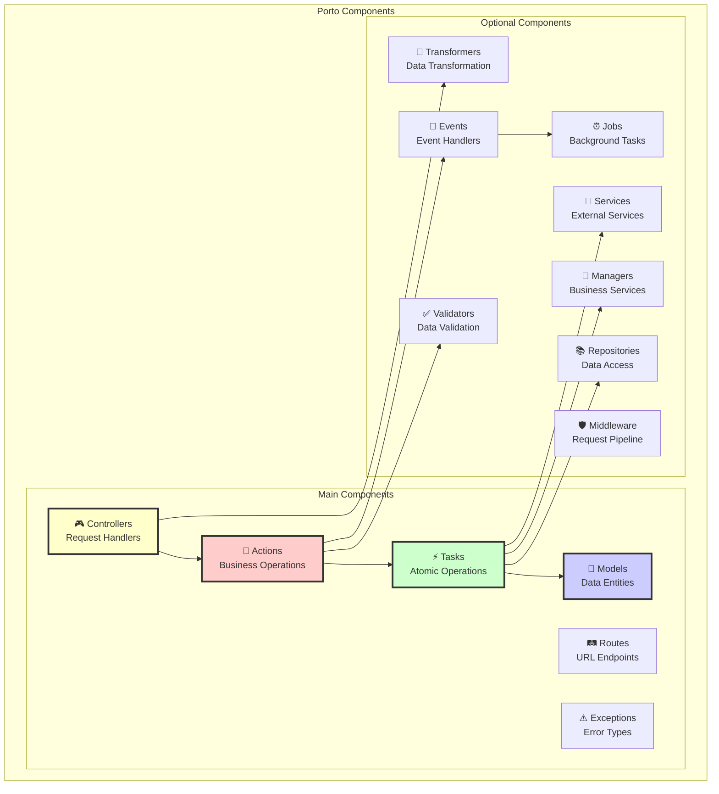
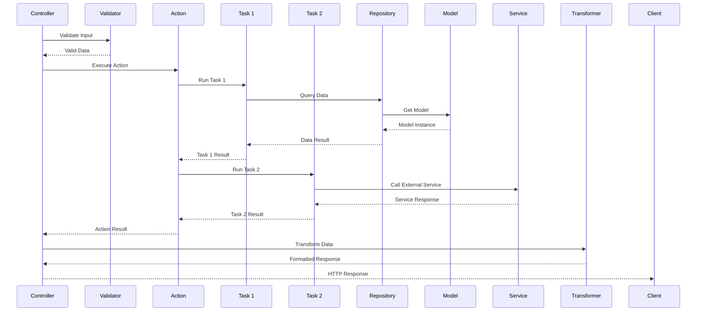

# 🧩 Компоненты Porto Architecture

## 📊 Обзор компонентов



## 🎯 Main Components (Основные компоненты)

### 1. Actions 🎯

**Назначение**: Orchestration слой, координирует выполнение бизнес-логики

```python
# src/Containers/AppSection/Book/Actions/CreateBookAction.py
from src.Ship.Parents.Action import Action
from src.Containers.AppSection.Book.Tasks import (
    ValidateBookDataTask,
    CheckISBNUniqueTask,
    CreateBookTask,
    NotifyLibrariansTask
)

class CreateBookAction(Action):
    """
    Action для создания новой книги в библиотеке.
    Координирует весь процесс создания.
    """
    
    def __init__(self,
                 validate_task: ValidateBookDataTask,
                 check_isbn_task: CheckISBNUniqueTask,
                 create_task: CreateBookTask,
                 notify_task: NotifyLibrariansTask):
        self.validate = validate_task
        self.check_isbn = check_isbn_task
        self.create = create_task
        self.notify = notify_task
    
    async def run(self, title: str, author: str, isbn: str) -> Book:
        """
        Выполняет полный цикл создания книги.
        
        Steps:
        1. Валидация входных данных
        2. Проверка уникальности ISBN
        3. Создание книги в БД
        4. Отправка уведомлений
        """
        # 1. Валидация
        await self.validate.run(title, author, isbn)
        
        # 2. Проверка ISBN
        await self.check_isbn.run(isbn)
        
        # 3. Создание
        book = await self.create.run(title, author, isbn)
        
        # 4. Уведомление (не блокирующее)
        await self.notify.run(book)
        
        return book
```

#### Правила для Actions:
- ✅ **ДОЛЖНЫ** наследоваться от `Action`
- ✅ **ДОЛЖНЫ** иметь метод `run()`
- ✅ **ДОЛЖНЫ** использовать dependency injection
- ✅ **МОГУТ** вызывать несколько Tasks
- ❌ **НЕ ДОЛЖНЫ** содержать бизнес-логику напрямую
- ❌ **НЕ ДОЛЖНЫ** работать с БД напрямую

### 2. Tasks ⚡

**Назначение**: Атомарные операции с единой ответственностью

```python
# src/Containers/AppSection/Book/Tasks/CreateBookTask.py
from src.Ship.Parents.Task import Task
from src.Containers.AppSection.Book.Models import Book

class CreateBookTask(Task):
    """
    Task для создания книги в базе данных.
    Единая ответственность: сохранение книги.
    """
    
    async def run(self, title: str, author: str, isbn: str) -> Book:
        """Создаёт и сохраняет книгу в БД"""
        book = Book(
            title=title,
            author=author,
            isbn=isbn
        )
        await book.save()
        return book

# src/Containers/AppSection/Book/Tasks/CheckISBNUniqueTask.py
class CheckISBNUniqueTask(Task):
    """Проверяет уникальность ISBN"""
    
    async def run(self, isbn: str) -> None:
        exists = await Book.exists().where(Book.isbn == isbn)
        if exists:
            raise BookAlreadyExistsException(f"Book with ISBN {isbn} already exists")
```

#### Правила для Tasks:
- ✅ **ДОЛЖНЫ** наследоваться от `Task`
- ✅ **ДОЛЖНЫ** иметь единственный метод `run()`
- ✅ **ДОЛЖНЫ** выполнять одну операцию
- ✅ **МОГУТ** работать с моделями и БД
- ❌ **НЕ ДОЛЖНЫ** вызывать другие Tasks
- ❌ **НЕ ДОЛЖНЫ** содержать сложную бизнес-логику

### 3. Models 💾

**Назначение**: Представление данных и бизнес-правил

```python
# src/Containers/AppSection/Book/Models/Book.py
from piccolo.table import Table
from piccolo.columns import Varchar, Integer, Boolean, Timestamp
from datetime import datetime
from src.Ship.Parents.Model import Model

class Book(Model, table=True):
    """
    Модель книги в библиотеке.
    Содержит данные и бизнес-правила.
    """
    # Поля таблицы
    id = Integer(primary_key=True)
    title = Varchar(length=255, required=True)
    author = Varchar(length=100, required=True)
    isbn = Varchar(length=13, unique=True, required=True)
    pages = Integer(default=0)
    is_available = Boolean(default=True)
    created_at = Timestamp(default=datetime.now)
    updated_at = Timestamp(default=datetime.now, auto_update=True)
    
    # Бизнес-методы
    def can_be_borrowed(self) -> bool:
        """Проверяет, можно ли взять книгу"""
        return self.is_available and not self.is_damaged
    
    def mark_as_borrowed(self) -> None:
        """Помечает книгу как взятую"""
        self.is_available = False
        self.last_borrowed_at = datetime.now()
    
    def calculate_late_fee(self, return_date: datetime) -> float:
        """Рассчитывает штраф за просрочку"""
        if not self.due_date:
            return 0.0
        
        days_late = (return_date - self.due_date).days
        return max(0, days_late * 0.50)  # $0.50 per day
    
    # Валидация
    def validate(self) -> None:
        """Валидирует данные модели"""
        if len(self.isbn) not in [10, 13]:
            raise ValueError("ISBN must be 10 or 13 characters")
        
        if self.pages < 0:
            raise ValueError("Pages cannot be negative")
```

#### Правила для Models:
- ✅ **ДОЛЖНЫ** наследоваться от `Model` и `Table`
- ✅ **ДОЛЖНЫ** определять структуру таблицы
- ✅ **МОГУТ** содержать бизнес-методы
- ✅ **МОГУТ** содержать валидацию
- ❌ **НЕ ДОЛЖНЫ** содержать сложную бизнес-логику
- ❌ **НЕ ДОЛЖНЫ** зависеть от других слоёв

### 4. Controllers 🎮

**Назначение**: Обработка HTTP запросов

```python
# src/Containers/AppSection/Book/UI/API/Controllers/BookController.py
from litestar import Controller as LitestarController, get, post, put, delete
from litestar.di import Provide
from src.Ship.Parents.Controller import Controller
from src.Containers.AppSection.Book.Actions import (
    CreateBookAction,
    UpdateBookAction,
    DeleteBookAction,
    GetBookAction,
    ListBooksAction
)

class BookController(Controller):
    """
    REST API контроллер для управления книгами.
    Обрабатывает HTTP запросы и делегирует Actions.
    """
    path = "/books"
    tags = ["Books"]
    
    @post("/")
    async def create(self,
                     data: BookCreateDTO,
                     action: CreateBookAction) -> BookResponse:
        """
        Создание новой книги.
        POST /books
        """
        book = await action.run(
            title=data.title,
            author=data.author,
            isbn=data.isbn
        )
        return BookResponse.from_model(book)
    
    @get("/{book_id:int}")
    async def get(self,
                  book_id: int,
                  action: GetBookAction) -> BookResponse:
        """
        Получение книги по ID.
        GET /books/{book_id}
        """
        book = await action.run(book_id)
        return BookResponse.from_model(book)
    
    @get("/")
    async def list(self,
                   page: int = 1,
                   limit: int = 20,
                   action: ListBooksAction) -> BookListResponse:
        """
        Получение списка книг с пагинацией.
        GET /books?page=1&limit=20
        """
        books, total = await action.run(page, limit)
        return BookListResponse(
            items=[BookResponse.from_model(b) for b in books],
            total=total,
            page=page,
            limit=limit
        )
    
    @put("/{book_id:int}")
    async def update(self,
                     book_id: int,
                     data: BookUpdateDTO,
                     action: UpdateBookAction) -> BookResponse:
        """
        Обновление книги.
        PUT /books/{book_id}
        """
        book = await action.run(book_id, data.dict(exclude_unset=True))
        return BookResponse.from_model(book)
    
    @delete("/{book_id:int}")
    async def delete(self,
                     book_id: int,
                     action: DeleteBookAction) -> None:
        """
        Удаление книги.
        DELETE /books/{book_id}
        """
        await action.run(book_id)
```

#### Правила для Controllers:
- ✅ **ДОЛЖНЫ** наследоваться от `Controller`
- ✅ **ДОЛЖНЫ** обрабатывать HTTP запросы
- ✅ **ДОЛЖНЫ** использовать Actions для бизнес-логики
- ✅ **МОГУТ** валидировать входные данные
- ❌ **НЕ ДОЛЖНЫ** содержать бизнес-логику
- ❌ **НЕ ДОЛЖНЫ** работать с БД напрямую

### 5. Routes 🛤️

**Назначение**: Определение URL endpoints

```python
# src/Containers/AppSection/Book/UI/API/Routes/book_routes.py
from litestar import Router
from src.Containers.AppSection.Book.UI.API.Controllers import BookController

# Создание роутера для книг
book_router = Router(
    path="/api/v1",
    route_handlers=[BookController],
    tags=["Books API"]
)

# Дополнительные маршруты можно добавить здесь
# Например, специальные endpoints
```

### 6. Exceptions ⚠️

**Назначение**: Специфичные исключения контейнера

```python
# src/Containers/AppSection/Book/Exceptions/BookExceptions.py
from src.Ship.Parents.Exception import (
    NotFoundException,
    ValidationException,
    BusinessLogicException
)

class BookNotFoundException(NotFoundException):
    """Книга не найдена"""
    def __init__(self, book_id: int):
        super().__init__(f"Book with ID {book_id} not found")
        self.book_id = book_id

class BookAlreadyExistsException(ValidationException):
    """Книга с таким ISBN уже существует"""
    def __init__(self, isbn: str):
        super().__init__(f"Book with ISBN {isbn} already exists")
        self.isbn = isbn

class BookNotAvailableException(BusinessLogicException):
    """Книга недоступна для выдачи"""
    def __init__(self, book_id: int, reason: str):
        super().__init__(f"Book {book_id} is not available: {reason}")
        self.book_id = book_id
        self.reason = reason

class InvalidISBNException(ValidationException):
    """Некорректный ISBN"""
    def __init__(self, isbn: str):
        super().__init__(f"Invalid ISBN format: {isbn}")
        self.isbn = isbn
```

## 🔧 Optional Components (Опциональные компоненты)

### 1. Repositories 📚

**Назначение**: Абстракция доступа к данным

```python
# src/Containers/AppSection/Book/Repositories/BookRepository.py
from src.Ship.Parents.Repository import Repository
from src.Containers.AppSection.Book.Models import Book
from typing import List, Optional

class BookRepository(Repository):
    """
    Репозиторий для работы с книгами.
    Инкапсулирует все запросы к БД.
    """
    model = Book
    
    async def find_by_isbn(self, isbn: str) -> Optional[Book]:
        """Поиск книги по ISBN"""
        return await Book.objects.where(
            Book.isbn == isbn
        ).first()
    
    async def find_available(self, limit: int = 10) -> List[Book]:
        """Получение доступных книг"""
        return await Book.select().where(
            Book.is_available == True
        ).limit(limit)
    
    async def find_by_author(self, author: str) -> List[Book]:
        """Поиск книг по автору"""
        return await Book.select().where(
            Book.author.ilike(f"%{author}%")
        )
    
    async def mark_as_borrowed(self, book_id: int, user_id: int) -> Book:
        """Помечает книгу как взятую"""
        book = await self.find_or_fail(book_id)
        book.is_available = False
        book.borrowed_by_id = user_id
        await book.save()
        return book
```

### 2. Transformers 🔄

**Назначение**: Преобразование данных для API

```python
# src/Containers/AppSection/Book/UI/API/Transformers/BookTransformer.py
from src.Ship.Parents.Transformer import Transformer
from src.Containers.AppSection.Book.Models import Book
from typing import Dict, Any

class BookTransformer(Transformer):
    """
    Преобразует модель Book для API ответов.
    Форматирует и скрывает внутренние данные.
    """
    
    def transform(self, book: Book) -> Dict[str, Any]:
        """Базовое преобразование"""
        return {
            "id": book.id,
            "title": book.title,
            "author": book.author,
            "isbn": book.isbn,
            "pages": book.pages,
            "is_available": book.is_available,
            "created_at": book.created_at.isoformat(),
        }
    
    def transform_detailed(self, book: Book) -> Dict[str, Any]:
        """Детальное преобразование с дополнительными данными"""
        data = self.transform(book)
        data.update({
            "description": book.description,
            "publisher": book.publisher,
            "publication_year": book.publication_year,
            "categories": self.transform_categories(book.categories),
            "reviews": self.transform_reviews(book.reviews),
            "average_rating": book.calculate_average_rating(),
        })
        return data
    
    def transform_collection(self, books: List[Book]) -> List[Dict[str, Any]]:
        """Преобразование коллекции"""
        return [self.transform(book) for book in books]
```

### 3. Validators ✅

**Назначение**: Валидация данных

```python
# src/Containers/AppSection/Book/Validators/BookValidator.py
from pydantic import BaseModel, validator
from typing import Optional

class BookValidator(BaseModel):
    """Валидатор данных книги"""
    
    title: str
    author: str
    isbn: str
    pages: Optional[int] = 0
    
    @validator('title')
    def validate_title(cls, v):
        if len(v) < 1 or len(v) > 255:
            raise ValueError("Title must be between 1 and 255 characters")
        return v
    
    @validator('isbn')
    def validate_isbn(cls, v):
        # Remove hyphens and spaces
        clean_isbn = v.replace('-', '').replace(' ', '')
        
        if len(clean_isbn) not in [10, 13]:
            raise ValueError("ISBN must be 10 or 13 digits")
        
        if not clean_isbn.isdigit():
            raise ValueError("ISBN must contain only digits")
        
        # Validate ISBN checksum
        if len(clean_isbn) == 10:
            if not cls._validate_isbn10(clean_isbn):
                raise ValueError("Invalid ISBN-10 checksum")
        else:
            if not cls._validate_isbn13(clean_isbn):
                raise ValueError("Invalid ISBN-13 checksum")
        
        return clean_isbn
    
    @staticmethod
    def _validate_isbn10(isbn: str) -> bool:
        """Validates ISBN-10 checksum"""
        total = sum((i + 1) * int(digit) for i, digit in enumerate(isbn[:-1]))
        check = (11 - (total % 11)) % 11
        return str(check) == isbn[-1] or (check == 10 and isbn[-1] == 'X')
    
    @staticmethod
    def _validate_isbn13(isbn: str) -> bool:
        """Validates ISBN-13 checksum"""
        total = sum(
            int(digit) * (3 if i % 2 else 1)
            for i, digit in enumerate(isbn[:-1])
        )
        check = (10 - (total % 10)) % 10
        return str(check) == isbn[-1]
```

### 4. Managers 👔

**Назначение**: Бизнес-сервисы и менеджеры

```python
# src/Containers/AppSection/Book/Managers/BookInventoryManager.py
from src.Ship.Parents.Manager import Manager
from typing import List, Dict, Any

class BookInventoryManager(Manager):
    """
    Менеджер инвентаря книг.
    Управляет складскими операциями.
    """
    
    def __init__(self, book_repository: BookRepository):
        self.repository = book_repository
    
    async def check_availability(self, book_ids: List[int]) -> Dict[int, bool]:
        """Проверяет доступность нескольких книг"""
        books = await self.repository.find_by_ids(book_ids)
        return {
            book.id: book.is_available
            for book in books
        }
    
    async def reserve_books(self, book_ids: List[int], user_id: int) -> List[Book]:
        """Резервирует книги для пользователя"""
        reserved = []
        for book_id in book_ids:
            book = await self.repository.find(book_id)
            if book and book.is_available:
                book.is_available = False
                book.reserved_by = user_id
                book.reserved_until = datetime.now() + timedelta(hours=24)
                await book.save()
                reserved.append(book)
        return reserved
    
    async def calculate_inventory_value(self) -> float:
        """Рассчитывает общую стоимость инвентаря"""
        books = await self.repository.all()
        return sum(book.price for book in books if book.price)
```

### 5. Services 🔧

**Назначение**: Интеграция с внешними сервисами

```python
# src/Containers/AppSection/Book/Services/ISBNService.py
import httpx
from typing import Optional, Dict, Any

class ISBNService:
    """
    Сервис для работы с внешним API ISBN.
    Получает метаданные книги по ISBN.
    """
    
    def __init__(self):
        self.base_url = "https://api.isbn-database.com"
        self.client = httpx.AsyncClient()
    
    async def fetch_book_metadata(self, isbn: str) -> Optional[Dict[str, Any]]:
        """Получает метаданные книги из внешнего API"""
        try:
            response = await self.client.get(
                f"{self.base_url}/book/{isbn}",
                headers={"Authorization": f"Bearer {settings.isbn_api_key}"}
            )
            
            if response.status_code == 200:
                data = response.json()
                return {
                    "title": data.get("title"),
                    "author": data.get("authors", [{}])[0].get("name"),
                    "publisher": data.get("publisher"),
                    "publication_year": data.get("year"),
                    "pages": data.get("pages"),
                    "description": data.get("description"),
                    "cover_url": data.get("cover_url"),
                }
            return None
            
        except Exception as e:
            logfire.error(f"Failed to fetch ISBN metadata: {e}")
            return None
    
    async def validate_isbn(self, isbn: str) -> bool:
        """Проверяет существование ISBN во внешней БД"""
        metadata = await self.fetch_book_metadata(isbn)
        return metadata is not None
```

## 📋 Взаимодействие компонентов



## 🏗️ Создание новых компонентов

### Шаблон Action

```python
# Template: src/Containers/AppSection/{Container}/Actions/{Name}Action.py
from src.Ship.Parents.Action import Action
from typing import Any

class {Name}Action(Action):
    """
    Описание того, что делает Action.
    """
    
    def __init__(self, 
                 # Inject required tasks
                 task1: Task1,
                 task2: Task2):
        self.task1 = task1
        self.task2 = task2
    
    async def run(self, *args, **kwargs) -> Any:
        """
        Главный метод выполнения Action.
        
        Args:
            args: Позиционные аргументы
            kwargs: Именованные аргументы
            
        Returns:
            Результат выполнения Action
        """
        # Step 1: First task
        result1 = await self.task1.run(...)
        
        # Step 2: Second task
        result2 = await self.task2.run(...)
        
        # Return final result
        return result2
```

### Шаблон Task

```python
# Template: src/Containers/AppSection/{Container}/Tasks/{Name}Task.py
from src.Ship.Parents.Task import Task
from typing import Any

class {Name}Task(Task):
    """
    Описание единственной ответственности Task.
    """
    
    async def run(self, *args, **kwargs) -> Any:
        """
        Выполняет одну атомарную операцию.
        
        Args:
            args: Входные параметры
            
        Returns:
            Результат операции
        """
        # Single responsibility implementation
        pass
```

## 📚 Следующие шаги

1. [**Примеры кода**](05-examples.md) - практические примеры реализации
2. [**Технологии**](06-technologies.md) - используемые фреймворки
3. [**Best Practices**](08-best-practices.md) - лучшие практики

---

<div align="center">

**🧩 Components: The Building Blocks of Clean Architecture!**

[← Структура проекта](03-project-structure.md) | [Примеры кода →](05-examples.md)

</div>
