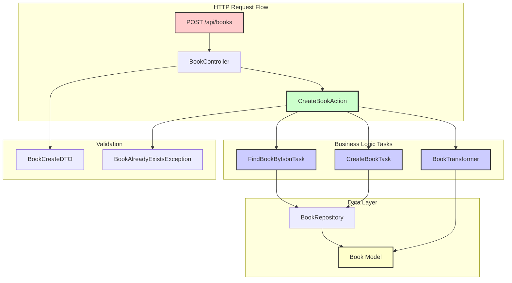

# 💡 Примеры кода Porto Architecture

## 📚 Пример: Система управления библиотекой

Рассмотрим полный пример реализации функционала **"Создание книги"** с использованием всех компонентов Porto.

### 📋 Требования
1. Валидация входных данных книги
2. Проверка уникальности ISBN
3. Создание книги в базе данных
4. Преобразование модели в DTO
5. Логирование операций

### 🏗️ Архитектура решения



## 🎯 1. Action - Orchestration Layer

```python
# src/Containers/AppSection/Book/Actions/CreateBookAction.py
from src.Containers.AppSection.Book.Data.Dto import (
    BookCreateDTO,
    BookDTO,
)
from src.Containers.AppSection.Book.Exceptions import BookAlreadyExistsException
from src.Containers.AppSection.Book.UI.API.Transformers import BookTransformer
from src.Containers.AppSection.Book.Tasks import CreateBookTask, FindBookByIsbnTask
from src.Ship.Parents import Action

class CreateBookAction(Action[BookCreateDTO, BookDTO]):
    """Action for creating a book."""

    def __init__(
        self,
        find_by_isbn_task: FindBookByIsbnTask,
        create_book_task: CreateBookTask,
        transformer: BookTransformer,
    ) -> None:
        """Initialize action.

        Args:
            find_by_isbn_task: Task for finding book by ISBN
            create_book_task: Task for creating book
            transformer: Book transformer
        """
        self.find_by_isbn_task = find_by_isbn_task
        self.create_book_task = create_book_task
        self.transformer = transformer

    async def run(self, data: BookCreateDTO) -> BookDTO:
        """Create a new book.

        Args:
            data: Book creation data

        Returns:
            Created book DTO

        Raises:
            BookAlreadyExistsException: If book with ISBN already exists
        """
        # Check if book with ISBN already exists
        existing_book = await self.find_by_isbn_task.run(data.isbn)
        if existing_book:
            raise BookAlreadyExistsException(isbn=data.isbn)

        # Create the book
        book = await self.create_book_task.run(data)

        # Transform to DTO
        return self.transformer.transform(book)
```

## ⚡ 2. Tasks - Atomic Operations

### Task 1: Поиск книги по ISBN

```python
# src/Containers/AppSection/Book/Tasks/FindBook.py
from uuid import UUID

from src.Containers.AppSection.Book.Data.Repositories import BookRepository
from src.Containers.AppSection.Book.Models import Book
from src.Ship.Parents import Task

class FindBookByIsbnTask(Task[str, Book | None]):
    """Task for finding a book by ISBN."""

    def __init__(self, repository: BookRepository) -> None:
        """Initialize task.

        Args:
            repository: Book repository
        """
        self.repository = repository

    async def run(self, data: str) -> Book | None:
        """Find book by ISBN.

        Args:
            data: Book ISBN

        Returns:
            Book or None
        """
        return await self.repository.find_by_isbn(data)
```

### Task 2: Создание книги

```python
# src/Containers/AppSection/Book/Tasks/CreateBook.py
from datetime import datetime
from uuid import uuid4

from src.Containers.AppSection.Book.Data.Dto import BookCreateDTO
from src.Containers.AppSection.Book.Data.Repositories import BookRepository
from src.Containers.AppSection.Book.Models import Book
from src.Ship.Parents import Task

class CreateBookTask(Task[BookCreateDTO, Book]):
    """Task for creating a book."""

    def __init__(self, repository: BookRepository) -> None:
        """Initialize task.

        Args:
            repository: Book repository
        """
        self.repository = repository

    async def run(self, data: BookCreateDTO) -> Book:
        """Create a new book.

        Args:
            data: Book creation data

        Returns:
            Created book
        """
        book_data = data.model_dump()
        book_data["id"] = uuid4()
        book_data["created_at"] = datetime.utcnow()
        book_data["updated_at"] = datetime.utcnow()

        return await self.repository.create(book_data)
```

## 💾 3. Models - Data Layer

### Book Model

```python
# src/Containers/AppSection/Book/Models/Book.py
from datetime import datetime

from piccolo.columns import UUID, Boolean, Text, Timestamptz, Varchar

from src.Ship.Parents import Model

class Book(Model):
    """Book model."""

    id = UUID(primary_key=True)
    title = Varchar(length=255, required=True)
    author = Varchar(length=255, required=True)
    isbn = Varchar(length=13, unique=True, required=True)
    description = Text(default="")
    is_available = Boolean(default=True)
    created_at = Timestamptz()
    updated_at = Timestamptz()

    @classmethod
    def get_readable(cls) -> Varchar:
        """Get readable representation."""
        return cls.title
```

### Repository

```python
# src/Containers/AppSection/Book/Data/Repositories.py
from uuid import UUID

from src.Containers.AppSection.Book.Models import Book
from src.Ship.Parents import Repository

class BookRepository(Repository[Book]):
    """Book repository for data persistence."""

    def __init__(self) -> None:
        """Initialize book repository."""
        super().__init__(Book)

    async def find_by_id(self, book_id: UUID) -> Book | None:
        """Find book by ID."""
        return await self.model.objects().where(
            self.model.id == book_id
        ).first()

    async def find_by_isbn(self, isbn: str) -> Book | None:
        """Find book by ISBN."""
        return await self.model.objects().where(
            self.model.isbn == isbn
        ).first()

    async def find_all(self, limit: int = 100, offset: int = 0) -> list[Book]:
        """Find all books with pagination."""
        return await self.model.objects().limit(limit).offset(offset)

    async def create(self, data: dict) -> Book:
        """Create a new book."""
        book = self.model(**data)
        await book.save()
        return book
```

## 🎮 4. Controller - HTTP Layer

```python
# src/Containers/AppSection/Book/UI/API/Controllers/BookController.py
from uuid import UUID

from dishka import FromDishka
from dishka.integrations.litestar import inject
from litestar import Request, delete, get, patch, post
from litestar.params import Parameter
from src.Ship.Parents.Controller import BaseController

from src.Containers.AppSection.Book.Actions import (
    CreateBookAction,
    DeleteBookAction,
    GetBookAction,
    ListBooksAction,
    UpdateBookAction,
)
from src.Containers.AppSection.Book.Data.Dto import BookCreateDTO
from src.Containers.AppSection.Book.Data.Dto import BookDTO
from src.Containers.AppSection.Book.Data.Dto import BookUpdateDTO

class BookController(BaseController):
    """Book API controller."""

    path = "/api/books"

    @post("/")
    @inject
    async def create_book(
        self,
        request: Request,
        data: BookCreateDTO,
        action: FromDishka[CreateBookAction],
    ) -> BookDTO:
        """Create a new book."""
        self.log_request(request, book_title=data.title)
        self.log_action_call("CreateBookAction", book_title=data.title)

        result = await action.execute(data)

        self.log_response(request, status=201, book_id=str(result.id))
        return result

    @get("/")
    @inject
    async def list_books(
        self,
        request: Request,
        action: FromDishka[ListBooksAction],
        limit: int = Parameter(default=100, ge=1, le=1000),
        offset: int = Parameter(default=0, ge=0),
    ) -> list[BookDTO]:
        """List books with pagination."""
        self.log_request(request, limit=limit, offset=offset)
        self.log_action_call("ListBooksAction", limit=limit, offset=offset)

        result = await action.execute({"limit": limit, "offset": offset})

        self.log_response(request, books_count=len(result))
        return result

    @get("/{book_id:uuid}")
    @inject
    async def get_book(
        self,
        request: Request,
        book_id: UUID,
        action: FromDishka[GetBookAction],
    ) -> BookDTO:
        """Get a book by ID."""
        self.log_request(request, book_id=str(book_id))
        self.log_action_call("GetBookAction", book_id=str(book_id))

        result = await action.execute(book_id)

        self.log_response(request, book_id=str(result.id), book_title=result.title)
        return result
```

## 📦 5. Data Transfer Objects (DTO)

```python
# src/Containers/AppSection/Book/Data/Dto.py
from datetime import datetime
from uuid import UUID

from pydantic import BaseModel, Field

class BookCreateDTO(BaseModel):
    """DTO for creating a book."""

    title: str = Field(..., min_length=1, max_length=255)
    author: str = Field(..., min_length=1, max_length=255)
    isbn: str = Field(..., min_length=13, max_length=13, pattern=r"^\d{13}$")
    description: str = Field(default="")
    is_available: bool = Field(default=True)

class BookUpdateDTO(BaseModel):
    """DTO for updating a book."""

    title: str | None = Field(None, min_length=1, max_length=255)
    author: str | None = Field(None, min_length=1, max_length=255)
    isbn: str | None = Field(None, min_length=13, max_length=13, pattern=r"^\d{13}$")
    description: str | None = None
    is_available: bool | None = None

class BookDTO(BaseModel):
    """DTO for book representation."""

    id: UUID
    title: str
    author: str
    isbn: str
    description: str
    is_available: bool
    created_at: datetime
    updated_at: datetime

    model_config = {"from_attributes": True}
```

## 🔌 6. Dependency Injection

```python
# src/Containers/AppSection/Book/Providers.py
from dishka import Provider, Scope, provide

from src.Containers.AppSection.Book.Actions import (
    CreateBookAction,
    DeleteBookAction,
    GetBookAction,
    ListBooksAction,
    UpdateBookAction,
)
from src.Containers.AppSection.Book.Data.Repositories import BookRepository
from src.Containers.AppSection.Book.UI.API.Transformers import BookTransformer
from src.Containers.AppSection.Book.Tasks import (
    CreateBookTask,
    DeleteBookTask,
    FindBookByIdTask,
    FindBookByIsbnTask,
    FindBooksTask,
    UpdateBookTask,
)

class BookProvider(Provider):
    """Book container provider."""

    # Repositories
    @provide(scope=Scope.REQUEST)
    def provide_book_repository(self) -> BookRepository:
        """Provide book repository."""
        return BookRepository()

    # Transformers
    @provide(scope=Scope.APP)
    def provide_book_transformer(self) -> BookTransformer:
        """Provide book transformer."""
        return BookTransformer()

    # Tasks
    @provide(scope=Scope.REQUEST)
    def provide_create_book_task(
        self, repository: BookRepository
    ) -> CreateBookTask:
        """Provide create book task."""
        return CreateBookTask(repository)

    @provide(scope=Scope.REQUEST)
    def provide_find_book_by_id_task(
        self, repository: BookRepository
    ) -> FindBookByIdTask:
        """Provide find book by ID task."""
        return FindBookByIdTask(repository)

    @provide(scope=Scope.REQUEST)
    def provide_find_book_by_isbn_task(
        self, repository: BookRepository
    ) -> FindBookByIsbnTask:
        """Provide find book by ISBN task."""
        return FindBookByIsbnTask(repository)

    @provide(scope=Scope.REQUEST)
    def provide_find_books_task(
        self, repository: BookRepository
    ) -> FindBooksTask:
        """Provide find books task."""
        return FindBooksTask(repository)

    @provide(scope=Scope.REQUEST)
    def provide_update_book_task(
        self, repository: BookRepository
    ) -> UpdateBookTask:
        """Provide update book task."""
        return UpdateBookTask(repository)

    @provide(scope=Scope.REQUEST)
    def provide_delete_book_task(
        self, repository: BookRepository
    ) -> DeleteBookTask:
        """Provide delete book task."""
        return DeleteBookTask(repository)

    # Actions
    @provide(scope=Scope.REQUEST)
    def provide_create_book_action(
        self,
        find_by_isbn_task: FindBookByIsbnTask,
        create_task: CreateBookTask,
        transformer: BookTransformer,
    ) -> CreateBookAction:
        """Provide create book action."""
        return CreateBookAction(find_by_isbn_task, create_task, transformer)

    @provide(scope=Scope.REQUEST)
    def provide_get_book_action(
        self,
        find_task: FindBookByIdTask,
        transformer: BookTransformer,
    ) -> GetBookAction:
        """Provide get book action."""
        return GetBookAction(find_task, transformer)

    @provide(scope=Scope.REQUEST)
    def provide_list_books_action(
        self,
        find_task: FindBooksTask,
        transformer: BookTransformer,
    ) -> ListBooksAction:
        """Provide list books action."""
        return ListBooksAction(find_task, transformer)

    @provide(scope=Scope.REQUEST)
    def provide_update_book_action(
        self,
        update_task: UpdateBookTask,
        transformer: BookTransformer,
    ) -> UpdateBookAction:
        """Provide update book action."""
        return UpdateBookAction(update_task, transformer)

    @provide(scope=Scope.REQUEST)
    def provide_delete_book_action(
        self,
        delete_task: DeleteBookTask,
    ) -> DeleteBookAction:
        """Provide delete book action."""
        return DeleteBookAction(delete_task)
```

## 🧪 7. Тестирование

```python
# tests/Containers/Book/Actions/test_create_book_action.py
import pytest
from unittest.mock import AsyncMock, MagicMock
from src.Containers.AppSection.Book.Actions import CreateBookAction
from src.Containers.AppSection.Book.Data.Dto import BookCreateDTO
from src.Containers.AppSection.Book.Exceptions import BookAlreadyExistsException

@pytest.mark.asyncio
async def test_create_book_success():
    """Тест успешного создания книги"""
    # Arrange
    book_dto = BookCreateDTO(
        title="Test Book",
        author="Test Author",
        isbn="1234567890123"
    )

    # Моки для Tasks
    find_by_isbn_task = AsyncMock(return_value=None)
    create_task = AsyncMock(return_value=MagicMock(id="uuid", title="Test Book"))
    transformer = MagicMock()
    transformer.transform.return_value = MagicMock(
        id="uuid",
        title="Test Book",
        author="Test Author",
        isbn="1234567890123"
    )

    # Создаём Action
    action = CreateBookAction(
        find_by_isbn_task=find_by_isbn_task,
        create_book_task=create_task,
        transformer=transformer
    )

    # Act
    result = await action.run(book_dto)

    # Assert
    assert result.title == "Test Book"
    find_by_isbn_task.run.assert_called_once_with("1234567890123")
    create_task.run.assert_called_once()
    transformer.transform.assert_called_once()

@pytest.mark.asyncio
async def test_create_book_already_exists():
    """Тест попытки создания книги с существующим ISBN"""
    # Arrange
    book_dto = BookCreateDTO(
        title="Test Book",
        author="Test Author",
        isbn="1234567890123"
    )

    existing_book = MagicMock(id="uuid", title="Existing Book")
    find_by_isbn_task = AsyncMock(return_value=existing_book)
    create_task = AsyncMock()
    transformer = MagicMock()

    action = CreateBookAction(
        find_by_isbn_task=find_by_isbn_task,
        create_book_task=create_task,
        transformer=transformer
    )

    # Act & Assert
    with pytest.raises(BookAlreadyExistsException):
        await action.run(book_dto)

    # Проверяем, что create_task не вызывался
    create_task.run.assert_not_called()
    transformer.transform.assert_not_called()

## 🚀 8. Запуск и использование

### Регистрация в приложении

```python
# src/Ship/App.py
from litestar import Litestar
from dishka import make_async_container
from dishka.integrations.litestar import setup_dishka

from src.Containers.AppSection.Book.Providers import BookProvider
from src.Containers.AppSection.Book.UI.API.Controllers import BookController
from src.Containers.AppSection.User.Providers import UserProvider
from src.Containers.AppSection.User.UI.API.Controllers import UserController
from src.Containers.VendorSection.Payment.Providers import PaymentProvider
from src.Containers.VendorSection.Notification.Providers import NotificationProvider
from src.Ship.Providers import get_all_providers

def create_app() -> Litestar:
    """Create and configure Litestar application."""

    # Get settings
    settings = get_settings()

    # Create DI container
    container = make_async_container(*get_all_providers())

    # Create app
    app = Litestar(
        route_handlers=[
            # AppSection controllers
            BookController,
            UserController,
        ],
        exception_handlers={
            PortoException: exception_handler,
        },
        cors_config=CORSConfig(
            allow_origins=settings.cors_allow_origins,
            allow_credentials=settings.cors_allow_credentials,
            allow_methods=settings.cors_allow_methods,
            allow_headers=settings.cors_allow_headers,
        ),
        openapi_config=OpenAPIConfig(
            title=settings.app_name,
            version="0.1.0",
            path="/api/docs",
            render_plugins=[ScalarRenderPlugin()],
        ),
        plugins=[
            LogfirePlugin(
                auto_trace_modules=["src.Containers"],
                min_duration=0.01,
            ),
        ],
        debug=settings.app_debug,
        # Отключаем встроенное логирование Litestar - используем только logfire
        logging_config=None,
    )
    # Setup Dishka
    setup_dishka(container, app)

    return app
```

### Примеры API запросов

```bash
# Создание книги
curl -X POST http://localhost:8000/api/books \
  -H "Content-Type: application/json" \
  -d '{
    "title": "Clean Code",
    "author": "Robert C. Martin",
    "isbn": "9780132350884",
    "description": "A handbook of agile software craftsmanship"
  }'

# Ответ
{
  "id": "uuid",
  "title": "Clean Code",
  "author": "Robert C. Martin",
  "isbn": "9780132350884",
  "description": "A handbook of agile software craftsmanship",
  "is_available": true,
  "created_at": "2024-01-15T10:30:00Z",
  "updated_at": "2024-01-15T10:30:00Z"
}

# Получение книги
curl http://localhost:8000/api/books/{book_id}

# Список книг с пагинацией
curl "http://localhost:8000/api/books?limit=20&offset=0"

# Обновление книги
curl -X PATCH http://localhost:8000/api/books/{book_id} \
  -H "Content-Type: application/json" \
  -d '{
    "title": "Clean Code: Updated Edition",
    "description": "Updated handbook"
  }'

# Удаление книги
curl -X DELETE http://localhost:8000/api/books/{book_id}
```

## 📚 Следующие шаги

1. [**Технологии**](06-technologies.md) - используемые фреймворки и библиотеки
2. [**Начало работы**](07-getting-started.md) - установка и запуск проекта
3. [**Best Practices**](08-best-practices.md) - лучшие практики

---

<div align="center">

**💡 Learn by Example - Build with Porto!**

[← Компоненты](04-components.md) | [Технологии →](06-technologies.md)

</div>
