# 📊 Архитектурные диаграммы Porto

## 🏗️ Общая архитектура системы

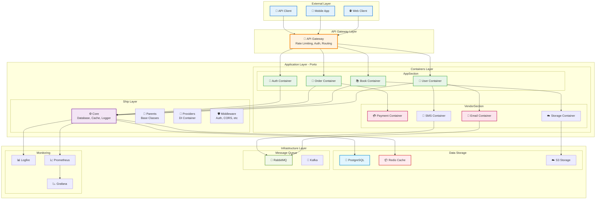

## 🔄 Request Flow Diagram

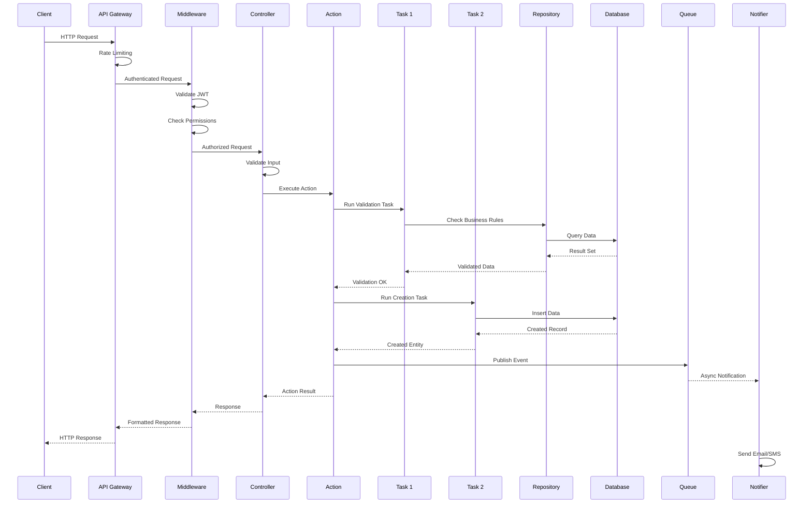

## 🎯 Porto Components Interaction

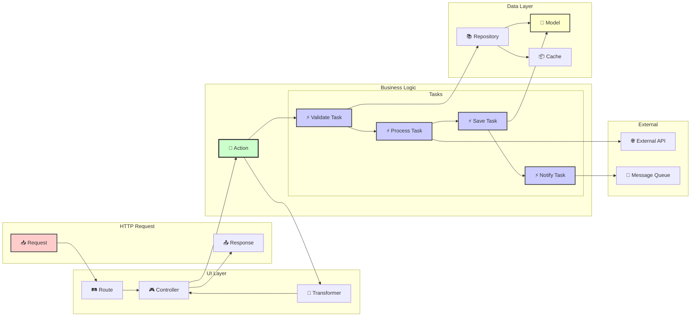

## 📦 Container Internal Structure

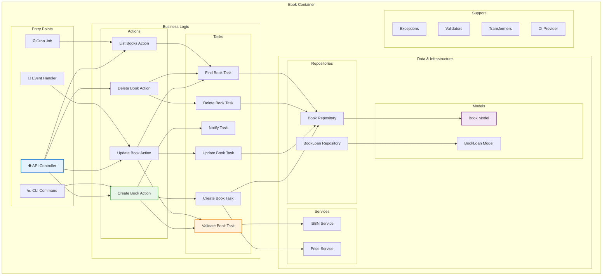

## 🔐 Authentication & Authorization Flow

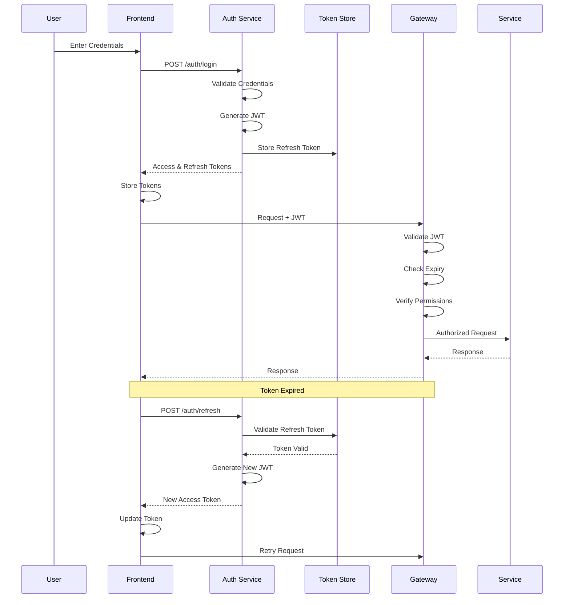

## 🚀 Deployment Architecture

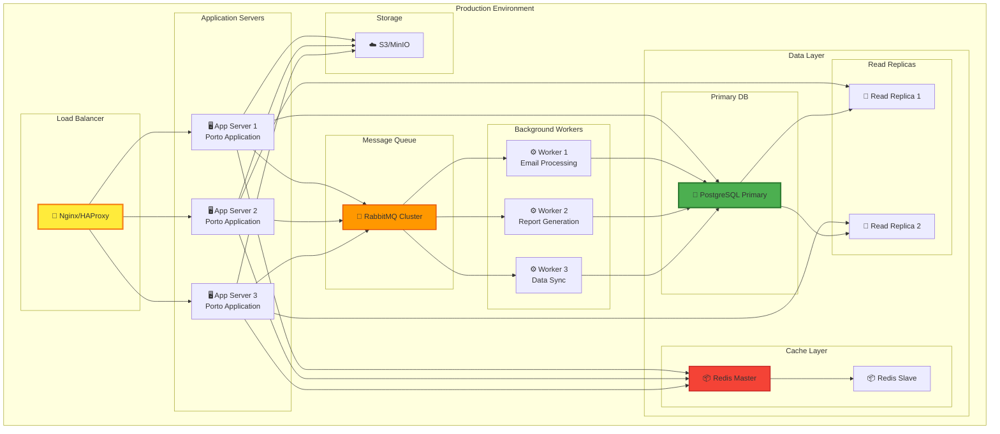

## 🔄 Event-Driven Architecture

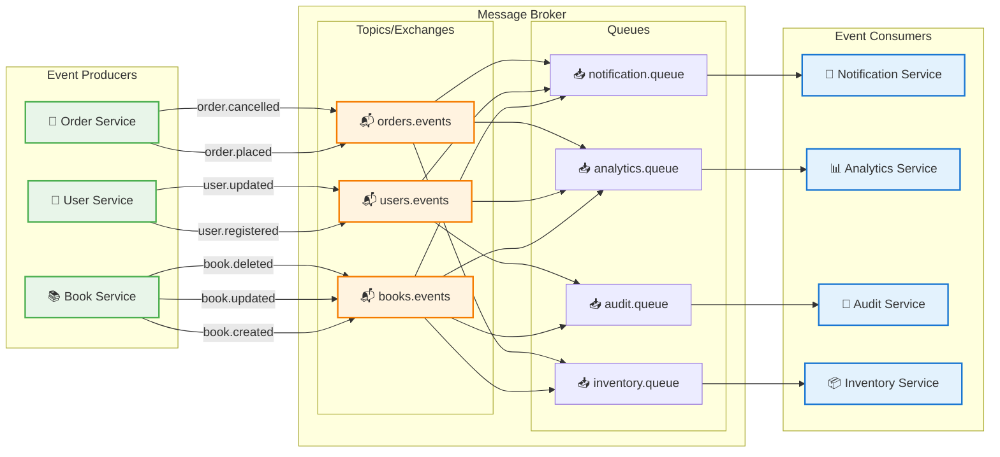

## 🏗️ Microservices Evolution

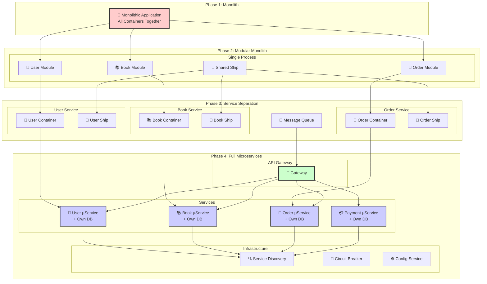

## 🧪 Testing Strategy

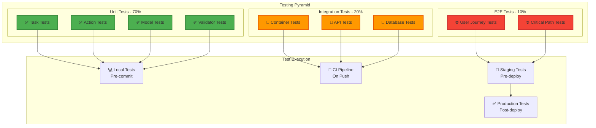

## 📊 Data Flow in Porto

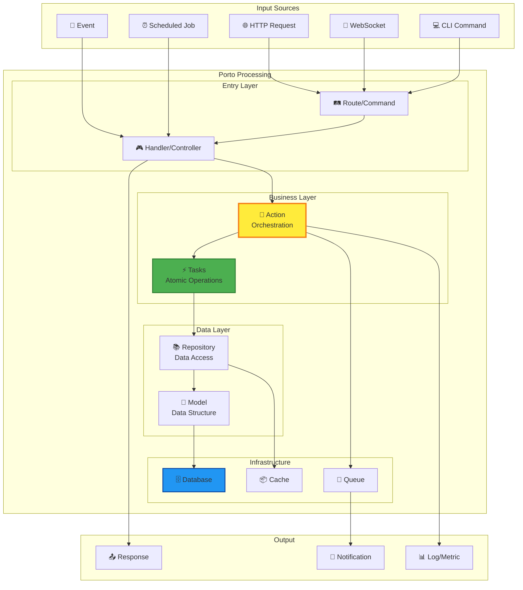

## 🔒 Security Architecture

```mermaid
graph TB
    subgraph "Security Layers"
        subgraph "Network Security"
            FW["🔥 Firewall"]
            WAF["🛡️ WAF"]
            DDoS["⚡ DDoS Protection"]
        end
        
        subgraph "Application Security"
            AUTH["🔐 Authentication<br/>JWT, OAuth2"]
            AUTHZ["👮 Authorization<br/>RBAC, ABAC"]
            VALID["✅ Input Validation"]
            SANITIZE["🧹 Output Sanitization"]
        end
        
        subgraph "Data Security"
            ENCRYPT["🔒 Encryption at Rest"]
            TLS["🔐 TLS in Transit"]
            HASH["#️⃣ Password Hashing<br/>Argon2, BCrypt"]
            MASK["🎭 Data Masking"]
        end
        
        subgraph "Monitoring"
            AUDIT["📝 Audit Logging"]
            SIEM["🚨 SIEM"]
            ALERT["📢 Security Alerts"]
        end
    end
    
    FW --> WAF
    WAF --> DDoS
    DDoS --> AUTH
    AUTH --> AUTHZ
    AUTHZ --> VALID
    VALID --> SANITIZE
    
    SANITIZE --> ENCRYPT
    ENCRYPT --> TLS
    TLS --> HASH
    HASH --> MASK
    
    MASK --> AUDIT
    AUDIT --> SIEM
    SIEM --> ALERT
    
    style FW fill:#ff5252,stroke:#c62828,stroke-width:3px
    style AUTH fill:#ffeb3b,stroke:#f57f17,stroke-width:3px
    style ENCRYPT fill:#4caf50,stroke:#2e7d32,stroke-width:3px
    style AUDIT fill:#2196f3,stroke:#0d47a1,stroke-width:3px
```

## 📈 Performance Monitoring

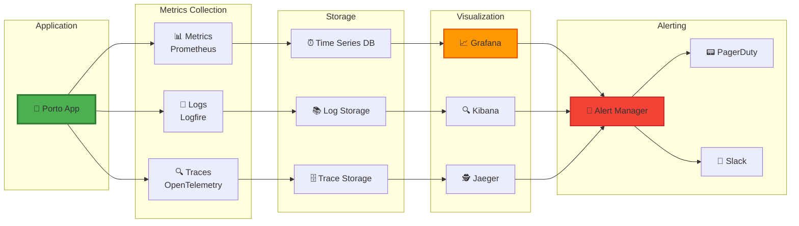

## 🎯 Заключение

Эти диаграммы показывают:

1. **Масштабируемость** - от монолита к микросервисам
2. **Модульность** - чёткое разделение ответственности
3. **Гибкость** - легко добавлять новые компоненты
4. **Надёжность** - множественные уровни защиты
5. **Производительность** - оптимизированные потоки данных

Porto архитектура обеспечивает чистую, понятную и масштабируемую структуру для современных приложений.

---

**📊 Visual Architecture Guide Complete!**

[← API Reference](09-api-reference.md) | [AI Development →](11-ai-development.md)

