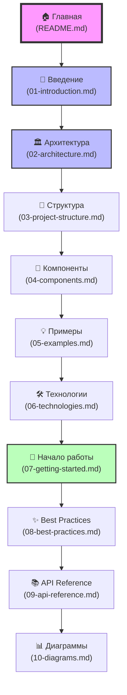

# 📚 Porto Architecture Template Documentation

  
  
  
  
  
  
  **🚢 Современный шаблон проекта на основе архитектуры Porto**
  
  *Clean Architecture • Модульность • Масштабируемость • AI-Friendly*

---

## 🎯 О проекте

Это **учебный шаблон-пример** для изучения и внедрения архитектурного паттерна **Porto** в Python-проектах. Проект демонстрирует, как правильно организовать код для создания масштабируемых, поддерживаемых и тестируемых приложений.

### 🌟 Ключевые особенности

- **🏗️ Porto Architecture** - Современный архитектурный паттерн
- **🚀 Litestar Framework** - Быстрый асинхронный веб-фреймворк
- **💉 Dishka DI** - Dependency Injection контейнер
- **🗄️ Piccolo ORM** - Современный асинхронный ORM с миграциями
- **📊 Logfire** - Продвинутое логирование и мониторинг
- **🔄 FastStream** - Обработка сообщений и событий
- **🎨 Clean Code** - Чистая архитектура и SOLID принципы

## 📖 Содержание документации

### 🚀 Быстрый старт
- [**Начало работы**](07-getting-started.md) - Установка и запуск проекта (uv, Docker)
- [**Введение в Porto**](01-introduction.md) - Основы архитектуры Porto

### 🏛️ Архитектура
- [**Архитектура Porto**](02-architecture.md) - Детальное описание паттерна
- [**Структура проекта**](03-project-structure.md) - Организация файлов и папок
- [**Компоненты**](04-components.md) - Actions, Tasks, Models и другие

### 💻 Разработка
- [**Примеры кода**](05-examples.md) - Практические примеры реализации
- [**Лучшие практики**](08-best-practices.md) - Рекомендации и паттерны
- [**API Reference**](09-api-reference.md) - Справочник по API

### 🛠️ Технологии
- [**Используемые технологии**](06-technologies.md) - Фреймворки и библиотеки
- [**Диаграммы архитектуры**](10-diagrams.md) - Визуализация архитектуры

## 🎓 Для кого эта документация?

### 👨‍💻 Для новичков
- Изучите основы Porto архитектуры
- Поймите принципы чистой архитектуры
- Научитесь организовывать код правильно

### 🚀 Для опытных разработчиков
- Освойте продвинутые паттерны Porto
- Масштабируйте от монолита к микросервисам
- Интегрируйте AI-инструменты в разработку

### 🏢 Для команд
- Стандартизируйте подход к разработке
- Улучшите поддерживаемость кода
- Ускорьте onboarding новых разработчиков

## 🗺️ Навигация по документации

## 🚦 С чего начать?

1. **Новичкам**: Начните с [Введения в Porto](01-introduction.md)
2. **Быстрый старт**: Перейдите к [Началу работы](07-getting-started.md)
3. **Изучение кода**: Смотрите [Примеры](05-examples.md)

## 🔗 Полезные ссылки

### 📚 Официальная документация
- [Porto Architecture](https://github.com/Mahmoudz/Porto) - Оригинальная документация Porto
- [Litestar Docs](https://docs.litestar.dev/) - Документация Litestar Framework
- [Piccolo ORM](https://piccolo-orm.readthedocs.io/) - Документация Piccolo ORM
- [Dishka DI](https://github.com/reagento/dishka) - Dependency Injection контейнер
- [Logfire](https://logfire.pydantic.dev/) - Система логирования
- [FastStream](https://faststream.airt.ai/) - Обработка сообщений

### 🎓 Обучающие материалы
- [Clean Architecture](https://blog.cleancoder.com/uncle-bob/2012/08/13/the-clean-architecture.html) - Принципы чистой архитектуры
- [SOLID Principles](https://en.wikipedia.org/wiki/SOLID) - SOLID принципы
- [Domain Driven Design](https://martinfowler.com/bliki/DomainDrivenDesign.html) - DDD подход

### 💬 Сообщество
- [GitHub Issues](https://github.com/your-repo/issues) - Вопросы и предложения
- [Discussions](https://github.com/your-repo/discussions) - Обсуждения

## 📝 Лицензия

MIT License - свободно используйте для обучения и в своих проектах!

---

  
  **🚀 Happy Coding with Porto Architecture!**
  
  Made with ❤️ for developers who love clean code
  

