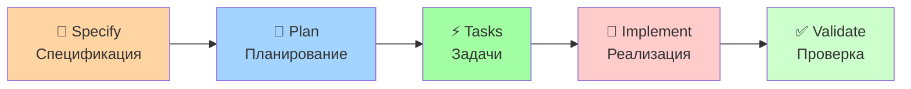

# 🌱 Porto Spec Kit

**Спецификационно-ориентированная разработка для Porto архитектуры**

> Адаптированная версия [GitHub Spec Kit](https://github.com/github/spec-kit) специально для Porto SAP архитектуры с технологическим стеком Litestar + Piccolo + Dishka + Logfire.

## 🤔 Что это такое?

**Porto Spec Kit** объединяет методологию спецификационно-ориентированной разработки (Spec-Driven Development) с принципами Porto архитектуры, позволяя:

- 📝 **Создавать спецификации** функций в Porto-стиле
- 🎯 **Планировать реализацию** с учетом структуры Containers/Ship  
- ⚡ **Генерировать задачи** для компонентов Actions/Tasks/Models/UI
- 🤖 **Работать с ИИ-агентами** или **вручную** через промпты

## ⚡ Быстрый старт

### 1. Создание спецификации

```bash
# С ИИ-агентом
/specify Система управления заказами с корзиной и оплатой

# Вручную (без ИИ)
# Скопировать templates/spec-template-porto.md и заполнить самостоятельно
```

### 2. Планирование реализации

```bash  
# С ИИ-агентом
/plan Использовать Piccolo ORM, создать Order Container в AppSection, интегрировать с Payment в VendorSection

# Вручную (без ИИ)
# Скопировать templates/plan-template-porto.md и заполнить самостоятельно
```

### 3. Генерация задач

```bash
# С ИИ-агентом  
/tasks

# Вручную (без ИИ)
# Скопировать templates/tasks-template-porto.md и заполнить самостоятельно
```

## 📁 Структура

```
spec-kit/
├── 📁 templates/           # Шаблоны, адаптированные для Porto
│   ├── spec-template-porto.md      # Шаблон спецификации функции
│   ├── plan-template-porto.md      # Шаблон плана реализации
│   ├── tasks-template-porto.md     # Шаблон списка задач
│   └── commands/                   # Команды для ИИ-агентов
│       ├── specify-porto.md        # Команда создания спецификации
│       ├── plan-porto.md           # Команда планирования
│       └── tasks-porto.md          # Команда генерации задач
├── 📁 scripts/            # Вспомогательные скрипты
├── 📁 memory/             # Конституция и принципы Porto
├── 📁 docs/              # Подробная документация
├── 📁 examples/          # Примеры использования
└── 📄 README.md          # Этот файл
```

## 🎯 Принципы Porto Spec Kit

### 🏗️ Архитектурные принципы

1. **Container-First** (Контейнеры в приоритете): Каждая функция - это отдельный Container в AppSection или VendorSection
2. **Паттерн Action-Task**: Бизнес-логика через Actions, атомарные операции через Tasks  
3. **Переиспользование Ship**: Максимальное использование компонентов Ship слоя
4. **Интеграция DI**: Dishka для внедрения зависимостей (dependency injection)
5. **Наблюдаемость**: Logfire для трассировки и журналирования

### 🔄 Рабочий процесс



## 📚 Документация

- [🚀 Начало работы](docs/getting-started.md) - Первые шаги с Porto Spec Kit
- [📖 Ручная работа](docs/manual-usage.md) - Использование без ИИ-агентов
- [🎯 Интеграция с Porto](docs/porto-integration.md) - Особенности Porto архитектуры
- [📋 Примеры](examples/) - Практические примеры использования

## 🔧 Настройка Cursor

Для автоматического использования Porto Spec Kit в Cursor добавьте в `.cursor/rules`:

```markdown
## Интеграция Porto Spec Kit

При разработке новых функций:
1. ВСЕГДА используй методологию Porto Spec Kit
2. Изучай templates/ для понимания структуры
3. Следуй Porto архитектуре: Containers → Ship → Framework
4. Используй технологический стек: Litestar + Piccolo + Dishka + Logfire
5. Создавай компоненты Actions/Tasks/Models/UI по шаблонам

Документация: spec-kit/docs/
Шаблоны: spec-kit/templates/
```

## 🎯 Отличия от оригинального Spec Kit

| Аспект | Оригинальный Spec Kit | Porto Spec Kit |
|--------|---------------------|----------------|
| **Архитектура** | Универсальная | Porto SAP |
| **Стек** | Любой | Litestar + Piccolo + Dishka |
| **Структура** | Свободная | Containers/Ship |
| **Компоненты** | Произвольные | Actions/Tasks/Models/UI |
| **DI** | Опционально | Dishka обязательно |
| **Логирование** | Произвольное | Logfire |

## 🤝 Способы использования

### С ИИ-агентами
- Поддерживаются: Claude Code, GitHub Copilot, Gemini CLI
- Команды `/specify`, `/plan`, `/tasks` работают автоматически

### Ручная работа (без ИИ)
- Копируй шаблоны из папки `templates/`
- Заполняй согласно инструкциям в `docs/manual-usage.md`
- Следуй контрольным спискам в шаблонах

## 📄 Лицензия

MIT License - как и оригинальный Spec Kit

---

## 🎉 Заключение

Porto Spec Kit - это мощный инструмент, который объединяет лучшие практики спецификационно-ориентированной разработки с архитектурными принципами Porto. Он позволяет:

✅ **Ускорить разработку** - четкие шаблоны и автоматизация  
✅ **Повысить качество** - встроенные проверки и лучшие практики  
✅ **Упростить поддержку** - стандартизированная структура  
✅ **Облегчить интеграцию** - готовые паттерны для Litestar + Piccolo + Dishka + Logfire  

Начните с простой команды `/specify` и следуйте процессу - от спецификации до готового кода!
