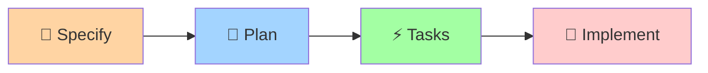

# 📖 Работа с Porto Spec Kit без ИИ-агентов

Руководство по использованию Porto Spec Kit через промпты и ручное заполнение шаблонов.

## 🎯 Обзор процесса

Porto Spec Kit можно использовать без ИИ-агентов, вручную заполняя шаблоны и следуя установленному workflow:



## 📝 Шаг 1: Specify (Создание спецификации)

### 🚀 Быстрый старт

1. **Создайте новую ветку для фичи**:
```bash
# Определите номер фичи (следующий доступный)
FEATURE_NUM=$(printf "%03d" $(($(find specs -name "[0-9][0-9][0-9]-*" -type d 2>/dev/null | wc -l) + 1)))

# Создайте slug из описания фичи
FEATURE_DESC="Sistema de gestión de pedidos"
FEATURE_SLUG=$(echo "$FEATURE_DESC" | tr '[:upper:]' '[:lower:]' | sed 's/[^a-z0-9]/-/g' | sed 's/--*/-/g' | sed 's/^-\|-$//g')

# Создайте ветку
BRANCH_NAME="${FEATURE_NUM}-${FEATURE_SLUG}"
git checkout -b "$BRANCH_NAME"
```

2. **Создайте структуру спецификации**:
```bash
mkdir -p "specs/${BRANCH_NAME}"
cp "spec-kit/templates/spec-template-porto.md" "specs/${BRANCH_NAME}/spec.md"
```

### ✍️ Заполнение спецификации

Откройте `specs/[###-feature-name]/spec.md` и заполните:

#### 🏗️ Porto Container Analysis
```markdown
### Container Placement
**Target Container**: AppSection.Order (или VendorSection.Payment)
**Rationale**: Это основная бизнес-логика управления заказами

### Related Containers
- **Dependencies**: User (для создания заказов), Book (для товаров)
- **Integrations**: VendorSection.Payment (для оплаты)
```

**💡 Подсказка**: 
- **AppSection** - основная бизнес-логика (User, Book, Order)
- **VendorSection** - внешние интеграции (Payment, Email, SMS)

#### 👤 User Scenarios & Testing
```markdown
### Primary User Story
Как пользователь, я хочу создать заказ с выбранными книгами и оплатить его

### Acceptance Scenarios (Porto Actions)
1. **Given** корзина с книгами, **When** пользователь нажимает "Оформить заказ", **Then** создается новый заказ
   - **Porto Action**: `CreateOrderAction` in `AppSection.Order`
   - **Expected Tasks**: `ValidateCartTask`, `CreateOrderTask`, `CalculateTotalTask`
```

#### 📋 Requirements (Porto Components)
```markdown
#### Actions (Business Use Cases)
- **FR-A001**: System MUST provide `CreateOrderAction` to orchestrate order creation
- **FR-A002**: System MUST provide `ProcessPaymentAction` to handle payment flow

#### Tasks (Atomic Operations)  
- **FR-T001**: System MUST provide `CreateOrderTask` to persist order in database
- **FR-T002**: System MUST provide `ValidateCartTask` to validate cart contents

#### Models (Data Layer)
- **FR-M001**: System MUST persist `Order` with id, user_id, total, status, created_at
- **FR-M002**: System MUST persist `OrderItem` with order_id, book_id, quantity, price
```

### ✅ Чек-лист спецификации

- [ ] Container placement определен (AppSection vs VendorSection)
- [ ] User stories написаны с точки зрения пользователя
- [ ] Actions сопоставлены с user stories
- [ ] Tasks определены как атомарные операции
- [ ] Models представляют бизнес-сущности
- [ ] Все [NEEDS CLARIFICATION] разрешены

## 🎯 Шаг 2: Plan (Планирование реализации)

### 🚀 Быстрый старт

1. **Создайте план реализации**:
```bash
cp "spec-kit/templates/plan-template-porto.md" "specs/${BRANCH_NAME}/plan.md"
```

### ✍️ Заполнение плана

#### 🔧 Technical Context (Porto Stack)
```markdown
**Framework**: Litestar 2.12+ (ASGI web framework)
**ORM**: Piccolo 1.22+ with SQLite (development) / PostgreSQL (production)  
**DI Container**: Dishka 1.4+ (dependency injection)
**Observability**: Logfire 2.7+ (logging, tracing, monitoring)

**Porto Structure**:
- **Container Path**: `src/Containers/AppSection/Order/`
- **Models**: Order, OrderItem (Piccolo ORM)
- **Actions**: CreateOrderAction, ProcessPaymentAction
- **Tasks**: CreateOrderTask, ValidateCartTask, CalculateTotalTask
```

#### 🏛️ Porto Constitution Check
```markdown
**Container Architecture**:
- [x] Container placement justified (Order = core business logic)
- [x] Single responsibility (order management only)
- [x] Clear boundaries (no direct payment processing)

**Component Design**:
- [x] Actions orchestrate multiple Tasks
- [x] Tasks are atomic (CreateOrderTask only creates order)
- [x] Models represent business entities (Order, OrderItem)
```

#### 📊 Project Structure (Porto)
```markdown
src/Containers/AppSection/Order/
├── Actions/
│   ├── CreateOrderAction.py
│   └── ProcessPaymentAction.py
├── Tasks/
│   ├── CreateOrderTask.py
│   ├── ValidateCartTask.py
│   └── CalculateTotalTask.py
├── Models/
│   ├── Order.py
│   └── OrderItem.py
├── UI/API/Controllers/
│   └── OrderController.py
├── Data/
│   ├── OrderCreateDTO.py
│   └── OrderDTO.py
├── PiccoloApp.py
└── Providers.py
```

### 📋 Phase 0: Porto Research & Analysis

Создайте `research.md`:
```markdown
# Research: Order Management System

## Piccolo ORM Patterns
- **Decision**: Use UUID primary keys for Order and OrderItem
- **Rationale**: Better for distributed systems and security
- **Migration Strategy**: Single migration with both models

## Litestar Controller Patterns  
- **Decision**: RESTful endpoints (/orders, /orders/{id})
- **Rationale**: Standard REST API patterns
- **OpenAPI**: Automatic documentation generation

## Dishka DI Architecture
- **Decision**: Scoped providers for database sessions
- **Rationale**: Proper transaction management
```

### 📋 Phase 1: Porto Design & Contracts

Создайте дополнительные файлы:

**data-model.md**:
```markdown
# Data Model: Order Management

## Order Model (Piccolo)
```python
class Order(Model):
    id = UUID(primary_key=True)
    user_id = UUID(required=True)
    total = Numeric(digits=(10, 2), required=True)
    status = Varchar(length=20, default="pending")
    created_at = Timestamptz()
    updated_at = Timestamptz()
```

## OrderItem Model (Piccolo)  
```python
class OrderItem(Model):
    id = UUID(primary_key=True)
    order_id = UUID(required=True)
    book_id = UUID(required=True)
    quantity = Integer(required=True)
    price = Numeric(digits=(10, 2), required=True)
```
```

**contracts/order-api.yaml** (OpenAPI):
```yaml
paths:
  /orders:
    post:
      summary: Create new order
      requestBody:
        content:
          application/json:
            schema:
              $ref: '#/components/schemas/OrderCreateDTO'
      responses:
        201:
          content:
            application/json:
              schema:
                $ref: '#/components/schemas/OrderDTO'
```

## ⚡ Шаг 3: Tasks (Генерация задач)

### 🚀 Быстрый старт

```bash
cp "spec-kit/templates/tasks-template-porto.md" "specs/${BRANCH_NAME}/tasks.md"
```

### ✍️ Заполнение задач

Замените примеры задач на конкретные:

```markdown
## Phase 3.1: Porto Container Setup
- [ ] T001 Create Container directory structure in `src/Containers/AppSection/Order/`
- [ ] T002 Initialize `__init__.py` files for proper imports
- [ ] T003 [P] Create `PiccoloApp.py` with Order models registration
- [ ] T004 [P] Create `Providers.py` with Dishka provider skeleton

## Phase 3.2: Piccolo Models & Migrations (TDD)
- [ ] T005 [P] Create `Order` model in `src/Containers/AppSection/Order/Models/Order.py`
- [ ] T006 [P] Create `OrderItem` model in `src/Containers/AppSection/Order/Models/OrderItem.py`
- [ ] T007 Generate Piccolo migration: `piccolo migrations new order --auto`
- [ ] T008 [P] Model integration test in `tests/integration/test_order_model.py`

## Phase 3.3: Porto Tasks (Atomic Operations)
- [ ] T009 [P] Task test for `CreateOrderTask` in `tests/unit/test_create_order_task.py`
- [ ] T010 [P] Task test for `ValidateCartTask` in `tests/unit/test_validate_cart_task.py`
- [ ] T011 [P] Implement `CreateOrderTask` in `src/Containers/AppSection/Order/Tasks/CreateOrder.py`
- [ ] T012 [P] Implement `ValidateCartTask` in `src/Containers/AppSection/Order/Tasks/ValidateCart.py`
```

### 📋 Porto Dependencies
```
Setup (T001-T004) → Models (T005-T008) → Tasks (T009-T012) → Actions → UI → Integration
```

## 🚀 Шаг 4: Implementation (Реализация)

Следуйте задачам из `tasks.md` в указанном порядке:

### 1. Настройка Container
```bash
mkdir -p src/Containers/AppSection/Order/{Actions,Tasks,Models,UI/API/Controllers,Data,migrations}
touch src/Containers/AppSection/Order/__init__.py
# ... и так далее
```

### 2. Piccolo Models
```python
# src/Containers/AppSection/Order/Models/Order.py
from src.Ship.Parents import Model
from piccolo.columns import UUID, Numeric, Varchar, Timestamptz

class Order(Model):
    id = UUID(primary_key=True)
    user_id = UUID(required=True)
    total = Numeric(digits=(10, 2), required=True)
    status = Varchar(length=20, default="pending")
    created_at = Timestamptz()
    updated_at = Timestamptz()
```

### 3. Реализация Tasks
```python
# src/Containers/AppSection/Order/Tasks/CreateOrder.py
from src.Ship.Parents import Task
from ..Models import Order
from ..Data import OrderCreateDTO

class CreateOrderTask(Task[OrderCreateDTO, Order]):
    async def run(self, data: OrderCreateDTO) -> Order:
        return await Order.insert(**data.model_dump())
```

## 📚 Полезные ресурсы

### 🔗 Ссылки на документацию
- [Архитектура Porto](../docs/01-introduction.md)
- [Документация Litestar](https://litestar.dev/)
- [Piccolo ORM](https://piccolo-orm.com/)
- [Dishka DI](https://dishka.readthedocs.io/)
- [Logfire](https://logfire.pydantic.dev/)

### 📋 Чек-листы
- [Чек-лист спецификации](checklists/specification.md)
- [Чек-лист реализации](checklists/implementation.md)
- [Чек-лист тестирования](checklists/testing.md)

### 🎯 Примеры
- [Пример управления заказами](../examples/order-management/)
- [Пример аутентификации пользователей](../examples/user-auth/)
- [Пример интеграции платежей](../examples/payment-integration/)

---

💡 **Совет**: Начинайте с простых фич и постепенно изучайте Porto паттерны. Каждая фича должна быть полностью реализована прежде чем переходить к следующей.
