# 🧠 AIOBSH: AI-Orchestrated Brain System Hub

> **🧭 COMPASS × 🏗️ MAKER × ⚡ Litestar × ⚓ PORTO × ❄️ Nix = Универсальная Агентская Платформа**

---

## 📋 Оглавление

1. [🌟 Введение](#-введение)
2. [🎯 Философия проекта](#-философия-проекта)
3. [🏛️ Архитектурный обзор](#️-архитектурный-обзор)
4. [❄️ Система окружений Nix](#️-система-окружений-nix)
5. [⚓ Porto структура проекта](#-porto-структура-проекта)
6. [🚢 Ship Layer — Инфраструктура](#-ship-layer--инфраструктура)
7. [📦 Containers Layer — Бизнес-логика](#-containers-layer--бизнес-логика)
8. [🔗 Manager Pattern — Связывание контейнеров](#-manager-pattern--связывание-контейнеров)
9. [🧭 Strategic Section (COMPASS)](#-strategic-section-compass)
10. [🏗️ Execution Section (MAKER)](#️-execution-section-maker)
11. [🔌 Integration Section](#-integration-section)
12. [🎭 Режимы работы системы](#-режимы-работы-системы)
13. [🔄 Потоки данных](#-потоки-данных)
14. [📈 Сценарии применения](#-сценарии-применения)
15. [⚙️ Техническая реализация](#️-техническая-реализация)
16. [🚀 Roadmap](#-roadmap)

---

## 🌟 Введение

### 🤔 Что такое AIOBSH?

**AIOBSH** (AI-Orchestrated Brain System Hub) — это универсальная платформа для создания надёжных, масштабируемых и самоулучшающихся AI-агентских систем. Система объединяет лучшие практики из нескольких архитектурных подходов:

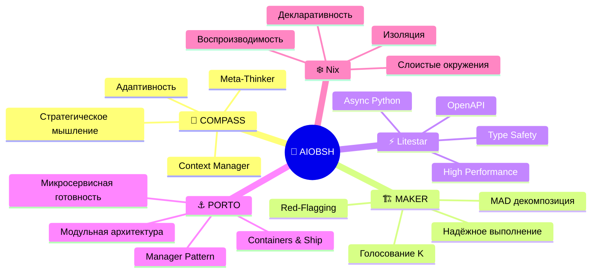
```mermaid
mindmap
    root((🧠 AIOBSH))
        🧭 COMPASS
            Стратегическое мышление
            Meta-Thinker
            Context Manager
            Адаптивность
        🏗️ MAKER
            Надёжное выполнение
            MAD декомпозиция
            Голосование K
            Red-Flagging
        ⚡ Litestar
            Async Python
            High Performance
            OpenAPI
            Type Safety
        ⚓ PORTO
            Модульная архитектура
            Containers & Ship
            Manager Pattern
            Микросервисная готовность
        ❄️ Nix
            Воспроизводимость
            Слоистые окружения
            Декларативность
            Изоляция
```

### 🎯 Ключевые принципы

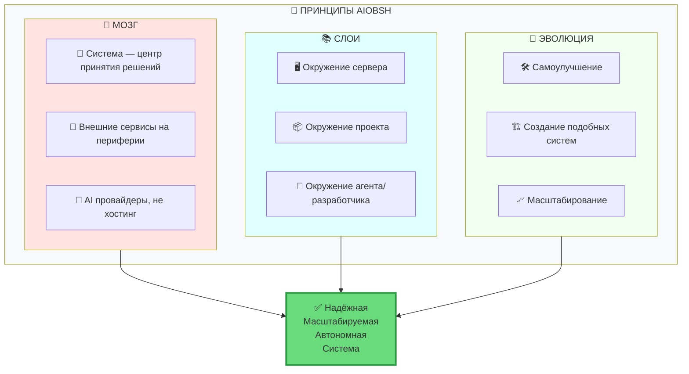
```mermaid
flowchart TB
    subgraph principles["🌟 ПРИНЦИПЫ AIOBSH"]
        direction TB
        
        subgraph brain["🧠 МОЗГ"]
            B1["🎯 Система — центр принятия решений"]
            B2["🔌 Внешние сервисы на периферии"]
            B3["📡 AI провайдеры, не хостинг"]
        end
        
        subgraph layers["📚 СЛОИ"]
            L1["🖥️ Окружение сервера"]
            L2["📦 Окружение проекта"]
            L3["🤖 Окружение агента/разработчика"]
        end
        
        subgraph evolution["🔄 ЭВОЛЮЦИЯ"]
            E1["🛠️ Самоулучшение"]
            E2["🏗️ Создание подобных систем"]
            E3["📈 Масштабирование"]
        end
    end
    
    brain --> RESULT["✅ Надёжная<br/>Масштабируемая<br/>Автономная<br/>Система"]
    layers --> RESULT
    evolution --> RESULT
    
    style principles fill:#f8f9fa
    style brain fill:#FFE4E1
    style layers fill:#E0FFFF
    style evolution fill:#F0FFF0
    style RESULT fill:#69db7c,stroke:#2f9e44,stroke-width:3px
```

---

## 🎯 Философия проекта

### 🧠 "Мозг" на периферии

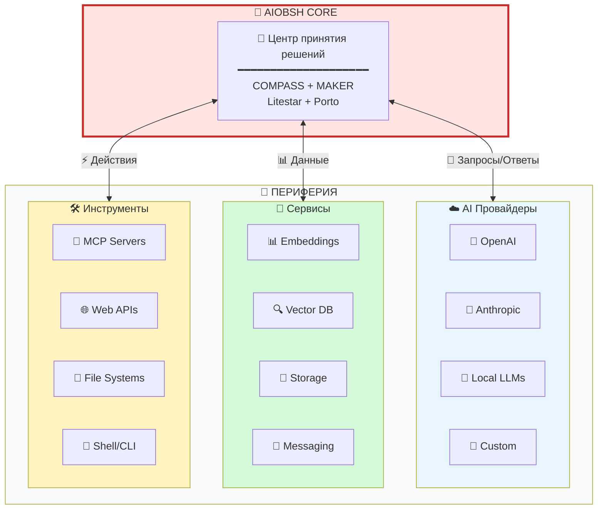
```mermaid
flowchart TB
    subgraph core["🧠 AIOBSH CORE"]
        direction TB
        BRAIN["🧠 Центр принятия решений<br/>━━━━━━━━━━━━━━━━━━━━<br/>COMPASS + MAKER<br/>Litestar + Porto"]
    end
    
    subgraph periphery["🔌 ПЕРИФЕРИЯ"]
        direction TB
        
        subgraph providers["☁️ AI Провайдеры"]
            P1["🤖 OpenAI"]
            P2["🤖 Anthropic"]
            P3["🤖 Local LLMs"]
            P4["🤖 Custom"]
        end
        
        subgraph services["🔧 Сервисы"]
            S1["📊 Embeddings"]
            S2["🔍 Vector DB"]
            S3["💾 Storage"]
            S4["📨 Messaging"]
        end
        
        subgraph tools["🛠️ Инструменты"]
            T1["🔗 MCP Servers"]
            T2["🌐 Web APIs"]
            T3["📁 File Systems"]
            T4["🐚 Shell/CLI"]
        end
    end
    
    BRAIN <-->|"🔄 Запросы/Ответы"| providers
    BRAIN <-->|"📊 Данные"| services
    BRAIN <-->|"⚡ Действия"| tools
    
    style core fill:#FFE4E1,stroke:#c92a2a,stroke-width:3px
    style periphery fill:#f8f9fa
    style providers fill:#e7f5ff
    style services fill:#d3f9d8
    style tools fill:#fff3bf
```

### 📊 Матрица возможностей

| Возможность | Простой агент | AIOBSH LITE | AIOBSH FULL | AIOBSH PARANOID |
|-------------|---------------|-------------|-------------|-----------------|
| 📈 **Масштаб задач** | ~50 шагов | ~500 шагов | ~100K шагов | 1M+ шагов |
| 🎯 **Точность** | ~95% | ~97% | ~99.9% | ~99.99% |
| 🧠 **Стратегия** | ❌ | ✅ | ✅ | ✅ |
| 🔄 **Адаптивность** | ⚠️ | ✅ | ✅ | ✅ |
| 📦 **Модульность** | ❌ | ✅ | ✅ | ✅ |
| 🔧 **Микросервисы** | ❌ | ⚠️ | ✅ | ✅ |
| ❄️ **Nix окружения** | ❌ | ✅ | ✅ | ✅ |
| 🛡️ **Red-Flagging** | ❌ | ⚠️ | ✅ | ✅✅ |
| 🗳️ **Voting (K)** | ❌ | K=1 | K=3 | K=5 |

---

## 🏛️ Архитектурный обзор

### 📊 Высокоуровневая архитектура

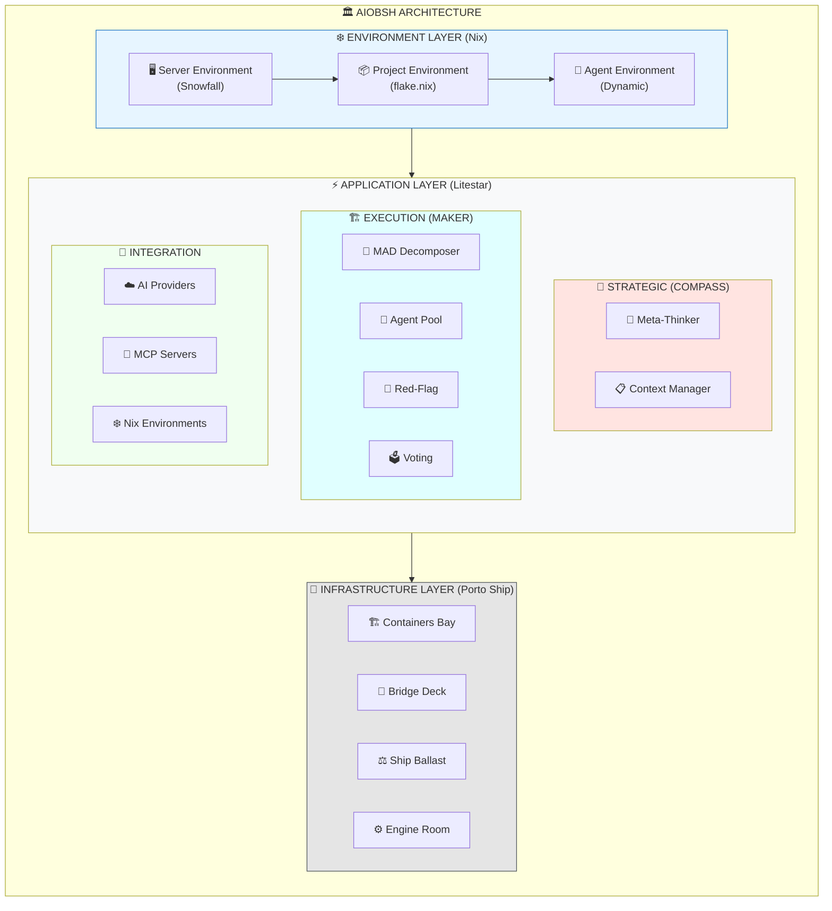
```mermaid
flowchart TB
    subgraph overview["🏛️ AIOBSH ARCHITECTURE"]
        direction TB
        
        subgraph env_layer["❄️ ENVIRONMENT LAYER (Nix)"]
            direction LR
            ENV1["🖥️ Server Environment<br/>(Snowfall)"]
            ENV2["📦 Project Environment<br/>(flake.nix)"]
            ENV3["🤖 Agent Environment<br/>(Dynamic)"]
            
            ENV1 --> ENV2 --> ENV3
        end
        
        subgraph app_layer["⚡ APPLICATION LAYER (Litestar)"]
            direction TB
            
            subgraph strategic["🧭 STRATEGIC (COMPASS)"]
                MT["🧠 Meta-Thinker"]
                CM["📋 Context Manager"]
            end
            
            subgraph execution["🏗️ EXECUTION (MAKER)"]
                MAD["🔨 MAD Decomposer"]
                AP["🤖 Agent Pool"]
                RF["🚩 Red-Flag"]
                VT["🗳️ Voting"]
            end
            
            subgraph integration["🔌 INTEGRATION"]
                AI["☁️ AI Providers"]
                MCP["🔗 MCP Servers"]
                NIX["❄️ Nix Environments"]
            end
        end
        
        subgraph infra_layer["🚢 INFRASTRUCTURE LAYER (Porto Ship)"]
            direction LR
            BAY["🏗️ Containers Bay"]
            BRIDGE["🌉 Bridge Deck"]
            BALLAST["⚖️ Ship Ballast"]
            ENGINE["⚙️ Engine Room"]
        end
    end
    
    env_layer --> app_layer
    app_layer --> infra_layer
    
    style env_layer fill:#e7f5ff,stroke:#1971c2
    style app_layer fill:#f8f9fa
    style infra_layer fill:#E5E5E5,stroke:#495057
    style strategic fill:#FFE4E1
    style execution fill:#E0FFFF
    style integration fill:#F0FFF0
```

### 🔗 Связи между слоями

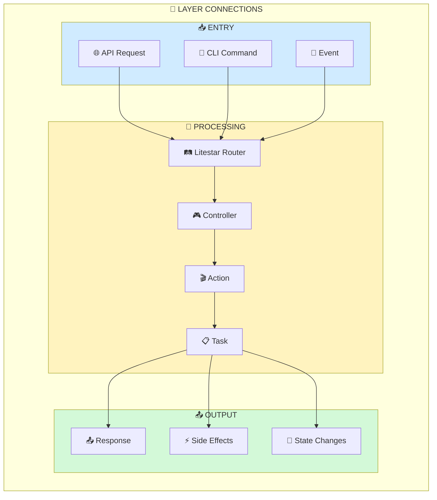
```mermaid
flowchart LR
    subgraph connections["🔗 LAYER CONNECTIONS"]
        direction TB
        
        subgraph top["📥 ENTRY"]
            API["🌐 API Request"]
            CLI["🐚 CLI Command"]
            EVENT["📨 Event"]
        end
        
        subgraph middle["🔄 PROCESSING"]
            ROUTE["🛤️ Litestar Router"]
            CTRL["🎮 Controller"]
            ACTION["🎬 Action"]
            TASK["📋 Task"]
        end
        
        subgraph bottom["📤 OUTPUT"]
            RESP["📤 Response"]
            SIDE["⚡ Side Effects"]
            STATE["💾 State Changes"]
        end
    end
    
    API --> ROUTE
    CLI --> ROUTE
    EVENT --> ROUTE
    
    ROUTE --> CTRL --> ACTION --> TASK
    
    TASK --> RESP
    TASK --> SIDE
    TASK --> STATE
    
    style top fill:#d0ebff
    style middle fill:#fff3bf
    style bottom fill:#d3f9d8
```

---

## ❄️ Система окружений Nix

### 📚 Бесшовное наслоение окружений

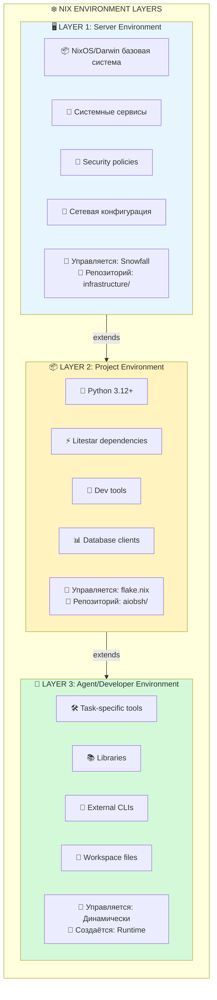
```mermaid
flowchart TB
    subgraph environments["❄️ NIX ENVIRONMENT LAYERS"]
        direction TB
        
        subgraph server_env["🖥️ LAYER 1: Server Environment"]
            SE1["📦 NixOS/Darwin базовая система"]
            SE2["🔧 Системные сервисы"]
            SE3["🔐 Security policies"]
            SE4["📡 Сетевая конфигурация"]
            
            SE_NOTE["📝 Управляется: Snowfall<br/>📂 Репозиторий: infrastructure/"]
        end
        
        subgraph project_env["📦 LAYER 2: Project Environment"]
            PE1["🐍 Python 3.12+"]
            PE2["⚡ Litestar dependencies"]
            PE3["🔧 Dev tools"]
            PE4["📊 Database clients"]
            
            PE_NOTE["📝 Управляется: flake.nix<br/>📂 Репозиторий: aiobsh/"]
        end
        
        subgraph agent_env["🤖 LAYER 3: Agent/Developer Environment"]
            AE1["🛠️ Task-specific tools"]
            AE2["📚 Libraries"]
            AE3["🔗 External CLIs"]
            AE4["📁 Workspace files"]
            
            AE_NOTE["📝 Управляется: Динамически<br/>📂 Создаётся: Runtime"]
        end
    end
    
    server_env -->|"extends"| project_env
    project_env -->|"extends"| agent_env
    
    style server_env fill:#e7f5ff
    style project_env fill:#fff3bf
    style agent_env fill:#d3f9d8
```

### 📁 Структура Nix в проекте

```
aiobsh/
├── flake.nix                    # 🎯 Корневой flake проекта
├── flake.lock                   # 🔒 Locked dependencies
│
├── nix/
│   ├── shells/                  # 🐚 Dev shells
│   │   ├── default.nix          # Основной dev shell
│   │   ├── ci.nix               # CI/CD shell
│   │   └── minimal.nix          # Минимальный shell
│   │
│   ├── packages/                # 📦 Nix packages
│   │   └── aiobsh.nix           # Пакет приложения
│   │
│   ├── templates/               # 📋 Шаблоны для агентов
│   │   ├── python/
│   │   │   └── flake.nix        # Python окружение
│   │   ├── node/
│   │   │   └── flake.nix        # Node.js окружение
│   │   ├── rust/
│   │   │   └── flake.nix        # Rust окружение
│   │   └── multi/
│   │       └── flake.nix        # Мульти-язычное окружение
│   │
│   ├── lib/                     # 🔧 Nix утилиты
│   │   ├── mkAgentEnv.nix       # Генератор окружений
│   │   └── mkDevShell.nix       # Генератор dev shells
│   │
│   └── overlays/                # 🔀 Nixpkgs overlays
│       └── default.nix
│
└── workspaces/                  # 📂 Runtime окружения (gitignored)
    └── agent-{uuid}/
        ├── flake.nix            # Сгенерированный flake
        ├── flake.lock
        └── workspace/           # Рабочие файлы агента
```

### 📝 Пример корневого flake.nix

```nix
# flake.nix
{
  description = "🧠 AIOBSH - AI-Orchestrated Brain System Hub";

  inputs = {
    nixpkgs.url = "github:nixos/nixpkgs/nixos-unstable";
    flake-utils.url = "github:numtide/flake-utils";
    
    # Python packaging
    poetry2nix = {
      url = "github:nix-community/poetry2nix";
      inputs.nixpkgs.follows = "nixpkgs";
    };
  };

  outputs = { self, nixpkgs, flake-utils, poetry2nix }:
    flake-utils.lib.eachDefaultSystem (system:
      let
        pkgs = nixpkgs.legacyPackages.${system};
        p2nix = poetry2nix.lib.mkPoetry2Nix { inherit pkgs; };
      in
      {
        # 📦 Packages
        packages = {
          default = p2nix.mkPoetryApplication {
            projectDir = ./.;
          };
        };

        # 🐚 Dev Shells
        devShells = {
          default = pkgs.mkShell {
            packages = with pkgs; [
              python312
              poetry
              ruff
              mypy
              # ... other tools
            ];
            
            shellHook = ''
              echo "🧠 AIOBSH Development Environment"
              echo "❄️ Nix shell activated"
            '';
          };
        };

        # 📋 Templates for agents
        templates = {
          python = {
            path = ./nix/templates/python;
            description = "🐍 Python environment for agents";
          };
          node = {
            path = ./nix/templates/node;
            description = "📗 Node.js environment for agents";
          };
        };
      }
    );
}
```

### 🔄 Динамическая генерация окружений

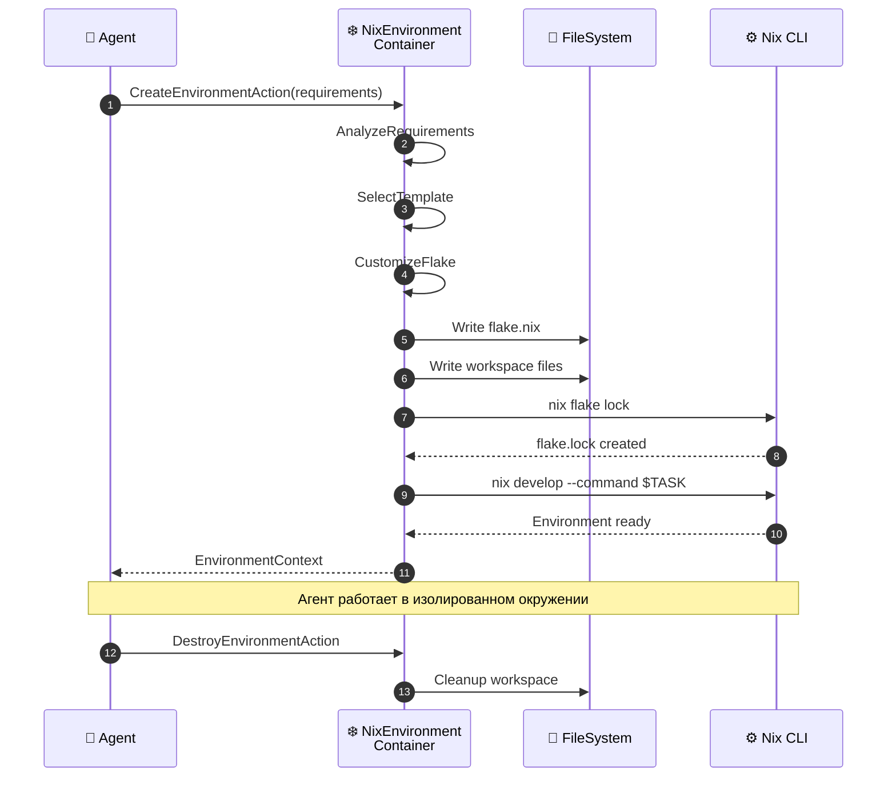
```mermaid
sequenceDiagram
    autonumber
    
    participant A as 🤖 Agent
    participant NE as ❄️ NixEnvironment<br/>Container
    participant FS as 📁 FileSystem
    participant NIX as ⚙️ Nix CLI
    
    A->>NE: CreateEnvironmentAction(requirements)
    
    NE->>NE: AnalyzeRequirements
    NE->>NE: SelectTemplate
    NE->>NE: CustomizeFlake
    
    NE->>FS: Write flake.nix
    NE->>FS: Write workspace files
    
    NE->>NIX: nix flake lock
    NIX-->>NE: flake.lock created
    
    NE->>NIX: nix develop --command $TASK
    NIX-->>NE: Environment ready
    
    NE-->>A: EnvironmentContext
    
    Note over A,NIX: Агент работает в изолированном окружении
    
    A->>NE: DestroyEnvironmentAction
    NE->>FS: Cleanup workspace
```

---

## ⚓ Porto структура проекта

### 📁 Полная структура каталогов

```
aiobsh/
│
├── 📄 pyproject.toml              # Poetry configuration
├── 📄 flake.nix                   # Nix flake
├── 📄 README.md
│
├── 🚢 ship/                       # SHIP LAYER - Инфраструктура
│   │
│   ├── 🏗️ containers_bay/         # Базовые классы
│   │   ├── __init__.py
│   │   ├── base_container.py
│   │   ├── base_action.py
│   │   ├── base_task.py
│   │   ├── base_model.py
│   │   ├── base_repository.py
│   │   ├── base_manager.py        # 🆕 Базовый Manager
│   │   └── base_transformer.py
│   │
│   ├── 🌉 bridge_deck/            # Интерфейсы (Protocols)
│   │   ├── __init__.py
│   │   ├── protocols/
│   │   │   ├── __init__.py
│   │   │   ├── action_protocol.py
│   │   │   ├── task_protocol.py
│   │   │   ├── repository_protocol.py
│   │   │   ├── manager_protocol.py  # 🆕 Manager Protocol
│   │   │   ├── votable_protocol.py
│   │   │   └── filterable_protocol.py
│   │   └── types/
│   │       ├── __init__.py
│   │       ├── common.py
│   │       └── results.py
│   │
│   ├── ⚖️ ship_ballast/           # Адаптеры к внешним сервисам
│   │   ├── __init__.py
│   │   ├── llm/
│   │   │   ├── __init__.py
│   │   │   ├── base_llm_adapter.py
│   │   │   ├── openai_adapter.py
│   │   │   ├── anthropic_adapter.py
│   │   │   └── local_adapter.py
│   │   ├── storage/
│   │   │   ├── __init__.py
│   │   │   ├── base_storage_adapter.py
│   │   │   ├── redis_adapter.py
│   │   │   └── postgres_adapter.py
│   │   ├── mcp/
│   │   │   ├── __init__.py
│   │   │   └── mcp_adapter.py
│   │   └── nix/
│   │       ├── __init__.py
│   │       └── nix_cli_adapter.py
│   │
│   └── ⚙️ engine_room/            # Core сервисы
│       ├── __init__.py
│       ├── dependency_injector.py
│       ├── container_loader.py
│       ├── event_dispatcher.py
│       ├── metrics_collector.py
│       ├── config_manager.py
│       └── transport/              # 🆕 Transport Layer
│           ├── __init__.py
│           ├── direct_transport.py
│           ├── http_transport.py
│           └── grpc_transport.py
│
├── 📦 containers/                  # CONTAINERS LAYER - Бизнес-логика
│   │
│   ├── 🧭 strategic/              # COMPASS Section
│   │   │
│   │   ├── 🧠 meta_thinker/       # Meta-Thinker Container
│   │   │   ├── __init__.py
│   │   │   ├── actions/
│   │   │   │   ├── __init__.py
│   │   │   │   ├── analyze_task_action.py
│   │   │   │   ├── plan_episodes_action.py
│   │   │   │   ├── monitor_progress_action.py
│   │   │   │   └── decide_signal_action.py
│   │   │   ├── tasks/
│   │   │   │   ├── __init__.py
│   │   │   │   ├── classify_task_task.py
│   │   │   │   ├── estimate_complexity_task.py
│   │   │   │   ├── detect_anomaly_task.py
│   │   │   │   └── detect_loop_task.py
│   │   │   ├── models/
│   │   │   │   ├── __init__.py
│   │   │   │   ├── task_analysis.py
│   │   │   │   ├── episode.py
│   │   │   │   └── signal.py
│   │   │   ├── managers/           # 🆕 Manager Pattern
│   │   │   │   ├── __init__.py
│   │   │   │   ├── meta_thinker_server_manager.py
│   │   │   │   └── meta_thinker_client_manager.py
│   │   │   └── data/
│   │   │       └── prompts/
│   │   │           ├── analyze.md
│   │   │           └── plan.md
│   │   │
│   │   └── 📋 context_manager/    # Context Manager Container
│   │       ├── __init__.py
│   │       ├── actions/
│   │       │   ├── __init__.py
│   │       │   ├── store_note_action.py
│   │       │   ├── create_brief_action.py
│   │       │   └── synthesize_result_action.py
│   │       ├── tasks/
│   │       │   ├── __init__.py
│   │       │   ├── compress_context_task.py
│   │       │   ├── filter_relevant_task.py
│   │       │   └── merge_notes_task.py
│   │       ├── models/
│   │       │   ├── __init__.py
│   │       │   ├── note.py
│   │       │   ├── brief.py
│   │       │   └── context.py
│   │       ├── repositories/
│   │       │   ├── __init__.py
│   │       │   └── notes_repository.py
│   │       └── managers/
│   │           ├── __init__.py
│   │           ├── context_manager_server_manager.py
│   │           └── context_manager_client_manager.py
│   │
│   ├── 🏗️ execution/              # MAKER Section
│   │   │
│   │   ├── 🔨 mad_decomposer/     # MAD Container
│   │   │   ├── __init__.py
│   │   │   ├── actions/
│   │   │   │   ├── __init__.py
│   │   │   │   ├── decompose_task_action.py
│   │   │   │   └── create_queue_action.py
│   │   │   ├── tasks/
│   │   │   │   ├── __init__.py
│   │   │   │   ├── split_into_micro_task.py
│   │   │   │   └── estimate_steps_task.py
│   │   │   ├── models/
│   │   │   │   ├── __init__.py
│   │   │   │   ├── micro_task.py
│   │   │   │   └── task_queue.py
│   │   │   └── managers/
│   │   │       ├── __init__.py
│   │   │       ├── mad_server_manager.py
│   │   │       └── mad_client_manager.py
│   │   │
│   │   ├── 🤖 agent_pool/         # Agent Pool Container
│   │   │   ├── __init__.py
│   │   │   ├── actions/
│   │   │   │   ├── __init__.py
│   │   │   │   ├── sample_agents_action.py
│   │   │   │   └── execute_micro_task_action.py
│   │   │   ├── tasks/
│   │   │   │   ├── __init__.py
│   │   │   │   ├── spawn_agent_task.py
│   │   │   │   └── collect_response_task.py
│   │   │   ├── models/
│   │   │   │   ├── __init__.py
│   │   │   │   ├── agent.py
│   │   │   │   └── agent_response.py
│   │   │   └── managers/
│   │   │       ├── __init__.py
│   │   │       ├── agent_pool_server_manager.py
│   │   │       └── agent_pool_client_manager.py
│   │   │
│   │   ├── 🚩 red_flag/           # Red-Flag Container
│   │   │   ├── __init__.py
│   │   │   ├── actions/
│   │   │   │   ├── __init__.py
│   │   │   │   └── filter_responses_action.py
│   │   │   ├── tasks/
│   │   │   │   ├── __init__.py
│   │   │   │   ├── check_length_task.py
│   │   │   │   ├── check_format_task.py
│   │   │   │   └── check_logic_task.py
│   │   │   ├── models/
│   │   │   │   ├── __init__.py
│   │   │   │   └── filter_result.py
│   │   │   └── managers/
│   │   │       ├── __init__.py
│   │   │       ├── red_flag_server_manager.py
│   │   │       └── red_flag_client_manager.py
│   │   │
│   │   └── 🗳️ voting/             # Voting Container
│   │       ├── __init__.py
│   │       ├── actions/
│   │       │   ├── __init__.py
│   │       │   └── run_voting_action.py
│   │       ├── tasks/
│   │       │   ├── __init__.py
│   │       │   ├── normalize_response_task.py
│   │       │   ├── hash_response_task.py
│   │       │   ├── count_votes_task.py
│   │       │   └── determine_winner_task.py
│   │       ├── models/
│   │       │   ├── __init__.py
│   │       │   ├── vote.py
│   │       │   └── voting_result.py
│   │       └── managers/
│   │           ├── __init__.py
│   │           ├── voting_server_manager.py
│   │           └── voting_client_manager.py
│   │
│   ├── 🔌 integration/            # Integration Section
│   │   │
│   │   ├── ☁️ ai_providers/       # AI Providers Container
│   │   │   ├── __init__.py
│   │   │   ├── actions/
│   │   │   │   ├── __init__.py
│   │   │   │   ├── call_llm_action.py
│   │   │   │   └── get_embeddings_action.py
│   │   │   ├── tasks/
│   │   │   │   ├── __init__.py
│   │   │   │   ├── format_prompt_task.py
│   │   │   │   └── parse_response_task.py
│   │   │   ├── models/
│   │   │   │   ├── __init__.py
│   │   │   │   ├── llm_request.py
│   │   │   │   └── llm_response.py
│   │   │   └── managers/
│   │   │       ├── __init__.py
│   │   │       ├── ai_providers_server_manager.py
│   │   │       └── ai_providers_client_manager.py
│   │   │
│   │   ├── 🔗 mcp_integration/    # MCP Integration Container
│   │   │   ├── __init__.py
│   │   │   ├── actions/
│   │   │   │   ├── __init__.py
│   │   │   │   ├── discover_tools_action.py
│   │   │   │   └── execute_tool_action.py
│   │   │   ├── tasks/
│   │   │   │   ├── __init__.py
│   │   │   │   └── parse_tool_result_task.py
│   │   │   ├── models/
│   │   │   │   ├── __init__.py
│   │   │   │   ├── mcp_tool.py
│   │   │   │   └── tool_result.py
│   │   │   └── managers/
│   │   │       ├── __init__.py
│   │   │       ├── mcp_server_manager.py
│   │   │       └── mcp_client_manager.py
│   │   │
│   │   └── ❄️ nix_environment/    # Nix Environment Container
│   │       ├── __init__.py
│   │       ├── actions/
│   │       │   ├── __init__.py
│   │       │   ├── create_environment_action.py
│   │       │   ├── execute_in_environment_action.py
│   │       │   └── destroy_environment_action.py
│   │       ├── tasks/
│   │       │   ├── __init__.py
│   │       │   ├── generate_flake_task.py
│   │       │   ├── validate_flake_task.py
│   │       │   └── build_environment_task.py
│   │       ├── models/
│   │       │   ├── __init__.py
│   │       │   ├── environment_spec.py
│   │       │   └── environment_context.py
│   │       ├── data/
│   │       │   └── templates/      # Встроенные шаблоны
│   │       │       ├── python.nix
│   │       │       └── node.nix
│   │       └── managers/
│   │           ├── __init__.py
│   │           ├── nix_env_server_manager.py
│   │           └── nix_env_client_manager.py
│   │
│   └── 🎯 domain/                 # Domain-specific Containers
│       │
│       └── 📝 example_domain/     # Пример доменного контейнера
│           ├── __init__.py
│           ├── actions/
│           ├── tasks/
│           ├── models/
│           ├── repositories/
│           └── managers/
│
├── 🌐 api/                        # API Layer (Litestar)
│   ├── __init__.py
│   ├── app.py                     # Litestar App
│   ├── routes/
│   │   ├── __init__.py
│   │   ├── health.py
│   │   ├── tasks.py
│   │   └── environments.py
│   ├── middleware/
│   │   ├── __init__.py
│   │   └── auth.py
│   └── dependencies/
│       ├── __init__.py
│       └── providers.py
│
├── ⚙️ config/                     # Configuration
│   ├── __init__.py
│   ├── settings.py
│   └── logging.py
│
├── 🧪 tests/                      # Tests
│   ├── __init__.py
│   ├── unit/
│   ├── integration/
│   └── e2e/
│
└── 📂 nix/                        # Nix configurations
    ├── shells/
    ├── templates/
    └── lib/
```

---

## 🚢 Ship Layer — Инфраструктура

### 🏗️ Containers Bay — Базовые классы

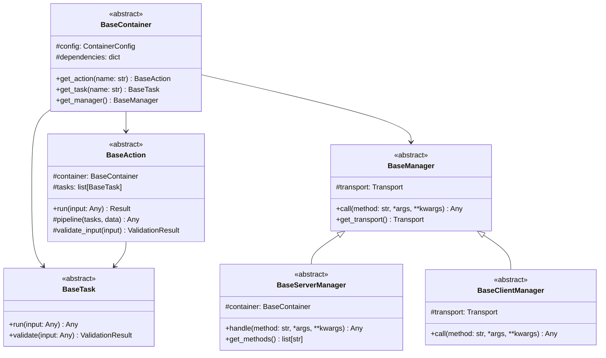
```mermaid
classDiagram
    class BaseAction {
        <<abstract>>
        #container: BaseContainer
        #tasks: list[BaseTask]
        +run(input: Any) Result
        #pipeline(tasks, data) Any
        #validate_input(input) ValidationResult
    }
    
    class BaseTask {
        <<abstract>>
        +run(input: Any) Any
        +validate(input: Any) ValidationResult
    }
    
    class BaseContainer {
        <<abstract>>
        #config: ContainerConfig
        #dependencies: dict
        +get_action(name: str) BaseAction
        +get_task(name: str) BaseTask
        +get_manager() BaseManager
    }
    
    class BaseManager {
        <<abstract>>
        #transport: Transport
        +call(method: str, *args, **kwargs) Any
        +get_transport() Transport
    }
    
    class BaseServerManager {
        <<abstract>>
        #container: BaseContainer
        +handle(method: str, *args, **kwargs) Any
        +get_methods() list[str]
    }
    
    class BaseClientManager {
        <<abstract>>
        #transport: Transport
        +call(method: str, *args, **kwargs) Any
    }
    
    BaseManager <|-- BaseServerManager
    BaseManager <|-- BaseClientManager
    BaseContainer --> BaseAction
    BaseContainer --> BaseTask
    BaseContainer --> BaseManager
    BaseAction --> BaseTask
```

### 🌉 Bridge Deck — Protocols

```python
# ship/bridge_deck/protocols/manager_protocol.py
from typing import Protocol, Any, TypeVar, Generic
from abc import abstractmethod

T = TypeVar('T')

class ManagerProtocol(Protocol):
    """🔗 Базовый протокол для Manager Pattern"""
    
    @abstractmethod
    async def call(self, method: str, *args: Any, **kwargs: Any) -> Any:
        """Вызов метода через транспорт"""
        ...

class ServerManagerProtocol(ManagerProtocol):
    """🖥️ Протокол серверного менеджера"""
    
    @abstractmethod
    def get_methods(self) -> list[str]:
        """Получить список доступных методов"""
        ...
    
    @abstractmethod
    async def handle(self, method: str, *args: Any, **kwargs: Any) -> Any:
        """Обработка входящего вызова"""
        ...

class ClientManagerProtocol(ManagerProtocol):
    """📱 Протокол клиентского менеджера"""
    
    @abstractmethod
    def set_transport(self, transport: 'TransportProtocol') -> None:
        """Установить транспорт для вызовов"""
        ...

class TransportProtocol(Protocol):
    """🚀 Протокол транспорта между контейнерами"""
    
    @abstractmethod
    async def send(self, method: str, *args: Any, **kwargs: Any) -> Any:
        """Отправить запрос"""
        ...
    
    @abstractmethod
    async def connect(self) -> None:
        """Установить соединение"""
        ...
    
    @abstractmethod
    async def disconnect(self) -> None:
        """Закрыть соединение"""
        ...
```

### ⚙️ Engine Room — Transport Layer

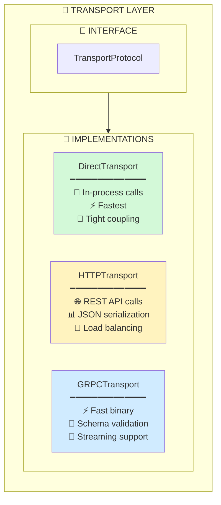
```mermaid
flowchart TB
    subgraph transport["🚀 TRANSPORT LAYER"]
        direction TB
        
        subgraph interface["📜 INTERFACE"]
            TP["TransportProtocol"]
        end
        
        subgraph implementations["🔧 IMPLEMENTATIONS"]
            DT["DirectTransport<br/>━━━━━━━━━━━━━━<br/>📍 In-process calls<br/>⚡ Fastest<br/>🔗 Tight coupling"]
            
            HT["HTTPTransport<br/>━━━━━━━━━━━━━━<br/>🌐 REST API calls<br/>📊 JSON serialization<br/>🔀 Load balancing"]
            
            GT["GRPCTransport<br/>━━━━━━━━━━━━━━<br/>⚡ Fast binary<br/>📝 Schema validation<br/>🔄 Streaming support"]
        end
        
        interface --> implementations
    end
    
    style DT fill:#d3f9d8
    style HT fill:#fff3bf
    style GT fill:#d0ebff
```

```python
# ship/engine_room/transport/base_transport.py
from abc import ABC, abstractmethod
from typing import Any

class BaseTransport(ABC):
    """🚀 Базовый класс транспорта"""
    
    @abstractmethod
    async def send(self, method: str, *args: Any, **kwargs: Any) -> Any:
        """Отправить запрос"""
        pass
    
    @abstractmethod
    async def connect(self) -> None:
        """Установить соединение"""
        pass
    
    @abstractmethod
    async def disconnect(self) -> None:
        """Закрыть соединение"""
        pass


# ship/engine_room/transport/direct_transport.py
class DirectTransport(BaseTransport):
    """📍 Прямой вызов в том же процессе"""
    
    def __init__(self, server_manager: 'BaseServerManager'):
        self._server = server_manager
    
    async def send(self, method: str, *args: Any, **kwargs: Any) -> Any:
        return await self._server.handle(method, *args, **kwargs)
    
    async def connect(self) -> None:
        pass  # No connection needed
    
    async def disconnect(self) -> None:
        pass


# ship/engine_room/transport/grpc_transport.py
class GRPCTransport(BaseTransport):
    """⚡ gRPC транспорт для микросервисов"""
    
    def __init__(self, host: str, port: int):
        self._host = host
        self._port = port
        self._channel = None
        self._stub = None
    
    async def send(self, method: str, *args: Any, **kwargs: Any) -> Any:
        # Serialize and send via gRPC
        request = self._serialize(method, args, kwargs)
        response = await self._stub.Call(request)
        return self._deserialize(response)
    
    async def connect(self) -> None:
        import grpc
        self._channel = grpc.aio.insecure_channel(f'{self._host}:{self._port}')
        # Initialize stub...
    
    async def disconnect(self) -> None:
        if self._channel:
            await self._channel.close()
```

---

## 📦 Containers Layer — Бизнес-логика

### 🔗 Manager Pattern — Связывание контейнеров

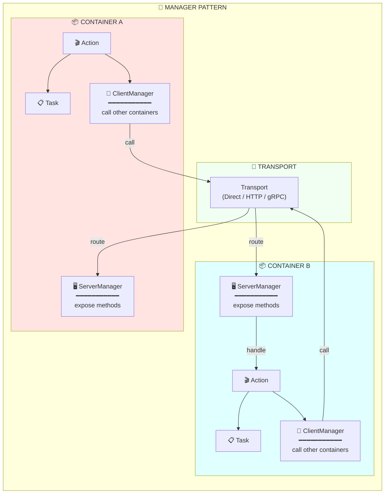
```mermaid
flowchart TB
    subgraph manager_pattern["🔗 MANAGER PATTERN"]
        direction TB
        
        subgraph container_a["📦 CONTAINER A"]
            direction TB
            A_ACTION["🎬 Action"]
            A_TASK["📋 Task"]
            A_SERVER["🖥️ ServerManager<br/>━━━━━━━━━━━<br/>expose methods"]
            A_CLIENT["📱 ClientManager<br/>━━━━━━━━━━━<br/>call other containers"]
            
            A_ACTION --> A_TASK
            A_ACTION --> A_CLIENT
        end
        
        subgraph container_b["📦 CONTAINER B"]
            direction TB
            B_ACTION["🎬 Action"]
            B_TASK["📋 Task"]
            B_SERVER["🖥️ ServerManager<br/>━━━━━━━━━━━<br/>expose methods"]
            B_CLIENT["📱 ClientManager<br/>━━━━━━━━━━━<br/>call other containers"]
            
            B_ACTION --> B_TASK
            B_ACTION --> B_CLIENT
        end
        
        subgraph transport_layer["🚀 TRANSPORT"]
            TRANSPORT["Transport<br/>(Direct / HTTP / gRPC)"]
        end
        
        A_CLIENT -->|"call"| TRANSPORT
        TRANSPORT -->|"route"| B_SERVER
        B_SERVER -->|"handle"| B_ACTION
        
        B_CLIENT -->|"call"| TRANSPORT
        TRANSPORT -->|"route"| A_SERVER
    end
    
    style container_a fill:#FFE4E1
    style container_b fill:#E0FFFF
    style transport_layer fill:#F0FFF0
```

### 📝 Пример реализации Manager Pattern

```python
# containers/execution/voting/managers/voting_server_manager.py
from ship.containers_bay.base_manager import BaseServerManager
from typing import Any

class VotingServerManager(BaseServerManager):
    """🖥️ Серверный менеджер для Voting Container"""
    
    def __init__(self, container: 'VotingContainer'):
        self._container = container
        self._methods = {
            'run_voting': self._run_voting,
            'get_results': self._get_results,
            'check_consensus': self._check_consensus,
        }
    
    def get_methods(self) -> list[str]:
        return list(self._methods.keys())
    
    async def handle(self, method: str, *args: Any, **kwargs: Any) -> Any:
        if method not in self._methods:
            raise ValueError(f"Unknown method: {method}")
        return await self._methods[method](*args, **kwargs)
    
    async def _run_voting(self, responses: list[dict], k: int = 3) -> dict:
        """🗳️ Запустить голосование"""
        action = self._container.get_action('run_voting')
        return await action.run(responses=responses, k=k)
    
    async def _get_results(self, voting_id: str) -> dict:
        """📊 Получить результаты голосования"""
        # Implementation...
        pass
    
    async def _check_consensus(self, voting_id: str) -> bool:
        """✅ Проверить достижение консенсуса"""
        # Implementation...
        pass


# containers/execution/voting/managers/voting_client_manager.py
from ship.containers_bay.base_manager import BaseClientManager
from ship.engine_room.transport import BaseTransport
from typing import Any

class VotingClientManager(BaseClientManager):
    """📱 Клиентский менеджер для вызова Voting Container"""
    
    def __init__(self, transport: BaseTransport = None):
        self._transport = transport
    
    def set_transport(self, transport: BaseTransport) -> None:
        self._transport = transport
    
    async def call(self, method: str, *args: Any, **kwargs: Any) -> Any:
        if not self._transport:
            raise RuntimeError("Transport not configured")
        return await self._transport.send(method, *args, **kwargs)
    
    # 🎯 Типизированные методы для удобства
    
    async def run_voting(self, responses: list[dict], k: int = 3) -> dict:
        """🗳️ Запустить голосование"""
        return await self.call('run_voting', responses=responses, k=k)
    
    async def get_results(self, voting_id: str) -> dict:
        """📊 Получить результаты голосования"""
        return await self.call('get_results', voting_id=voting_id)
    
    async def check_consensus(self, voting_id: str) -> bool:
        """✅ Проверить достижение консенсуса"""
        return await self.call('check_consensus', voting_id=voting_id)
```

### 🔄 Конфигурация транспортов

```python
# ship/engine_room/transport/transport_factory.py
from enum import Enum
from typing import Any

class TransportType(Enum):
    DIRECT = "direct"
    HTTP = "http"
    GRPC = "grpc"

class TransportFactory:
    """🏭 Фабрика транспортов"""
    
    @staticmethod
    def create(
        transport_type: TransportType,
        server_manager: 'BaseServerManager' = None,
        config: dict[str, Any] = None
    ) -> 'BaseTransport':
        
        if transport_type == TransportType.DIRECT:
            if not server_manager:
                raise ValueError("DirectTransport requires server_manager")
            return DirectTransport(server_manager)
        
        elif transport_type == TransportType.HTTP:
            config = config or {}
            return HTTPTransport(
                base_url=config.get('base_url', 'http://localhost:8000'),
                timeout=config.get('timeout', 30)
            )
        
        elif transport_type == TransportType.GRPC:
            config = config or {}
            return GRPCTransport(
                host=config.get('host', 'localhost'),
                port=config.get('port', 50051)
            )
        
        raise ValueError(f"Unknown transport type: {transport_type}")


# Пример использования в конфигурации
CONTAINER_TRANSPORTS = {
    'voting': {
        'type': TransportType.DIRECT,  # В монолите
        # 'type': TransportType.GRPC,  # В микросервисах
        # 'config': {'host': 'voting-service', 'port': 50051}
    },
    'agent_pool': {
        'type': TransportType.DIRECT,
    },
    # ...
}
```

---

## 🧭 Strategic Section (COMPASS)

### 🧠 Meta-Thinker Container

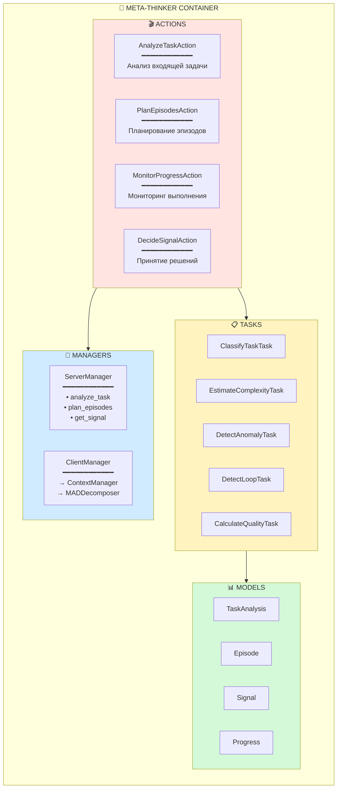
```mermaid
flowchart TB
    subgraph meta_thinker["🧠 META-THINKER CONTAINER"]
        direction TB
        
        subgraph actions["🎬 ACTIONS"]
            A1["AnalyzeTaskAction<br/>━━━━━━━━━━━━<br/>Анализ входящей задачи"]
            A2["PlanEpisodesAction<br/>━━━━━━━━━━━━<br/>Планирование эпизодов"]
            A3["MonitorProgressAction<br/>━━━━━━━━━━━━<br/>Мониторинг выполнения"]
            A4["DecideSignalAction<br/>━━━━━━━━━━━━<br/>Принятие решений"]
        end
        
        subgraph tasks["📋 TASKS"]
            T1["ClassifyTaskTask"]
            T2["EstimateComplexityTask"]
            T3["DetectAnomalyTask"]
            T4["DetectLoopTask"]
            T5["CalculateQualityTask"]
        end
        
        subgraph models["📊 MODELS"]
            M1["TaskAnalysis"]
            M2["Episode"]
            M3["Signal"]
            M4["Progress"]
        end
        
        subgraph managers["🔗 MANAGERS"]
            SM["ServerManager<br/>━━━━━━━━━━━━<br/>• analyze_task<br/>• plan_episodes<br/>• get_signal"]
            CM["ClientManager<br/>━━━━━━━━━━━━<br/>→ ContextManager<br/>→ MADDecomposer"]
        end
        
        actions --> tasks
        tasks --> models
        actions --> managers
    end
    
    style actions fill:#FFE4E1
    style tasks fill:#fff3bf
    style models fill:#d3f9d8
    style managers fill:#d0ebff
```

### 🚨 Система сигналов

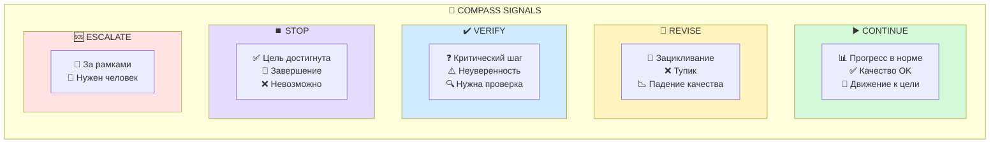
```mermaid
flowchart LR
    subgraph signals["🚨 COMPASS SIGNALS"]
        direction TB
        
        subgraph continue_signal["▶️ CONTINUE"]
            CS["📊 Прогресс в норме<br/>✅ Качество OK<br/>🎯 Движение к цели"]
        end
        
        subgraph revise_signal["🔄 REVISE"]
            RS["🔁 Зацикливание<br/>❌ Тупик<br/>📉 Падение качества"]
        end
        
        subgraph verify_signal["✔️ VERIFY"]
            VS["❓ Критический шаг<br/>⚠️ Неуверенность<br/>🔍 Нужна проверка"]
        end
        
        subgraph stop_signal["⏹️ STOP"]
            SS["✅ Цель достигнута<br/>🏁 Завершение<br/>❌ Невозможно"]
        end
        
        subgraph escalate_signal["🆘 ESCALATE"]
            ES["🤷 За рамками<br/>👤 Нужен человек"]
        end
    end
    
    style continue_signal fill:#d3f9d8
    style revise_signal fill:#fff3bf
    style verify_signal fill:#d0ebff
    style stop_signal fill:#e5dbff
    style escalate_signal fill:#ffe3e3
```

### 📋 Context Manager Container

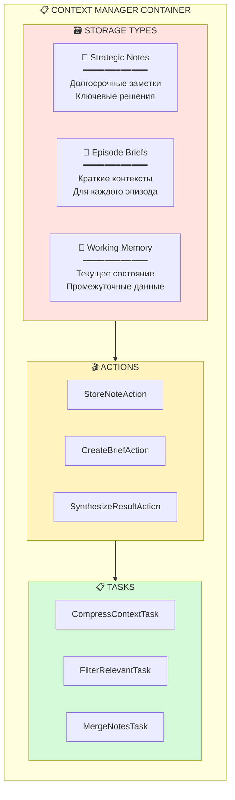
```mermaid
flowchart TB
    subgraph context_manager["📋 CONTEXT MANAGER CONTAINER"]
        direction TB
        
        subgraph storage["🗃️ STORAGE TYPES"]
            ST1["📜 Strategic Notes<br/>━━━━━━━━━━━━<br/>Долгосрочные заметки<br/>Ключевые решения"]
            ST2["📝 Episode Briefs<br/>━━━━━━━━━━━━<br/>Краткие контексты<br/>Для каждого эпизода"]
            ST3["🔧 Working Memory<br/>━━━━━━━━━━━━<br/>Текущее состояние<br/>Промежуточные данные"]
        end
        
        subgraph actions["🎬 ACTIONS"]
            A1["StoreNoteAction"]
            A2["CreateBriefAction"]
            A3["SynthesizeResultAction"]
        end
        
        subgraph tasks["📋 TASKS"]
            T1["CompressContextTask"]
            T2["FilterRelevantTask"]
            T3["MergeNotesTask"]
        end
    end
    
    storage --> actions --> tasks
    
    style storage fill:#FFE4E1
    style actions fill:#fff3bf
    style tasks fill:#d3f9d8
```

---

## 🏗️ Execution Section (MAKER)

### 🔨 MAD Decomposer Container

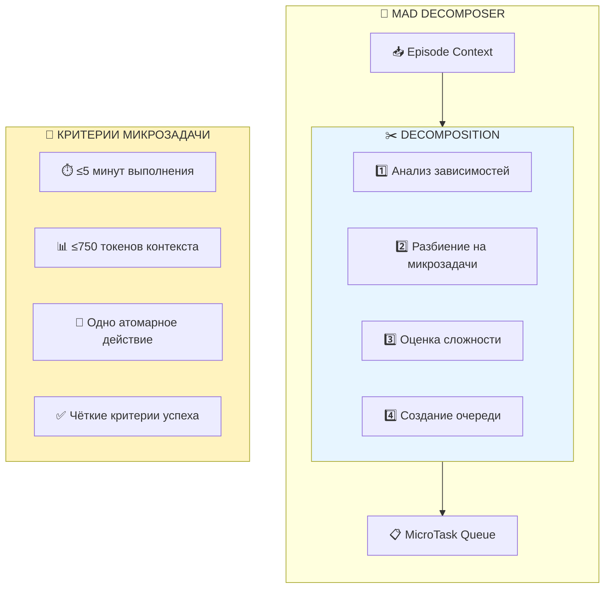
```mermaid
flowchart TB
    subgraph mad["🔨 MAD DECOMPOSER"]
        direction TB
        
        INPUT["📥 Episode Context"]
        
        subgraph decomposition["✂️ DECOMPOSITION"]
            D1["1️⃣ Анализ зависимостей"]
            D2["2️⃣ Разбиение на микрозадачи"]
            D3["3️⃣ Оценка сложности"]
            D4["4️⃣ Создание очереди"]
        end
        
        OUTPUT["📋 MicroTask Queue"]
        
        INPUT --> decomposition --> OUTPUT
    end
    
    subgraph criteria["📏 КРИТЕРИИ МИКРОЗАДАЧИ"]
        C1["⏱️ ≤5 минут выполнения"]
        C2["📊 ≤750 токенов контекста"]
        C3["🎯 Одно атомарное действие"]
        C4["✅ Чёткие критерии успеха"]
    end
    
    style decomposition fill:#e7f5ff
    style criteria fill:#fff3bf
```

### 🤖 Agent Pool + 🚩 Red-Flag + 🗳️ Voting

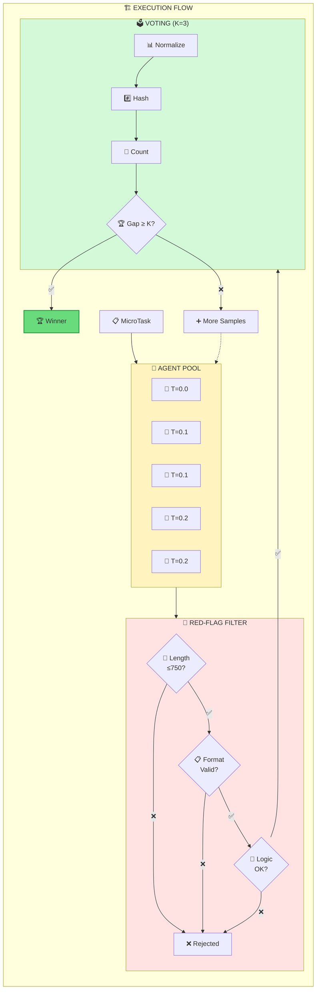
```mermaid
flowchart TB
    subgraph execution_flow["🏗️ EXECUTION FLOW"]
        direction TB
        
        MICRO["📋 MicroTask"]
        
        subgraph agent_pool["🤖 AGENT POOL"]
            direction LR
            AG1["🤖 T=0.0"]
            AG2["🤖 T=0.1"]
            AG3["🤖 T=0.1"]
            AG4["🤖 T=0.2"]
            AG5["🤖 T=0.2"]
        end
        
        subgraph red_flag["🚩 RED-FLAG FILTER"]
            RF1{"📏 Length<br/>≤750?"}
            RF2{"📋 Format<br/>Valid?"}
            RF3{"🔄 Logic<br/>OK?"}
            
            RF1 -->|"✅"| RF2
            RF2 -->|"✅"| RF3
            RF1 -->|"❌"| REJECT
            RF2 -->|"❌"| REJECT
            RF3 -->|"❌"| REJECT
        end
        
        subgraph voting["🗳️ VOTING (K=3)"]
            V1["📊 Normalize"]
            V2["#️⃣ Hash"]
            V3["🔢 Count"]
            V4{"🏆 Gap ≥ K?"}
            
            V1 --> V2 --> V3 --> V4
        end
        
        MICRO --> agent_pool
        agent_pool --> red_flag
        RF3 -->|"✅"| voting
        V4 -->|"✅"| WINNER["🏆 Winner"]
        V4 -->|"❌"| MORE["➕ More Samples"]
        MORE -.-> agent_pool
        
        REJECT["❌ Rejected"]
    end
    
    style agent_pool fill:#fff3bf
    style red_flag fill:#ffe3e3
    style voting fill:#d3f9d8
    style WINNER fill:#69db7c,stroke:#2f9e44,stroke-width:2px
```

---

## 🔌 Integration Section

### ☁️ AI Providers Container

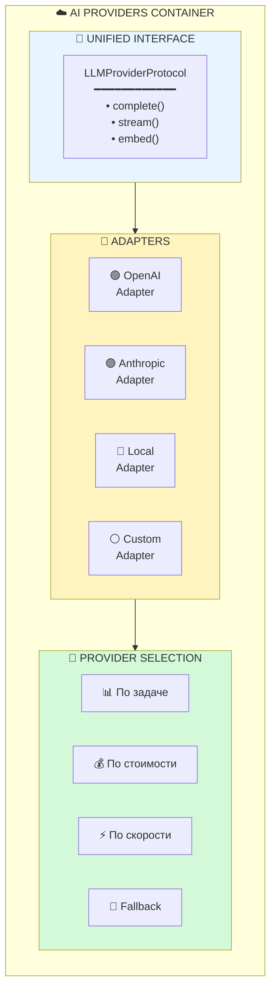
```mermaid
flowchart TB
    subgraph ai_providers["☁️ AI PROVIDERS CONTAINER"]
        direction TB
        
        subgraph interface["📜 UNIFIED INTERFACE"]
            UI["LLMProviderProtocol<br/>━━━━━━━━━━━━<br/>• complete()<br/>• stream()<br/>• embed()"]
        end
        
        subgraph adapters["🔌 ADAPTERS"]
            direction LR
            AD1["🟢 OpenAI<br/>Adapter"]
            AD2["🟣 Anthropic<br/>Adapter"]
            AD3["🔵 Local<br/>Adapter"]
            AD4["⚪ Custom<br/>Adapter"]
        end
        
        subgraph selection["🎯 PROVIDER SELECTION"]
            PS1["📊 По задаче"]
            PS2["💰 По стоимости"]
            PS3["⚡ По скорости"]
            PS4["🔄 Fallback"]
        end
        
        interface --> adapters --> selection
    end
    
    style interface fill:#e7f5ff
    style adapters fill:#fff3bf
    style selection fill:#d3f9d8
```

### ❄️ Nix Environment Container

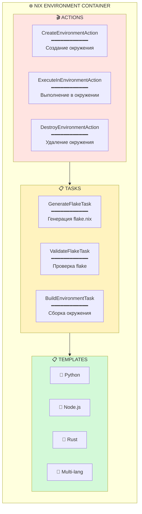
```mermaid
flowchart TB
    subgraph nix_container["❄️ NIX ENVIRONMENT CONTAINER"]
        direction TB
        
        subgraph actions["🎬 ACTIONS"]
            A1["CreateEnvironmentAction<br/>━━━━━━━━━━━━<br/>Создание окружения"]
            A2["ExecuteInEnvironmentAction<br/>━━━━━━━━━━━━<br/>Выполнение в окружении"]
            A3["DestroyEnvironmentAction<br/>━━━━━━━━━━━━<br/>Удаление окружения"]
        end
        
        subgraph tasks["📋 TASKS"]
            T1["GenerateFlakeTask<br/>━━━━━━━━━━━━<br/>Генерация flake.nix"]
            T2["ValidateFlakeTask<br/>━━━━━━━━━━━━<br/>Проверка flake"]
            T3["BuildEnvironmentTask<br/>━━━━━━━━━━━━<br/>Сборка окружения"]
        end
        
        subgraph templates["📋 TEMPLATES"]
            TP1["🐍 Python"]
            TP2["📗 Node.js"]
            TP3["🦀 Rust"]
            TP4["🔧 Multi-lang"]
        end
        
        actions --> tasks
        tasks --> templates
    end
    
    style actions fill:#FFE4E1
    style tasks fill:#fff3bf
    style templates fill:#d3f9d8
```

```python
# containers/integration/nix_environment/actions/create_environment_action.py
from ship.containers_bay.base_action import BaseAction
from ..models.environment_spec import EnvironmentSpec
from ..models.environment_context import EnvironmentContext
from typing import Any
import uuid

class CreateEnvironmentAction(BaseAction):
    """❄️ Создание Nix окружения для агента"""
    
    async def run(self, spec: EnvironmentSpec) -> EnvironmentContext:
        # 1️⃣ Генерация уникального ID
        env_id = str(uuid.uuid4())[:8]
        workspace_path = f"workspaces/agent-{env_id}"
        
        # 2️⃣ Генерация flake.nix
        flake_content = await self._run_task(
            'generate_flake',
            spec=spec
        )
        
        # 3️⃣ Валидация flake
        validation = await self._run_task(
            'validate_flake',
            flake_content=flake_content
        )
        
        if not validation.is_valid:
            raise ValueError(f"Invalid flake: {validation.errors}")
        
        # 4️⃣ Запись файлов
        await self._write_workspace(workspace_path, flake_content, spec)
        
        # 5️⃣ Сборка окружения
        build_result = await self._run_task(
            'build_environment',
            workspace_path=workspace_path
        )
        
        return EnvironmentContext(
            id=env_id,
            workspace_path=workspace_path,
            flake_path=f"{workspace_path}/flake.nix",
            is_ready=build_result.success,
            spec=spec
        )
```

---

## 🎭 Режимы работы системы

### ⚙️ Конфигурация режимов

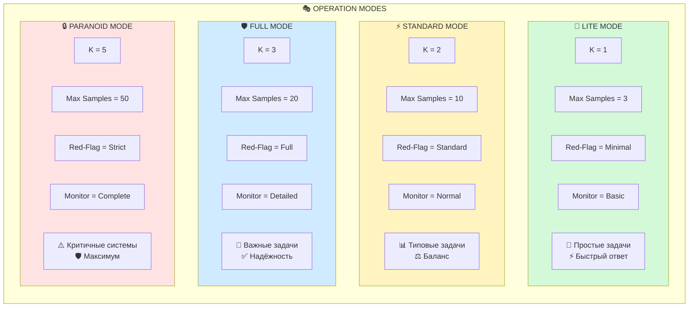
```mermaid
flowchart TB
    subgraph modes["🎭 OPERATION MODES"]
        direction TB
        
        subgraph lite["🚀 LITE MODE"]
            L1["K = 1"]
            L2["Max Samples = 3"]
            L3["Red-Flag = Minimal"]
            L4["Monitor = Basic"]
            L_USE["📝 Простые задачи<br/>⚡ Быстрый ответ"]
        end
        
        subgraph standard["⚡ STANDARD MODE"]
            S1["K = 2"]
            S2["Max Samples = 10"]
            S3["Red-Flag = Standard"]
            S4["Monitor = Normal"]
            S_USE["📊 Типовые задачи<br/>⚖️ Баланс"]
        end
        
        subgraph full["🛡️ FULL MODE"]
            F1["K = 3"]
            F2["Max Samples = 20"]
            F3["Red-Flag = Full"]
            F4["Monitor = Detailed"]
            F_USE["🔧 Важные задачи<br/>✅ Надёжность"]
        end
        
        subgraph paranoid["🔒 PARANOID MODE"]
            P1["K = 5"]
            P2["Max Samples = 50"]
            P3["Red-Flag = Strict"]
            P4["Monitor = Complete"]
            P_USE["⚠️ Критичные системы<br/>🛡️ Максимум"]
        end
    end
    
    style lite fill:#d3f9d8
    style standard fill:#fff3bf
    style full fill:#d0ebff
    style paranoid fill:#ffe3e3
```

### 📊 Сравнительная таблица режимов

| Параметр | 🚀 LITE | ⚡ STANDARD | 🛡️ FULL | 🔒 PARANOID |
|----------|---------|------------|---------|------------|
| **Voting K** | 1 | 2 | 3 | 5 |
| **Max Samples** | 3 | 10 | 20 | 50 |
| **Red-Flag Checks** | Length | + Format | + Logic | + Semantic |
| **Temperature Pool** | [0.0] | [0.0, 0.1] | [0.0, 0.1, 0.2] | [0.0, 0.05, 0.1, 0.15, 0.2] |
| **Monitor Interval** | 20 steps | 10 steps | 5 steps | Every step |
| **Max Revisions** | 2 | 3 | 5 | 10 |
| **Anomaly Threshold** | 0.5 | 0.3 | 0.2 | 0.1 |
| **Target Accuracy** | ~97% | ~99% | ~99.9% | ~99.99% |
| **Latency** | ⚡ Low | 📊 Medium | 📈 High | 🐌 Very High |
| **Cost** | 💰 | 💰💰 | 💰💰💰 | 💰💰💰💰 |

### 🔄 Автоматический выбор режима

```python
# config/mode_selector.py
from enum import Enum
from dataclasses import dataclass

class OperationMode(Enum):
    LITE = "lite"
    STANDARD = "standard"
    FULL = "full"
    PARANOID = "paranoid"

@dataclass
class ModeConfig:
    voting_k: int
    max_samples: int
    red_flag_level: str
    monitor_interval: int
    max_revisions: int
    anomaly_threshold: float
    temperatures: list[float]

MODE_CONFIGS = {
    OperationMode.LITE: ModeConfig(
        voting_k=1,
        max_samples=3,
        red_flag_level="minimal",
        monitor_interval=20,
        max_revisions=2,
        anomaly_threshold=0.5,
        temperatures=[0.0]
    ),
    OperationMode.STANDARD: ModeConfig(
        voting_k=2,
        max_samples=10,
        red_flag_level="standard",
        monitor_interval=10,
        max_revisions=3,
        anomaly_threshold=0.3,
        temperatures=[0.0, 0.1]
    ),
    OperationMode.FULL: ModeConfig(
        voting_k=3,
        max_samples=20,
        red_flag_level="full",
        monitor_interval=5,
        max_revisions=5,
        anomaly_threshold=0.2,
        temperatures=[0.0, 0.1, 0.2]
    ),
    OperationMode.PARANOID: ModeConfig(
        voting_k=5,
        max_samples=50,
        red_flag_level="strict",
        monitor_interval=1,
        max_revisions=10,
        anomaly_threshold=0.1,
        temperatures=[0.0, 0.05, 0.1, 0.15, 0.2]
    ),
}

def select_mode_by_task(task_analysis: 'TaskAnalysis') -> OperationMode:
    """🎯 Автоматический выбор режима по характеристикам задачи"""
    
    if task_analysis.is_critical:
        return OperationMode.PARANOID
    
    if task_analysis.complexity == "high" or task_analysis.estimated_steps > 500:
        return OperationMode.FULL
    
    if task_analysis.complexity == "medium" or task_analysis.estimated_steps > 50:
        return OperationMode.STANDARD
    
    return OperationMode.LITE
```

---

## 🔄 Потоки данных

### 📊 Полный цикл обработки запроса

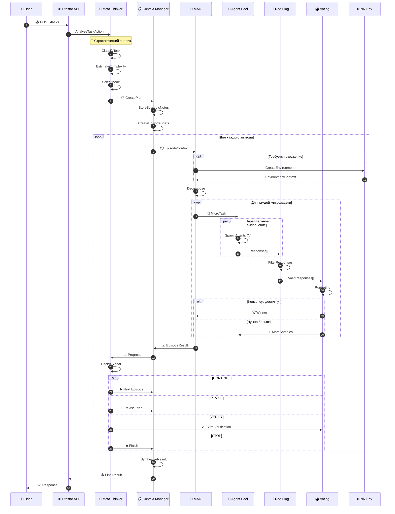
```mermaid
sequenceDiagram
    autonumber
    
    participant U as 👤 User
    participant API as 🌐 Litestar API
    participant MT as 🧠 Meta-Thinker
    participant CM as 📋 Context Manager
    participant MAD as 🔨 MAD
    participant AP as 🤖 Agent Pool
    participant RF as 🚩 Red-Flag
    participant V as 🗳️ Voting
    participant NIX as ❄️ Nix Env
    
    U->>API: 📥 POST /tasks
    API->>MT: AnalyzeTaskAction
    
    Note over MT: 🎯 Стратегический анализ
    MT->>MT: ClassifyTask
    MT->>MT: EstimateComplexity
    MT->>MT: SelectMode
    MT->>CM: 📋 CreatePlan
    
    CM->>CM: StoreStrategicNotes
    CM->>CM: CreateEpisodeBriefs
    
    loop Для каждого эпизода
        CM->>MAD: 📦 EpisodeContext
        
        opt Требуется окружение
            MAD->>NIX: CreateEnvironment
            NIX-->>MAD: EnvironmentContext
        end
        
        MAD->>MAD: Decompose
        
        loop Для каждой микрозадачи
            MAD->>AP: 📝 MicroTask
            
            par Параллельное выполнение
                AP->>AP: SpawnAgents (N)
                AP->>RF: Responses[]
            end
            
            RF->>RF: FilterResponses
            RF->>V: ValidResponses[]
            
            V->>V: RunVoting
            
            alt Консенсус достигнут
                V->>MAD: 🏆 Winner
            else Нужно больше
                V->>AP: ➕ MoreSamples
            end
        end
        
        MAD->>CM: 📊 EpisodeResult
        CM->>MT: 📈 Progress
        
        MT->>MT: DecideSignal
        
        alt CONTINUE
            MT->>CM: ▶️ Next Episode
        else REVISE
            MT->>CM: 🔄 Revise Plan
        else VERIFY
            MT->>V: ✔️ Extra Verification
        else STOP
            MT->>CM: ⏹️ Finish
        end
    end
    
    CM->>CM: SynthesizeResult
    CM->>API: 📤 FinalResult
    API->>U: ✅ Response
```

### 🔀 Взаимодействие контейнеров через Managers

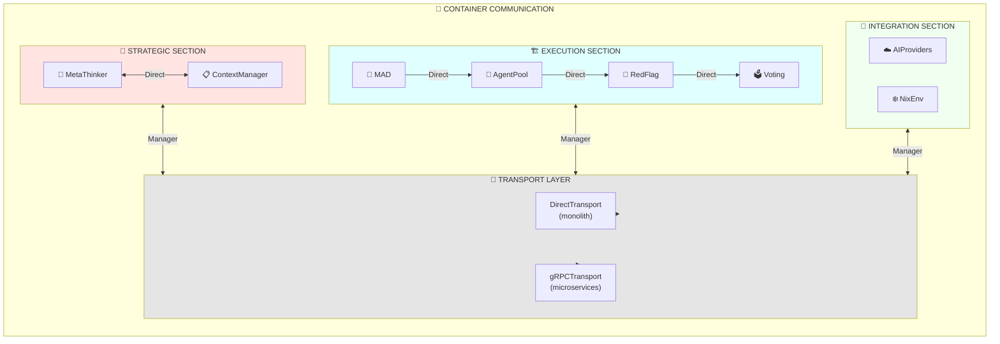
```mermaid
flowchart TB
    subgraph container_communication["🔗 CONTAINER COMMUNICATION"]
        direction TB
        
        subgraph strategic["🧭 STRATEGIC SECTION"]
            MT_C["🧠 MetaThinker"]
            CM_C["📋 ContextManager"]
            
            MT_C <-->|"Direct"| CM_C
        end
        
        subgraph execution["🏗️ EXECUTION SECTION"]
            MAD_C["🔨 MAD"]
            AP_C["🤖 AgentPool"]
            RF_C["🚩 RedFlag"]
            V_C["🗳️ Voting"]
            
            MAD_C -->|"Direct"| AP_C
            AP_C -->|"Direct"| RF_C
            RF_C -->|"Direct"| V_C
        end
        
        subgraph integration["🔌 INTEGRATION SECTION"]
            AI_C["☁️ AIProviders"]
            NIX_C["❄️ NixEnv"]
        end
        
        subgraph transport["🚀 TRANSPORT LAYER"]
            T1["DirectTransport<br/>(monolith)"]
            T2["gRPCTransport<br/>(microservices)"]
        end
        
        strategic <-->|"Manager"| transport
        execution <-->|"Manager"| transport
        integration <-->|"Manager"| transport
        
        transport --> T1
        transport --> T2
    end
    
    style strategic fill:#FFE4E1
    style execution fill:#E0FFFF
    style integration fill:#F0FFF0
    style transport fill:#E5E5E5
```

---

## 📈 Сценарии применения

### 🎯 Сценарий 1: Код-генерация с окружением

```mermaid
sequenceDiagram
    autonumber
    
    participant U as 👤 User
    participant MT as 🧠 MetaThinker
    participant NIX as ❄️ NixEnv
    participant AP as 🤖 AgentPool
    
    U->>MT: "Создай Python проект с FastAPI"
    
    MT->>MT: Analyze: code_generation, medium
    MT->>MT: Mode: STANDARD
    
    MT->>NIX: CreateEnvironment(python, fastapi)
    NIX->>NIX: GenerateFlake
    NIX->>NIX: nix develop
    NIX-->>MT: EnvironmentContext
    
    loop Episodes
        MT->>AP: Execute in environment
        AP->>AP: Run with nix develop --command
        AP-->>MT: Results
    end
    
    MT-->>U: ✅ Project created
```

### 🎯 Сценарий 2: Масштабный анализ данных

```mermaid
sequenceDiagram
    autonumber
    
    participant U as 👤 User
    participant MT as 🧠 MetaThinker
    participant MAD as 🔨 MAD
    participant V as 🗳️ Voting
    
    U->>MT: "Проанализируй 1M записей"
    
    MT->>MT: Analyze: batch_processing, high
    MT->>MT: Mode: FULL (K=3)
    
    MT->>MT: Plan: 1000 episodes × 1000 tasks
    
    Note over MAD,V: Параллельная обработка
    
    loop 1000 Episodes
        MT->>MAD: Episode with 1000 records
        
        par 1000 MicroTasks
            MAD->>V: Process record
            V-->>MAD: Result
        end
        
        MAD-->>MT: Episode complete
    end
    
    MT-->>U: ✅ Analysis complete
```

---

## ⚙️ Техническая реализация

### 🏗️ Litestar Application

```python
# api/app.py
from litestar import Litestar
from litestar.di import Provide
from litestar.openapi import OpenAPIConfig
from litestar.middleware.logging import LoggingMiddlewareConfig

from .routes import health, tasks, environments
from .dependencies.providers import (
    provide_meta_thinker,
    provide_context_manager,
    provide_nix_environment,
)
from config.settings import Settings

def create_app(settings: Settings = None) -> Litestar:
    """🚀 Создание Litestar приложения"""
    
    settings = settings or Settings()
    
    return Litestar(
        route_handlers=[
            health.HealthController,
            tasks.TasksController,
            environments.EnvironmentsController,
        ],
        
        dependencies={
            "meta_thinker": Provide(provide_meta_thinker),
            "context_manager": Provide(provide_context_manager),
            "nix_environment": Provide(provide_nix_environment),
            "settings": Provide(lambda: settings),
        },
        
        openapi_config=OpenAPIConfig(
            title="🧠 AIOBSH API",
            version="1.0.0",
            description="AI-Orchestrated Brain System Hub",
        ),
        
        middleware=[
            LoggingMiddlewareConfig().middleware,
        ],
        
        on_startup=[on_startup],
        on_shutdown=[on_shutdown],
    )

async def on_startup(app: Litestar) -> None:
    """🟢 Startup hook"""
    # Initialize containers, connections, etc.
    pass

async def on_shutdown(app: Litestar) -> None:
    """🔴 Shutdown hook"""
    # Cleanup resources
    pass

# Entry point
app = create_app()
```

### 📊 Dependency Injection

```python
# api/dependencies/providers.py
from ship.engine_room.container_loader import ContainerLoader
from ship.engine_room.transport import TransportFactory, TransportType
from config.settings import Settings

async def provide_meta_thinker(settings: Settings):
    """🧠 Provide Meta-Thinker container"""
    loader = ContainerLoader()
    container = await loader.load('strategic.meta_thinker')
    
    # Configure client managers with transports
    transport_config = settings.transports.get('context_manager')
    transport = TransportFactory.create(
        TransportType(transport_config['type']),
        config=transport_config.get('config')
    )
    container.client_managers['context_manager'].set_transport(transport)
    
    return container

async def provide_context_manager(settings: Settings):
    """📋 Provide Context Manager container"""
    loader = ContainerLoader()
    return await loader.load('strategic.context_manager')

async def provide_nix_environment(settings: Settings):
    """❄️ Provide Nix Environment container"""
    loader = ContainerLoader()
    return await loader.load('integration.nix_environment')
```

---

## 🚀 Roadmap

```mermaid
gantt
    title 🗺️ AIOBSH Development Roadmap
    dateFormat  YYYY-MM
    
    section 📦 v0.1 Foundation
    Ship Layer (Base Classes)     :done, 2024-01, 2024-02
    Bridge Deck (Protocols)       :done, 2024-01, 2024-02
    Basic Containers              :done, 2024-02, 2024-03
    
    section 🧭 v0.2 Strategic
    Meta-Thinker Container        :active, 2024-03, 2024-04
    Context Manager Container     :active, 2024-03, 2024-04
    COMPASS Integration           :2024-04, 2024-05
    
    section 🏗️ v0.3 Execution
    MAD Decomposer                :2024-05, 2024-06
    Agent Pool                    :2024-05, 2024-06
    Red-Flag Filter               :2024-06, 2024-07
    Voting System                 :2024-06, 2024-07
    
    section 🔌 v0.4 Integration
    AI Providers Container        :2024-07, 2024-08
    MCP Integration               :2024-07, 2024-08
    Nix Environment Container     :2024-08, 2024-09
    
    section 🔗 v0.5 Manager Pattern
    Transport Layer               :2024-09, 2024-10
    gRPC Support                  :2024-09, 2024-10
    Microservices Ready           :2024-10, 2024-11
    
    section 🚀 v1.0 Production
    Full Integration              :2024-11, 2024-12
    Performance Optimization      :2024-11, 2024-12
    Documentation                 :2024-12, 2025-01
```

### 📋 Версии и фичи

| Версия | Название | Ключевые фичи |
|--------|----------|---------------|
| **v0.1** | 🏗️ Foundation | Ship Layer, базовые классы, протоколы |
| **v0.2** | 🧭 Strategic | COMPASS (Meta-Thinker, Context Manager) |
| **v0.3** | 🏗️ Execution | MAKER (MAD, Agent Pool, Voting) |
| **v0.4** | 🔌 Integration | AI Providers, MCP, Nix Environments |
| **v0.5** | 🔗 Microservices | Manager Pattern, gRPC, распределённость |
| **v1.0** | 🚀 Production | Полная интеграция, оптимизация |

---

## 📚 Глоссарий

| Термин | Описание |
|--------|----------|
| 🧠 **AIOBSH** | AI-Orchestrated Brain System Hub |
| 🧭 **COMPASS** | Context-Organized Multi-Agent Planning And Strategy System |
| 🏗️ **MAKER** | Maximal Agentic decomposition, first-to-ahead-by-K Error correction, Red-flagging |
| ⚓ **Porto** | Software Architectural Pattern для масштабируемых приложений |
| ❄️ **Nix Flake** | Декларативная система управления окружениями |
| 🖥️ **Snowfall** | Библиотека для структурирования Nix конфигураций (для серверов) |
| 🔗 **Manager Pattern** | Паттерн связывания контейнеров через Server/Client Managers |
| 🚀 **Transport** | Абстракция транспорта (Direct/HTTP/gRPC) |
| 🧠 **Meta-Thinker** | Стратегический компонент планирования и мониторинга |
| 🔨 **MAD** | Maximal Agentic Decomposition — декомпозиция на микрозадачи |
| 🗳️ **First-to-K** | Правило голосования: побеждает набравший K+ отрыв |
| 🚩 **Red-Flag** | Фильтрация подозрительных ответов |

---

## 📖 Ссылки

- 📄 [COMPASS Paper](https://arxiv.org/) — Оригинальная статья COMPASS
- 📄 [MAKER Paper (arXiv:2511.09030)](https://arxiv.org/abs/2511.09030) — Оригинальная статья MAKER
- 📘 [Porto Documentation](https://mahmoudz.github.io/Porto/) — Официальная документация Porto
- ⚡ [Litestar Documentation](https://litestar.dev/) — Документация Litestar
- ❄️ [Nix Flakes](https://nixos.wiki/wiki/Flakes) — Документация Nix Flakes
- 🖥️ [Snowfall Lib](https://snowfall.org/) — Документация Snowfall (для серверов)

---

<div align="center">

### 🧠 AIOBSH: Думай × Выполняй × Интегрируй × Масштабируй 🧠

**🧭 Стратегия COMPASS | 🏗️ Надёжность MAKER | ⚡ Скорость Litestar | ⚓ Модульность Porto | ❄️ Воспроизводимость Nix**

---

*Универсальная платформа для создания надёжных, масштабируемых и самоулучшающихся AI-агентских систем*

</div>

