# 🧭 COMPASS: Умная Система для LLM-Агентов 🚀

## 📋 Оглавление

1. [Проблема](#проблема)
2. [Что такое COMPASS](#что-такое-compass)
3. [Архитектура системы](#архитектура-системы)
4. [Как это работает](#как-это-работает)
5. [Три главных компонента](#три-главных-компонента)
6. [Жизненный цикл задачи](#жизненный-цикл-задачи)
7. [Сравнение подходов](#сравнение-подходов)

---

## 🔥 Проблема

### 😵 Почему LLM-агенты плохо справляются с длинными задачами?

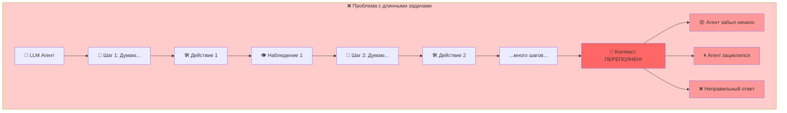

### 🎯 Главные проблемы:

| 😱 Проблема | 📝 Описание |
|-------------|-------------|
| 🧠 **Переполнение контекста** | История диалога становится слишком длинной, важная информация "тонет" |
| 🔄 **Зацикливание** | Агент повторяет одни и те же действия снова и снова |
| 🎭 **Галлюцинации** | Агент выдумывает информацию, которой не было |
| ⏱️ **Преждевременное завершение** | Агент останавливается до того, как нашёл правильный ответ |
| 🌪️ **Потеря фокуса** | Агент забывает о первоначальной цели |

---

## 🧭 Что такое COMPASS?

**COMPASS** = **C**ontext-**O**rganized **M**ulti-Agent **P**lanning **A**nd **S**trategy **S**ystem

> 🎯 **Главная идея**: Разделить работу между тремя специализированными "агентами", каждый из которых отвечает за свою часть!

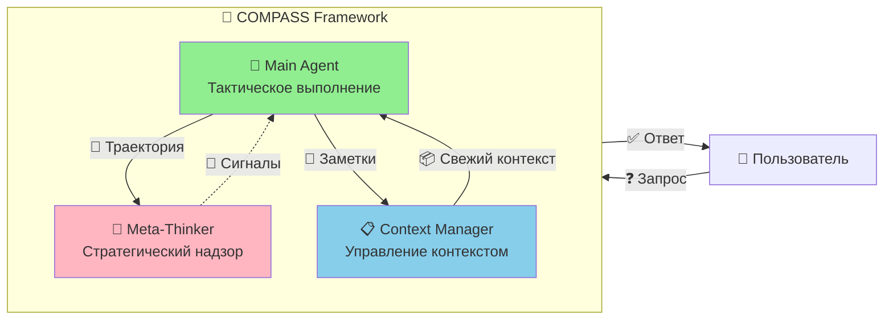

---

## 🏗️ Архитектура системы

### 📊 Полная схема взаимодействия:

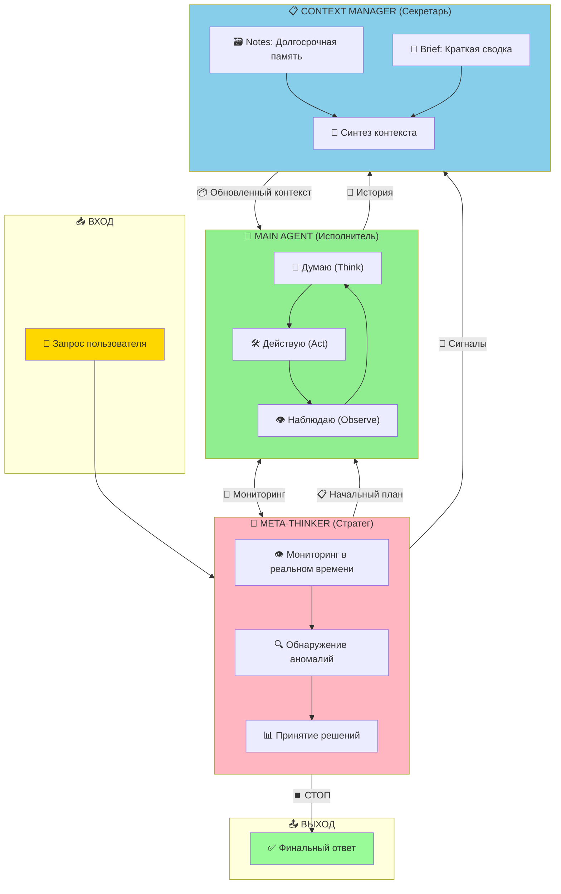

---

## ⚙️ Как это работает?

### 🔄 Двойной цикл COMPASS:

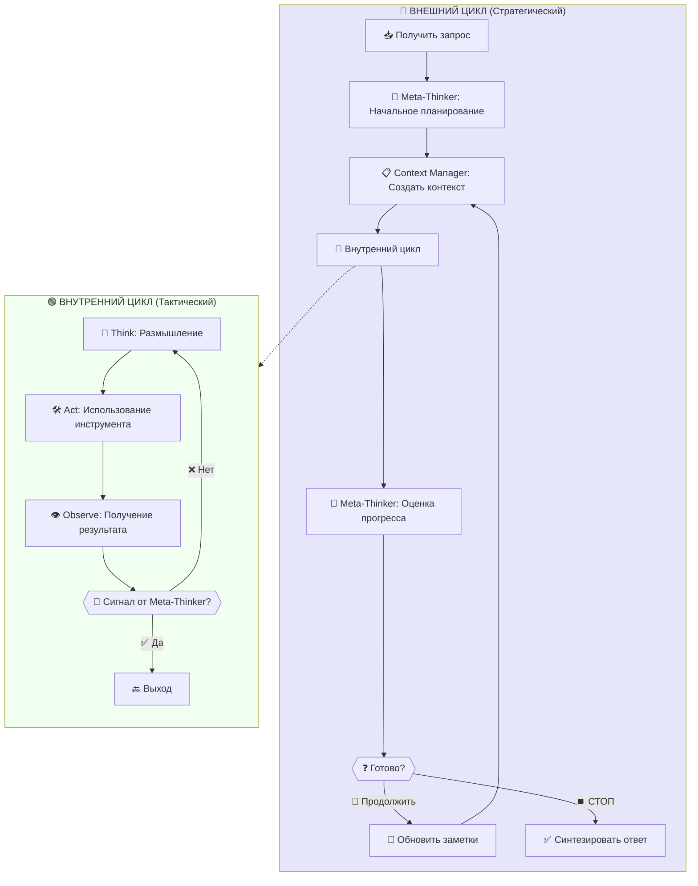

### 📝 Пошаговое описание:

| Шаг | 🎭 Кто | 📋 Что делает |
|-----|--------|---------------|
| 1️⃣ | 🧠 Meta-Thinker | Создаёт начальный план из запроса пользователя |
| 2️⃣ | 📋 Context Manager | Формирует первый контекст для работы |
| 3️⃣ | 🤖 Main Agent | Начинает цикл Think → Act → Observe |
| 4️⃣ | 🧠 Meta-Thinker | Асинхронно мониторит процесс |
| 5️⃣ | 🚨 При обнаружении проблемы | Meta-Thinker отправляет сигнал |
| 6️⃣ | 📋 Context Manager | Создаёт свежий, очищенный контекст |
| 7️⃣ | 🤖 Main Agent | Продолжает работу с новым контекстом |
| 8️⃣ | 🔄 | Повторяется до получения ответа |

---

## 🎭 Три главных компонента

### 1️⃣ 🤖 Main Agent (Главный Агент)

> **Роль**: Тактический исполнитель

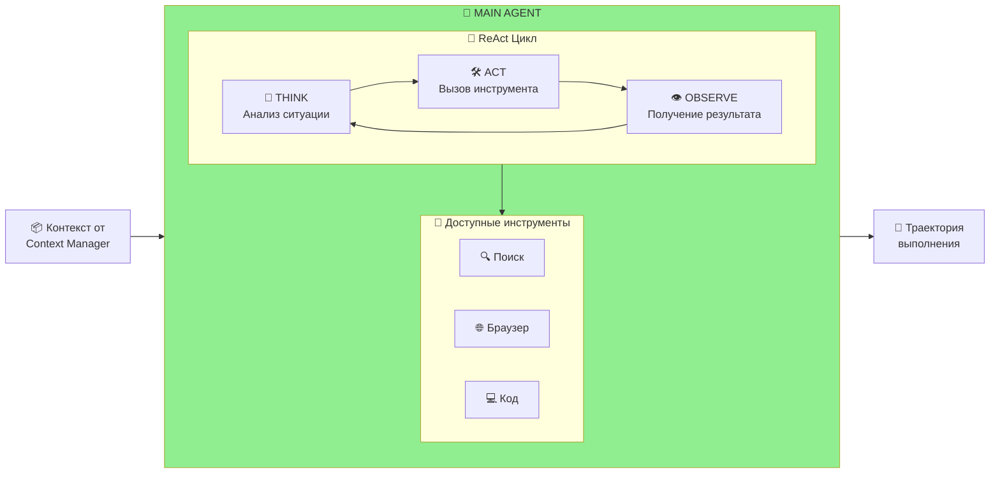

**Что делает:**
- ✅ Выполняет пошаговые рассуждения
- ✅ Использует инструменты (поиск, браузер, код)
- ✅ Работает с обновляемым контекстом
- ❌ НЕ следит за общим прогрессом
- ❌ НЕ принимает стратегических решений

---

### 2️⃣ 🧠 Meta-Thinker (Мета-Мыслитель)

> **Роль**: Стратегический надзиратель

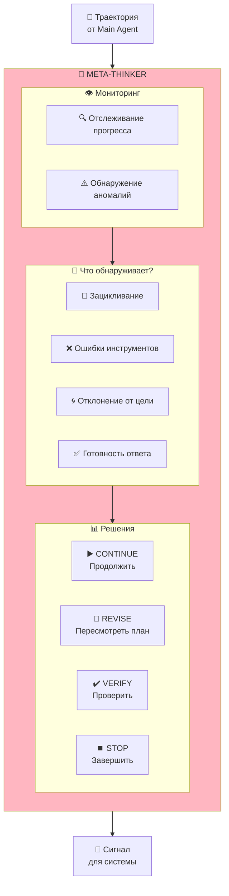

**Типы сигналов:**

| 🚨 Сигнал | 📝 Когда отправляется | 📋 Что происходит |
|-----------|----------------------|-------------------|
| ▶️ **CONTINUE** | Всё идёт хорошо | Продолжаем работу |
| 🔄 **REVISE** | Обнаружен тупик | Меняем стратегию |
| ✔️ **VERIFY** | Нужна проверка | Верифицируем данные |
| ⏹️ **STOP** | Ответ готов | Формируем финальный ответ |

---

### 3️⃣ 📋 Context Manager (Менеджер Контекста)

> **Роль**: Организатор информации

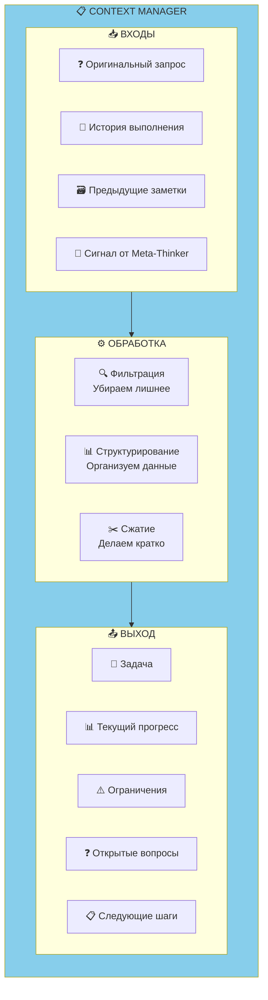

**Структура генерируемого контекста:**

```
📦 КОНТЕКСТНЫЙ БРИФИНГ
├── 📝 Задача: Краткое описание цели
├── 📊 Последние находки: 2-5 пунктов
├── ⚠️ Ограничения: Важные условия
├── ❓ Открытые вопросы: Что ещё нужно
└── 📋 Следующие шаги: План действий
```

---

## 🔄 Жизненный цикл задачи

### 📊 Полная диаграмма состояний:

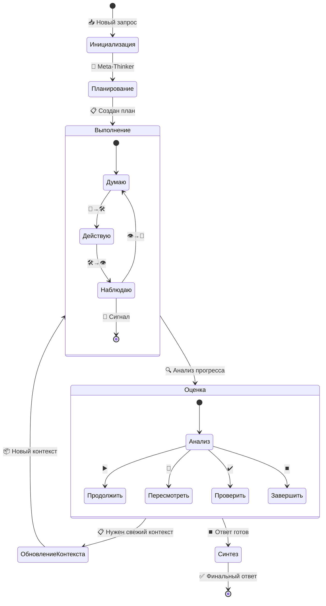

---

## ⚔️ Сравнение подходов

### 📊 Три архитектуры агентов:

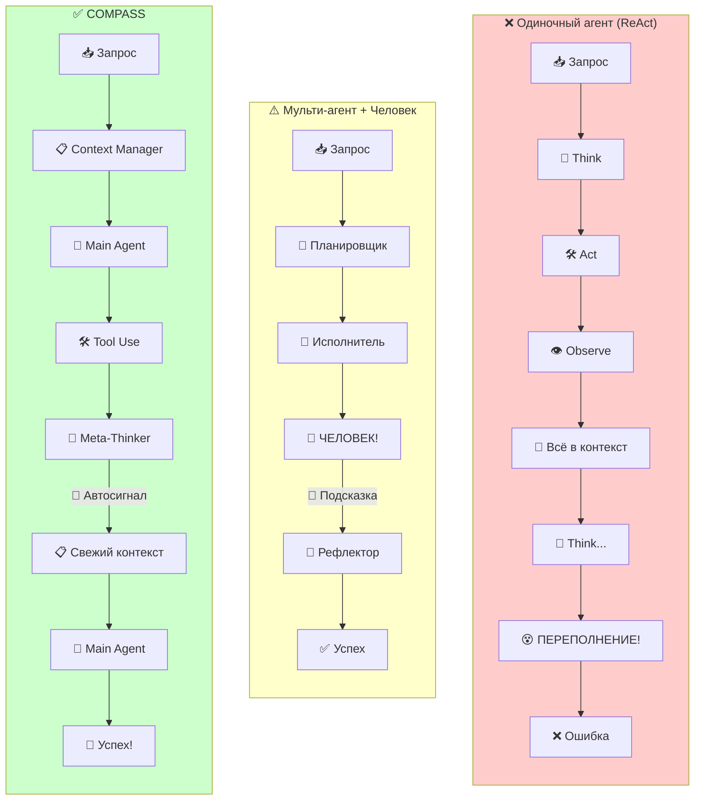

### 📋 Сравнительная таблица:

| Характеристика | ❌ Single Agent | ⚠️ Multi-Agent + Human | ✅ COMPASS |
|----------------|-----------------|------------------------|------------|
| 🤖 **Автономность** | ✅ Полная | ❌ Нужен человек | ✅ Полная |
| 📊 **Управление контекстом** | ❌ Нет | ⚠️ Частичное | ✅ Есть |
| 🔄 **Масштабируемость** | ✅ Да | ❌ Нет | ✅ Да |
| 🧠 **Стратегическое мышление** | ❌ Нет | ✅ Через человека | ✅ Автоматическое |
| 🎯 **Точность** | ⬇️ Низкая | ⬆️ Высокая | ⬆️ Высокая |

---

## 📈 Типичные сценарии

### 🎯 Сценарий 1: Локальная ошибка

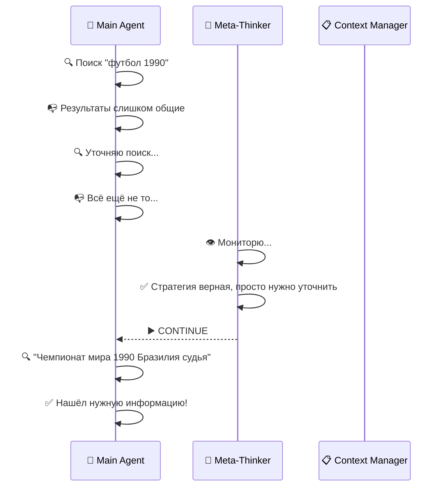

### 🎯 Сценарий 2: Стратегический тупик

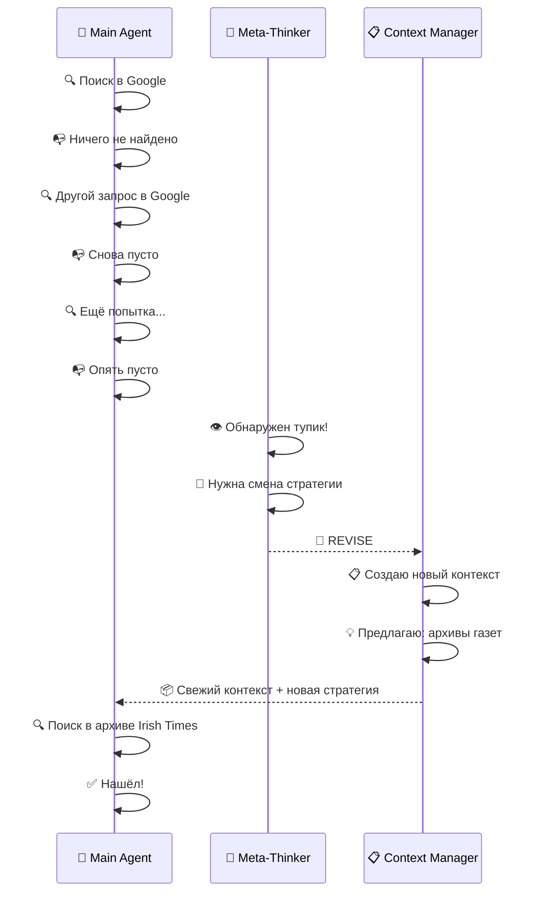

---

## 🎨 Визуальное резюме

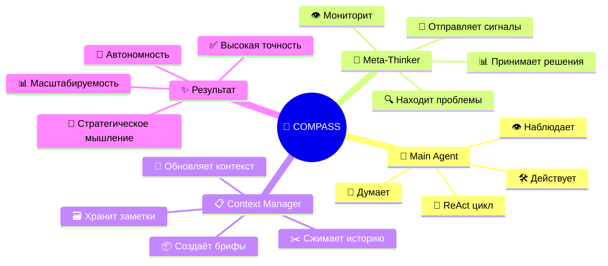

---

## 🏆 Ключевые преимущества COMPASS

| 🌟 Преимущество | 📝 Как достигается |
|-----------------|-------------------|
| 🧠 **Не теряет фокус** | Context Manager постоянно обновляет контекст |
| 🔄 **Не зацикливается** | Meta-Thinker обнаруживает и прерывает циклы |
| 🎯 **Адаптивность** | Автоматическая смена стратегии при тупиках |
| 📊 **Эффективность** | Сжатый контекст вместо полной истории |
| 🤖 **Полная автономность** | Не требует вмешательства человека |

---

## 🎬 Заключение

**COMPASS** — это умная архитектура для LLM-агентов, которая решает главную проблему длинных задач: **потерю контекста и стратегического фокуса**.

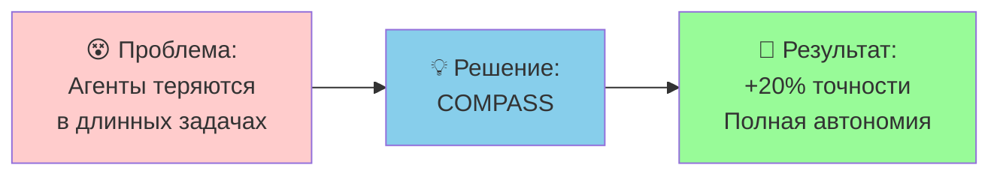

**Три простых принципа:**
1. 🤖 **Разделяй** — каждый агент делает своё дело
2. 🧠 **Наблюдай** — Meta-Thinker всегда следит за прогрессом  
3. 📋 **Обновляй** — Context Manager держит контекст свежим и релевантным

---

*Надеюсь, это объяснение помогло понять принцип работы COMPASS! 🎉*