# 🧭🏗️ COMPASS-MAKER: Гибридная Архитектура для Надёжных LLM-Агентов

> **Объединение стратегического мышления COMPASS с надёжностью выполнения MAKER**

---

## 📋 Оглавление

1. [🎯 Введение](#-введение)
2. [🔍 Анализ исходных систем](#-анализ-исходных-систем)
   - [🧭 COMPASS: Сильные и слабые стороны](#-compass-сильные-и-слабые-стороны)
   - [🏗️ MAKER: Сильные и слабые стороны](#️-maker-сильные-и-слабые-стороны)
3. [⚡ Синергия: Почему совмещение имеет смысл](#-синергия-почему-совмещение-имеет-смысл)
4. [🏛️ Архитектура COMPASS-MAKER](#️-архитектура-compass-maker)
   - [📊 Общая структура](#-общая-структура)
   - [🧠 Meta-Thinker Enhanced](#-meta-thinker-enhanced)
   - [📋 Context Manager Bridge](#-context-manager-bridge)
   - [🏗️ MAKER Execution Engine](#️-maker-execution-engine)
5. [🔄 Потоки данных и взаимодействия](#-потоки-данных-и-взаимодействия)
6. [🎭 Режимы работы](#-режимы-работы)
7. [🛡️ Система защиты от ошибок](#️-система-защиты-от-ошибок)
8. [📈 Сценарии использования](#-сценарии-использования)
9. [⚙️ Технические детали реализации](#️-технические-детали-реализации)
10. [🎓 Выводы и рекомендации](#-выводы-и-рекомендации)

---

## 🎯 Введение

### 🤔 Зачем нужна гибридная система?

Современные LLM-агенты сталкиваются с **двумя фундаментальными проблемами**:

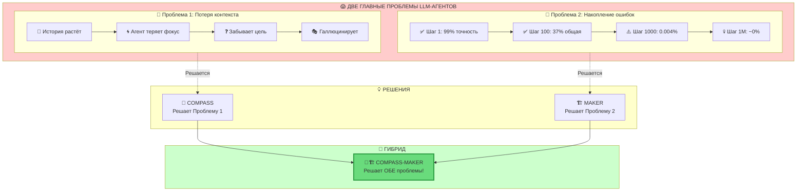
```mermaid
flowchart TB
    subgraph problems["😱 ДВЕ ГЛАВНЫЕ ПРОБЛЕМЫ LLM-АГЕНТОВ"]
        direction TB
        
        subgraph p1["🧠 Проблема 1: Потеря контекста"]
            P1A["📜 История растёт"]
            P1B["🌀 Агент теряет фокус"]
            P1C["❓ Забывает цель"]
            P1D["🎭 Галлюцинирует"]
            
            P1A --> P1B --> P1C --> P1D
        end
        
        subgraph p2["🔗 Проблема 2: Накопление ошибок"]
            P2A["✅ Шаг 1: 99% точность"]
            P2B["✅ Шаг 100: 37% общая"]
            P2C["⚠️ Шаг 1000: 0.004%"]
            P2D["💀 Шаг 1M: ~0%"]
            
            P2A --> P2B --> P2C --> P2D
        end
    end
    
    subgraph solutions["💡 РЕШЕНИЯ"]
        S1["🧭 COMPASS<br/>Решает Проблему 1"]
        S2["🏗️ MAKER<br/>Решает Проблему 2"]
    end
    
    subgraph hybrid["🚀 ГИБРИД"]
        H["🧭🏗️ COMPASS-MAKER<br/>Решает ОБЕ проблемы!"]
    end
    
    p1 -.->|"Решается"| S1
    p2 -.->|"Решается"| S2
    S1 --> H
    S2 --> H
    
    style problems fill:#ffcccc
    style solutions fill:#ffffcc
    style hybrid fill:#ccffcc
    style H fill:#69db7c,stroke:#2f9e44,stroke-width:3px
```

### 🌟 Что такое COMPASS-MAKER?

**COMPASS-MAKER** — это гибридная архитектура, которая объединяет:

| Компонент | Источник | Роль в гибриде |
|-----------|----------|----------------|
| 🧠 **Meta-Thinker** | COMPASS | Стратегическое планирование и мониторинг |
| 📋 **Context Manager** | COMPASS | Управление контекстом и формирование брифов |
| 🔨 **MAD Decomposition** | MAKER | Разбиение на микрозадачи |
| 🗳️ **Voting System** | MAKER | Статистическая коррекция ошибок |
| 🚩 **Red-Flagging** | MAKER | Фильтрация ненадёжных ответов |

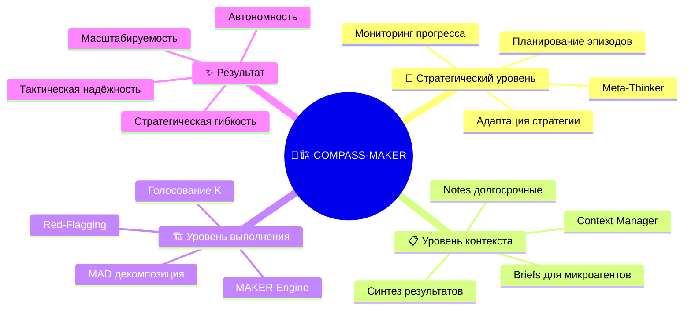
```mermaid
mindmap
    root((🧭🏗️ COMPASS-MAKER))
        🧠 Стратегический уровень
            Meta-Thinker
            Планирование эпизодов
            Мониторинг прогресса
            Адаптация стратегии
        📋 Уровень контекста
            Context Manager
            Notes долгосрочные
            Briefs для микроагентов
            Синтез результатов
        🏗️ Уровень выполнения
            MAKER Engine
            MAD декомпозиция
            Голосование K
            Red-Flagging
        ✨ Результат
            Стратегическая гибкость
            Тактическая надёжность
            Масштабируемость
            Автономность
```

---

## 🔍 Анализ исходных систем

### 🧭 COMPASS: Сильные и слабые стороны

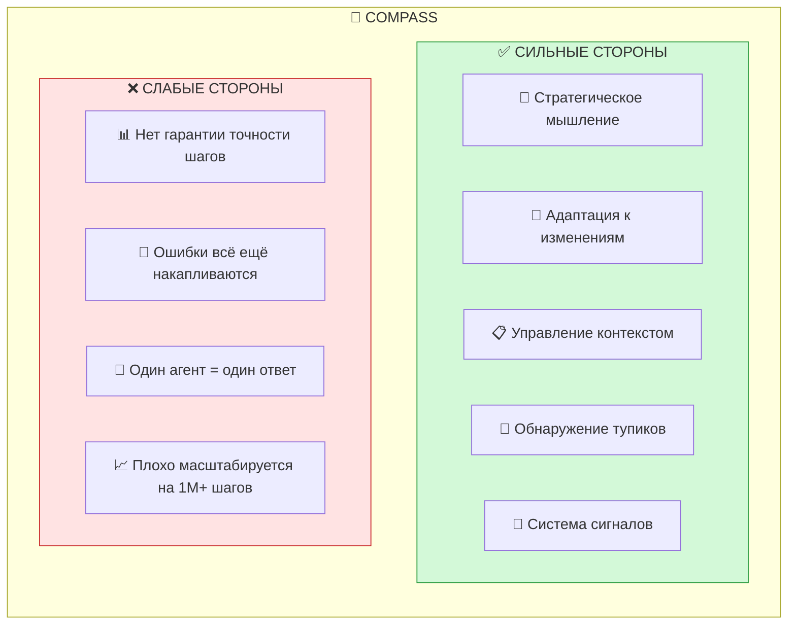
```mermaid
flowchart TB
    subgraph compass["🧭 COMPASS"]
        direction TB
        
        subgraph strengths["✅ СИЛЬНЫЕ СТОРОНЫ"]
            S1["🎯 Стратегическое мышление"]
            S2["🔄 Адаптация к изменениям"]
            S3["📋 Управление контекстом"]
            S4["🧠 Обнаружение тупиков"]
            S5["🚨 Система сигналов"]
        end
        
        subgraph weaknesses["❌ СЛАБЫЕ СТОРОНЫ"]
            W1["📊 Нет гарантии точности шагов"]
            W2["🔗 Ошибки всё ещё накапливаются"]
            W3["🎲 Один агент = один ответ"]
            W4["📈 Плохо масштабируется на 1M+ шагов"]
        end
    end
    
    style strengths fill:#d3f9d8,stroke:#2f9e44
    style weaknesses fill:#ffe3e3,stroke:#c92a2a
```

#### 📊 Детальный анализ компонентов COMPASS:

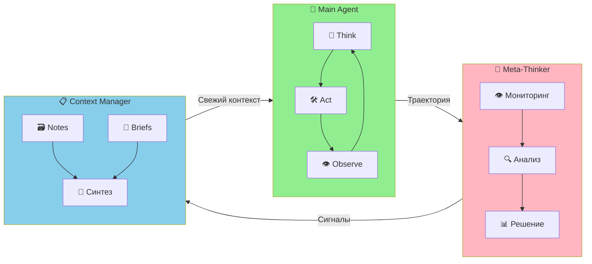
```mermaid
flowchart LR
    subgraph ma["🤖 Main Agent"]
        MA1["💭 Think"]
        MA2["🛠️ Act"]
        MA3["👁️ Observe"]
        MA1 --> MA2 --> MA3 --> MA1
    end
    
    subgraph mt["🧠 Meta-Thinker"]
        MT1["👁️ Мониторинг"]
        MT2["🔍 Анализ"]
        MT3["📊 Решение"]
        MT1 --> MT2 --> MT3
    end
    
    subgraph cm["📋 Context Manager"]
        CM1["🗃️ Notes"]
        CM2["📝 Briefs"]
        CM3["🔄 Синтез"]
        CM1 --> CM3
        CM2 --> CM3
    end
    
    ma -->|"Траектория"| mt
    mt -->|"Сигналы"| cm
    cm -->|"Свежий контекст"| ma
    
    style ma fill:#90EE90
    style mt fill:#FFB6C1
    style cm fill:#87CEEB
```

**🎯 Проблема COMPASS:** Main Agent выполняет каждый шаг **однократно**, без верификации. Если он ошибся — ошибка распространяется дальше.

---

### 🏗️ MAKER: Сильные и слабые стороны

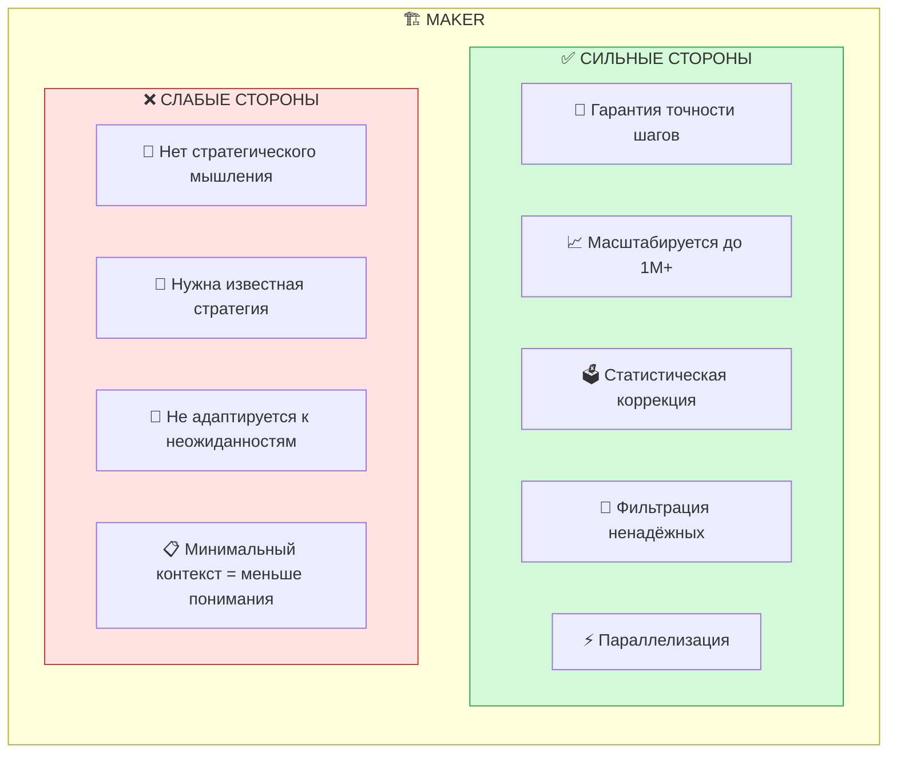
```mermaid
flowchart TB
    subgraph maker["🏗️ MAKER"]
        direction TB
        
        subgraph strengths["✅ СИЛЬНЫЕ СТОРОНЫ"]
            S1["🎯 Гарантия точности шагов"]
            S2["📈 Масштабируется до 1M+"]
            S3["🗳️ Статистическая коррекция"]
            S4["🚩 Фильтрация ненадёжных"]
            S5["⚡ Параллелизация"]
        end
        
        subgraph weaknesses["❌ СЛАБЫЕ СТОРОНЫ"]
            W1["🤖 Нет стратегического мышления"]
            W2["📜 Нужна известная стратегия"]
            W3["🔄 Не адаптируется к неожиданностям"]
            W4["📋 Минимальный контекст = меньше понимания"]
        end
    end
    
    style strengths fill:#d3f9d8,stroke:#2f9e44
    style weaknesses fill:#ffe3e3,stroke:#c92a2a
```

#### 📊 Как MAKER достигает надёжности:

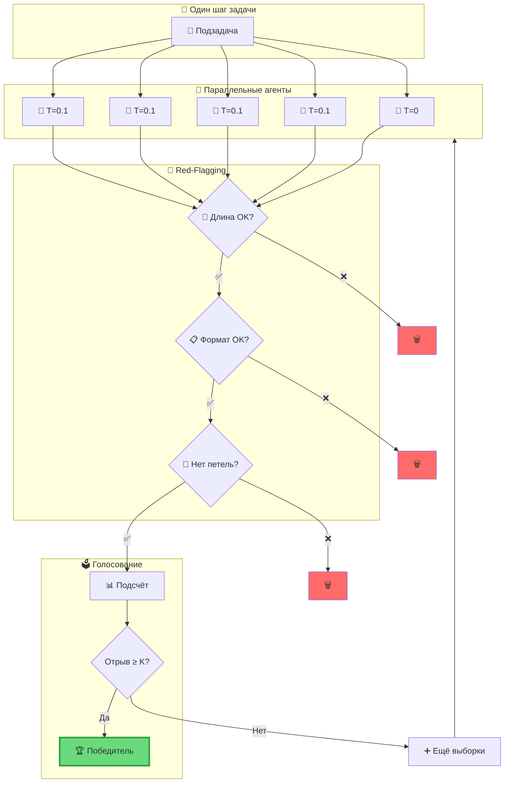
```mermaid
flowchart TB
    subgraph step["📝 Один шаг задачи"]
        TASK["🎯 Подзадача"]
    end
    
    subgraph agents["🤖 Параллельные агенты"]
        A1["🤖 T=0"]
        A2["🤖 T=0.1"]
        A3["🤖 T=0.1"]
        A4["🤖 T=0.1"]
        A5["🤖 T=0.1"]
    end
    
    subgraph filter["🚩 Red-Flagging"]
        F1{"📏 Длина OK?"}
        F2{"📋 Формат OK?"}
        F3{"🔄 Нет петель?"}
    end
    
    subgraph vote["🗳️ Голосование"]
        V1["📊 Подсчёт"]
        V2{"Отрыв ≥ K?"}
        V3["🏆 Победитель"]
    end
    
    TASK --> A1 & A2 & A3 & A4 & A5
    A1 & A2 & A3 & A4 & A5 --> F1
    F1 -->|"✅"| F2
    F1 -->|"❌"| REJECT1["🗑️"]
    F2 -->|"✅"| F3
    F2 -->|"❌"| REJECT2["🗑️"]
    F3 -->|"✅"| V1
    F3 -->|"❌"| REJECT3["🗑️"]
    V1 --> V2
    V2 -->|"Да"| V3
    V2 -->|"Нет"| MORE["➕ Ещё выборки"]
    MORE --> agents
    
    style V3 fill:#69db7c,stroke:#2f9e44,stroke-width:3px
    style REJECT1 fill:#ff6b6b
    style REJECT2 fill:#ff6b6b
    style REJECT3 fill:#ff6b6b
```

**🎯 Проблема MAKER:** Система "слепа" — она не понимает общую картину и не может адаптироваться, если стратегия изначально неверна.

---

## ⚡ Синергия: Почему совмещение имеет смысл

### 🔀 Комплементарность систем

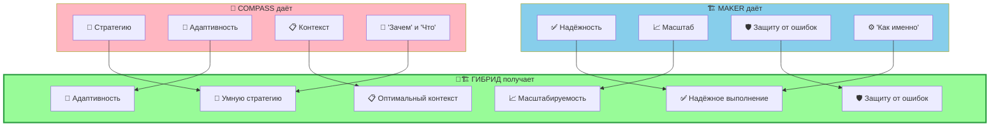
```mermaid
flowchart TB
    subgraph compass_provides["🧭 COMPASS даёт"]
        CP1["🎯 Стратегию"]
        CP2["🔄 Адаптивность"]
        CP3["📋 Контекст"]
        CP4["🧠 'Зачем' и 'Что'"]
    end
    
    subgraph maker_provides["🏗️ MAKER даёт"]
        MP1["✅ Надёжность"]
        MP2["📈 Масштаб"]
        MP3["🛡️ Защиту от ошибок"]
        MP4["⚙️ 'Как именно'"]
    end
    
    subgraph hybrid_gets["🧭🏗️ ГИБРИД получает"]
        H1["🎯 Умную стратегию"]
        H2["✅ Надёжное выполнение"]
        H3["🔄 Адаптивность"]
        H4["📈 Масштабируемость"]
        H5["🛡️ Защиту от ошибок"]
        H6["📋 Оптимальный контекст"]
    end
    
    CP1 --> H1
    CP2 --> H3
    CP3 --> H6
    CP4 --> H1
    
    MP1 --> H2
    MP2 --> H4
    MP3 --> H5
    MP4 --> H2
    
    style compass_provides fill:#FFB6C1
    style maker_provides fill:#87CEEB
    style hybrid_gets fill:#98FB98,stroke:#2f9e44,stroke-width:3px
```

### 📊 Сравнительная таблица

| Критерий | 🤖 Простой Agent | 🧭 COMPASS | 🏗️ MAKER | 🧭🏗️ Гибрид |
|----------|------------------|------------|----------|-------------|
| 📈 **Масштаб** | ~50 шагов | ~500 шагов | 1M+ шагов | **1M+ шагов** |
| 🎯 **Точность на шаг** | ~95% | ~95% | ~99.99% | **~99.99%** |
| 🧠 **Стратегия** | ❌ Нет | ✅ Есть | ❌ Нет | **✅ Есть** |
| 🔄 **Адаптивность** | ⚠️ Низкая | ✅ Высокая | ❌ Нет | **✅ Высокая** |
| 📋 **Контекст** | 📜 Полный | 📦 Управляемый | 📄 Минимум | **📦 Оптимальный** |
| 🛡️ **Защита от ошибок** | ❌ Нет | ⚠️ Частичная | ✅ Полная | **✅ Полная** |
| 💰 **Стоимость** | 💵 Низкая | 💵💵 Средняя | 💵💵💵 Высокая | 💵💵💵 Высокая |

### 🎯 Ключевая идея синергии

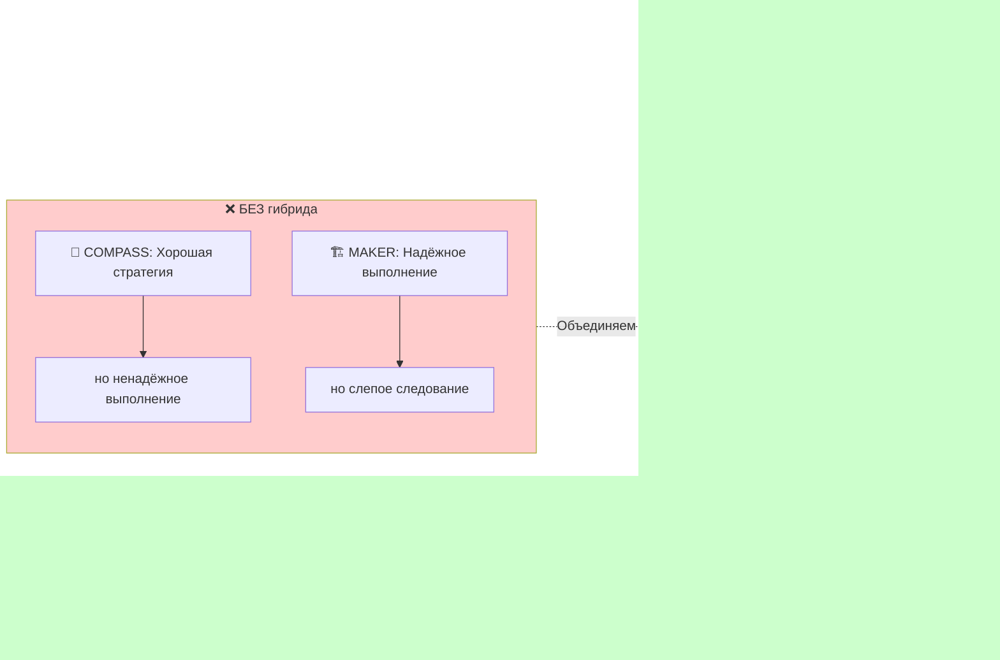
```mermaid
flowchart LR
    subgraph before["❌ БЕЗ гибрида"]
        direction TB
        B1["🧭 COMPASS: Хорошая стратегия"]
        B2["но ненадёжное выполнение"]
        B3["🏗️ MAKER: Надёжное выполнение"]
        B4["но слепое следование"]
        
        B1 --> B2
        B3 --> B4
    end
    
    subgraph after["✅ С гибридом"]
        direction TB
        A1["🧭 COMPASS думает"]
        A2["📋 формирует задачи"]
        A3["🏗️ MAKER выполняет"]
        A4["надёжно и точно"]
        A5["🧭 COMPASS адаптирует"]
        A6["если нужно"]
        
        A1 --> A2 --> A3 --> A4 --> A5 --> A6
        A6 -.-> A1
    end
    
    before -.->|"Объединяем"| after
    
    style before fill:#ffcccc
    style after fill:#ccffcc
```

---

## 🏛️ Архитектура COMPASS-MAKER

### 📊 Общая структура

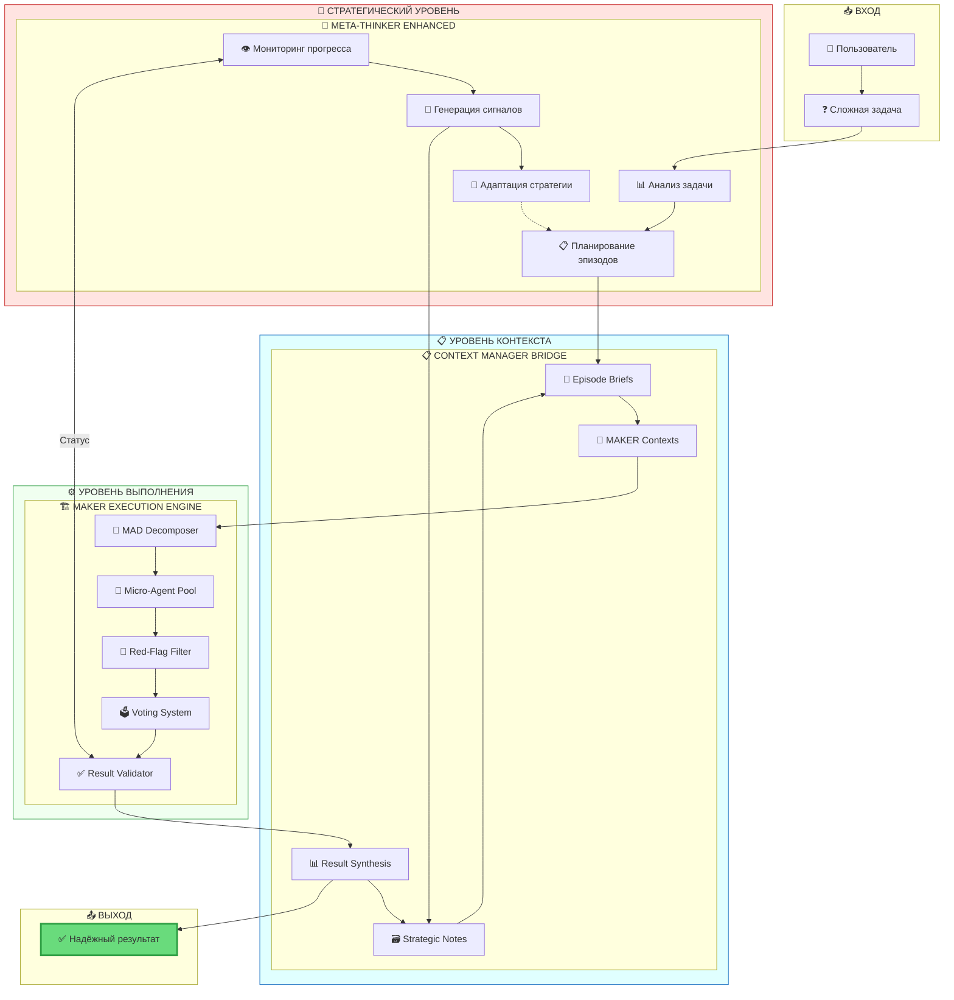
```mermaid
flowchart TB
    subgraph input["📥 ВХОД"]
        USER["👤 Пользователь"]
        QUERY["❓ Сложная задача"]
    end
    
    subgraph strategic["🎯 СТРАТЕГИЧЕСКИЙ УРОВЕНЬ"]
        direction TB
        
        subgraph mt["🧠 META-THINKER ENHANCED"]
            MT1["📊 Анализ задачи"]
            MT2["📋 Планирование эпизодов"]
            MT3["👁️ Мониторинг прогресса"]
            MT4["🚨 Генерация сигналов"]
            MT5["🔄 Адаптация стратегии"]
            
            MT1 --> MT2
            MT3 --> MT4 --> MT5
            MT5 -.-> MT2
        end
    end
    
    subgraph context["📋 УРОВЕНЬ КОНТЕКСТА"]
        direction TB
        
        subgraph cm["📋 CONTEXT MANAGER BRIDGE"]
            CM1["🗃️ Strategic Notes"]
            CM2["📝 Episode Briefs"]
            CM3["🔧 MAKER Contexts"]
            CM4["📊 Result Synthesis"]
            
            CM1 --> CM2
            CM2 --> CM3
            CM4 --> CM1
        end
    end
    
    subgraph execution["⚙️ УРОВЕНЬ ВЫПОЛНЕНИЯ"]
        direction TB
        
        subgraph me["🏗️ MAKER EXECUTION ENGINE"]
            ME1["🔨 MAD Decomposer"]
            ME2["🤖 Micro-Agent Pool"]
            ME3["🗳️ Voting System"]
            ME4["🚩 Red-Flag Filter"]
            ME5["✅ Result Validator"]
            
            ME1 --> ME2 --> ME4 --> ME3 --> ME5
        end
    end
    
    subgraph output["📤 ВЫХОД"]
        RESULT["✅ Надёжный результат"]
    end
    
    USER --> QUERY
    QUERY --> MT1
    MT2 --> CM2
    MT3 <-->|"Статус"| ME5
    MT4 --> CM1
    CM3 --> ME1
    ME5 --> CM4
    CM4 --> RESULT
    
    style strategic fill:#FFE4E1,stroke:#c92a2a
    style context fill:#E0FFFF,stroke:#1971c2
    style execution fill:#F0FFF0,stroke:#2f9e44
    style RESULT fill:#69db7c,stroke:#2f9e44,stroke-width:3px
```

### 🔄 Детальная схема взаимодействия

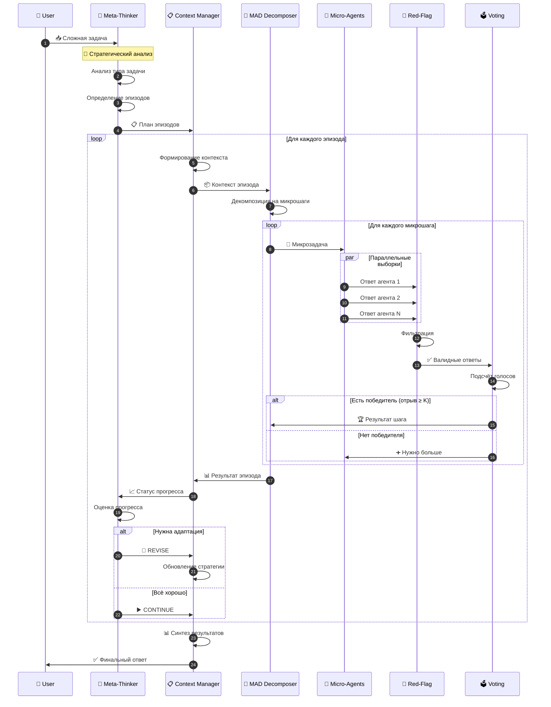
```mermaid
sequenceDiagram
    autonumber
    
    participant U as 👤 User
    participant MT as 🧠 Meta-Thinker
    participant CM as 📋 Context Manager
    participant MAD as 🔨 MAD Decomposer
    participant MA as 🤖 Micro-Agents
    participant RF as 🚩 Red-Flag
    participant V as 🗳️ Voting
    
    U->>MT: 📥 Сложная задача
    
    Note over MT: 🎯 Стратегический анализ
    MT->>MT: Анализ типа задачи
    MT->>MT: Определение эпизодов
    MT->>CM: 📋 План эпизодов
    
    loop Для каждого эпизода
        CM->>CM: Формирование контекста
        CM->>MAD: 📦 Контекст эпизода
        
        MAD->>MAD: Декомпозиция на микрошаги
        
        loop Для каждого микрошага
            MAD->>MA: 📝 Микрозадача
            
            par Параллельные выборки
                MA->>RF: Ответ агента 1
                MA->>RF: Ответ агента 2
                MA->>RF: Ответ агента N
            end
            
            RF->>RF: Фильтрация
            RF->>V: ✅ Валидные ответы
            
            V->>V: Подсчёт голосов
            
            alt Есть победитель (отрыв ≥ K)
                V->>MAD: 🏆 Результат шага
            else Нет победителя
                V->>MA: ➕ Нужно больше
            end
        end
        
        MAD->>CM: 📊 Результат эпизода
        CM->>MT: 📈 Статус прогресса
        
        MT->>MT: Оценка прогресса
        
        alt Нужна адаптация
            MT->>CM: 🔄 REVISE
            CM->>CM: Обновление стратегии
        else Всё хорошо
            MT->>CM: ▶️ CONTINUE
        end
    end
    
    CM->>CM: 📊 Синтез результатов
    CM->>U: ✅ Финальный ответ
```

---

### 🧠 Meta-Thinker Enhanced

> **Роль:** Стратегический "мозг" системы, отвечающий за планирование, мониторинг и адаптацию

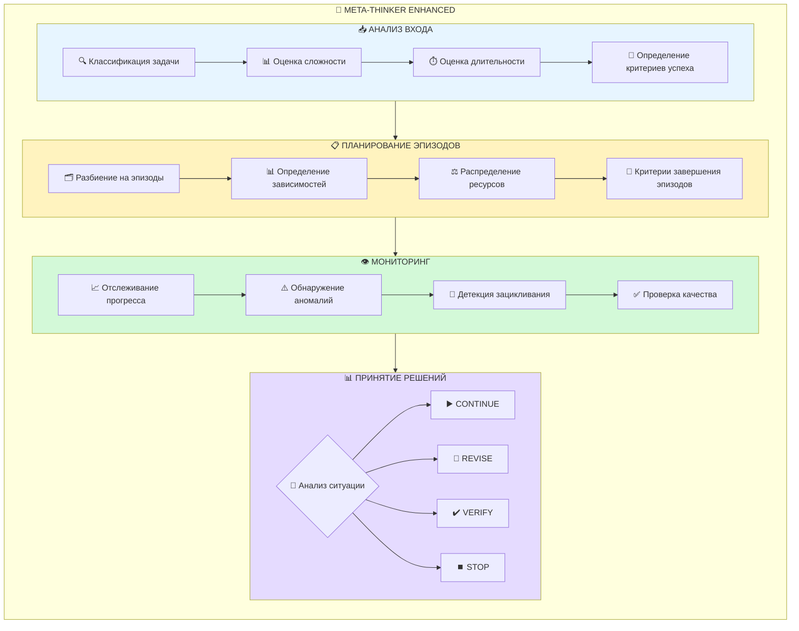
```mermaid
flowchart TB
    subgraph mte["🧠 META-THINKER ENHANCED"]
        direction TB
        
        subgraph input_analysis["📥 АНАЛИЗ ВХОДА"]
            IA1["🔍 Классификация задачи"]
            IA2["📊 Оценка сложности"]
            IA3["⏱️ Оценка длительности"]
            IA4["🎯 Определение критериев успеха"]
            
            IA1 --> IA2 --> IA3 --> IA4
        end
        
        subgraph episode_planning["📋 ПЛАНИРОВАНИЕ ЭПИЗОДОВ"]
            EP1["🗂️ Разбиение на эпизоды"]
            EP2["📊 Определение зависимостей"]
            EP3["⚖️ Распределение ресурсов"]
            EP4["🎯 Критерии завершения эпизодов"]
            
            EP1 --> EP2 --> EP3 --> EP4
        end
        
        subgraph monitoring["👁️ МОНИТОРИНГ"]
            M1["📈 Отслеживание прогресса"]
            M2["⚠️ Обнаружение аномалий"]
            M3["🔄 Детекция зацикливания"]
            M4["✅ Проверка качества"]
            
            M1 --> M2
            M2 --> M3
            M3 --> M4
        end
        
        subgraph decisions["📊 ПРИНЯТИЕ РЕШЕНИЙ"]
            D1{"🤔 Анализ ситуации"}
            D2["▶️ CONTINUE"]
            D3["🔄 REVISE"]
            D4["✔️ VERIFY"]
            D5["⏹️ STOP"]
            
            D1 --> D2
            D1 --> D3
            D1 --> D4
            D1 --> D5
        end
        
        input_analysis --> episode_planning
        episode_planning --> monitoring
        monitoring --> decisions
    end
    
    style input_analysis fill:#e7f5ff
    style episode_planning fill:#fff3bf
    style monitoring fill:#d3f9d8
    style decisions fill:#e5dbff
```

#### 🚨 Расширенная система сигналов

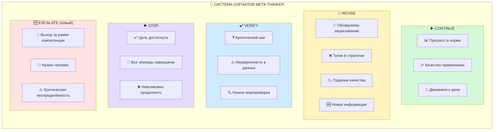
```mermaid
flowchart TB
    subgraph signals["🚨 СИСТЕМА СИГНАЛОВ META-THINKER"]
        direction TB
        
        subgraph continue_sig["▶️ CONTINUE"]
            CS1["📊 Прогресс в норме"]
            CS2["✅ Качество приемлемое"]
            CS3["🎯 Движемся к цели"]
        end
        
        subgraph revise_sig["🔄 REVISE"]
            RS1["🔁 Обнаружено зацикливание"]
            RS2["❌ Тупик в стратегии"]
            RS3["📉 Падение качества"]
            RS4["🆕 Новая информация"]
        end
        
        subgraph verify_sig["✔️ VERIFY"]
            VS1["❓ Критический шаг"]
            VS2["⚠️ Неуверенность в данных"]
            VS3["🔍 Нужна перепроверка"]
        end
        
        subgraph stop_sig["⏹️ STOP"]
            SS1["✅ Цель достигнута"]
            SS2["🏁 Все эпизоды завершены"]
            SS3["❌ Невозможно продолжить"]
        end
        
        subgraph escalate_sig["🆘 ESCALATE (новый)"]
            ES1["🤷 Выход за рамки компетенции"]
            ES2["👤 Нужен человек"]
            ES3["⚠️ Критическая неопределённость"]
        end
    end
    
    style continue_sig fill:#d3f9d8
    style revise_sig fill:#fff3bf
    style verify_sig fill:#d0ebff
    style stop_sig fill:#e5dbff
    style escalate_sig fill:#ffe3e3
```

#### 📊 Метрики мониторинга

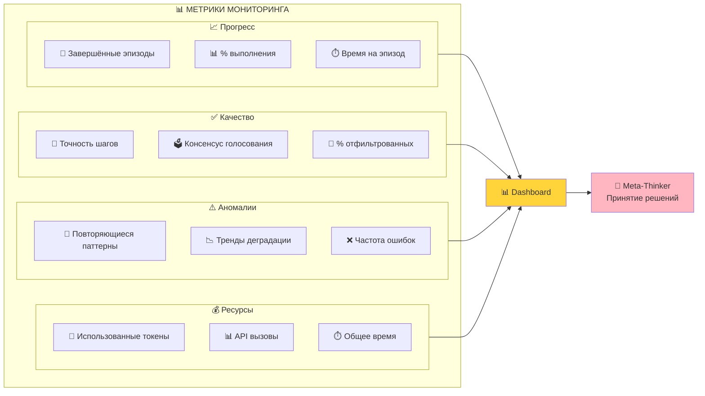
```mermaid
flowchart LR
    subgraph metrics["📊 МЕТРИКИ МОНИТОРИНГА"]
        direction TB
        
        subgraph progress["📈 Прогресс"]
            PR1["🔢 Завершённые эпизоды"]
            PR2["📊 % выполнения"]
            PR3["⏱️ Время на эпизод"]
        end
        
        subgraph quality["✅ Качество"]
            Q1["🎯 Точность шагов"]
            Q2["🗳️ Консенсус голосования"]
            Q3["🚩 % отфильтрованных"]
        end
        
        subgraph anomalies["⚠️ Аномалии"]
            A1["🔄 Повторяющиеся паттерны"]
            A2["📉 Тренды деградации"]
            A3["❌ Частота ошибок"]
        end
        
        subgraph resources["💰 Ресурсы"]
            R1["🔢 Использованные токены"]
            R2["📊 API вызовы"]
            R3["⏱️ Общее время"]
        end
    end
    
    progress --> DASHBOARD["📊 Dashboard"]
    quality --> DASHBOARD
    anomalies --> DASHBOARD
    resources --> DASHBOARD
    
    DASHBOARD --> DECISION["🧠 Meta-Thinker<br/>Принятие решений"]
    
    style DASHBOARD fill:#ffd43b
    style DECISION fill:#FFB6C1
```

---

### 📋 Context Manager Bridge

> **Роль:** "Мост" между стратегическим уровнем COMPASS и исполнительным уровнем MAKER

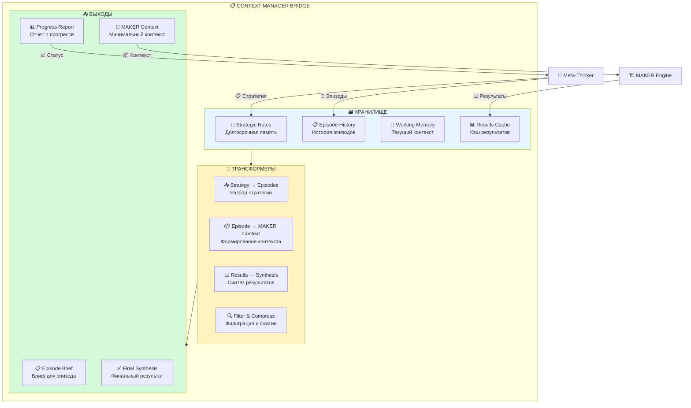
```mermaid
flowchart TB
    subgraph cmb["📋 CONTEXT MANAGER BRIDGE"]
        direction TB
        
        subgraph storage["🗃️ ХРАНИЛИЩЕ"]
            ST1["📜 Strategic Notes<br/>Долгосрочная память"]
            ST2["📋 Episode History<br/>История эпизодов"]
            ST3["🔧 Working Memory<br/>Текущий контекст"]
            ST4["📊 Results Cache<br/>Кэш результатов"]
        end
        
        subgraph transformers["🔄 ТРАНСФОРМЕРЫ"]
            T1["📥 Strategy → Episodes<br/>Разбор стратегии"]
            T2["📦 Episode → MAKER Context<br/>Формирование контекста"]
            T3["📊 Results → Synthesis<br/>Синтез результатов"]
            T4["🔍 Filter & Compress<br/>Фильтрация и сжатие"]
        end
        
        subgraph outputs["📤 ВЫХОДЫ"]
            O1["📋 Episode Brief<br/>Бриф для эпизода"]
            O2["🔧 MAKER Context<br/>Минимальный контекст"]
            O3["📊 Progress Report<br/>Отчёт о прогрессе"]
            O4["✅ Final Synthesis<br/>Финальный результат"]
        end
        
        storage --> transformers --> outputs
    end
    
    MT["🧠 Meta-Thinker"] -->|"📋 Стратегия"| ST1
    MT -->|"📝 Эпизоды"| ST2
    
    O2 -->|"📦 Контекст"| MAKER["🏗️ MAKER Engine"]
    MAKER -->|"📊 Результаты"| ST4
    
    O3 -->|"📈 Статус"| MT
    
    style storage fill:#e7f5ff
    style transformers fill:#fff3bf
    style outputs fill:#d3f9d8
```

#### 📦 Структура контекста для MAKER

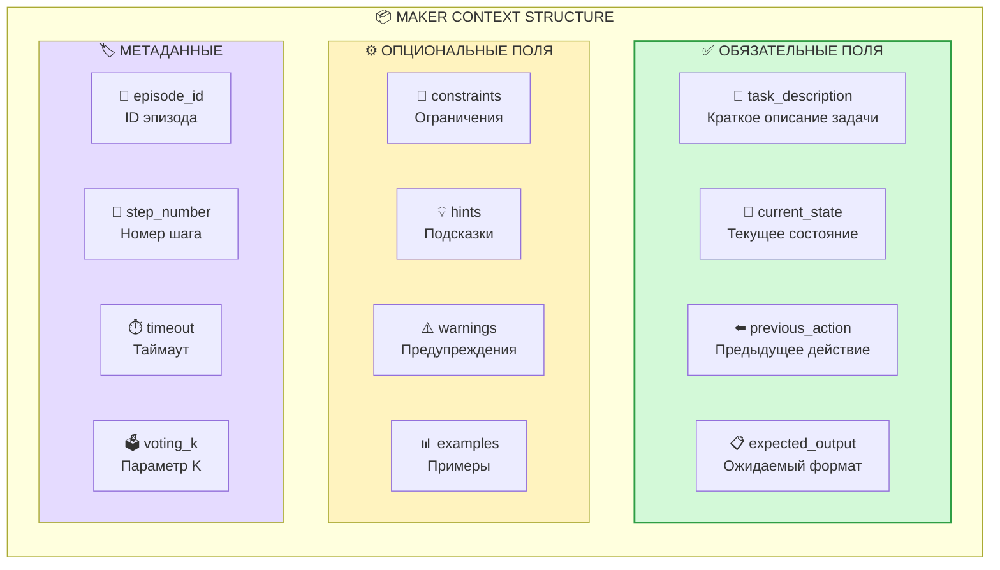
```mermaid
flowchart TB
    subgraph maker_context["📦 MAKER CONTEXT STRUCTURE"]
        direction TB
        
        subgraph required["✅ ОБЯЗАТЕЛЬНЫЕ ПОЛЯ"]
            R1["🎯 task_description<br/>Краткое описание задачи"]
            R2["📍 current_state<br/>Текущее состояние"]
            R3["⬅️ previous_action<br/>Предыдущее действие"]
            R4["📋 expected_output<br/>Ожидаемый формат"]
        end
        
        subgraph optional["⚙️ ОПЦИОНАЛЬНЫЕ ПОЛЯ"]
            O1["📏 constraints<br/>Ограничения"]
            O2["💡 hints<br/>Подсказки"]
            O3["⚠️ warnings<br/>Предупреждения"]
            O4["📊 examples<br/>Примеры"]
        end
        
        subgraph metadata["🏷️ МЕТАДАННЫЕ"]
            M1["🔢 episode_id<br/>ID эпизода"]
            M2["🔢 step_number<br/>Номер шага"]
            M3["⏱️ timeout<br/>Таймаут"]
            M4["🗳️ voting_k<br/>Параметр K"]
        end
    end
    
    style required fill:#d3f9d8,stroke:#2f9e44,stroke-width:2px
    style optional fill:#fff3bf
    style metadata fill:#e5dbff
```

#### 🔧 Пример контекста

```
┌─────────────────────────────────────────────────────────────────┐
│ 📦 MAKER CONTEXT                                                │
├─────────────────────────────────────────────────────────────────┤
│                                                                 │
│ 🎯 TASK: Проверить валидность email адреса                     │
│                                                                 │
│ 📍 STATE:                                                       │
│    input: "user@example.com"                                    │
│    step: "validation"                                           │
│                                                                 │
│ ⬅️ PREVIOUS: null (первый шаг)                                 │
│                                                                 │
│ 📋 EXPECTED OUTPUT:                                             │
│    format: { "valid": boolean, "reason": string }               │
│                                                                 │
│ 📏 CONSTRAINTS:                                                 │
│    - Использовать RFC 5322 стандарт                             │
│    - Ответ < 100 токенов                                        │
│                                                                 │
│ 🏷️ METADATA:                                                    │
│    episode_id: "ep_001"                                         │
│    step_number: 1                                               │
│    voting_k: 2                                                  │
│                                                                 │
└─────────────────────────────────────────────────────────────────┘
```

---

### 🏗️ MAKER Execution Engine

> **Роль:** Надёжное выполнение задач с гарантией точности через голосование и фильтрацию

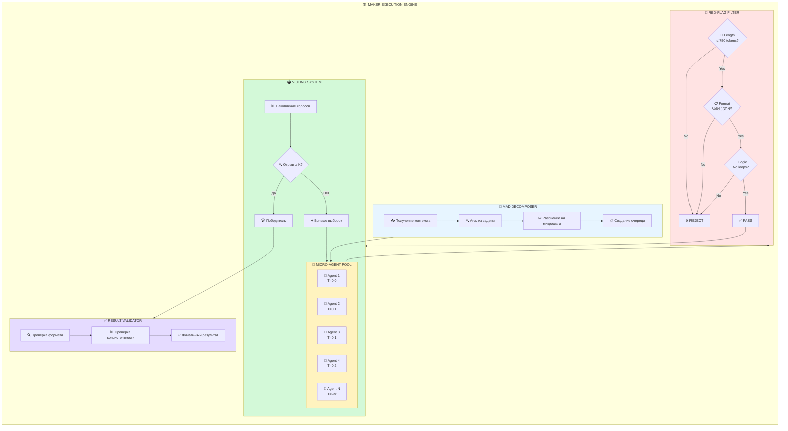
```mermaid
flowchart TB
    subgraph mee["🏗️ MAKER EXECUTION ENGINE"]
        direction TB
        
        subgraph decomposer["🔨 MAD DECOMPOSER"]
            D1["📥 Получение контекста"]
            D2["🔍 Анализ задачи"]
            D3["✂️ Разбиение на микрошаги"]
            D4["📋 Создание очереди"]
            
            D1 --> D2 --> D3 --> D4
        end
        
        subgraph agent_pool["🤖 MICRO-AGENT POOL"]
            AP1["🤖 Agent 1<br/>T=0.0"]
            AP2["🤖 Agent 2<br/>T=0.1"]
            AP3["🤖 Agent 3<br/>T=0.1"]
            AP4["🤖 Agent 4<br/>T=0.2"]
            AP5["🤖 Agent N<br/>T=var"]
        end
        
        subgraph red_flag["🚩 RED-FLAG FILTER"]
            RF1{"📏 Length<br/>≤ 750 tokens?"}
            RF2{"📋 Format<br/>Valid JSON?"}
            RF3{"🔄 Logic<br/>No loops?"}
            RF4["✅ PASS"]
            RF5["❌ REJECT"]
            
            RF1 -->|"Yes"| RF2
            RF1 -->|"No"| RF5
            RF2 -->|"Yes"| RF3
            RF2 -->|"No"| RF5
            RF3 -->|"Yes"| RF4
            RF3 -->|"No"| RF5
        end
        
        subgraph voting["🗳️ VOTING SYSTEM"]
            V1["📊 Накопление голосов"]
            V2{"🔍 Отрыв ≥ K?"}
            V3["🏆 Победитель"]
            V4["➕ Больше выборок"]
            
            V1 --> V2
            V2 -->|"Да"| V3
            V2 -->|"Нет"| V4
            V4 --> agent_pool
        end
        
        subgraph validator["✅ RESULT VALIDATOR"]
            VL1["🔍 Проверка формата"]
            VL2["📊 Проверка консистентности"]
            VL3["✅ Финальный результат"]
            
            VL1 --> VL2 --> VL3
        end
        
        decomposer --> agent_pool
        agent_pool --> red_flag
        RF4 --> voting
        V3 --> validator
    end
    
    style decomposer fill:#e7f5ff
    style agent_pool fill:#fff3bf
    style red_flag fill:#ffe3e3
    style voting fill:#d3f9d8
    style validator fill:#e5dbff
```

#### 🗳️ Детали системы голосования

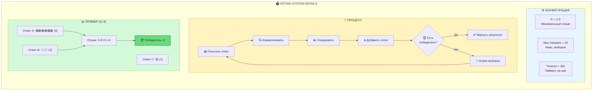
```mermaid
flowchart TB
    subgraph voting_detail["🗳️ VOTING SYSTEM DETAILS"]
        direction TB
        
        subgraph config["⚙️ КОНФИГУРАЦИЯ"]
            C1["K = 2-5<br/>Минимальный отрыв"]
            C2["Max Samples = 20<br/>Макс. выборок"]
            C3["Timeout = 30s<br/>Таймаут на шаг"]
        end
        
        subgraph process["🔄 ПРОЦЕСС"]
            P1["📥 Получить ответ"]
            P2["🔍 Нормализовать"]
            P3["📊 Хэшировать"]
            P4["➕ Добавить голос"]
            P5{"🏆 Есть<br/>победитель?"}
            P6["✅ Вернуть результат"]
            P7["🔄 Новая выборка"]
            
            P1 --> P2 --> P3 --> P4 --> P5
            P5 -->|"Да"| P6
            P5 -->|"Нет"| P7 --> P1
        end
        
        subgraph example["📊 ПРИМЕР (K=3)"]
            E1["Ответ A: 🟢🟢🟢🟢🟢🟢 (6)"]
            E2["Ответ B: 🔴🔴🔴 (3)"]
            E3["Ответ C: 🟡 (1)"]
            E4["Отрыв: 6-3=3 ≥ K"]
            E5["🏆 Победитель: A"]
            
            E1 --> E4
            E2 --> E4
            E4 --> E5
        end
    end
    
    style config fill:#e7f5ff
    style process fill:#fff3bf
    style example fill:#d3f9d8
    style E5 fill:#69db7c,stroke:#2f9e44,stroke-width:2px
```

#### 🚩 Критерии Red-Flagging

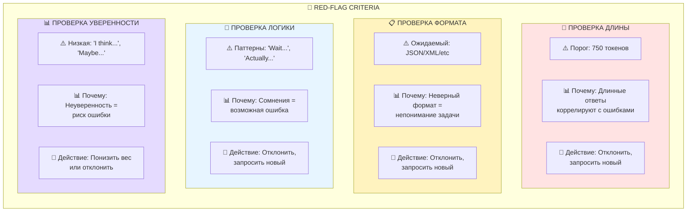
```mermaid
flowchart TB
    subgraph red_flags["🚩 RED-FLAG CRITERIA"]
        direction TB
        
        subgraph length_check["📏 ПРОВЕРКА ДЛИНЫ"]
            L1["⚠️ Порог: 750 токенов"]
            L2["📊 Почему: Длинные ответы<br/>коррелируют с ошибками"]
            L3["🎯 Действие: Отклонить,<br/>запросить новый"]
        end
        
        subgraph format_check["📋 ПРОВЕРКА ФОРМАТА"]
            F1["⚠️ Ожидаемый: JSON/XML/etc"]
            F2["📊 Почему: Неверный формат =<br/>непонимание задачи"]
            F3["🎯 Действие: Отклонить,<br/>запросить новый"]
        end
        
        subgraph logic_check["🔄 ПРОВЕРКА ЛОГИКИ"]
            LO1["⚠️ Паттерны: 'Wait...', 'Actually...'"]
            LO2["📊 Почему: Сомнения =<br/>возможная ошибка"]
            LO3["🎯 Действие: Отклонить,<br/>запросить новый"]
        end
        
        subgraph confidence_check["📊 ПРОВЕРКА УВЕРЕННОСТИ"]
            CO1["⚠️ Низкая: 'I think...', 'Maybe...'"]
            CO2["📊 Почему: Неуверенность =<br/>риск ошибки"]
            CO3["🎯 Действие: Понизить вес<br/>или отклонить"]
        end
    end
    
    style length_check fill:#ffe3e3
    style format_check fill:#fff3bf
    style logic_check fill:#e7f5ff
    style confidence_check fill:#e5dbff
```

---

## 🔄 Потоки данных и взаимодействия

### 📊 Полная диаграмма потоков

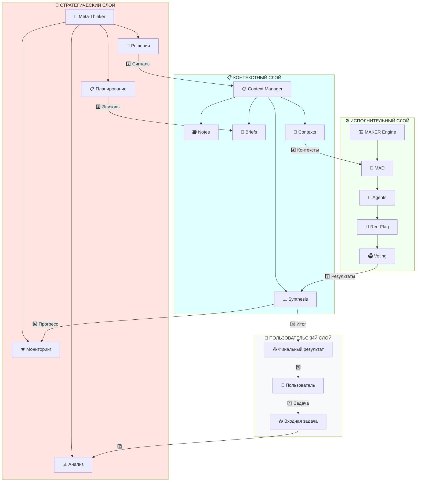
```mermaid
flowchart TB
    subgraph user_layer["👤 ПОЛЬЗОВАТЕЛЬСКИЙ СЛОЙ"]
        USER["👤 Пользователь"]
        INPUT["📥 Входная задача"]
        OUTPUT["📤 Финальный результат"]
    end
    
    subgraph strategic_layer["🎯 СТРАТЕГИЧЕСКИЙ СЛОЙ"]
        MT["🧠 Meta-Thinker"]
        
        MT_ANALYZE["📊 Анализ"]
        MT_PLAN["📋 Планирование"]
        MT_MONITOR["👁️ Мониторинг"]
        MT_DECIDE["🤔 Решения"]
        
        MT --> MT_ANALYZE
        MT --> MT_PLAN
        MT --> MT_MONITOR
        MT --> MT_DECIDE
    end
    
    subgraph context_layer["📋 КОНТЕКСТНЫЙ СЛОЙ"]
        CM["📋 Context Manager"]
        
        CM_NOTES["🗃️ Notes"]
        CM_BRIEFS["📝 Briefs"]
        CM_CONTEXTS["🔧 Contexts"]
        CM_SYNTH["📊 Synthesis"]
        
        CM --> CM_NOTES
        CM --> CM_BRIEFS
        CM --> CM_CONTEXTS
        CM --> CM_SYNTH
    end
    
    subgraph execution_layer["⚙️ ИСПОЛНИТЕЛЬНЫЙ СЛОЙ"]
        MAKER["🏗️ MAKER Engine"]
        
        MAD["🔨 MAD"]
        AGENTS["🤖 Agents"]
        RF["🚩 Red-Flag"]
        VOTE["🗳️ Voting"]
        
        MAKER --> MAD
        MAD --> AGENTS
        AGENTS --> RF
        RF --> VOTE
    end
    
    %% Потоки данных
    USER -->|"1️⃣ Задача"| INPUT
    INPUT -->|"2️⃣"| MT_ANALYZE
    MT_PLAN -->|"3️⃣ Эпизоды"| CM_BRIEFS
    CM_CONTEXTS -->|"4️⃣ Контексты"| MAD
    VOTE -->|"5️⃣ Результаты"| CM_SYNTH
    CM_SYNTH -->|"6️⃣ Прогресс"| MT_MONITOR
    MT_DECIDE -->|"7️⃣ Сигналы"| CM
    CM_SYNTH -->|"8️⃣ Итог"| OUTPUT
    OUTPUT -->|"9️⃣"| USER
    
    style user_layer fill:#f8f9fa
    style strategic_layer fill:#FFE4E1
    style context_layer fill:#E0FFFF
    style execution_layer fill:#F0FFF0
```

### 🔄 Жизненный цикл задачи


```mermaid
stateDiagram-v2
    [*] --> Инициализация: 📥 Новая задача
    
    state Инициализация {
        [*] --> Анализ
        Анализ --> Классификация
        Классификация --> Оценка_сложности
        Оценка_сложности --> [*]
    }
    
    Инициализация --> Планирование: 🧠 Meta-Thinker
    
    state Планирование {
        [*] --> Определение_эпизодов
        Определение_эпизодов --> Распределение_ресурсов
        Распределение_ресурсов --> Установка_критериев
        Установка_критериев --> [*]
    }
    
    Планирование --> Выполнение: 📋 План готов
    
    state Выполнение {
        [*] --> Формирование_контекста
        Формирование_контекста --> MAD_декомпозиция
        MAD_декомпозиция --> Микрошаги
        
        state Микрошаги {
            [*] --> Агенты
            Агенты --> Red_Flag
            Red_Flag --> Голосование
            Голосование --> [*]
        }
        
        Микрошаги --> Синтез_эпизода
        Синтез_эпизода --> [*]
    }
    
    Выполнение --> Оценка: 👁️ Мониторинг
    
    state Оценка {
        [*] --> Анализ_прогресса
        Анализ_прогресса --> Проверка_качества
        Проверка_качества --> Решение
        
        state Решение {
            CONTINUE
            REVISE
            VERIFY
            STOP
        }
        
        Решение --> [*]
    }
    
    Оценка --> Выполнение: 🔄 CONTINUE / REVISE
    Оценка --> Верификация: ✔️ VERIFY
    Оценка --> Завершение: ⏹️ STOP
    
    state Верификация {
        [*] --> Дополнительное_голосование
        Дополнительное_голосование --> Проверка_консистентности
        Проверка_консистентности --> [*]
    }
    
    Верификация --> Выполнение: 🔄 Продолжить
    Верификация --> Завершение: ✅ Подтверждено
    
    state Завершение {
        [*] --> Синтез_результатов
        Синтез_результатов --> Формирование_ответа
        Формирование_ответа --> [*]
    }
    
    Завершение --> [*]: ✅ Финальный результат
```

---

## 🎭 Режимы работы

### 📊 Адаптивный выбор режима

```mermaid
flowchart TB
    subgraph input["📥 ВХОДНАЯ ЗАДАЧА"]
        TASK["🎯 Задача"]
    end
    
    subgraph analysis["🔍 АНАЛИЗ ЗАДАЧИ"]
        A1{"📏 Сложность?"}
        A2{"🔢 Количество шагов?"}
        A3{"📊 Структурированность?"}
        A4{"⚠️ Критичность?"}
    end
    
    subgraph modes["🎭 РЕЖИМЫ РАБОТЫ"]
        M1["🚀 LITE MODE<br/>Только COMPASS"]
        M2["⚡ STANDARD MODE<br/>COMPASS + частичный MAKER"]
        M3["🛡️ FULL MODE<br/>Полный COMPASS-MAKER"]
        M4["🔒 PARANOID MODE<br/>Максимальная надёжность"]
    end
    
    subgraph config["⚙️ КОНФИГУРАЦИЯ"]
        C1["LITE:<br/>• K=1 (без голосования)<br/>• Без Red-Flag"]
        C2["STANDARD:<br/>• K=2<br/>• Базовый Red-Flag"]
        C3["FULL:<br/>• K=3<br/>• Полный Red-Flag"]
        C4["PARANOID:<br/>• K=5<br/>• Строгий Red-Flag<br/>• Дополнительная верификация"]
    end
    
    TASK --> A1
    A1 -->|"Низкая"| A2
    A1 -->|"Высокая"| A3
    
    A2 -->|"<50"| M1
    A2 -->|"50-500"| M2
    A2 -->|">500"| A3
    
    A3 -->|"Структурированная"| M3
    A3 -->|"Нет"| A4
    
    A4 -->|"Низкая"| M2
    A4 -->|"Высокая"| M4
    
    M1 --> C1
    M2 --> C2
    M3 --> C3
    M4 --> C4
    
    style M1 fill:#d3f9d8
    style M2 fill:#fff3bf
    style M3 fill:#d0ebff
    style M4 fill:#ffe3e3
```

### 🎛️ Параметры режимов

| Параметр | 🚀 LITE | ⚡ STANDARD | 🛡️ FULL | 🔒 PARANOID |
|----------|---------|-------------|----------|-------------|
| **Голосование K** | 1 | 2 | 3 | 5 |
| **Max выборок** | 3 | 10 | 20 | 50 |
| **Red-Flag** | ❌ | Базовый | Полный | Строгий |
| **Верификация** | ❌ | По запросу | Автоматическая | Двойная |
| **Мониторинг** | Минимальный | Стандартный | Детальный | Полный |
| **Стоимость** | 💵 | 💵💵 | 💵💵💵 | 💵💵💵💵💵 |
| **Применение** | Простые задачи | Типовые задачи | Важные задачи | Критичные системы |

---

## 🛡️ Система защиты от ошибок

### 🔒 Многоуровневая защита

```mermaid
flowchart TB
    subgraph protection["🛡️ МНОГОУРОВНЕВАЯ ЗАЩИТА"]
        direction TB
        
        subgraph l1["🔵 УРОВЕНЬ 1: Стратегический"]
            L1A["🧠 Meta-Thinker мониторинг"]
            L1B["🔄 Обнаружение тупиков"]
            L1C["📋 Адаптация стратегии"]
        end
        
        subgraph l2["🟢 УРОВЕНЬ 2: Контекстный"]
            L2A["📋 Context Manager"]
            L2B["🔍 Фильтрация информации"]
            L2C["📦 Оптимальные контексты"]
        end
        
        subgraph l3["🟡 УРОВЕНЬ 3: Выполнение"]
            L3A["🔨 MAD изоляция"]
            L3B["🤖 Независимые агенты"]
            L3C["📊 Минимальный контекст"]
        end
        
        subgraph l4["🟠 УРОВЕНЬ 4: Фильтрация"]
            L4A["🚩 Red-Flagging"]
            L4B["📏 Проверка длины"]
            L4C["📋 Проверка формата"]
            L4D["🔄 Проверка логики"]
        end
        
        subgraph l5["🔴 УРОВЕНЬ 5: Консенсус"]
            L5A["🗳️ Голосование"]
            L5B["📊 First-to-ahead-by-K"]
            L5C["🏆 Статистическая надёжность"]
        end
        
        subgraph l6["⚫ УРОВЕНЬ 6: Верификация"]
            L6A["✅ Проверка результата"]
            L6B["📊 Консистентность"]
            L6C["🔍 Финальная валидация"]
        end
        
        l1 --> l2 --> l3 --> l4 --> l5 --> l6
    end
    
    INPUT["📥 Задача"] --> l1
    l6 --> OUTPUT["✅ Надёжный результат"]
    
    style l1 fill:#d0ebff
    style l2 fill:#d3f9d8
    style l3 fill:#fff3bf
    style l4 fill:#ffd8a8
    style l5 fill:#ffc9c9
    style l6 fill:#e5dbff
    style OUTPUT fill:#69db7c,stroke:#2f9e44,stroke-width:3px
```

### 🔄 Декорреляция ошибок

```mermaid
flowchart TB
    subgraph problem["❌ ПРОБЛЕМА: Коррелированные ошибки"]
        direction LR
        CP1["🤖 Агент 1: ❌ Ошибка A"]
        CP2["🤖 Агент 2: ❌ Ошибка A"]
        CP3["🤖 Агент 3: ❌ Ошибка A"]
        CRESULT["📊 Голосование бесполезно!<br/>Все ошиблись одинаково"]
        
        CP1 --> CRESULT
        CP2 --> CRESULT
        CP3 --> CRESULT
    end
    
    subgraph solution["✅ РЕШЕНИЕ: Декорреляция"]
        direction TB
        
        subgraph methods["🔧 МЕТОДЫ"]
            M1["🌡️ Разные температуры<br/>T=0, T=0.1, T=0.2"]
            M2["🚩 Red-Flagging<br/>Отсев аномальных паттернов"]
            M3["📝 Независимые промпты<br/>Небольшие вариации"]
            M4["🔀 Разный порядок<br/>Перемешивание примеров"]
        end
        
        subgraph result["📊 РЕЗУЛЬТАТ"]
            R1["🤖 Агент 1: ✅ Ответ A"]
            R2["🤖 Агент 2: ❌ Ответ B"]
            R3["🤖 Агент 3: ✅ Ответ A"]
            SRESULT["🏆 Голосование работает!<br/>A побеждает 2:1"]
        end
        
        methods --> result
    end
    
    problem -.->|"Решается через"| solution
    
    style problem fill:#ffe3e3
    style solution fill:#d3f9d8
    style CRESULT fill:#ff6b6b
    style SRESULT fill:#69db7c,stroke:#2f9e44,stroke-width:2px
```

### 🚨 Обработка критических ситуаций

```mermaid
flowchart TB
    subgraph situations["🚨 КРИТИЧЕСКИЕ СИТУАЦИИ"]
        direction TB
        
        subgraph s1["⏱️ ТАЙМАУТ"]
            T1["Шаг не завершается"]
            T1A["→ Увеличить K"]
            T1B["→ Упростить задачу"]
            T1C["→ ESCALATE"]
        end
        
        subgraph s2["🔄 БЕСКОНЕЧНЫЙ ЦИКЛ"]
            C1["Голосование не сходится"]
            C2A["→ Проверить задачу"]
            C2B["→ Изменить промпт"]
            C2C["→ ESCALATE"]
        end
        
        subgraph s3["📉 ДЕГРАДАЦИЯ КАЧЕСТВА"]
            D1["Много Red-Flags подряд"]
            D3A["→ Пересмотреть стратегию"]
            D3B["→ Упростить декомпозицию"]
            D3C["→ REVISE"]
        end
        
        subgraph s4["💥 КРИТИЧЕСКАЯ ОШИБКА"]
            E1["Невалидный результат"]
            E4A["→ Откатиться"]
            E4B["→ Альтернативный путь"]
            E4C["→ ESCALATE"]
        end
    end
    
    T1 --> T1A & T1B & T1C
    C1 --> C2A & C2B & C2C
    D1 --> D3A & D3B & D3C
    E1 --> E4A & E4B & E4C
    
    style s1 fill:#fff3bf
    style s2 fill:#ffd8a8
    style s3 fill:#ffc9c9
    style s4 fill:#ff6b6b
```

---

## 📈 Сценарии использования

### 🎯 Сценарий 1: Анализ большого датасета

```mermaid
sequenceDiagram
    autonumber
    participant U as 👤 User
    participant MT as 🧠 Meta-Thinker
    participant CM as 📋 Context Manager
    participant ME as 🏗️ MAKER Engine
    
    U->>MT: "Проанализируй 100,000 отзывов<br/>и найди паттерны"
    
    Note over MT: 🎯 Стратегический анализ
    MT->>MT: Тип: Массовая обработка
    MT->>MT: Эпизоды: Сэмплинг → Категоризация → Анализ
    
    MT->>CM: 📋 План из 3 эпизодов
    
    rect rgb(230, 245, 255)
        Note over CM,ME: 📊 Эпизод 1: Сэмплинг (1000 отзывов)
        CM->>ME: Контекст: "Классифицируй отзыв"
        
        loop 1000 отзывов параллельно
            ME->>ME: [🤖×3] → 🗳️ K=2 → 🚩 → ✅
        end
        
        ME->>CM: 📊 1000 классификаций
    end
    
    CM->>MT: 📈 Эпизод 1 завершён
    MT->>MT: ▶️ CONTINUE
    
    rect rgb(255, 243, 191)
        Note over CM,ME: 📊 Эпизод 2: Полная категоризация
        CM->>ME: Контекст + паттерны из Эп.1
        
        loop 100,000 отзывов
            ME->>ME: [🤖×3] → 🗳️ K=2 → 🚩 → ✅
        end
        
        ME->>CM: 📊 100,000 категорий
    end
    
    CM->>MT: 📈 Эпизод 2 завершён
    MT->>MT: ▶️ CONTINUE
    
    rect rgb(211, 249, 216)
        Note over CM,ME: 📊 Эпизод 3: Синтез паттернов
        CM->>ME: Агрегированные данные
        ME->>ME: Анализ трендов
        ME->>CM: 📊 Найденные паттерны
    end
    
    CM->>MT: 📈 Все эпизоды завершены
    MT->>MT: ⏹️ STOP
    
    CM->>U: ✅ Отчёт: 5 основных паттернов,<br/>распределение по категориям,<br/>рекомендации
```

### 🎯 Сценарий 2: Сложный рефакторинг кода

```mermaid
sequenceDiagram
    autonumber
    participant U as 👤 User
    participant MT as 🧠 Meta-Thinker
    participant CM as 📋 Context Manager
    participant ME as 🏗️ MAKER Engine
    
    U->>MT: "Отрефактори монолит в микросервисы"
    
    Note over MT: 🎯 Стратегический анализ
    MT->>MT: Тип: Сложная трансформация
    MT->>MT: Режим: FULL (K=3)
    
    MT->>CM: 📋 Фазы: Анализ → Планирование → Миграция → Тесты
    
    rect rgb(230, 245, 255)
        Note over CM,ME: 🔍 Фаза 1: Анализ зависимостей
        CM->>ME: Контекст: Модуль X
        ME->>ME: Извлечение зависимостей
        ME->>CM: Граф зависимостей
    end
    
    CM->>MT: Обнаружена циклическая зависимость!
    MT->>MT: 🔄 REVISE - изменить стратегию
    MT->>CM: Новый план: сначала убрать цикл
    
    rect rgb(255, 227, 227)
        Note over CM,ME: 🔧 Фаза 1.5: Устранение цикла
        CM->>ME: Контекст: Рефакторинг цикла
        ME->>ME: [🤖×5] → 🗳️ K=3 → 🚩
        ME->>CM: Исправленный код
    end
    
    CM->>MT: Цикл устранён ✅
    MT->>MT: ▶️ CONTINUE
    
    rect rgb(211, 249, 216)
        Note over CM,ME: ✂️ Фаза 2: Выделение сервисов
        loop Для каждого сервиса
            CM->>ME: Контекст: Сервис Y
            ME->>ME: [🤖×3] → 🗳️ K=3 → ✅
            ME->>CM: Код сервиса
        end
    end
    
    MT->>MT: ✔️ VERIFY - критический этап
    ME->>ME: Дополнительное голосование K=5
    
    CM->>U: ✅ 8 микросервисов,<br/>Docker конфиги,<br/>документация API
```

### 🎯 Сценарий 3: Обнаружение и адаптация к ошибке

```mermaid
sequenceDiagram
    autonumber
    participant MT as 🧠 Meta-Thinker
    participant CM as 📋 Context Manager
    participant ME as 🏗️ MAKER Engine
    
    Note over MT,ME: 📊 Нормальное выполнение
    
    loop Шаги 1-50
        ME->>ME: [🤖×3] → 🗳️ K=2 → ✅
        ME->>CM: Результат
    end
    
    Note over ME: ⚠️ Шаг 51: Проблема!
    ME->>ME: [🤖×3] → Нет консенсуса после 10 выборок
    
    ME->>CM: 🚨 Голосование не сходится
    CM->>MT: 📊 Аномалия на шаге 51
    
    MT->>MT: Анализ ситуации...
    MT->>MT: Обнаружено: неоднозначная задача
    
    MT->>CM: 🔄 REVISE: Уточнить задачу
    
    CM->>CM: Добавить контекст и примеры
    CM->>ME: 📦 Обновлённый контекст
    
    ME->>ME: [🤖×3] → 🗳️ K=2 → ✅
    
    Note over MT,ME: ✅ Продолжение с шага 51
    
    loop Шаги 52-100
        ME->>ME: [🤖×3] → 🗳️ K=2 → ✅
    end
    
    CM->>MT: 📊 Эпизод завершён
    MT->>MT: ⏹️ STOP
```

---

## ⚙️ Технические детали реализации

### 🏗️ Архитектура компонентов

```mermaid
classDiagram
    class CompassMaker {
        -MetaThinker meta_thinker
        -ContextManager context_manager
        -MakerEngine maker_engine
        -Config config
        +run(task: Task) Result
        +set_mode(mode: Mode)
    }
    
    class MetaThinker {
        -TaskAnalyzer analyzer
        -EpisodePlanner planner
        -ProgressMonitor monitor
        -DecisionMaker decider
        +analyze(task: Task) Analysis
        +plan(analysis: Analysis) List~Episode~
        +monitor(progress: Progress) Signal
        +decide(metrics: Metrics) Decision
    }
    
    class ContextManager {
        -NotesStorage notes
        -BriefGenerator brief_gen
        -ContextBuilder ctx_builder
        -ResultSynthesizer synthesizer
        +store_note(note: Note)
        +create_brief(episode: Episode) Brief
        +build_context(step: Step) MakerContext
        +synthesize(results: List~Result~) FinalResult
    }
    
    class MakerEngine {
        -MADDecomposer decomposer
        -AgentPool agents
        -RedFlagFilter filter
        -VotingSystem voting
        -ResultValidator validator
        +execute(context: MakerContext) Result
        +decompose(context: MakerContext) List~MicroTask~
        +run_with_voting(task: MicroTask) VotedResult
    }
    
    class MADDecomposer {
        +decompose(context: MakerContext) List~MicroTask~
        +estimate_steps(context: MakerContext) int
    }
    
    class AgentPool {
        -List~MicroAgent~ agents
        -int pool_size
        +sample(task: MicroTask, n: int) List~Response~
        +get_agent(temperature: float) MicroAgent
    }
    
    class RedFlagFilter {
        -int max_length
        -List~Pattern~ bad_patterns
        +filter(response: Response) FilterResult
        +check_length(response: Response) bool
        +check_format(response: Response) bool
        +check_logic(response: Response) bool
    }
    
    class VotingSystem {
        -int k_threshold
        -int max_samples
        +vote(responses: List~Response~) VotedResult
        +has_winner(votes: Dict) bool
        +get_winner(votes: Dict) Response
    }
    
    CompassMaker --> MetaThinker
    CompassMaker --> ContextManager
    CompassMaker --> MakerEngine
    
    MakerEngine --> MADDecomposer
    MakerEngine --> AgentPool
    MakerEngine --> RedFlagFilter
    MakerEngine --> VotingSystem
```

### 📊 Конфигурация системы

```mermaid
flowchart TB
    subgraph config["⚙️ КОНФИГУРАЦИЯ COMPASS-MAKER"]
        direction TB
        
        subgraph global_config["🌐 ГЛОБАЛЬНЫЕ"]
            GC1["mode: 'FULL'"]
            GC2["llm_model: 'gpt-4.1-mini'"]
            GC3["max_total_tokens: 1_000_000"]
            GC4["timeout_seconds: 3600"]
        end
        
        subgraph mt_config["🧠 META-THINKER"]
            MC1["monitor_interval: 10"]
            MC2["anomaly_threshold: 0.3"]
            MC3["max_revisions: 5"]
        end
        
        subgraph cm_config["📋 CONTEXT MANAGER"]
            CC1["max_notes: 100"]
            CC2["brief_max_tokens: 500"]
            CC3["context_max_tokens: 200"]
        end
        
        subgraph me_config["🏗️ MAKER ENGINE"]
            EC1["voting_k: 3"]
            EC2["max_samples: 20"]
            EC3["red_flag_max_length: 750"]
            EC4["temperatures: [0, 0.1, 0.1, 0.2]"]
        end
    end
    
    style global_config fill:#f8f9fa
    style mt_config fill:#FFE4E1
    style cm_config fill:#E0FFFF
    style me_config fill:#F0FFF0
```

### 🔄 Алгоритм основного цикла

```mermaid
flowchart TB
    START["🚀 START"] --> INIT["⚙️ Инициализация"]
    
    INIT --> ANALYZE["🔍 Meta-Thinker:<br/>Анализ задачи"]
    
    ANALYZE --> PLAN["📋 Meta-Thinker:<br/>Планирование эпизодов"]
    
    PLAN --> EPISODE_LOOP{"🔄 Есть ещё<br/>эпизоды?"}
    
    EPISODE_LOOP -->|"Да"| GET_EPISODE["📥 Получить<br/>следующий эпизод"]
    EPISODE_LOOP -->|"Нет"| FINAL_SYNTH["📊 Финальный синтез"]
    
    GET_EPISODE --> BUILD_CTX["📋 Context Manager:<br/>Построить контекст"]
    
    BUILD_CTX --> MAD["🔨 MAD:<br/>Декомпозиция"]
    
    MAD --> STEP_LOOP{"🔄 Есть ещё<br/>микрошаги?"}
    
    STEP_LOOP -->|"Да"| SAMPLE["🤖 Выборка от агентов"]
    STEP_LOOP -->|"Нет"| EPISODE_SYNTH["📊 Синтез эпизода"]
    
    SAMPLE --> RED_FLAG["🚩 Red-Flag фильтрация"]
    
    RED_FLAG --> VOTE["🗳️ Голосование"]
    
    VOTE --> WINNER{"🏆 Есть<br/>победитель?"}
    
    WINNER -->|"Нет, нужно больше"| SAMPLE
    WINNER -->|"Да"| VALIDATE["✅ Валидация"]
    
    VALIDATE --> STEP_LOOP
    
    EPISODE_SYNTH --> MONITOR["👁️ Meta-Thinker:<br/>Мониторинг"]
    
    MONITOR --> DECISION{"🤔 Решение?"}
    
    DECISION -->|"CONTINUE"| EPISODE_LOOP
    DECISION -->|"REVISE"| REVISE["🔄 Пересмотр стратегии"]
    DECISION -->|"VERIFY"| VERIFY["✔️ Верификация"]
    DECISION -->|"STOP"| FINAL_SYNTH
    
    REVISE --> PLAN
    VERIFY --> EXTRA_VOTE["🗳️ Доп. голосование K+2"]
    EXTRA_VOTE --> MONITOR
    
    FINAL_SYNTH --> RESULT["✅ Финальный результат"]
    
    RESULT --> END["🏁 END"]
    
    style START fill:#4dabf7
    style END fill:#69db7c
    style RESULT fill:#69db7c,stroke:#2f9e44,stroke-width:3px
```

### 📊 Метрики и логирование

```mermaid
flowchart TB
    subgraph metrics["📊 СИСТЕМА МЕТРИК"]
        direction TB
        
        subgraph performance["⚡ ПРОИЗВОДИТЕЛЬНОСТЬ"]
            P1["⏱️ Время на эпизод"]
            P2["⏱️ Время на шаг"]
            P3["🔢 Токены использовано"]
            P4["📞 API вызовы"]
        end
        
        subgraph quality["✅ КАЧЕСТВО"]
            Q1["🎯 Успешность шагов"]
            Q2["🗳️ Средний консенсус"]
            Q3["🚩 % отфильтрованных"]
            Q4["🔄 Количество повторов"]
        end
        
        subgraph strategic["🎯 СТРАТЕГИЧЕСКИЕ"]
            S1["📋 Эпизодов выполнено"]
            S2["🔄 Количество REVISE"]
            S3["✔️ Количество VERIFY"]
            S4["📈 Общий прогресс"]
        end
        
        subgraph anomalies["⚠️ АНОМАЛИИ"]
            A1["🔴 Критические ошибки"]
            A2["🟠 Предупреждения"]
            A3["🔄 Зацикливания"]
            A4["⏱️ Таймауты"]
        end
    end
    
    subgraph logging["📝 ЛОГИРОВАНИЕ"]
        L1["📜 Детальные логи"]
        L2["📊 Агрегированные метрики"]
        L3["🚨 Алерты"]
        L4["📈 Dashboard"]
    end
    
    performance --> logging
    quality --> logging
    strategic --> logging
    anomalies --> logging
    
    style performance fill:#d0ebff
    style quality fill:#d3f9d8
    style strategic fill:#fff3bf
    style anomalies fill:#ffe3e3
```

---

## 🎓 Выводы и рекомендации

### ✅ Преимущества гибридной архитектуры

```mermaid
mindmap
    root((🧭🏗️ COMPASS-MAKER<br/>Преимущества))
        🎯 Стратегическая гибкость
            Адаптация к изменениям
            Обработка неожиданностей
            Умное планирование
            Пересмотр стратегии
        🛡️ Тактическая надёжность
            Гарантия точности шагов
            Статистическая коррекция
            Изоляция ошибок
            Фильтрация аномалий
        📈 Масштабируемость
            1M+ шагов
            Параллелизация
            Логарифмический рост стоимости
            Batch API
        🔍 Прозрачность
            Каждый шаг виден
            Метрики в реальном времени
            Аудит решений
            Воспроизводимость
        💰 Эффективность
            Маленькие модели работают
            Оптимизация токенов
            Адаптивные режимы
            Кэширование контекста
```

### ⚠️ Ограничения и когда НЕ использовать

```mermaid
flowchart TB
    subgraph limitations["⚠️ ОГРАНИЧЕНИЯ"]
        direction TB
        
        subgraph not_for["❌ НЕ ПОДХОДИТ ДЛЯ"]
            N1["💬 Простые диалоги<br/>Overkill"]
            N2["🎨 Творческие задачи<br/>Голосование убивает креатив"]
            N3["⚡ Требуется мгновенный ответ<br/>Латентность"]
            N4["💵 Ограниченный бюджет<br/>Множественные вызовы"]
        end
        
        subgraph caveats["⚠️ НУЖНО УЧИТЫВАТЬ"]
            C1["📊 Сложность настройки<br/>Много параметров"]
            C2["🔧 Нужна хорошая декомпозиция<br/>Зависит от задачи"]
            C3["📋 Требуется структурированность<br/>Формализация"]
            C4["🧠 Overhead Meta-Thinker<br/>Дополнительные вызовы"]
        end
    end
    
    style not_for fill:#ffe3e3
    style caveats fill:#fff3bf
```

### 🎯 Рекомендации по применению

| Сценарий | Рекомендация | Режим |
|----------|--------------|-------|
| 📝 Простые задачи (<50 шагов) | Обычный агент | ❌ Не нужен |
| 📊 Средние задачи с неопределённостью | COMPASS | 🚀 LITE |
| 🔢 Длинные структурированные задачи | MAKER | ⚡ STANDARD |
| 🎯 Важные задачи (500+ шагов) | COMPASS-MAKER | 🛡️ FULL |
| 🏥 Критичные системы | COMPASS-MAKER | 🔒 PARANOID |
| 🎨 Творческие задачи | Обычный агент | ❌ Не нужен |

### 🚀 Дальнейшее развитие

```mermaid
flowchart LR
    subgraph current["📍 ТЕКУЩЕЕ СОСТОЯНИЕ"]
        C1["🧭🏗️ COMPASS-MAKER v1.0"]
    end
    
    subgraph future["🔮 БУДУЩЕЕ РАЗВИТИЕ"]
        direction TB
        
        F1["🤖 Мульти-модельность<br/>Разные LLM для разных задач"]
        F2["📚 Обучение на ошибках<br/>Fine-tuning на неудачах"]
        F3["🔄 Автоматическая настройка<br/>AutoML для параметров"]
        F4["🌐 Распределённое выполнение<br/>Кластеризация агентов"]
        F5["🧠 Иерархическое планирование<br/>Несколько уровней Meta-Thinker"]
    end
    
    current --> F1 & F2 & F3 & F4 & F5
    
    style current fill:#d0ebff
    style future fill:#d3f9d8
```

---

## 🔌 Интеграция с современными фреймворками

### 🎯 COMPASS-MAKER + Enhancements

Архитектура COMPASS-MAKER может быть усилена интеграцией с передовыми исследованиями 2024-2025 годов:

```mermaid
flowchart TB
    subgraph enhanced["🚀 COMPASS-MAKER ENHANCED"]
        direction TB
        
        subgraph meta["🧠 META-THINKER"]
            MT["Meta-Thinker Core"]
            
            subgraph mt_enhance["✨ Enhancements"]
                RA["🔄 ReflAct<br/>Goal-state reflection<br/>arXiv:2505.15182"]
                CM_P["♟️ CHECKMATE<br/>Classical planning<br/>arXiv:2512.11143"]
            end
            
            MT --> RA & CM_P
        end
        
        subgraph context["📋 CONTEXT MANAGER"]
            CTX["Context Manager Core"]
            
            subgraph ctx_enhance["✨ Enhancements"]
                AF["📂 AgentFold<br/>Proactive folding<br/>arXiv:2510.24699"]
                SC["🗿 Sculptor<br/>ACM tools<br/>arXiv:2508.04664"]
                CAT["🐱 CAT<br/>Context as Tool<br/>arXiv:2512.22087"]
            end
            
            CTX --> AF & SC & CAT
        end
        
        subgraph maker["🏗️ MAKER ENGINE"]
            ME["MAKER Engine Core"]
            
            subgraph me_enhance["✨ Enhancements"]
                BA["📊 Blend-ASC<br/>Optimal voting (6.8x)<br/>arXiv:2511.12309"]
                MACA["🤝 MACA<br/>Consensus via debate<br/>arXiv:2509.15172"]
                FOT["🌲 Forest-of-Thought<br/>Multiple trees<br/>arXiv:2412.09078"]
            end
            
            ME --> BA & MACA & FOT
        end
        
        meta --> context --> maker
    end
    
    style meta fill:#FFE4E1
    style context fill:#E0FFFF
    style maker fill:#F0FFF0
```

---

### 🧠 Meta-Thinker Enhancements

#### 🔄 + ReflAct (Goal-State Reflection)

| Параметр | Значение |
|----------|----------|
| **Источник** | [arXiv:2505.15182](https://arxiv.org/abs/2505.15182) |
| **Авторы** | Kim et al., EMNLP 2025 |
| **Результат** | +27.7% над ReAct, 93.3% на ALFWorld |

**Что добавляет:**
```
BEFORE: Meta-Thinker планирует следующее действие
AFTER:  Meta-Thinker РЕФЛЕКСИРУЕТ о состоянии относительно цели
```

**Интеграция:**
- Добавить `reflect_on_goal_state()` в цикл мониторинга
- Каждый сигнал (CONTINUE/REVISE/STOP) теперь grounded в текущем состоянии
- Предотвращает drift от цели на long-horizon задачах

---

#### ♟️ + CHECKMATE (Classical Planning)

| Параметр | Значение |
|----------|----------|
| **Источник** | [arXiv:2512.11143](https://arxiv.org/abs/2512.11143) |
| **Авторы** | Wang et al. |
| **Результат** | +20% над Claude Code, -50% времени и стоимости |

**Что добавляет:**
```
BEFORE: Meta-Thinker использует только LLM reasoning
AFTER:  Meta-Thinker = LLM + Classical Planner (PEP paradigm)
```

**Архитектура PEP:**
- **P**lanner — структурированный классический планировщик
- **E**xecutor — LLM-агент
- **P**erceptor — анализатор результатов

**Интеграция:**
- Planner формирует skeleton плана эпизодов
- LLM заполняет детали и адаптируется
- Perceptor обновляет план на основе результатов

---

### 📋 Context Manager Enhancements

#### 📂 + AgentFold (Proactive Folding)

| Параметр | Значение |
|----------|----------|
| **Источник** | [arXiv:2510.24699](https://arxiv.org/abs/2510.24699) |
| **Авторы** | Ye et al., Alibaba |
| **Результат** | 92% экономия токенов, 500+ шагов |

**Что добавляет:**
```
BEFORE: Context Manager накапливает историю (append-only)
AFTER:  Context Manager ПРОАКТИВНО складывает контекст
```

**Два режима складывания:**

| Режим | Когда | Пример |
|-------|-------|--------|
| 🔹 Granular Condensation | Важный шаг | "Шаг 5: Найден источник X" |
| 🔸 Deep Consolidation | Тупик/подзадача | "Шаги 6-16: Тупик, сменить стратегию" |

**Интеграция:**
- Notes теперь = Multi-Scale State Summaries
- Briefs генерируются из folded контекста
- Episode завершение триггерит Deep Consolidation

---

#### 🗿 + Sculptor (Active Context Management)

| Параметр | Значение |
|----------|----------|
| **Источник** | [arXiv:2508.04664](https://arxiv.org/abs/2508.04664) |
| **Авторы** | Li et al. |
| **Результат** | Mitigation proactive interference |

**Что добавляет:**
```
BEFORE: Context Manager фильтрует пассивно
AFTER:  Context Manager АКТИВНО скульптурирует контекст
```

**Три категории инструментов:**

| Инструмент | Функция |
|------------|---------|
| ✂️ Context Fragmentation | Разбиение на управляемые части |
| 📝 Summary/Hide/Restore | Динамическое управление видимостью |
| 🔍 Precise Search | Точный поиск в истории |

**Интеграция:**
- MAKER-контексты формируются через ACM tools
- Агент может "спрятать" нерелевантные части
- RL оптимизирует стратегию управления

---

#### 🐱 + CAT (Context as a Tool)

| Параметр | Значение |
|----------|----------|
| **Источник** | [arXiv:2512.22087](https://arxiv.org/abs/2512.22087) |
| **Авторы** | Liu et al. |
| **Результат** | 57.6% на SWE-Bench-Verified |

**Что добавляет:**
```
BEFORE: Управление контекстом — отдельный процесс
AFTER:  Управление контекстом = ВЫЗЫВАЕМЫЙ ИНСТРУМЕНТ
```

**Structured Context Workspace:**

```
┌─────────────────────────────────────────────┐
│ 🎯 Task Semantics (стабильная часть)        │
├─────────────────────────────────────────────┤
│ 🗃️ Long-Term Memory (condensed)             │
├─────────────────────────────────────────────┤
│ 📝 Short-Term Interactions (high-fidelity)  │
└─────────────────────────────────────────────┘
```

**Интеграция:**
- Context compression = explicit tool call
- Trajectory-level supervision для обучения
- Bounded context budget для масштабирования

---

### 🏗️ MAKER Engine Enhancements

#### 📊 + Blend-ASC (Optimal Voting)

| Параметр | Значение |
|----------|----------|
| **Источник** | [arXiv:2511.12309](https://arxiv.org/abs/2511.12309) |
| **Авторы** | Feng et al. |
| **Результат** | **6.8x меньше выборок** при той же точности |

**Что добавляет:**
```
BEFORE: Фиксированное K для всех шагов
AFTER:  ДИНАМИЧЕСКОЕ K на основе power law scaling
```

**Преимущества Blend-ASC:**

| Аспект | Vanilla SC | Blend-ASC |
|--------|------------|-----------|
| Выборки | Фиксированные | Динамические |
| Гиперпараметры | Нужны | ❌ Нет |
| Бюджет | Фиксированный | Произвольный |
| Efficiency | 1x | **6.8x** |

**Интеграция:**
- Заменить fixed-K на Blend-ASC allocator
- Простые шаги → меньше выборок
- Сложные шаги → больше выборок автоматически

---

#### 🤝 + MACA (Multi-Agent Consensus Alignment)

| Параметр | Значение |
|----------|----------|
| **Источник** | [arXiv:2509.15172](https://arxiv.org/abs/2509.15172) |
| **Авторы** | Samanta et al. |
| **Результат** | +27.6% GSM8K, +42.7% MathQA |

**Что добавляет:**
```
BEFORE: Независимые micro-agents голосуют
AFTER:  Agents ДЕБАТИРУЮТ и достигают консенсуса
```

**Multi-Agent Debate:**

```mermaid
flowchart LR
    A1["🤖 Agent 1"] <-->|"Debate"| A2["🤖 Agent 2"]
    A2 <-->|"Argue"| A3["🤖 Agent 3"]
    A3 <-->|"Ground"| A1
    
    A1 & A2 & A3 --> C["🗳️ Consensus"]
    
    style C fill:#69db7c
```

**Интеграция:**
- Для критических шагов: включить debate phase
- RL post-training на majority/minority outcomes
- Agents учатся leverage peer insights

---

#### 🌲 + Forest-of-Thought (Multiple Trees)

| Параметр | Значение |
|----------|----------|
| **Источник** | [arXiv:2412.09078](https://arxiv.org/abs/2412.09078) |
| **Авторы** | Bi et al. |
| **Код** | [github.com/iamhankai/Forest-of-Thought](https://github.com/iamhankai/Forest-of-Thought) |

**Что добавляет:**
```
BEFORE: Один путь рассуждения на микрозадачу
AFTER:  ЛЕС деревьев с sparse activation
```

**Ключевые компоненты:**

| Компонент | Функция |
|-----------|---------|
| 🌳 Multiple Trees | Разные пути рассуждения |
| ⚡ Sparse Activation | Выбор релевантных путей |
| 🔄 Dynamic Self-Correction | Исправление ошибок online |
| 🗳️ Consensus Decision | Коллективное решение |

**Интеграция:**
- MAD decomposition → каждый шаг = forest
- Sparse activation снижает compute
- Self-correction ДО голосования

---

### 📊 Итоговая архитектура COMPASS-MAKER Enhanced

```mermaid
flowchart TB
    subgraph input["📥 ВХОД"]
        USER["👤 Пользователь"]
        TASK["🎯 Сложная задача"]
    end
    
    subgraph enhanced_system["🚀 COMPASS-MAKER ENHANCED"]
        direction TB
        
        subgraph meta["🧠 META-THINKER ENHANCED"]
            MT_CORE["Core Meta-Thinker"]
            REFLACT["+ ReflAct"]
            CHECKMATE_INT["+ CHECKMATE"]
        end
        
        subgraph context["📋 CONTEXT MANAGER ENHANCED"]
            CTX_CORE["Core Context Manager"]
            AGENTFOLD["+ AgentFold"]
            SCULPTOR["+ Sculptor"]
            CAT_INT["+ CAT"]
        end
        
        subgraph maker["🏗️ MAKER ENGINE ENHANCED"]
            MAKER_CORE["Core MAKER"]
            BLEND["+ Blend-ASC"]
            MACA_INT["+ MACA"]
            FOT["+ Forest-of-Thought"]
        end
        
        meta --> context --> maker
    end
    
    subgraph output["📤 ВЫХОД"]
        RESULT["✅ Ultra-Reliable Result"]
    end
    
    USER --> TASK --> meta
    maker --> RESULT --> USER
    
    style enhanced_system fill:#d3f9d8,stroke:#2f9e44,stroke-width:3px
    style RESULT fill:#69db7c,stroke:#2f9e44,stroke-width:3px
```

### 📈 Ожидаемые улучшения

| Метрика | Base COMPASS-MAKER | + Enhancements | Улучшение |
|---------|-------------------|----------------|-----------|
| **Long-horizon capability** | 1M шагов | 10M+ шагов | 10x |
| **Sample efficiency** | 1x | 6.8x | 6.8x |
| **Context efficiency** | Linear | Sub-linear | 90%+ savings |
| **Goal alignment** | Good | Excellent | +27% |
| **Consensus quality** | Voting | Debate | +40% |

---

## 📚 Глоссарий

| Термин | Описание |
|--------|----------|
| 🧭 **COMPASS** | Context-Organized Multi-Agent Planning And Strategy System |
| 🏗️ **MAKER** | Maximal Agentic decomposition, first-to-ahead-by-K Error correction, and Red-flagging |
| 🧠 **Meta-Thinker** | Стратегический компонент, отвечающий за планирование и мониторинг |
| 📋 **Context Manager** | Компонент управления контекстом и синтеза результатов |
| 🔨 **MAD** | Maximal Agentic Decomposition — разбиение на микрозадачи |
| 🗳️ **First-to-ahead-by-K** | Правило голосования: побеждает тот, кто набрал на K голосов больше |
| 🚩 **Red-Flagging** | Фильтрация подозрительных ответов по косвенным признакам |
| 📦 **Episode** | Логически связанная группа шагов в рамках задачи |
| 🤖 **Micro-Agent** | Агент, выполняющий один атомарный шаг |
| 📊 **Signal** | Управляющий сигнал от Meta-Thinker (CONTINUE, REVISE, VERIFY, STOP) |
| 🔄 **ReflAct** | Reflection on Action — рефлексия о состоянии относительно цели |
| ♟️ **CHECKMATE** | Classical planner + LLM executor для automated penetration testing |
| 📂 **AgentFold** | Проактивное складывание контекста (folding) для long-horizon tasks |
| 🗿 **Sculptor** | Active Context Management — инструменты для "скульптурирования" контекста |
| 🐱 **CAT** | Context As a Tool — парадигма управления контекстом как вызываемый инструмент |
| 📊 **Blend-ASC** | Adaptive Self-Consistency — оптимальное динамическое распределение выборок |
| 🤝 **MACA** | Multi-Agent Consensus Alignment — достижение консенсуса через дебаты |
| 🌲 **FoT** | Forest-of-Thought — множество деревьев рассуждений с sparse activation |
| ✂️ **Folding** | Процесс сжатия контекста с сохранением релевантной информации |
| 💬 **Debate** | Структурированный обмен аргументами между агентами для консенсуса |

---

## 📖 Ссылки

### 🏗️ Основная архитектура
- 📄 [COMPASS Paper](https://arxiv.org/) — Оригинальная статья COMPASS
- 📄 [MAKER Paper (arXiv:2511.09030)](https://arxiv.org/abs/2511.09030) — Оригинальная статья MAKER
- 🎥 [MAKER Визуализация](https://www.youtube.com/watch?v=gLkehsQy4H4) — Видео объяснение

### 🧠 Meta-Thinker Enhancements
- 📄 [ReflAct (arXiv:2505.15182)](https://arxiv.org/abs/2505.15182) — Goal-State Reflection
- 📄 [CHECKMATE (arXiv:2512.11143)](https://arxiv.org/abs/2512.11143) — Classical Planning + LLM

### 📋 Context Manager Enhancements
- 📄 [AgentFold (arXiv:2510.24699)](https://arxiv.org/abs/2510.24699) — Proactive Context Folding
- 📄 [Sculptor (arXiv:2508.04664)](https://arxiv.org/abs/2508.04664) — Active Context Management
- 📄 [CAT (arXiv:2512.22087)](https://arxiv.org/abs/2512.22087) — Context as a Tool

### 🏗️ MAKER Engine Enhancements
- 📄 [Blend-ASC (arXiv:2511.12309)](https://arxiv.org/abs/2511.12309) — Optimal Self-Consistency
- 📄 [MACA (arXiv:2509.15172)](https://arxiv.org/abs/2509.15172) — Multi-Agent Consensus Alignment
- 📄 [Forest-of-Thought (arXiv:2412.09078)](https://arxiv.org/abs/2412.09078) — Scaling Test-Time Compute
- 💻 [Forest-of-Thought GitHub](https://github.com/iamhankai/Forest-of-Thought) — Исходный код

### 📚 Дополнительные исследования
- 📄 [AutoAgent (arXiv:2502.05957)](https://arxiv.org/abs/2502.05957) — Zero-Code Agent Framework
- 📄 [Self-Reflection (arXiv:2405.06682)](https://arxiv.org/abs/2405.06682) — Effects on Problem-Solving
- 📄 [StateAct (arXiv:2410.02810)](https://arxiv.org/abs/2410.02810) — Self-prompting + State Tracking
- 📄 [MemR³ (arXiv:2512.20237)](https://arxiv.org/abs/2512.20237) — Memory Retrieval via Reflective Reasoning
- 📄 [Semantic SC (arXiv:2410.07839)](https://arxiv.org/abs/2410.07839) — Semantic Self-Consistency

---

<div align="center">

### 🌟 COMPASS-MAKER ENHANCED: Стратегия + Надёжность + Инновации = Успех 🌟

**🧭 Думай стратегически | 🏗️ Выполняй надёжно | 🔬 Интегрируй лучшее | ✅ Достигай результата**

---

*Документ создан для понимания и практического применения гибридной архитектуры COMPASS-MAKER*

*Версия Enhanced включает интеграцию с 9 передовыми исследованиями 2024-2025*

</div>


