# 🏗️ MAKER: Архитектура Системы для Решения Задач с Миллионом Шагов

> **License:** CC BY 4.0  
> **Источник:** arXiv:2511.09030v1 [cs.AI] 12 Nov 2025

---

## 📋 Оглавление

- [🎯 Введение](#-введение)
- [🧩 Ключевая Проблема](#-ключевая-проблема)
- [🏛️ Архитектура MAKER](#️-архитектура-maker)
- [⚙️ Три Столпа Системы](#️-три-столпа-системы)
- [🔄 Потоки Данных и Взаимодействия](#-потоки-данных-и-взаимодействия)
- [🎭 Роли Агентов](#-роли-агентов)
- [🛡️ Система Защиты от Ошибок](#️-система-защиты-от-ошибок)
- [📊 Сравнение Подходов](#-сравнение-подходов)
- [🚀 Применение и Масштабирование](#-применение-и-масштабирование)

---

## 🎯 Введение

**MAKER** (Maximal Agentic decomposition, first-to-ahead-by-K Error correction, and Red-flagging) — это революционная система, которая впервые в истории успешно решила задачу с **более чем миллионом шагов LLM без единой ошибки** 🎉

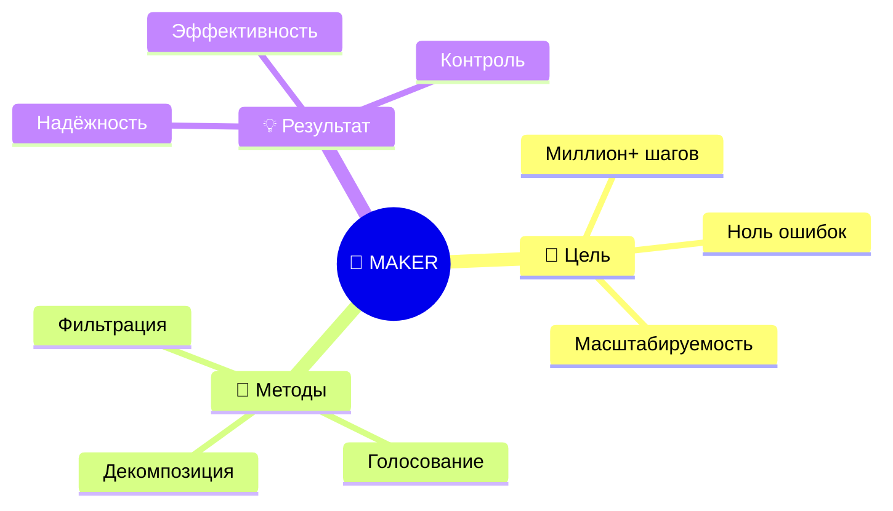
```mermaid
mindmap
  root((🧠 MAKER))
    🎯 Цель
      Миллион+ шагов
      Ноль ошибок
      Масштабируемость
    🔧 Методы
      Декомпозиция
      Голосование
      Фильтрация
    💡 Результат
      Надёжность
      Эффективность
      Контроль
```

### 🌟 Что делает MAKER особенным?

| Характеристика | Традиционные LLM | MAKER |
|----------------|------------------|-------|
| 🔢 Максимум шагов | ~100-300 | **1,000,000+** |
| ❌ Ошибки | Накапливаются | **Исправляются** |
| 📈 Масштабирование | Деградация | **Логарифмический рост** |
| 🎯 Фокус агента | Вся задача | **Один шаг** |

---

## 🧩 Ключевая Проблема

### 😱 Почему обычные LLM не справляются?

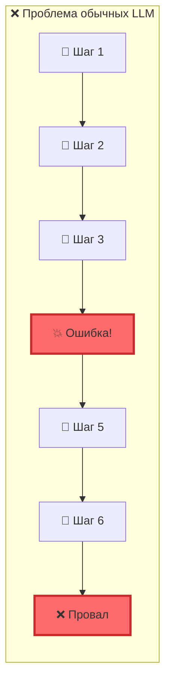
```mermaid
graph LR
    subgraph "❌ Проблема обычных LLM"
        A[🚀 Шаг 1] --> B[📝 Шаг 2]
        B --> C[📝 Шаг 3]
        C --> D[💥 Ошибка!]
        D --> E[📝 Шаг 5]
        E --> F[📝 Шаг 6]
        F --> G[❌ Провал]
    end
    
    style D fill:#ff6b6b,stroke:#c92a2a,stroke-width:3px
    style G fill:#ff6b6b,stroke:#c92a2a,stroke-width:3px
```

**🔴 Главная проблема:** Даже при точности 99% на каждом шаге:
- После 100 шагов → ~37% шанс успеха
- После 1000 шагов → ~0.004% шанс успеха  
- После 1,000,000 шагов → **практически 0%** 😰

### 🎲 Эффект "слабого звена"

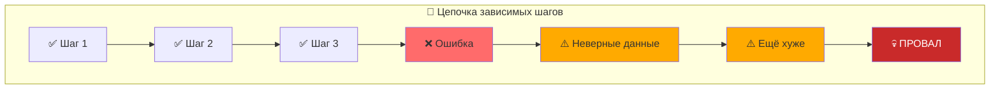
```mermaid
graph TB
    subgraph "🔗 Цепочка зависимых шагов"
        S1[✅ Шаг 1] --> S2[✅ Шаг 2]
        S2 --> S3[✅ Шаг 3]
        S3 --> S4[❌ Ошибка]
        S4 --> S5[⚠️ Неверные данные]
        S5 --> S6[⚠️ Ещё хуже]
        S6 --> FAIL[💀 ПРОВАЛ]
    end
    
    style S4 fill:#ff6b6b
    style S5 fill:#ffaa00
    style S6 fill:#ffaa00
    style FAIL fill:#c92a2a,color:#fff
```

---

## 🏛️ Архитектура MAKER

### 🎨 Общая Структура Системы

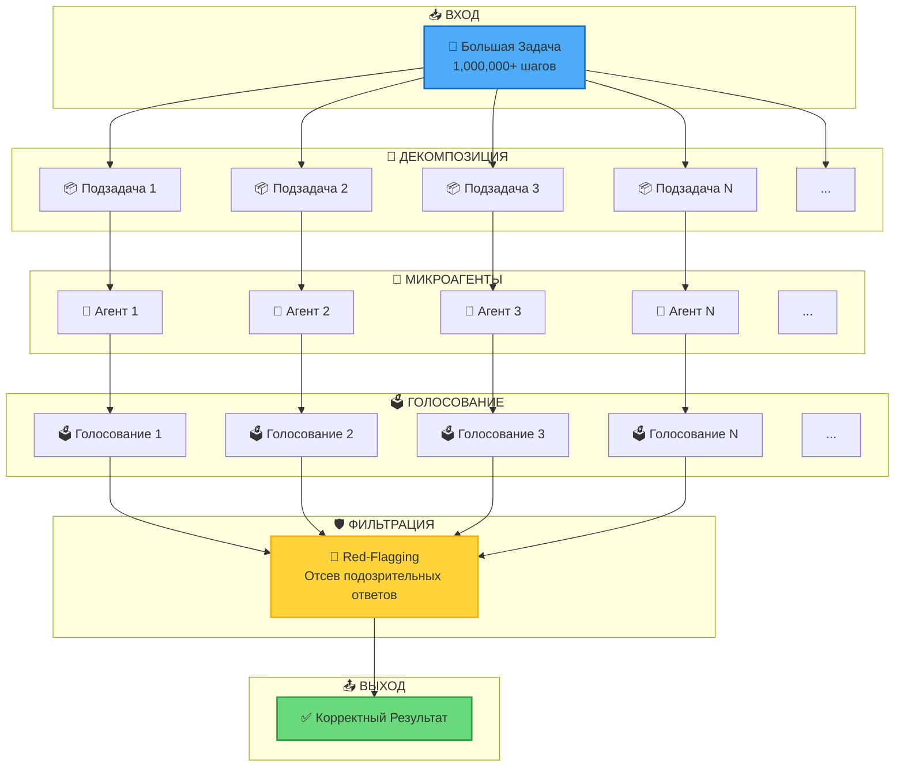
```mermaid
flowchart TB
    subgraph INPUT["📥 ВХОД"]
        TASK[🎯 Большая Задача<br/>1,000,000+ шагов]
    end
    
    subgraph DECOMPOSITION["🔨 ДЕКОМПОЗИЦИЯ"]
        D1[📦 Подзадача 1]
        D2[📦 Подзадача 2]
        D3[📦 Подзадача 3]
        DN[📦 Подзадача N]
        DOTS1[...]
    end
    
    subgraph AGENTS["🤖 МИКРОАГЕНТЫ"]
        A1[🤖 Агент 1]
        A2[🤖 Агент 2]
        A3[🤖 Агент 3]
        AN[🤖 Агент N]
        DOTS2[...]
    end
    
    subgraph VOTING["🗳️ ГОЛОСОВАНИЕ"]
        V1[🗳️ Голосование 1]
        V2[🗳️ Голосование 2]
        V3[🗳️ Голосование 3]
        VN[🗳️ Голосование N]
        DOTS3[...]
    end
    
    subgraph FILTER["🛡️ ФИЛЬТРАЦИЯ"]
        RF[🚩 Red-Flagging<br/>Отсев подозрительных ответов]
    end
    
    subgraph OUTPUT["📤 ВЫХОД"]
        RESULT[✅ Корректный Результат]
    end
    
    TASK --> D1 & D2 & D3 & DOTS1 & DN
    D1 --> A1
    D2 --> A2
    D3 --> A3
    DN --> AN
    
    A1 --> V1
    A2 --> V2
    A3 --> V3
    AN --> VN
    
    V1 & V2 & V3 & VN --> RF
    RF --> RESULT
    
    style TASK fill:#4dabf7,stroke:#1971c2,stroke-width:2px
    style RESULT fill:#69db7c,stroke:#2f9e44,stroke-width:2px
    style RF fill:#ffd43b,stroke:#fab005,stroke-width:2px
```

### 🧱 Компоненты Системы

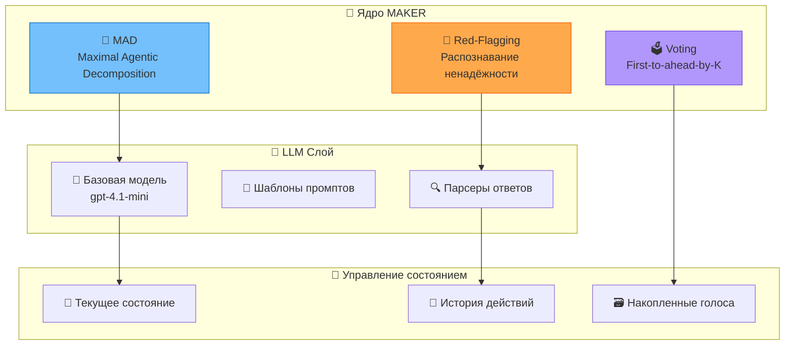
```mermaid
graph TB
    subgraph CORE["🎯 Ядро MAKER"]
        MAD["🔨 MAD<br/>Maximal Agentic Decomposition"]
        VOTE["🗳️ Voting<br/>First-to-ahead-by-K"]
        FLAG["🚩 Red-Flagging<br/>Распознавание ненадёжности"]
    end
    
    subgraph LLM["🧠 LLM Слой"]
        MODEL[🤖 Базовая модель<br/>gpt-4.1-mini]
        PROMPT[📝 Шаблоны промптов]
        PARSER[🔍 Парсеры ответов]
    end
    
    subgraph STATE["💾 Управление состоянием"]
        CURRENT[📍 Текущее состояние]
        HISTORY[📜 История действий]
        VOTES[🗃️ Накопленные голоса]
    end
    
    MAD --> MODEL
    VOTE --> VOTES
    FLAG --> PARSER
    MODEL --> CURRENT
    PARSER --> HISTORY
    
    style MAD fill:#74c0fc,stroke:#1971c2
    style VOTE fill:#b197fc,stroke:#7048e8
    style FLAG fill:#ffa94d,stroke:#f76707
```

---

## ⚙️ Три Столпа Системы

### 🔨 Столп 1: Максимальная Декомпозиция (MAD)

> **Идея:** Разбить огромную задачу на мельчайшие возможные подзадачи, где каждый агент отвечает только за ОДИН шаг.

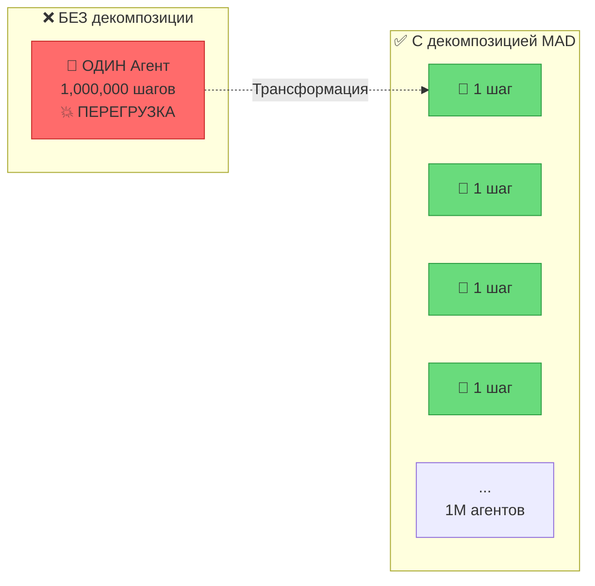
```mermaid
flowchart LR
    subgraph BEFORE["❌ БЕЗ декомпозиции"]
        BIG[🤖 ОДИН Агент<br/>1,000,000 шагов<br/>💥 ПЕРЕГРУЗКА]
    end
    
    subgraph AFTER["✅ С декомпозицией MAD"]
        MA1[🤖 1 шаг]
        MA2[🤖 1 шаг]
        MA3[🤖 1 шаг]
        MAN[🤖 1 шаг]
        MADOTS[...<br/>1M агентов]
    end
    
    BIG -.->|"Трансформация"| MA1
    
    style BIG fill:#ff6b6b,stroke:#c92a2a
    style MA1 fill:#69db7c,stroke:#2f9e44
    style MA2 fill:#69db7c,stroke:#2f9e44
    style MA3 fill:#69db7c,stroke:#2f9e44
    style MAN fill:#69db7c,stroke:#2f9e44
```

#### 🎯 Преимущества MAD:

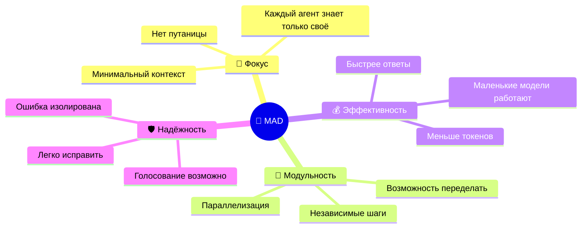
```mermaid
mindmap
  root((🔨 MAD))
    🎯 Фокус
      Каждый агент знает только своё
      Минимальный контекст
      Нет путаницы
    🔄 Модульность
      Независимые шаги
      Возможность переделать
      Параллелизация
    💰 Эффективность
      Маленькие модели работают
      Меньше токенов
      Быстрее ответы
    🛡️ Надёжность
      Ошибка изолирована
      Легко исправить
      Голосование возможно
```

#### 📊 Как работает один микроагент:

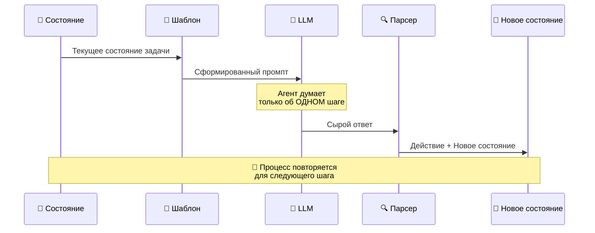
```mermaid
sequenceDiagram
    participant S as 📍 Состояние
    participant T as 📝 Шаблон
    participant M as 🤖 LLM
    participant P as 🔍 Парсер
    participant N as 📍 Новое состояние

    S->>T: Текущее состояние задачи
    T->>M: Сформированный промпт
    Note over M: Агент думает<br/>только об ОДНОМ шаге
    M->>P: Сырой ответ
    P->>N: Действие + Новое состояние
    
    Note over S,N: 🔄 Процесс повторяется<br/>для следующего шага
```

---

### 🗳️ Столп 2: Голосование "First-to-ahead-by-K"

> **Идея:** Для каждого шага запускаем несколько независимых агентов и выбираем ответ, который "выиграл" с отрывом в K голосов.

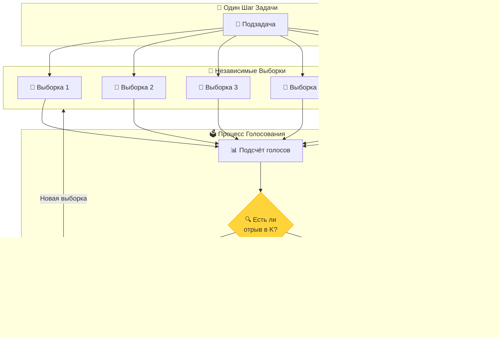
```mermaid
flowchart TB
    subgraph STEP["📝 Один Шаг Задачи"]
        TASK_STEP[🎯 Подзадача]
    end
    
    subgraph SAMPLES["🎲 Независимые Выборки"]
        S1[🤖 Выборка 1]
        S2[🤖 Выборка 2]
        S3[🤖 Выборка 3]
        S4[🤖 Выборка 4]
        S5[🤖 Выборка 5]
        SN[🤖 ...]
    end
    
    subgraph VOTING["🗳️ Процесс Голосования"]
        COUNT[📊 Подсчёт голосов]
        CHECK{🔍 Есть ли<br/>отрыв в K?}
        MORE[➕ Нужно больше<br/>выборок]
        WINNER[🏆 Победитель!]
    end
    
    TASK_STEP --> S1 & S2 & S3 & S4 & S5 & SN
    S1 & S2 & S3 & S4 & S5 & SN --> COUNT
    COUNT --> CHECK
    CHECK -->|Нет| MORE
    MORE -->|Новая выборка| SAMPLES
    CHECK -->|Да| WINNER
    
    style WINNER fill:#69db7c,stroke:#2f9e44,stroke-width:3px
    style CHECK fill:#ffd43b,stroke:#fab005
```

#### 🎮 Пример голосования (K=3):

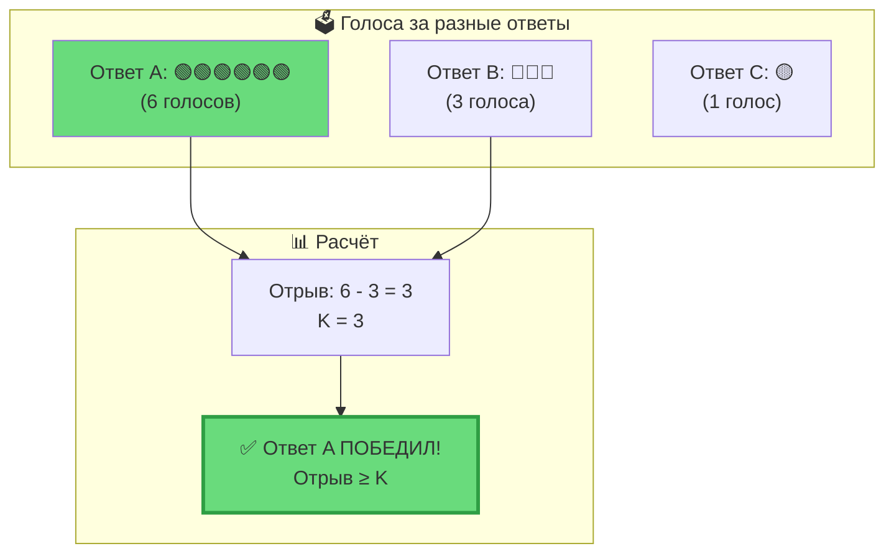
```mermaid
graph TB
    subgraph VOTES["🗳️ Голоса за разные ответы"]
        A["Ответ A: 🟢🟢🟢🟢🟢🟢<br/>(6 голосов)"]
        B["Ответ B: 🔴🔴🔴<br/>(3 голоса)"]
        C["Ответ C: 🟡<br/>(1 голос)"]
    end
    
    subgraph CALC["📊 Расчёт"]
        DIFF["Отрыв: 6 - 3 = 3<br/>K = 3"]
        RESULT["✅ Ответ A ПОБЕДИЛ!<br/>Отрыв ≥ K"]
    end
    
    A --> DIFF
    B --> DIFF
    DIFF --> RESULT
    
    style A fill:#69db7c
    style RESULT fill:#69db7c,stroke:#2f9e44,stroke-width:3px
```

#### 🔄 Алгоритм голосования:

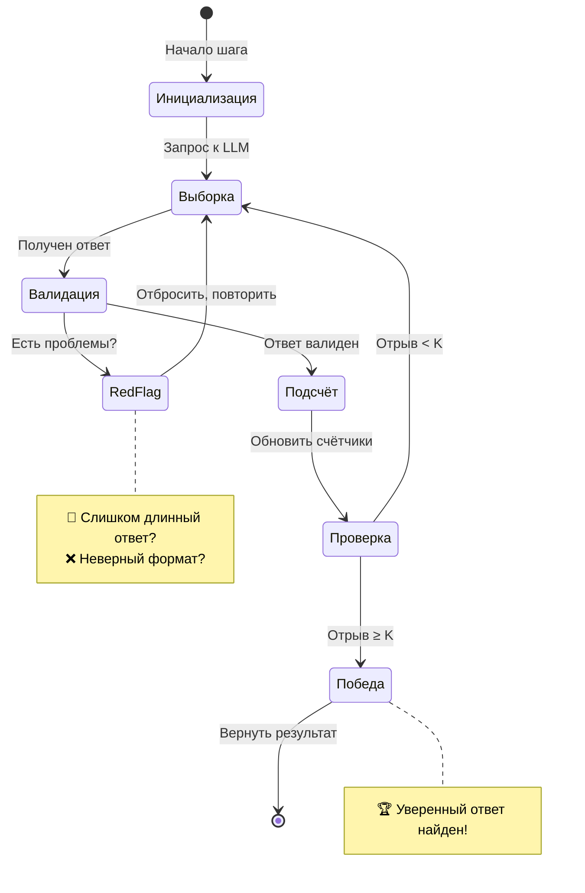
```mermaid
stateDiagram-v2
    [*] --> Инициализация: Начало шага
    
    Инициализация --> Выборка: Запрос к LLM
    
    Выборка --> Валидация: Получен ответ
    
    Валидация --> RedFlag: Есть проблемы?
    Валидация --> Подсчёт: Ответ валиден
    
    RedFlag --> Выборка: Отбросить, повторить
    
    Подсчёт --> Проверка: Обновить счётчики
    
    Проверка --> Победа: Отрыв ≥ K
    Проверка --> Выборка: Отрыв < K
    
    Победа --> [*]: Вернуть результат
    
    note right of RedFlag: 🚩 Слишком длинный ответ?<br/>❌ Неверный формат?
    note right of Победа: 🏆 Уверенный ответ найден!
```

---

### 🚩 Столп 3: Red-Flagging (Красные Флаги)

> **Идея:** Если ответ LLM выглядит подозрительно — отбросить его, не пытаясь "починить".

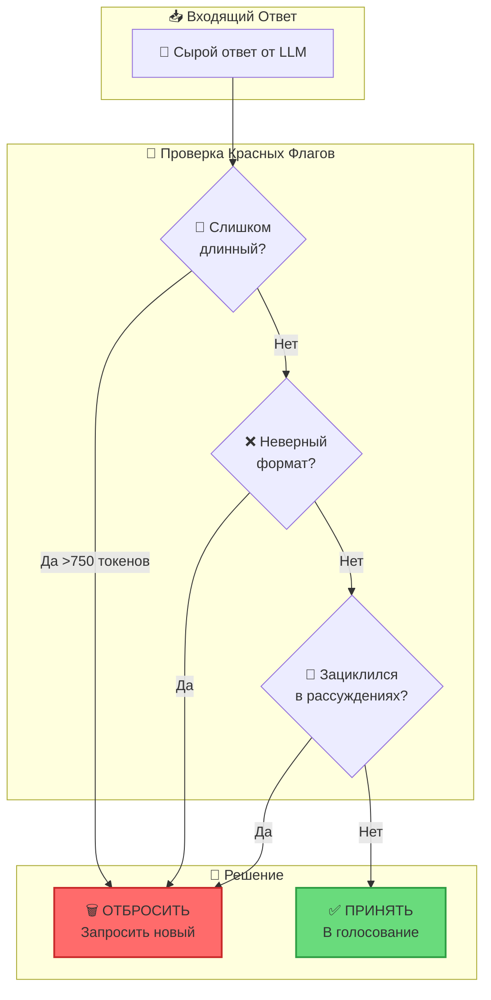
```mermaid
flowchart TB
    subgraph INPUT["📥 Входящий Ответ"]
        RAW[🤖 Сырой ответ от LLM]
    end
    
    subgraph FLAGS["🚩 Проверка Красных Флагов"]
        F1{📏 Слишком<br/>длинный?}
        F2{❌ Неверный<br/>формат?}
        F3{🔄 Зациклился<br/>в рассуждениях?}
    end
    
    subgraph DECISION["🎯 Решение"]
        REJECT[🗑️ ОТБРОСИТЬ<br/>Запросить новый]
        ACCEPT[✅ ПРИНЯТЬ<br/>В голосование]
    end
    
    RAW --> F1
    F1 -->|Да >750 токенов| REJECT
    F1 -->|Нет| F2
    F2 -->|Да| REJECT
    F2 -->|Нет| F3
    F3 -->|Да| REJECT
    F3 -->|Нет| ACCEPT
    
    style REJECT fill:#ff6b6b,stroke:#c92a2a,stroke-width:2px
    style ACCEPT fill:#69db7c,stroke:#2f9e44,stroke-width:2px
```

#### 🔍 Что считается "Красным Флагом"?

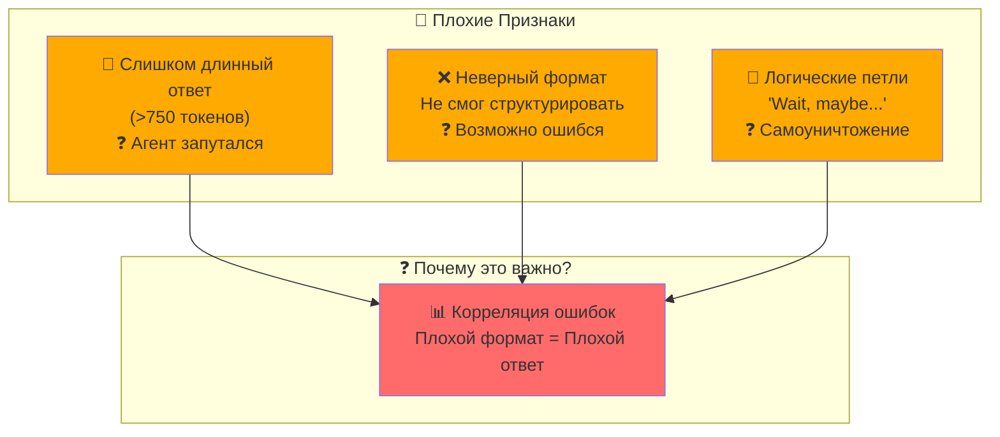
```mermaid
graph TB
    subgraph BADFLAGS["🚩 Плохие Признаки"]
        LONG["📏 Слишком длинный ответ<br/>(>750 токенов)<br/>❓ Агент запутался"]
        FORMAT["❌ Неверный формат<br/>Не смог структурировать<br/>❓ Возможно ошибся"]
        LOOP["🔄 Логические петли<br/>'Wait, maybe...'<br/>❓ Самоуничтожение"]
    end
    
    subgraph WHY["❓ Почему это важно?"]
        CORR["📊 Корреляция ошибок<br/>Плохой формат = Плохой ответ"]
    end
    
    LONG --> CORR
    FORMAT --> CORR
    LOOP --> CORR
    
    style LONG fill:#ffaa00
    style FORMAT fill:#ffaa00
    style LOOP fill:#ffaa00
    style CORR fill:#ff6b6b
```

#### 📈 Влияние Red-Flagging на точность:

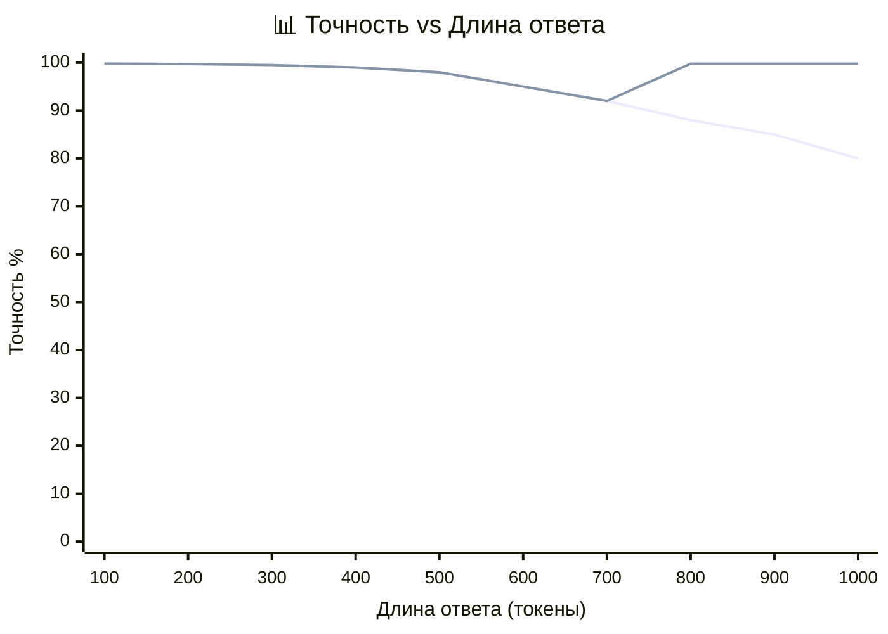
```mermaid
xychart-beta
    title "📊 Точность vs Длина ответа"
    x-axis "Длина ответа (токены)" [100, 200, 300, 400, 500, 600, 700, 800, 900, 1000]
    y-axis "Точность %" 0 --> 100
    line "Без фильтра" [99.8, 99.7, 99.5, 99.0, 98.0, 95.0, 92.0, 88.0, 85.0, 80.0]
    line "С Red-Flag (отсечка 750)" [99.8, 99.7, 99.5, 99.0, 98.0, 95.0, 92.0, 99.8, 99.8, 99.8]
```

---

## 🔄 Потоки Данных и Взаимодействия

### 🌊 Полный Поток Выполнения

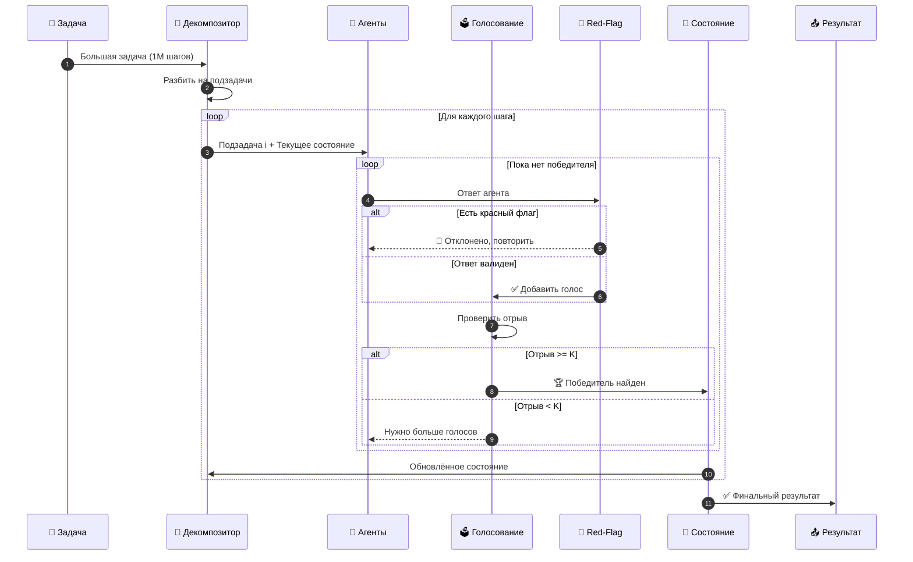
```mermaid
sequenceDiagram
    autonumber
    participant T as 🎯 Задача
    participant D as 🔨 Декомпозитор
    participant A as 🤖 Агенты
    participant V as 🗳️ Голосование
    participant R as 🚩 Red-Flag
    participant S as 💾 Состояние
    participant O as 📤 Результат

    T->>D: Большая задача (1M шагов)
    D->>D: Разбить на подзадачи
    
    loop Для каждого шага
        D->>A: Подзадача i + Текущее состояние
        
        loop Пока нет победителя
            A->>R: Ответ агента
            
            alt Есть красный флаг
                R-->>A: 🚩 Отклонено, повторить
            else Ответ валиден
                R->>V: ✅ Добавить голос
            end
            
            V->>V: Проверить отрыв
            
            alt Отрыв >= K
                V->>S: 🏆 Победитель найден
            else Отрыв < K
                V-->>A: Нужно больше голосов
            end
        end
        
        S->>D: Обновлённое состояние
    end
    
    S->>O: ✅ Финальный результат
```

### 🔀 Параллельная Обработка

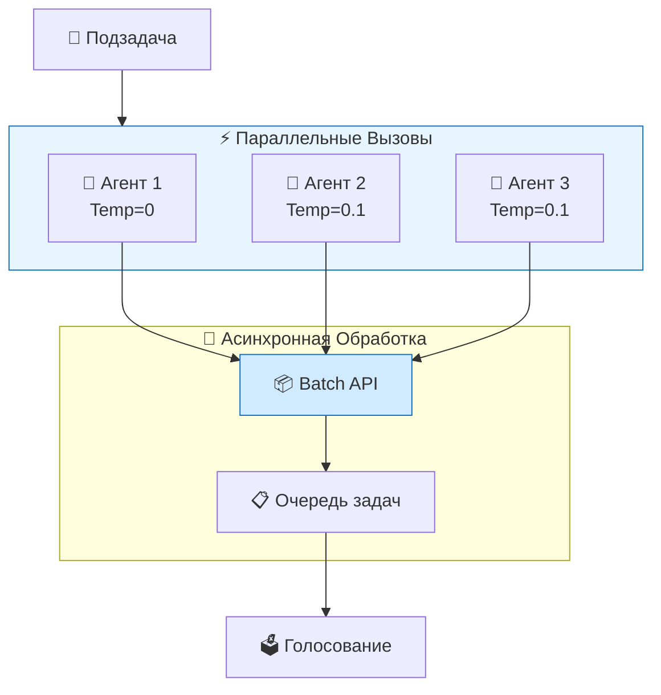
```mermaid
flowchart TB
    subgraph PARALLEL["⚡ Параллельные Вызовы"]
        direction TB
        P1[🤖 Агент 1<br/>Temp=0]
        P2[🤖 Агент 2<br/>Temp=0.1]
        P3[🤖 Агент 3<br/>Temp=0.1]
    end
    
    subgraph ASYNC["📡 Асинхронная Обработка"]
        BATCH[📦 Batch API]
        QUEUE[📋 Очередь задач]
    end
    
    TASK[🎯 Подзадача] --> PARALLEL
    P1 & P2 & P3 --> BATCH
    BATCH --> QUEUE
    QUEUE --> VOTE[🗳️ Голосование]
    
    style PARALLEL fill:#e7f5ff,stroke:#1971c2
    style BATCH fill:#d0ebff,stroke:#1971c2
```

---

## 🎭 Роли Агентов

### 🤖 Структура Микроагента

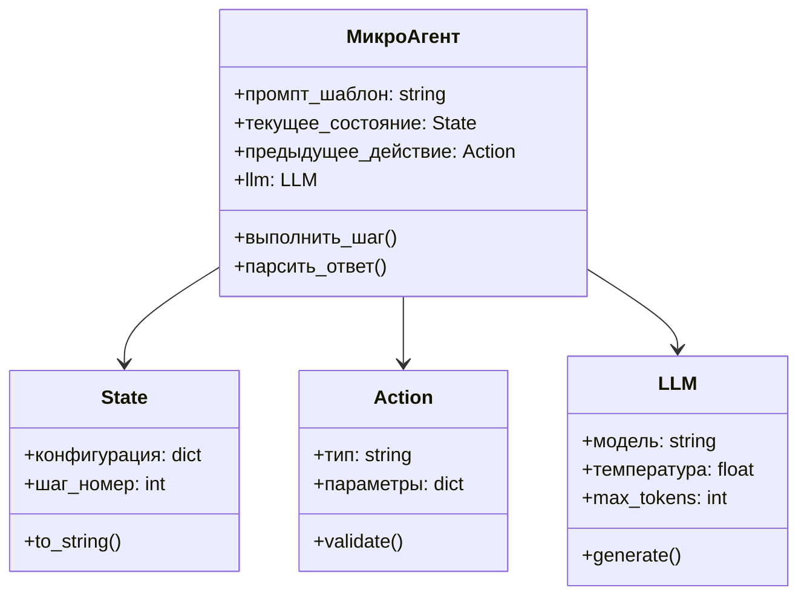
```mermaid
classDiagram
    class МикроАгент {
        +промпт_шаблон: string
        +текущее_состояние: State
        +предыдущее_действие: Action
        +llm: LLM
        +выполнить_шаг()
        +парсить_ответ()
    }
    
    class State {
        +конфигурация: dict
        +шаг_номер: int
        +to_string()
    }
    
    class Action {
        +тип: string
        +параметры: dict
        +validate()
    }
    
    class LLM {
        +модель: string
        +температура: float
        +max_tokens: int
        +generate()
    }
    
    МикроАгент --> State
    МикроАгент --> Action
    МикроАгент --> LLM
```

### 📝 Что знает каждый агент?

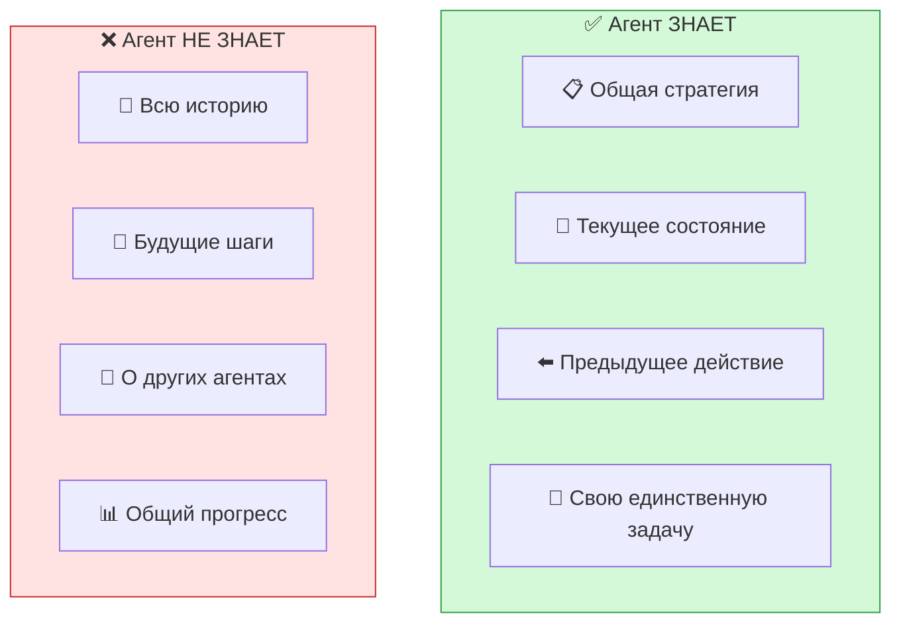
```mermaid
graph TB
    subgraph KNOWS["✅ Агент ЗНАЕТ"]
        K1[📋 Общая стратегия]
        K2[📍 Текущее состояние]
        K3[⬅️ Предыдущее действие]
        K4[🎯 Свою единственную задачу]
    end
    
    subgraph DOESNT["❌ Агент НЕ ЗНАЕТ"]
        D1[📜 Всю историю]
        D2[🔮 Будущие шаги]
        D3[🤖 О других агентах]
        D4[📊 Общий прогресс]
    end
    
    style KNOWS fill:#d3f9d8,stroke:#2f9e44
    style DOESNT fill:#ffe3e3,stroke:#c92a2a
```

### 🎯 Жизненный Цикл Агента

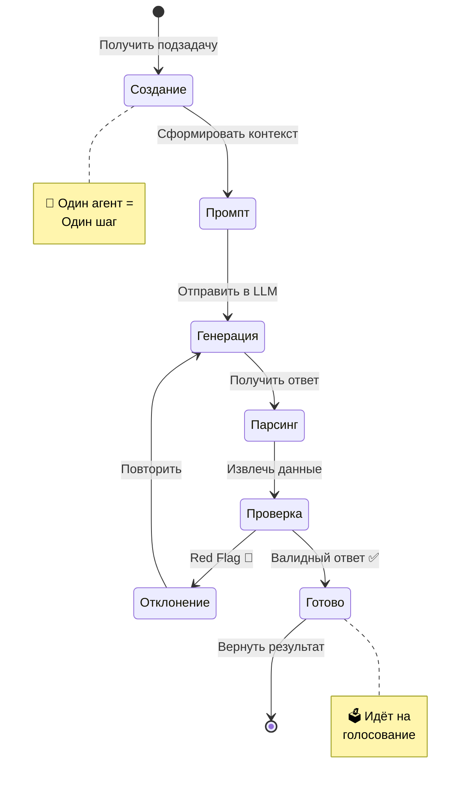
```mermaid
stateDiagram-v2
    [*] --> Создание: Получить подзадачу
    
    Создание --> Промпт: Сформировать контекст
    
    Промпт --> Генерация: Отправить в LLM
    
    Генерация --> Парсинг: Получить ответ
    
    Парсинг --> Проверка: Извлечь данные
    
    Проверка --> Отклонение: Red Flag 🚩
    Проверка --> Готово: Валидный ответ ✅
    
    Отклонение --> Генерация: Повторить
    
    Готово --> [*]: Вернуть результат
    
    note right of Создание: 🤖 Один агент =<br/>Один шаг
    note right of Готово: 🗳️ Идёт на<br/>голосование
```

---

## 🛡️ Система Защиты от Ошибок

### 🔒 Многоуровневая Защита

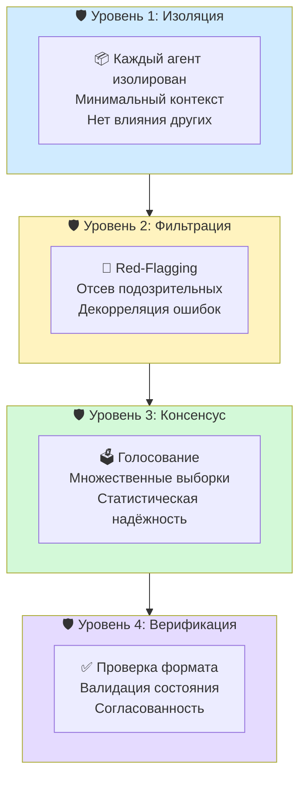
```mermaid
flowchart TB
    subgraph L1["🛡️ Уровень 1: Изоляция"]
        ISO[📦 Каждый агент изолирован<br/>Минимальный контекст<br/>Нет влияния других]
    end
    
    subgraph L2["🛡️ Уровень 2: Фильтрация"]
        FLT[🚩 Red-Flagging<br/>Отсев подозрительных<br/>Декорреляция ошибок]
    end
    
    subgraph L3["🛡️ Уровень 3: Консенсус"]
        CON[🗳️ Голосование<br/>Множественные выборки<br/>Статистическая надёжность]
    end
    
    subgraph L4["🛡️ Уровень 4: Верификация"]
        VER[✅ Проверка формата<br/>Валидация состояния<br/>Согласованность]
    end
    
    L1 --> L2 --> L3 --> L4
    
    style L1 fill:#d0ebff
    style L2 fill:#fff3bf
    style L3 fill:#d3f9d8
    style L4 fill:#e5dbff
```

### 🔄 Декорреляция Ошибок

```mermaid
graph TB
    subgraph PROBLEM["❌ Проблема: Коррелированные ошибки"]
        CE1[🤖 Агент 1: ❌]
        CE2[🤖 Агент 2: ❌]
        CE3[🤖 Агент 3: ❌]
        CRES[📊 Все ошиблись одинаково!<br/>Голосование не поможет 😱]
    end
    
    subgraph SOLUTION["✅ Решение: Декорреляция"]
        direction TB
        S1[🎲 Разные температуры]
        S2[🚩 Red-Flagging отсеивает<br/>аномальные паттерны]
        S3[📝 Независимые выборки]
        SRES[📊 Ошибки разные!<br/>Голосование работает 🎉]
    end
    
    PROBLEM -.->|Решается через| SOLUTION
    
    style CRES fill:#ff6b6b
    style SRES fill:#69db7c
```

---

## 📊 Сравнение Подходов

### 🆚 Монолитный vs MAKER

```mermaid
graph TB
    subgraph MONO["🦖 Монолитный Агент"]
        M1[🤖 ОДИН агент]
        M2[📜 Огромный контекст]
        M3[💥 Накопление ошибок]
        M4[😵 Путаница]
        M5[❌ ПРОВАЛ]
        
        M1 --> M2 --> M3 --> M4 --> M5
    end
    
    subgraph MAKER_SYS["🏗️ MAKER"]
        K1[🤖🤖🤖 Много микроагентов]
        K2[📋 Минимальный контекст]
        K3[🛡️ Изоляция ошибок]
        K4[🗳️ Коррекция голосованием]
        K5[✅ УСПЕХ]
        
        K1 --> K2 --> K3 --> K4 --> K5
    end
    
    style M5 fill:#ff6b6b,stroke:#c92a2a
    style K5 fill:#69db7c,stroke:#2f9e44
```

### 📈 Сравнительная Таблица

| Аспект | 🦖 Монолитный | 🏗️ MAKER |
|--------|---------------|----------|
| **Контекст агента** | Вся история | Только 1 шаг |
| **Размер модели** | Большой | Маленький работает |
| **Обработка ошибок** | Накопление | Изоляция + коррекция |
| **Масштабирование** | Экспоненциальная деградация | Лог-линейный рост |
| **Параллелизм** | Невозможен | Полностью параллелен |
| **Стоимость** | Высокая (большие модели) | Низкая (маленькие модели) |
| **Прозрачность** | Чёрный ящик | Каждый шаг виден |

---

## 🚀 Применение и Масштабирование

### 🎯 Когда использовать MAKER?

```mermaid
mindmap
  root((🚀 MAKER подходит для))
    📋 Длинные процессы
      Тысячи шагов
      Миллионы шагов
      Критичные задачи
    🔧 Структурированные задачи
      Чёткие шаги
      Известная стратегия
      Проверяемые результаты
    🛡️ Высокая надёжность
      Ноль ошибок
      Критичные системы
      Аудируемость
    💰 Оптимизация затрат
      Маленькие модели
      Параллелизм
      Batch API
```

### 🏭 Примеры Применения

```mermaid
graph TB
    subgraph EXAMPLES["🌍 Области Применения"]
        E1["🏢 Бизнес-процессы<br/>Обработка документов<br/>Миллионы операций"]
        E2["🔬 Научные вычисления<br/>Сложные симуляции<br/>Длинные pipeline"]
        E3["🏥 Медицина<br/>Анализ данных<br/>Критичная точность"]
        E4["🏭 Производство<br/>Контроль качества<br/>Цепочки поставок"]
        E5["💻 Разработка ПО<br/>Рефакторинг кода<br/>Миграции"]
    end
    
    style E1 fill:#d0ebff
    style E2 fill:#d3f9d8
    style E3 fill:#ffe3e3
    style E4 fill:#fff3bf
    style E5 fill:#e5dbff
```

### 📈 Масштабирование Системы

```mermaid
flowchart LR
    subgraph SCALE["📈 Масштабирование"]
        direction TB
        S1["🔢 100 шагов"]
        S2["🔢 1,000 шагов"]
        S3["🔢 100,000 шагов"]
        S4["🔢 1,000,000 шагов"]
        S5["🔢 ∞ шагов"]
    end
    
    subgraph COST["💰 Рост стоимости"]
        C1["~log(100)"]
        C2["~log(1,000)"]
        C3["~log(100,000)"]
        C4["~log(1,000,000)"]
        C5["~log(N)"]
    end
    
    S1 --> C1
    S2 --> C2
    S3 --> C3
    S4 --> C4
    S5 --> C5
    
    style S4 fill:#69db7c,stroke:#2f9e44,stroke-width:3px
    style C4 fill:#d3f9d8
```

---

## 🎓 Ключевые Выводы

```mermaid
mindmap
  root((🎓 MAKER))
    🔨 Декомпозиция
      Разбить на мельчайшие части
      Один агент = Один шаг
      Минимальный контекст
    🗳️ Голосование
      Множественные выборки
      First-to-ahead-by-K
      Статистическая надёжность
    🚩 Фильтрация
      Red-Flagging
      Отсев подозрительных
      Декорреляция ошибок
    ✅ Результат
      Миллион шагов
      Ноль ошибок
      Масштабируемость
```

### 💡 Главная Идея

> **"Вместо того чтобы строить всё более умные одиночные модели, можно разбить интеллект на миллион кусочков и построить надёжный, масштабируемый ИИ."** 🧠💥🤖🤖🤖

---

## 📚 Глоссарий

| Термин | Описание |
|--------|----------|
| 🔨 **MAD** | Maximal Agentic Decomposition — максимальная декомпозиция на микроагентов |
| 🗳️ **First-to-ahead-by-K** | Правило голосования: побеждает тот, кто набрал на K голосов больше |
| 🚩 **Red-Flagging** | Отсев подозрительных ответов по косвенным признакам |
| 🤖 **Микроагент** | Агент, отвечающий за выполнение только одного шага |
| 📊 **Декорреляция** | Уменьшение связи между ошибками разных выборок |
| 💾 **Состояние** | Минимальная информация, передаваемая между шагами |

---

### 🌟 Сделано с ❤️ для понимания MAKER 🌟

**[📄 Оригинальная статья](https://arxiv.org/abs/2511.09030)** | **[🎥 Визуализация](https://www.youtube.com/watch?v=gLkehsQy4H4)**

