# 🔱 TRIFORCE: Унифицированная Архитектура LLM-Агентов

> **🧭 COMPASS × 🏗️ MAKER × ⚓ PORTO = Идеальная Агентская Система**

---

## 📋 Оглавление

1. [🌟 Введение](#-введение)
2. [🎯 Зачем объединять три архитектуры](#-зачем-объединять-три-архитектуры)
3. [🔍 Краткий обзор каждой системы](#-краткий-обзор-каждой-системы)
   - [🧭 COMPASS: Стратегическое мышление](#-compass-стратегическое-мышление)
   - [🏗️ MAKER: Надёжное выполнение](#️-maker-надёжное-выполнение)
   - [⚓ PORTO: Модульная организация](#-porto-модульная-организация)
4. [🏛️ Архитектура TRIFORCE](#️-архитектура-triforce)
   - [📊 Общая структура](#-общая-структура)
   - [🚢 Ship Layer для агентов](#-ship-layer-для-агентов)
   - [📦 Containers Layer для агентов](#-containers-layer-для-агентов)
   - [🧠 Strategic Layer (COMPASS)](#-strategic-layer-compass)
   - [⚙️ Execution Layer (MAKER)](#️-execution-layer-maker)
5. [🔄 Потоки данных](#-потоки-данных)
6. [📦 Структура Sections и Containers](#-структура-sections-и-containers)
7. [🎭 Компоненты системы](#-компоненты-системы)
8. [🔀 Взаимодействие компонентов](#-взаимодействие-компонентов)
9. [🛡️ Система надёжности](#️-система-надёжности)
10. [📈 Сценарии применения](#-сценарии-применения)
11. [⚙️ Техническая реализация](#️-техническая-реализация)
12. [🎓 Заключение](#-заключение)

---

## 🌟 Введение

### 🤔 Что такое TRIFORCE?

**TRIFORCE** — это революционная архитектура, объединяющая **три мощных подхода** для создания надёжных, масштабируемых и поддерживаемых LLM-агентских систем:

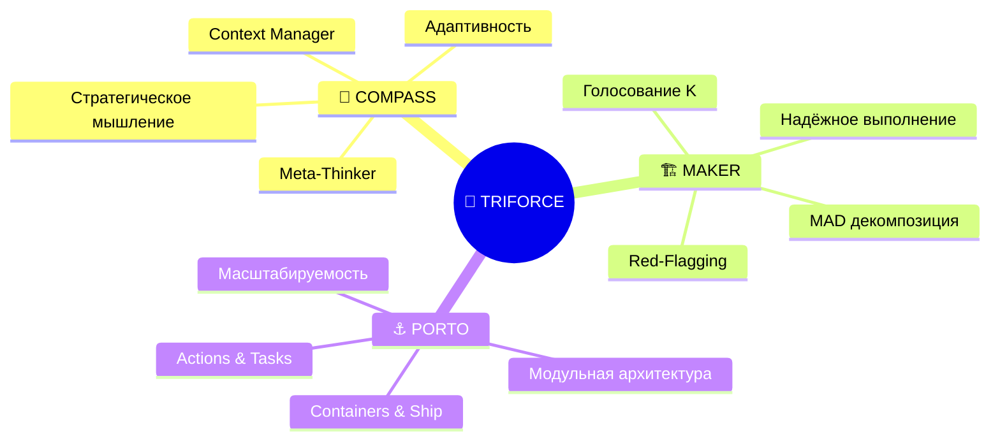

### 🎯 Философия TRIFORCE

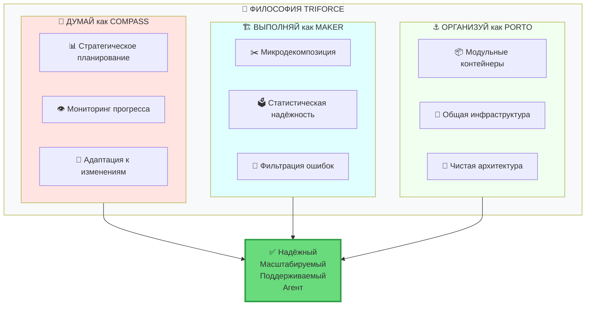

---

## 🎯 Зачем объединять три архитектуры

### 😱 Проблемы современных LLM-агентов

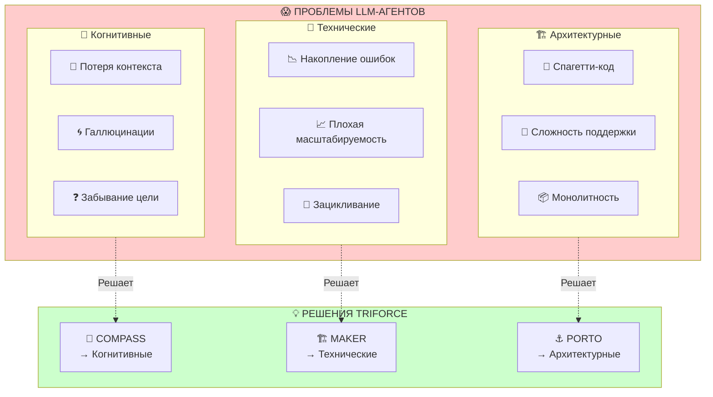

### 📊 Сравнительная матрица

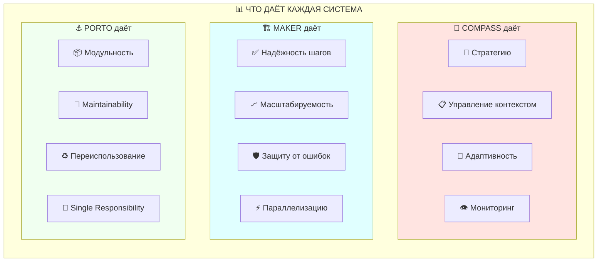

| Критерий | 🤖 Простой Агент | 🧭 COMPASS | 🏗️ MAKER | ⚓ PORTO | 🔱 TRIFORCE |
|----------|------------------|------------|----------|---------|-------------|
| 📈 **Масштаб задач** | ~50 шагов | ~500 шагов | 1M+ шагов | ∞ модули | **1M+ шагов** |
| 🎯 **Точность** | ~95% | ~95% | ~99.99% | N/A | **~99.99%** |
| 🧠 **Стратегия** | ❌ | ✅ | ❌ | ❌ | **✅** |
| 🔄 **Адаптивность** | ⚠️ | ✅ | ❌ | ⚠️ | **✅** |
| 📦 **Модульность** | ❌ | ⚠️ | ⚠️ | ✅ | **✅** |
| 🔧 **Поддерживаемость** | ❌ | ⚠️ | ⚠️ | ✅ | **✅** |
| ♻️ **Переиспользование** | ❌ | ⚠️ | ⚠️ | ✅ | **✅** |
| 🛡️ **Надёжность** | ❌ | ⚠️ | ✅ | ⚠️ | **✅** |

---

## 🔍 Краткий обзор каждой системы

### 🧭 COMPASS: Стратегическое мышление

> **Context-Organized Multi-Agent Planning And Strategy System**

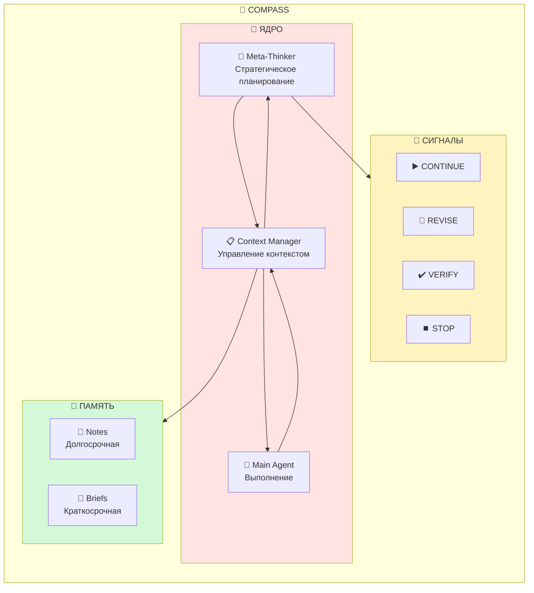

**✅ Сильные стороны:**
- 🎯 Стратегическое планирование на высоком уровне
- 🔄 Адаптация к неожиданным ситуациям
- 📋 Эффективное управление контекстом
- 👁️ Мониторинг и обнаружение проблем

---

### 🏗️ MAKER: Надёжное выполнение

> **Maximal Agentic Decomposition, first-to-ahead-by-K Error correction, and Red-flagging**

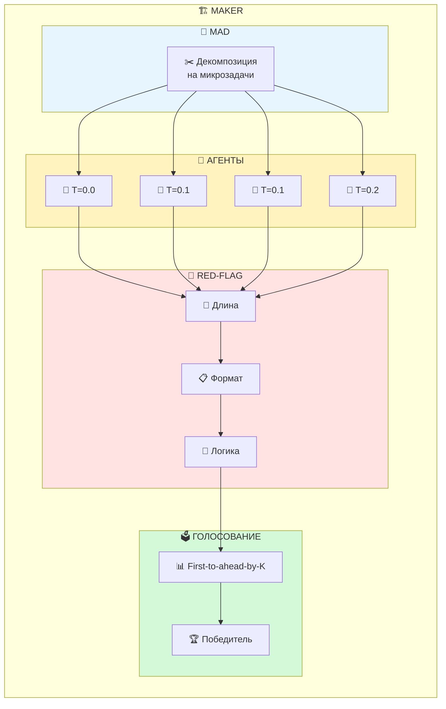

**✅ Сильные стороны:**
- 📈 Масштабирование до 1M+ шагов
- 🎯 Гарантия точности ~99.99%
- 🛡️ Статистическая защита от ошибок
- ⚡ Параллельное выполнение

---

### ⚓ PORTO: Модульная организация

> **Software Architectural Pattern for Scalable and Maintainable Applications**

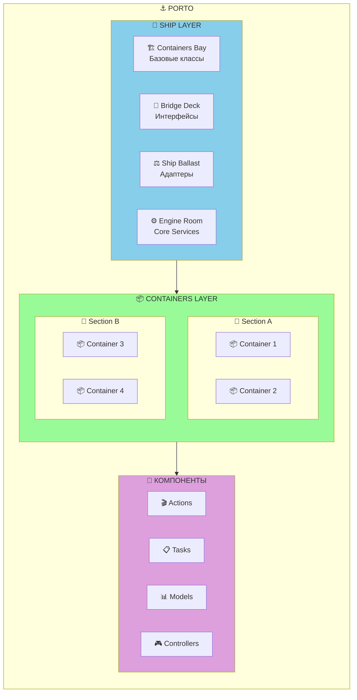

**✅ Сильные стороны:**
- 📦 Чёткая модульная структура
- 🔧 Высокая поддерживаемость
- ♻️ Переиспользование компонентов
- 🎯 Single Responsibility Principle

---

## 🏛️ Архитектура TRIFORCE

### 📊 Общая структура

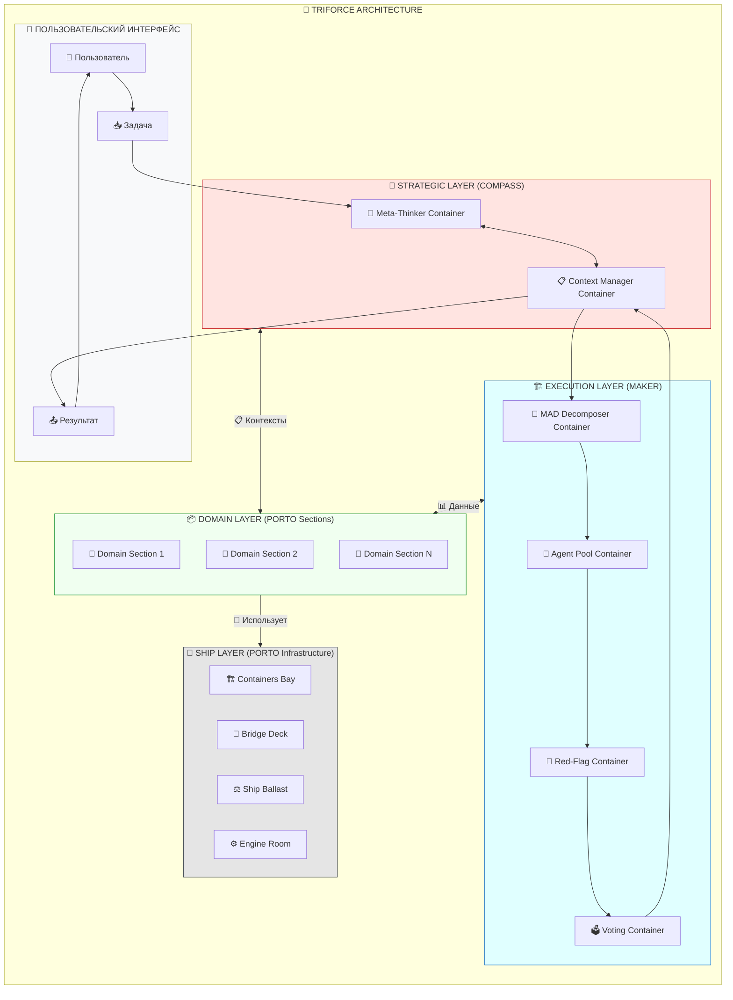

### 🔄 Детальная диаграмма слоёв

```mermaid
flowchart TB
    subgraph layers["🏛️ TRIFORCE LAYERS"]
        direction TB
        
        subgraph L1["🌟 LAYER 1: Strategic (COMPASS)"]
            direction LR
            L1A["🧠 Meta-Thinker<br/>━━━━━━━━━━<br/>• Анализ задач<br/>• Планирование<br/>• Мониторинг<br/>• Принятие решений"]
            L1B["📋 Context Manager<br/>━━━━━━━━━━<br/>• Notes хранилище<br/>• Briefs генератор<br/>• Синтез результатов"]
        end
        
        subgraph L2["⚙️ LAYER 2: Orchestration"]
            direction LR
            L2A["🔨 MAD Decomposer<br/>━━━━━━━━━━<br/>• Разбиение на микрозадачи<br/>• Очередь выполнения"]
            L2B["🎮 Execution Controller<br/>━━━━━━━━━━<br/>• Координация агентов<br/>• Управление потоком"]
        end
        
        subgraph L3["🏗️ LAYER 3: Execution (MAKER)"]
            direction LR
            L3A["🤖 Agent Pool<br/>━━━━━━━━━━<br/>• Параллельные агенты<br/>• Разные температуры"]
            L3B["🚩 Red-Flag Filter<br/>━━━━━━━━━━<br/>• Проверка длины<br/>• Проверка формата<br/>• Проверка логики"]
            L3C["🗳️ Voting System<br/>━━━━━━━━━━<br/>• First-to-K<br/>• Консенсус"]
        end
        
        subgraph L4["📦 LAYER 4: Domain (PORTO Containers)"]
            direction LR
            L4A["📂 Section: Core<br/>━━━━━━━━━━<br/>• User Container<br/>• Auth Container"]
            L4B["📂 Section: Business<br/>━━━━━━━━━━<br/>• Order Container<br/>• Product Container"]
            L4C["📂 Section: Integration<br/>━━━━━━━━━━<br/>• API Container<br/>• Events Container"]
        end
        
        subgraph L5["🚢 LAYER 5: Infrastructure (PORTO Ship)"]
            direction LR
            L5A["🏗️ Base Classes"]
            L5B["🌉 Interfaces"]
            L5C["⚖️ Adapters"]
            L5D["⚙️ Core Services"]
        end
    end
    
    L1 --> L2 --> L3 --> L4 --> L5
    
    style L1 fill:#FFE4E1,stroke:#c92a2a,stroke-width:2px
    style L2 fill:#fff3bf,stroke:#e67700,stroke-width:2px
    style L3 fill:#E0FFFF,stroke:#1971c2,stroke-width:2px
    style L4 fill:#F0FFF0,stroke:#2f9e44,stroke-width:2px
    style L5 fill:#E5E5E5,stroke:#495057,stroke-width:2px
```

---

### 🚢 Ship Layer для агентов

```mermaid
flowchart TB
    subgraph ship["🚢 SHIP LAYER: Агентская Инфраструктура"]
        direction TB
        
        subgraph bay["🏗️ CONTAINERS BAY"]
            direction TB
            BAY1["📄 BaseAgent<br/>Абстрактный агент"]
            BAY2["📄 BaseTask<br/>Базовая задача"]
            BAY3["📄 BaseAction<br/>Базовое действие"]
            BAY4["📄 BaseContainer<br/>Базовый контейнер"]
        end
        
        subgraph bridge["🌉 BRIDGE DECK"]
            direction TB
            BR1["📜 IAgent<br/>Интерфейс агента"]
            BR2["📜 ITask<br/>Интерфейс задачи"]
            BR3["📜 IVotable<br/>Интерфейс голосования"]
            BR4["📜 IFilterable<br/>Интерфейс фильтрации"]
        end
        
        subgraph ballast["⚖️ SHIP BALLAST"]
            direction TB
            BL1["🔌 LLMAdapter<br/>Адаптер к LLM"]
            BL2["🔌 StorageAdapter<br/>Адаптер хранилища"]
            BL3["🔌 QueueAdapter<br/>Адаптер очередей"]
            BL4["🔌 MetricsAdapter<br/>Адаптер метрик"]
        end
        
        subgraph engine["⚙️ ENGINE ROOM"]
            direction TB
            EN1["🔄 DependencyInjector<br/>Внедрение зависимостей"]
            EN2["📦 ContainerLoader<br/>Загрузчик контейнеров"]
            EN3["📊 MetricsCollector<br/>Сбор метрик"]
            EN4["🔔 EventDispatcher<br/>Диспетчер событий"]
        end
    end
    
    style bay fill:#d0ebff
    style bridge fill:#e5dbff
    style ballast fill:#fff3bf
    style engine fill:#d3f9d8
```

#### 📝 Пример базового класса агента

```
┌──────────────────────────────────────────────────────────────────┐
│  🏗️ CONTAINERS BAY: BaseAgent                                    │
├──────────────────────────────────────────────────────────────────┤
│                                                                  │
│  abstract class BaseAgent implements IAgent, IVotable {          │
│                                                                  │
│      // 🧠 Конфигурация                                          │
│      protected config: AgentConfig;                              │
│      protected temperature: number;                              │
│                                                                  │
│      // 🔧 Зависимости                                           │
│      protected llmAdapter: LLMAdapter;                           │
│      protected metricsAdapter: MetricsAdapter;                   │
│                                                                  │
│      // 🎬 Основной метод                                        │
│      abstract run(context: Context): Promise<Response>;          │
│                                                                  │
│      // 🗳️ Для голосования                                       │
│      abstract normalize(response: Response): string;             │
│      abstract hash(normalized: string): string;                  │
│                                                                  │
│      // 🚩 Для фильтрации                                        │
│      abstract validate(response: Response): ValidationResult;    │
│  }                                                               │
│                                                                  │
└──────────────────────────────────────────────────────────────────┘
```

---

### 📦 Containers Layer для агентов

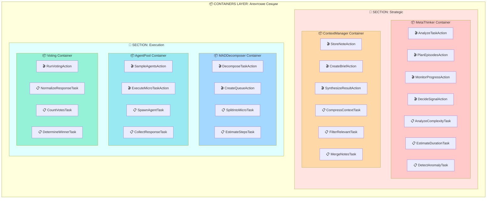

---

### 🧠 Strategic Layer (COMPASS)

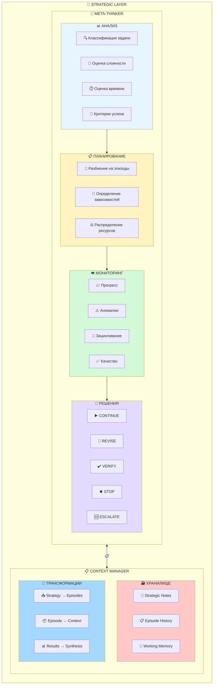

#### 🚨 Система сигналов Meta-Thinker

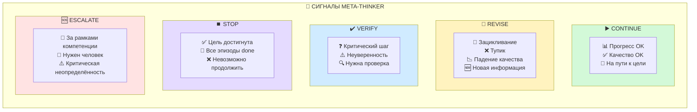

---

### ⚙️ Execution Layer (MAKER)

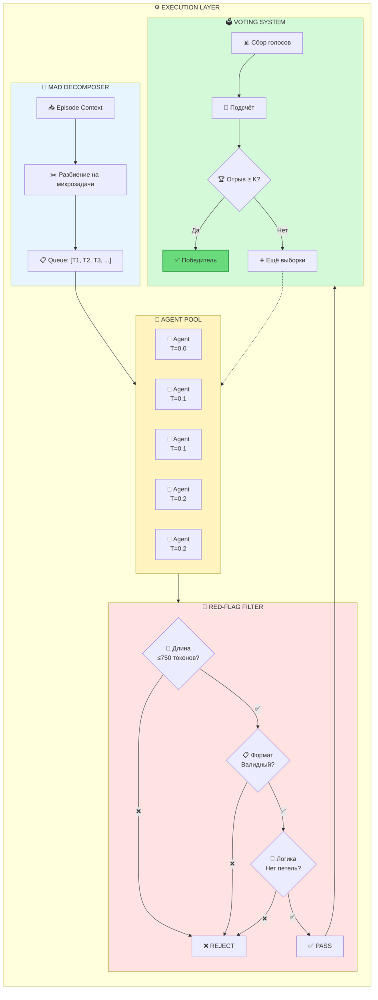

#### 🗳️ Детали голосования

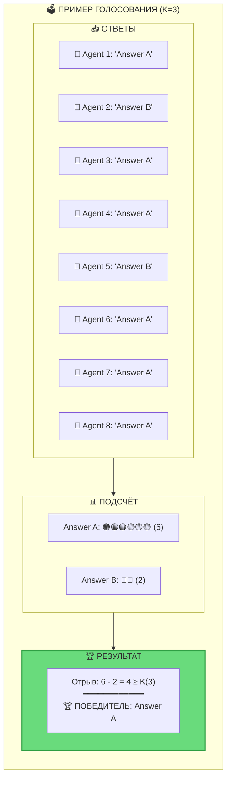

---

## 🔄 Потоки данных

### 📊 Полный цикл обработки запроса

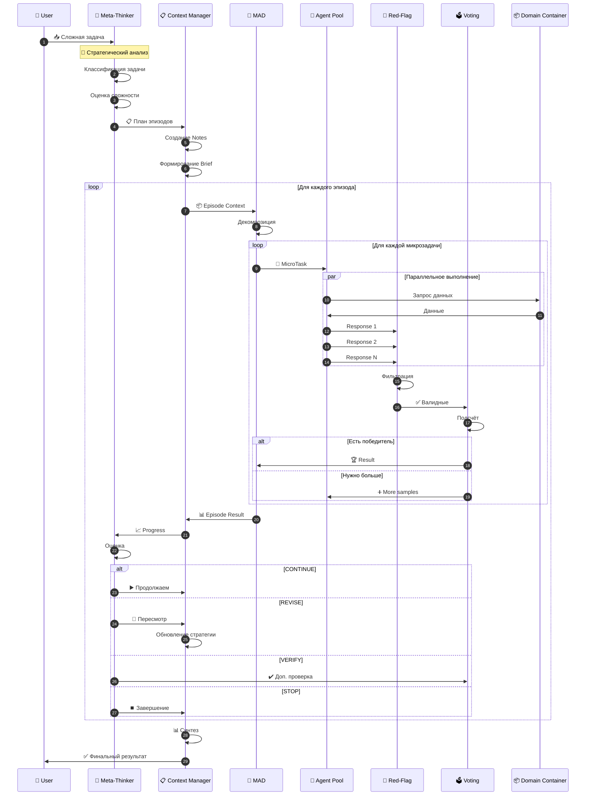

### 🔄 Диаграмма состояний задачи

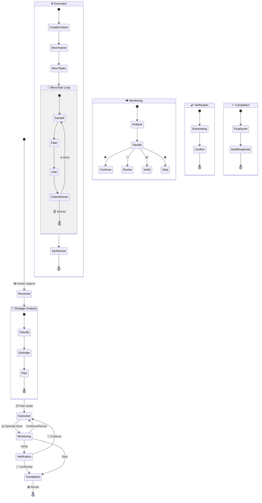

---

## 📦 Структура Sections и Containers

### 🗂️ Рекомендуемая структура проекта

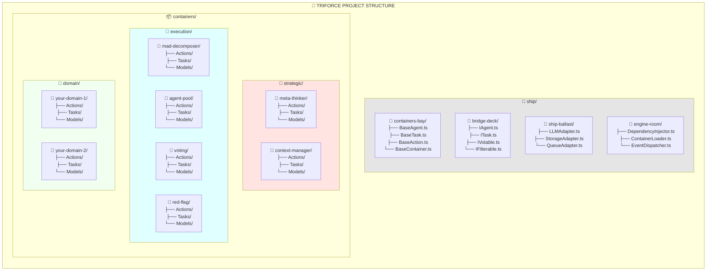

### 📋 Детальная структура контейнера

```
📦 meta-thinker/
│
├── 🎬 Actions/
│   ├── AnalyzeTaskAction.ts      # 🔍 Анализ входящей задачи
│   ├── PlanEpisodesAction.ts     # 📋 Планирование эпизодов
│   ├── MonitorProgressAction.ts  # 👁️ Мониторинг выполнения
│   └── DecideSignalAction.ts     # 🤔 Принятие решения о сигнале
│
├── 📋 Tasks/
│   ├── ClassifyTaskTask.ts       # 🏷️ Классификация типа задачи
│   ├── EstimateComplexityTask.ts # 📏 Оценка сложности
│   ├── EstimateDurationTask.ts   # ⏱️ Оценка времени
│   ├── DefineSuccessCriteriaTask.ts # 🎯 Критерии успеха
│   ├── SplitIntoEpisodesTask.ts  # ✂️ Разбиение на эпизоды
│   ├── DetectAnomalyTask.ts      # ⚠️ Обнаружение аномалий
│   ├── DetectLoopTask.ts         # 🔄 Обнаружение зацикливания
│   └── CalculateQualityTask.ts   # ✅ Расчёт качества
│
├── 📊 Models/
│   ├── TaskAnalysis.ts           # Модель анализа задачи
│   ├── Episode.ts                # Модель эпизода
│   ├── Progress.ts               # Модель прогресса
│   └── Signal.ts                 # Модель сигнала
│
├── 🔄 Transformers/
│   └── ProgressTransformer.ts    # Трансформер прогресса
│
├── 📜 Interfaces/
│   ├── IMetaThinker.ts           # Интерфейс Meta-Thinker
│   └── ISignalDecider.ts         # Интерфейс решателя
│
└── 📄 index.ts                    # Экспорт контейнера
```

---

## 🎭 Компоненты системы

### 🎬 Actions: Оркестраторы бизнес-логики

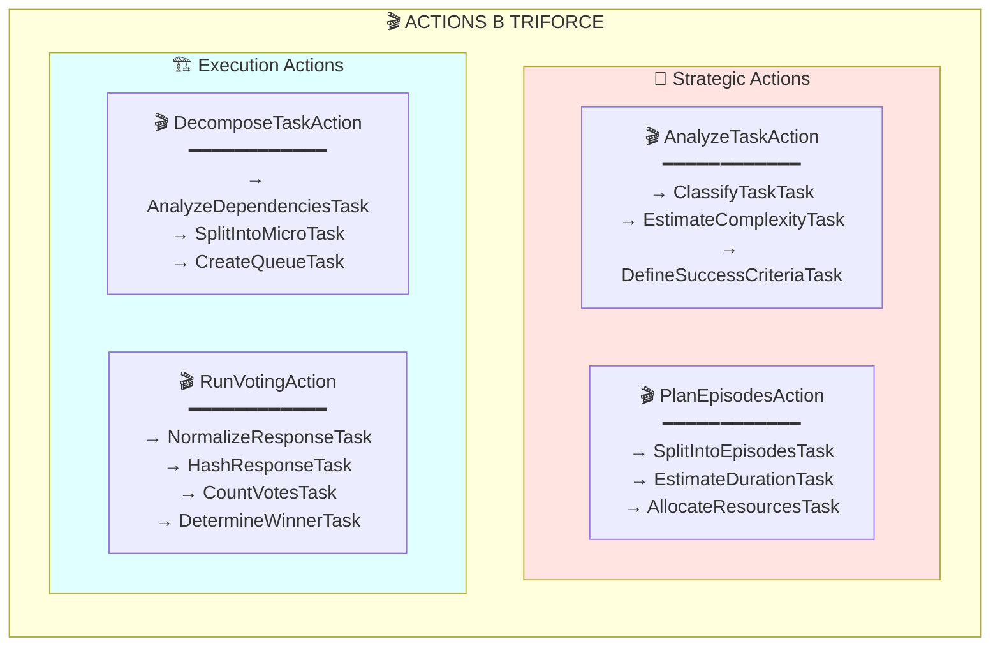

### 📋 Tasks: Атомарные единицы работы

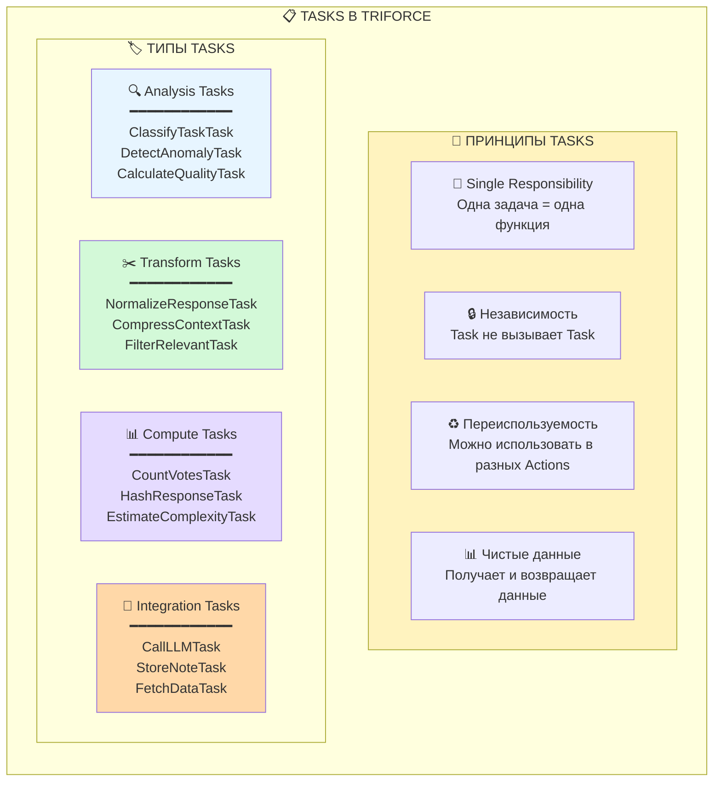

### 🔧 Псевдокод компонентов

```
┌──────────────────────────────────────────────────────────────────┐
│ 🎬 ACTION: RunVotingAction                                       │
├──────────────────────────────────────────────────────────────────┤
│                                                                  │
│ class RunVotingAction extends BaseAction {                       │
│                                                                  │
│   // 📋 Pipeline задач                                           │
│   run(responses: Response[]): VotingResult {                     │
│     return Pipeline.run([                                        │
│       NormalizeResponseTask,    // 🔄 Нормализация               │
│       HashResponseTask,         // #️⃣ Хэширование                │
│       CountVotesTask,           // 🔢 Подсчёт                    │
│       DetermineWinnerTask       // 🏆 Определение                │
│     ], responses);                                               │
│   }                                                              │
│ }                                                                │
│                                                                  │
└──────────────────────────────────────────────────────────────────┘

┌──────────────────────────────────────────────────────────────────┐
│ 📋 TASK: CountVotesTask                                          │
├──────────────────────────────────────────────────────────────────┤
│                                                                  │
│ class CountVotesTask extends BaseTask {                          │
│                                                                  │
│   // 🎯 Единственная ответственность: подсчёт голосов            │
│   run(hashedResponses: HashedResponse[]): VoteCount {            │
│     const counts = new Map<string, number>();                    │
│                                                                  │
│     for (const response of hashedResponses) {                    │
│       const current = counts.get(response.hash) || 0;            │
│       counts.set(response.hash, current + 1);                    │
│     }                                                            │
│                                                                  │
│     return { counts, total: hashedResponses.length };            │
│   }                                                              │
│ }                                                                │
│                                                                  │
└──────────────────────────────────────────────────────────────────┘
```

---

## 🔀 Взаимодействие компонентов

### 📊 Request Life Cycle в TRIFORCE

```mermaid
flowchart TB
    subgraph lifecycle["🔄 REQUEST LIFE CYCLE"]
        direction TB
        
        subgraph entry["📥 ENTRY POINT"]
            EP1["1️⃣ User sends Task"]
            EP2["2️⃣ Route → Controller"]
            EP3["3️⃣ Controller → Action"]
        end
        
        subgraph strategic["🧭 STRATEGIC PROCESSING"]
            SP1["4️⃣ AnalyzeTaskAction"]
            SP2["5️⃣ → ClassifyTaskTask"]
            SP3["6️⃣ → EstimateComplexityTask"]
            SP4["7️⃣ PlanEpisodesAction"]
            SP5["8️⃣ → SplitIntoEpisodesTask"]
        end
        
        subgraph execution["🏗️ EXECUTION PROCESSING"]
            EXP1["9️⃣ DecomposeTaskAction"]
            EXP2["🔟 → SplitIntoMicroTask"]
            EXP3["1️⃣1️⃣ SampleAgentsAction"]
            EXP4["1️⃣2️⃣ → SpawnAgentTask (×N)"]
            EXP5["1️⃣3️⃣ FilterResponsesAction"]
            EXP6["1️⃣4️⃣ → CheckLengthTask"]
            EXP7["1️⃣5️⃣ → CheckFormatTask"]
            EXP8["1️⃣6️⃣ RunVotingAction"]
            EXP9["1️⃣7️⃣ → CountVotesTask"]
        end
        
        subgraph synthesis["📊 SYNTHESIS"]
            SY1["1️⃣8️⃣ SynthesizeResultAction"]
            SY2["1️⃣9️⃣ → MergeNotesTask"]
            SY3["2️⃣0️⃣ Controller → Response"]
        end
        
        entry --> strategic --> execution --> synthesis
    end
    
    style entry fill:#f8f9fa
    style strategic fill:#FFE4E1
    style execution fill:#E0FFFF
    style synthesis fill:#F0FFF0
```

### 🔗 Inter-Container Communication

```mermaid
flowchart TB
    subgraph communication["🔗 INTER-CONTAINER COMMUNICATION"]
        direction TB
        
        subgraph same_section["📂 ВНУТРИ СЕКЦИИ"]
            direction LR
            SS1["📦 MetaThinker"]
            SS2["📦 ContextManager"]
            SS1 <-->|"Direct Call"| SS2
            
            SSN["✅ Прямые вызовы<br/>через Actions/Tasks"]
        end
        
        subgraph cross_section["📂 МЕЖДУ СЕКЦИЯМИ"]
            direction LR
            CS1["📂 Strategic"]
            CS2["📂 Execution"]
            CS1 <-->|"Events/Messages"| CS2
            
            CSN["📨 Event-driven<br/>Message Queue"]
        end
        
        subgraph external["🌐 ВНЕШНИЕ СИСТЕМЫ"]
            direction LR
            EX1["📦 Container"]
            EX2["🌐 External API"]
            EX1 <-->|"Adapters"| EX2
            
            EXN["🔌 Через Ship Ballast<br/>Adapters"]
        end
    end
    
    style same_section fill:#d3f9d8
    style cross_section fill:#fff3bf
    style external fill:#e7f5ff
```

---

## 🛡️ Система надёжности

### 🔒 Многоуровневая защита

```mermaid
flowchart TB
    subgraph protection["🛡️ МНОГОУРОВНЕВАЯ ЗАЩИТА TRIFORCE"]
        direction TB
        
        subgraph L1["🔵 УРОВЕНЬ 1: Архитектурный (PORTO)"]
            L1A["📦 Модульная изоляция"]
            L1B["🎯 Single Responsibility"]
            L1C["🔧 Чистые зависимости"]
        end
        
        subgraph L2["🟢 УРОВЕНЬ 2: Стратегический (COMPASS)"]
            L2A["🧠 Meta-Thinker мониторинг"]
            L2B["🔄 Обнаружение тупиков"]
            L2C["📋 Адаптация стратегии"]
        end
        
        subgraph L3["🟡 УРОВЕНЬ 3: Контекстный (COMPASS)"]
            L3A["📋 Context Manager"]
            L3B["🔍 Фильтрация информации"]
            L3C["📦 Оптимальные контексты"]
        end
        
        subgraph L4["🟠 УРОВЕНЬ 4: Декомпозиция (MAKER)"]
            L4A["🔨 MAD изоляция"]
            L4B["🤖 Независимые агенты"]
            L4C["📊 Минимальный контекст"]
        end
        
        subgraph L5["🔴 УРОВЕНЬ 5: Фильтрация (MAKER)"]
            L5A["🚩 Red-Flagging"]
            L5B["📏 Проверка длины"]
            L5C["📋 Проверка формата"]
        end
        
        subgraph L6["⚫ УРОВЕНЬ 6: Консенсус (MAKER)"]
            L6A["🗳️ Голосование K"]
            L6B["📊 Статистическая надёжность"]
            L6C["🏆 First-to-ahead-by-K"]
        end
        
        L1 --> L2 --> L3 --> L4 --> L5 --> L6
    end
    
    INPUT["📥 Задача"] --> L1
    L6 --> OUTPUT["✅ Надёжный<br/>результат"]
    
    style L1 fill:#d0ebff
    style L2 fill:#b2f2bb
    style L3 fill:#d3f9d8
    style L4 fill:#fff3bf
    style L5 fill:#ffd8a8
    style L6 fill:#ffc9c9
    style OUTPUT fill:#69db7c,stroke:#2f9e44,stroke-width:3px
```

### 📊 Метрики надёжности

```mermaid
flowchart TB
    subgraph metrics["📊 МЕТРИКИ НАДЁЖНОСТИ"]
        direction TB
        
        subgraph architecture_metrics["📦 АРХИТЕКТУРНЫЕ (PORTO)"]
            AM1["📊 Coupling Score"]
            AM2["📊 Cohesion Score"]
            AM3["📊 Test Coverage"]
            AM4["📊 Code Complexity"]
        end
        
        subgraph strategic_metrics["🧭 СТРАТЕГИЧЕСКИЕ (COMPASS)"]
            SM1["📊 Episode Success Rate"]
            SM2["📊 Revisions Count"]
            SM3["📊 Anomaly Detection Rate"]
            SM4["📊 Adaptation Efficiency"]
        end
        
        subgraph execution_metrics["🏗️ ВЫПОЛНЕНИЯ (MAKER)"]
            EM1["📊 Step Accuracy"]
            EM2["📊 Consensus Rate"]
            EM3["📊 Red-Flag Rate"]
            EM4["📊 Voting Convergence"]
        end
    end
    
    architecture_metrics --> DASHBOARD["📊 Unified Dashboard"]
    strategic_metrics --> DASHBOARD
    execution_metrics --> DASHBOARD
    
    style architecture_metrics fill:#F0FFF0
    style strategic_metrics fill:#FFE4E1
    style execution_metrics fill:#E0FFFF
    style DASHBOARD fill:#ffd43b
```

---

## 📈 Сценарии применения

### 🎯 Сценарий 1: Анализ данных

```mermaid
sequenceDiagram
    autonumber
    
    participant U as 👤 User
    participant C as 🎮 Controller
    participant MT as 🧠 MetaThinker
    participant CM as 📋 ContextMgr
    participant MAD as 🔨 MAD
    participant AP as 🤖 AgentPool
    participant V as 🗳️ Voting
    participant DA as 📦 DataAnalysis
    
    U->>C: "Проанализируй 100K записей"
    C->>MT: AnalyzeTaskAction.run()
    
    Note over MT: 🎯 Стратегический анализ
    MT->>MT: ClassifyTaskTask → "batch_processing"
    MT->>MT: EstimateComplexityTask → HIGH
    MT->>CM: PlanEpisodesAction.run()
    
    CM->>CM: SplitIntoEpisodesTask
    Note over CM: 📋 Эпизоды:<br/>1. Sample (1K)<br/>2. Full (100K)<br/>3. Synthesize
    
    loop Эпизод 1: Sampling
        CM->>MAD: DecomposeTaskAction
        MAD->>MAD: SplitIntoMicroTask (1000 tasks)
        
        par 1000 параллельных задач
            MAD->>AP: SampleAgentsAction
            AP->>DA: GetRecordTask
            DA->>AP: Record
            AP->>V: 3 responses per task
            V->>V: First-to-K voting
        end
        
        V->>CM: 1000 classifications
    end
    
    CM->>MT: 📈 Episode 1 complete
    MT->>MT: MonitorProgressAction
    MT->>CM: ▶️ CONTINUE
    
    Note over CM,V: ... Эпизоды 2-3 ...
    
    CM->>C: SynthesizeResultAction
    C->>U: ✅ Отчёт с паттернами
```

### 🎯 Сценарий 2: Код-рефакторинг

```mermaid
sequenceDiagram
    autonumber
    
    participant U as 👤 User
    participant MT as 🧠 MetaThinker
    participant CM as 📋 ContextMgr
    participant MAD as 🔨 MAD
    participant V as 🗳️ Voting
    participant CODE as 📦 CodeAnalysis
    
    U->>MT: "Отрефактори модуль Auth"
    
    MT->>MT: AnalyzeTaskAction
    Note over MT: Тип: refactoring<br/>Режим: FULL (K=3)
    
    MT->>CM: 📋 План эпизодов
    
    rect rgb(230, 245, 255)
        Note over CM,CODE: 🔍 Эпизод 1: Анализ
        CM->>MAD: Контекст
        MAD->>CODE: AnalyzeDependenciesTask
        CODE->>MAD: Dependency Graph
        MAD->>CM: 📊 Результат
    end
    
    CM->>MT: Обнаружена циклическая зависимость!
    MT->>MT: DecideSignalAction
    MT->>CM: 🔄 REVISE
    
    rect rgb(255, 227, 227)
        Note over CM,V: 🔧 Эпизод 1.5: Исправление цикла
        CM->>MAD: Обновлённый план
        MAD->>V: [🤖×5] K=3
        V->>CM: ✅ Исправление
    end
    
    CM->>MT: Цикл устранён
    MT->>CM: ▶️ CONTINUE
    
    rect rgb(211, 249, 216)
        Note over CM,V: ✂️ Эпизод 2: Рефакторинг
        loop Для каждого файла
            MAD->>V: [🤖×3] K=3
            V->>CM: Результат
        end
    end
    
    MT->>MT: ✔️ VERIFY
    V->>V: Доп. голосование K=5
    
    CM->>U: ✅ Отрефакторенный модуль
```

---

## ⚙️ Техническая реализация

### 🏗️ Диаграмма классов

```mermaid
classDiagram
    class TriforceEngine {
        -MetaThinkerContainer metaThinker
        -ContextManagerContainer contextManager
        -MADDecomposerContainer madDecomposer
        -AgentPoolContainer agentPool
        -VotingContainer voting
        -RedFlagContainer redFlag
        +run(task: Task) Result
        +configure(config: TriforceConfig)
    }
    
    class BaseContainer {
        <<abstract>>
        #config: ContainerConfig
        #dependencies: Map
        +getAction(name: string) BaseAction
        +getTask(name: string) BaseTask
    }
    
    class BaseAction {
        <<abstract>>
        #tasks: BaseTask[]
        +run(input: any) any
        #pipeline(tasks: BaseTask[], data: any) any
    }
    
    class BaseTask {
        <<abstract>>
        +run(input: any) any
        +validate(input: any) ValidationResult
    }
    
    class MetaThinkerContainer {
        +analyzeTask: AnalyzeTaskAction
        +planEpisodes: PlanEpisodesAction
        +monitorProgress: MonitorProgressAction
        +decideSignal: DecideSignalAction
    }
    
    class ContextManagerContainer {
        +storeNote: StoreNoteAction
        +createBrief: CreateBriefAction
        +synthesize: SynthesizeResultAction
        -notes: NotesStorage
        -briefs: BriefsStorage
    }
    
    class MADDecomposerContainer {
        +decompose: DecomposeTaskAction
        +createQueue: CreateQueueAction
        -queue: MicroTaskQueue
    }
    
    class AgentPoolContainer {
        +sample: SampleAgentsAction
        +execute: ExecuteMicroTaskAction
        -agents: MicroAgent[]
        -poolSize: int
    }
    
    class VotingContainer {
        +runVoting: RunVotingAction
        -kThreshold: int
        -maxSamples: int
    }
    
    TriforceEngine --> MetaThinkerContainer
    TriforceEngine --> ContextManagerContainer
    TriforceEngine --> MADDecomposerContainer
    TriforceEngine --> AgentPoolContainer
    TriforceEngine --> VotingContainer
    
    MetaThinkerContainer --|> BaseContainer
    ContextManagerContainer --|> BaseContainer
    MADDecomposerContainer --|> BaseContainer
    AgentPoolContainer --|> BaseContainer
    VotingContainer --|> BaseContainer
    
    BaseContainer --> BaseAction
    BaseContainer --> BaseTask
```

### ⚙️ Конфигурация

```mermaid
flowchart TB
    subgraph config["⚙️ TRIFORCE CONFIGURATION"]
        direction TB
        
        subgraph global["🌐 GLOBAL"]
            G1["mode: 'FULL'"]
            G2["llm_model: 'gpt-4.1-mini'"]
            G3["max_tokens: 1_000_000"]
        end
        
        subgraph compass_cfg["🧭 COMPASS CONFIG"]
            C1["monitor_interval: 10"]
            C2["anomaly_threshold: 0.3"]
            C3["max_revisions: 5"]
            C4["notes_max: 100"]
            C5["brief_tokens: 500"]
        end
        
        subgraph maker_cfg["🏗️ MAKER CONFIG"]
            M1["voting_k: 3"]
            M2["max_samples: 20"]
            M3["temperatures: [0, 0.1, 0.2]"]
            M4["red_flag_max_length: 750"]
        end
        
        subgraph porto_cfg["⚓ PORTO CONFIG"]
            P1["auto_inject: true"]
            P2["container_loader: 'eager'"]
            P3["event_async: true"]
        end
    end
    
    style global fill:#f8f9fa
    style compass_cfg fill:#FFE4E1
    style maker_cfg fill:#E0FFFF
    style porto_cfg fill:#F0FFF0
```

### 🎭 Режимы работы

| Режим | K | Max Samples | Red-Flag | Мониторинг | Применение |
|-------|---|-------------|----------|------------|------------|
| 🚀 **LITE** | 1 | 3 | ❌ | Минимальный | Простые задачи |
| ⚡ **STANDARD** | 2 | 10 | Базовый | Стандартный | Типовые задачи |
| 🛡️ **FULL** | 3 | 20 | Полный | Детальный | Важные задачи |
| 🔒 **PARANOID** | 5 | 50 | Строгий | Полный | Критичные системы |

---

## 🎓 Заключение

### ✅ Преимущества TRIFORCE

```mermaid
mindmap
    root((🔱 TRIFORCE<br/>Преимущества))
        🧭 От COMPASS
            Стратегическое мышление
            Адаптивность
            Управление контекстом
            Мониторинг прогресса
        🏗️ От MAKER
            Надёжность выполнения
            Масштабируемость
            Статистическая защита
            Параллелизация
        ⚓ От PORTO
            Модульность
            Maintainability
            Переиспользуемость
            Clean Architecture
        🌟 Синергия
            Полная система
            Best of all worlds
            Production-ready
            Enterprise-grade
```

### 🎯 Когда использовать TRIFORCE

| Сценарий | Рекомендация |
|----------|--------------|
| 📝 Простые задачи (<50 шагов) | ❌ Overkill |
| 📊 Средние задачи (50-500 шагов) | ⚡ STANDARD mode |
| 🔢 Длинные задачи (500-10K шагов) | 🛡️ FULL mode |
| 🏢 Enterprise системы | 🔒 PARANOID mode |
| 🎨 Творческие задачи | ❌ Не подходит |
| 📈 Масштабируемые агенты | ✅ Идеально |
| 🔧 Поддерживаемый код | ✅ Идеально |

### 🚀 Следующие шаги

```mermaid
flowchart LR
    subgraph roadmap["🗺️ ROADMAP"]
        direction TB
        
        R1["📚 v1.0<br/>━━━━━━━━<br/>Базовая реализация<br/>Документация"]
        R2["🔧 v1.1<br/>━━━━━━━━<br/>CLI инструменты<br/>Генераторы"]
        R3["📦 v2.0<br/>━━━━━━━━<br/>Плагины<br/>Расширения"]
        R4["🌐 v3.0<br/>━━━━━━━━<br/>Распределённое выполнение<br/>Multi-model"]
        
        R1 --> R2 --> R3 --> R4
    end
    
    style R1 fill:#d3f9d8
    style R2 fill:#fff3bf
    style R3 fill:#d0ebff
    style R4 fill:#e5dbff
```

---

## 📚 Глоссарий

| Термин | Описание |
|--------|----------|
| 🔱 **TRIFORCE** | Объединённая архитектура COMPASS + MAKER + PORTO |
| 🧭 **COMPASS** | Context-Organized Multi-Agent Planning And Strategy System |
| 🏗️ **MAKER** | Maximal Agentic decomposition, first-to-ahead-by-K Error correction, Red-flagging |
| ⚓ **PORTO** | Software Architectural Pattern для масштабируемых приложений |
| 🧠 **Meta-Thinker** | Стратегический компонент планирования и мониторинга |
| 📋 **Context Manager** | Компонент управления контекстом и памятью |
| 🔨 **MAD** | Maximal Agentic Decomposition — декомпозиция на микрозадачи |
| 🗳️ **First-to-K** | Правило голосования: побеждает набравший K+ отрыв |
| 🚩 **Red-Flag** | Фильтрация подозрительных ответов |
| 📦 **Container** | Модульная единица в PORTO |
| 🎬 **Action** | Оркестратор бизнес-логики |
| 📋 **Task** | Атомарная единица работы |
| 🚢 **Ship Layer** | Инфраструктурный слой PORTO |

---

## 📖 Ссылки

- 📄 [COMPASS Paper](https://arxiv.org/) — Оригинальная статья COMPASS
- 📄 [MAKER Paper (arXiv:2511.09030)](https://arxiv.org/abs/2511.09030) — Оригинальная статья MAKER
- 📘 [Porto Documentation](https://mahmoudz.github.io/Porto/) — Официальная документация Porto
- 🎥 [MAKER Визуализация](https://www.youtube.com/watch?v=gLkehsQy4H4) — Видео объяснение

---

<div align="center">

### 🔱 TRIFORCE: Думай × Выполняй × Организуй 🔱

**🧭 Стратегия COMPASS | 🏗️ Надёжность MAKER | ⚓ Модульность PORTO**

---

*Объединённая архитектура для создания надёжных, масштабируемых и поддерживаемых LLM-агентов*

</div>

