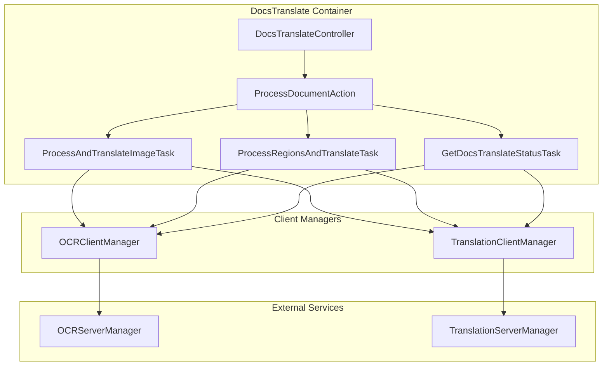
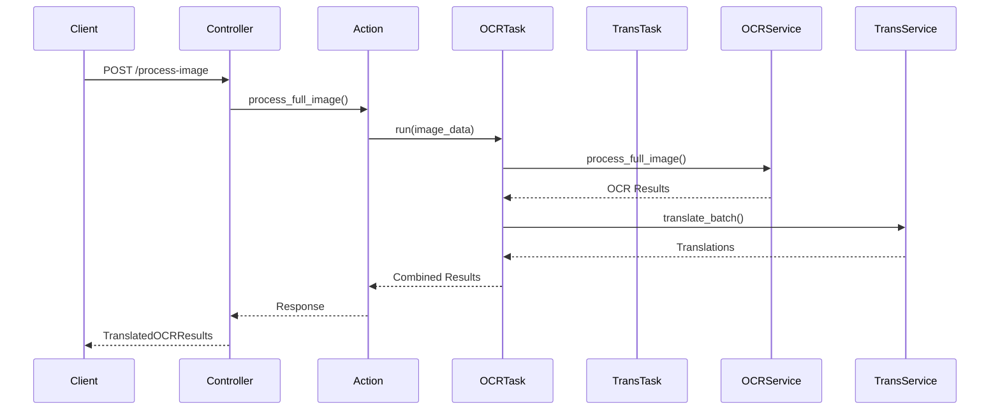

# 📄 DocsTranslate Container

Контейнер для комбинированных операций **OCR + Translation**.

Объединяет функциональность распознавания текста и перевода документов в единый сервис.

## 🎯 Назначение

DocsTranslate предоставляет высокоуровневый API для:

- **Полной обработки изображений**: OCR + перевод всего найденного текста
- **Обработки конкретных областей**: OCR + перевод в заданных полигонах
- **Мониторинга статуса**: проверка доступности OCR и Translation сервисов

## 🏗️ Архитектура



## 🔄 Workflow

### Полная обработка изображения



## 📊 Компоненты

### Actions
- **ProcessDocumentAction** - главный оркестратор операций

### Tasks
- **ProcessAndTranslateImageTask** - обработка полного изображения
- **ProcessRegionsAndTranslateTask** - обработка конкретных областей
- **GetDocsTranslateStatusTask** - получение статуса сервиса

### Managers
- **OCRClientManager** - доступ к OCR функциональности
- **TranslationClientManager** - доступ к Translation функциональности

### Controllers
- **DocsTranslateController** - REST API endpoints

## 🌐 API Endpoints

### `POST /api/v1/docs-translate/process-image`
Обработка полного изображения с OCR и переводом.

**Request:**
```json
{
  "from_language": "zh",
  "to_language": "ru", 
  "translate_empty_results": false,
  "min_confidence_threshold": 0.1
}
```

**Response:**
```json
{
  "results": [
    {
      "original_text": "你好世界",
      "translated_text": "Привет мир",
      "confidence": 0.95,
      "coordinates": [[10, 10], [100, 10], [100, 50], [10, 50]],
      "from_language": "zh",
      "to_language": "ru"
    }
  ],
  "total_regions": 1,
  "translated_regions": 1,
  "processing_time": 2.5
}
```

### `POST /api/v1/docs-translate/process-regions`
Обработка конкретных областей изображения.

**Request:**
```json
{
  "regions": [
    {
      "points": [[10, 10], [100, 10], [100, 50], [10, 50]],
      "region_id": "header"
    }
  ],
  "from_language": "zh",
  "to_language": "ru"
}
```

### `GET /api/v1/docs-translate/status`
Получение статуса сервиса.

**Response:**
```json
{
  "ocr_available": true,
  "translation_available": true,
  "service_ready": true,
  "supported_ocr_formats": ["jpg", "png", "tiff"],
  "supported_language_pairs": ["zh->ru", "en->ru"]
}
```

## 🔧 Настройка и использование

### 1. Dependency Injection

Контейнер регистрируется через `DocsTranslateProvider`:

```python
from src.Containers.AppSection.DocsTranslate.Providers import DocsTranslateProvider

# Добавить в DI контейнер
container.add_provider(DocsTranslateProvider())
```

### 2. Использование в коде

```python
from src.Containers.AppSection.DocsTranslate import (
    ProcessDocumentAction,
    ProcessAndTranslateImageRequest
)

# Обработка изображения
action = ProcessDocumentAction(...)
request = ProcessAndTranslateImageRequest(
    from_language=SupportedLanguage.CHINESE,
    to_language=SupportedLanguage.RUSSIAN
)

result = await action.process_full_image(image_bytes, request)
```

## 🔀 Эволюция к микросервисам

Контейнер спроектирован для лёгкого перехода к микросервисной архитектуре:

### Текущая монолитная архитектура:
```python
# Прямое использование ServerManager'ов
OCRClientManager(ocr_server_manager)
TranslationClientManager(translation_server_manager)
```

### Будущая микросервисная архитектура:
```python
# HTTP клиенты к внешним сервисам
OCRClientManager(endpoint="http://ocr-service")
TranslationClientManager(endpoint="http://translation-service")
```

## 🚀 Преимущества

### Для разработчиков
- **Единый API** для OCR + Translation операций
- **Типобезопасность** через Pydantic схемы
- **Асинхронность** для высокой производительности
- **Логирование** всех операций через Logfire

### Для архитектуры
- **Слабая связанность** через Client Managers
- **Переиспользование** существующих OCR и Translation контейнеров
- **Масштабируемость** через Porto паттерны
- **Готовность к микросервисам** без изменения API

### Для бизнеса
- **Быстрая разработка** документооборота
- **Качественный перевод** с контролем уверенности
- **Гибкость обработки** (полное изображение или области)
- **Мониторинг** доступности сервисов

## 📋 Зависимости

- **OCR Container** - для распознавания текста
- **Translation Container** - для перевода текстов
- **Ship Layer** - базовые классы и утилиты
- **Litestar** - веб-фреймворк
- **Dishka** - dependency injection
- **Pydantic** - валидация данных
- **Logfire** - логирование

---

**DocsTranslate** - мощное решение для обработки документов с поддержкой OCR и перевода! 🚀


