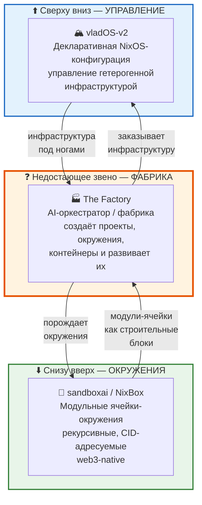
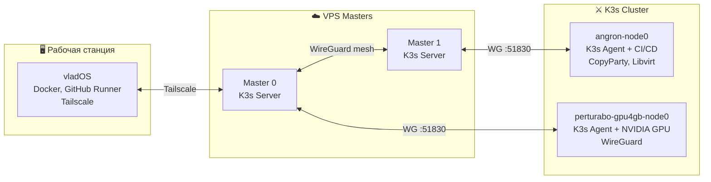
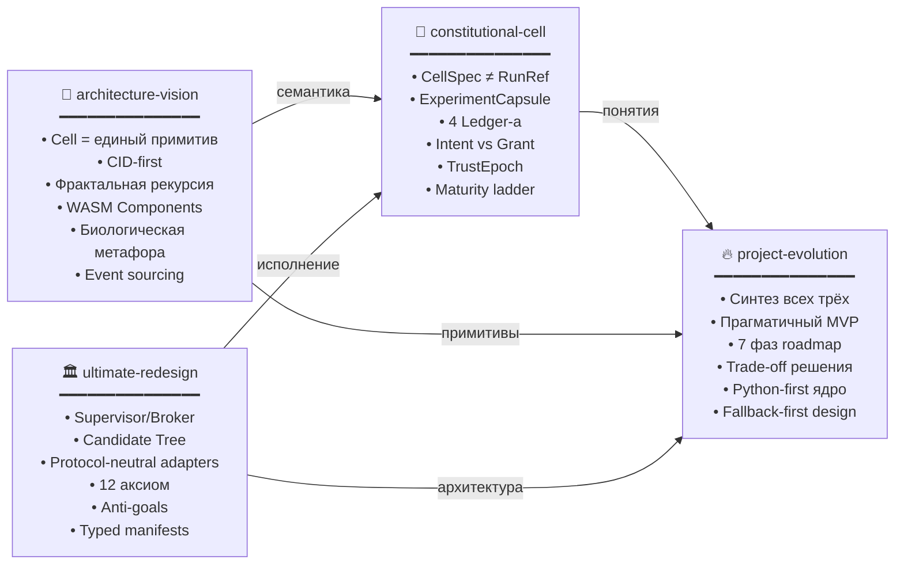
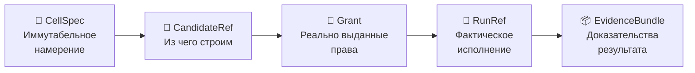
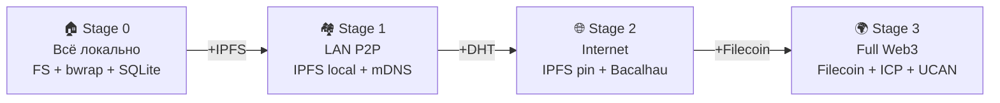
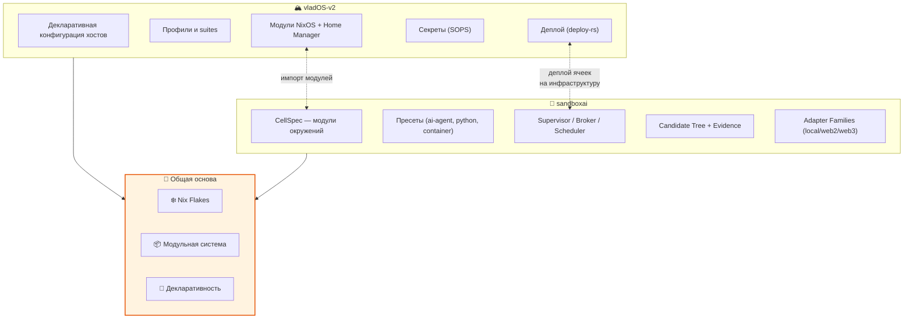
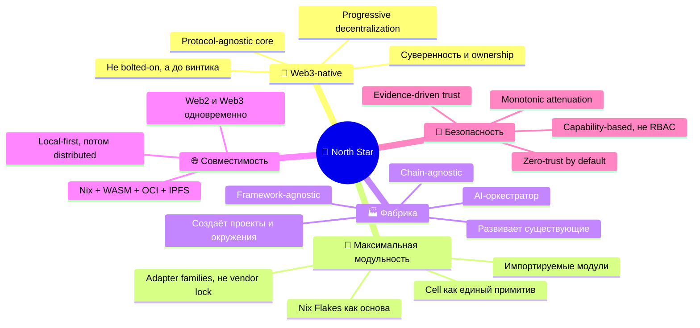
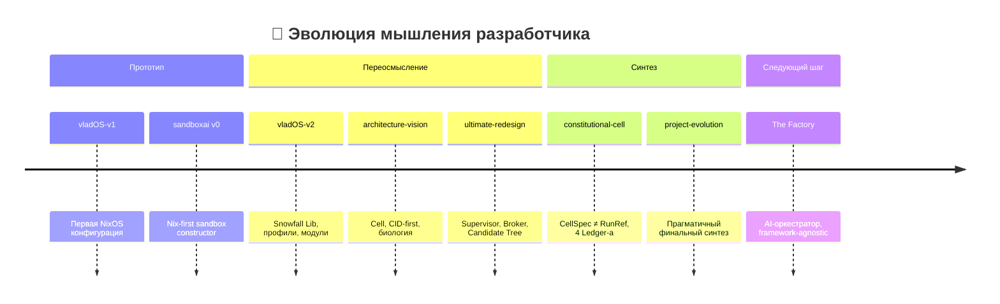

# 🧠🔭 Мета-анализ: vladOS + sandboxai + The Factory

> Заметка-исследование. Цель: зафиксировать **мета-мысль** разработчика, **north star** проекта и **вектор движения** всей экосистемы.
>
> 📅 Дата среза: 2026-03-08

---

## 🗺️ Три кита экосистемы



---

## 🏔️ vladOS-v2: «Суверенный остров»

### 📌 Что это

**Ультимативное модульное конфигурационное управление гетерогенной инфраструктурой на декларативных принципах.**

### 🧬 Суть

| Аспект | Реализация |
|--------|-----------|
| Базовая технология | ❄️ NixOS + Snowfall Lib |
| Принцип конфигурации | 🎭 Профили с наследованием (minimal → developer → senior) |
| Логические группы | 📚 Suites (common, desktop, development, devops, server) |
| Управление хостами | 🖥️ Декларативные конфигурации машин |
| Секреты | 🔐 SOPS-nix |
| Визуализация | 🗺️ nix-topology (автогенерация диаграмм инфраструктуры) |
| Автозагрузка | 🔄 «Создай файл — он появится в системе» |

### 🏗️ Инфраструктура



### 💡 Мета-мысль vladOS

> **vladOS = суверенный остров**. Это инфраструктура, полностью описанная в коде, воспроизводимая, модульная. Нет ручного конфигурирования. Всё — декларация. Новая машина — новый файл.

### 🧩 Связь с Nix Flakes

vladOS-v2 построен **на flakes**, что принципиально важно: sandboxai тоже основан на flakes. Это значит, что **модули sandboxai теоретически можно прямо импортировать во vladOS** и наоборот. Разработчик это прямо озвучивает:

> *«Чтоб во владосе можно было спокойно для любых задач и целей импортировать и использовать эти модули»*

---

## 🧬 sandboxai / NixBox: «Живые клетки снизу»

### 📌 Что это

Модульно-окруженческая система: **ячейки (Cell)**, которые можно вкладывать друг в друга, порождать дочерние, наделять правами, тестировать, продвигать и развивать.

### 🧬 Эволюция проектирования

Проект прошёл **4 итерации дизайна**, каждая из которых добавляла новое измерение:



### 🔑 Ключевые сущности финальной архитектуры



### 🧫 Пять законов системы

| # | Закон | Суть |
|---|-------|------|
| 1️⃣ | 🧬 Единый примитив | Всё описывается через `CellSpec`. Job, service, agent, dev — kind-ы одного примитива |
| 2️⃣ | 🌲 Кандидатное изменение | Мутация идёт через `CandidateRef`, а не «чинит production на месте» |
| 3️⃣ | 🔐 Брокерная привилегия | Worker инициирует → Supervisor решает → Broker исполняет |
| 4️⃣ | 📉 Монотонное сужение | Capabilities, budgets и autonomy только уменьшаются вглубь дерева |
| 5️⃣ | ✅ Доказательное продвижение | Promotion только через проверяемый `EvidenceBundle` |

### 🌐 Progressive Decentralization



### 💡 Мета-мысль sandboxai

> **sandboxai = «живая клетка» снизу**. Это не просто контейнер и не просто sandbox. Это **CID-адресуемая, рекурсивная, self-improving единица вычисления**, которая умеет:
> - порождать дочерние окружения
> - ограничивать их права
> - собирать доказательства работы
> - продвигать успешные мутации
> - работать и в web2, и в web3 через adapter families

---

## 🧩 Как vladOS и sandboxai связаны



**vladOS управляет СВЕРХУ** (какие машины, какие сервисы, какие пользователи).
**sandboxai управляет СНИЗУ** (какие окружения, какие capabilities, какие вычисления).

> *«Не переизобретаю ли я flakes?»* — спрашивает разработчик. Ответ: **нет, это развитие и специализация flakes**. Flakes дают reproducibility и composition, но не дают supervisor-контроль, capability attenuation, evidence-driven promotion, web3 adapters и self-improving loops.

---

## 🌟 North Star разработчика



### 📝 North Star в одном абзаце

> Построить **максимально модульный каркас для web3**, где нет vendor lock ни на уровне AI-фреймворков, ни на уровне crypto-цепочек, ни на уровне инфраструктуры. Система из трёх слоёв: **vladOS** (инфраструктура сверху) + **sandboxai** (модули-ячейки снизу) + **The Factory** (AI-фабрика посередине, которая порождает, развивает и оркестрирует всё остальное). Каждый слой — модульный, декларативный, CID-адресуемый, protocol-neutral и способен работать от local-only до full web3.

---

## 🔄 Вектор движения



### 🧭 Логика движения

1. **Сначала сделал прототип** — убедился, что Nix-based sandbox работает
2. **Потом перепроектировал** — три итерации дизайна, каждая добавляла новое измерение
3. **Теперь хочет фабрику** — недостающее звено, которое будет **порождать** окружения и проекты, а не просто описывать их

---

## 🧩 Что уже есть vs что нужно

| Компонент | Есть? | Зрелость | Где живёт |
|-----------|-------|----------|-----------|
| 🏔️ Инфраструктурный каркас | ✅ | 🟢 Production-ready | `vladOS-v2/` |
| 🧬 Модульно-окруженческий каркас | ✅ | 🟡 Проектирование завершено, реализация начата | `sandboxai/` |
| 🏭 AI-фабрика | ❌ | 🔴 Концепция | Пока только в голове |
| 🔗 Мост vladOS ↔ sandboxai | 🟡 | 🟡 Flakes-compatible, но не интегрированы | — |
| 🌐 Web3 adapters | 🟡 | 🟡 Спроектированы, не реализованы | `sandboxai/docs/` |

---

## ❤️ Главный вывод

**Разработчик строит не один проект, а экосистему:**

```text
vladOS   = серверная инфраструктура (управление сверху)
sandboxai = модульные окружения    (строительные блоки снизу)
Factory  = AI-оркестратор          (фабрика посередине)
```

Все три слоя должны быть:
- 🧩 **модульными** (composition > inheritance)
- 🔌 **protocol-agnostic** (никакого vendor lock)
- 🌐 **web3-совместимыми** (но с fallback на web2)
- 🔐 **capability-based** (безопасность через ограничение прав)
- 📦 **CID-адресуемыми** (контент-адресация как фундамент)
- ♻️ **self-improving** (system improves itself через evidence)

**Недостающее звено — The Factory** — это следующая заметка.
