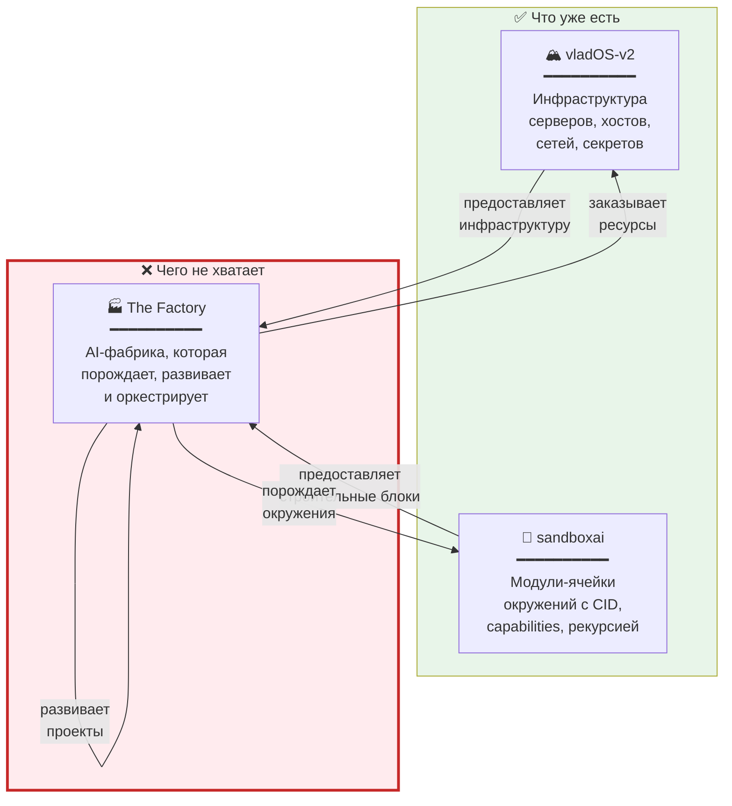
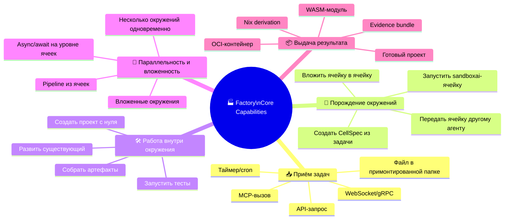
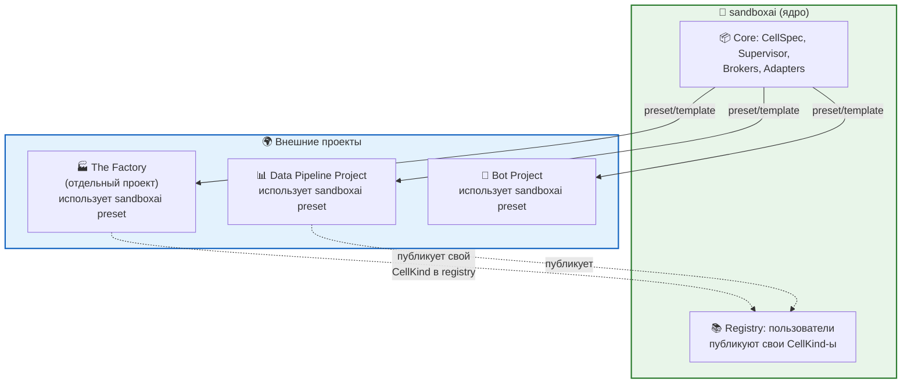
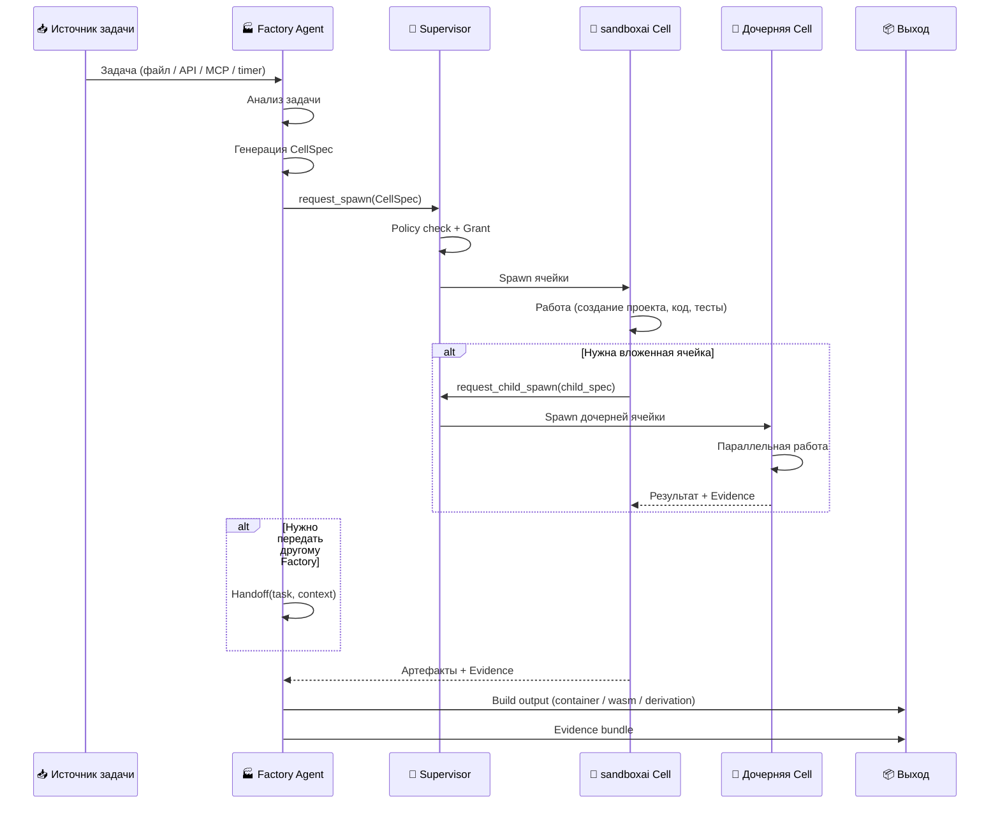
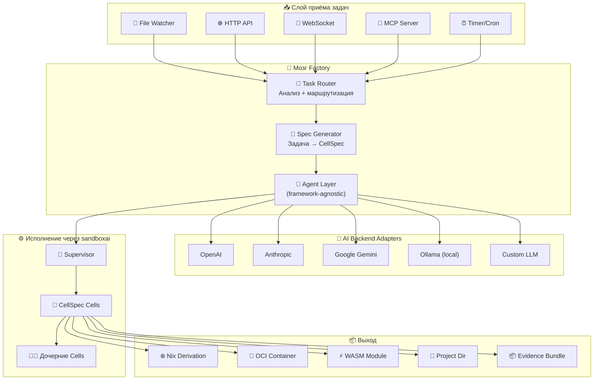
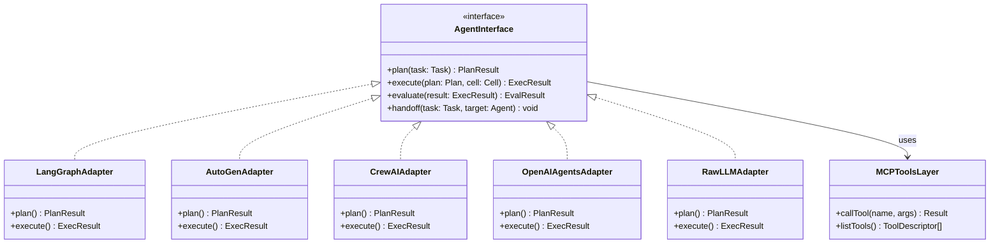
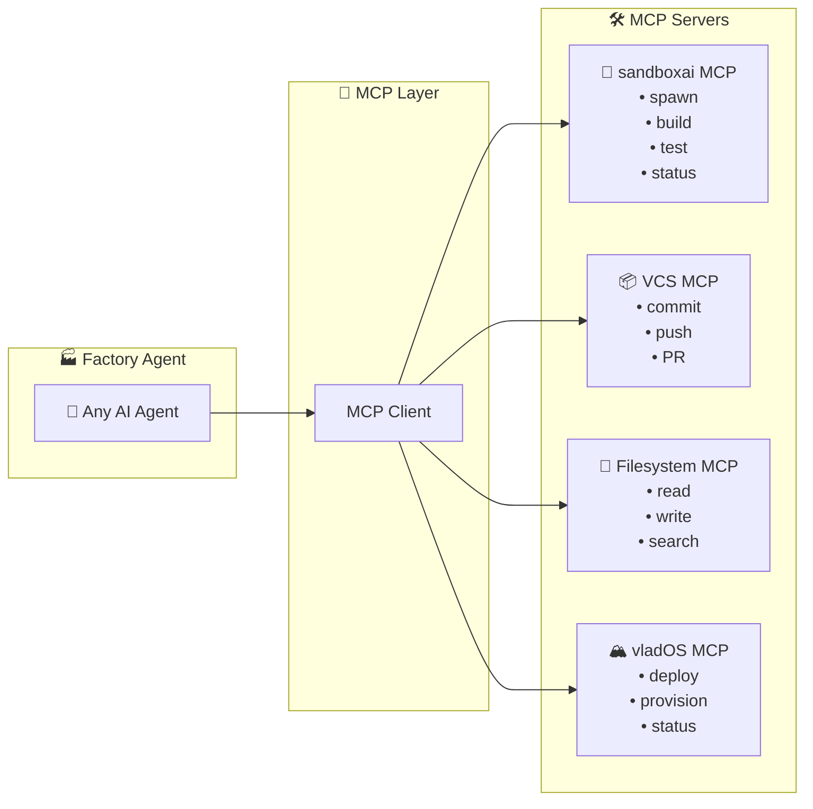
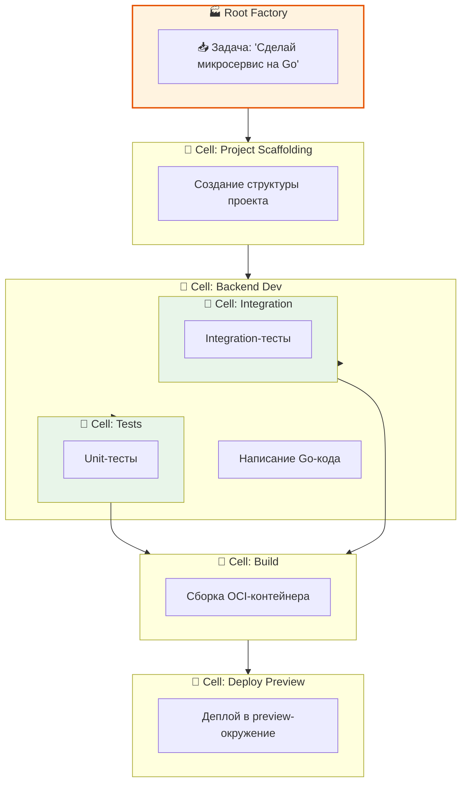
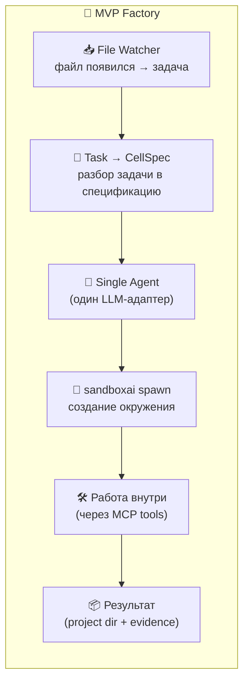
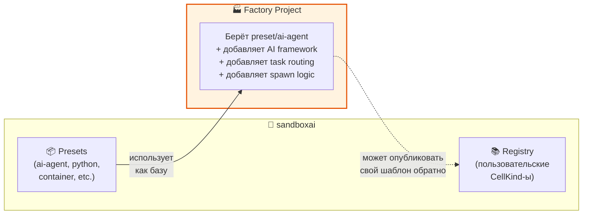

# 🏭🧬🔥 The Factory — Недостающее звено

> Заметка-диагностика. Зачем нужна фабрика, как она вписывается в экосистему vladOS + sandboxai, и какие требования к ней предъявляются.
>
> 📅 Дата среза: 2026-03-08

---

## 🩺 Диагноз: чего не хватает



### 🔍 Проблема в одном абзаце

vladOS умеет **управлять инфраструктурой**, sandboxai умеет **описывать и запускать окружения**. Но никто не умеет **автономно принимать задачу, создавать для неё новое окружение, работать внутри него, порождать дочерние, и в результате выдавать готовый проект или улучшение**. Это работа **фабрики**.

---

## 🎯 Что должна уметь The Factory

### 📋 Функциональные требования



### 🏗️ Нефункциональные требования

| Требование | Почему важно | Приоритет |
|-----------|-------------|-----------|
| 🔌 **Framework-agnostic** | Не быть заложником одного AI-фреймворка | 🔴 Критично |
| ⛓️ **Chain-agnostic** | Не быть заложником одной crypto-цепочки | 🔴 Критично |
| 🧩 **Модульность** | Каждый компонент заменяем | 🔴 Критично |
| 🌐 **Web3-compatible** | Работать и в web2, и в web3 | 🟡 Важно |
| 📦 **Multi-output** | Билдить как окружение, контейнер, и WASM | 🟡 Важно |
| 🔐 **Capability-based security** | Ячейки-агенты ограничены правами | 🟡 Важно |
| 📉 **Monotonic attenuation** | Вложенные агенты не получают больше прав | 🟡 Важно |
| 🧪 **Evidence-driven** | Результат доказуем | 🟢 Желательно |

---

## 🧬 Как Factory вписывается в экосистему

### ⚠️ Важное уточнение: Factory ≠ вшитый CellKind

**Factory — это внешний проект**, который просто **использует sandboxai как шаблон/модуль** и крутит внутри себя AI-фреймворк. Factory **не** вшивается в ядро sandboxai как специальный CellKind.

Пользователи sandboxai сами создают свои CellKind-ы и публикуют их в registry, чтобы другие могли использовать. Factory — это один из таких пользовательских проектов, просто более специализированный.



### 📋 Factory как пользователь sandboxai

```yaml
# Factory просто берёт sandboxai preset и добавляет своё
base: preset/ai-agent  # стандартный sandboxai шаблон

runtime:
  backend: bubblewrap
  resources: { cpu: 8, memory: 16Gi, disk: 50Gi }

packages: [python@3.12, poetry, git, ripgrep]

capabilities:
  requested:
    - child:request-spawn
    - fs:read:/workspace/**
    - fs:write:/workspace/**
    - net:out:443
    - proc:spawn
```

Factory живёт **снаружи** sandboxai, как любой другой проект.

---

## 🔄 Жизненный цикл задачи в Factory



---

## 🧩 Архитектура Factory



---

## 🔌 Framework-Agnostic Agent Layer

Ключевая архитектурная идея: **Factory не зависит от конкретного AI-фреймворка**. Вместо этого у неё есть **абстрактный Agent Layer** с адаптерами:



### 🧠 Почему именно так

| Проблема | Решение |
|---------|---------|
| Vendor lock на один AI-фреймворк | Абстрактный `AgentInterface` + адаптеры |
| Vendor lock на одного LLM-провайдера | Адаптеры для каждого провайдера |
| Быстрое старение фреймворков | Фреймворк = адаптер, его можно заменить |
| Разные задачи — разные фреймворки | Router выбирает лучший адаптер по задаче |
| Tools lock-in | MCP как стандарт tool integration |

---

## 🔗 MCP как универсальный tool layer

**MCP (Model Context Protocol)** — идеальный стандарт для framework-agnostic tool integration:



> 💡 **Главное:** любой AI-агент (LangGraph, AutoGen, CrewAI, raw LLM) может использовать одни и те же MCP-серверы. Фабрика не привязана к конкретному фреймворку, потому что **tools живут в MCP**, а не внутри фреймворка.

---

## 🧬 Вложенность и параллельность



### 🔑 Ключевые свойства

- 🪆 **Вложенность**: Factory порождает Cell, Cell порождает дочерние Cell
- ⚡ **Параллельность**: F2_1 и F2_2 работают параллельно
- 🔐 **Attenuation**: каждый уровень вложенности получает меньше прав
- 📦 **Изоляция**: каждая Cell в своём sandbox (bubblewrap/OCI/WASM)
- 🔄 **Handoff**: Factory может передать задачу другому Factory

---

## 🎯 Минимальный MVP Factory

Что нужно для первого рабочего прототипа:



### ❌ Что НЕ в MVP

- Multi-framework routing
- Web3 adapters
- WASM output
- Distributed execution
- GUI/Dashboard

### ✅ Что в MVP

| Компонент | Реализация |
|-----------|-----------|
| Приём задачи | File watcher (inotify) |
| AI Agent | Один адаптер (OpenAI или Anthropic) |
| Tool layer | MCP (sandboxai MCP + filesystem MCP) |
| Окружение | sandboxai Cell (bubblewrap) |
| Результат | Project directory + JSON evidence |

---

## 🧩 Связь с sandboxai

Factory — это **внешний проект**, который использует sandboxai как базу:



> Factory — это **пользователь sandboxai**, который берёт preset, оборачивает AI-фреймворком и получает фабрику. Точно так же любой другой пользователь может создать свой CellKind и опубликовать в registry.

---

## ❤️ Главный вывод

**The Factory** — это:

1. 🏭 **Недостающее звено** между vladOS (инфраструктура) и sandboxai (модули)
2. 🤖 **AI-оркестратор**, который принимает задачи и создаёт окружения для их решения
3. 🔌 **Framework-agnostic** — через абстрактный Agent Layer с адаптерами
4. 🔗 **MCP-native** — tools живут в MCP-серверах, а не внутри фреймворка
5. 🧬 **Ещё одна Cell** в экосистеме sandboxai — kind: factory
6. 🪆 **Рекурсивная** — factory может породить factory

**Следующая заметка — конкретный выбор AI-фреймворков и стратегия framework-agnostic подхода.**
