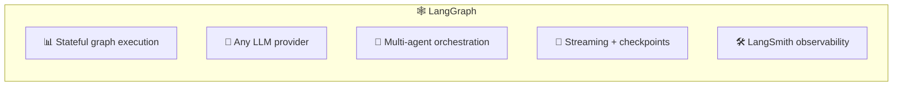
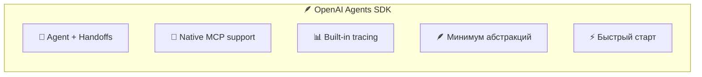
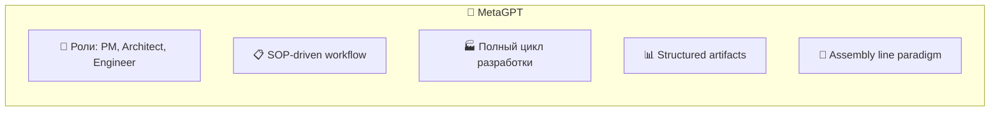
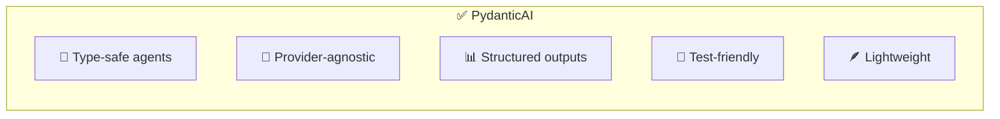
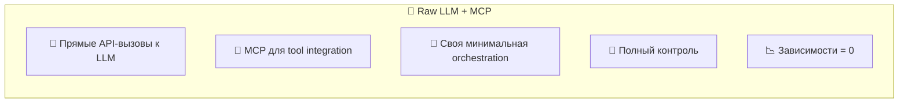
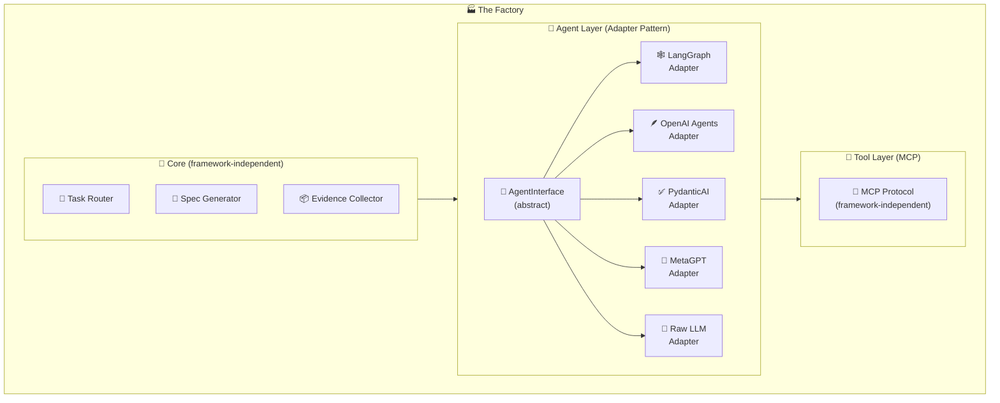
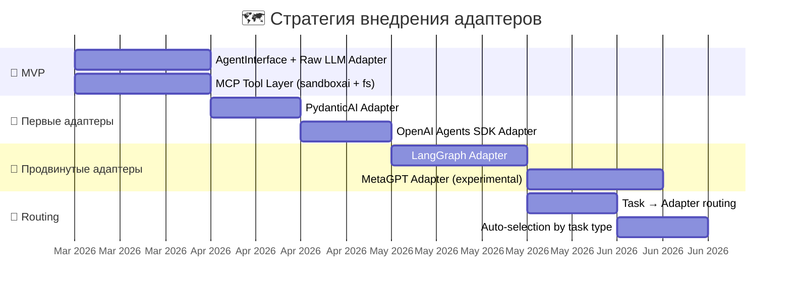
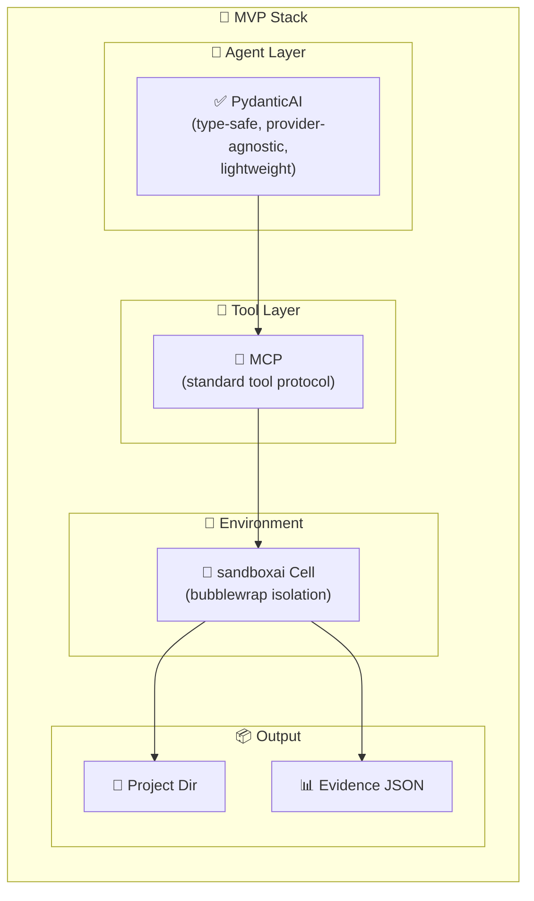
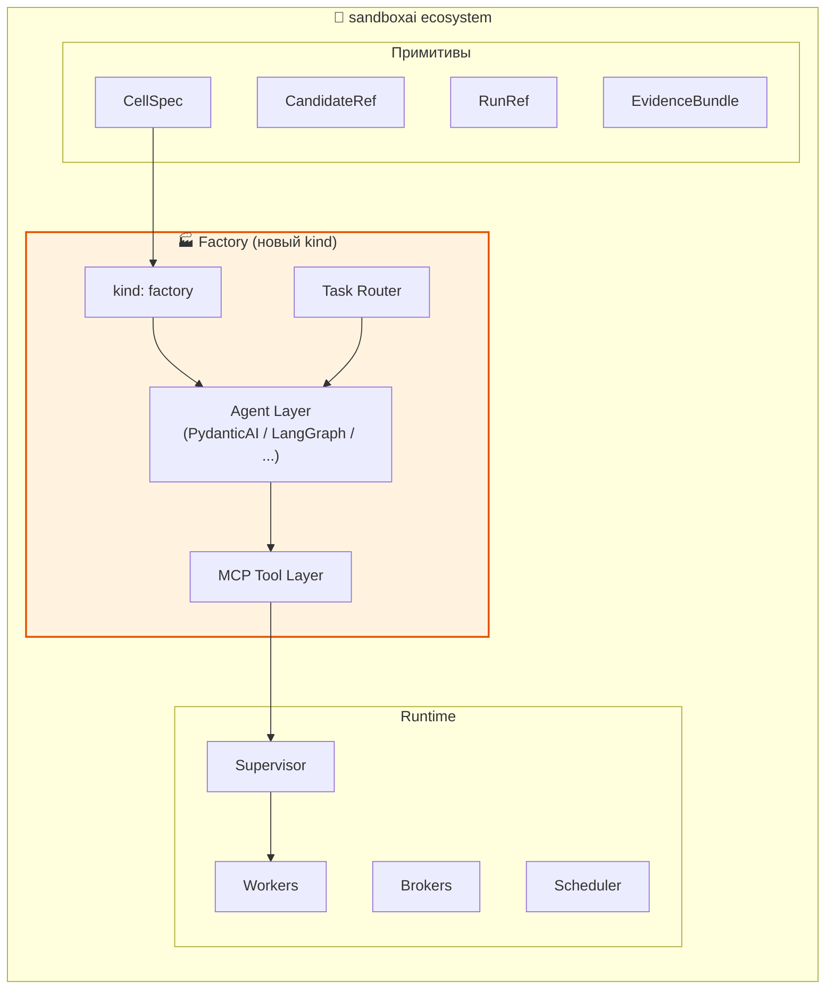
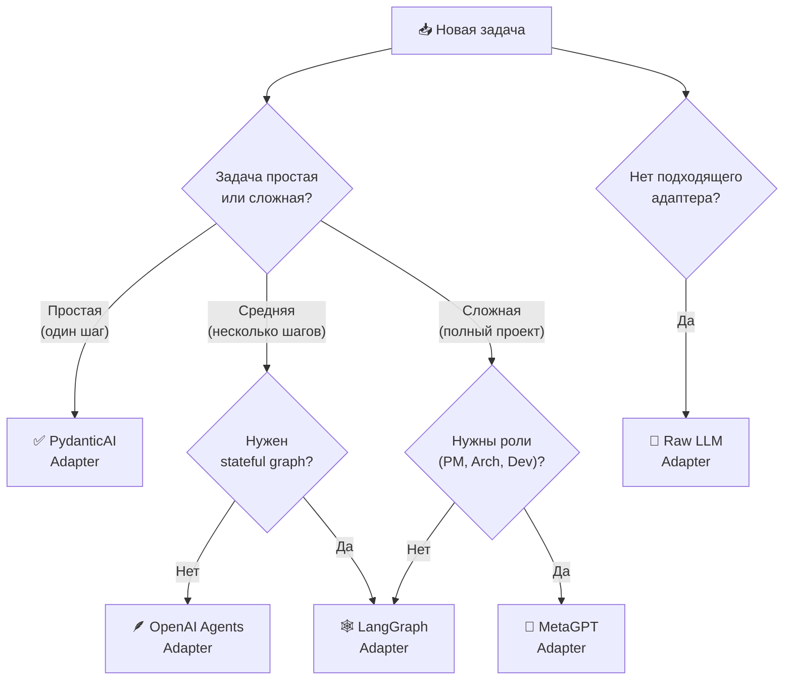

# 🔌🧠🏭 Выбор AI-фреймворка для The Factory

> Заметка-исследование. Какие AI-фреймворки подходят, какие нет, и как сделать framework-agnostic архитектуру.
>
> 📅 Дата среза: 2026-03-08

---

## 🎯 Критерии оценки

Исходя из north star проекта и требований к Factory, оцениваем фреймворки по:

| Критерий | Вес | Почему важен |
|---------|-----|-------------|
| 🔌 **Provider-agnostic** (LLM) | 🔴🔴🔴 | Не быть привязанным к одному LLM-провайдеру |
| 🧩 **Модульность / composability** | 🔴🔴🔴 | Компоненты заменяемы, система собираема |
| 🔗 **MCP support** | 🔴🔴 | Стандартный tool layer |
| 🪆 **Multi-agent + recursion** | 🔴🔴 | Factory порождает agents, те порождают agents |
| 🐍 **Python ecosystem** | 🔴🔴 | sandboxai ядро на Python |
| 📦 **Structured output** | 🔴 | Typed results для CellSpec generation |
| 🧪 **Testability** | 🔴 | Evidence-driven approach |
| 🪶 **Лёгкость / overhead** | 🔴 | Не тащить лишнего |
| 🌐 **Web3 compatibility** | 🟡 | Не мешать web3 adapters |
| 📈 **Зрелость / community** | 🟡 | Поддержка и экосистема |

---

## 🏆 Кандидаты и оценки

### 📊 Сводная матрица

| Framework | ⭐ Stars | Provider-agnostic | Модульность | MCP | Multi-agent | Python | Structured | Test | Лёгкость | Итог |
|-----------|--------:|:---:|:---:|:---:|:---:|:---:|:---:|:---:|:---:|:---:|
| **LangGraph** | ~26k | ✅✅✅ | ✅✅✅ | ✅✅ | ✅✅✅ | ✅✅✅ | ✅✅ | ✅✅ | ✅ | 🥇 |
| **MetaGPT** | ~65k | ✅✅ | ✅✅ | ❌ | ✅✅✅ | ✅✅✅ | ✅✅ | ✅ | ✅ | 🥈 |
| **OpenAI Agents SDK** | ~19k | ❌ | ✅✅ | ✅✅✅ | ✅✅ | ✅✅✅ | ✅✅✅ | ✅✅ | ✅✅✅ | 🥈 |
| **AutoGen** | ~55k | ✅✅ | ✅✅ | ✅ | ✅✅✅ | ✅✅✅ | ✅ | ✅ | ✅ | 🥉 |
| **CrewAI** | ~45k | ✅✅ | ✅✅ | ✅ | ✅✅✅ | ✅✅✅ | ✅✅ | ✅ | ✅✅ | 🥉 |
| **PydanticAI** | ~15k | ✅✅✅ | ✅✅ | ✅ | ✅ | ✅✅✅ | ✅✅✅ | ✅✅✅ | ✅✅✅ | 🥈 |
| **ControlFlow** | ~2k | ✅✅ | ✅✅ | ❌ | ✅✅ | ✅✅✅ | ✅✅✅ | ✅✅ | ✅✅ | 🥉 |
| **Raw LLM + MCP** | — | ✅✅✅ | ✅✅✅ | ✅✅✅ | ✅ | ✅✅✅ | ✅ | ✅ | ✅✅✅ | 🥈 |
| **Agent Squad** | ~7.5k | ✅✅ | ✅✅ | ✅ | ✅✅ | ✅✅ | ✅ | ✅ | ✅✅ | — |
| **Haystack** | ~24k | ✅✅✅ | ✅✅✅ | ✅ | ✅✅ | ✅✅✅ | ✅✅ | ✅✅ | ✅ | 🥉 |
| **Semantic Kernel** | ~27k | ✅✅ | ✅✅ | ✅ | ✅✅ | ✅ | ✅✅ | ✅✅ | ✅ | — |

> ✅✅✅ = отлично, ✅✅ = хорошо, ✅ = есть но слабо, ❌ = нет/проблемно

---

## 🔍 Детальный разбор ТОП-кандидатов

### 🥇 LangGraph — «Архитектурная дисциплина»



**Почему подходит для Factory:**

| Аспект | Оценка | Детали |
|--------|--------|--------|
| Provider-agnostic | ⭐⭐⭐⭐⭐ | OpenAI, Anthropic, Google, Ollama, любой через LangChain |
| Graph model | ⭐⭐⭐⭐⭐ | Явные nodes, edges, state — идеально для pipeline Cell → Cell |
| Multi-agent | ⭐⭐⭐⭐⭐ | Supervisor pattern, handoffs, sub-graphs |
| MCP | ⭐⭐⭐⭐ | Поддерживается через tool integration |
| Structured output | ⭐⭐⭐⭐ | Через Pydantic + LangChain structured output |
| Тестируемость | ⭐⭐⭐⭐ | Checkpoints, replay, state inspection |

**Риски:**

- 🟡 Относительно тяжёлый (тянет LangChain)
- 🟡 Learning curve выше среднего
- 🟡 Ecosystem coupling с LangChain/LangSmith

**Вердикт:** 🏆 **Лучший кандидат для «ядра» orchestration layer** — но нужно использовать как адаптер, а не как монолит.

---

### 🥈 OpenAI Agents SDK — «Простота и скорость»



**Почему подходит:**

| Аспект | Оценка | Детали |
|--------|--------|--------|
| MCP | ⭐⭐⭐⭐⭐ | Лучшая MCP-интеграция из коробки |
| Handoffs | ⭐⭐⭐⭐⭐ | Agent-to-agent delegation как first-class |
| Лёгкость | ⭐⭐⭐⭐⭐ | Минимальный overhead |
| Structured output | ⭐⭐⭐⭐⭐ | Pydantic models из коробки |

**Риски:**

- 🔴 Vendor lock на OpenAI (это серьёзно для framework-agnostic целей!)
- 🟡 Нет native multi-provider support

**Вердикт:** 🎯 **Отличный для MVP / первого адаптера**, но нельзя строить архитектуру только на нём.

---

### 🥈 MetaGPT — «Виртуальная софтверная компания»



**Почему подходит:**

| Аспект | Оценка | Детали |
|--------|--------|--------|
| Multi-agent roles | ⭐⭐⭐⭐⭐ | PM, Architect, Engineer, QA — полная команда |
| Software dev focus | ⭐⭐⭐⭐⭐ | Специализирован именно на создании проектов |
| SOP workflow | ⭐⭐⭐⭐ | Структурированные процессы |
| Artifact generation | ⭐⭐⭐⭐ | User stories, API design, code, tests |

**Риски:**

- 🔴 Нет нативного MCP
- 🟡 Тяжёлый и opinionated
- 🟡 Больше про "software company" — меньше про "environment factory"

**Вердикт:** 📐 **Интересный концептуально**, можно заимствовать идею ролей и SOP, но вряд ли подойдёт как единственный фреймворк. **Лучше как один из адаптеров**.

---

### 🥈 PydanticAI — «Типобезопасность и чистота»



**Почему подходит:**

| Аспект | Оценка | Детали |
|--------|--------|--------|
| Type safety | ⭐⭐⭐⭐⭐ | Pydantic-first — идеально для CellSpec generation |
| Provider agnostic | ⭐⭐⭐⭐⭐ | OpenAI, Anthropic, Google, Groq, Mistral, Ollama |
| Лёгкость | ⭐⭐⭐⭐⭐ | Минимальный overhead |
| Testability | ⭐⭐⭐⭐⭐ | Test-first design |
| Structured output | ⭐⭐⭐⭐⭐ | Native Pydantic models |

**Риски:**

- 🟡 Не заточен под multi-agent orchestration
- 🟡 Нет graph/pipeline execution

**Вердикт:** 🧩 **Отличный как «клеевой» слой** для type-safe agent interactions. Можно использовать внутри LangGraph adapter-а или самостоятельно для простых сценариев.

---

### 🥈 Raw LLM + MCP — «Нулевой фреймворк»



**Почему подходит:**

| Аспект | Оценка | Детали |
|--------|--------|--------|
| Framework lock | ⭐⭐⭐⭐⭐ | Нет зависимости от фреймворка вообще |
| Контроль | ⭐⭐⭐⭐⭐ | Полный контроль над всем |
| MCP | ⭐⭐⭐⭐⭐ | MCP как единственная абстракция |
| Лёгкость | ⭐⭐⭐⭐⭐ | Минимум кода |

**Риски:**

- 🔴 Нужно писать orchestration руками
- 🔴 Нет ready-made multi-agent patterns
- 🟡 Нет observability из коробки

**Вердикт:** 🛠️ **Максимальная свобода, но максимальные трудозатраты**. Лучший выбор, если фреймворки мешают, а не помогают.

---

## 🧩 Рекомендуемая стратегия: Multi-Adapter Architecture

### 💡 Главная идея

**Не выбирать ОДИН фреймворк. Вместо этого — абстрактный Agent Layer с адаптерами.**



### 🗺️ Поэтапная реализация



---

## 🧬 AgentInterface — контракт адаптера

```python
from abc import ABC, abstractmethod
from pydantic import BaseModel

class TaskSpec(BaseModel):
    description: str
    context: dict
    constraints: dict
    expected_output: str

class PlanResult(BaseModel):
    steps: list[str]
    cell_specs: list[dict]
    estimated_budget: dict

class ExecResult(BaseModel):
    artifacts: list[str]
    evidence: dict
    status: str

class AgentInterface(ABC):
    """Framework-agnostic agent interface."""

    @abstractmethod
    async def plan(self, task: TaskSpec) -> PlanResult:
        """Analyze task and produce execution plan."""
        ...

    @abstractmethod
    async def execute(self, plan: PlanResult) -> ExecResult:
        """Execute plan inside a sandboxai cell."""
        ...

    @abstractmethod
    async def evaluate(self, result: ExecResult) -> dict:
        """Evaluate execution result."""
        ...

    @abstractmethod
    async def handoff(self, task: TaskSpec, target: str) -> None:
        """Hand off task to another agent/factory."""
        ...
```

---

## 🏗️ Рекомендуемый стек для MVP



### 📝 Почему PydanticAI для MVP

| Причина | Детали |
|---------|--------|
| 🔌 Provider-agnostic | OpenAI, Anthropic, Google, Ollama — все через единый API |
| 📐 Type-safe | CellSpec = Pydantic model → PydanticAI генерирует их естественно |
| 🪶 Lightweight | Минимум overhead, быстрый старт |
| 🧪 Test-friendly | Тесты как first-class — соответствует evidence-driven подходу |
| 🔗 MCP-совместим | Инструменты через MCP, не через встроенные tools |
| 📈 Растёт | Быстро растущий проект с сильным community |

### 🔜 Что добавить после MVP

1. **LangGraph Adapter** — когда понадобятся сложные stateful workflows
2. **OpenAI Agents SDK Adapter** — когда понадобятся handoffs
3. **MetaGPT Adapter** — когда понадобятся ролевые SOP-процессы
4. **Task Router** — автоматический выбор адаптера по типу задачи

---

## 🆚 Альтернативные стратегии

### Стратегия A: «Один фреймворк» ❌

```text
Выбрать LangGraph → всё на нём → vendor lock
```
- ❌ Нарушает framework-agnostic принцип
- ❌ Если LangGraph устареет — переписывать всё

### Стратегия B: «Написать своё» ❌

```text
Raw LLM + своя orchestration → полный контроль → долго
```
- ❌ Огромные трудозатраты
- ❌ Reinventing the wheel

### Стратегия C: «Multi-Adapter» ✅ ← РЕКОМЕНДАЦИЯ

```text
AgentInterface → адаптеры → MCP tools → sandboxai cells
```
- ✅ Framework-agnostic
- ✅ Chain-agnostic
- ✅ Можно начать с одного адаптера и расти
- ✅ Фреймворк = заменяемый компонент

---

## 🧩 Как это сочетается с sandboxai



---

## 📐 Дерево решений: какой адаптер для какой задачи



---

## ❤️ Финальный вывод

### 🎯 Стратегия в одном абзаце

> Для The Factory рекомендуется **Multi-Adapter Architecture**: абстрактный `AgentInterface` + конкретные адаптеры для разных фреймворков. **MVP начать с PydanticAI** (provider-agnostic, type-safe, lightweight), **tools через MCP** (framework-independent standard), **execution через sandboxai Cell**. Дальше добавлять адаптеры по мере необходимости: LangGraph для сложных workflows, OpenAI Agents SDK для handoffs, MetaGPT для ролевых SOP-процессов.

### 📋 Чек-лист для старта

- [ ] Определить `AgentInterface` (Pydantic models для Task, Plan, Result)
- [ ] Реализовать PydanticAI adapter
- [ ] Написать sandboxai MCP server (spawn, build, test)
- [ ] Написать filesystem MCP server
- [ ] Реализовать File Watcher как первый TaskChannel
- [ ] Добавить CellKind: factory в sandboxai types
- [ ] Первый E2E: файл → задача → cell → проект → evidence

### 🧬 Формула

```text
The Factory = AgentInterface(adapters)
            + MCP(tools)
            + sandboxai(cells)
            + vladOS(infrastructure)
```

Всё модульно. Всё заменяемо. Нет vendor lock. 🔌🧩🏭
