# 🧪🧠🔥 DSPy — Глубокое погружение

> **DSPy (Declarative Self-improving Python)** — фреймворк Stanford NLP для **программирования** языковых моделей вместо **промптинга**. Это принципиально другой подход к работе с LLM.
>
> 📅 Дата среза: 2026-03-08 | ⭐ ~32.6k stars | 📦 160k+ monthly downloads

---

## 🎯 Почему DSPy крайне интересен для The Factory

### 💡 Ключевой инсайт

Большинство AI-фреймворков (LangGraph, CrewAI, AutoGen) решают задачу **оркестрации**: "как соединить агентов, tools и LLM в pipeline". DSPy решает **другую** задачу:

> **Как автоматически улучшать программу, использующую LLM, через оптимизацию промптов и весов — без ручного prompt engineering.**

Это прямо резонирует с philosophy sandboxai:
- 🧬 **Self-improving** — система улучшает себя
- ✅ **Evidence-driven** — продвижение через доказательства
- 📉 **Metric-based** — оптимизация по измеримой метрике

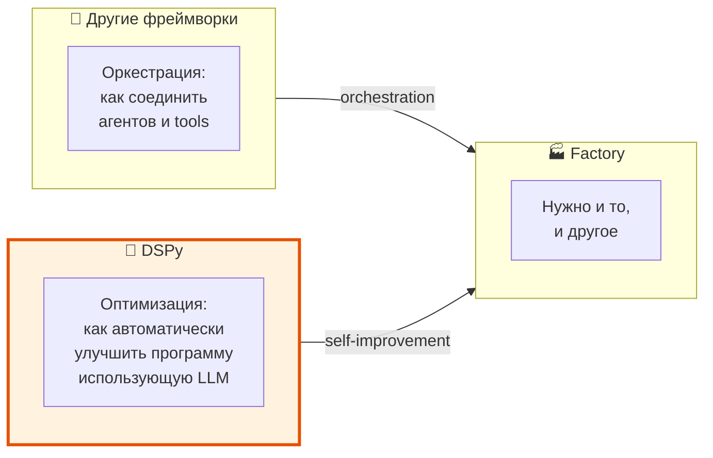

---

## 🧬 Главная философия DSPy

### «Programming — not prompting — LMs»

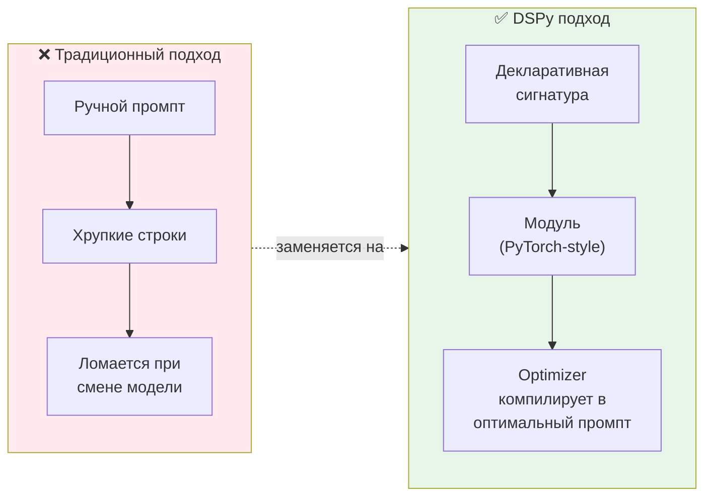

### 🧩 Три кита DSPy

| Компонент | Аналогия | Что делает |
|-----------|----------|-----------|
| 🔤 **Signatures** | Типовая сигнатура функции | Декларативно описывает ЧТО делает модуль (вход → выход) |
| 📦 **Modules** | PyTorch `nn.Module` | Строительные блоки с learnable parameters, композируются |
| ⚡ **Optimizers** | Компилятор | Автоматически подбирают промпты, примеры, инструкции |

---

## 🔤 Signatures — «Что, а не как»

Signature — это декларативная спецификация поведения модуля. Не промпт, а **контракт**.

```python
# Простейшая сигнатура — одна строка
classify = dspy.Predict('sentence -> sentiment: bool')

# Типизированная сигнатура — как Pydantic
class Classify(dspy.Signature):
    """Classify sentiment of a given sentence."""
    sentence: str = dspy.InputField()
    sentiment: Literal['positive', 'negative', 'neutral'] = dspy.OutputField()
    confidence: float = dspy.OutputField()

classify = dspy.Predict(Classify)
result = classify(sentence="This book was super fun to read")
# result.sentiment = 'positive', result.confidence = 0.85
```

### 🔑 Почему это важно для Factory

> В Factory нам нужно генерировать CellSpec-ы. С DSPy это выглядит как **типизированная сигнатура**:

```python
class GenerateCellSpec(dspy.Signature):
    """Generate a sandboxai CellSpec from a task description."""
    task_description: str = dspy.InputField()
    project_type: str = dspy.InputField()
    cell_spec: dict = dspy.OutputField(desc="Valid CellSpec YAML as dict")
    reasoning: str = dspy.OutputField(desc="Why this spec was chosen")
```

---

## 📦 Modules — «Строительные блоки»

Модули DSPy — это **composable building blocks** с learnable parameters (промпты, примеры, веса).

### Встроенные модули

| Модуль | Что делает | Когда использовать |
|--------|-----------|-------------------|
| `dspy.Predict` | Базовый предиктор | Простые задачи |
| `dspy.ChainOfThought` | Пошаговое рассуждение | Когда нужна логика |
| `dspy.ProgramOfThought` | Генерирует код для ответа | Когда ответ вычисляем |
| `dspy.ReAct` | Агент с tools (Reasoning + Acting) | Когда нужны инструменты |
| `dspy.MultiChainComparison` | Сравнение нескольких CoT | Когда нужна надёжность |
| `dspy.RLM` | Рекурсивная модель с REPL | Когда контекст огромен |

### Композиция модулей

```python
class FactoryAgent(dspy.Module):
    """Multi-step factory agent using DSPy composition."""

    def __init__(self):
        self.analyze = dspy.ChainOfThought("task_description -> analysis, project_type")
        self.plan = dspy.ChainOfThought("analysis, project_type -> steps: list[str], cell_spec: dict")
        self.execute = dspy.ReAct("steps, cell_spec -> result", tools=[
            spawn_cell,
            run_build,
            run_tests,
        ])

    def forward(self, task_description: str):
        analysis = self.analyze(task_description=task_description)
        plan = self.plan(
            analysis=analysis.analysis,
            project_type=analysis.project_type
        )
        result = self.execute(
            steps=plan.steps,
            cell_spec=plan.cell_spec
        )
        return result
```

### 🧠 Почему это PyTorch-like

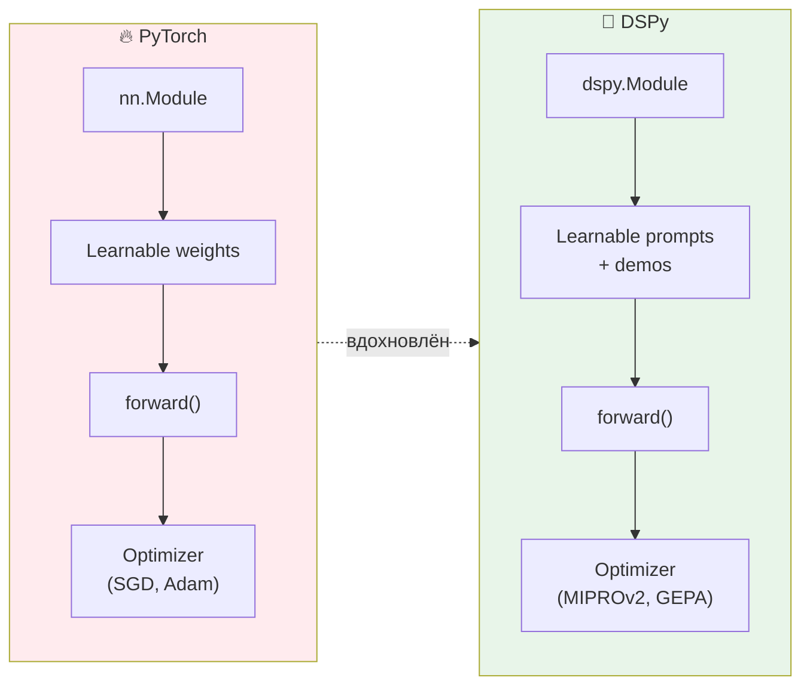

---

## ⚡ Optimizers — «Компилятор промптов»

Это **самая мощная** и **самая уникальная** часть DSPy. Ни один другой фреймворк этого не делает.

### 🔄 Как это работает

```mermaid
sequenceDiagram
    participant Dev as 👤 Разработчик
    participant Prog as 📦 DSPy Program
    participant Opt as ⚡ Optimizer
    participant LM as 🧠 LM
    participant Metric as 📊 Metric

    Dev->>Prog: Пишет модули + сигнатуры
    Dev->>Metric: Определяет метрику
    Dev->>Opt: Запускает compile(program, metric, data)

    loop Оптимизация
        Opt->>Prog: Пробует вариант промпта/примеров
        Prog->>LM: Запрос к LLM
        LM-->>Prog: Ответ
        Prog-->>Opt: Результат
        Opt->>Metric: Оценка результата
        Metric-->>Opt: Скор
        Opt->>Opt: Обновление стратегии
    end

    Opt-->>Dev: Оптимизированная программа ✅
```

### 🧩 Виды оптимизаторов

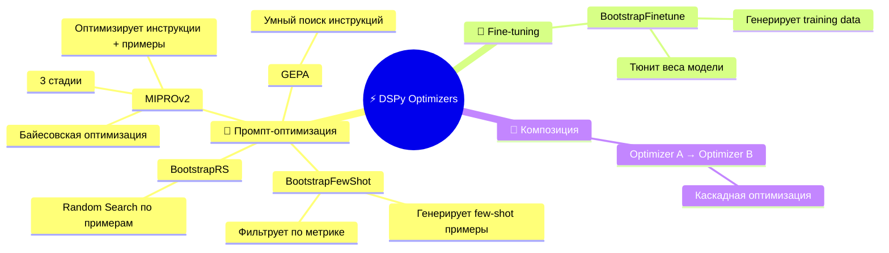

### 📊 MIPROv2 — самый мощный оптимизатор

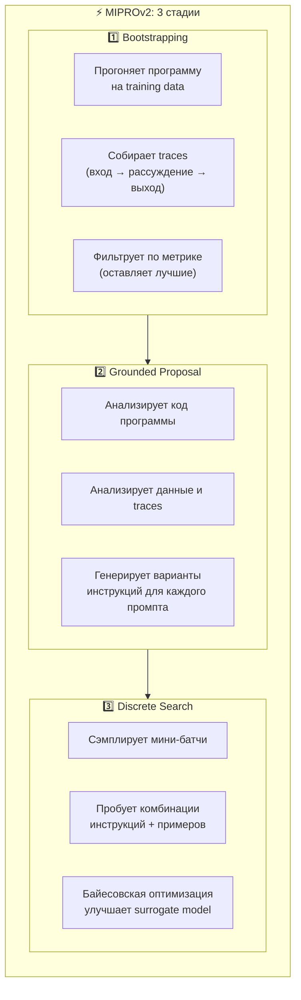

### 🔥 Почему это game-changer для Factory

| Проблема | Как решает DSPy |
|---------|----------------|
| Промпты ломаются при смене модели | Optimizer перекомпилирует под новую модель |
| Ручной prompt engineering | Автоматическая оптимизация по метрике |
| "Работает на GPT-4, не работает на Claude" | Compile для каждой модели отдельно |
| Нет уверенности в качестве | Metric-driven: если метрика растёт — программа улучшается |
| Self-improvement | Запустить optimizer повторно с новыми данными → лучше |

---

## 🔗 DSPy + MCP — нативная интеграция

DSPy **нативно поддерживает MCP** с версии 2.6+:

```python
import dspy
from mcp import ClientSession
from mcp.client.streamable_http import streamablehttp_client

async def main():
    async with streamablehttp_client("http://localhost:8000/mcp") as (read, write):
        async with ClientSession(read, write) as session:
            await session.initialize()

            response = await session.list_tools()
            dspy_tools = [
                dspy.Tool.from_mcp_tool(session, tool)
                for tool in response.tools
            ]

            react_agent = dspy.ReAct(
                signature="task -> result",
                tools=dspy_tools,
                max_iters=5
            )

            result = await react_agent.acall(task="Create a Python project")
```

### 🧬 Что это значит для Factory

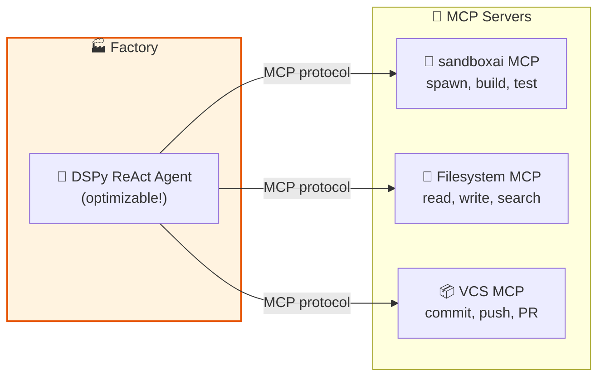

> 💡 **Ключевое преимущество**: DSPy ReAct agent, работающий через MCP tools, **оптимизируем**! Optimizer может автоматически улучшить, как агент использует tools.

---

## 🔌 DSPy — Provider-Agnostic

DSPy использует **LiteLLM** под капотом, что даёт поддержку практически любого LLM:

```python
# OpenAI
dspy.configure(lm=dspy.LM("openai/gpt-5-mini"))

# Anthropic
dspy.configure(lm=dspy.LM("anthropic/claude-sonnet-4-5-20250929"))

# Google
dspy.configure(lm=dspy.LM("gemini/gemini-2.5-flash"))

# Ollama (local)
dspy.configure(lm=dspy.LM("ollama_chat/llama3.2:1b", api_base="http://localhost:11434"))

# Databricks
dspy.configure(lm=dspy.LM("databricks/databricks-llama-4-maverick"))

# Любой LiteLLM-совместимый провайдер
dspy.configure(lm=dspy.LM("together_ai/meta-llama/Llama-3-70b"))
```

### 🧩 Разные модели для разных модулей

```python
class FactoryAgent(dspy.Module):
    def __init__(self):
        # Быстрый анализ — маленькая модель
        self.analyze = dspy.ChainOfThought(
            "task -> analysis",
            lm=dspy.LM("ollama_chat/llama3.2:1b")
        )
        # Генерация кода — мощная модель
        self.generate = dspy.ChainOfThought(
            "analysis -> code",
            lm=dspy.LM("anthropic/claude-sonnet-4-5-20250929")
        )
```

---

## 🆚 DSPy vs другие фреймворки: честное сравнение

### 🧩 Разные задачи — разные инструменты

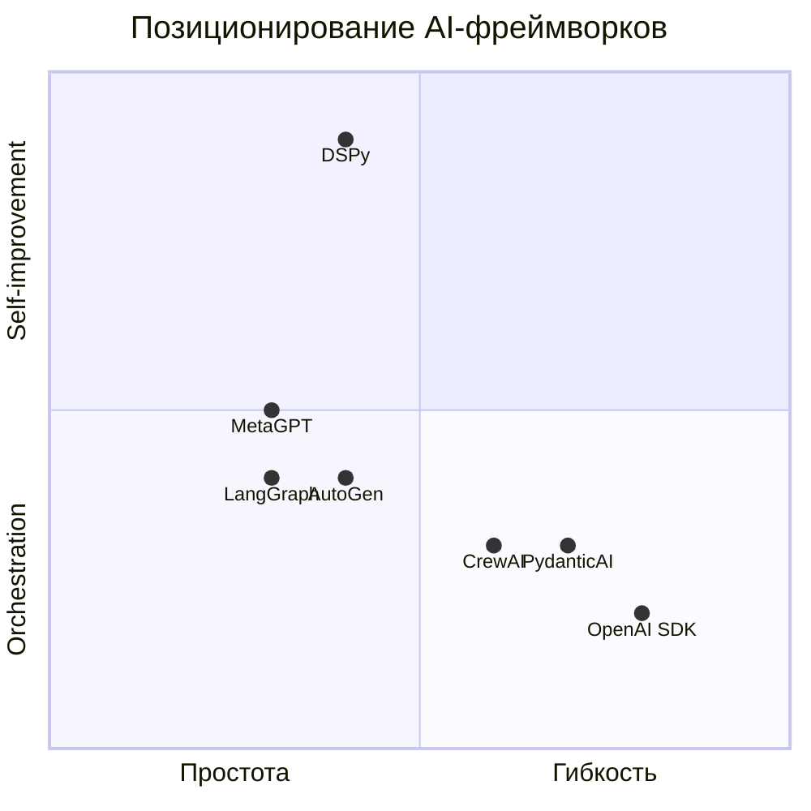

### 📊 Детальное сравнение

| Аспект | DSPy | LangGraph | PydanticAI | OpenAI SDK |
|--------|------|-----------|------------|------------|
| **Основная сила** | Self-improvement через оптимизацию | Stateful graph orchestration | Type safety | Простота |
| **Provider-agnostic** | ✅✅✅ (LiteLLM) | ✅✅✅ (LangChain) | ✅✅✅ | ❌ (OpenAI only) |
| **MCP support** | ✅✅✅ (нативный) | ✅✅ | ✅ | ✅✅✅ |
| **Auto-optimization** | ✅✅✅ (уникальное) | ❌ | ❌ | ❌ |
| **Multi-agent** | ✅✅ (через composition) | ✅✅✅ | ✅ | ✅✅ |
| **Structured output** | ✅✅✅ (сигнатуры) | ✅✅ | ✅✅✅ (Pydantic) | ✅✅✅ |
| **Testability** | ✅✅✅ (metric-driven) | ✅✅ | ✅✅✅ | ✅✅ |
| **Лёгкость** | ✅✅ | ✅ | ✅✅✅ | ✅✅✅ |
| **Agent loops** | ✅✅ (ReAct) | ✅✅✅ | ✅ | ✅✅ |
| **Зрелость** | ✅✅✅ (Stanford, 2+ года) | ✅✅✅ | ✅✅ | ✅✅ |

### ⚠️ Честные слабости DSPy

| Слабость | Детали | Насколько критично |
|---------|--------|-------------------|
| 🧠 Learning curve | Другая парадигма мышления (не промптинг, а программирование) | 🟡 Средне — но окупается |
| 🔍 Debugging | Оптимизированные промпты менее прозрачны | 🟡 Средне — есть inspect_history |
| 🔄 Multi-agent orchestration | Не первоклассная тема (нет supervisor/handoff patterns) | 🟡 Средне — можно комбинировать |
| 📚 Ecosystem | Меньше готовых интеграций, чем у LangChain | 🟡 Средне — MCP компенсирует |
| 🏗️ Production patterns | Меньше production best practices, чем у LangGraph | 🟡 Средне — активно развивается |

---

## 🏭 DSPy для The Factory: конкретный сценарий

### 📋 Как выглядит Factory на DSPy

```python
import dspy
from mcp import ClientSession

class TaskAnalyzer(dspy.Signature):
    """Analyze incoming task and determine project type and requirements."""
    task_description: str = dspy.InputField()
    project_type: str = dspy.OutputField()
    requirements: list[str] = dspy.OutputField()
    recommended_preset: str = dspy.OutputField()

class PlanGenerator(dspy.Signature):
    """Generate execution plan for the factory."""
    project_type: str = dspy.InputField()
    requirements: list[str] = dspy.InputField()
    steps: list[str] = dspy.OutputField()
    estimated_time: str = dspy.OutputField()

class Factory(dspy.Module):
    """AI Factory that creates projects inside sandboxai cells."""

    def __init__(self, mcp_tools: list):
        self.analyze = dspy.ChainOfThought(TaskAnalyzer)
        self.plan = dspy.ChainOfThought(PlanGenerator)
        self.execute = dspy.ReAct(
            "plan, preset -> result, artifacts",
            tools=mcp_tools,
            max_iters=10
        )

    def forward(self, task_description: str):
        analysis = self.analyze(task_description=task_description)
        plan = self.plan(
            project_type=analysis.project_type,
            requirements=analysis.requirements
        )
        result = self.execute(
            plan=plan.steps,
            preset=analysis.recommended_preset
        )
        return dspy.Prediction(
            project_type=analysis.project_type,
            plan=plan.steps,
            result=result.result,
            artifacts=result.artifacts
        )
```

### ⚡ Оптимизация Factory

```python
# Метрика: насколько хорошо Factory создаёт проекты
def factory_metric(example, prediction, trace=None):
    # Проверяем: проект создан, тесты проходят, структура правильная
    project_exists = prediction.artifacts is not None
    tests_pass = "tests_passed" in prediction.result
    correct_type = prediction.project_type == example.expected_type
    return (project_exists + tests_pass + correct_type) / 3.0

# Тренировочные данные
trainset = [
    dspy.Example(
        task_description="Create a FastAPI microservice with PostgreSQL",
        expected_type="python-api"
    ).with_inputs("task_description"),
    dspy.Example(
        task_description="Create a React dashboard with charts",
        expected_type="frontend-react"
    ).with_inputs("task_description"),
    # ... ещё примеры
]

# Оптимизация!
optimizer = dspy.MIPROv2(metric=factory_metric, auto="medium")
optimized_factory = optimizer.compile(Factory(mcp_tools), trainset=trainset)

# Теперь optimized_factory автоматически подобрал:
# - Лучшие инструкции для каждого модуля
# - Лучшие few-shot примеры
# - Оптимальные стратегии рассуждения
```

### 🔄 Self-improvement loop

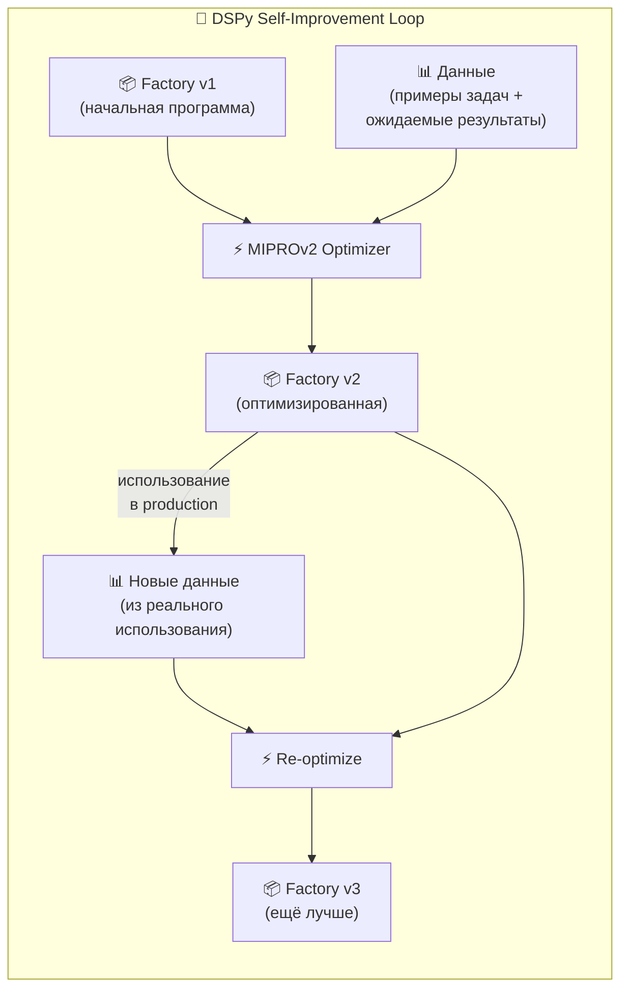

> 💡 **Это именно то, что нужно для evidence-driven self-improvement**: каждый цикл оптимизации опирается на реальные метрики и данные.

---

## 🧬 DSPy + sandboxai: идеальный fit

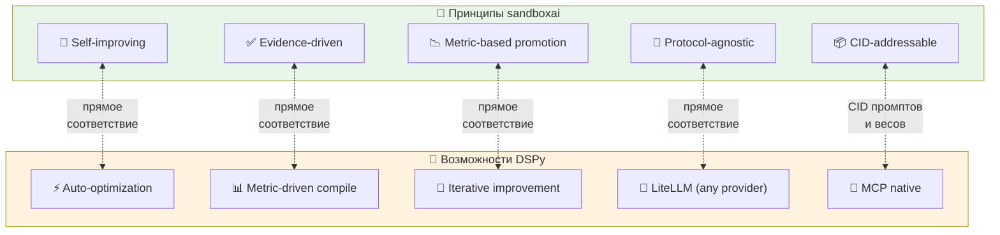

### 🔑 Почему DSPy — идеальный fit именно для этой экосистемы

| Принцип sandboxai | Как DSPy его реализует |
|-------------------|----------------------|
| **Self-improving** | Optimizers автоматически улучшают программу |
| **Evidence-driven promotion** | Metric function = evidence; compile = promotion |
| **CID-addressable** | Оптимизированная программа = набор промптов/весов → можно CID-адресовать |
| **Protocol-agnostic** | LiteLLM → любой провайдер; MCP → любые tools |
| **Candidate Tree** | Каждый вариант оптимизации = candidate; лучший = promoted |
| **Monotonic attenuation** | Budget (max_iters, token limits) сужается вглубь |

---

## 🏆 Обновлённая рекомендация для Factory

### До DSPy-исследования

```text
MVP: PydanticAI + MCP + sandboxai
Потом: LangGraph для сложных workflows
```

### После DSPy-исследования

```text
MVP: DSPy + MCP + sandboxai
Почему: DSPy даёт self-improvement из коробки,
        provider-agnostic через LiteLLM,
        MCP native,
        и композируемые модули.
PydanticAI: для type-safe helpers внутри DSPy modules
LangGraph: для сложных stateful workflows (когда DSPy ReAct не хватит)
```

### 📊 Обновлённое дерево решений

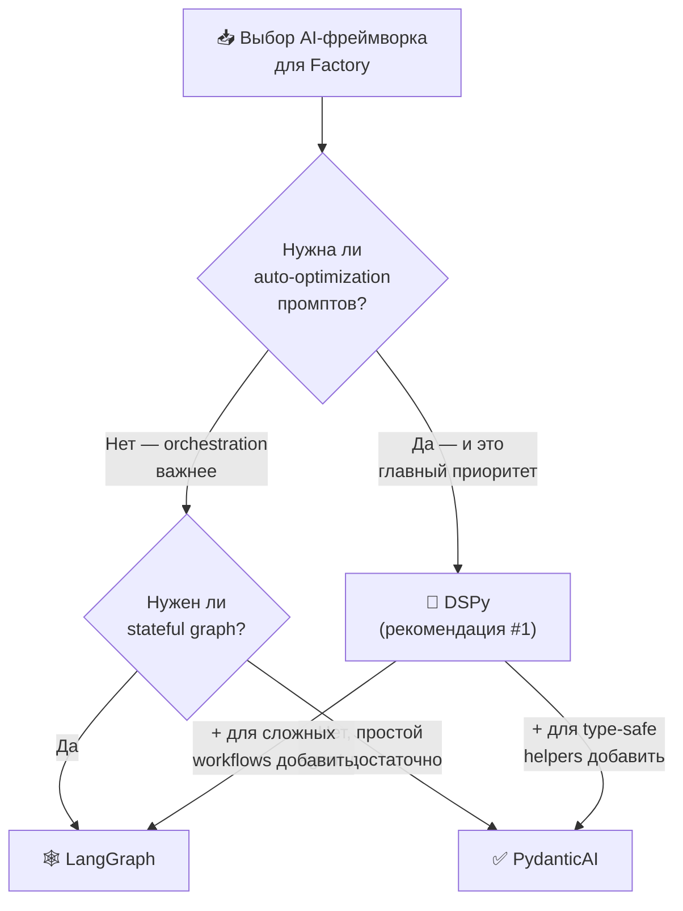

---

## 📐 DSPy в Multi-Adapter Architecture

DSPy не противоречит multi-adapter подходу — он **становится одним из адаптеров**, но с суперспособностью: auto-optimization.

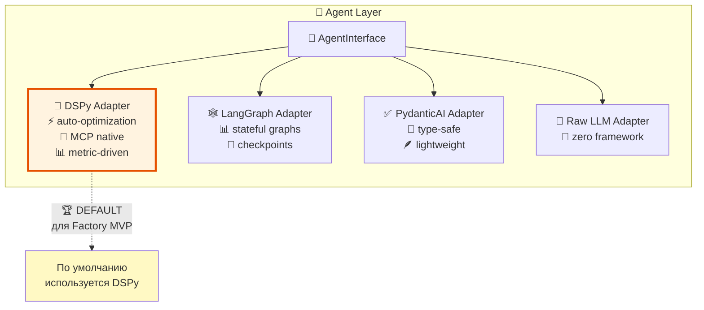

---

## ❤️ Финальный вывод по DSPy

### В одном абзаце

> **DSPy — это не просто ещё один AI-фреймворк.** Это **другая парадигма**: вместо ручного промптинга — программирование с автоматической оптимизацией. Для The Factory это идеальный fit, потому что DSPy **нативно** реализует три ключевых принципа sandboxai: self-improvement, evidence-driven promotion, и protocol-agnostic execution. DSPy ReAct agent с MCP tools, оптимизированный MIPROv2 по реальным метрикам — это именно та "фабрика", которая сама становится лучше с каждым использованием.

### 📋 Формула

```text
The Factory = DSPy(Modules + Optimizers)
            + MCP(Tools)
            + sandboxai(Cells, preset)
            + vladOS(Infrastructure)

DSPy даёт: auto-optimization + provider-agnostic + MCP native
sandboxai даёт: isolation + recursion + evidence + web3
vladOS даёт: infrastructure + deployment + secrets
```

### 🧬 Аналогия

```text
DSPy : промпты = Nix : конфигурации

Nix:  "Не пиши конфигурации руками — опиши декларативно, система соберёт"
DSPy: "Не пиши промпты руками — опиши сигнатуру, optimizer подберёт"
```

Обе философии **декларативны** и **self-improving**. Обе **компилируют** высокоуровневое описание в низкоуровневую реализацию. Именно поэтому DSPy — natural fit для Nix-based экосистемы. 🧬❄️🧪
