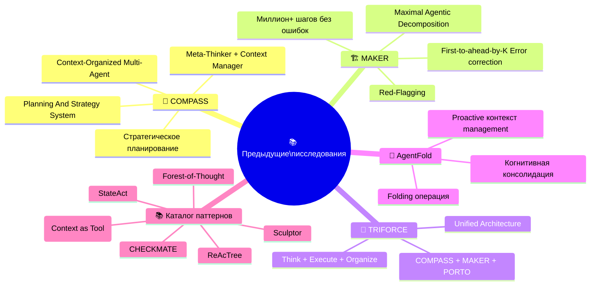
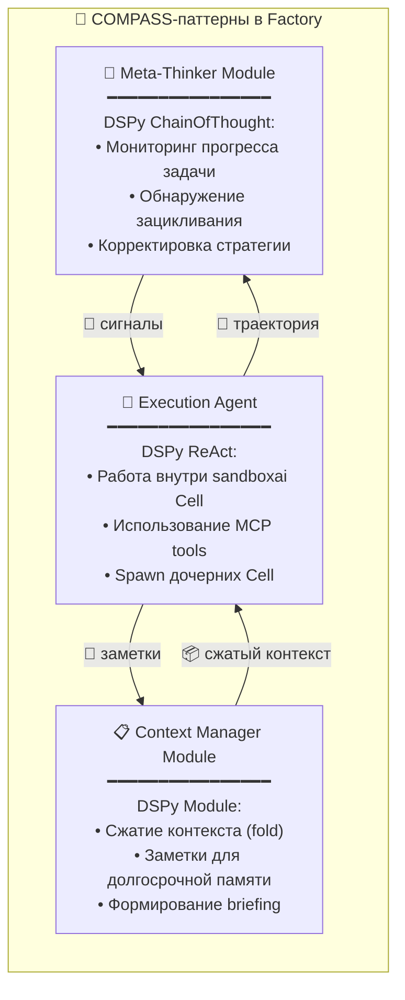
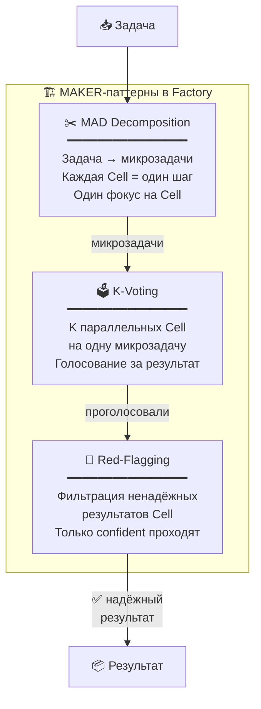
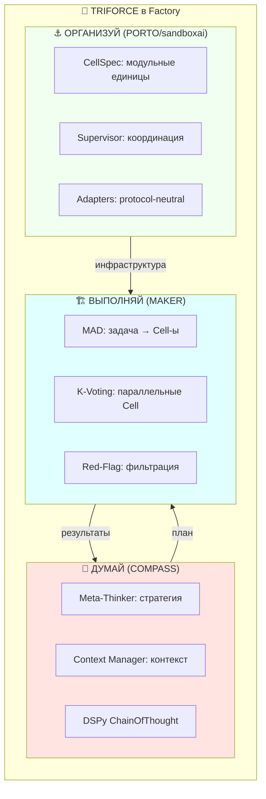
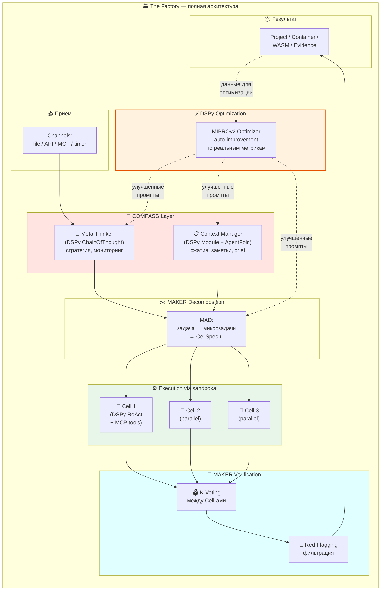
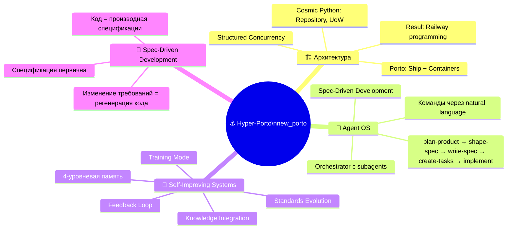

# 🔗🧠🔱 Связь с предыдущими исследованиями: COMPASS, MAKER, TRIFORCE

> Заметка-мост. Как предварительные исследования из `COMPASS_MAKER_LITESTAR_PORTO` ложатся на архитектуру Factory.
>
> 📅 Дата среза: 2026-03-08

---

## 🗺️ Что уже было исследовано

В папке `COMPASS_MAKER_LITESTAR_PORTO` разработчик **глубоко проработал** целый пласт академических и практических паттернов для надёжных LLM-агентов:



---

## 🧭 COMPASS → Factory: стратегическое мышление

### Что даёт COMPASS

COMPASS решает проблему **потери контекста и фокуса** у LLM-агентов через три компонента:

| Компонент | Роль | Как помогает Factory |
|-----------|------|---------------------|
| 🧠 **Meta-Thinker** | Стратегический надзор, мониторинг, обнаружение аномалий | Factory нужен мета-уровень: «правильно ли я вообще делаю то, что просили?» |
| 📋 **Context Manager** | Управление контекстом, заметки, формирование брифов | Factory работает с длинными задачами → контекст деградирует |
| 🤖 **Main Agent** | Тактическое выполнение | Сами рабочие агенты внутри Cell |

### 🔗 Прямое применение в Factory



### 💡 На DSPy это выглядит так

```python
class MetaThinker(dspy.Module):
    """COMPASS Meta-Thinker: strategic oversight."""
    def __init__(self):
        self.monitor = dspy.ChainOfThought(
            "trajectory, goal -> progress_assessment, anomalies: list[str], strategy_adjustment"
        )

    def forward(self, trajectory: str, goal: str):
        return self.monitor(trajectory=trajectory, goal=goal)


class ContextManager(dspy.Module):
    """COMPASS Context Manager: context compression and notes."""
    def __init__(self):
        self.compress = dspy.ChainOfThought(
            "full_context, goal -> compressed_brief, key_notes: list[str]"
        )

    def forward(self, full_context: str, goal: str):
        return self.compress(full_context=full_context, goal=goal)
```

---

## 🏗️ MAKER → Factory: надёжность на масштабе

### Что даёт MAKER

MAKER решает проблему **накопления ошибок**: даже при 99% точности на каждом шаге, после 1000 шагов → 0.004% успеха. Через три механизма:

| Механизм | Как работает | Что даёт |
|---------|-------------|---------|
| ✂️ **MAD** (Maximal Agentic Decomposition) | Каждый шаг — один агент, один шаг, один фокус | Агент не теряет контекст |
| 🗳️ **K-Voting** | K параллельных исполнителей голосуют | Статистическая коррекция ошибок |
| 🚩 **Red-Flagging** | Фильтрация ненадёжных ответов | Только уверенные результаты проходят |

### 🔗 Прямое применение в Factory



### 🧬 Совпадение с sandboxai

| MAKER-паттерн | sandboxai-примитив | Совпадение |
|--------------|-------------------|-----------|
| MAD (микрозадачи) | CellSpec (один kind = одна задача) | ⭐⭐⭐⭐⭐ Идеальное |
| K-Voting (параллельность) | Параллельные дочерние Cell | ⭐⭐⭐⭐⭐ Идеальное |
| Red-Flagging (фильтрация) | EvidenceBundle + verification | ⭐⭐⭐⭐⭐ Идеальное |
| Supervisor (координация) | Supervisor + Broker | ⭐⭐⭐⭐⭐ Идеальное |

> 🔥 **Вывод:** MAKER-паттерны **нативно** ложатся на sandboxai-примитивы. Это не случайность — обе системы решают одну задачу: надёжное масштабируемое исполнение.

---

## 🔱 TRIFORCE → Factory: полная картина

### Что даёт TRIFORCE

TRIFORCE объединяет три парадигмы:

```text
🧭 ДУМАЙ как COMPASS   → стратегическое планирование
🏗️ ВЫПОЛНЯЙ как MAKER  → надёжное исполнение
⚓ ОРГАНИЗУЙ как PORTO  → модульная архитектура
```

### 🔗 Прямое применение в Factory



---

## 📂 AgentFold → Factory: управление контекстом

### Что даёт AgentFold

AgentFold решает проблему **context saturation** через операцию "складывания":

> Вместо append-only лога, контекст = **активное когнитивное рабочее пространство**, которое нужно "лепить".

| Ключевая идея | Как применить в Factory |
|--------------|----------------------|
| 🔄 **Folding** (складывание старого контекста) | DSPy ContextManager модуль сжимает историю Cell-ов |
| 📝 **Retrospective consolidation** | Knowledge Ledger в sandboxai — фиксация learnings |
| 🧠 **Cognitive workspace** | Каждая Cell получает сжатый brief, а не полную историю |

---

## 📚 Каталог паттернов → Factory: выбор тактик

Из каталога `LLM_AGENT_FRAMEWORKS_CATALOG_RU` извлекаются конкретные тактические паттерны:

| Паттерн | Источник | Как использовать в Factory |
|---------|---------|--------------------------|
| 🌳 **Forest-of-Thought** | FoT paper | Несколько деревьев рассуждений → голосование (= K-Voting в MAKER) |
| 🎯 **StateAct** | StateAct paper | Self-prompting цели на каждом шаге Cell-а |
| ♟️ **CHECKMATE** (PEP) | CHECKMATE paper | Planner-Executor-Perceptor: планируй → выполняй → наблюдай |
| 🌳 **ReAcTree** | ReAcTree paper | Дерево агентов с control flow (Sequence, Parallel, Conditional) |
| 🗿 **Sculptor** | Sculptor paper | Active Context Management: hide/restore/search |
| 🔧 **CAT** | CAT paper | Context as a Tool — контекст как инструмент, не как лог |

### 🧪 На DSPy: тактики как модули

```python
class ForestOfThought(dspy.Module):
    """FoT: multiple reasoning trees + voting."""
    def __init__(self, n_trees=3):
        self.trees = [dspy.ChainOfThought("question -> answer") for _ in range(n_trees)]

    def forward(self, question: str):
        answers = [tree(question=question).answer for tree in self.trees]
        return dspy.majority(answers)


class StateActModule(dspy.Module):
    """StateAct: self-prompting goal on each step."""
    def __init__(self):
        self.step = dspy.ChainOfThought(
            "goal, current_state, history -> action, updated_state, goal_reminder"
        )


class PEPModule(dspy.Module):
    """CHECKMATE PEP: Planner-Executor-Perceptor."""
    def __init__(self, tools):
        self.planner = dspy.ChainOfThought("goal, context -> structured_plan: list[str]")
        self.executor = dspy.ReAct("plan_step -> result", tools=tools)
        self.perceptor = dspy.ChainOfThought("action_result, goal -> assessment, next_adjustment")
```

---

## 🏗️ Итоговая архитектура Factory с учётом всех наработок



---

## 🧬 Формула: всё вместе

```text
The Factory = COMPASS(Meta-Thinker + Context Manager)     ← стратегия
            + MAKER(MAD + K-Voting + Red-Flagging)         ← надёжность
            + DSPy(Modules + Optimizers + MCP)              ← self-improvement
            + sandboxai(Cells + Supervisor + Adapters)      ← execution
            + vladOS(Infrastructure)                        ← инфраструктура
```

### 🧩 Что откуда берётся

| Источник | Что берём | Где применяем |
|---------|----------|--------------|
| 🧭 COMPASS | Meta-Thinker, Context Manager | Стратегический DSPy-модуль в Factory |
| 🏗️ MAKER | MAD, K-Voting, Red-Flagging | Декомпозиция задач + параллельные Cell + фильтрация |
| 🔱 TRIFORCE | Think-Execute-Organize | Общая организация Factory |
| 📂 AgentFold | Folding, cognitive workspace | Context Manager модуль |
| 📚 Каталог | FoT, StateAct, PEP, ReAcTree | Конкретные тактики внутри DSPy модулей |
| 🧪 DSPy | Modules, Optimizers, MCP | Программирование и auto-optimization |
| 🧬 sandboxai | CellSpec, Supervisor, Adapters | Execution environment |
| 🏔️ vladOS | NixOS, profiles, deploy | Infrastructure layer |

---

---

## ⚓ Hyper-Porto + Agent OS → Factory: живой прототип

### 📌 Источник: `new_porto/`

В проекте `new_porto` разработчик уже построил **Hyper-Porto** — практический Python-бэкенд фреймворк, который включает **Agent OS** — рабочий AI-ассистент для разработки с самообучением.

### 🧬 Что уже есть в Hyper-Porto



### 🔗 Прямое совпадение с Factory

| Hyper-Porto / Agent OS | The Factory | Совпадение |
|----------------------|-------------|-----------|
| **Spec-Driven Development** | CellSpec → execution | ⭐⭐⭐⭐⭐ Идеальное |
| **Agent OS Orchestrator** | Factory Task Router | ⭐⭐⭐⭐⭐ Идеальное |
| **4-уровневая память** (knowledge, learning, experience, context) | **4 Ledger-а sandboxai** (source, execution, trust, knowledge) | ⭐⭐⭐⭐⭐ Идеальное |
| **plan-product → implement** pipeline | Factory: task → plan → cells → result | ⭐⭐⭐⭐⭐ Идеальное |
| **Standards Evolution** | DSPy Optimizers (auto-improve) | ⭐⭐⭐⭐ Сильное |
| **Feedback Loop** | EvidenceBundle + metric | ⭐⭐⭐⭐ Сильное |
| **Porto Containers** | sandboxai Cells | ⭐⭐⭐⭐ Сильное |

### 💡 Ключевые принципы Hyper-Porto, переносимые в Factory

**1. Спецификация — первична:**
```text
Hyper-Porto:  Спецификация → Задачи → Код
Factory:      CellSpec → Plan → Cells → Result
DSPy:         Signature → Module → Optimized prompt
```

Все три подхода **декларативны** и **spec-first**.

**2. 4 уровня памяти Agent OS = 4 Ledger-а sandboxai:**

| Agent OS Memory | sandboxai Ledger | Что хранит |
|----------------|-----------------|-----------|
| `knowledge/` (ADR, patterns) | Knowledge Ledger | Learnings, heuristics |
| `learning/` (mistakes, corrections) | Execution Ledger | Events, failures |
| `experience/` (sessions, solutions) | Source Ledger | Candidate lineage |
| `context/` (project state, tasks) | Trust Ledger | Grants, policy decisions |

**3. Agent OS команды → Factory channels:**

```text
Agent OS:  /agent-os/ask "создай action"    → Orchestrator → Agent → Result
Factory:   file в /inbox                      → Task Router → Cell → Result
           API POST /task                     → Task Router → Cell → Result
           MCP call                           → Task Router → Cell → Result
```

### 🧪 На DSPy: Hyper-Porto SDD pipeline

```python
class SpecDrivenFactory(dspy.Module):
    """Hyper-Porto Spec-Driven Development on DSPy."""

    def __init__(self, mcp_tools):
        # plan-product → shape-spec → write-spec → create-tasks → implement
        self.plan = dspy.ChainOfThought("mission, requirements -> roadmap, tech_stack")
        self.shape = dspy.ChainOfThought("roadmap, tech_stack -> spec_requirements: list[str]")
        self.write_spec = dspy.ChainOfThought("spec_requirements -> formal_spec: dict")
        self.create_tasks = dspy.ChainOfThought("formal_spec -> tasks: list[dict]")
        self.implement = dspy.ReAct("tasks -> result, artifacts", tools=mcp_tools)

    def forward(self, mission: str, requirements: str):
        plan = self.plan(mission=mission, requirements=requirements)
        shape = self.shape(roadmap=plan.roadmap, tech_stack=plan.tech_stack)
        spec = self.write_spec(spec_requirements=shape.spec_requirements)
        tasks = self.create_tasks(formal_spec=spec.formal_spec)
        result = self.implement(tasks=tasks.tasks)
        return result
```

> 🔥 **Agent OS — это прототип Factory**, только привязанный к одному конкретному проекту (Hyper-Porto). Factory = Agent OS, обобщённый на любой проект и работающий через sandboxai Cell-ы.

---

## ❤️ Главный вывод

Предыдущие исследования **не просто "тоже про агентов"** — они **прямо ложатся** на архитектуру Factory:

- **COMPASS** даёт стратегический слой (чего нет в голом DSPy)
- **MAKER** даёт надёжность на масштабе (чего нет ни в одном фреймворке из коробки)
- **AgentFold** даёт управление контекстом (критично для long-horizon задач)
- **DSPy** даёт auto-optimization (критично для self-improvement)
- **sandboxai** даёт execution isolation (критично для безопасности)

А **Hyper-Porto Agent OS** — это по сути **рабочий прототип Factory**, только привязанный к одному конкретному проекту. Factory = Agent OS, обобщённый на любой проект, работающий через sandboxai Cell-ы и оптимизируемый через DSPy.

Все кирпичики **уже исследованы и частично реализованы**. Осталось собрать. 🧱🏭
