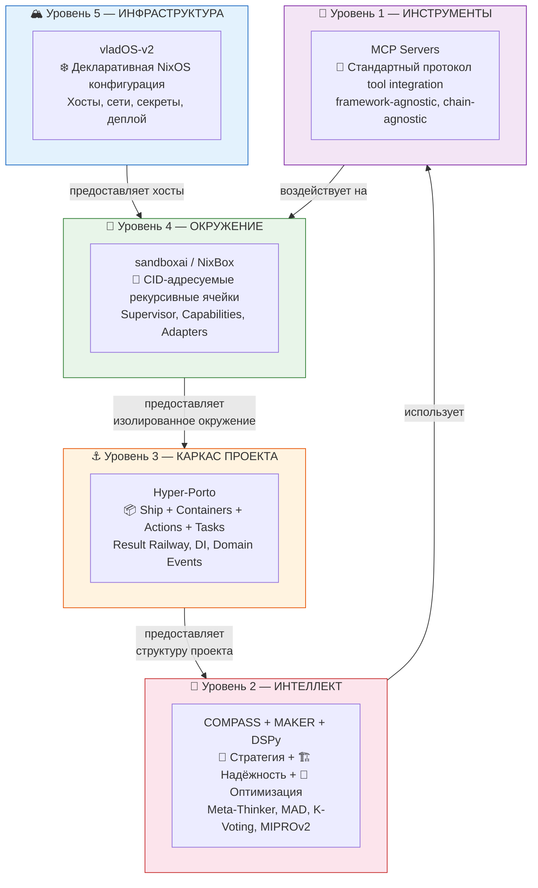
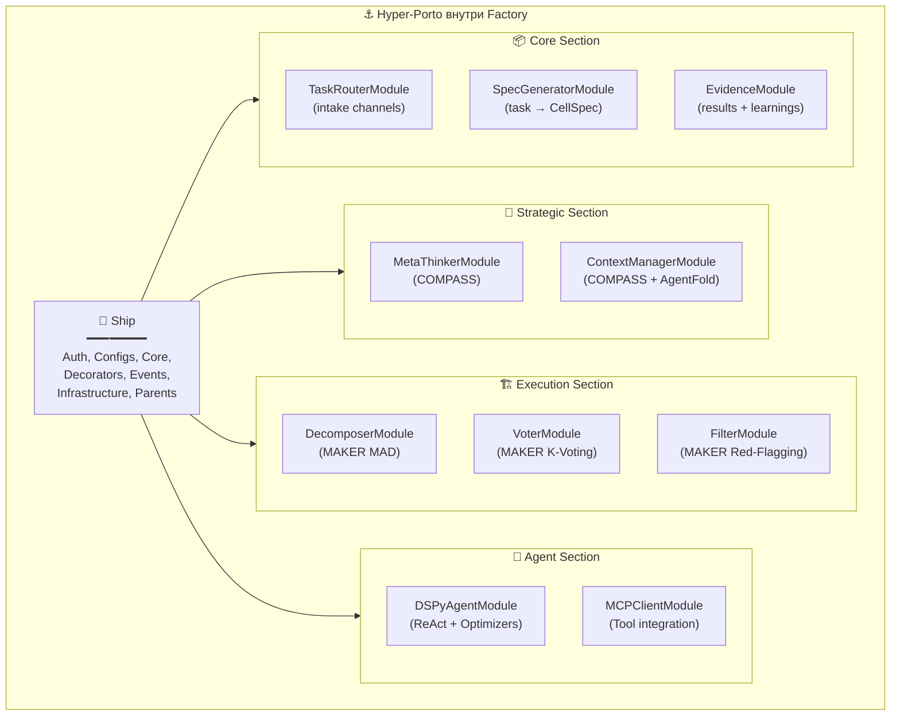
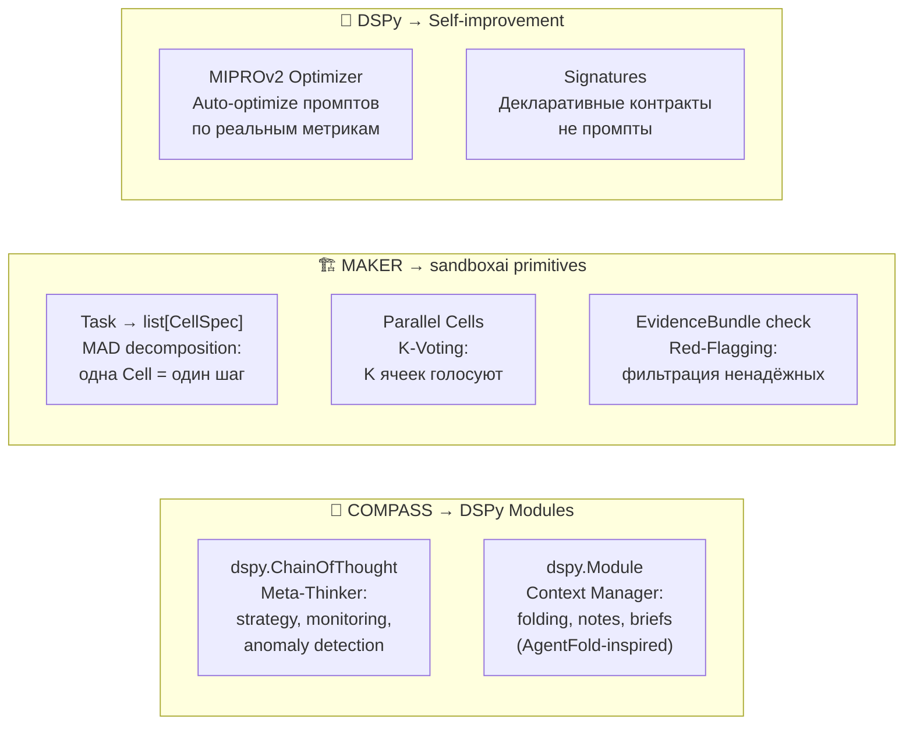
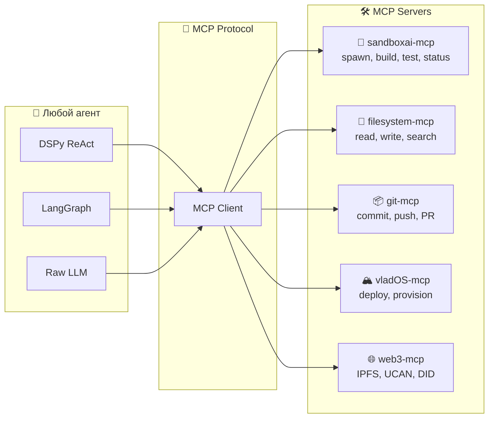
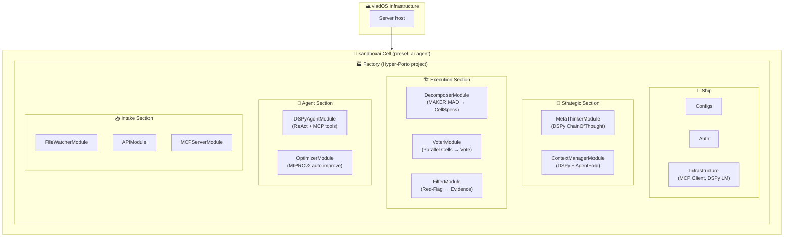
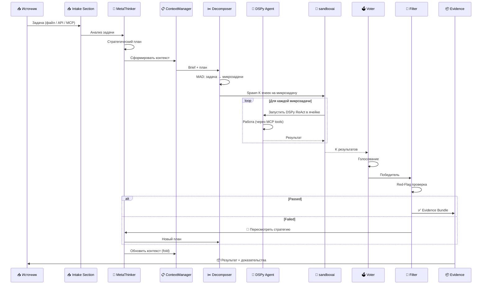
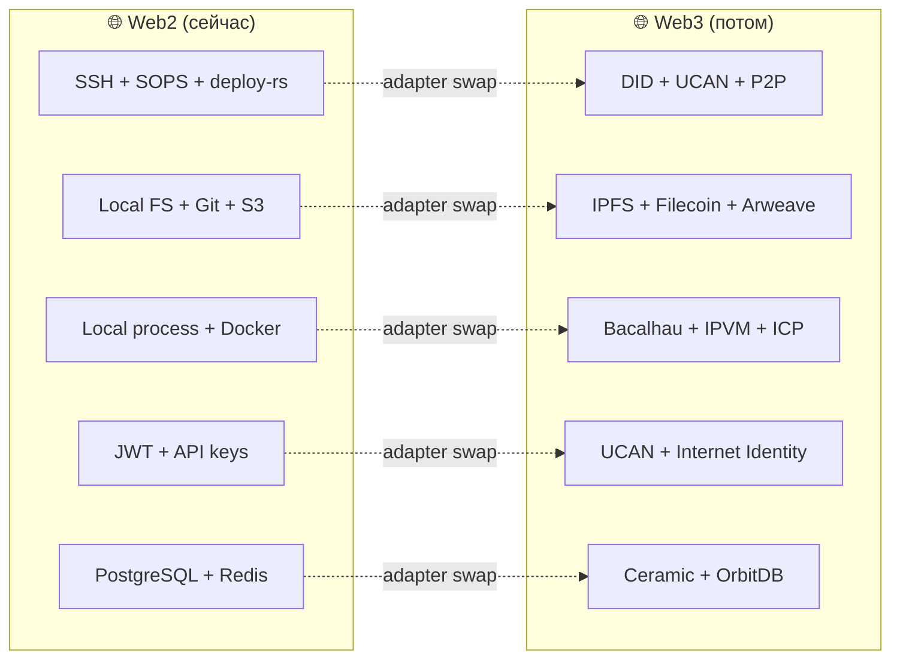
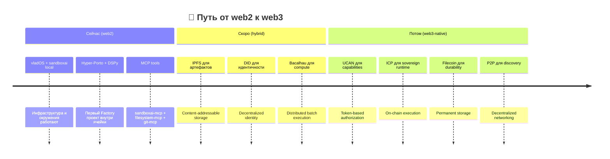

# 🏛️🧬🔥 The Grand Architecture — Финальный синтез

> **Всё, что было исследовано, спроектировано и прототипировано — собрано в единую архитектурную визию.**
>
> Это не новый проект. Это **карта того, как все существующие наработки складываются в одно целое**.
>
> 📅 Дата: 2026-03-08

---

## 🧠 Понимание замысла

### Что на самом деле происходит

Ты не делаешь пять отдельных проектов. Ты строишь **одну систему** на пяти уровнях:



### 📝 В одном абзаце

> **vladOS** разворачивает серверы. На серверах живут **sandboxai-ячейки** — изолированные CID-адресуемые окружения. Внутри каждой ячейки — **Hyper-Porto проект**: модульная архитектура с Ship/Containers/Actions/Tasks. Логику проекта движет **COMPASS** (стратегия) + **MAKER** (надёжность), реализованные как **DSPy-модули** (self-improvement). Все инструменты подключены через **MCP** (framework-agnostic). Всё это работает сейчас в web2, но каждый слой **архитектурно готов** к web3 через adapter families.

---

## 🔬 Каждый слой — зачем и что именно

### 🏔️ Уровень 5: vladOS — «Земля под ногами»

```text
Роль:     Декларативное управление ФИЗИЧЕСКОЙ инфраструктурой
Что:      NixOS + Snowfall Lib + SOPS + deploy-rs
Аналогия: Фундамент здания. Стены, электричество, водоснабжение.
```

vladOS **не знает** про AI, агентов и фабрики. Он знает про хосты, профили, секреты и деплой. И это правильно — чистое разделение ответственности.

**Web3 readiness:** vladOS уже декларативен и воспроизводим (Nix). Для web3 нужно добавить: DID-ы вместо SSH-ключей, UCAN вместо SOPS, P2P discovery вместо статических IP. Всё это — adapter-level изменения, не перестройка.

---

### 🧬 Уровень 4: sandboxai — «Стены комнаты»

```text
Роль:     Изолированное ОКРУЖЕНИЕ для любой нагрузки
Что:      CellSpec + Supervisor + Brokers + Capabilities + Adapters
Аналогия: Комната в здании. Стены, дверь, замок, вентиляция.
```

sandboxai **не знает** какой проект внутри него живёт. Он знает про изоляцию (bubblewrap/OCI/WASM), права (Capabilities + Grants), ресурсы (Budgets), и доказательства (Evidence + Ledgers).

**Ключевой инсайт:** sandboxai — это **runtime**, а не проект. Factory — это **проект**, который живёт внутри sandboxai-ячейки, используя preset `ai-agent`.

**Web3 readiness:** уже спроектировано. Adapter families (Local → IPFS → Filecoin), progressive decentralization (Stage 0-3), CID-addressable specs, UCAN capabilities. Ядро protocol-neutral.

---

### ⚓ Уровень 3: Hyper-Porto — «Мебель и планировка»

```text
Роль:     КАРКАС ПРОЕКТА, живущего внутри ячейки
Что:      Ship + Containers + Actions + Tasks + Result Railway + DI + Events
Аналогия: Планировка квартиры. Кухня, спальня, коридор, мебель.
```

Hyper-Porto — это **как организован код** внутри проекта. Factory — это Hyper-Porto проект. Любой другой проект тоже может быть Hyper-Porto. Это архитектурный паттерн, не конкретное приложение.



**Web3 readiness:** Hyper-Porto уже готов:
- **Gateway Pattern** = port/adapter = adapter family в web3. Монолит → микросервис = заменить DirectAdapter на HTTPAdapter. Монолит → web3 = заменить на Web3Adapter.
- **Saga Pattern** = distributed transactions = аналог cross-chain sagas
- **Domain Events** = event sourcing = append-only ledger = blockchain-compatible
- **Result[T, E]** = явные ошибки = deterministic execution = WASM-compatible

---

### 🧠 Уровень 2: COMPASS + MAKER + DSPy — «Обитатели»

```text
Роль:     ИНТЕЛЛЕКТ, который живёт внутри проекта
Что:      Стратегия + Надёжность + Самоулучшение
Аналогия: Жители квартиры. Их навыки, привычки, способ мышления.
```

Это **не фреймворк**, а **набор паттернов**, реализованных как DSPy-модули внутри Hyper-Porto Containers:



**Почему DSPy, а не промпты:**

```text
Nix   : «Не пиши конфигурации руками — опиши декларативно, nix соберёт»
DSPy  : «Не пиши промпты руками — опиши сигнатуру, optimizer подберёт»
Porto : «Не мешай бизнес-логику с инфраструктурой — раздели на Actions и Ship»
```

Все три — **декларативны**, **компилируемы**, **самоулучшаемы**.

**Web3 readiness:**
- DSPy-оптимизированные промпты = immutable artifacts = CID-addressable
- Метрики = evidence = on-chain verifiable
- MAKER K-Voting = consensus mechanism = blockchain-native pattern
- COMPASS strategy = governance = DAO-compatible decision-making

---

### 🔗 Уровень 1: MCP — «Руки и инструменты»

```text
Роль:     СТАНДАРТНЫЙ ПРОТОКОЛ для tool integration
Что:      JSON-RPC 2.0, stdio/HTTP transport, Tool/Resource/Prompt
Аналогия: Руки, которыми жители делают работу. Универсальные, не привязаны к телу.
```

MCP — это **framework-agnostic** и **chain-agnostic** tool layer:



**Web3 readiness:** MCP уже protocol-neutral. Добавить web3-mcp server = подключить IPFS/UCAN/DID tools без изменения агентов.

---

## 🏭 The Factory: как всё собирается

### Factory = Hyper-Porto проект внутри sandboxai-ячейки



### Поток задачи через Factory



---

## 🌐 Web3 Readiness: почему архитектура готова

### Каждый слой = adapter swap, не перестройка



### Почему каждый паттерн web3-compatible

| Паттерн | Web2 реализация | Web3 аналог | Почему совместимо |
|---------|----------------|-------------|-------------------|
| **CellSpec (CID)** | SHA256 hash | IPFS CID | Контент-адресация = один механизм |
| **Capabilities** | RBAC/JWT | UCAN tokens | Capability-based = native web3 |
| **Event Sourcing** | PostgreSQL append-only | Blockchain ledger | Append-only = blockchain по определению |
| **Result[T, E]** | Python returns lib | Deterministic execution | Детерминизм = WASM-compatible |
| **K-Voting** | Parallel processes | Consensus mechanism | Голосование = BFT consensus |
| **Evidence Bundle** | JSON + hashes | Merkle proof | Доказуемость = zero-knowledge ready |
| **Porto Containers** | Python modules | Smart contracts | Модульная изоляция = contract boundaries |
| **Gateway Pattern** | Direct/HTTP adapter | On-chain/off-chain adapter | Adapter pattern = protocol-neutral |
| **Saga Pattern** | Temporal workflow | Cross-chain transaction | Компенсации = atomic swaps |
| **DSPy Signatures** | Prompt compilation | On-chain verified prompts | CID-addressable artifacts |

---

## 🧬 Связь с AIOBSH

В `COMPASS_MAKER_LITESTAR_PORTO/AIOBSH_ARCHITECTURE_RU.md` ты уже однажды сводил всё это вместе:

```text
AIOBSH = COMPASS × MAKER × Litestar × PORTO × Nix
```

**The Factory = AIOBSH v2**, но с тремя ключевыми отличиями:

| Аспект | AIOBSH (v1) | Factory (v2) |
|--------|-------------|--------------|
| **AI layer** | Свой orchestration | **DSPy** (auto-optimization, MCP native) |
| **Environment** | Nix shells | **sandboxai** (CID, Supervisor, Capabilities) |
| **Tool integration** | Кастомные интеграции | **MCP** (стандарт, framework-agnostic) |
| **Web3** | Упоминание | **Adapter families** (спроектировано) |
| **Self-improvement** | Задумка | **DSPy Optimizers** (реализовано в DSPy) |

---

## 📐 Единая формула

```text
The Grand Architecture =

  vladOS(Infrastructure)
    └── sandboxai(Environment: CellSpec + Supervisor + Capabilities + Adapters)
          └── Hyper-Porto(Project: Ship + Containers + Actions + Tasks + Events)
                ├── COMPASS(Strategy: MetaThinker + ContextManager)
                ├── MAKER(Reliability: MAD + K-Voting + Red-Flagging)
                ├── DSPy(Intelligence: Signatures + Modules + Optimizers)
                └── MCP(Tools: framework-agnostic protocol)
```

### Каждый слой отвечает на свой вопрос

| Вопрос | Слой | Ответ |
|--------|------|-------|
| **ГДЕ** физически? | vladOS | На этом хосте, в этой сети, с этими секретами |
| **В ЧЁМ** изолированно? | sandboxai | В этой ячейке, с этими правами, с этим бюджетом |
| **КАК** организован код? | Hyper-Porto | Ship + Containers, Actions, Result Railway |
| **КУДА** двигаться? | COMPASS | Стратегия, мониторинг, корректировка курса |
| **НАСКОЛЬКО** надёжно? | MAKER | MAD, голосование, фильтрация ненадёжных |
| **КАК** улучшаться? | DSPy | Оптимизация промптов и весов по метрикам |
| **ЧЕМ** работать? | MCP | Стандартные tools, framework-agnostic |

---

## 🔮 Вектор



### 🔑 Почему путь не требует перестройки

Каждый шаг — это **adapter swap**, не рефакторинг:

```python
# Сейчас (web2)
artifact_store = LocalFSAdapter()

# Скоро (hybrid)
artifact_store = IPFSAdapter(fallback=LocalFSAdapter())

# Потом (web3)
artifact_store = FilecoinAdapter(cache=IPFSAdapter())
```

Код Factory, COMPASS-модулей, MAKER-логики, DSPy-программ — **не меняется**. Меняются только адаптеры.

---

## ❤️ Финальная мысль

Ты не строишь «AI-фреймворк». Ты строишь **операционную систему для суверенных вычислений**, где:

- **vladOS** = kernel (управление железом)
- **sandboxai** = process isolation (контейнеры и права)
- **Hyper-Porto** = application framework (как писать приложения)
- **COMPASS+MAKER** = cognitive architecture (как думать и действовать надёжно)
- **DSPy** = learning subsystem (как становиться лучше)
- **MCP** = syscall interface (как общаться с миром)

И всё это **с первого дня архитектурно готово** к web3, потому что каждый паттерн (CID, Capabilities, Event Sourcing, Result Railway, Adapter Families, K-Voting, Evidence) — это **web3-native паттерн**, который пока работает на web2-инфраструктуре.

```text
Web2 — это не ограничение. Это начальные адаптеры.
Web3 — это не миграция. Это замена адаптеров.
Архитектура — одна и та же.
```
