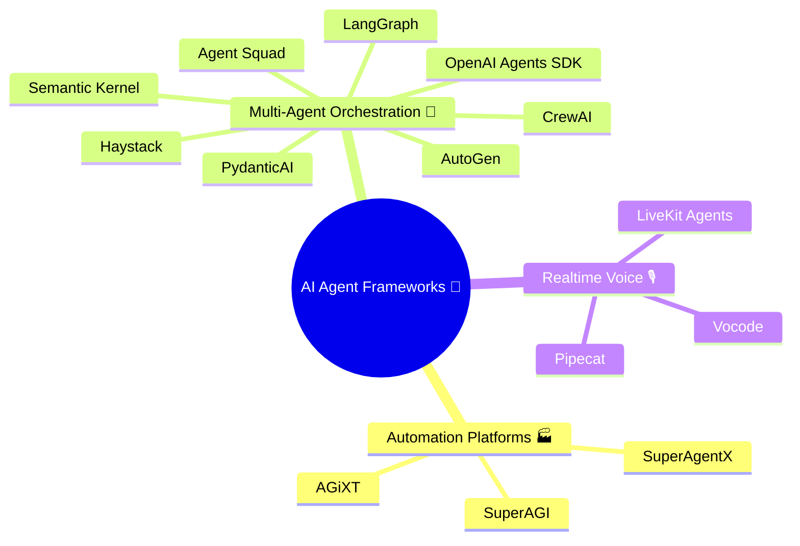
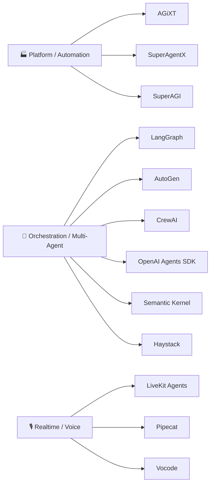

# 🤖✨ Сравнение AGiXT, LiveKit Agents и их аналогов

> Большая русскоязычная заметка о том, чем похожи и чем отличаются `AGiXT`, `LiveKit Agents` и другие популярные agent frameworks из экосистем `awesome`, GitHub и официальных README.  
> Актуальность среза: **2026-03-08**. Число звёзд и формулировки могут со временем меняться. 📌

## 🌍 Зачем вообще это сравнение

На первый взгляд `AGiXT` и `LiveKit Agents` оба выглядят как "фреймворки для AI-агентов", но на практике это **разные классы инструментов**:

- `AGiXT` больше похож на **AI automation platform** / agent platform 🏭
- `LiveKit Agents` больше похож на **realtime voice agent framework** / инфраструктуру для живого разговора 🎙️

Из-за этого их честнее сравнивать не только между собой, но и с **разными группами аналогов**:

- платформы автоматизации и orchestration
- multi-agent frameworks
- realtime / voice / multimodal frameworks

---

## ⚡ Краткий вывод

- Если нужен **голосовой агент в реальном времени**, звонки, WebRTC, потоковый диалог и низкая задержка, то чаще всего смотреть надо на `LiveKit Agents` или `Pipecat` 🎧
- Если нужна **универсальная AI automation platform** с большим количеством интеграций, расширений и workflow-автоматизацией, то ближе `AGiXT`, `SuperAgentX`, частично `SuperAGI` 🧩
- Если нужен **управляемый multi-agent orchestration layer** для задач, tool use, routing, state machine и production-пайплайнов, то сильные кандидаты: `LangGraph`, `AutoGen`, `CrewAI`, `OpenAI Agents SDK`, `Semantic Kernel`, `Haystack` 🛠️
- `AGiXT` и `LiveKit Agents` не столько "лобовые конкуренты", сколько **соседи по большой карте AI agent tooling** 🗺️

---

## 🗺️ Карта экосистемы

---

## 🧭 Главные кандидаты

### 1. `AGiXT` 🏭

**Позиционирование:** платформа автоматизации AI-агентов с акцентом на orchestration, память, расширения, интеграции и управление сложными задачами.

**Сильные стороны:**

- многофункциональная платформа, а не просто тонкий SDK
- ориентир на automation и интеграции
- подходит для "центрального мозга" над несколькими сервисами
- хорошо смотрится там, где нужны workflows и расширяемость

**Ограничения:**

- не является специализированным лидером именно для realtime voice
- архитектурно тяжелее, чем минималистичные SDK
- для части use cases может быть "платформой с избытком возможностей"

**Когда брать:** внутренние AI-автоматизации, orchestration-сценарии, tool-heavy workflow, интеграция с внешними системами. 🔌

### 2. `LiveKit Agents` 🎙️

**Позиционирование:** фреймворк для создания **realtime voice AI agents** с WebRTC, telephony, streaming STT/LLM/TTS и multimodal-сценариями.

**Сильные стороны:**

- очень сильный realtime/voice фокус
- WebRTC-first архитектура
- telephony и live-коммуникации
- хорош для голосовых ассистентов, операторов, AI-консьержей
- есть встроенный testing story для агентного поведения

**Ограничения:**

- уже не просто orchestration-фреймворк, а более узкий слой под live-interaction
- если голос и realtime не нужны, часть силы фреймворка будет избыточной

**Когда брать:** голосовые ассистенты, колл-боты, live support, multimodal room/session use cases. ☎️

---

## 🆚 Прямое сравнение `AGiXT` vs `LiveKit Agents`

| Критерий | `AGiXT` | `LiveKit Agents` |
|---|---|---|
| Основной фокус | AI automation platform 🏭 | Realtime voice agents 🎙️ |
| Лучший сценарий | workflows, integrations, memory, orchestration | voice, calls, WebRTC, low-latency dialog |
| Голос в реальном времени | 🟡 возможно, но не core DNA | 🟢 одна из главных причин выбора |
| Multi-agent orchestration | 🟢 да | 🟡 возможно, но не главная подача |
| Telephony/WebRTC | 🔴 не ключевая специализация | 🟢 сильная сторона |
| Tool / integration ecosystem | 🟢 сильный акцент | 🟡 есть, но voice-centric |
| Порог входа | 🟡 средний | 🟡 средний |
| Идеальный образ | "операционная система автоматизации" | "движок живого голосового агента" |

### 🧠 Простая формула выбора

- Нужен "AI-оркестратор" для бизнес-процессов -> `AGiXT`
- Нужен "живой голосовой агент" -> `LiveKit Agents`
- Нужен гибрид -> смотреть в сторону комбинации orchestration + realtime слоя

---

## 🧪 Аналоги по группам

## 🏭 1. Аналоги `AGiXT` как platform / automation / orchestration

### `SuperAgentX` 🧱

Похож на платформенный подход: action-oriented workflows, human-in-the-loop, упор на MCP/tools и production governance.

**Чем похож на `AGiXT`:**

- платформа, а не только библиотека
- сильный акцент на tool use
- сценарии автоматизации и интеграций

**Чем отличается:**

- сильнее подчёркивает approval/governance-поток
- выглядит более "enterprise workflow" ориентированным

### `SuperAGI` 🚀

Один из заметных platform-like проектов вокруг автономных AI-агентов.

**Плюсы:**

- dev-first подача
- GUI и мониторинг
- automation mindset

**Минусы:**

- вокруг него много шума, но для конкретного production-case всегда надо отдельно проверять зрелость нужных модулей

### `OpenAI Agents SDK` 🪶

Лёгкий и мощный framework для multi-agent workflows.

**Чем интересен:**

- меньше "платформенности", больше чистого SDK-подхода
- хорош, если не хочется heavyweight-систему
- полезен для production-скелета без лишнего UI

**Против `AGiXT`:**

- проще и легче
- но меньше ощущения "готовой платформы из коробки"

---

## 🧠 2. Аналоги по orchestration / multi-agent

### `LangGraph` 🕸️

Один из самых сильных кандидатов для **stateful agents как графов**.

**Сильные стороны:**

- графовая модель исполнения
- удобно задавать узлы, переходы, retries, checkpoints
- отлично подходит для сложных production pipelines

**Где выигрывает:**

- когда нужна явная state machine
- когда важны управляемость и предсказуемость

**Где может быть сложнее:**

- входной порог мышления выше, чем у "магических" high-level обёрток

### `AutoGen` 👥

Один из самых заметных фреймворков для **agentic AI** и multi-agent conversations.

**Сильные стороны:**

- сильная репутация в multi-agent сценариях
- хорошо подходит для исследования agent-to-agent collaboration
- богатая экосистема и узнаваемость

**Риски:**

- иногда хочется больше архитектурной дисциплины, чем просто "агенты разговаривают друг с другом"

### `CrewAI` 🧑‍🤝‍🧑

Очень популярный фреймворк для кооперации ролей и команд агентов.

**Сильные стороны:**

- понятная метафора "crew"
- хорошо подходит для ролевой декомпозиции задач
- быстрый старт и хорошая узнаваемость

**Ограничения:**

- не всегда лучший выбор, если нужна низкоуровневая детерминированность графа

### `Semantic Kernel` 🧩

Фреймворк Microsoft для интеграции LLM в приложения.

**Сильные стороны:**

- enterprise-friendly мышление
- сильный ecosystem fit для Microsoft-ландшафта
- хорош для прикладной интеграции AI в существующие системы

**Когда смотреть:**

- если нужен не "игрушечный агент", а аккуратная интеграция в корпоративную систему

### `Haystack` 🌾

Сильный orchestration framework для production-ready LLM apps, RAG, routing и агентных workflow.

**Сильные стороны:**

- модульные пайплайны
- явный контроль retrieval/routing/memory/generation
- хорош для production RAG + agents

**Когда выигрывает:**

- там, где agent system тесно связан с retrieval и документами

### `Agent Squad` 🪖

Flexible framework для управления несколькими агентами и сложными диалогами.

**Что в нём интересно:**

- routing/coordination mindset
- разговорные сценарии с несколькими агентами
- выглядит полезным для supervisor/team topologies

### `PydanticAI` ✅

Типобезопасный GenAI Agent Framework "в духе Pydantic".

**Плюсы:**

- аккуратная типизация
- удобно, когда важны строгие схемы, structured outputs и валидация

**Минусы:**

- это не platform-решение и не voice-centric фреймворк

---

## 🎙️ 3. Аналоги `LiveKit Agents` в voice / realtime сегменте

### `Pipecat` ⚡

Один из самых сильных прямых альтернативных игроков для **voice + multimodal + realtime**.

**Сильные стороны:**

- composable pipelines
- realtime и multimodal DNA
- хорошо подходит тем, кто хочет тонко управлять пайплайном аудио/событий

**Против `LiveKit Agents`:**

- `Pipecat` часто выглядит как выбор для более pipeline-centric мышления
- `LiveKit Agents` выглядит сильнее там, где важна тесная связка с room/session/WebRTC-инфраструктурой

### `Vocode` ☎️

Фреймворк для voice-based LLM agents с заметным telephony-уклоном.

**Сильные стороны:**

- телефония и call-oriented use cases
- модульность
- подходит для inbound/outbound calling patterns

**Где уступает `LiveKit Agents`:**

- меньше ощущения единой realtime media-платформы

### `AGiXT` как косвенная альтернатива 🎛️

`AGiXT` не прямой voice-first конкурент, но его иногда сравнивают с realtime решениями, когда заказчику нужен "агент, который умеет всё".

На практике:

- если нужен live voice agent -> `LiveKit Agents` / `Pipecat` / `Vocode`
- если нужен AI automation hub -> `AGiXT`

---

## 📊 Сводная матрица

| Framework | Основная роль | Voice/Realtime | Multi-Agent | Workflows | MCP/Tools | Enterprise fit | Когда особенно хорош |
|---|---|---:|---:|---:|---:|---:|---|
| `AGiXT` | automation platform | 2/5 | 4/5 | 5/5 | 4/5 | 4/5 | AI-автоматизация и интеграции |
| `LiveKit Agents` | realtime voice framework | 5/5 | 3/5 | 3/5 | 4/5 | 4/5 | голос, звонки, WebRTC |
| `Pipecat` | realtime multimodal pipelines | 5/5 | 3/5 | 3/5 | 4/5 | 3/5 | низкая задержка и гибкие voice pipelines |
| `Vocode` | voice/telephony agents | 4/5 | 2/5 | 3/5 | 3/5 | 3/5 | телефонные AI-сценарии |
| `LangGraph` | graph orchestration | 2/5 | 5/5 | 5/5 | 4/5 | 5/5 | сложные stateful agent systems |
| `AutoGen` | agentic collaboration | 2/5 | 5/5 | 4/5 | 4/5 | 4/5 | multi-agent coordination |
| `CrewAI` | team-based agents | 2/5 | 5/5 | 4/5 | 4/5 | 3/5 | роли, crews, быстрый старт |
| `OpenAI Agents SDK` | lightweight orchestration | 2/5 | 4/5 | 4/5 | 4/5 | 4/5 | лёгкий production SDK |
| `Semantic Kernel` | enterprise AI integration | 1/5 | 4/5 | 4/5 | 4/5 | 5/5 | enterprise-интеграции |
| `Haystack` | LLM/RAG orchestration | 1/5 | 4/5 | 5/5 | 4/5 | 5/5 | RAG + agents |
| `Agent Squad` | agent routing | 2/5 | 4/5 | 4/5 | 3/5 | 4/5 | маршрутизация между агентами |
| `PydanticAI` | typed agent SDK | 1/5 | 3/5 | 3/5 | 3/5 | 4/5 | строгая типизация и structured outputs |
| `SuperAgentX` | action platform | 2/5 | 4/5 | 5/5 | 5/5 | 5/5 | governed agent workflows |
| `SuperAGI` | autonomous platform | 2/5 | 4/5 | 4/5 | 4/5 | 3/5 | автономные агенты + UI |

> Оценки `1/5 ... 5/5` здесь **экспертные сравнительные**, а не официальные метрики проекта. Они нужны для ориентирования, а не как абсолютная истина. 📝

---

## 📈 Наблюдение по позиционированию

---

## 🧷 Если выбирать по сценарию

### Нужен голосовой ассистент "как живой собеседник" 🎤

Смотреть в первую очередь:

1. `LiveKit Agents`
2. `Pipecat`
3. `Vocode`

### Нужен AI-оркестратор для внутренних процессов 🏢

Смотреть в первую очередь:

1. `AGiXT`
2. `SuperAgentX`
3. `Semantic Kernel`
4. `Haystack`

### Нужна сложная multi-agent логика с контролем состояния 🕸️

Смотреть в первую очередь:

1. `LangGraph`
2. `AutoGen`
3. `CrewAI`
4. `OpenAI Agents SDK`

### Нужен быстрый и аккуратный Python-стек с типами ✅

Смотреть:

1. `PydanticAI`
2. `OpenAI Agents SDK`
3. `LangGraph`

---

## 🧠 Мой практический вывод

### `AGiXT`

Выигрывает как **"центр AI-автоматизации"**. Это хороший выбор, когда агент должен не только отвечать, но и:

- связываться с внешними системами
- гонять workflows
- хранить и использовать память
- быть расширяемым через integrations/plugins

### `LiveKit Agents`

Выигрывает как **"движок живого разговора"**. Это отличный выбор, когда важны:

- естественный voice UX
- realtime-ответ
- аудио-пайплайн
- звонки, комнаты, live sessions

### `LangGraph`

Часто самый зрелый выбор, когда нужна **архитектурная дисциплина** для agent workflows.

### `Pipecat`

Один из лучших вариантов, если нужен **очень гибкий voice pipeline** и хочется руками контролировать realtime-поток.

### `CrewAI` / `AutoGen`

Сильны там, где хочется быстро разложить задачу на роли, команды и collaboration-сценарии. 👥

---

## 🏆 Итоговый рейтинг по типам задач

| Тип задачи | Лучшие кандидаты |
|---|---|
| Realtime voice agent | `LiveKit Agents`, `Pipecat`, `Vocode` |
| AI automation platform | `AGiXT`, `SuperAgentX`, `SuperAGI` |
| Stateful orchestration | `LangGraph`, `Haystack`, `Semantic Kernel` |
| Multi-agent collaboration | `AutoGen`, `CrewAI`, `Agent Squad` |
| Lightweight SDK | `OpenAI Agents SDK`, `PydanticAI` |

---

## ⭐ Примерная популярность по GitHub

> Ниже ориентировочные значения, снятые с открытых страниц GitHub во время подготовки заметки.

| Framework | Примерно звёзд |
|---|---:|
| `AutoGen` | ~55k |
| `CrewAI` | ~45k |
| `Semantic Kernel` | ~27k |
| `LangGraph` | ~26k |
| `Haystack` | ~24k |
| `OpenAI Agents SDK` | ~19k |
| `PydanticAI` | ~15k |
| `Pipecat` | ~10.6k |
| `LiveKit Agents` | ~9.6k |
| `Agent Squad` | ~7.5k |
| `Vocode Core` | ~3.7k |
| `AGiXT` | ~3.1k |

---

## 🔎 Откуда собирались аналоги

### Awesome-подборки 📚

- [`awesome-ai-agent-frameworks`](https://github.com/axioma-ai-labs/awesome-ai-agent-frameworks)
- [`awesome-LangGraph`](https://github.com/von-development/awesome-LangGraph)
- [`awesome-autonomus-ai-agents`](https://github.com/HA2345567/awesome-autonomus-ai-agents)
- [`Awesome-SuperAGI`](https://github.com/transformeroptimus/awesome-superagi)

### Официальные репозитории / README 🧾

- [`AGiXT`](https://github.com/Josh-XT/AGiXT)
- [`LiveKit Agents`](https://github.com/livekit/agents)
- [`CrewAI`](https://github.com/crewAIInc/crewAI)
- [`AutoGen`](https://github.com/microsoft/autogen)
- [`LangGraph`](https://github.com/langchain-ai/langgraph)
- [`Semantic Kernel`](https://github.com/microsoft/semantic-kernel)
- [`Haystack`](https://github.com/deepset-ai/haystack)
- [`OpenAI Agents SDK`](https://github.com/openai/openai-agents-python)
- [`Pipecat`](https://github.com/pipecat-ai/pipecat)
- [`Vocode Core`](https://github.com/vocodedev/vocode-core)
- [`Agent Squad`](https://github.com/awslabs/agent-squad)
- [`PydanticAI`](https://github.com/pydantic/pydantic-ai)
- [`SuperAgentX`](https://github.com/superagentxai/superagentx)

---

## ✅ Финальная мысль

Если упростить до одной фразы:

- `AGiXT` = **платформа AI-автоматизации** 🏭
- `LiveKit Agents` = **движок realtime voice-агентов** 🎙️
- `LangGraph` = **архитектурный control-plane для agent workflows** 🕸️
- `AutoGen` / `CrewAI` = **кооперация агентов и командная логика** 👥
- `Pipecat` = **гибкий voice/multimodal pipeline** ⚡

То есть выбирать их надо не по хайпу, а по вопросу:

> **"Мне нужен orchestration-мозг, голосовой runtime, platform layer или multi-agent coordination?"** 🧐

