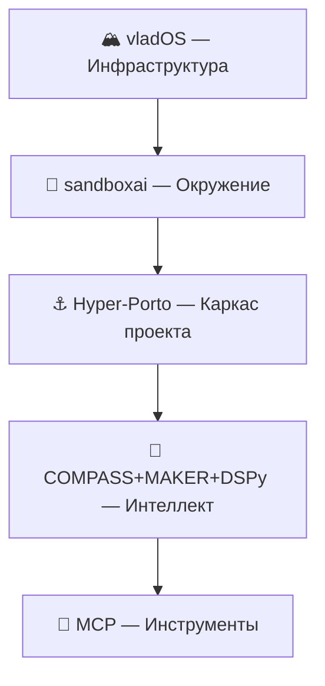

# 🏭🧬🔭 Research: The Factory — AI-фреймворк для экосистемы vladOS + sandboxai

> Серия исследовательских заметок о проектировании **AI-фабрики** — недостающего звена между инфраструктурным каркасом (`vladOS-v2`) и модульно-окруженческим каркасом (`sandboxai / NixBox`).
>
> 📅 Дата: 2026-03-08

---

## 🗺️ Навигация

| # | Документ | О чём | Ключевые темы |
|---|----------|-------|---------------|
| 🔭 | [01-META-ANALYSIS.md](./01-META-ANALYSIS.md) | Мета-анализ vladOS + sandboxai | North star, вектор, эволюция, три кита экосистемы |
| 🏭 | [02-THE-FACTORY.md](./02-THE-FACTORY.md) | Что такое The Factory и зачем | Требования, архитектура, MCP, жизненный цикл, MVP |
| 🔌 | [03-FRAMEWORK-SELECTION.md](./03-FRAMEWORK-SELECTION.md) | Выбор AI-фреймворка | Multi-Adapter стратегия, roadmap |
| 🧪 | [04-DSPY-DEEP-DIVE.md](./04-DSPY-DEEP-DIVE.md) | **DSPy — глубокое погружение** | Optimizers, Signatures, Modules, MCP, self-improvement |
| 🔗 | [05-PRIOR-RESEARCH-LINK.md](./05-PRIOR-RESEARCH-LINK.md) | **Связь с COMPASS/MAKER/TRIFORCE** | Стратегия, надёжность, AgentFold, Hyper-Porto |
| 🏛️ | [06-GRAND-ARCHITECTURE.md](./06-GRAND-ARCHITECTURE.md) | **🔥 ФИНАЛЬНЫЙ СИНТЕЗ** | 5 уровней, единая формула, web3 readiness |

---

## 🧬 Контекст

## 🎯 Главный вывод

> **5 уровней одной системы:**
>
> 1. **vladOS** разворачивает серверы
> 2. **sandboxai** создаёт изолированные ячейки-окружения
> 3. **Hyper-Porto** организует код проекта внутри ячейки (Ship + Containers)
> 4. **COMPASS + MAKER + DSPy** дают стратегию, надёжность и самоулучшение
> 5. **MCP** подключает инструменты framework-agnostic
>
> **Factory = Hyper-Porto проект внутри sandboxai-ячейки.** Не вшитый CellKind.
>
> Web2 — начальные адаптеры. Web3 — замена адаптеров. Архитектура — одна и та же. 🏛️
