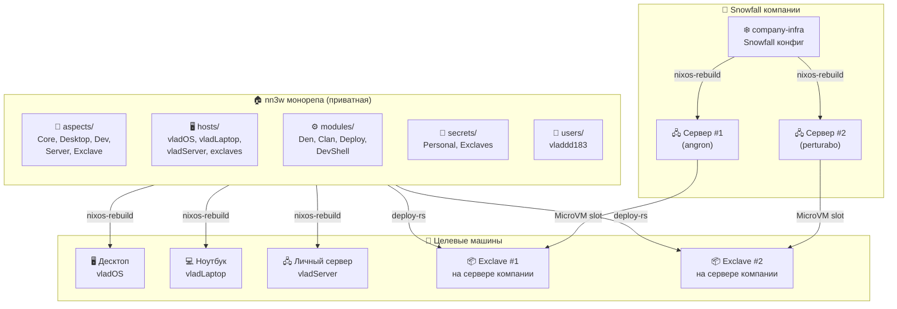
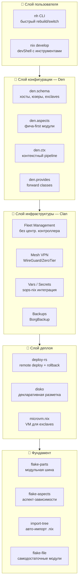
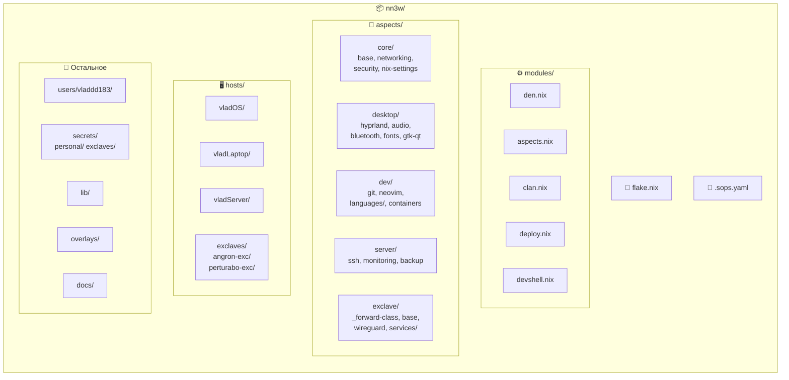
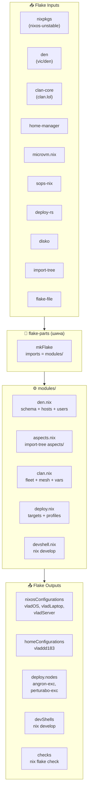
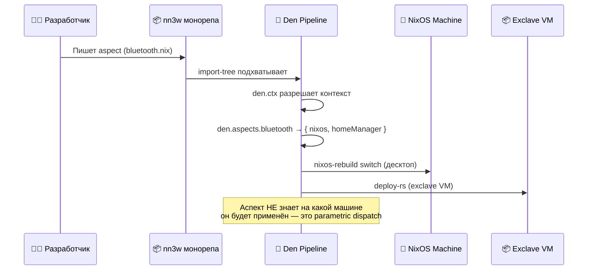
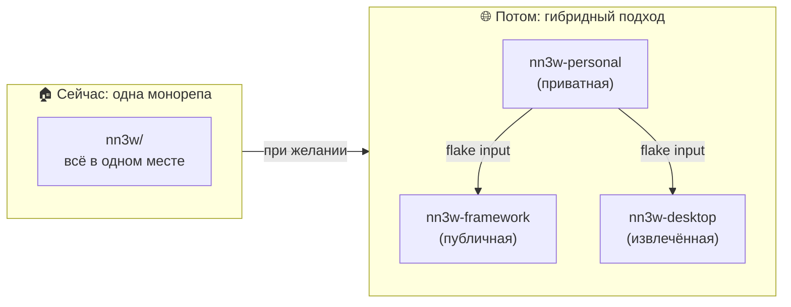
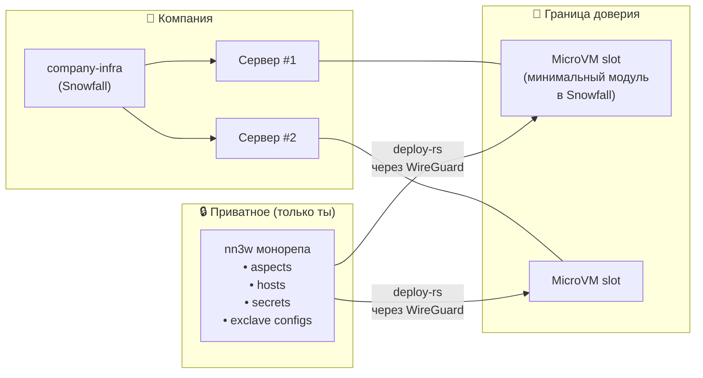

# 🏛️ nn3w — Архитектура монорепы

> **nn3w** — приватная монорепа на Den для управления всей личной инфраструктурой.
> Десктоп, ноутбук, личный сервер, exclaves на серверах компании.
> Каждый модуль — самодостаточный и готов к выносу в отдельную репу.

---

## 📐 Принципы проектирования

| Принцип | Суть | Почему важно |
|:---|:---|:---|
| 🧩 **Extractability-first** | Каждый aspect — self-contained flake-parts модуль | В любой момент вынести в отдельную репу без рефакторинга |
| 🎯 **Aspect-oriented** | Конфиг по фичам (bluetooth, dev-tools), не по хостам | Одна фича = один файл, работает на всех платформах |
| ⚙️ **Parametric** | Aspects — функции от контекста `{ host, user }` | Нет хардкода имён хостов/юзеров, всё переиспользуемо |
| 🔐 **Trust isolation** | Exclave-секреты зашифрованы только личными ключами | Компания физически не может прочитать содержимое |
| 📏 **Flexible resources** | Exclaves без жёстких лимитов по умолчанию | Используешь все ресурсы сервера, ограничиваешь только при желании |
| 🔄 **Declarative everything** | Вся инфраструктура = Nix-код в git | Воспроизводимость, аудируемость, откат |

---

## 🗺️ Общая картина



---

## 🧱 Стек технологий



### 📋 Конкретные версии и роли

| Компонент | Версия | Роль в стеке |
|:---|:---:|:---|
| **Den** | v0.12+ | Ядро конфигурации: schema, aspects, ctx pipeline, custom forward classes |
| **flake-aspects** | v0.7+ | Composable cross-class зависимости между аспектами |
| **flake-file** | latest | Модули декларируют свои flake inputs (для будущего извлечения) |
| **import-tree** | latest | Авто-импорт .nix файлов из директорий |
| **Clan** | 25.11 | Fleet management, mesh VPN, vars/secrets, backups |
| **microvm.nix** | latest | Декларативные VM для exclaves на серверах компании |
| **sops-nix** | latest | Шифрованные секреты per trust domain (age/GPG) |
| **deploy-rs** | latest | Remote deployment в exclaves с magic rollback |
| **disko** | latest | Декларативная разметка дисков (LUKS, Btrfs, subvolumes) |
| **flake-parts** | latest | Модульная шина — всё стыкуется через него |

---

## 📁 Структура монорепы



### 📂 Подробная файловая структура

```
nn3w/
├── 📄 flake.nix                        # Корневой flake: inputs + import-tree modules/
├── 📄 flake.lock                       # Зафиксированные версии зависимостей
├── 🔑 .sops.yaml                       # sops-nix: правила шифрования по путям
│
├── ⚙️ modules/                         # flake-parts модули (wiring)
│   ├── den.nix                         # Den schema: hosts, users, exclaves
│   ├── aspects.nix                     # Подключение aspects → hosts
│   ├── clan.nix                        # Clan fleet, mesh, vars, backups
│   ├── deploy.nix                      # deploy-rs targets для exclaves
│   └── devshell.nix                    # nix develop — инструменты разработки
│
├── 🧩 aspects/                         # Den aspects (ИЗВЛЕКАЕМЫЕ МОДУЛИ)
│   │
│   ├── core/                           # ── будущая репа: nn3w-core ──
│   │   ├── base.nix                    #   locale, timezone, nix daemon
│   │   ├── networking.nix              #   NetworkManager, firewall базовый
│   │   ├── security.nix                #   sudo, PAM, hardening
│   │   └── nix-settings.nix            #   nix.conf, substituters, gc
│   │
│   ├── desktop/                        # ── будущая репа: nn3w-desktop ──
│   │   ├── hyprland.nix                #   Wayland compositor + конфиг
│   │   ├── audio.nix                   #   Pipewire + WirePlumber
│   │   ├── bluetooth.nix              #   Bluez + Blueman
│   │   ├── fonts.nix                   #   Nerd Fonts, системные шрифты
│   │   └── gtk-qt.nix                  #   GTK/Qt темы, курсоры, иконки
│   │
│   ├── dev/                            # ── будущая репа: nn3w-dev ──
│   │   ├── git.nix                     #   Git + lazygit + delta
│   │   ├── neovim.nix                  #   Neovim + плагины
│   │   ├── languages/                  #   Языковые тулчейны
│   │   │   ├── nix.nix                 #     nil, nixd, alejandra
│   │   │   ├── rust.nix                #     rustup, cargo, rust-analyzer
│   │   │   └── python.nix              #     python3, poetry, ruff
│   │   └── containers.nix              #   Docker/Podman + compose
│   │
│   ├── server/                         # ── будущая репа: nn3w-server ──
│   │   ├── ssh.nix                     #   OpenSSH server + hardening
│   │   ├── monitoring.nix              #   Prometheus + node-exporter
│   │   └── backup.nix                  #   BorgBackup + scheduling
│   │
│   └── exclave/                        # ── будущая репа: nn3w-exclave ──
│       ├── _forward-class.nix          #   Den custom forward class: exclave
│       ├── base.nix                    #   Базовый конфиг exclave VM
│       ├── wireguard.nix               #   WG tunnel в личный mesh
│       └── services/                   #   Сервисы для exclaves
│           ├── nextcloud.nix           #     Nextcloud + PostgreSQL
│           ├── gitea.nix               #     Gitea + runner
│           └── media.nix               #     Jellyfin / Plex
│
├── 🖥️ hosts/                           # Определения хостов (hardware + выбор aspects)
│   ├── vladOS/                         # 🖥️ Десктоп
│   │   ├── default.nix                 #   Den host: aspects, users
│   │   ├── hardware.nix                #   hardware-configuration.nix
│   │   └── disko.nix                   #   Разметка диска (LUKS + Btrfs)
│   ├── vladLaptop/                     # 💻 Ноутбук
│   │   ├── default.nix
│   │   ├── hardware.nix
│   │   └── disko.nix
│   ├── vladServer/                     # 🖧 Личный сервер
│   │   ├── default.nix
│   │   ├── hardware.nix
│   │   └── disko.nix
│   └── exclaves/                       # 📦 Exclaves на серверах компании
│       ├── angron-exc/                 #   Exclave на сервере #1
│       │   └── default.nix
│       └── perturabo-exc/              #   Exclave на сервере #2
│           └── default.nix
│
├── 👤 users/
│   └── vladdd183/
│       └── default.nix                 # User aspect: shell, пакеты, home
│
├── 🔐 secrets/
│   ├── personal/                       # Зашифровано личным age-ключом
│   │   ├── common.yaml                 #   Общие секреты (API keys, tokens)
│   │   └── wireguard.yaml              #   WireGuard private keys
│   └── exclaves/                       # Зашифровано exclave-ключами
│       ├── angron.yaml                 #   Секреты для exclave #1
│       └── perturabo.yaml              #   Секреты для exclave #2
│
├── 📚 lib/                             # Общие Nix-функции
│   ├── default.nix
│   └── exclave.nix                     # Хелперы для exclave-конфигурации
│
├── 🔧 overlays/
│   └── default.nix                     # Nixpkgs overlays
│
└── 📖 docs/                            # Документация (ты здесь)
    ├── 00-architecture.md
    ├── 01-extractable-modules.md
    ├── 02-den-configuration.md
    ├── 03-exclave-mechanism.md
    ├── 04-networking.md
    ├── 05-secrets.md
    ├── 06-deployment.md
    └── 07-roadmap.md
```

---

## 🔄 Потоки данных

### Как flake.nix связывает всё вместе



### Жизненный цикл аспекта: от кода до машины



---

## 🏗️ Роль каждой директории

| Директория | Роль | Извлекаемая? | Зависит от |
|:---|:---|:---:|:---|
| `modules/` | Wiring — связывает Den, Clan, deploy | ❌ Нет | Всё остальное |
| `aspects/core/` | Базовые NixOS настройки | ✅ Да | Ничего |
| `aspects/desktop/` | GUI, аудио, Wayland | ✅ Да | core/ |
| `aspects/dev/` | Инструменты разработки | ✅ Да | core/ |
| `aspects/server/` | Серверные сервисы | ✅ Да | core/ |
| `aspects/exclave/` | Exclave-механизм: forward class, WG, сервисы | ✅ Да | core/, server/ |
| `hosts/` | Hardware + выбор aspects для каждой машины | ❌ Нет | aspects/ |
| `users/` | User-level конфиг | ❌ Нет | aspects/ |
| `secrets/` | Зашифрованные данные | ❌ Нет | hosts/ |
| `lib/` | Общие хелпер-функции | ✅ Да | Ничего |
| `overlays/` | Nixpkgs патчи | ✅ Да | Ничего |

---

## 🔑 Ключевые архитектурные решения

### 1. Почему Den, а не Snowfall?

| Критерий | Snowfall | Den | Почему критично |
|:---|:---|:---|:---|
| Кастомные классы | ❌ | ✅ `den.provides.forward` | Exclave как first-class concept |
| Кросс-flake шаринг | ❌ | ✅ Namespaces | Извлечение модулей в отдельные репы |
| Parametric dispatch | ❌ | ✅ `den.ctx` | Аспекты без хардкода имён |
| Совместимость с flake-parts | ❌ | ✅ Нативная | Clan, std, treefmt — всё через flake-parts |
| Библиотечный режим | ❌ | ✅ `den.lib` | Не-OS домены (Terranix, NixVim) |

> ❄️ Snowfall остаётся в Snowfall-конфиге **компании**. Мы его не трогаем.
> 🌿 Den используется только в **нашей личной** монорепе.

### 2. Почему монорепа, а не мультирепа?



**Сейчас** — монорепа, потому что:
- Проще разрабатывать (один `nix flake update`, один lock-файл)
- Атомарные изменения (aspect + host в одном коммите)
- Нет overhead на координацию между репами

**Потом** — извлекаем что нужно, потому что:
- Каждый aspect уже self-contained (extractability-first)
- `flake-file` позволяет модулю нести свои inputs
- `import-tree` позволяет cherry-pick из любого источника
- Den namespaces (`den.ful.*`) для кросс-flake шаринга

### 3. Взаимодействие с компанией



**Что делает компания:** добавляет один NixOS-модуль `exclave-slots.nix` в свой Snowfall — создаёт MicroVM slot с TAP interface и диском.

**Что делаешь ты:** деплоишь содержимое VM из своей монорепы. Компания видит VM и ресурсы, но НЕ содержимое (LUKS).

---

## 📊 Матрица: что где живёт

| Сущность | nn3w (приватная) | Company Snowfall | Exclave VM |
|:---|:---:|:---:|:---:|
| Den aspects | ✅ | — | — |
| Host definitions | ✅ | — | — |
| User configs | ✅ | — | — |
| Exclave definitions | ✅ | — | — |
| Personal secrets | ✅ (sops) | — | — |
| Exclave secrets | ✅ (sops) | — | 🔓 расшифр. |
| MicroVM slot config | — | ✅ | — |
| Exclave NixOS | ✅ (собирает) | — | 🏃 работает |
| WireGuard tunnel | ✅ (инициирует) | — | ✅ (терминирует) |
| Clan mesh | ✅ (управляет) | — | ✅ (участник) |

---

## 🔗 Связанные документы

| Документ | Тема |
|:---|:---|
| [01-extractable-modules.md](01-extractable-modules.md) | 🧩 Паттерн извлечения модулей в отдельные репы |
| [02-den-configuration.md](02-den-configuration.md) | 🌿 Den schema, aspects, ctx, forward classes |
| [03-exclave-mechanism.md](03-exclave-mechanism.md) | 📦 Exclave: MicroVM, LUKS, уровни изоляции |
| [04-networking.md](04-networking.md) | 🌐 Clan mesh, WireGuard, топология |
| [05-secrets.md](05-secrets.md) | 🔐 sops-nix, мульти-ключи, trust isolation |
| [06-deployment.md](06-deployment.md) | 🚀 deploy-rs, Clan, стратегии деплоя |
| [07-roadmap.md](07-roadmap.md) | 📋 Фазы миграции, порядок действий |
