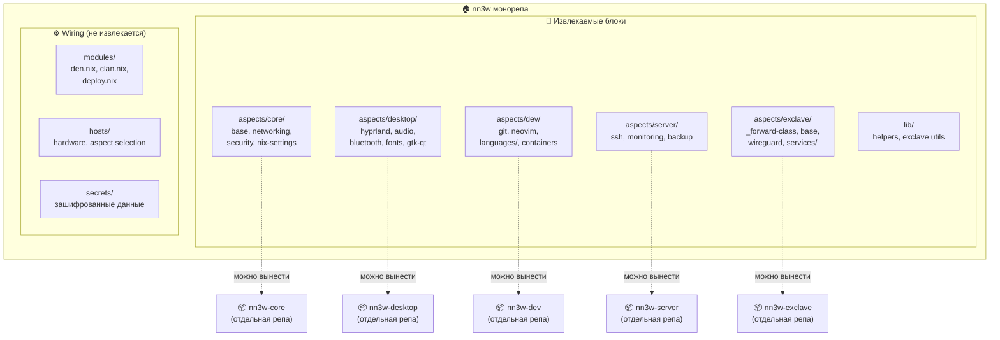
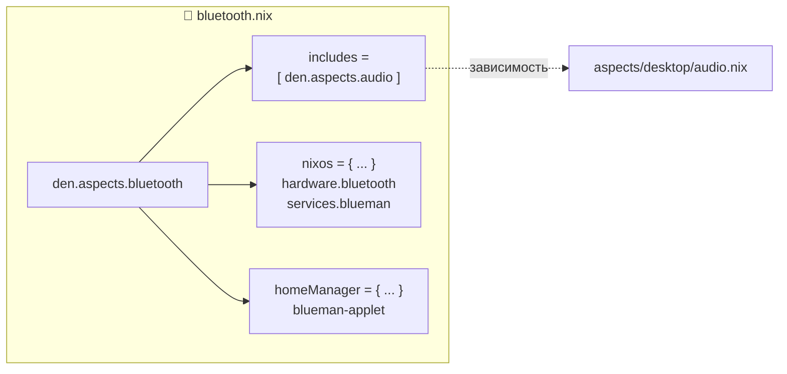
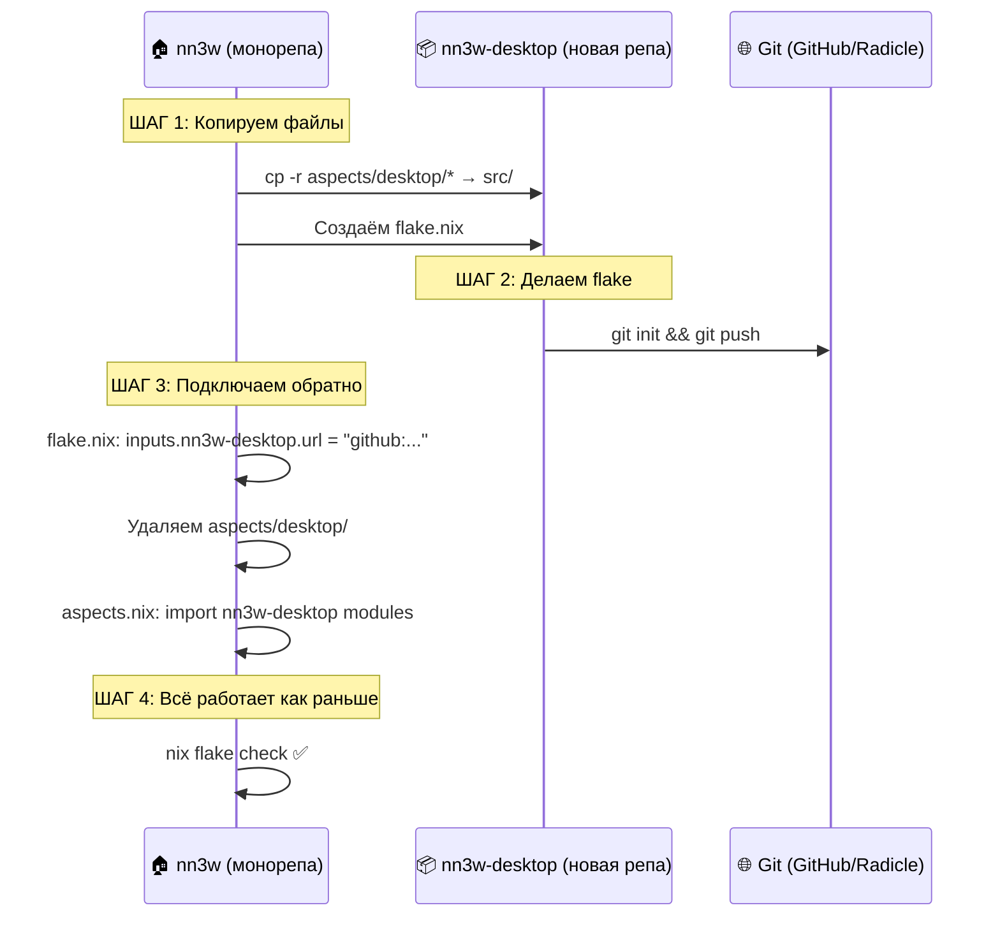
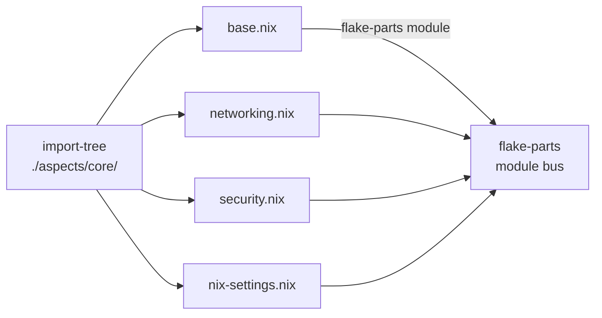
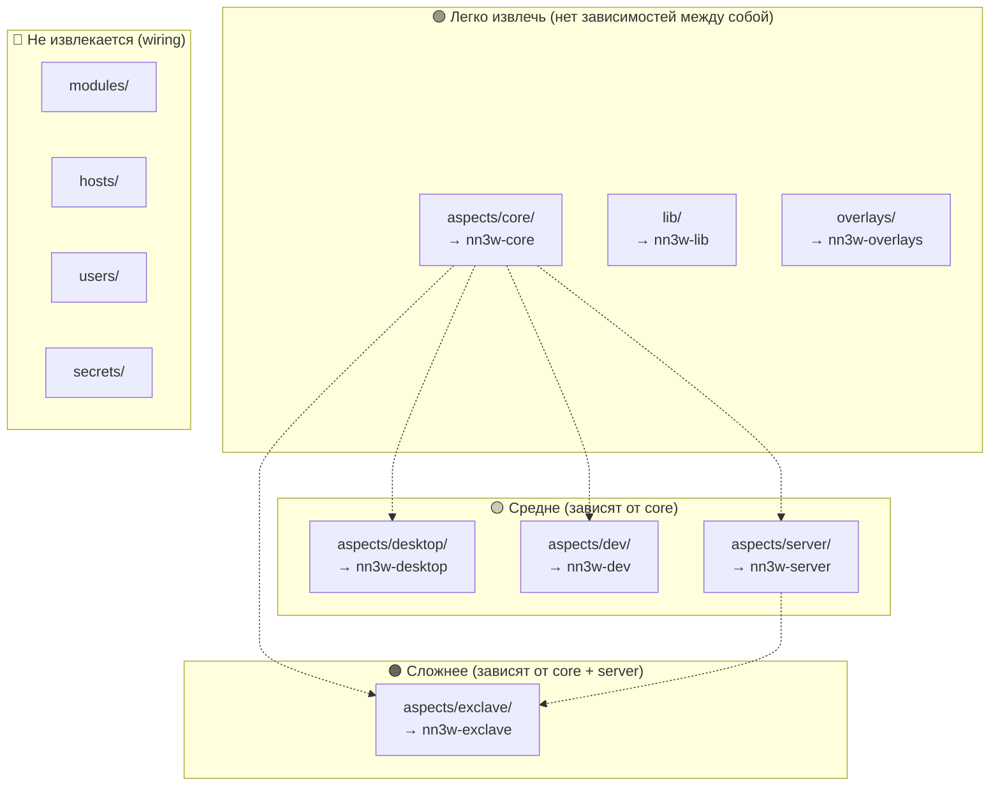
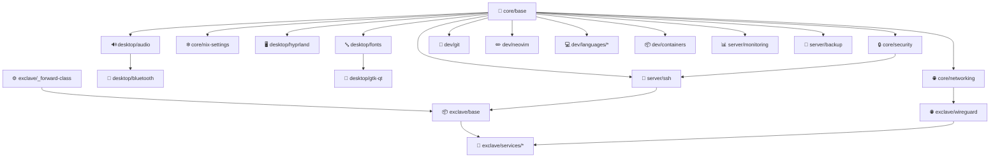

# 🧩 Извлекаемые модули — Extractability-First паттерн

> **Суть:** Каждая директория в `aspects/` — самодостаточный набор flake-parts модулей.
> В любой момент можно вынести её в отдельный репозиторий, а в монорепе
> подключить обратно через flake input. Без рефакторинга, без боли.

---

## 🎯 Зачем это нужно

| Проблема | Как решает extractability |
|:---|:---|
| 🔒 Хочу расшарить `dev/` аспекты с коллегой | Выносишь `aspects/dev/` в публичную репу |
| 🌐 Хочу сделать open-source фреймворк | Выносишь `aspects/core/` + `aspects/exclave/` + `lib/` |
| 🏢 Компания хочет использовать мои наработки | Выносишь нужные аспекты, компания подключает через input |
| 📦 Монорепа стала слишком большой | Выносишь крупные блоки, оставляя wiring |

---

## 🏗️ Архитектура: модуль как единица извлечения



---

## 📏 Правила написания извлекаемого модуля

### ✅ Что ДЕЛАТЬ

| Правило | Пример | Почему |
|:---|:---|:---|
| Использовать `den.ctx` для контекста | `{ host, user, ... }:` | Не привязан к конкретному хосту |
| Один аспект = один файл | `bluetooth.nix` | Гранулярная переиспользуемость |
| Зависимости через `includes` | `includes = [ den.aspects.audio ]` | Явные, прослеживаемые связи |
| Параметрические значения | `{ OS, ... }: { nixos = ...; darwin = ...; }` | Работает на любой платформе |
| Валидный flake-parts модуль | `{ ... }: { den.aspects.X = ...; }` | Можно импортировать откуда угодно |

### ❌ Чего НЕ делать

| Антипаттерн | Почему плохо | Как правильно |
|:---|:---|:---|
| `den.hosts.vladOS.nixos.hardware.bluetooth` | Хардкод имени хоста | `den.aspects.bluetooth = { nixos = ...; }` |
| `users.users.vladdd183.packages = [...]` | Хардкод имени юзера | `den.aspects.X.user = { packages = [...]; }` |
| `import ../hosts/vladOS/hardware.nix` | Relative import вне aspect | Использовать `den.ctx` |
| Секреты внутри aspect-файла | Утечка при извлечении | Секреты в `secrets/`, ссылка через sops |

---

## 🔬 Анатомия извлекаемого модуля

### Пример: `aspects/desktop/bluetooth.nix`

```nix
# Это валидный flake-parts модуль.
# Не знает на каком хосте будет применён.
# Не знает имя пользователя.
# Работает на NixOS и (при желании) Darwin.
{ ... }:
{
  den.aspects.bluetooth = {
    # Зависимость — аудио нужен для A2DP профиля
    includes = [ den.aspects.audio ];

    # NixOS-часть аспекта
    nixos = { pkgs, ... }: {
      hardware.bluetooth = {
        enable = true;
        powerOnBoot = true;
        settings.General.Experimental = true;
      };
      services.blueman.enable = true;
    };

    # Home-Manager часть аспекта
    homeManager = { ... }: {
      services.blueman-applet.enable = true;
    };
  };
}
```

### Что делает этот модуль самодостаточным:



- ✅ Знает свои зависимости (`includes`)
- ✅ Содержит конфиг для всех классов (nixos + homeManager)
- ❌ Не знает имя хоста
- ❌ Не знает имя пользователя
- ❌ Не содержит секретов

---

## 🔄 Процесс извлечения: шаг за шагом

### Сценарий: выносим `aspects/desktop/` в отдельную репу



### ШАГ 1: Структура новой репы

```
nn3w-desktop/
├── flake.nix           # Inputs: den, flake-parts
├── flake.lock
└── aspects/
    ├── hyprland.nix
    ├── audio.nix
    ├── bluetooth.nix
    ├── fonts.nix
    └── gtk-qt.nix
```

### ШАГ 2: flake.nix извлечённой репы

```nix
{
  description = "nn3w desktop aspects — Wayland, audio, bluetooth, theming";

  inputs = {
    flake-parts.url = "github:hercules-ci/flake-parts";
    den.url = "github:vic/den";
    import-tree.url = "github:vic/import-tree";
  };

  outputs = inputs:
    inputs.flake-parts.lib.mkFlake { inherit inputs; } {
      imports = [
        inputs.den.flakeModule
        # Импортируем все .nix из aspects/
        (inputs.import-tree.importTree ./aspects)
      ];
    };
}
```

### ШАГ 3: Подключение в монорепе

```nix
# nn3w/flake.nix — добавляем input
{
  inputs = {
    # ... остальные inputs ...
    nn3w-desktop.url = "github:vladdd183/nn3w-desktop";
  };

  outputs = inputs:
    inputs.flake-parts.lib.mkFlake { inherit inputs; } {
      imports = [
        # Раньше: (inputs.import-tree.importTree ./aspects/desktop)
        # Теперь: импорт из отдельной репы
        inputs.nn3w-desktop.flakeModule
        # Остальные aspects по-прежнему локальные
        (inputs.import-tree.importTree ./aspects/core)
        (inputs.import-tree.importTree ./aspects/dev)
        (inputs.import-tree.importTree ./aspects/server)
        (inputs.import-tree.importTree ./aspects/exclave)
      ];
    };
}
```

---

## 🧰 Инструменты, обеспечивающие extractability

### 📦 import-tree — авто-импорт файлов



`import-tree` рекурсивно обходит директорию и импортирует каждый `.nix` файл как flake-parts модуль. Не нужно поддерживать список импортов — кинул файл, он подхватился.

### 📄 flake-file — модуль несёт свои inputs

```nix
# aspects/dev/neovim.nix
{ inputs, ... }:
{
  # flake-file позволяет модулю декларировать свои inputs
  flake.file.inputs.nixvim.url = "github:nix-community/nixvim";

  den.aspects.neovim = {
    homeManager = { ... }: {
      imports = [ inputs.nixvim.homeManagerModules.nixvim ];
      programs.nixvim.enable = true;
    };
  };
}
```

Когда этот модуль извлекается в отдельную репу, его input (`nixvim`) уже задекларирован — не нужно вспоминать что ему требуется.

### 🌿 Den namespaces (`den.ful.*`) — кросс-flake шаринг

```nix
# В извлечённой репе nn3w-desktop:
den.ful.nn3w.desktop.hyprland = { ... };
den.ful.nn3w.desktop.audio = { ... };

# В монорепе после извлечения:
den.aspects.vladOS-desktop = {
  includes = [
    den.ful.nn3w.desktop.hyprland
    den.ful.nn3w.desktop.audio
  ];
};
```

---

## 📋 Карта извлечения: что можно вынести



### Граф зависимостей аспектов



---

## ⚡ Быстрый чеклист: мой модуль извлекаем?

- [ ] Файл — валидный flake-parts модуль (`{ ... }: { den.aspects.X = ...; }`)
- [ ] Нет хардкода имён хостов (`vladOS`, `angron`)
- [ ] Нет хардкода имён пользователей (`vladdd183`)
- [ ] Нет `import` путей вне своей директории
- [ ] Нет секретов внутри файла
- [ ] Зависимости заявлены через `includes`
- [ ] (Опционально) Inputs через `flake-file`
- [ ] Работает с `nix flake check` при изолированном тестировании

---

## 🔗 Связанные документы

| Документ | Тема |
|:---|:---|
| [00-architecture.md](00-architecture.md) | 🏛️ Общая архитектура монорепы |
| [02-den-configuration.md](02-den-configuration.md) | 🌿 Den aspects, schema, ctx — как писать аспекты |
