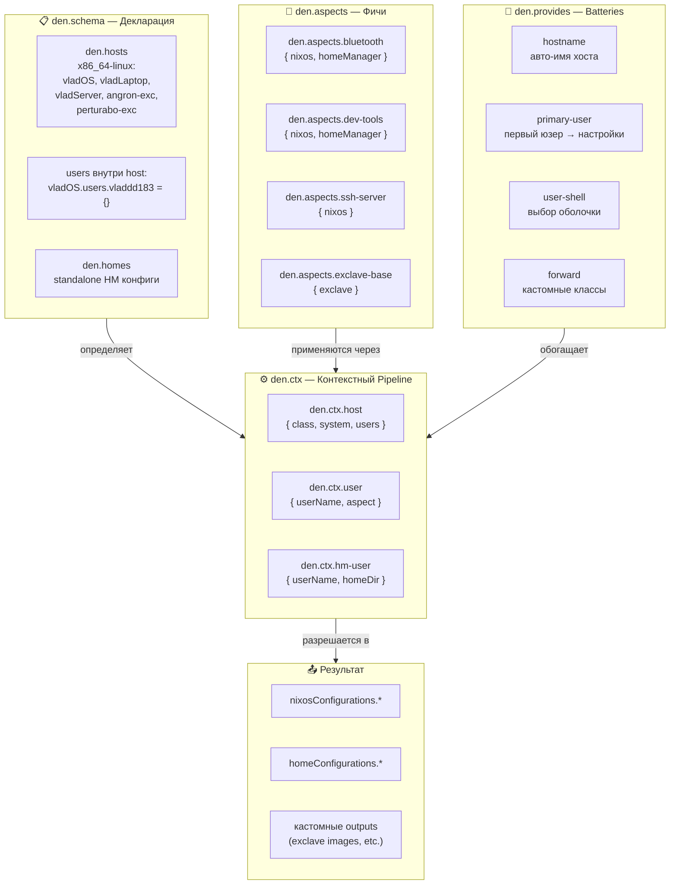
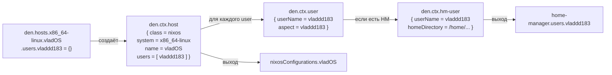
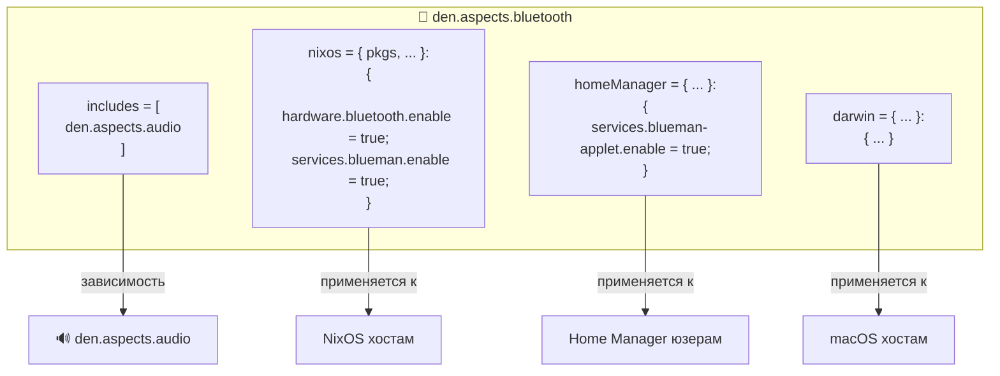
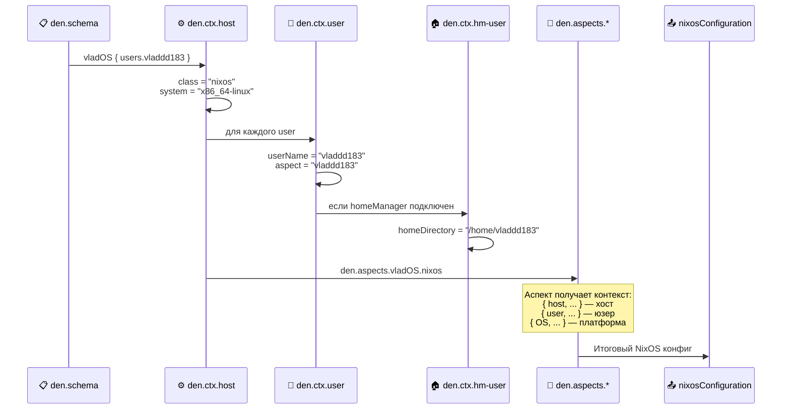
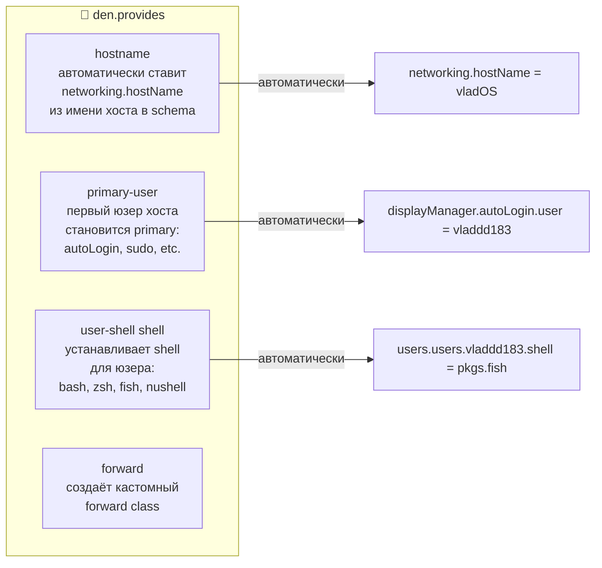
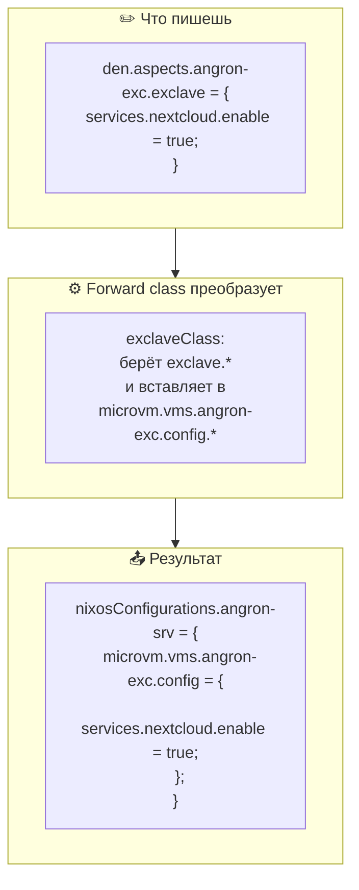
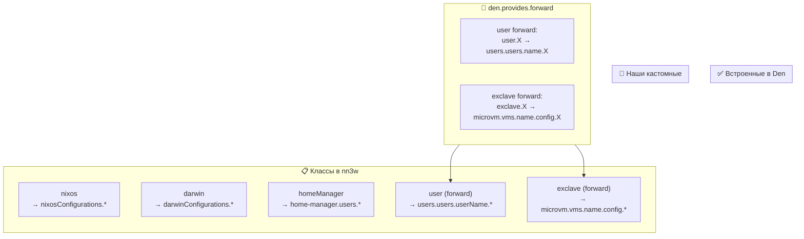
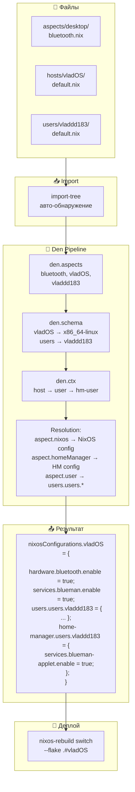

# 🌿 Den — Конфигурация nn3w

> **Den** — аспект-ориентированный, контекстно-управляемый фреймворк
> для Dendritic Nix конфигураций. Ядро всей монорепы nn3w.
> Заменяет Snowfall полностью, добавляя кастомные классы, параметрический
> dispatch и кросс-flake шаринг.

---

## 🏗️ Как Den устроен



---

## 📋 Den Schema — Определение хостов и пользователей

### Основной `modules/den.nix`

```nix
{ inputs, ... }:
{
  den.hosts.x86_64-linux = {

    # 🖥️ Десктоп
    vladOS = {
      users.vladdd183 = {};
    };

    # 💻 Ноутбук
    vladLaptop = {
      users.vladdd183 = {};
    };

    # 🖧 Личный сервер
    vladServer = {
      users.vladdd183 = {};
    };

    # 📦 Exclave на сервере компании #1
    angron-exc = {
      users.vladdd183 = {};
    };

    # 📦 Exclave на сервере компании #2
    perturabo-exc = {
      users.vladdd183 = {};
    };
  };

  # 🏠 Standalone Home Manager (для non-NixOS машин)
  den.homes.x86_64-linux = {
    vladdd183 = {};
  };
}
```

### Что происходит за кулисами



---

## 🧩 Den Aspects — Фичи, не хосты

### Анатомия аспекта



### Классы в Den

| Класс | Куда применяется | Когда используется |
|:---|:---|:---|
| `nixos` | `nixosConfigurations.*` | Любой NixOS хост |
| `darwin` | `darwinConfigurations.*` | macOS машины |
| `homeManager` | `home-manager.users.*` | Home Manager конфиг юзера |
| `user` | `users.users.${userName}` | OS-уровень юзера (groups, shell) |
| `exclave` | **Кастомный** → forward в MicroVM | Exclave VM на сервере компании |

### Как аспекты подключаются к хостам

```nix
# hosts/vladOS/default.nix
{ ... }:
{
  den.aspects.vladOS = {
    includes = [
      # Базовые
      den.aspects.base
      den.aspects.networking
      den.aspects.security
      den.aspects.nix-settings

      # Десктоп
      den.aspects.hyprland
      den.aspects.audio
      den.aspects.bluetooth
      den.aspects.fonts
      den.aspects.gtk-qt

      # Разработка
      den.aspects.git
      den.aspects.neovim
      den.aspects.nix-lang
      den.aspects.rust-lang
      den.aspects.containers
    ];

    # Специфичное для этого хоста (hardware и т.д.)
    nixos = { ... }: {
      imports = [ ./hardware.nix ./disko.nix ];
      boot.loader.systemd-boot.enable = true;
    };
  };
}
```

```nix
# hosts/exclaves/angron-exc/default.nix
{ ... }:
{
  den.aspects.angron-exc = {
    includes = [
      # Базовые серверные
      den.aspects.base
      den.aspects.security
      den.aspects.ssh-server

      # Exclave-специфичные
      den.aspects.exclave-base
      den.aspects.exclave-wireguard

      # Сервисы внутри exclave
      den.aspects.nextcloud
      den.aspects.gitea
    ];

    nixos = { ... }: {
      # Exclave-специфичные настройки
      networking.hostName = "angron-exc";
    };
  };
}
```

---

## ⚙️ Den Context Pipeline — Параметрический dispatch

### Как контекст течёт через систему



### Параметрический аспект — пример

```nix
# Аспект который ведёт себя по-разному в зависимости от контекста
den.aspects.dev-environment = {
  includes = [
    den.aspects.git
    den.aspects.neovim
  ];

  # OS-уровень: разный для NixOS и Darwin
  nixos = { pkgs, ... }: {
    programs.nix-ld.enable = true;
    environment.systemPackages = with pkgs; [ gcc gnumake ];
  };

  darwin = { pkgs, ... }: {
    environment.systemPackages = with pkgs; [ darwin.cctools ];
  };

  # User-уровень: shell, groups
  user = { ... }: {
    extraGroups = [ "wheel" "docker" "video" ];
  };

  # Home Manager: пользовательские пакеты
  homeManager = { pkgs, ... }: {
    home.packages = with pkgs; [
      ripgrep fd bat eza zoxide
      lazygit delta
    ];
  };
};
```

**Ключевой момент:** этот аспект НЕ знает что `vladdd183` — это юзер на `vladOS`. Он получает контекст автоматически через `den.ctx`, и `user.extraGroups` автоматически расширяется в `users.users.vladdd183.extraGroups` через forward class `user`.

---

## 🔌 Den Provides — Встроенные batteries



### Подключение batteries к аспекту пользователя

```nix
# users/vladdd183/default.nix
{ ... }:
{
  den.aspects.vladdd183 = {
    includes = [
      den.provides.primary-user
      (den.provides.user-shell "fish")
      den.aspects.dev-environment
    ];

    user = { ... }: {
      description = "Vladdd183";
      extraGroups = [ "wheel" "networkmanager" ];
    };

    homeManager = { pkgs, ... }: {
      home.stateVersion = "24.11";
      programs.fish.enable = true;
      programs.starship.enable = true;
    };
  };
}
```

---

## 🏗️ Custom Forward Class — Exclave

### Что такое forward class

Forward class — это механизм Den, который берёт один "псевдо-класс" (например `exclave`) и перенаправляет его содержимое в реальный NixOS конфиг по определённому пути.



### Реализация exclave forward class

```nix
# aspects/exclave/_forward-class.nix
{ lib, ... }:
{
  # Определяем кастомный forward class для exclaves
  den.aspects.exclave-system = {
    includes = [ exclaveForward ];
  };
}

# Суть forward:
# 1. Для каждого exclave-хоста в den.schema
# 2. Берём его аспекты с классом "exclave"
# 3. Forward-им в microvm.vms.${name}.config
# 4. Guard: только если microvm подключен

# Упрощённая схема (реальный код использует den._.forward):
# den._.forward {
#   each = exclaveHosts;
#   fromClass = exc: "exclave";
#   intoClass = _: "nixos";
#   intoPath = exc: [ "microvm" "vms" exc.name "config" ];
#   fromAspect = exc: den.aspects.${exc.aspect};
#   guard = { options, ... }: options ? microvm.vms;
# };
```

### Полная картина forward classes в nn3w



---

## 📁 Wiring: modules/aspects.nix

Этот файл — мост между aspects/ директориями и Den.

```nix
# modules/aspects.nix
{ inputs, ... }:
{
  imports = [
    # Авто-импорт всех .nix из каждой директории аспектов
    (inputs.import-tree.importTree ../aspects/core)
    (inputs.import-tree.importTree ../aspects/desktop)
    (inputs.import-tree.importTree ../aspects/dev)
    (inputs.import-tree.importTree ../aspects/server)
    (inputs.import-tree.importTree ../aspects/exclave)

    # Хосты и юзеры
    (inputs.import-tree.importTree ../hosts)
    (inputs.import-tree.importTree ../users)
  ];
}
```

---

## 📊 Полная картина: от файла до машины



---

## 🔗 Связанные документы

| Документ | Тема |
|:---|:---|
| [00-architecture.md](00-architecture.md) | 🏛️ Общая архитектура монорепы |
| [01-extractable-modules.md](01-extractable-modules.md) | 🧩 Паттерн извлечения модулей |
| [03-exclave-mechanism.md](03-exclave-mechanism.md) | 📦 Exclave forward class в деталях |
