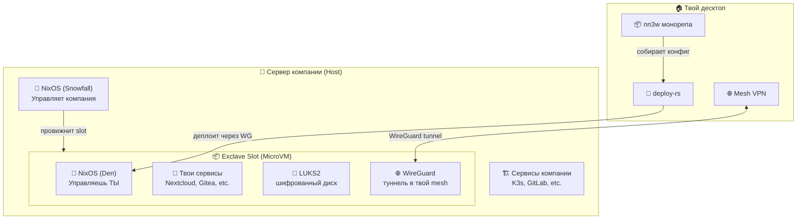
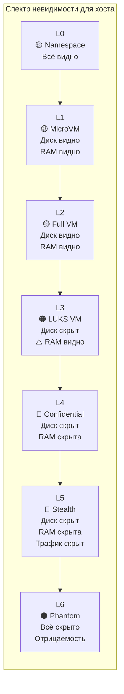
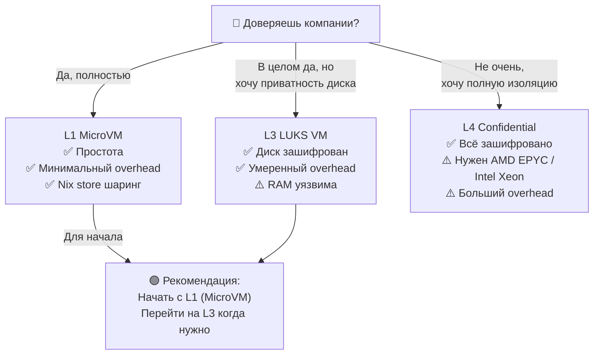
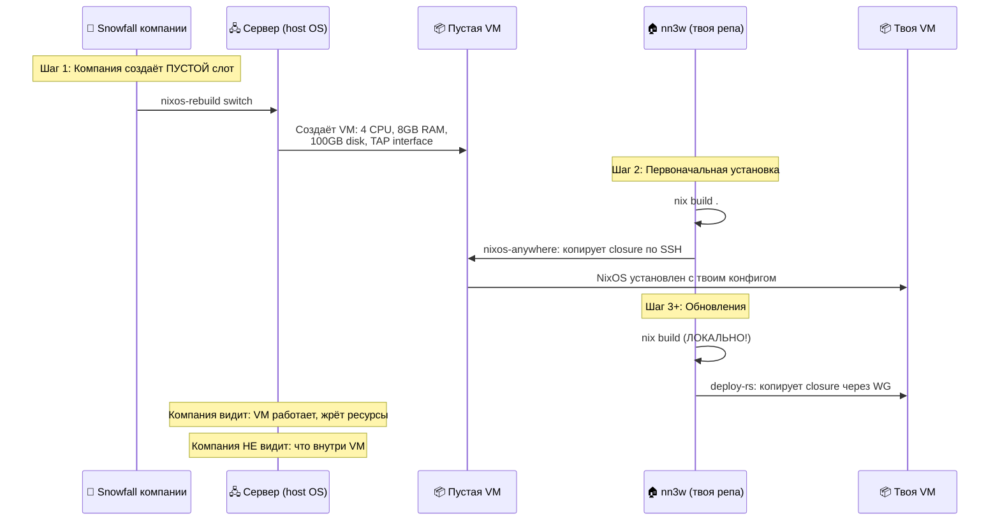
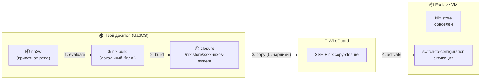
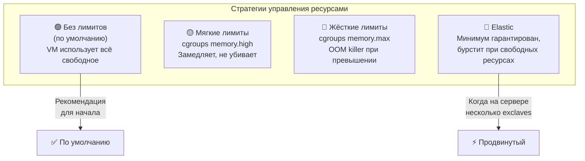
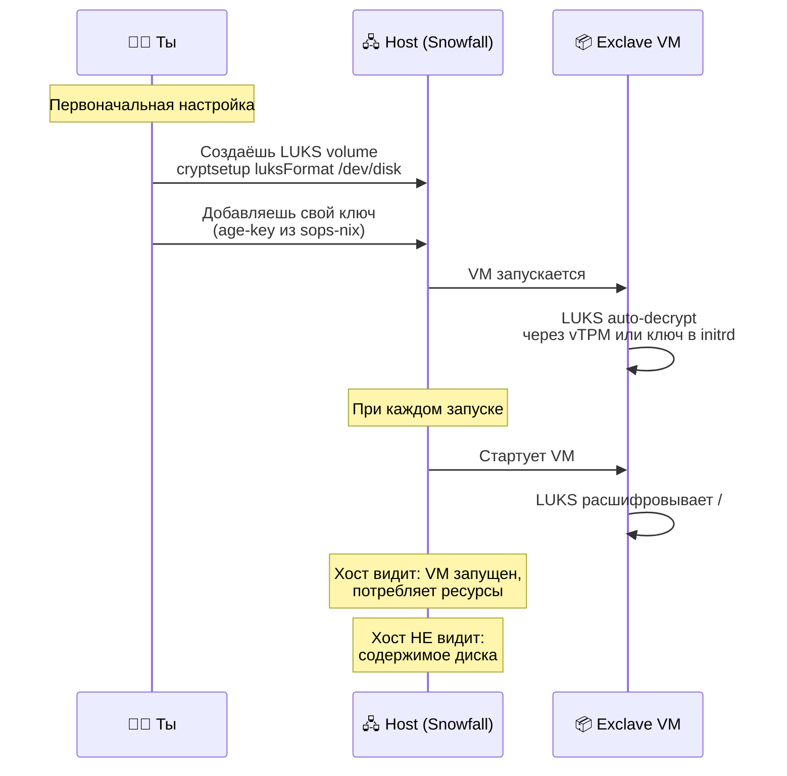
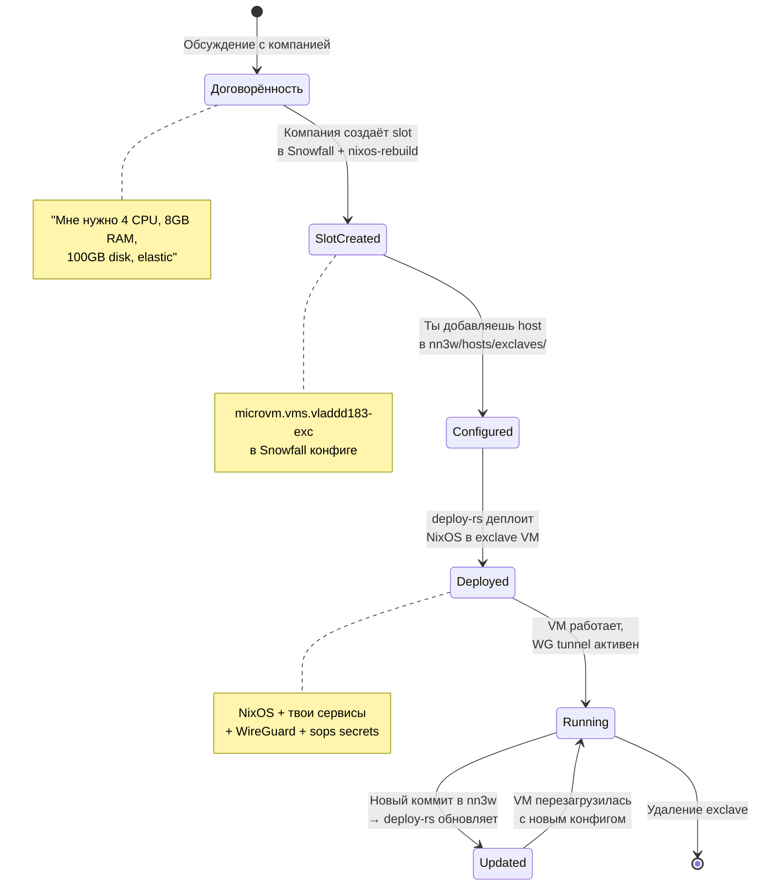

# 📦 Exclave-механизм — Твоя территория на чужом железе

> **Exclave** — приватное изолированное пространство на сервере компании.
> Компания предоставляет ресурсы (CPU, RAM, диск), ты наполняешь содержимым.
> Компания видит VM и потребление ресурсов. Содержимое — только твоё.

---

## 🧭 Терминология

| Термин | Значение | Аналогия |
|:---|:---|:---|
| 🏠 **Enclave** | Чужая территория внутри **моего** сервера | Посольство другой страны на моей земле |
| 🚀 **Exclave** | Моя территория на **чужом** сервере | Мой анклав на территории другой страны |
| 🖧 **Host** | Физический/виртуальный сервер компании | Земля, на которой стоит посольство |
| 📦 **Slot** | Зарезервированное место для exclave на host | Участок земли под посольство |
| 🔐 **Trust boundary** | Граница видимости между компанией и тобой | Забор посольства |



---

## 🎚️ Спектр изоляции (L0 — L6)



### 📊 Детальная таблица уровней

| Ур. | Название | Хост видит диск? | Хост видит RAM? | Хост видит трафик? | Технология | Overhead |
|:---:|:---|:---:|:---:|:---:|:---|:---:|
| **L0** | Namespace | ✅ Да | ✅ Да | ✅ Да | systemd-nspawn, cgroups | ~0% |
| **L1** | MicroVM | ✅ Образ | ✅ Дамп | ✅ Да | Firecracker, cloud-hypervisor | ~2-5% |
| **L2** | Full VM | ✅ qcow2 | ✅ Дамп | ✅ Да | QEMU/KVM | ~5-10% |
| **L3** | Encrypted VM | ❌ LUKS2 | ⚠️ Ключ в RAM | ✅ Да | LUKS2 + vTPM | ~5-15% |
| **L4** | Confidential | ❌ LUKS2 | ❌ SEV-шифр. | ✅ Да | AMD SEV-SNP / Intel TDX | ~5-20% |
| **L5** | Stealth | ❌ LUKS2 | ❌ SEV-шифр. | ❌ Tor/WG | L4 + Tor/AmneziaWG | ~10-30% |
| **L6** | Phantom | ❌ Hidden vol | ❌ SEV-шифр. | ❌ Скрыт | L5 + VeraCrypt + deniability | ~15-40% |

### 🎯 Рекомендованный уровень для nn3w



> **Начинаем с L1 (MicroVM)** — максимальная простота, минимальный overhead, шаринг Nix store с хостом. Если потребуется больше приватности — переходим на L3 (LUKS), меняя только конфигурацию slot, не код аспектов.

---

## 🏗️ Как устроен Exclave Slot

### ⚠️ Ключевой принцип: компания создаёт ПУСТОЙ слот

Компания **НЕ видит** твой конфиг. Она создаёт только пустую VM с ресурсами и сетью. Ты потом заливаешь содержимое самостоятельно из своей приватной репы.



### Сторона компании (Snowfall) — только слот, без конфига

```nix
# company-infra/modules/exclave-slots.nix
#
# ⚠️ Тут НЕТ config = { ... } — компания не определяет
#    что крутится внутри VM. Только ресурсы и сеть.
{ config, lib, pkgs, inputs, ... }:
{
  imports = [ inputs.microvm.nixosModules.host ];

  microvm.autostart = [ "vladdd183-exclave" ];

  # ПУСТОЙ СЛОТ — только ресурсы и сеть
  microvm.vms.vladdd183-exclave = {
    # Ресурсы
    vcpu = 4;
    mem = 8192;

    # Сеть — TAP interface, чтоб VM имела выход
    interfaces = [{
      type = "tap";
      id = "exc-vlad";
      mac = "02:00:00:00:00:01";
    }];

    # Диск — пустой образ, ты сам его наполнишь
    volumes = [{
      image = "/var/lib/exclaves/vladdd183.img";
      mountPoint = "/";
      size = 100 * 1024; # 100GB
    }];

    # Нет flake = ..., нет config = { ... }
    # VM обновляется ТОЛЬКО через deploy-rs из твоей репы
  };
}
```

### 🔄 Как проходит деплой: билд локально, копия по SSH



**Критически важно:**
- Билд NixOS closure происходит **на твоём десктопе** — компания не имеет доступа к исходникам
- По SSH копируются только **бинарные пакеты** из `/nix/store` — не исходный код
- Компания видит зашифрованный WireGuard трафик, не содержимое

### 📋 Что видит / не видит компания

| Этап | Компания видит | Компания НЕ видит |
|:---|:---|:---|
| Создание слота | VM процесс, ресурсы | — |
| Установка (nixos-anywhere) | SSH трафик к VM | Что устанавливается |
| Обновления (deploy-rs) | WG трафик (шифрованный) | Содержимое обновлений |
| Работа | VM жива, CPU/RAM потребление | Что крутится внутри |
| Диск (L1, без LUKS) | ⚠️ Могут прочитать образ | — |
| Диск (L3+, с LUKS) | LUKS blob (шифр. мусор) | Содержимое диска |

### 🚀 Первоначальная установка через nixos-anywhere

```bash
# На твоём десктопе, из nn3w монорепы:
nix run github:nix-community/nixos-anywhere -- \
  --flake .#angron-exc \
  root@<TAP-IP-адрес-VM>
```

nixos-anywhere:
1. Билдит NixOS closure **локально** на твоём десктопе
2. Подключается к VM по SSH через TAP
3. Размечает диск (через disko), устанавливает NixOS
4. Перезагружает VM — она стартует с твоим конфигом

### 🔄 Последующие обновления через deploy-rs

```bash
# Каждое обновление — с десктопа, через WireGuard:
deploy .#angron-exc
```

deploy-rs:
1. Билдит closure **локально**
2. Копирует бинарники через SSH/WG (`nix copy --to ssh://root@angron-exc.mesh`)
3. Активирует новый конфиг на VM
4. Magic rollback: если SSH пропал → автооткат через 60 сек

---

## 📦 Сторона nn3w: конфигурация Exclave

### Host definition

```nix
# hosts/exclaves/angron-exc/default.nix
{ ... }:
{
  den.aspects.angron-exc = {
    includes = [
      # Базовый набор для сервера
      den.aspects.base
      den.aspects.security
      den.aspects.ssh-server

      # Exclave-специфичное
      den.aspects.exclave-base
      den.aspects.exclave-wireguard

      # Сервисы, которые крутятся в exclave
      den.aspects.nextcloud
      den.aspects.gitea
      den.aspects.monitoring
    ];

    nixos = { ... }: {
      networking.hostName = "angron-exc";

      # microvm guest конфигурация
      microvm.guest.enable = true;
      microvm.hypervisor = "cloud-hypervisor";
    };
  };
}
```

### Exclave base aspect

```nix
# aspects/exclave/base.nix
{ ... }:
{
  den.aspects.exclave-base = {
    nixos = { pkgs, lib, ... }: {
      # Минимальная NixOS для VM
      boot.loader.grub.enable = false;
      boot.initrd.availableKernelModules = [ "virtio_pci" "virtio_blk" ];
      fileSystems."/" = { device = "/dev/vda"; fsType = "ext4"; };

      # Базовые сервисы
      services.openssh = {
        enable = true;
        settings = {
          PasswordAuthentication = false;
          PermitRootLogin = "prohibit-password";
        };
      };

      # Авто-обновления через deploy-rs
      nix.settings = {
        experimental-features = [ "nix-command" "flakes" ];
        trusted-users = [ "root" ];
      };

      environment.systemPackages = with pkgs; [
        vim htop curl
      ];
    };
  };
}
```

---

## 📏 Ресурсы: гибкость без жёстких лимитов



### Конфигурация ресурсов

```nix
# Вариант 1: Без ограничений (по умолчанию)
microvm.vms.vladdd183-exclave.config = {
  microvm.vcpu = 0;      # все доступные
  microvm.mem = 0;        # вся свободная
};

# Вариант 2: Мягкие лимиты через cgroups
systemd.services."microvm@vladdd183-exclave".serviceConfig = {
  MemoryHigh = "16G";     # мягкий — замедляет, не убивает
  CPUWeight = 100;         # приоритет (100 = средний, 50 = низкий)
};

# Вариант 3: Elastic — минимум + burst
systemd.services."microvm@vladdd183-exclave".serviceConfig = {
  MemoryMin = "4G";        # гарантированный минимум
  MemoryHigh = "32G";      # мягкий потолок
  CPUWeight = 80;
};
```

---

## 🔐 Шифрование: LUKS для Exclave (L3)

### Как настроить шифрованный диск



### NixOS конфиг для LUKS exclave

```nix
# Для L3 exclave — дополнение к exclave-base
den.aspects.exclave-luks = {
  nixos = { ... }: {
    # disko разметка с LUKS
    disko.devices.disk.main = {
      type = "disk";
      device = "/dev/vda";
      content = {
        type = "gpt";
        partitions = {
          boot = {
            size = "512M";
            type = "EF00";
            content = { type = "filesystem"; format = "vfat"; mountpoint = "/boot"; };
          };
          root = {
            size = "100%";
            content = {
              type = "luks";
              name = "exclave-root";
              settings.allowDiscards = true;
              # Ключ — только у тебя (sops-nix)
              passwordFile = "/run/secrets/exclave-luks-key";
              content = {
                type = "btrfs";
                subvolumes = {
                  "@" = { mountpoint = "/"; };
                  "@data" = { mountpoint = "/data"; mountOptions = [ "compress=zstd" ]; };
                  "@nix" = { mountpoint = "/nix"; mountOptions = [ "compress=zstd" "noatime" ]; };
                };
              };
            };
          };
        };
      };
    };
  };
};
```

---

## 🔄 Жизненный цикл Exclave



---

## 📋 Модуль для компании: минимальный exclave-slots.nix

Это **единственное**, что компания добавляет в свой Snowfall. Весь остальной контроль — у тебя.

```nix
# company-infra/modules/exclave-slots.nix
#
# Минимальный модуль для создания exclave slots.
# Добавляется в Snowfall-конфиг компании.
# Не содержит конфиг exclave — только slot (ресурсы + сеть).
{ config, lib, pkgs, inputs, ... }:
let
  exclaveSlots = {
    vladdd183 = {
      vcpu = 4;
      mem = 8192;
      diskSize = 100 * 1024;
      tapId = "exc-vlad";
      mac = "02:00:00:00:00:01";
      autostart = true;
    };
  };

  mkSlot = name: cfg: {
    inherit (cfg) pkgs;
    config = {
      microvm = {
        vcpu = cfg.vcpu;
        mem = cfg.mem;
        hypervisor = "cloud-hypervisor";

        shares = [{
          source = "/nix/store";
          mountPoint = "/nix/.ro-store";
          tag = "ro-store";
          proto = "virtiofs";
        }];

        interfaces = [{
          type = "tap";
          id = cfg.tapId;
          mac = cfg.mac;
        }];

        volumes = [{
          image = "/var/lib/exclaves/${name}-data.img";
          mountPoint = "/data";
          size = cfg.diskSize;
        }];
      };
    };
  };
in
{
  imports = [ inputs.microvm.nixosModules.host ];

  microvm.autostart = lib.mapAttrsToList (n: c:
    if c.autostart then "${n}-exclave" else null
  ) exclaveSlots;

  microvm.vms = lib.mapAttrs'
    (name: cfg: lib.nameValuePair "${name}-exclave" (mkSlot name cfg))
    exclaveSlots;
}
```

---

## 🔗 Связанные документы

| Документ | Тема |
|:---|:---|
| [02-den-configuration.md](02-den-configuration.md) | 🌿 Exclave forward class в Den |
| [04-networking.md](04-networking.md) | 🌐 WireGuard туннели для exclaves |
| [05-secrets.md](05-secrets.md) | 🔐 Exclave-секреты, LUKS ключи |
| [06-deployment.md](06-deployment.md) | 🚀 deploy-rs для обновления exclaves |
