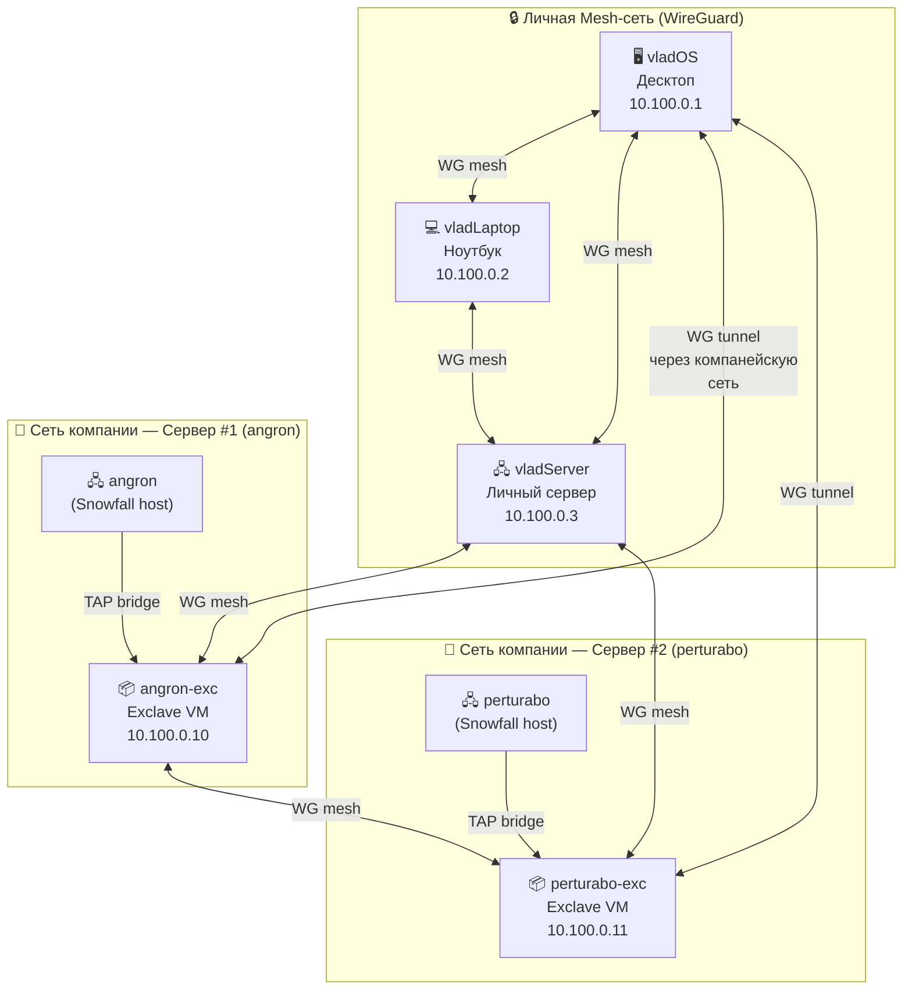
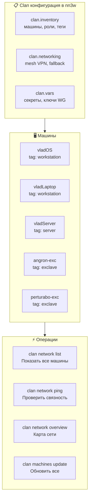
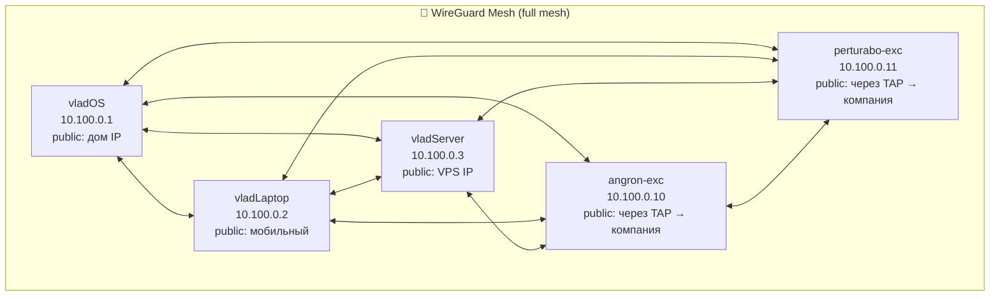
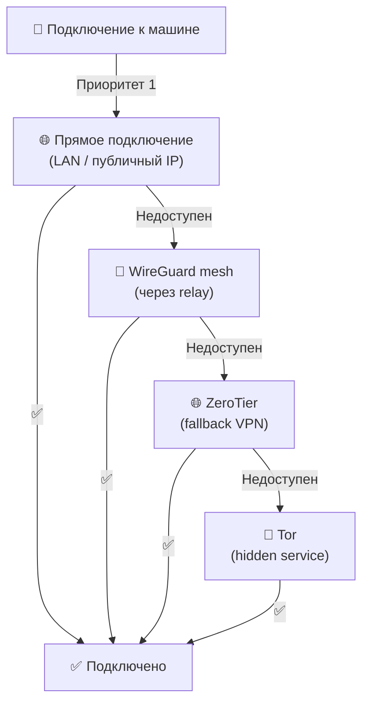
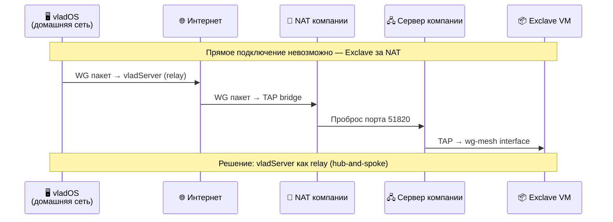
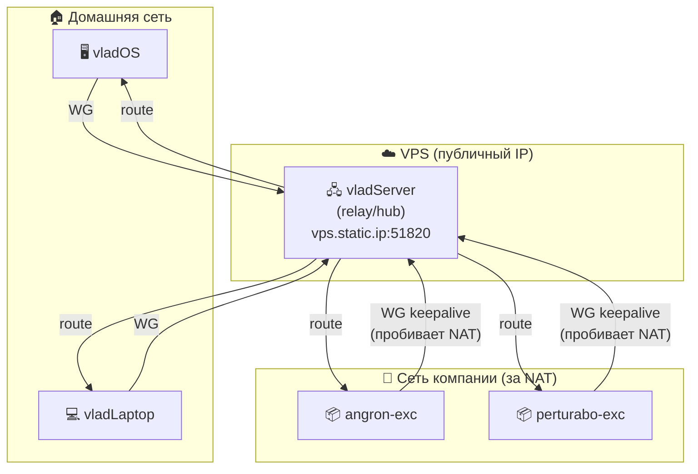
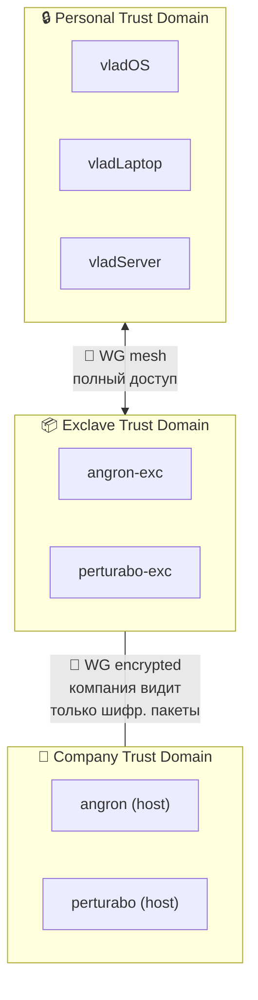

# 🌐 Networking — Clan Mesh, WireGuard, Trust Domains

> Все личные машины (десктоп, ноут, сервер) + exclaves на серверах компании
> объединены в единую зашифрованную mesh-сеть. Clan управляет сетью декларативно.
> Компания видит зашифрованный WireGuard трафик, но не содержимое.

---

## 🗺️ Топология сети



---

## 🔌 Как Clan управляет сетью

### Clan = декларативный fleet manager без центрального контроллера



### modules/clan.nix

```nix
# modules/clan.nix
{ inputs, ... }:
{
  imports = [ inputs.clan-core.flakeModules.default ];

  clan = {
    meta.name = "nn3w-fleet";

    # Инвентарь машин
    inventory = {
      machines = {
        vladOS = {
          tags = [ "workstation" "desktop" ];
          description = "Основной десктоп";
        };
        vladLaptop = {
          tags = [ "workstation" "laptop" ];
          description = "Ноутбук";
        };
        vladServer = {
          tags = [ "server" "personal" ];
          description = "Личный сервер";
        };
        angron-exc = {
          tags = [ "exclave" "server" ];
          description = "Exclave на сервере компании #1";
        };
        perturabo-exc = {
          tags = [ "exclave" "server" ];
          description = "Exclave на сервере компании #2";
        };
      };

      # Сервисы применяются по тегам
      services = {
        borgbackup.default = {
          roles.server.machines = [ "vladServer" ];
          roles.client.tags = [ "workstation" "exclave" ];
        };
      };
    };
  };
}
```

---

## 🔐 WireGuard Mesh — Конфигурация

### Как устроена mesh-сеть



### 📋 Адресация

| Машина | WG IP | Публичный endpoint | Роль |
|:---|:---|:---|:---|
| vladOS | `10.100.0.1/24` | `home.dyn.ip:51820` | Десктоп |
| vladLaptop | `10.100.0.2/24` | Roaming (мобильный) | Ноутбук |
| vladServer | `10.100.0.3/24` | `vps.static.ip:51820` | Личный сервер, relay |
| angron-exc | `10.100.0.10/24` | Через TAP → NAT компании | Exclave #1 |
| perturabo-exc | `10.100.0.11/24` | Через TAP → NAT компании | Exclave #2 |

### WireGuard aspect

```nix
# aspects/exclave/wireguard.nix
{ ... }:
{
  den.aspects.exclave-wireguard = {
    nixos = { config, ... }: {
      networking.wireguard.interfaces.wg-mesh = {
        # Порт для WG
        listenPort = 51820;

        # Приватный ключ из sops-nix
        privateKeyFile = config.sops.secrets."wireguard/private-key".path;

        peers = [
          {
            # vladOS (десктоп)
            publicKey = "DESKTOP_PUBLIC_KEY_HERE";
            allowedIPs = [ "10.100.0.1/32" ];
            endpoint = "home.dyn.ip:51820";
            persistentKeepalive = 25;
          }
          {
            # vladServer (relay)
            publicKey = "SERVER_PUBLIC_KEY_HERE";
            allowedIPs = [ "10.100.0.0/24" ];
            endpoint = "vps.static.ip:51820";
            persistentKeepalive = 25;
          }
        ];
      };
    };
  };
}
```

---

## 🔄 Clan Networking — Автоматический Fallback

Clan поддерживает автоматический fallback между типами подключения:



### Конфигурация Clan networking

```nix
# В clan.nix или отдельном модуле
clan.networking = {
  # Основной VPN
  wireguard = {
    enable = true;
    # Ключи управляются через clan vars
  };

  # Fallback — ZeroTier (опционально)
  zerotier = {
    enable = false; # Включить при необходимости
    networkId = "YOUR_ZEROTIER_NETWORK_ID";
  };
};
```

---

## 🌐 Как Exclaves подключаются к сети

### Проблема: exclave за NAT компании



### Решение: Hub-and-Spoke через vladServer



**vladServer** — единственная машина с публичным IP. Все остальные подключаются к нему. Он маршрутизирует трафик между участниками mesh.

Exclaves используют `persistentKeepalive = 25` чтобы держать NAT-пробив живым.

---

## 🏷️ Trust Domains в сети

| Trust Domain | Машины | Видимость | Секреты |
|:---|:---|:---|:---|
| 🔒 **Personal** | vladOS, vladLaptop, vladServer | Полная видимость друг друга | Личные age-ключи |
| 📦 **Exclave** | angron-exc, perturabo-exc | Видят personal mesh | Exclave-специфичные ключи |
| 🏢 **Company** | angron, perturabo (hosts) | Видят только VM + трафик | Компанейские ключи |



---

## 📋 DNS внутри mesh

| Домен | Резолвится в | Пример |
|:---|:---|:---|
| `vladOS.mesh` | `10.100.0.1` | `ssh vladOS.mesh` |
| `vladLaptop.mesh` | `10.100.0.2` | `ssh vladLaptop.mesh` |
| `vladServer.mesh` | `10.100.0.3` | `ssh vladServer.mesh` |
| `angron-exc.mesh` | `10.100.0.10` | `curl http://angron-exc.mesh:8080` |
| `perturabo-exc.mesh` | `10.100.0.11` | `curl http://perturabo-exc.mesh:8080` |

Реализация через CoreDNS или `/etc/hosts` (Clan генерирует автоматически).

---

## 🔗 Связанные документы

| Документ | Тема |
|:---|:---|
| [03-exclave-mechanism.md](03-exclave-mechanism.md) | 📦 Exclave TAP interface, MicroVM networking |
| [05-secrets.md](05-secrets.md) | 🔐 WireGuard ключи в sops-nix |
| [06-deployment.md](06-deployment.md) | 🚀 Деплой через mesh-сеть |
