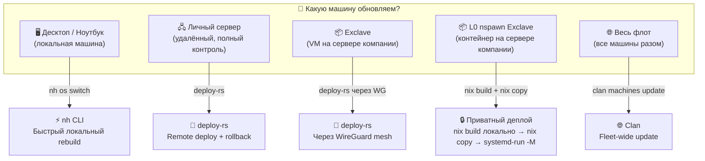
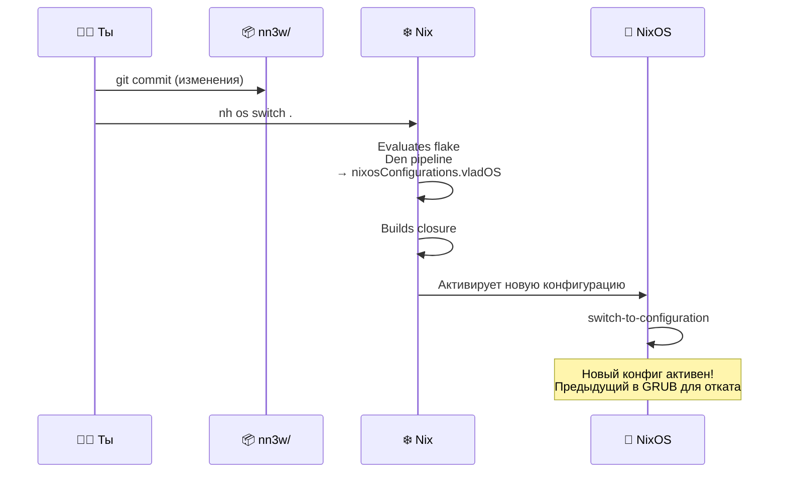
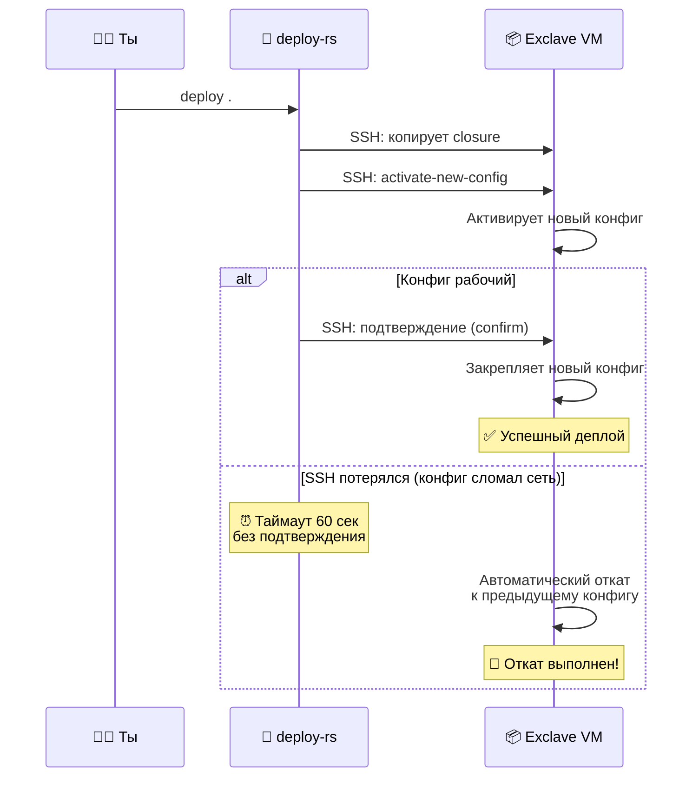
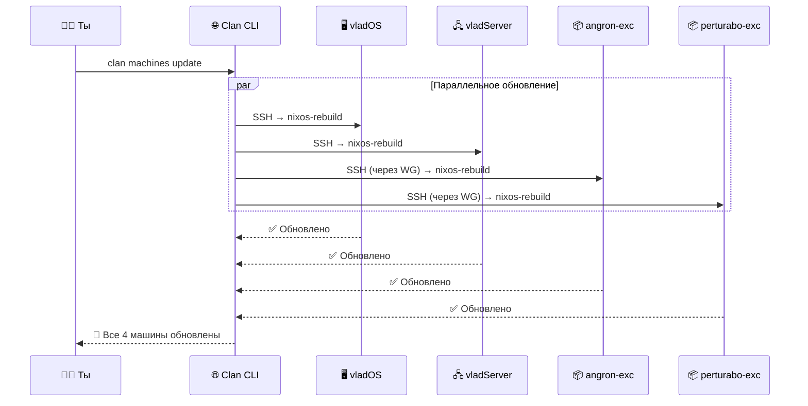
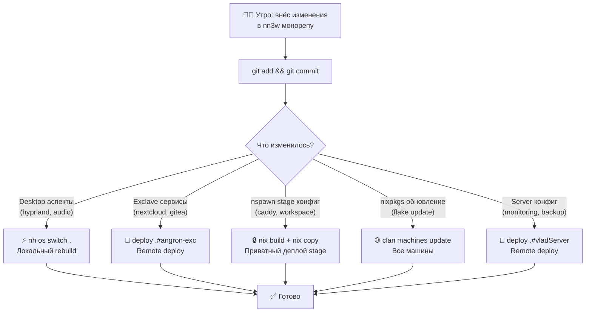

# 🚀 Deployment — Стратегии деплоя для разных типов машин

> Разные машины обновляются по-разному: десктоп — локальным rebuild,
> exclaves — через deploy-rs по WireGuard, флот — через Clan.
> Каждая стратегия оптимизирована под свой сценарий.

---

## 🗺️ Карта стратегий деплоя



---

## ⚡ Стратегия 1: Локальный rebuild (десктоп/ноутбук)

### Когда использовать

Ты сидишь за машиной, внёс изменения в монорепу, хочешь применить.

### Команды

```bash
# Стандартный NixOS rebuild
sudo nixos-rebuild switch --flake .#vladOS

# Или через nh (быстрее, красивее)
nh os switch . -- --hostname vladOS

# Только Home Manager (без перестроения системы)
nh home switch . -- --configuration vladdd183
```

### Как это работает



---

## 🚀 Стратегия 2: deploy-rs (удалённые машины)

### Когда использовать

Обновление личного сервера или exclave — удалённо, через SSH.

### Конфигурация deploy-rs

```nix
# modules/deploy.nix
{ inputs, ... }:
{
  imports = [ inputs.deploy-rs.flakeModule ];

  # Личный сервер
  deploy.nodes.vladServer = {
    hostname = "vladServer.mesh";    # через WG mesh
    sshUser = "root";
    fastConnection = true;           # сервер мощный

    profiles.system = {
      path = inputs.deploy-rs.lib.x86_64-linux.activate.nixos
        inputs.self.nixosConfigurations.vladServer;
    };
  };

  # Exclave #1
  deploy.nodes.angron-exc = {
    hostname = "angron-exc.mesh";    # через WG mesh
    sshUser = "root";
    fastConnection = false;          # через VPN, медленнее

    profiles.system = {
      path = inputs.deploy-rs.lib.x86_64-linux.activate.nixos
        inputs.self.nixosConfigurations.angron-exc;
      # Magic rollback — если SSH теряется после деплоя,
      # автоматически откатывает через 60 сек
      autoRollback = true;
      magicRollback = true;
    };
  };

  # Exclave #2
  deploy.nodes.perturabo-exc = {
    hostname = "perturabo-exc.mesh";
    sshUser = "root";
    fastConnection = false;

    profiles.system = {
      path = inputs.deploy-rs.lib.x86_64-linux.activate.nixos
        inputs.self.nixosConfigurations.perturabo-exc;
      autoRollback = true;
      magicRollback = true;
    };
  };
}
```

### Команды deploy-rs

```bash
# Деплой на конкретную машину
deploy .#vladServer
deploy .#angron-exc
deploy .#perturabo-exc

# L0 nspawn exclave — приватный деплой (см. секцию ниже)
# Используется nix build + nix copy + systemd-run -M
# вместо deploy-rs CLI, чтобы исходники не попадали на хост.

# Деплой на все ноды
deploy .

# Dry-run (только проверка, без изменений)
deploy --dry-activate .#angron-exc

# Без rollback (для отладки)
deploy --auto-rollback false .#angron-exc
```

### Приватный деплой L0 nspawn: `vladdd183-stage`

`vladdd183-stage` — `systemd-nspawn` guest на `perturabo`. Сборка происходит
**локально**, на хост копируются **только скомпилированные store paths** —
исходники nn3w на сервер компании не попадают.

```bash
# 1. Собрать closure ЛОКАЛЬНО
STORE_PATH=$(nix build \
  .#nixosConfigurations.vladdd183-stage.config.system.build.toplevel \
  --print-out-paths --no-link)

# 2. Скопировать только store paths на хост (не исходники!)
#    nspawn контейнер разделяет Nix store с хостом,
#    поэтому пути сразу доступны внутри guest.
NIX_SSHOPTS="-o ServerAliveInterval=30 -o ServerAliveCountMax=10" \
  nix copy --to ssh://kubeadmin@95.165.111.66 "$STORE_PATH"

# 3. Активировать внутри контейнера через systemd-run -M
ssh kubeadmin@95.165.111.66 \
  "sudo systemd-run -M vladdd183-stage --wait --pipe --service-type=exec \
   ${STORE_PATH}/bin/switch-to-configuration test"
ssh kubeadmin@95.165.111.66 \
  "sudo systemd-run -M vladdd183-stage --wait --pipe --service-type=exec \
   ${STORE_PATH}/bin/switch-to-configuration switch"

# 4. Smoke-test
curl -sk --resolve "stage.xn--80adh0ars.xn--j1adp.xn--p1acf:443:95.165.111.66" \
  "https://stage.xn--80adh0ars.xn--j1adp.xn--p1acf/"
```

> **Почему не rsync + build на хосте?** Старый runbook копировал **всю nn3w**
> на хост компании через `rsync`, что раскрывало приватные конфиги.
> Новый flow: `nix build` локально → `nix copy` store paths → `systemd-run -M`.
> Хост видит только скомпилированные `/nix/store/...`, не исходный Nix-код.
>
> **Почему не deploy-rs CLI?** deploy-rs CLI (`serokell/deploy-rs`) на текущем
> nixpkgs не собирается из-за `libkeyutils.so.1`. Ручной flow эквивалентен
> по результату и не требует сборки самого deploy-rs.
>
> **Нюансы nspawn guest:**
> - Внутри `vladdd183-stage` обязательно `networking.useDHCP = false` и
>   `networking.dhcpcd.enable = false` — адрес задаёт host-side slot.
> - Для smoke-test используется `Caddy tls internal`, поэтому внешний
>   `curl` должен идти с `-sk`, пока не подключён публичный ACME.

#### Что видит хост компании

| Компонент | Видит хост? |
|-----------|-------------|
| Исходный Nix-код nn3w | **Нет** — сборка локальная |
| Store paths (`/nix/store/...`) | Да — shared Nix store |
| Секреты sops | **Нет** — зашифрованы age-ключами |
| SSH-трафик внутрь guest | Зашифрован (ProxyJump) |

### Magic Rollback — защита от поломок



> **Magic rollback** критически важен для exclaves — если деплой сломает WireGuard, ты потеряешь SSH-доступ. Rollback автоматически вернёт рабочий конфиг через 60 секунд.

---

## 🌐 Стратегия 3: Clan fleet update (весь флот)

### Когда использовать

Обновление всех машин одной командой. Полезно после `nix flake update`.

### Команды Clan

```bash
# Обновить все машины
clan machines update

# Обновить по тегу
clan machines update --tag workstation
clan machines update --tag exclave
clan machines update --tag server

# Обновить конкретную
clan machines update vladServer

# Проверить статус всех
clan machines list
clan network ping
clan network overview
```

### Как работает fleet update



---

## 📋 Сравнение стратегий

| Параметр | nh os switch | deploy-rs | nix build + copy | Clan update |
|:---|:---:|:---:|:---:|:---:|
| **Целевые машины** | Локальная | Одна удалённая | L0 nspawn exclave | Весь флот |
| **Транспорт** | Локально | SSH | SSH (nix copy) | SSH |
| **Сборка** | Локально | Локально | Локально | Удалённо |
| **Приватность** | — | Store paths | ✅ Store paths only | — |
| **Rollback** | GRUB (вручную) | ✅ Magic rollback | ❌ (вручную) | ❌ (вручную) |
| **Параллельность** | — | Одна за раз | Одна за раз | ✅ Параллельно |
| **Скорость** | ⚡ Быстро | 🚀 Средне | 🚀 Средне | 🌐 Зависит от кол-ва |
| **Идеально для** | Десктоп | Exclaves (VM) | nspawn Exclaves | Обновление nixpkgs |

---

## 🔄 Workflow: типичный день



---

## 🛡️ Безопасность деплоя

### SSH-ключи

```nix
# Каждая машина принимает SSH только с определённых ключей
den.aspects.ssh-server = {
  nixos = { ... }: {
    services.openssh = {
      enable = true;
      settings = {
        PasswordAuthentication = false;
        PermitRootLogin = "prohibit-password";
        KbdInteractiveAuthentication = false;
      };
    };

    # Только твой ключ может подключиться
    users.users.root.openssh.authorizedKeys.keys = [
      "ssh-ed25519 AAAA... vladdd183@vladOS"
    ];
  };
};
```

### Deploy через WireGuard

Весь трафик deploy-rs идёт через WireGuard mesh, даже SSH:

```
vladOS (10.100.0.1) → WG tunnel → angron-exc (10.100.0.10):22
```

Компания видит только зашифрованные WireGuard пакеты, не SSH-сессию.

---

## 🔗 Связанные документы

| Документ | Тема |
|:---|:---|
| [03-exclave-mechanism.md](03-exclave-mechanism.md) | 📦 Как устроен exclave (куда деплоим) |
| [04-networking.md](04-networking.md) | 🌐 WireGuard mesh (через что деплоим) |
| [05-secrets.md](05-secrets.md) | 🔐 Секреты, доставляемые при деплое |
| [07-roadmap.md](07-roadmap.md) | 📋 Порядок настройки деплоя |
