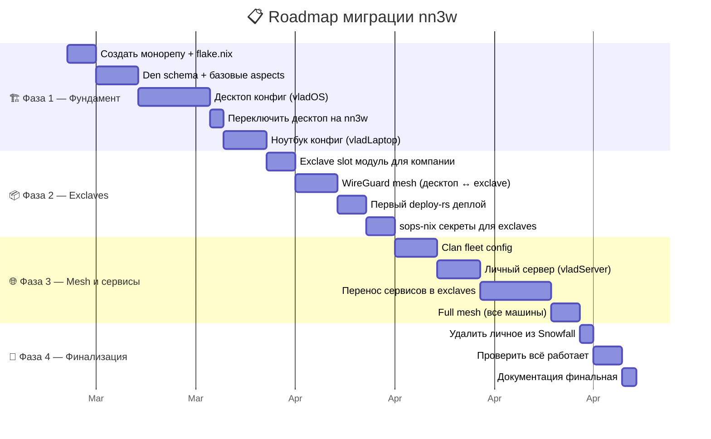
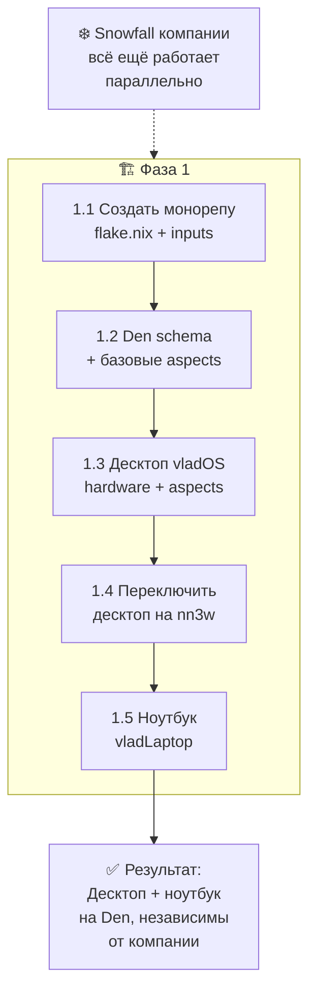
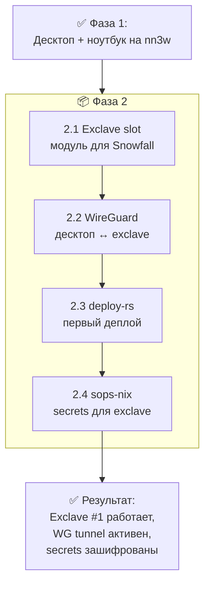
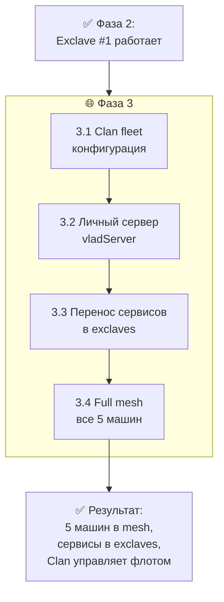
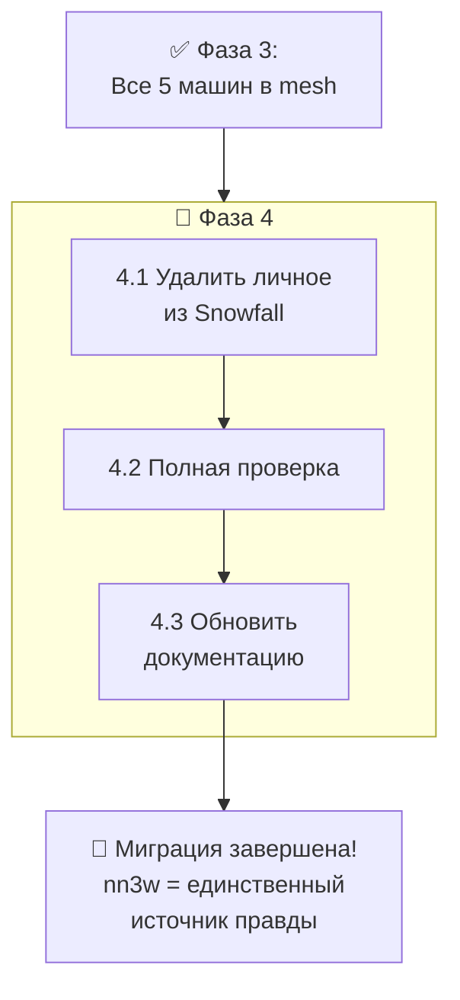
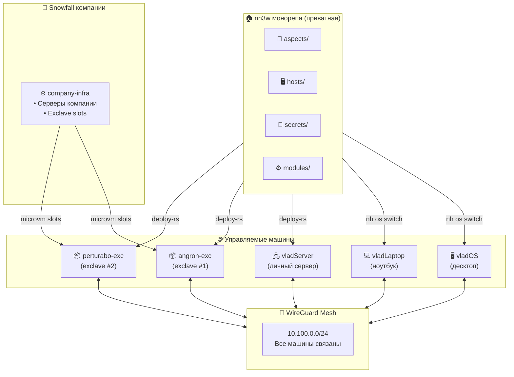

# 📋 Roadmap — Фазы миграции и порядок действий

> Поэтапная миграция без "большого взрыва". Каждая фаза — рабочее состояние.
> Можно остановиться на любой фазе и продолжить позже.
> Текущий Snowfall компании работает параллельно до самого конца.

---

## 🗺️ Общая карта фаз



---

## 🏗️ Фаза 1 — Фундамент

> **Цель:** десктоп и ноутбук работают на nn3w (Den), полностью независимо от Snowfall компании.



### 📝 Шаг 1.1 — Создать монорепу

```bash
mkdir nn3w && cd nn3w
git init
# Создаём структуру
mkdir -p modules aspects/{core,desktop,dev,server,exclave/services}
mkdir -p hosts/{vladOS,vladLaptop,vladServer,exclaves/{angron-exc,perturabo-exc}}
mkdir -p users/vladdd183 secrets/{personal,exclaves} lib overlays docs
```

**Создать `flake.nix`:**

```nix
{
  description = "nn3w — personal sovereign infrastructure";

  inputs = {
    nixpkgs.url = "github:NixOS/nixpkgs/nixos-unstable";
    flake-parts.url = "github:hercules-ci/flake-parts";

    # Den + Dendritic tools
    den.url = "github:vic/den";
    import-tree.url = "github:vic/import-tree";

    # Home Manager
    home-manager = {
      url = "github:nix-community/home-manager";
      inputs.nixpkgs.follows = "nixpkgs";
    };

    # Секреты
    sops-nix = {
      url = "github:Mic92/sops-nix";
      inputs.nixpkgs.follows = "nixpkgs";
    };

    # Диски
    disko = {
      url = "github:nix-community/disko";
      inputs.nixpkgs.follows = "nixpkgs";
    };
  };

  outputs = inputs:
    inputs.flake-parts.lib.mkFlake { inherit inputs; } {
      imports = [
        inputs.den.flakeModule
        # Наши модули
        (inputs.import-tree.importTree ./modules)
      ];

      systems = [ "x86_64-linux" ];
    };
}
```

**Чеклист шага 1.1:**
- [ ] `git init`
- [ ] Структура папок создана
- [ ] `flake.nix` с базовыми inputs
- [ ] `nix flake check` проходит

### 📝 Шаг 1.2 — Den schema + базовые aspects

**`modules/den.nix`** — определение хостов:

```nix
{ ... }:
{
  den.hosts.x86_64-linux = {
    vladOS = {
      users.vladdd183 = {};
    };
  };
}
```

**`aspects/core/base.nix`** — минимальный базовый аспект:

```nix
{ ... }:
{
  den.aspects.base = {
    nixos = { pkgs, ... }: {
      time.timeZone = "Europe/Moscow";
      i18n.defaultLocale = "ru_RU.UTF-8";

      nix.settings = {
        experimental-features = [ "nix-command" "flakes" ];
        auto-optimise-store = true;
      };

      environment.systemPackages = with pkgs; [
        vim git curl wget htop
      ];
    };
  };
}
```

**Чеклист шага 1.2:**
- [ ] `modules/den.nix` — vladOS host
- [ ] `aspects/core/base.nix` — locale, timezone, nix settings
- [ ] `aspects/core/networking.nix` — NetworkManager, firewall
- [ ] `aspects/core/security.nix` — sudo, hardening
- [ ] `users/vladdd183/default.nix` — user aspect
- [ ] `nix flake check` проходит

### 📝 Шаг 1.3 — Десктоп vladOS

Перенести hardware-configuration.nix с текущего десктопа:

```bash
cp /etc/nixos/hardware-configuration.nix hosts/vladOS/hardware.nix
```

Создать `hosts/vladOS/default.nix` с выбором aspects.

**Чеклист шага 1.3:**
- [ ] `hosts/vladOS/hardware.nix` скопирован
- [ ] `hosts/vladOS/disko.nix` (если используется disko)
- [ ] `hosts/vladOS/default.nix` — выбор aspects
- [ ] `aspects/desktop/*.nix` — hyprland, audio, bluetooth, fonts, gtk-qt
- [ ] `aspects/dev/*.nix` — git, neovim, languages
- [ ] `nix build .#nixosConfigurations.vladOS.config.system.build.toplevel`

### 📝 Шаг 1.4 — Переключить десктоп

```bash
# Тест: собрать без активации
sudo nixos-rebuild build --flake .#vladOS

# Если билд успешен:
sudo nixos-rebuild switch --flake .#vladOS

# Откат если что-то не так:
sudo nixos-rebuild switch --rollback
```

**Чеклист шага 1.4:**
- [ ] `nixos-rebuild build` проходит
- [ ] `nixos-rebuild switch` — десктоп работает
- [ ] GUI запускается
- [ ] Сеть работает
- [ ] Все нужные программы на месте

### 📝 Шаг 1.5 — Ноутбук

Аналогично шагу 1.3-1.4 для vladLaptop.

**Чеклист шага 1.5:**
- [ ] `hosts/vladLaptop/hardware.nix`
- [ ] `hosts/vladLaptop/default.nix`
- [ ] `nixos-rebuild switch --flake .#vladLaptop`
- [ ] Ноутбук работает на nn3w

---

## 📦 Фаза 2 — Exclaves

> **Цель:** первый exclave на сервере компании работает, WireGuard туннель установлен, deploy-rs настроен.



### 📝 Шаг 2.1 — Exclave slot модуль

Отдаёшь компании файл `exclave-slots.nix` для их Snowfall:

```nix
# Минимальный модуль — см. docs/03-exclave-mechanism.md
{ inputs, ... }:
{
  imports = [ inputs.microvm.nixosModules.host ];
  microvm.autostart = [ "vladdd183-exclave" ];
  microvm.vms.vladdd183-exclave = { ... };
}
```

**Чеклист шага 2.1:**
- [ ] Модуль написан и протестирован
- [ ] Компания добавила в Snowfall
- [ ] `nixos-rebuild switch` на сервере компании
- [ ] MicroVM slot создан (`systemctl status microvm@vladdd183-exclave`)

### 📝 Шаг 2.2 — WireGuard

**Чеклист шага 2.2:**
- [ ] `aspects/exclave/wireguard.nix` создан
- [ ] WG ключи сгенерированы
- [ ] `ping 10.100.0.10` с десктопа работает
- [ ] `ssh root@10.100.0.10` работает

### 📝 Шаг 2.3 — Первый deploy-rs

**Чеклист шага 2.3:**
- [ ] `modules/deploy.nix` — конфиг deploy-rs
- [ ] `hosts/exclaves/angron-exc/default.nix` — хост exclave
- [ ] `deploy .#angron-exc` — успешный деплой
- [ ] Magic rollback тестирован

### 📝 Шаг 2.4 — sops-nix для exclave

**Чеклист шага 2.4:**
- [ ] `.sops.yaml` создан (см. docs/05-secrets.md)
- [ ] `secrets/exclaves/angron.yaml` зашифрован
- [ ] Exclave расшифровывает секреты при деплое
- [ ] WG private key из sops работает

---

## 🌐 Фаза 3 — Mesh и сервисы

> **Цель:** все машины в mesh-сети, сервисы перенесены в exclaves, Clan управляет флотом.



### 📝 Шаг 3.1 — Clan

**Чеклист:**
- [ ] `modules/clan.nix` — inventory, tags
- [ ] `clan machines list` показывает все машины
- [ ] `clan network ping` — все отвечают

### 📝 Шаг 3.2 — Личный сервер

**Чеклист:**
- [ ] `hosts/vladServer/` — hardware, disko, default
- [ ] Deploy через `deploy .#vladServer` или `nixos-rebuild`
- [ ] Сервер в mesh-сети (`10.100.0.3`)
- [ ] Сервер как WG relay для exclaves

### 📝 Шаг 3.3 — Перенос сервисов

| Сервис | Откуда | Куда | Аспект |
|:---|:---|:---|:---|
| Nextcloud | Текущий сервер | angron-exc | `aspects/exclave/services/nextcloud.nix` |
| Gitea | Текущий сервер | angron-exc | `aspects/exclave/services/gitea.nix` |
| Мониторинг | Разбросан | vladServer | `aspects/server/monitoring.nix` |
| Backup | Нет | vladServer → все | `aspects/server/backup.nix` |
| Медиа | Нет | perturabo-exc | `aspects/exclave/services/media.nix` |

**Чеклист:**
- [ ] Каждый сервис имеет свой aspect
- [ ] Данные мигрированы
- [ ] Секреты зашифрованы в sops
- [ ] Сервисы доступны через mesh DNS

### 📝 Шаг 3.4 — Full mesh

**Чеклист:**
- [ ] vladOS ↔ vladLaptop ↔ vladServer — ping работает
- [ ] vladOS ↔ angron-exc ↔ perturabo-exc — ping работает
- [ ] Все 5 машин видят друг друга
- [ ] `clan network overview` — полная карта сети
- [ ] DNS (`.mesh` домены) резолвятся

---

## 🧹 Фаза 4 — Финализация

> **Цель:** личные конфиги полностью удалены из Snowfall компании. nn3w — единственный источник правды.



### 📝 Шаг 4.1 — Удалить личное из Snowfall

**Что удалить из Snowfall-конфига компании:**

- [ ] Хост десктопа (vladOS)
- [ ] Хост ноутбука (vladLaptop)
- [ ] Пользователь vladdd183 (кроме exclave slots)
- [ ] Личные модули, overlays, packages
- [ ] Личные secrets

**Что ОСТАВИТЬ в Snowfall:**

- [ ] Exclave slots модуль (`exclave-slots.nix`)
- [ ] Конфиги серверов компании

### 📝 Шаг 4.2 — Полная проверка

```bash
# Все машины работают?
clan network ping

# Все сервисы доступны?
curl http://angron-exc.mesh:8080  # Nextcloud
curl http://angron-exc.mesh:3000  # Gitea

# Секреты расшифровываются?
ssh angron-exc.mesh 'cat /run/secrets/nextcloud-admin-password'

# Deploy работает?
deploy --dry-activate .

# Flake check?
nix flake check
```

### 📝 Шаг 4.3 — Обновить документацию

- [ ] Все docs/ актуальны
- [ ] `README.md` в корне репы
- [ ] IP-адреса и ключи задокументированы (в зашифрованном виде)

---

## 🎯 Итоговая архитектура после миграции



---

## 🔗 Связанные документы

| Документ | Тема |
|:---|:---|
| [00-architecture.md](00-architecture.md) | 🏛️ Общая архитектура (куда идём) |
| [02-den-configuration.md](02-den-configuration.md) | 🌿 Как писать Den aspects (Фаза 1) |
| [03-exclave-mechanism.md](03-exclave-mechanism.md) | 📦 Exclave slot для компании (Фаза 2) |
| [04-networking.md](04-networking.md) | 🌐 WireGuard mesh настройка (Фаза 2-3) |
| [05-secrets.md](05-secrets.md) | 🔐 sops-nix настройка (Фаза 2) |
| [06-deployment.md](06-deployment.md) | 🚀 deploy-rs настройка (Фаза 2) |
