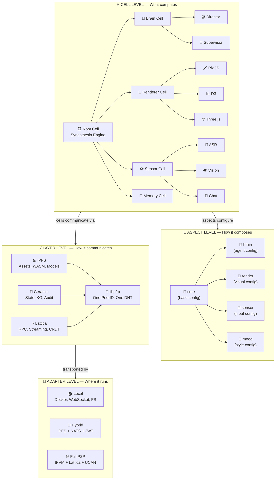

# 🔮🌌♾️ ФРАКТАЛЬНЫЙ АТОМ ♾️🌌🔮
### Content-Addressed Universe: от Большого Взрыва к Единой Теории Децентрализации
### Серия 0 из 3 — Фундамент

> 📎 **Серия:** `00-FRACTAL-ATOM` → [01-SYNESTHESIA-ENGINE-V3](./01-SYNESTHESIA-ENGINE-V3.md) → [02-SOVEREIGN-MESH](./02-SOVEREIGN-MESH.md)
> 📅 Дата: 2026-04-13
> 🔬 Статус: Архитектурное исследование
> 🔗 Базируется на: `nn3w/research/14-dag-unifying-structure.md`, `nn3w/research/11-decentralized-io-stack.md`, `nn3w/research/07-nn3w-sovereign-stack-vision.md`, `sandboxai/docs/architecture-vision/`

---

## 🗺️ Легенда символов (выучи ОДИН раз — читай в 5× быстрее)

> Каждый символ — **семантический якорь**. Мозг привязывает значение за ~1 минуту. Дальше можно СКАНИРОВАТЬ по символам, минуя буквы. Это — **визуальный zip**: промежуточное звено между «помнить суть» и «помнить дословно».

| 🏷️ Группа | Символы → Значение |
|---|---|
| ⚛️ **Ядро** | 🔮 CID/хеш/идентичность · ⚛️ Cell/атом/вычисление · 🧬 Spec/ДНК/спецификация · 🌿 Aspect/ветвь/дендрит · ♾️ фрактал/рекурсия/бесконечность |
| 🌍 **Три Силы** | 🪨 IPFS/иммутабельность/камень · 🌊 Ceramic/мутабельность/поток · ⚡ Lattica/реалтайм/молния · 🔗 libp2p/ткань/связь |
| 🔌 **Адаптеры** | 🏠 локальный/Web2/быстрый · 🌐 децентрализованный/Web3/верифицируемый · 🔌 adapter/переключатель/мост |
| 🔑 **Доверие** | 🔑 UCAN/capability/авторизация · 🆔 DID/PeerID/идентичность · 🛡️ изоляция/sandbox/мембрана · 🪙 gas/оплата/стимул |
| 🏗️ **Сборка** | 🏗️ Nix/build/конструкция · 📦 OCI/WASM/контейнер · 🚀 deploy/запуск/исполнение · 🔄 pipeline/трансформация |
| 🕳️ **Разрешение** | 🕳️ wormhole/content resolution · 🔍 discovery/поиск · 💾 state/состояние/память · 📡 mesh/сеть/P2P |
| ✅ **Оценки** | 🟢 плюс · 🔴 минус · 🟡 нюанс · 💡 ключевая идея · ⚠️ риск · 🏆 оптимальный выбор |

---

## 📑 Содержание

```
🌋 Часть 0 — БОЛЬШОЙ ВЗРЫВ: От ничего к Content Identity                  [стр.1]
⚛️ Часть I — АТОМ: Cell как единственный примитив                         [стр.2]
🌿 Часть II — ФРАКТАЛ: Дендритная композиция                              [стр.3]
⚡ Часть III — ТРИ СИЛЫ: Физика децентрализованного I/O                    [стр.4]
🌀 Часть IV — СУПЕРПОЗИЦИЯ: Бимодальный транспорт                         [стр.5]
🕳️ Часть V — КРОТОВАЯ НОРА: Content Resolution                            [стр.6]
🏛️ Часть VI — ЕДИНАЯ ТЕОРИЯ: Четыре концепции → вся архитектура           [стр.7]
📎 Приложения: Таблица технологий, Словарь терминов                        [стр.8]
```

---

# 🌋 Часть 0 — БОЛЬШОЙ ВЗРЫВ

## Нулевая точка

> **В начале не было ничего. Ни серверов, ни DNS, ни URL. Был только контент и его хеш.**

Представь: ты пишешь слово на бумаге. В Web2-мире ты говоришь: «это слово лежит на столе в комнате 3, шкаф 7, полка 2» — это **URL**, это **адрес**. Если кто-то переставит бумагу, ты потеряешь слово навсегда.

В мире content addressing ты говоришь: «это слово — `QmX7bV3...`». **Неважно** где бумага лежит — на столе, в другой комнате, на другой планете. Хеш **ЕСТЬ** идентичность. Если ты знаешь хеш, ты знаешь **ЧТО** это, и вся вселенная помогает тебе это **НАЙТИ**.

Это не технология. Это **смена парадигмы** уровня перехода от геоцентрической модели к гелиоцентрической.

---

## 🔭 Web2 как Ньютонова механика

Вся Web2 архитектура построена на **абсолютном пространстве**:

| 🔭 Ньютонова механика | 🌐 Web2 |
|---|---|
| Объект в абсолютном пространстве | Данные по абсолютному URL |
| Время одинаково для всех | DNS резолвится одинаково для всех |
| Сила действует через расстояние | Запрос идёт от клиента к серверу |
| Если объект исчезнет — он потерян | Если сервер упадёт — 404 |
| Пространство плоское | Сеть звёздная (client → server) |
| Масса сосредоточена | Данные на одном хосте |

**Web2 РАБОТАЕТ**. Как и ньютонова механика — она отлично описывает мяч, летящий через комнату. Но она **ломается** при:
- 🔴 Скорости, близкой к скорости света → **глобальный масштаб, миллиарды устройств**
- 🔴 Сильной гравитации → **монополии, SPOF, цензура**
- 🔴 Квантовых масштабах → **edge computing, IoT, межпланетные сети**

---

## 🌌 CID как Теория Относительности

Эйнштейн показал: **нет абсолютного пространства**. Есть только **пространство-время**, и идентичность объекта определяется его **свойствами**, а не его **координатами**.

Content Identifier (CID) делает то же самое для данных:

| 🌌 Теория относительности | 🔮 Content Addressing |
|---|---|
| Нет абсолютного пространства | Нет абсолютного URL |
| Идентичность = свойства объекта | Идентичность = хеш контента |
| Пространство-время искривляется | Маршрут к данным определяется топологией сети |
| E = mc² (масса ≡ энергия) | **Данные ≡ Идентичность** (CID ≡ контент) |
| Скорость света — инвариант | CID — инвариант (один и тот же хеш = один и тот же контент **НАВСЕГДА**) |
| Наблюдатель определяет систему координат | Узел определяет маршрут получения |

💡 **Ключевой инсайт:** В content-addressed вселенной **ДАННЫЕ ≡ ИДЕНТИЧНОСТЬ**. CID не «указывает» на данные — CID **ЕСТЬ** данные в сжатой форме. Как E = mc² стирает границу между массой и энергией, так CID стирает границу между «что это» и «где это».

---

## 📐 Фундаментальное уравнение

> **CID = hash(content + links_to_other_CIDs)**

Это «E = mc²» децентрализованного мира. Из этой формулы вытекает **ВСЁ**:

```
CID(A) = hash(payload_A + CID(B) + CID(C))
CID(B) = hash(payload_B + CID(D))
CID(C) = hash(payload_C + CID(D))
CID(D) = hash(payload_D)
```

```
     ┌─────────┐
     │ A 🔮     │  CID(A) включает CID(B) и CID(C)
     └────┬────┘
      ┌───┴───┐
   ┌──┴──┐ ┌──┴──┐
   │ B 🔮│ │ C 🔮│  CID(B) и CID(C) включают CID(D)
   └──┬──┘ └──┬──┘
      │   ┌───┘     ← конвергенция: D — общий предок
   ┌──┴───┴──┐
   │ D 🔮     │     CID(D) = хеш только payload_D
   └─────────┘
```

Это **Merkle-DAG** — направленный ациклический граф с криптографическими хешами.

### 🧬 Пять свойств, которые меняют всё

| # | Свойство | Что значит | Почему это revolution |
|---|---|---|---|
| 1 | 🔒 **Иммутабельность** | Изменение узла меняет его CID → меняются CID всех предков | Любая мутация **видна**, фальсификация **невозможна** |
| 2 | ✅ **Самоверификация** | Два узла с одним CID = гарантированно идентичны | **Нулевое доверие** к источнику — достаточно проверить хеш |
| 3 | 🔮 **Content addressing** | Идентификация по содержимому, не по расположению | Данные **живут вечно**, пока хоть один узел их хранит |
| 4 | ⬆️ **Снизу вверх** | Сначала листья, потом родители | **Инкрементальная верификация**: проверяй только то, что изменилось |
| 5 | 🔀 **Конвергенция** | Один узел = несколько родителей | **Дедупликация**: если два файла ссылаются на один блок, он хранится ОДИН раз |

### 🏛️ Тринити: три системы, один Merkle-DAG

| Система | Что адресует | Формат CID | Построена на |
|---|---|---|---|
| 🐙 **Git** | Код (коммиты, деревья, блобы) | SHA-1/SHA-256 | Merkle-DAG объектов |
| 🏗️ **Nix** | Софт (деривации, store paths) | Nix hash (SHA-256 NAR) | Content-addressed store graph |
| 🪨 **IPFS** | Данные (файлы, блоки, DAG-ноды) | Multihash CID v1 | Merkle-DAG + IPLD |

💡 **Инсайт:** Это не три отдельные технологии. Это **три проекции одного и того же паттерна** на три домена:
- Git ← Merkle-DAG **кода**
- Nix ← Merkle-DAG **софта**
- IPFS ← Merkle-DAG **данных**

> 📎 Подробнее: `nn3w/research/14-dag-unifying-structure.md` — полный разбор DAG как фундамента

---

## 🔬 Сингулярность контент-адресации

В физике **сингулярность** — точка, где старые законы перестают работать. Content addressing создаёт **сингулярность в вычислениях**, где рушатся привычные границы:

| Граница (Web2) | Как рушится (Content Addressing) |
|---|---|
| Данные ≠ Идентичность | **Данные = CID = Идентичность** |
| Код ≠ Данные | **Код = CID, Данные = CID → Код = Данные** |
| Состояние ≠ История | **Состояние = Ceramic stream = цепочка CID → Состояние = История** |
| Вычисление ≠ Результат | **f(CID_input) → CID_output, f сама имеет CID → Вычисление = CID → Результат = CID** |
| Локальное ≠ Глобальное | **CID одинаков везде → Локальное ≡ Глобальное** |

⚠️ **Это не абстрактная философия.** Это практический фундамент:
- Nix derivation: `CID(build_script + CID(deps)) → CID(output)` — вычисление = CID
- IPVM task: `CID(wasm_module) + CID(input) → CID(output)` — распределённый вызов = CID
- Ceramic stream: `CID(event_n) → CID(event_n+1)` — мутация = новый CID

---

## 🌀 Голографический принцип

В квантовой физике **голографический принцип** утверждает: вся информация о 3D-объёме может быть закодирована на его 2D-поверхности.

В content-addressed вселенной: **вся информация о состоянии системы кодируется в одном корневом CID**.

```
Root CID: QmRootXyz...
    │
    ├── Spec CID: QmSpecAbc...        ← полная спецификация системы
    │     ├── Renderer CID            ← какой рендерер
    │     ├── Agent CID               ← какие агенты
    │     └── Config CID              ← параметры
    │
    ├── State CID: QmStateKlm...      ← текущее состояние
    │     ├── Canvas CID              ← что на холсте
    │     ├── History CID             ← все предыдущие состояния
    │     └── Session CID             ← кто подключён
    │
    └── Assets CID: QmAssetsQrs...    ← все ресурсы
          ├── Image CID × N
          ├── Font CID × M
          └── Plugin CID × K
```

💡 **Один CID → полная реконструкция.** Знаешь root CID лекции — можешь воспроизвести **ВСЁ**: каждый слайд, каждую анимацию, каждое слово, каждый ассет. Это голография: проекция всей реальности на один хеш.

---

## ⚖️ Принцип неопределённости доверия

Гейзенберг: нельзя одновременно точно знать координату и импульс частицы.

В content-addressed системах: **нельзя одновременно иметь максимальную верификацию и максимальную скорость**.

| 📐 Режим | 🔍 Верификация | 🏎️ Скорость | 🛡️ Доверие |
|---|---|---|---|
| 🏠 Локальный | Минимальная (доверяешь себе) | Максимальная (<1ms) | Абсолютное к своему оборудованию |
| 🔗 Mesh (знакомые ноды) | Выборочная (верифицируешь CID, не re-compute) | Высокая (~10ms) | Высокое к подписям |
| 🌐 Глобальный P2P | Полная (re-compute для проверки) | Средняя (~100ms+) | Нулевое (trustless) |

💡 **Бимодальный транспорт** (Часть IV) — это практическое решение этой неопределённости: **один и тот же API**, разные уровни верификации в зависимости от контекста.

---

# ⚛️ Часть I — АТОМ: Cell как единственный примитив

## Одна формула

> **Cell = f(Spec_CID, Capabilities, State_CID)**

Четыре слова:
- ⚛️ **Cell** — живая единица вычислений
- 🧬 **Spec_CID** — её ДНК (что она умеет, CID-адресуемая спецификация)
- 🔑 **Capabilities** — её разрешения (что ей ПОЗВОЛЕНО делать, UCAN-токены)
- 💾 **State_CID** — её память (текущее состояние, Ceramic stream)

**Всё есть Cell.** Рендерер — Cell. AI-агент — Cell. Файл — Cell (вырожденный случай: только output, нет computation). Пользователь — Cell (DID как CID, capabilities как state). Лекция — Cell (с real-time I/O).

---

## 🧫 Биологическая клетка → Вычислительная ячейка

| 🧫 Биология | ⚛️ Cell | 💡 Почему аналогия точна |
|---|---|---|
| **Мембрана** | 🛡️ Isolation boundary (bubblewrap/OCI/microVM) | Контролирует что входит и выходит |
| **ДНК** | 🧬 Spec_CID (Nix derivation / WASM module CID) | Полная инструкция «как построить себя» |
| **Рибосомы** | 🏗️ Nix build system / WASM runtime | Превращают ДНК в функционирующие части |
| **Метаболизм** | 🔄 `CID(input) → CID(output)` | Основная функция: принимать и производить |
| **Митохондрии** | ⚡ Resource budget (CPU, RAM, GPU) | Энергия для вычислений |
| **Рецепторы** | 🔌 Capabilities (UCAN tokens) | Что Cell **разрешено** воспринимать |
| **Деление** | ♾️ `cell.spawn(child_spec_CID)` | Создание дочерней Cell с тем же интерфейсом |
| **Специализация** | 🌿 Aspects (нейрон, мышца, кожа...) | Одна базовая Cell → много специализаций |
| **Эволюция** | 🔄 Мутация spec → новый CID → fitness test → promote | Улучшение через отбор |
| **Нервная система** | 📡 libp2p mesh | Коммуникация между Cell'ами |
| **Иммунная система** | 🔑 UCAN + capability attenuation | Защита от несанкционированного доступа |

> 📎 Полная проработка: `sandboxai/docs/architecture-vision/02-cell-paradigm.md`

---

## 📜 Три закона Cell

### 1️⃣ 🔮 Закон Content Addressing

> **Всё есть CID.** Спецификация, сборка, состояние, плагин, вход, выход — каждая сущность идентифицируется хешем своего содержимого.

**Следствия:**
- Cell **детерминирована**: одни и те же входы → один и тот же выход (тот же CID)
- Cell **верифицируема**: любой может повторить вычисление и получить тот же CID
- Cell **кешируема**: если кто-то уже вычислил `f(CID_a) → CID_b`, результат может быть переиспользован глобально

### 2️⃣ ♾️ Закон Фрактальности

> **Любое окружение может создать внутри себя другое окружение с тем же интерфейсом.** Рекурсия ограничена только ресурсами.

**Следствия:**
- Cell может `spawn` дочернюю Cell → та может `spawn` свою → ... → ♾️
- Весь интерфейс одинаков: `Spec_CID + Capabilities + State_CID`
- Система масштабируется от одного процесса до межгалактического кластера

```
Cell (Root)
├── Cell (Brain)
│   ├── Cell (Director Agent)
│   │   ├── Cell (COMPASS Meta-Thinker)
│   │   └── Cell (MAKER Decomposer)
│   └── Cell (Supervisor)
├── Cell (Renderer)
│   ├── Cell (PixiJS Canvas)
│   ├── Cell (D3 Diagrams)
│   └── Cell (Three.js 3D)
└── Cell (Sensor)
    ├── Cell (ASR)
    ├── Cell (Vision)
    └── Cell (Chat)
```

### 3️⃣ 🔄 Закон Эволюции

> **Система может модифицировать собственный код, тестировать изменения и продвигать успешные мутации.**

**Следствия:**
- Новая версия Cell = новый Spec_CID (старый остаётся навсегда)
- A/B тестирование: запустить обе версии, сравнить fitness
- Governance: кто решает, какая мутация становится production? (UCAN + голосование)

> 📎 Подробнее: `sandboxai/docs/architecture-vision/07-self-evolution.md`

---

## 🏗️ Как Nix строит Cell

Nix derivation **уже является** Cell:

```nix
# Cell specification (simplified)
stdenv.mkDerivation {
  pname = "synesthesia-renderer-pixi";  # имя
  src = ./src;                           # исходники → CID
  buildInputs = [ nodejs pixi.js ];     # зависимости → CID каждой
  buildPhase = "npm run build";          # build script → CID
  # Весь объект → один output CID: /nix/store/<hash>-synesthesia-renderer-pixi
}
```

| 🧬 Cell concept | 🏗️ Nix equivalent | 🔮 CID |
|---|---|---|
| Spec_CID | Derivation `.drv` file | `hash(src + deps + build_script)` |
| Build | `nix build` | Детерминированная трансформация |
| Output | Store path `/nix/store/<hash>-...` | Content-addressed result |
| Capabilities | Sandbox restrictions (no network, no fs) | Isolation = security |
| Fractality | `buildInputs` (deps are also derivations) | Cell содержит Cells |

### 📦 Cell → OCI / WASM через Nix

```nix
# Cell → OCI контейнер
nix2container.buildImage {
  name = "synesthesia-renderer";
  config.Cmd = [ "${renderer}/bin/render-server" ];
  layers = [
    (nix2container.buildLayer { deps = [ renderer ]; })
  ];
  # Результат: минимальный OCI image (только необходимые бинарники)
  # → публикация: docker push → registry
  # → или: ipfs add → CID (decentralized)
}
```

```nix
# Cell → WASM модуль
rustPlatform.buildRustPackage {
  pname = "synesthesia-plugin-physics";
  target = "wasm32-wasi";
  # Результат: .wasm файл → CID → IPFS → IPVM execution
}
```

💡 **Nix = Cell Factory.** Декларативно описываешь Cell → Nix детерминированно строит → получаешь CID-адресуемый артефакт → публикуешь куда угодно (registry, IPFS, локальный кеш).

> 📎 Подробнее о Nix CI/CD: `fd_cicd/research/VISION.md`, `python-uv-nix/`

---

## 🪨 Как IPFS хранит Cell

IPFS-объект **уже является** Cell (вырожденный случай: без computation):

```
IPFS Object (UnixFS file):
  CID: QmRenderer123...
  Links:
    - Name: "render.wasm"     CID: QmWasm456...      Size: 2.1MB
    - Name: "config.json"     CID: QmConfig789...    Size: 1.2KB
    - Name: "assets/"         CID: QmAssets012...    Size: 15MB
```

| ⚛️ Cell concept | 🪨 IPFS equivalent |
|---|---|
| Spec_CID | Root CID объекта |
| Content | DAG из блоков (chunks) |
| Immutability | CID меняется при любом изменении |
| Deduplication | Общие блоки хранятся один раз |
| Discovery | DHT (Kademlia) → найди кто хранит CID |
| Resolution | Bitswap → получи блоки от peers |

### 🔗 Мост Nix → IPFS

> `Nix store path → IPLD block → IPFS CID`

Nix PR **#3727** (Trustful IPFS Store) + Git-hashing (PR #8918, RFC 133):

```
Nix build → /nix/store/<nix-hash>-renderer
         → IPLD encode (dag-cbor)
         → IPFS CID: bafy2bza...
         → ipfs pin → доступно всей сети
```

💡 **Одно пространство CID.** Nix-артефакт, IPFS-файл, Ceramic-стрим — все в одном CID namespace. Renderer и его assets — часть одного Merkle-DAG.

> 📎 Подробнее: `nn3w/research/14-dag-unifying-structure.md`, Nix Issue #859

---

## ⚡ Как IPVM исполняет Cell

IPVM = «WASM-функция на IPFS-данных → IPFS-результат»

```
IPVM Task:
  Function:  CID(wasm_module)    ← WASM Cell, опубликованная в IPFS
  Input:     CID(input_data)     ← входные данные, тоже в IPFS
  Output:    CID(result)         ← результат, тоже CID
  Proof:     Receipt             ← доказательство исполнения
```

| ⚛️ Cell concept | ⚡ IPVM equivalent |
|---|---|
| Spec_CID | CID WASM-модуля |
| Input | CID входных данных |
| Execution | Homestar runtime (Rust) |
| Output | CID результата |
| Verification | Receipt (proof of execution) |
| Memoization | Глобальный кеш: `CID(fn) + CID(input) → CID(output)` уже вычислен? |
| Scheduling | Decentralized scheduler → выбор оптимального узла |

💡 **Глобальная мемоизация** — самый безумный аспект IPVM. Если кто-то **на другом континенте** уже вычислил `f(x)`, результат кешируется по CID. Тебе не надо вычислять заново — просто возьми CID результата. **Вычисление превращается в lookup.**

---

## 🔑 Как UCAN авторизует Cell

UCAN = «JWT с capabilities + delegation chain + CID addressing»

```
UCAN Token:
  Issuer:     did:key:zAlice...     ← кто выдаёт
  Audience:    did:key:zRenderer...  ← кому (какой Cell)
  Capabilities:
    - resource: "ipfs://QmCanvas..."
      ability:  "canvas/write"       ← что разрешено
  Proofs:     [CID(parent_ucan)]    ← цепочка делегации
  Expiry:     2026-04-14T00:00:00Z  ← срок действия
```

| 🔑 UCAN concept | Зачем для Cell |
|---|---|
| **Issuer DID** | Кто создал Cell и наделил её полномочиями |
| **Audience DID** | Какая именно Cell получает полномочия |
| **Capabilities** | Что Cell **разрешено**: читать, писать, spawn'ить, вызывать |
| **Delegation** | Cell может передать **часть** своих полномочий дочерней Cell |
| **Attenuation** | Каждая передача может **сужать** capabilities (никогда расширять) |
| **Revocation** | Если Cell скомпрометирована — отзыв токена |

💡 **UCAN = мембрана Cell.** В биологии мембрана решает что проходит внутрь и наружу. UCAN решает что Cell **может делать**. Delegation = деление клетки с передачей части ДНК.

> 📎 Подробнее: `sandboxai/docs/architecture-vision/05-capability-immune-system.md`

---

## 🎯 Сводка: Cell = единственный примитив

```
┌─────────────────────────────────────────────────────────────────────────────┐
│                                                                             │
│                        ⚛️  C E L L                                          │
│                                                                             │
│   🧬 Spec_CID ──────────► 🏗️ Nix build ──────► 📦 OCI/WASM artifact      │
│        │                        │                       │                   │
│        │                        │                       ▼                   │
│        │                   🔮 CID = identity      🪨 IPFS publish          │
│        │                                                │                   │
│        ▼                                                ▼                   │
│   🔑 Capabilities ────► 🛡️ isolation boundary    🕳️ Content Resolution     │
│   (UCAN tokens)              │                    (DHT → Bitswap → local)  │
│                               ▼                         │                   │
│   💾 State_CID ──────► 🌊 Ceramic stream          ⚡ IPVM execute          │
│   (mutable history)     (append-only log)          (WASM runtime)          │
│                                                         │                   │
│                                                         ▼                   │
│                                                   🔮 Output CID            │
│                                                   (verifiable result)       │
│                                                                             │
│   ♾️ cell.spawn(child_spec_CID) ── фрактальная рекурсия                    │
│                                                                             │
└─────────────────────────────────────────────────────────────────────────────┘
```

---

# 🌿 Часть II — ФРАКТАЛ: Дендритная композиция

## ❄️ Снежинка

Снежинка — один из самых красивых объектов во вселенной. Она растёт из **затравочного кристалла**: на каждой точке ветвления действуют одни и те же **физические законы** (термодинамика кристаллизации), но **локальные условия** (температура, влажность) создают уникальные вариации.

Результат: **фрактальная структура** — самоподобная на каждом масштабе, но уникальная на каждом уровне.

**Это и есть дендритный паттерн:**

| ❄️ Снежинка | 🌿 Den (Dendritic Nix) | ⚛️ Cell architecture |
|---|---|---|
| Затравочный кристалл | Базовый аспект | Base Cell specification |
| Физические законы | NixOS module system | Cell interface contract |
| Точка ветвления | `den.aspects.*` | `cell.spawn()` |
| Локальные условия | `{ host, user }` params | `{ capabilities, network, trust }` |
| Ветвь | Конкретная конфигурация | Специализированная Cell |
| Фрактал | Аспект включает аспекты | Cell содержит Cells |
| Снежинка целиком | Полная NixOS-конфигурация | Полная развёрнутая система |

---

## 🌿 Den: Аспекты как физические законы

**Aspect** в Den — это функция:

```nix
# Аспект = (контекст) → { конфигурация для разных целей }
aspect = { host, user, ... }: {
  nixos = { ... };           # ← конфигурация NixOS
  homeManager = { ... };     # ← конфигурация Home Manager
  # ... любые кастомные классы
};
```

Аспект может **включать** другие аспекты:

```nix
# Аспект "workstation" включает аспекты "desktop", "dev", "media"
workstation = { host, user, ... }: {
  includes = [ desktop dev media ];
  nixos = { ... };
};
```

Это **ветвление снежинки**: `workstation` → `desktop` → `wayland` → `plasma` → ...

### 🌿→⚛️ От Den к Cell

💡 **Ключевой мост:** Den aspects **изоморфны** Cell composition.

| 🌿 Den concept | ⚛️ Cell concept | 🔮 CID bridge |
|---|---|---|
| `den.aspects.renderer` | RendererCell spec | Aspect → Nix derivation → store path → **CID** |
| `den.aspects.agent` | AgentCell spec | Aspect → Nix derivation → store path → **CID** |
| `includes = [ ... ]` | `cell.spawn(children)` | Composition = linking CIDs |
| `{ host, user }` | `{ capabilities, network }` | Context pipeline = parameterization |
| `den.ctx` resolution | Cell deployment | Aspect resolves to specific target |
| `den.provides.forward` | Cell adapter pattern | Same aspect → different output class |

### 🌿→🪨 От Den к IPFS

```
Den aspect
    │
    ▼ den.ctx resolution (host, user params)
NixOS module
    │
    ▼ nix build
/nix/store/<hash>-renderer
    │
    ▼ IPLD encode
IPFS CID: bafy2bza...
    │
    ▼ ipfs pin
Available globally 🌐
```

💡 **Один CID namespace.** Den aspect → Nix derivation → IPFS CID. Factory agent → Ceramic stream → IPFS CID. Lattica message → ephemeral CID. **«One PeerID. One CID namespace. Different layers.»**

> 📎 Этот паттерн документирован в `nn3w/research/11-decentralized-io-stack.md`

---

## ♾️ Фрактальное масштабирование

Cell содержит Cells. Aspect включает aspects. Это **фрактал** — паттерн повторяется на каждом масштабе:

```
Масштаб 0: Вся система (Root Cell)
│
├── Масштаб 1: Подсистемы (Brain, Renderer, Sensor)
│   │
│   ├── Масштаб 2: Компоненты (Director, PixiJS, ASR)
│   │   │
│   │   ├── Масштаб 3: Модули (COMPASS, GSAP plugin, Whisper)
│   │   │   │
│   │   │   └── Масштаб 4: Примитивы (DSPy signature, tween, audio chunk)
│   │   │
│   │   ... ♾️
│   ...
...
```

На **каждом** масштабе Cell имеет тот же интерфейс: `Spec_CID + Capabilities + State_CID`.

**Как снежинка:** масштаб меняется, паттерн — нет.

### 🔬 Таблица масштабов

| Масштаб | Пример Cell | Spec_CID | Capabilities | State_CID |
|---|---|---|---|---|
| 🌌 **Система** | Synesthesia Engine | CID всей спецификации | Все разрешения | Ceramic root stream |
| 🏗️ **Подсистема** | Brain (AI agents) | CID спецификации Brain | UCAN: invoke agents | Stream решений |
| ⚛️ **Компонент** | Director Agent | CID WASM/OCI agent | UCAN: command canvas | Context buffer stream |
| 🔬 **Модуль** | COMPASS Meta-Thinker | CID DSPy module | UCAN: call LLM API | Strategy history |
| 🧬 **Примитив** | DSPy Signature | CID prompt template | UCAN: read context | Optimized prompt |

---

## 📐 Формализация: Дендритная алгебра

Для тех, кто любит формализм:

```
Пусть A = множество всех аспектов
Пусть C = множество всех Cell-спецификаций
Пусть R = функция resolution: A × Context → C

Тогда:
1. Замкнутость: R(a, ctx) ∈ C для любого a ∈ A, ctx
2. Композиция: R(a₁ ∘ a₂, ctx) = R(a₁, ctx) ⊕ R(a₂, ctx)
3. Идемпотентность: R(a ∘ a, ctx) = R(a, ctx)
4. Рекурсия: если a включает b, то R(a, ctx) содержит R(b, ctx')
5. Проекция: один аспект → несколько классов (nixos, wasm, oci...)
```

Свойства 1-3 гарантируют, что **композиция аспектов всегда корректна**. Свойство 4 — **фрактальность**. Свойство 5 — **мультитаргет** (один aspect → разные deployment targets).

---

# ⚡ Часть III — ТРИ СИЛЫ: Физика децентрализованного I/O

## 🌌 Электромагнитный спектр вычислений

В физике **электромагнитный спектр** — это одно явление (электромагнитная волна), проявляющееся на разных частотах: радио → свет → рентген → гамма.

В децентрализованном I/O — одно явление (**P2P коммуникация на libp2p**), проявляющееся на разных «частотах»:

```
                    СПЕКТР ДЕЦЕНТРАЛИЗОВАННОГО I/O

Низкая частота ◄─────────────────────────────────────► Высокая частота
Долгоживущие данные                               Мгновенные сигналы

   🪨 IPFS                🌊 CERAMIC              ⚡ LATTICA
   ═══════               ══════════              ═════════
   Иммутабельные         Мутабельные             Эфемерные
   блобы                 потоки                  сообщения

   Файлы                 Knowledge Graph         RPC-вызовы
   Бинарный кеш          Audit trail            Стриминг
   Модели                Composable data         CRDT-координация
   Артефакты             Session state           Agent-to-agent

   Часы → годы           Минуты → месяцы         Миллисекунды → секунды

────────────────────── 🔗 libp2p ──────────────────────
                     Один PeerID
                     Один CID namespace
                     DHT, NAT traversal, encryption
                     TCP, QUIC, WebSocket, WebRTC
```

---

## 🪨 Слой 1: IPFS — Гравитация

> **Как гравитация: неизменная, вездесущая, фундаментальная основа всего.**

IPFS хранит **иммутабельные** content-addressed данные. Это «каменное основание» системы.

| Параметр | Значение |
|---|---|
| 🧬 **Что хранит** | Файлы, бинарный кеш Nix, ML-модели, WASM-модули, ассеты |
| 🔮 **Идентификация** | CID (Multihash, default: SHA-256) |
| 📊 **Структура** | Merkle-DAG (IPLD) |
| 🔍 **Discovery** | DHT (Kademlia) → кто хранит CID? |
| 📡 **Transfer** | Bitswap (tit-for-tat block exchange) |
| ⏱️ **Latency** | 100ms-10s (зависит от популярности) |
| 💾 **Persistence** | Пока хоть один узел делает `pin` |
| 🔗 **Nix bridge** | PR #3727 → Nix store path → IPLD → IPFS CID |

### Для Cell architecture:

| Что | Как это CID в IPFS |
|---|---|
| Cell specification | `ipfs add ./cell-spec.json` → CID |
| WASM module | `ipfs add ./plugin.wasm` → CID |
| Nix build output | `nix build → /nix/store/<hash>-... → IPLD → CID` |
| Ассеты (картинки, шрифты) | `ipfs add ./assets/` → CID директории |
| ML-модель | `ipfs add ./model.onnx` → CID |

---

## 🌊 Слой 2: Ceramic — Электромагнетизм

> **Как электромагнетизм: изменяемый, структурированный, позволяет строить сложные системы.**

Ceramic хранит **мутабельные потоки данных** с верифицируемой историей. Это «электромагнитное поле» — позволяет динамическое взаимодействие.

| Параметр | Значение |
|---|---|
| 🧬 **Что хранит** | Event streams (мутабельные JSON-документы с историей) |
| 🔮 **Идентификация** | StreamID (CID первого коммита) |
| 📊 **Структура** | Hash-linked event log поверх IPFS/IPLD |
| 🔍 **Query** | GraphQL (ComposeDB), SQL (OrbisDB) |
| 🔑 **Auth** | DID + crypto wallet signing |
| ⚓ **Anchoring** | Merkle root → Ethereum (immutable timestamp) |
| 📡 **Sync** | Recon protocol (Rust + libp2p), ~250 TPS |
| 📏 **Scale** | 350M events, 10M streams, 1.5M accounts |

### Для Cell architecture:

| Что | Как это Stream в Ceramic |
|---|---|
| Canvas state | Stream: `{elements: [...], camera: {...}, mood: {...}}` |
| Session info | Stream: `{users: [...], permissions: [...]}` |
| Director decisions | Stream: `{decision_log: [{event, command, reason}]}` |
| Knowledge Graph | ComposeDB: модели `Entity`, `Relation`, `Source` |
| Plugin registry | ComposeDB: модель `Plugin {cid, name, interface, author}` |

---

## ⚡ Слой 3: Lattica — Ядерные силы

> **Как ядерные силы: короткодействующие, невероятно мощные, работают только вблизи.**

Lattica обеспечивает **real-time P2P** коммуникацию. Это «ядерные силы» — мгновенные взаимодействия в непосредственной близости.

| Параметр | Значение |
|---|---|
| 🧬 **Что передаёт** | RPC-вызовы, стриминг, CRDT-синхронизация |
| 📡 **Transport** | libp2p (DCUtR, AutoNAT, relay) |
| ⏱️ **Latency** | ~1ms локально, ~50-200ms межконтинент |
| 🔐 **Encryption** | Noise/TLS |
| 📊 **CRDT** | Eventually consistent state (ephemeral) |
| 🔍 **Discovery** | DHT (Kademlia) + Bitswap + request-response |
| 📏 **Throughput** | 10,000 QPS (128B local), 1,200 QPS (128B cross-continent) |

### Для Cell architecture:

| Что | Как это через Lattica |
|---|---|
| Agent-to-agent RPC | `Director → Renderer: CreateElement(spec)` |
| ASR streaming | `SensorCell → BrainCell: SpeechEvent(text, ts)` |
| CRDT canvas state | Real-time multi-user cursor sync |
| Task coordination | Worker status, task assignment, heartbeat |
| Live mesh topology | Who's online, latency measurements |

---

## 🔗 libp2p: Пространство-время

> **libp2p — это не «ещё один слой». Это ткань, в которой существуют все три силы.**

```
┌─────────────────────────────────────────────┐
│                 🔗 libp2p                    │
│                                             │
│  🆔 PeerID (Ed25519 keypair)               │
│  📡 Transports: TCP, QUIC, WebSocket, WebRTC│
│  🔐 Encryption: Noise, TLS                 │
│  🔍 Discovery: mDNS, DHT, Bootstrap        │
│  🕸️ NAT: DCUtR, AutoNAT, Relay             │
│  📢 Pub/Sub: GossipSub                     │
│                                             │
│  ← используется IPFS, Ceramic, Lattica     │
│  ← один PeerID на все слои                  │
│  ← один DHT на все слои                     │
│                                             │
└─────────────────────────────────────────────┘
```

💡 **Один PeerID = одна идентичность во всех слоях.** Cell, участвующая в IPFS, Ceramic и Lattica — это один и тот же PeerID. Как в физике: электромагнетизм, гравитация и ядерные силы действуют на один и тот же объект.

---

## 📊 Матрица ответственности

| Задача | 🪨 IPFS | 🌊 Ceramic | ⚡ Lattica |
|---|:---:|:---:|:---:|
| Хранение файлов/артефактов | ✅ | ❌ | ❌ |
| Бинарный кеш Nix | ✅ | ❌ | ❌ |
| ML-модели | ✅ | ❌ | ❌ |
| WASM-плагины | ✅ | ❌ | ❌ |
| Мутабельное состояние с историей | ❌ | ✅ | ❌ |
| Knowledge Graph (GraphQL) | ❌ | ✅ | ❌ |
| Аудит-трейл (кто что сделал) | ❌ | ✅ | ❌ |
| Plugin registry | ❌ | ✅ | ❌ |
| RPC между агентами | ❌ | ❌ | ✅ |
| Real-time стриминг (ASR, video) | ❌ | ❌ | ✅ |
| CRDT координация | ❌ | ❌ | ✅ |
| Ephemeral task assignment | ❌ | ❌ | ✅ |

> 📎 Полная таблица: `nn3w/research/11-decentralized-io-stack.md`

---

# 🌀 Часть IV — СУПЕРПОЗИЦИЯ: Бимодальный транспорт

## ⚛️ Квантовая механика развёртывания

В квантовой механике частица **существует в суперпозиции** состояний, пока не произведено измерение. После измерения — коллапс в конкретное состояние.

В нашей архитектуре система **существует в суперпозиции** Web2 и Web3, пока не произведено развёртывание. После развёртывания — коллапс в конкретный набор адаптеров.

```
                        ⚛️ СУПЕРПОЗИЦИЯ
                 ┌─────────────────────────┐
                 │                         │
                 │   Cell Architecture     │
                 │   (adapter-agnostic)    │
                 │                         │
                 └────────┬────────────────┘
                          │
              ┌───────────┴───────────┐
              │ deployment decision   │
              └───────────┬───────────┘
                    ┌─────┴─────┐
                    ▼           ▼
            ┌──────────┐ ┌──────────┐
            │ 🏠 Web2  │ │ 🌐 Web3  │
            │ adapters │ │ adapters │
            └──────────┘ └──────────┘
```

---

## 🔌 Таблица адаптеров

> **Один и тот же Cell. Один и тот же API. Разные адаптеры.**

| Функция | 🏠 Web2 Adapter | 🌐 Web3 Adapter | 🔌 Interface |
|---|---|---|---|
| **Storage** | S3 / Local FS / PostgreSQL | 🪨 IPFS + Filecoin | `store.put(data) → CID` |
| **Mutable state** | PostgreSQL / Redis | 🌊 Ceramic (ComposeDB) | `state.update(stream, patch)` |
| **Messaging** | NATS / RabbitMQ | ⚡ Lattica (libp2p) | `bus.publish(topic, msg)` |
| **Task queue** | NATS JetStream / Celery | ⚡ Lattica DHT + CRDT | `queue.submit(task)` |
| **Identity** | JWT / OAuth2 | 🆔 DID + 🔑 UCAN | `auth.verify(token)` |
| **Model serving** | HTTP API (Ollama, vLLM) | 🪨 IPFS Bitswap + ⚡ Lattica RPC | `model.infer(input)` |
| **State sync** | WebSocket + SQLite | 🌊 Ceramic + ⚡ Lattica CRDT | `sync.subscribe(stream)` |
| **Secrets** | SOPS / Vault | 🔐 Lit Protocol (threshold) | `secrets.decrypt(cid)` |
| **Code hosting** | GitHub / Forgejo | Radicle / Tangled | `repo.clone(uri)` |
| **Binary cache** | cache.nixos.org | 🪨 IPFS binary cache (PR #3727) | `cache.fetch(hash)` |
| **Compute** | Docker / K8s | ⚡ IPVM (Homestar) | `compute.run(wasm_cid, input_cid)` |
| **DNS/Naming** | DNS | IPNS / ENS | `resolve(name) → CID` |

💡 **Adapter swap, not rewrite.** Переход Web2→Web3 — это **замена адаптеров**, не переписывание логики. Cell code не меняется. Aspect definitions не меняются. Только адаптеры.

> 📎 Этот паттерн описан в: `factory-ai-framework/06-GRAND-ARCHITECTURE.md` (раздел «Web2 vs Web3»)

---

## 📈 Прогрессивная децентрализация

Не нужно переключать всё сразу. Каждый **компонент** может быть в своём режиме:

```
Phase 0: ALL LOCAL                     Phase 1: HYBRID
┌──────────────────────┐              ┌──────────────────────┐
│ Storage:    🏠 Local  │              │ Storage:    🌐 IPFS   │ ← first
│ State:      🏠 SQLite │              │ State:      🏠 SQLite │
│ Messaging:  🏠 NATS   │              │ Messaging:  🏠 NATS   │
│ Identity:   🏠 JWT    │              │ Identity:   🏠 JWT    │
│ Compute:    🏠 Docker │              │ Compute:    🏠 Docker │
└──────────────────────┘              └──────────────────────┘

Phase 2: MOSTLY WEB3                   Phase 3: FULL P2P
┌──────────────────────┐              ┌──────────────────────┐
│ Storage:    🌐 IPFS   │              │ Storage:    🌐 IPFS+Filecoin │
│ State:      🌐 Ceramic│ ← second    │ State:      🌐 Ceramic       │
│ Messaging:  🏠 NATS   │              │ Messaging:  🌐 Lattica       │ ← last
│ Identity:   🌐 DID    │ ← third     │ Identity:   🌐 DID+UCAN     │
│ Compute:    🏠 Docker │              │ Compute:    🌐 IPVM          │
└──────────────────────┘              └──────────────────────┘
```

💡 **Порядок имеет значение:**
1. 🪨 **Storage первый** — минимальный риск, максимальный выигрыш (dedup, persistence)
2. 🌊 **State второй** — Ceramic для мутабельных данных (KG, audit)
3. 🔑 **Identity третий** — DID+UCAN вместо JWT (sovereignty)
4. ⚡ **Messaging последний** — самый чувствительный к latency

---

# 🕳️ Часть V — КРОТОВАЯ НОРА: Content Resolution

## 🛤️ Web2: путь через обычное пространство

```
Пользователь хочет плагин для физики →
    DNS resolve: physics-plugin.example.com → 93.184.216.34
    → TCP connect: 93.184.216.34:443
    → TLS handshake
    → HTTP GET /api/v1/plugins/physics
    → Server: check auth, read DB, read filesystem
    → Response: binary data (2.1MB)
    → Verify: ??? (trust the server? check signature? YOLO?)
```

**6 шагов, 4 точки отказа** (DNS, сервер, база, файловая система), нулевая верификация по умолчанию.

---

## 🕳️ Web3: кротовая нора

```
Пользователь хочет плагин для физики →
    CID: QmPhysicsPlugin7x3K...
    → DHT lookup: кто хранит QmPhysicsPlugin7x3K...?
    → Bitswap: получи блоки от ближайших peers
    → Verify: hash(received_data) == QmPhysicsPlugin7x3K...? ✅
    → Done.
```

**3 шага, 0 точек отказа** (пока хоть один peer хранит данные), **автоматическая верификация**.

CID — это **кротовая нора**: ты не путешествуешь через пространство (DNS → сервер → БД), ты просто **знаешь координату** (CID), и пространство **сворачивается** — данные оказываются у тебя.

```
Web2:
User ──────► DNS ──────► Server ──────► DB ──────► FS ──────► Data
     5 hops, 200-500ms, SPOF everywhere

Web3 (wormhole):
User ──────► CID ═══════════════════════════════════════► Data
     1 logical hop, verified by math, no SPOF
```

---

## 🧠 Глобальная мемоизация: вычисление как lookup

Самая безумная возможность IPVM:

```
Стандартное вычисление:
    CID(wasm_fn) + CID(input) → [execute WASM] → CID(output)
    Время: 500ms-60s (зависит от сложности)

После мемоизации:
    CID(wasm_fn) + CID(input) → [lookup cache] → CID(output)
    Время: <1ms
```

Если **кто-то на планете** уже вычислил ту же функцию с теми же входами — результат доступен по CID. **Вычисление вырождается в адресацию.**

💡 **Для Synesthesia Engine:** если кто-то уже генерировал диаграмму для «бинарного дерева» с такими же параметрами — результат доступен по CID. Director может сначала проверить кеш, потом генерировать.

---

## 🔍 Resolution strategy

Порядок поиска CID (от быстрого к глобальному):

```
1. 💾 Local cache (RAM/disk)         ~0ms     ← instantaneous
2. 🏠 LAN peers (mDNS discovery)     ~1ms     ← same network
3. 🔗 Trusted mesh (VPN/WireGuard)   ~10ms    ← known nodes
4. 📡 DHT (Kademlia)                 ~100ms   ← global P2P
5. 🌐 IPFS Gateway (HTTP fallback)   ~200ms+  ← Web2 bridge
6. ⚡ IPVM compute (if not cached)   ~1-60s   ← generate on demand
```

Cell не знает (и не должна знать) на каком этапе данные найдутся. Она просит CID — сеть находит.

---

# 🏛️ Часть VI — ЕДИНАЯ ТЕОРИЯ: Четыре концепции → вся архитектура

## 🎯 Тезис

> **Вся архитектура любой системы описывается ЧЕТЫРЬМЯ концепциями:**
> 1. ⚛️ **Cell** — ЧТО вычисляет
> 2. 🌿 **Aspect** — КАК компонуется
> 3. ⚡ **Layer** — КАК общается
> 4. 🔌 **Adapter** — ГДЕ запускается

Всё остальное — частные случаи этих четырёх.

---

## 📐 Таблица: всё через четыре концепции

| Сущность реального мира | ⚛️ Cell | 🌿 Aspect | ⚡ Layer | 🔌 Adapter |
|---|---|---|---|---|
| **Рендерер** | RendererCell (WASM/OCI) | `renderer.pixi` aspect | Canvas commands через ⚡ Lattica | 🏠 localhost / 🌐 IPVM |
| **AI-агент** | AgentCell (Python/WASM) | `agent.director` aspect | Decisions через 🌊 Ceramic | 🏠 Docker / 🌐 IPVM |
| **ASR-сенсор** | SensorCell (процесс) | `sensor.asr` aspect | Speech events через ⚡ Lattica | 🏠 процесс / 🌐 Lattica P2P |
| **Плагин** | PluginCell (WASM Component) | `plugin.physics` aspect | Registry через 🌊 Ceramic + 🪨 IPFS | 🏠 local WASM / 🌐 IPVM |
| **Ассет** | AssetCell (статичный) | `asset.image` aspect | Storage через 🪨 IPFS | 🏠 filesystem / 🌐 IPFS CDN |
| **Пользователь** | UserCell (DID) | `user.presenter` aspect | Auth через 🔑 UCAN | 🏠 JWT / 🌐 DID+UCAN |
| **Лекция** | LectureCell (сессия) | `lecture.live` aspect | State через 🌊 Ceramic + ⚡ Lattica | 🏠 WebSocket / 🌐 P2P mesh |
| **Артефакт** | ArtifactCell (файл) | `artifact.pdf` aspect | Storage через 🪨 IPFS | 🏠 filesystem / 🌐 IPFS |
| **Развёртывание** | DeployCell (infra) | `deploy.production` aspect | Orchestration через ⚡ Lattica | 🏠 K8s / 🌐 Decentralized cluster |

💡 **Каждая строка — одна и та же структура.** `Cell + Aspect + Layer + Adapter`. Это не таблица технологий — это **единая теория**, применимая к ЛЮБОМУ компоненту ЛЮБОЙ системы.

---

## 🔮 Мега-диаграмма: Четыре концепции в действии



---

## 🏁 Финальная формула

> **System = Σ Cell(Spec_CID, UCAN_Capabilities, Ceramic_State) ∘ Den_Aspects | over (IPFS ⊕ Ceramic ⊕ Lattica) / libp2p | adapted by (Local ⊕ Hybrid ⊕ P2P)**

Или на человеческом языке:

> **Система = множество Cells, скомпонованных через Aspects, общающихся через три слоя I/O, развёрнутых через адаптеры.**

Четыре концепции. Одна архитектура. Бесконечная расширяемость. От одного процесса до межгалактического кластера. От Web2 MVP до полной децентрализации.

**Web2 — это колесо. ♾️ Это — варп-двигатель на кротовых норах.**

---

# 📎 Приложение A: Словарь терминов

| Термин | Определение | Где используется |
|---|---|---|
| **CID** | Content Identifier. `hash(content + links)`. Уникальный, детерминированный, вечный. | Везде |
| **Cell** | Единица вычислений: `f(Spec_CID, Capabilities, State_CID)`. | Часть I |
| **Aspect** | Параметрическая функция: `(context) → { config classes }`. Из Den. | Часть II |
| **Layer** | Уровень I/O: IPFS (immutable), Ceramic (mutable), Lattica (real-time). | Часть III |
| **Adapter** | Реализация Layer для конкретного deployment: Local / Hybrid / P2P. | Часть IV |
| **Merkle-DAG** | DAG где каждый узел = `hash(payload + child_CIDs)`. | Часть 0 |
| **IPLD** | InterPlanetary Linked Data. Универсальная модель данных поверх CID. | Часть 0 |
| **UCAN** | User Controlled Authorization Network. Capability-based auth с delegation. | Часть I |
| **DID** | Decentralized Identifier. Самосуверенная идентичность на криптографии. | Часть I |
| **IPVM** | InterPlanetary Virtual Machine. WASM execution на IPFS data. | Часть I |
| **Den** | Aspect-oriented Nix configuration framework (vic/den). | Часть II |
| **Ceramic** | Decentralized mutable data streams (ComposeDB, OrbisDB). | Часть III |
| **Lattica** | P2P real-time communication (CRDT, RPC, streaming) на libp2p. | Часть III |
| **Homestar** | Rust runtime для IPVM (исполняет WASM задачи). | Часть V |

---

# 📎 Приложение B: Маппинг технологий на четыре концепции

| Технология | ⚛️ Cell? | 🌿 Aspect? | ⚡ Layer? | 🔌 Adapter? |
|---|:---:|:---:|:---:|:---:|
| **Nix** | 🏗️ строит Cells | ✅ Den aspects | ❌ | 🏠 Local build |
| **IPFS** | 🪨 хранит Cells | ❌ | ✅ Immutable layer | 🌐 P2P storage |
| **Ceramic** | ❌ | ❌ | ✅ Mutable layer | 🌐 P2P state |
| **Lattica** | ❌ | ❌ | ✅ Real-time layer | 🌐 P2P messaging |
| **IPVM** | ⚡ исполняет Cells | ❌ | ❌ | 🌐 P2P compute |
| **UCAN** | 🔑 авторизует Cells | ❌ | ❌ | 🌐 P2P auth |
| **Docker/OCI** | 📦 упаковывает Cells | ❌ | ❌ | 🏠 Local compute |
| **WASM** | 📦 портативные Cells | ❌ | ❌ | 🏠🌐 Universal compute |
| **Den** | ❌ | ✅ framework | ❌ | ❌ |
| **NATS** | ❌ | ❌ | ⚡ messaging | 🏠 Local messaging |
| **PostgreSQL** | ❌ | ❌ | 🌊 state | 🏠 Local state |
| **K8s** | ❌ | ❌ | ❌ | 🏠 Local orchestration |
| **libp2p** | ❌ | ❌ | 🔗 transport fabric | 🌐 P2P transport |

---

# 📎 Приложение C: Ссылки на проекты автора

| Проект | Роль в архитектуре | Ключевые файлы |
|---|---|---|
| **nn3w** | 🏗️ Инфраструктурный слой (vladOS, Den, NixOS) | `research/14-*`, `research/11-*`, `research/07-*` |
| **sandboxai** | ⚛️ Cell runtime (NixBox, isolation, capabilities) | `docs/architecture-vision/` |
| **factory-ai** | 🧠 AI orchestration (COMPASS, MAKER, DSPy, MCP) | `06-GRAND-ARCHITECTURE.md` |
| **oblakagent** | 🔌 Web2 adapter (Litestar, NATS, concrete implementation) | `ARCHITECTURE.md` |
| **myaiteam** | 💾 Knowledge layer (IPLD, ComposeDB, DID) | `docs/architecture/` |
| **new_porto** | 📐 Code patterns (Hyper-Porto, Result Railway, DI) | `docs/README.md` |
| **nixvimde** | 🔧 Developer tooling (Nix + Neovim + AI) | `README.md` |
| **fd_cicd** | 🚀 Delivery automation (CI/CD templates, OCI) | `research/VISION.md` |
| **python-uv-nix** | 📦 Deployment pattern (Python + Nix + OCI + K8s) | `flake.nix` |

---

> 📎 **Следующая заметка:** [01-SYNESTHESIA-ENGINE-V3](./01-SYNESTHESIA-ENGINE-V3.md) — применение Фрактального Атома к проектированию движка живых презентаций
>
> 📎 **Финальная заметка:** [02-SOVEREIGN-MESH](./02-SOVEREIGN-MESH.md) — как все проекты связываются в единую суверенную сеть
