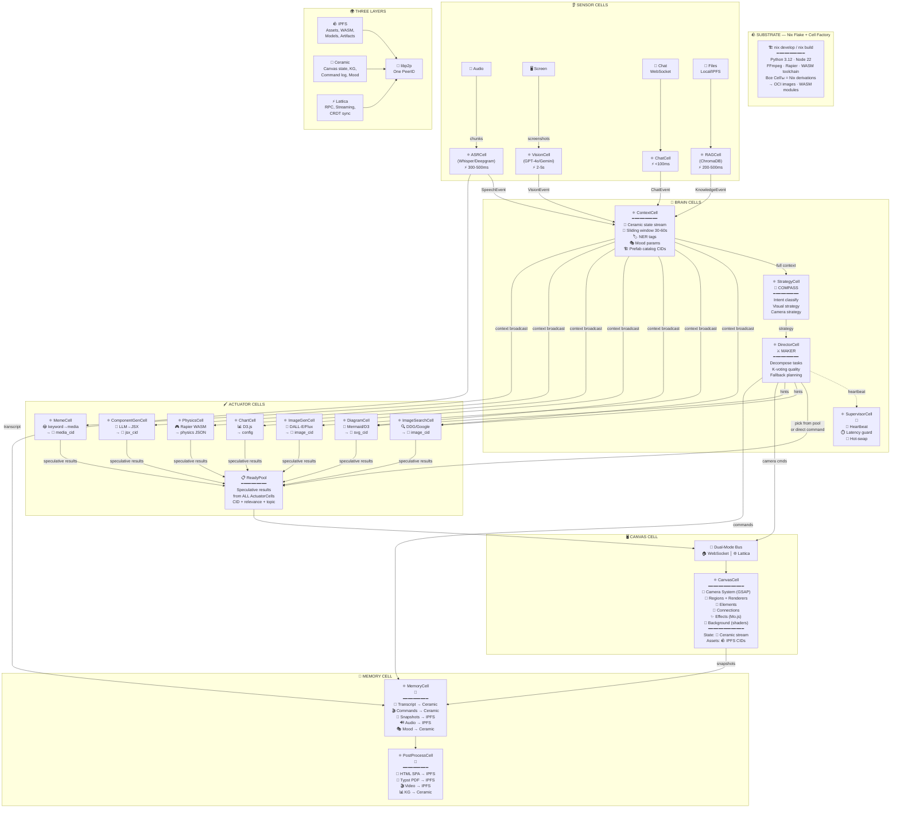

# 🎭🌌⚡ SYNESTHESIA ENGINE v3 ⚡🌌🎭
### Web3-Native Real-Time AI-Driven Infinite Canvas Presentation System
### Серия 1 из 3 — Движок

> 📎 **Серия:** [00-FRACTAL-ATOM](./00-FRACTAL-ATOM.md) → `01-SYNESTHESIA-ENGINE-V3` → [02-SOVEREIGN-MESH](./02-SOVEREIGN-MESH.md)
> 📅 Дата: 2026-04-13
> 🔬 Статус: Архитектурное исследование v3
> ⚛️ Строится на: Фрактальный Атом (Cell + Aspect + Layer + Adapter)

---

## 🗺️ Легенда символов

> Та же легенда, что в [00-FRACTAL-ATOM](./00-FRACTAL-ATOM.md), плюс движковые символы:

| 🏷️ Группа | Символы → Значение |
|---|---|
| ⚛️ **Ядро (из Series 0)** | 🔮 CID · ⚛️ Cell · 🧬 Spec · 🌿 Aspect · ♾️ фрактал |
| 🌍 **Три Силы (из Series 0)** | 🪨 IPFS · 🌊 Ceramic · ⚡ Lattica · 🔗 libp2p |
| 👂 **Входы** | 🎤 голос · 👁️ экран · 💬 чат · 📂 файлы/RAG |
| 🧠 **Мозг** | 🎬 Director · 👑 Supervisor · 🔮 Context Buffer · 🧭 COMPASS · ⚔️ MAKER |
| 🖌️ **Рендер** | 🎮 физика · 📊 графики · 📐 диаграммы · 🖼️ картинки · ✏️ текст · 🎨 генеративное · 💥 эффекты · 🌈 шейдеры/фон |
| 🎥 **Камера** | 🔍 zoom in · 🔭 zoom out · ↩️ return · 🎥 pan · ✂️ cut · 💫 dissolve |
| 💎 **Качество** | 🏎️ скорость · 💎 красота · 🔧 хакабельность · 🤖 AI-friendly · 📏 сложность |
| 🏆 **Тиры** | 🏆 S-тир · 🥇 A-тир · 🥈 B-тир · 🥉 C-тир · 🔮 D-тир (future) |

---

## 📑 Содержание

```
⚡ Часть 0 — ЯДРО: Core Loop v3                                        [стр.1]
🌌 Часть I — Четыре метафоры                                            [стр.2]
⚛️ Часть II — Cell Architecture: всё есть Cell                          [стр.3]
📡 Часть III — Шина: Dual-Mode Bus                                      [стр.4]
🌀 Часть IV — Бесконечный холст: Ceramic Canvas                        [стр.5]
🧠 Часть V — Мозг: Director как COMPASS+MAKER Cell                     [стр.6]
🔌 Часть VI — Plugin DNA: WASM Components на IPFS                      [стр.7]
🧰 Часть VII — Каталог технологий по тирам                              [стр.8]
📼 Часть VIII — Post-Lecture: DAG → Артефакт                            [стр.9]
📎 Приложения: JSON Protocol v3, Cell Spec, Nix Flake                  [стр.10]
```

---

# ⚡ Часть 0 — ЯДРО

## Одна строка (та же, но теперь — через Cells)

> **Events → Director Cell → Commands → Canvas Cell**

Четыре слова. Вся система. **Каждое слово — CID.**

| Элемент | v2 (Web2) | v3 (Web3-Native) |
|---|---|---|
| **Events** 👂 | WebSocket JSON | ⚡ Lattica P2P stream / 🏠 WebSocket (bimodal) |
| **Director** 🧠🎬 | Python process | ⚛️ **DirectorCell** (COMPASS+MAKER, CID-addressed) |
| **Commands** 📤 | JSON через WS | 🔮 CID-addressed command objects |
| **Canvas** 🖥️ | React + Pixi.js | ⚛️ **CanvasCell** (state = 🌊 Ceramic stream) |

💡 **Что изменилось:**
- Каждый компонент — это ⚛️ **Cell** с `Spec_CID + Capabilities + State_CID`
- Состояние canvas — 🌊 **Ceramic stream** (мутабельное, верифицируемое, persistent)
- Ассеты — 🪨 **IPFS CIDs** (иммутабельные, deduplicated, global)
- Коммуникация — через **три слоя** (🪨/🌊/⚡) с бимодальными адаптерами (🏠/🌐)
- Плагины — 📦 **WASM Components** на IPFS с UCAN-авторизацией

Всё остальное — те же детали реализации, только теперь каждая деталь — CID.

---

# 🌌 Часть I — Четыре метафоры

> Три метафоры из v2 **сохранены** (они задали правильные архитектурные решения). Добавлена четвёртая — для Web3.

---

## 🎧🎛️ Метафора 1: «AI Visual DJ» (из v2)

> **Не изменилась.** Система реактивна как DJ-пульт. Никаких блокирующих операций. Каждый визуал может быть прерван следующим.

| 🎧 DJ | 🖥️ v3 Cell Architecture |
|---|---|
| 👂 Слушает энергию зала | 🎤 SensorCell слушает голос спикера |
| 🎵 Выбирает следующий трек | 🎬 DirectorCell выбирает следующую визуализацию |
| 🎛️ Крутит эквалайзер | 🌈 MoodCell меняет стиль через Ceramic stream |
| 🔄 Микширует переходы | 🎥 CameraSystem анимирует через Lattica commands |
| 📦 Ящики с пластинками | 🏗️ PrefabCells на 🪨 IPFS (CID-addressed, global) |
| 🎤 Импровизирует live | 🎨 GeneratorCells создают визуалы через IPVM/local |
| 📼 Записывает сет | 📼 LoggerCell пишет в 🌊 Ceramic stream |

---

## 📦➡️📺 Метафора 2: «Семантический декомпрессор» (из v2)

> **Не изменилась.** Речь — сжатый сигнал. AI — кодек. Канвас — экран.

| 📹 Видеокодек | 🖥️ v3 | 🔮 CID-адресация |
|---|---|---|
| **I-кадр** (ключевой) | 🏗️ **Prefab Cell** | `Spec_CID = hash(layout + content + style)` |
| **P-кадр** (предсказанный) | 🆕 **Incremental Update** | `Command_CID = hash(target + patch)` |
| **B-кадр** (двунаправленный) | ↩️ **Callback** | `Reference_CID → past canvas state` |
| **GOP** (группа кадров) | 🎬 **Scene** | `Scene_CID = hash(commands[])` |

💡 **Новое в v3:** каждый I-кадр (prefab) — это CID. Каждая scene — CID. **Вся лекция = DAG из CID-ов**. Можно воспроизвести любой момент по CID.

---

## 🎮🕹️ Метафора 3: «Knowledge Game Engine» (из v2)

> **Не изменилась.** ECS (Entity-Component-System), а не «React с графикой».

| 🎮 Game Engine | 🖥️ v3 Cell Architecture |
|---|---|
| 🗺️ Scene Graph | ⚛️ CanvasCell (Merkle-DAG элементов) |
| 🖥️ Renderer | ⚛️ RendererCells (WASM-pluggable) |
| ⚛️ Physics Engine | ⚛️ PhysicsCell (Matter.js/Rapier WASM) |
| 🎮 Input System | ⚛️ SensorCells (ASR, Vision, Chat) |
| 🎥 Camera System | CameraSystem внутри CanvasCell |
| 📡 Event System | ⚡ Lattica bus / 🏠 WebSocket bus |
| 📦 Asset Pipeline | 🪨 IPFS CIDs + 🌊 Ceramic registry |
| 🤖 Game Logic | ⚛️ DirectorCell (COMPASS+MAKER) |
| 💾 Save System | 🌊 Ceramic stream (автоматически) |

---

## 🌐🏛️ Метафора 4: «Decentralized Autonomous Show» (НОВАЯ)

> **Как DAO управляет организацией, DAShow управляет лекцией.**

| 🏛️ DAO (Decentralized Autonomous Organization) | 🎭 DAShow (Decentralized Autonomous Show) |
|---|---|
| 📜 Rules → smart contract | 🧬 Rules → DirectorCell Spec_CID |
| 🗳️ Decisions → voting | 🎬 Decisions → Director AI + COMPASS |
| 📊 Treasury → on-chain | 📦 Assets → 🪨 IPFS CIDs |
| 📋 Proposals → governance | 💬 Commands → CID-addressed instructions |
| 📖 History → blockchain | 📖 History → 🌊 Ceramic stream |
| 🆔 Members → wallet addresses | 🆔 Participants → DIDs + UCAN |
| 🔀 Forks → token forks | 🔀 Forks → clone Ceramic stream + remix |

💡 **Архитектурное следствие:**
- Лекция **персистентна** — существует даже после завершения (Ceramic stream)
- Лекция **верифицируема** — каждое решение Director подписано DID
- Лекция **fork-able** — можно клонировать и модифицировать (новый stream)
- Лекция **replayable** — CID root → полное воспроизведение
- Лекция **оплачиваема** — за compute можно платить 🪙 crypto

---

# ⚛️ Часть II — Cell Architecture: Всё есть Cell

## 🧬 Иерархия Cell'ов

```
⚛️ SynapseCell (base) ── абстрактный предок всех Cell'ов движка
│
├── 👂 SensorCell (inputs)
│   ├── 🎤 ASRCell ── speech recognition
│   ├── 👁️ VisionCell ── screen/webcam analysis
│   ├── 💬 ChatCell ── text chat input
│   └── 📂 RAGCell ── file/knowledge retrieval
│
├── 🧠 BrainCell (processing)
│   ├── 🔮 ContextCell ── context buffer (working memory)
│   ├── 🎬 DirectorCell ── COMPASS+MAKER decision engine
│   ├── 👑 SupervisorCell ── watchdog + fallback
│   └── 🧭 StrategyCell ── meta-thinking (COMPASS Meta-Thinker)
│
├── 🖌️ ActuatorCell (outputs)
│   ├── 🔍 ImageSearchCell ── web image search + selection
│   ├── 🎨 ImageGenCell ── AI image generation
│   ├── 📐 DiagramCell ── Mermaid/D3/ReactFlow diagrams
│   ├── 📊 ChartCell ── data visualizations
│   ├── 🎮 PhysicsCell ── Matter.js/Rapier simulations
│   ├── 🧩 ComponentGenCell ── LLM→JSX/SVG generation
│   ├── 🎨 SketchCell ── p5.js/creative coding
│   └── 😂 MemeCell ── meme alerter
│
├── 🖥️ CanvasCell (display)
│   ├── 🎥 CameraSystem ── viewport control
│   ├── 📐 LayoutSystem ── spatial organization
│   ├── 🎭 MoodSystem ── synesthetic style engine
│   └── 🌈 BackgroundSystem ── shader/gradient control
│
└── 📼 MemoryCell (recording)
    ├── 📝 TranscriptStream ── full text log
    ├── 🎬 CommandStream ── all Director commands
    ├── 📸 SnapshotStream ── canvas screenshots
    └── 🔊 AudioStream ── raw audio recording
```

---

## ⚛️ SynapseCell: базовый предок

Каждая Cell движка наследует от **SynapseCell** — абстрактной Cell с общим контрактом:

```typescript
interface SynapseCell {
  // Identity
  spec_cid: CID;           // 🔮 CID спецификации (неизменяемый)
  instance_id: string;      // уникальный ID запущенного экземпляра
  did: DID;                 // 🆔 децентрализованный идентификатор

  // Capabilities
  capabilities: UCAN[];     // 🔑 что Cell разрешено делать

  // State
  state_stream: StreamID;   // 🌊 Ceramic stream для мутабельного состояния

  // Lifecycle
  start(): Promise<void>;
  stop(): Promise<void>;
  spawn(child_spec: CID): Promise<SynapseCell>;

  // Communication
  send(target: DID, msg: Message): Promise<void>;   // ⚡ Lattica / 🏠 WS
  subscribe(topic: string): AsyncIterable<Message>;

  // Health
  heartbeat(): HealthStatus;
}
```

### Каждая Cell — это CID

| ⚛️ Cell | 🧬 Что в Spec_CID | 📦 Build target | 🚀 Runtime |
|---|---|---|---|
| ASRCell | `hash(whisper_config + model_ref + audio_params)` | 📦 OCI (Python + Whisper) | 🏠 Docker / 🌐 IPVM |
| DirectorCell | `hash(compass_config + maker_config + prompts)` | 📦 OCI (Python + LangGraph) | 🏠 Docker / 🌐 IPVM |
| PhysicsCell | `hash(matter_js_config + entities_schema)` | 📦 WASM (Rapier) | 🏠 Browser / 🌐 IPVM |
| DiagramCell | `hash(mermaid_cli + d3_config)` | 📦 WASM/OCI | 🏠 Browser / 🌐 IPVM |
| CanvasCell | `hash(pixi_config + renderer_registry + theme)` | 📦 Browser bundle | 🏠 Browser |
| MemeCell | `hash(meme_db_cid + trigger_rules)` | 📦 OCI lightweight | 🏠 процесс / 🌐 edge |

---

## 👂 SensorCells: Input Pipeline

Четыре **параллельных** Cell'а, каждая — независимый event producer. **Та же архитектура что v2**, теперь как Cells:

| 👂 SensorCell | ⚡ Латентность | 📡 Channel | 📤 Event |
|---|---|---|---|
| 🎤 **ASRCell** (Whisper / Deepgram) | 300-500ms | ⚡ Lattica stream (real-time) | `SpeechEvent {text, timestamps, confidence}` |
| 👁️ **VisionCell** (GPT-4o / Gemini Flash) | 2-5с | ⚡ Lattica request-response | `VisionEvent {description, objects[], screenshot_cid}` |
| 💬 **ChatCell** | <100ms | ⚡ Lattica stream | `ChatEvent {message, sender_did, type}` |
| 📂 **RAGCell** (ChromaDB / Qdrant) | 200-500ms | ⚡ Lattica request-response | `KnowledgeEvent {chunks[], relevance[], source_cids[]}` |

💡 **v3 отличия:**
- 🔮 `screenshot_cid` — каждый скриншот публикуется в IPFS, VisionCell отправляет CID вместо raw data
- 🔮 `source_cids[]` — каждый RAG chunk ссылается на CID исходного файла
- 🆔 `sender_did` — каждое сообщение подписано DID отправителя
- ⚡ Lattica вместо WebSocket — но бимодально (🏠 WebSocket тоже работает)

### 🔑 Принцип: каждая SensorCell — отдельная Cell

```
SensorCell упал? → SupervisorCell перезапускает.
SensorCell отстаёт? → SupervisorCell переключает на fallback.
SensorCell обновлена? → Новый Spec_CID, hot-swap без остановки системы.
```

> 📎 Изоляция и супервизия: `sandboxai/docs/architecture-vision/04-fractal-runtime.md`

---

## 🧠 BrainCells: Обработка и принятие решений

### 🔮 ContextCell — рабочая память

> **Не изменилась с v2**, но теперь state = Ceramic stream.

```
🔮 ContextCell State (Ceramic stream, обновляется каждые 1-2с):
┌─────────────────────────────────────────────────────────────────┐
│ 📝 Скользящее окно транскрипта (30-60с)                        │
│ 🏷️ Активные теги/темы (NER: сущности, понятия)                │
│ 👁️ Последний screenshot_cid + описание экрана                  │
│ 💬 Последние N сообщений чата                                   │
│ 📍 Текущая позиция камеры на канвасе                            │
│ 📊 История показанных элементов (последние 20 CID'ов)          │
│ 🏗️ Каталог доступных prefabs с CID'ами и описаниями            │
│ 📂 Topically relevant RAG chunks + source_cids                  │
│ 🎭 Текущий mood (энергия, темп, тема)                          │
│ 📡 Mesh status (кто подключён, latencies)                       │
└─────────────────────────────────────────────────────────────────┘
```

💡 **v3 отличие:** State записывается в 🌊 Ceramic stream → **верифицируемая история** каждого момента контекста. Можно точно восстановить, что Director «видел» в момент принятия решения.

### 🎬 DirectorCell — единственный, кто принимает решения

**В v3 Director = COMPASS + MAKER agent** (из factory-ai framework):

| 🧠 Компонент | Роль | Источник |
|---|---|---|
| 🧭 **COMPASS Meta-Thinker** | Стратегическое планирование: «какой тип визуализации? какой переход? какой настроение?» | `COMPASS_MAKER_LITESTAR_PORTO/COMPASS.md` |
| ⚔️ **MAKER Decomposer** | Декомпозиция сложных визуалов: «этот слайд → 3 шага: diagram + image + animation» | `COMPASS_MAKER_LITESTAR_PORTO/MAKER_ARCHITECTURE_RU.md` |
| 🔮 **Context Manager** | Агрегация входов в единый контекст для принятия решений | v2 Context Buffer, улучшенный |
| 🎬 **Command Generator** | Конвертация решений в CID-addressed JSON commands | v2 Director, формализованный |

```
Pipeline принятия решений (SPECULATIVE PARALLEL):

👂 SpeechEvent ──┐
👁️ VisionEvent ──┼──► 🔮 ContextCell ──┬──► 🧭 COMPASS ──► ⚔️ MAKER ──► 🎬 Commands
💬 ChatEvent ────┤       (aggregate)    │     (strategy)     (decompose)    (execute)
📂 KnowledgeEvent┘                      │
                                        │      ┌──────────────────────────────────┐
                                        ├─────►│  📋 READY POOL                   │
                                        │      │  (спекулятивные результаты        │
                                        │      │   от всех ActuatorCells)          │
                                        │      └──────────────┬───────────────────┘
                                        │                     │
                                        │                     ▼
                                        ├──► 🔍 ImageSearch   Director PICKS
                                        ├──► 📐 Diagram       из ReadyPool
                                        ├──► 🎮 Physics       или отправляет
                                        ├──► 🎨 ImageGen      direct command
                                        ├──► 📊 Chart         если нет готового
                                        └──► 🧩 ComponentGen
                                        (все работают ПАРАЛЛЕЛЬНО, непрерывно)
```

💡 **Ключевое отличие от v2:** Director не ждёт генерации. Он выбирает из **уже готовых** результатов в ReadyPool. Латентность отображения = только время решения Director (~500ms), не время генерации (2-15с).

#### 🧭 COMPASS: стратегический уровень

> «ЧТО показать и ЗАЧЕМ»

```
COMPASS Input:
  - Context snapshot (from ContextCell)
  - Available prefabs (CIDs + descriptions)
  - Current canvas state (Ceramic stream)
  - Mood parameters

COMPASS Output:
  - Intent classification: {type: "explain" | "compare" | "demonstrate" | "recall" | "summarize"}
  - Visualization strategy: {visual_type: "diagram" | "image" | "physics" | "code" | "table" | ...}
  - Camera strategy: {transition: "smooth_pan" | "zoom_in" | "hard_cut" | ...}
  - Source strategy: {source: "prefab" | "generate" | "search" | "rag"}
  - Mood update: {energy: 0-1, focus: 0-1, ...}
```

#### ⚔️ MAKER: декомпозиция и надёжность

> «КАК показать и насколько НАДЁЖНО»

```
MAKER Input:
  - COMPASS strategy
  - ActuatorCell capabilities (which cells are available)
  - Latency budgets (how much time we have)

MAKER Output:
  - Task decomposition: [{cell: "DiagramCell", command: {...}}, ...]
  - Fallback plan: if primary fails → simplified version
  - Quality tier: {target: "S" | "A" | "B" | "emergency"}
  - K-Voting (for complex decisions): generate 3 variants → pick best
```

### 👑 SupervisorCell — watchdog (сохранён из v2)

| 🔧 Задача | 📝 Механизм | ⚛️ v3 Cell-specific |
|---|---|---|
| 💓 Heartbeat | Каждая Cell пингует каждые 5с | DID-подписанные heartbeat через Lattica |
| ⏱️ Latency guard | Director >5с → fallback | SupervisorCell spawn'ит FallbackCell |
| 🚨 Error handler | ActuatorCell упала → placeholder | CID fallback spec → restart with degraded capabilities |
| 📊 Metrics | Latency, errors, queue depth | Записываются в Ceramic stream |
| 🔄 Hot-swap | Обновление Cell без downtime | Новый Spec_CID → spawn new → drain old → kill old |
| 🛡️ Graceful degradation | API недоступен → локальная модель | Capability downgrade через UCAN attenuation |

---

## 🏎️⚡ SPECULATIVE PARALLEL PIPELINE — главная архитектурная инновация v3

### 💡 Проблема последовательного pipeline

В наивной архитектуре Director работает **последовательно**:

```
Спикер сказал X → Director думает (1-3с) → отправляет запрос ONE ActuatorCell (2-15с) → отображение
Суммарная латентность: 3-18 секунд 🔴
```

Это **неприемлемо** для живой лекции. Спикер уже перешёл к следующей мысли, а визуализация предыдущей ещё не готова.

### 🧠 Решение: спекулятивное параллельное исполнение

**Все ActuatorCell'ы работают ОДНОВРЕМЕННО и НЕПРЕРЫВНО**, как GPU shader cores. Каждая Cell **подписана** на поток контекста и **спекулятивно генерирует** визуализации на основе того, что слышит:

```
                    🔮 ContextCell (broadcast stream)
                    ║
          ┌─────────╬─────────────┬──────────────┬──────────────┐
          ▼         ▼             ▼              ▼              ▼
    🔍 ImageSearch  📐 Diagram   🎮 Physics    🎨 ImageGen   📊 Chart
    «ищу картинки   «строю       «симулирую    «генерирую    «строю
     по контексту»   схему»       по контексту»  по контексту» график»
          │         │             │              │              │
          ▼         ▼             ▼              ▼              ▼
    ┌─────────────────────────────────────────────────────────────────┐
    │              📋 READY POOL (готовые визуализации)               │
    │                                                                 │
    │  🔍 image_cid: "bafy...", relevance: 0.85, topic: "NixOS"      │
    │  📐 svg_cid: "bafy...", type: "arch_diagram", topic: "NixOS"   │
    │  🎮 physics_cfg: {...}, type: "gravity_demo", topic: "forces"   │
    │  🎨 image_cid: "bafy...", type: "generated", topic: "NixOS"    │
    │  📊 chart_cfg: {...}, type: "comparison", topic: "distros"      │
    │                                                                 │
    └──────────────────────────┬──────────────────────────────────────┘
                               │
                               ▼
                    🎬 Director PICKS (мгновенно!)
                    «Для текущей фразы лучше всего подходит 📐 diagram»
                               │
                               ▼
                    🖥️ Canvas отображает (0ms дополнительной задержки)
```

### ⚡ Сравнение латентности

| Метрика | 🔴 Sequential (v2) | 🟢 Speculative Parallel (v3) |
|---|---|---|
| **Латентность отображения** | 3-18с (Director + Generation) | **<1с** (только Director pick) |
| **Потребление compute** | Низкое (один запрос) | Высокое (все Cells работают) |
| **Разнообразие** | Один результат | **5-9 результатов** на выбор |
| **Качество выбора** | Director выбирает вслепую | Director выбирает из готовых |
| **Обработка тишины** | Idle (ничего не делают) | Cells **продолжают** генерировать |
| **Отказоустойчивость** | Одна Cell упала → нет визуала | 8 других Cells имеют результаты |

### 🎬 Роли в Speculative Pipeline

**ActuatorCells** — «исполнители-на-опережение»:
- 📥 Подписаны на ContextCell stream (получают контекст каждые 1-2с)
- 🔄 Непрерывно генерируют визуализации по своей специальности
- 📤 Публикуют результаты в ReadyPool с метаданными (topic, type, relevance, CID)
- 🗑️ Старые результаты с низкой relevance автоматически вытесняются

**DirectorCell** — «куратор-дирижёр»:
- 📥 Получает context + ReadyPool snapshot
- 🧭 COMPASS решает: «какой ТИП визуализации нужен сейчас?»
- 🔍 Смотрит в ReadyPool: «есть ли готовый подходящий?»
- ✅ **Да** → мгновенно отправляет на Canvas (0ms generation delay)
- ❌ **Нет** → отправляет **срочный запрос** конкретной Cell + использует fallback из Pool
- 📡 Отправляет **hints** (подсказки) Cell'ам о будущих темах

**ReadyPool** — «витрина готовых визуалов»:
- 💾 Circular buffer последних N результатов от каждой Cell
- 🏷️ Каждый результат: `{cell_did, result_cid, topic, type, relevance_score, created_at}`
- 🔍 Director может query: «покажи все results с topic ≈ 'NixOS' и relevance > 0.7»
- 🪨 Все CID'ы уже в IPFS → ничего не теряется, можно переиспользовать

### 📡 Hints: Director подсказывает будущее

Director может отправлять **hints** — «мягкие подсказки» о том, что спикер **вероятно** скажет дальше:

```jsonc
{
  "type": "Hint",
  "source_did": "did:key:zDirector",
  "priority": "warm",              // "warm" = заготовь | "hot" = скорее всего покажем
  "topics": ["binary_tree", "data_structures"],
  "preferred_types": ["diagram", "physics"],
  "context": "Speaker is explaining algorithms, likely moving to tree structures"
}
```

| 🔥 Hint priority | Значение | Действие ActuatorCell |
|---|---|---|
| `cold` | «Может пригодиться» | Генерируй в фоне с низким приоритетом |
| `warm` | «Скорее всего понадобится» | Генерируй с обычным приоритетом |
| `hot` | «Почти наверняка покажем» | Генерируй с максимальным приоритетом |
| `fire` | «Покажи прямо сейчас» | Это уже не hint, а прямая команда |

💡 **Hints = CPU prefetch.** Как процессор предзагружает данные в кэш до того, как они понадобятся, Director предзагружает визуализации до того, как спикер дойдёт до темы.

### 🔄 Lifecycle спекулятивного результата

```
1. 🔮 ContextCell broadcast → все ActuatorCells получают контекст
2. 🖌️ ActuatorCell генерирует визуализацию спекулятивно
3. 🪨 Результат → ipfs add → CID
4. 📋 CID + metadata → ReadyPool
5. 🎬 Director просматривает ReadyPool → picks best match
6. 📤 Canvas получает команду с CID → отображает мгновенно
7. 🗑️ Неиспользованные результаты:
   a) Остаются в IPFS (кеш для будущих лекций) ← 🕳️ глобальная мемоизация
   b) Вытесняются из ReadyPool по TTL/relevance
```

### 📊 ReadyPool: структура данных

```typescript
interface ReadyPoolEntry {
  cell_did: DID;                    // кто сгенерировал
  result_cid: CID;                  // CID результата в IPFS
  result_type: "image" | "diagram" | "chart" | "physics" | "sketch" | "component" | "meme";
  topic_embedding: Float32Array;    // vector embedding темы (для semantic search)
  topic_keywords: string[];         // ключевые слова
  relevance_score: number;          // 0-1, насколько релевантно текущему контексту
  quality_tier: "S" | "A" | "B";   // оценка качества
  latency_ms: number;               // сколько заняла генерация
  created_at: number;               // timestamp
  ttl_ms: number;                   // время жизни в pool
}

interface ReadyPool {
  entries: Map<CID, ReadyPoolEntry>;
  max_per_cell: number;             // макс записей от одной Cell (default: 5)
  max_total: number;                // макс записей всего (default: 50)

  query(filter: {
    types?: string[];
    min_relevance?: number;
    topic_similar_to?: string;       // semantic similarity search
  }): ReadyPoolEntry[];

  pick_best(context: Context): ReadyPoolEntry | null;
}
```

### 🌐 Speculative Pipeline + Web3 = Global Memoization

Неиспользованные спекулятивные результаты **не пропадают**:

```
ActuatorCell generates diagram for "binary tree" → CID: bafy2bzBinaryTree...
Director doesn't use it this lecture
But CID exists in IPFS forever

Next lecture (same or different user):
Director needs "binary tree" diagram → checks IPFS cache → CID found! → 0ms generation
```

💡 **Спекулятивная генерация = заполнение глобального кеша.** Каждая лекция делает будущие лекции **быстрее**. Это самоулучшающаяся система.

---

## 🖌️ ActuatorCells: Render Agents

Каждый ActuatorCell работает в **двух режимах** одновременно:
1. 🔄 **Speculative mode** — непрерывно генерирует по контексту → ReadyPool
2. ⚡ **Direct mode** — выполняет прямые команды от Director (приоритет)

| 🖌️ ActuatorCell | ⚡ Латентность | 🔄 Speculative | ⚡ Direct | 📦 Runtime |
|---|---|---|---|---|
| 🔍 **ImageSearchCell** | 2-5с | Ищет по ключевым словам контекста | `search_images(query)` | 🏠 OCI |
| 🎨 **ImageGenCell** | 5-15с | Генерирует по описанию темы | `generate_image(prompt)` | 🏠 OCI / 🌐 API |
| 📐 **DiagramCell** | 0.5-3с | Строит схемы по NER-сущностям | `build_diagram(spec)` | 📦 WASM |
| 📊 **ChartCell** | 0.5-2с | Строит графики по упомянутым данным | `build_chart(type, data)` | 📦 WASM |
| 🎮 **PhysicsCell** | <100мс | Симулирует по физическим словам | `physics_config(entities)` | 📦 WASM |
| 🧩 **ComponentGenCell** | 2-8с | Генерирует UI по контексту | `generate_component(prompt)` | 🏠 OCI |
| 🎨 **SketchCell** | 1-3с | Создаёт generative art по mood | `generate_sketch(prompt)` | 🏠 OCI |
| 😂 **MemeCell** | <500мс | Ищет мемы по ключевым словам | `trigger_meme(keyword)` | 📦 WASM |
| 📐 **LayoutCell** | <200мс | Пересчитывает layout при изменениях | `calculate_layout(state)` | 📦 WASM |

💡 **Каждая Cell — независимый «музыкант в оркестре».** Они все играют одновременно, а Дирижёр (Director) решает, чья «партия» звучит в данный момент.

### 🔍 ImageSearchCell — подробнее (обновлённый v2)

```
1. 🔎 Поиск 10 картинок (DuckDuckGo / Google CSE / Brave)
2. 🖼️ Сборка 10 превью в grid с номерами → ipfs add → CID
3. 👁️ VisionModel: «Контекст: [текст]. Какая картинка (1-10) лучше? Ответь цифрой.»
4. 📤 ipfs add выбранной картинки → image_cid
5. 🔮 Возврат: image_cid + metadata (source_url, relevance_score) → ReadyPool
```

В speculative mode ImageSearchCell запускает шаги 1-5 **каждый раз, когда контекст значительно меняется** (новые ключевые слова). Результаты накапливаются в ReadyPool.

---

# 📡 Часть III — Шина: Dual-Mode Bus

## 🔌 Один протокол, два транспорта

Все Cell'ы общаются через **единый JSON-протокол** (Commands + Events). Транспорт — бимодальный:

```
┌───────────────────────────────────────────────────────────────┐
│                   JSON Protocol (Commands + Events)           │
│                   Один и тот же формат, один и тот же API     │
├───────────────────────┬───────────────────────────────────────┤
│ 🏠 LOCAL MODE         │ 🌐 P2P MODE                          │
│                       │                                       │
│ WebSocket on localhost│ Lattica (libp2p)                      │
│ <1ms latency          │ 1-200ms latency                       │
│ In-process channels   │ DHT discovery                         │
│ No encryption needed  │ Noise/TLS encryption                  │
│ Single machine        │ Multi-node mesh                       │
│ Trust: implicit       │ Trust: UCAN verification              │
└───────────────────────┴───────────────────────────────────────┘
```

### 📤 Command Protocol v3

```jsonc
{
  "command_cid": "bafy2bza...",        // 🔮 CID этой команды
  "type": "SpawnRegion",               // тип команды
  "source_did": "did:key:zDirector",   // 🆔 кто отправил
  "target_did": "did:key:zCanvas",     // 🆔 кому
  "timestamp": 1744502400000,
  "payload": {
    "region_type": "physics",
    "position": {"x": 3000, "y": 800},
    "config": {
      "entities": [
        {"type": "circle", "label": "ball", "radius": 30},
        {"type": "rectangle", "label": "wall", "width": 200, "height": 20, "isStatic": true}
      ],
      "gravity": {"x": 0, "y": 1}
    },
    "entrance": "scale_bounce",
    "renderer_cid": "bafy2bzPhysicsRenderer..."  // 🔮 CID рендерера
  },
  "signature": "ed25519:..."           // 🔑 подпись отправителя
}
```

### 📋 Полный каталог команд

| 📤 Command | 🎯 Target | 📝 Описание |
|---|---|---|
| `SpawnRegion` | CanvasCell | Создать Region с pluggable renderer |
| `UpdateRegion` | CanvasCell | Обновить содержимое Region |
| `DestroyRegion` | CanvasCell | Удалить Region с exit-анимацией |
| `SpawnElement` | CanvasCell | Создать Element внутри Region |
| `UpdateElement` | CanvasCell | Обновить Element |
| `DestroyElement` | CanvasCell | Удалить Element |
| `SpawnConnection` | CanvasCell | Создать связь между Region/Element |
| `SpawnEffect` | CanvasCell | Запустить временный эффект |
| `MoveViewport` | CameraSystem | Переместить камеру (с transition) |
| `SetBackground` | BackgroundSystem | Изменить фоновый шейдер/градиент |
| `EmphasisElement` | CanvasCell | Подсветить элемент |
| `UpdateMood` | MoodSystem | Обновить mood-параметры |
| `PlayMedia` | CanvasCell | Воспроизвести аудио/видео/GIF (meme alert) |

---

# 🌀 Часть IV — Бесконечный Холст: Ceramic Canvas

## 🧠💭 Канвас как пространственная память (сохранён из v2)

Рабочая память человека — **7±2 элемента**. Канвас снимает это ограничение: все идеи **существуют одновременно**, но камера показывает только релевантные.

- 📍 **Позиция** = тематическая близость
- 📏 **Размер** = важность
- 🔗 **Связи** = отношения
- 🔍 **Масштаб** = уровень абстракции
- 🎨 **Цвет** = категория

## 🔷 6 Примитивов канваса (сохранены из v2)

| # | 🔷 Примитив | 📝 Описание | 🔮 v3: CID |
|---|---|---|---|
| 1 | 🎥 **Viewport** | `{x, y, zoom, rotation}` | State в Ceramic stream |
| 2 | 🔲 **Region** | Область с pluggable renderer | `region_cid = hash(config + renderer_cid)` |
| 3 | 🔹 **Element** | Атомарная единица (текст, картинка, шейп) | `element_cid = hash(type + content_cid)` |
| 4 | 🔗 **Connection** | Визуальная связь | `connection_cid = hash(from + to + style)` |
| 5 | ✨ **Effect** | Временный оверлей | `effect_cid = hash(type + params)` |
| 6 | 🌈 **Background** | Амбиентный фон | `bg_cid = hash(shader_code + params)` |

## 🎬 4 Анимационных слота (сохранены из v2)

| 🎬 Слот | 📝 Когда | 💡 Пример |
|---|---|---|
| 💫 **Entrance** | При создании | Fly-in, scale-bounce, typewriter, vivus-draw |
| ⭐ **Emphasis** | При подсветке | Pulse-glow, shake, color-flash |
| 🔄 **Active** | Пока видим | Idle breathing, subtle float, particle emit |
| 💨 **Exit** | При удалении | Fade-out, shrink, dissolve, fly-away |

Анимация — **декоратор**, не часть рендерера. Анимационный движок (GSAP/Anime.js/Motion One) заменяем без изменения рендереров.

---

## 🌊 Canvas State = Ceramic Stream

💡 **Главная революция v3:** состояние канваса — это 🌊 **Ceramic stream**.

```
Canvas State Stream:
  StreamID: ceramic://k2t6wzhkh...
  Controller DID: did:key:zCanvas...
  Model: SynesthesiaCanvasState v1

  Event 0: {type: "init", viewport: {x:0,y:0,zoom:1}, regions: [], mood: {...}}
  Event 1: {type: "SpawnRegion", region: {id: "r1", ...}}
  Event 2: {type: "SpawnElement", region_id: "r1", element: {...}}
  Event 3: {type: "MoveViewport", target: {x:2000,y:0}, transition: "smooth_pan"}
  ...
  Event N: {type: "snapshot", full_state_cid: "bafy2bza..."}
```

### Что это даёт:

| Возможность | Как работает |
|---|---|
| 🔮 **Полная история** | Каждый event — CID в hash-linked chain |
| ↩️ **Replay** | Воспроизведи events 0→N → получишь полное состояние |
| 🔀 **Fork** | Клонируй stream → модифицируй → новая лекция |
| 📊 **GraphQL query** | ComposeDB: «покажи все regions с тегом 'nix'» |
| 🔐 **Верификация** | Каждый event подписан DID controller'а |
| ⚓ **Anchoring** | Merkle root → Ethereum → неизменяемый timestamp |
| 📡 **Multi-viewer** | Несколько клиентов подписаны на stream → real-time sync |

---

## 🎥📹 Система камеры (сохранена из v2, расширена)

| 🎬 Transition | 🖼️ Визуально | 🧠 Когда Director выбирает | ⏱️ ms |
|---|---|---|---|
| 🎥 `smooth_pan` | Плавный полёт камеры | Продолжение мысли | 800-1500 |
| 🏎️ `fast_pan` | Резкий перелёт | Смена темы | 300-500 |
| 🔍 `zoom_in` | Приближение | «Детальнее...» | 600-1000 |
| 🔭 `zoom_out` | Отдаление | «В общей картине...» | 600-1000 |
| ↩️ `return_to` | Перелёт к прошлому + подсветка | «Как мы обсуждали...» | 800-1200 |
| 🔲 `zoom_to_fit` | Масштаб под группу Regions | «Сравним оба...» | 1000-1500 |
| 🌀 `spiral_zoom` | Спиральное приближение | Кульминация | 1500-2500 |
| ✂️ `hard_cut` | Мгновенная телепортация | Контраст, шок | 0 |
| 💫 `dissolve` | Alpha crossfade | Плавная связь | 800-1200 |
| 🔃 `rotate_reveal` | 3D-поворот (имитация) | «С другой стороны...» | 1000-1500 |
| 📱 `split_view` | Канвас делится | «Сравним бок о бок» | 600-800 |
| 🪞 `mirror_flip` | Зеркальный переворот | «А теперь наоборот» | 800-1000 |
| 🎢 `cinematic_dolly` | Dolly zoom (Vertigo) | «Подождите...» | 2000-3000 |
| 📸 `snapshot_freeze` | Камера замирает + вспышка | Фиксация момента | 400-600 |

---

## 🏗️📦 Система Prefabs (обновлена для CID)

Prefabs — **заранее размещённые Regions** на канвасе. В v3 каждый prefab — CID:

```jsonc
{
  "prefabs": [
    {
      "prefab_cid": "bafy2bzPrefabNixArch...",  // 🔮 CID этого prefab
      "id": "pf_nix_arch",
      "position": {"x": 0, "y": 0},
      "size": {"w": 1920, "h": 1080},
      "description": "Архитектура NixOS: модули, flakes, store",
      "tags": ["nix", "architecture", "os"],
      "content_cid": "bafy2bzContent...",        // 🔮 CID контента
      "renderer_cid": "bafy2bzMermaidRenderer...",// 🔮 CID рендерера
      "locked": false
    }
  ]
}
```

💡 **Prefabs на IPFS:** prefabs.json → `ipfs add` → CID. Можно **шарить** набор prefabs между лекциями. Можно публиковать в **marketplace** prefabs.

## 🌈🎭 Mood System (сохранён из v2)

| 🎭 Параметр | 📡 Определяется | 🖥️ Меняется |
|---|---|---|
| ⚡ **Энергия** | Скорость речи, громкость | Скорость анимаций, burst-эффекты |
| 🎯 **Фокус** | Технический жаргон, факты | Контрастность, чёткость |
| 🌊 **Спокойствие** | Медленная речь, паузы | Мягкие переходы, пастельные цвета |
| 🎉 **Восторг** | Восклицания, смех | Confetti, яркие цвета |
| 🤔 **Задумчивость** | Вопросы, паузы | Затемнение, spotlight |

Mood state → 🌊 Ceramic stream → подписка всех renderer'ов → автоматическая адаптация стиля.

---

# 🔌 Часть VI — Plugin DNA: WASM Components на IPFS

## 🧬 Три типа плагинов

Каждый плагин — **WASM Component** с WIT-интерфейсом:

| 🔌 Тип | WIT Interface | Пример |
|---|---|---|
| 👂 **InputPlugin** | `process-input(raw: bytes) → Event` | Кастомный ASR, gesture recognition |
| 🧠 **AgentPlugin** | `decide(context: Context) → Command[]` | Кастомный Director, specialist agent |
| 🖌️ **RendererPlugin** | `render(config: JSON) → CanvasOps` | 3D renderer, custom visualization |

### 🧬 Plugin Spec (CID-addressed)

```jsonc
{
  "plugin_cid": "bafy2bzPlugin...",        // 🔮 CID WASM-модуля
  "name": "synesthesia-plugin-physics-rapier",
  "version": "1.0.0",
  "type": "renderer",
  "wit_interface": "renderer-plugin-v1",
  "author_did": "did:key:zAuthor...",      // 🆔 автор
  "capabilities_required": [               // 🔑 что нужно плагину
    "canvas/write",
    "gpu/webgl"
  ],
  "dependencies": [                         // 📦 зависимости (тоже CIDs)
    "bafy2bzRapierWasm...",
    "bafy2bzGSAP..."
  ],
  "metadata": {
    "description": "Rapier-based physics renderer with GSAP animations",
    "tags": ["physics", "rapier", "animation"],
    "license": "MIT",
    "size_bytes": 2_100_000
  }
}
```

## 🛒 Plugin Lifecycle

```
1. 🏗️ Build:    nix build → WASM Component → CID
2. 🪨 Publish:  ipfs add plugin.wasm → CID
3. 🌊 Register: ComposeDB → Plugin model instance → discoverable
4. 🔍 Discover: GraphQL query: "type=renderer, tag=physics" → CID[]
5. 🕳️ Resolve:  CID → Bitswap → download WASM
6. 🔑 Authorize: UCAN check: does requester have capability for this plugin?
7. 🚀 Execute:  Browser WASM runtime / IPVM Homestar
8. 🌊 Monitor:  Usage metrics → Ceramic stream
```

## 🛒 Plugin Marketplace (future)

```
ComposeDB schema: SynesthesiaPlugin
┌─────────────────────────────────────────────────┐
│ id:           StreamID (auto)                    │
│ cid:          String! (IPFS CID of WASM)         │
│ name:         String!                            │
│ type:         PluginType! (input/agent/renderer)  │
│ author:       DID!                               │
│ version:      String!                            │
│ downloads:    Int                                │
│ rating:       Float                              │
│ price_token:  String? (payment token address)    │
│ price_amount: BigInt?                            │
│ tags:         [String!]!                         │
│ wit:          String! (interface version)         │
│ deps:         [String!]! (dependency CIDs)        │
│ created_at:   DateTime!                          │
└─────────────────────────────────────────────────┘

Query: plugin(where: {type: RENDERER, tags_in: ["physics"]}) {
  cid, name, rating, price_amount
}
```

💡 **Pay-per-use:** автор плагина получает 🪙 crypto каждый раз, когда плагин используется. UCAN delegation включает payment capability.

---

# 🧰 Часть VII — Каталог технологий по тирам

## 🖌️ Визуализация и анимация

| 🏆 Тир | Технология | 🏎️ | 💎 | 🤖 | 📦 WASM? | Роль в движке |
|---|---|---|---|---|---|---|
| 🏆 S | **PixiJS v8** | ⚡⚡⚡ | ⭐⭐⭐ | ⭐⭐⭐ | 🟡 partial | Primary canvas renderer (2D WebGPU/WebGL) |
| 🏆 S | **GSAP** | ⚡⚡⚡ | ⭐⭐⭐ | ⭐⭐⭐ | ❌ JS-only | Animation engine (все 4 слота) |
| 🏆 S | **D3.js** | ⚡⚡ | ⭐⭐⭐ | ⭐⭐⭐ | ❌ JS-only | Charts, data viz, force layouts |
| 🥇 A | **Three.js** | ⚡⚡ | ⭐⭐⭐ | ⭐⭐ | 🟡 partial | 3D scenes когда нужно |
| 🥇 A | **Rapier** | ⚡⚡⚡ | ⭐⭐ | ⭐⭐ | ✅ WASM native | Physics engine (Rust→WASM) |
| 🥇 A | **Rive** | ⚡⚡⚡ | ⭐⭐⭐ | ⭐ | ✅ WASM native | Pre-built interactive animations |
| 🥇 A | **Motion Canvas** | ⚡⚡ | ⭐⭐⭐ | ⭐⭐⭐ | ❌ | Programmatic animation (TypeScript, code=video) |
| 🥈 B | **Lottie** | ⚡⚡⚡ | ⭐⭐ | ⭐ | 🟡 | After Effects → JSON → web |
| 🥈 B | **Mo.js** | ⚡⚡ | ⭐⭐⭐ | ⭐⭐ | ❌ | Burst effects, morphing |
| 🥈 B | **p5.js** | ⚡ | ⭐⭐⭐ | ⭐⭐⭐ | ❌ | Generative art, creative coding |
| 🥈 B | **Rough.js** | ⚡⚡ | ⭐⭐⭐ | ⭐⭐ | ❌ | Hand-drawn style graphics |
| 🥉 C | **Anime.js** | ⚡⚡ | ⭐⭐ | ⭐⭐ | ❌ | Lightweight alt to GSAP |
| 🥉 C | **Hydra** | ⚡ | ⭐⭐⭐ | ⭐⭐ | ❌ | Live-coding shaders (background) |
| 🔮 D | **Manim WASM** | ⚡ | ⭐⭐⭐ | ⭐⭐⭐ | 🔬 experimental | Math animations (когда stable) |
| 🔮 D | **Remotion** | ⚡ | ⭐⭐⭐ | ⭐⭐ | ❌ | Post-production video rendering |

### 🏆 Рекомендуемый стек визуализации

```
PRIMARY RENDERER:  PixiJS v8 (WebGPU→WebGL2 fallback)
ANIMATION ENGINE:  GSAP (entrance/emphasis/active/exit)
DATA VIZ:          D3.js (charts, force graphs, treemaps)
PHYSICS:           Rapier WASM (deterministic, fast)
DIAGRAMS:          Mermaid→SVG (server-side render) + D3 force layouts
3D (when needed):  Three.js (integrated via PixiJS layer)
EFFECTS:           Mo.js (bursts) + GSAP (morphs) + CSS
GENERATIVE:        p5.js (creative coding, sketch gen)
BACKGROUND:        CSS gradients + Hydra shaders (mood-driven)
POST-PRODUCTION:   Remotion + Motion Canvas
```

---

## 🧠 AI / Agent Frameworks

| 🏆 Тир | Технология | Роль | 🟢 Плюсы | 🔴 Минусы |
|---|---|---|---|---|
| 🏆 S | **LangGraph** | Director orchestration | 🟢 Граф состояний, human-in-loop, streaming | 🔴 LangChain dependency |
| 🏆 S | **DSPy** | Prompt optimization | 🟢 Self-improving prompts, MIPROv2 | 🔴 Learning curve |
| 🏆 S | **MCP** | Tool interface | 🟢 Standard, framework-agnostic | 🔴 Spec evolving fast |
| 🥇 A | **OpenAI Agents SDK** | Quick MVP | 🟢 Streaming, tool use | 🔴 Vendor lock-in |
| 🥇 A | **PydanticAI** | Structured output | 🟢 Type-safe, multi-provider | 🔴 Newer, less battle-tested |
| 🥈 B | **CrewAI** | Multi-agent | 🟢 Easy multi-agent | 🔴 Less flexible graphs |
| 🥉 C | **AutoGen** | Research | 🟢 Microsoft backing | 🔴 Complex setup |

### 🏆 Рекомендуемый AI стек

```
ORCHESTRATION:   LangGraph (Director state machine)
OPTIMIZATION:    DSPy (prompt auto-optimization for quality)
TOOL INTERFACE:  MCP (unified tool access)
STRUCTURED I/O:  PydanticAI (typed LLM outputs)
STRATEGY:        COMPASS pattern (Meta-Thinker module)
RELIABILITY:     MAKER pattern (K-voting, red-flagging)
```

---

## 🌐 Web3 / Decentralization

| 🏆 Тир | Технология | Layer | Роль | Readiness |
|---|---|---|---|---|
| 🏆 S | **IPFS (Kubo)** | 🪨 | Immutable storage | ✅ Production |
| 🏆 S | **libp2p** | 🔗 | P2P transport | ✅ Production |
| 🥇 A | **Ceramic + ComposeDB** | 🌊 | Mutable state + GraphQL | ✅ Production (350M events) |
| 🥇 A | **UCAN** | 🔑 | Capability auth | ✅ Spec stable |
| 🥇 A | **DID:key** | 🆔 | Identity | ✅ Standard |
| 🥈 B | **Lattica** | ⚡ | Real-time P2P | 🟡 Beta (2B+ P2P connections) |
| 🥈 B | **Lit Protocol** | 🔐 | Threshold encryption | 🟡 Production but niche |
| 🥉 C | **IPVM (Homestar)** | ⚡ | Decentralized compute | 🔬 Alpha |
| 🥉 C | **Filecoin** | 🪨 | Incentivized storage | ✅ Production but expensive |
| 🔮 D | **Internet Computer (ICP)** | ⚡ | Full-stack dapp | ✅ but vendor-specific |
| 🔮 D | **Radicle** | 📂 | P2P Git | 🟡 Niche |
| 🔮 D | **Tangled** | 📂 | P2P Git (Nix-native) | 🔬 Early |

---

# 📼 Часть VIII — Post-Lecture: DAG → Артефакт

## 📊 Запись как Merkle-DAG

Вся лекция записывается **автоматически** в Ceramic + IPFS:

```
Lecture Merkle-DAG:

🔮 Root CID (lecture)
├── 📝 Transcript Stream (Ceramic)
│   ├── Event: {ts: 0, text: "Добро пожаловать на лекцию..."}
│   ├── Event: {ts: 3200, text: "Начнём с архитектуры NixOS..."}
│   └── ...
├── 🎬 Command Stream (Ceramic)
│   ├── Event: {ts: 3500, cmd: SpawnRegion{...}}
│   ├── Event: {ts: 4200, cmd: MoveViewport{...}}
│   └── ...
├── 📸 Snapshots (IPFS)
│   ├── bafy2bzSnapshot_t0000... (canvas @ 0s)
│   ├── bafy2bzSnapshot_t0030... (canvas @ 30s)
│   └── ...
├── 🔊 Audio (IPFS)
│   └── bafy2bzAudioFull...
├── 🎭 Mood History (Ceramic)
│   └── [{ts: 0, energy: 0.5}, {ts: 60, energy: 0.8}, ...]
└── 📦 Assets used (IPFS CIDs)
    ├── bafy2bzImage001...
    ├── bafy2bzDiagram003...
    └── ...
```

## 🔄 Transformation Pipeline

```
Lecture DAG
    │
    ▼ Post-Processing Cell (LLM + templates)
    │
    ├──► 📄 HTML SPA (interactive replay)
    │    └── CID: bafy2bzHTML...
    │
    ├──► 📑 Typst PDF (structured document with diagrams)
    │    └── CID: bafy2bzPDF...
    │
    ├──► 🎬 Video (Remotion render from command stream)
    │    └── CID: bafy2bzVideo...
    │
    └──► 📊 Knowledge Graph (ComposeDB entities + relations)
         └── StreamID: ceramic://k2t6wz...
```

| 📤 Артефакт | 🏗️ Как строится | 📦 Формат | 🔮 CID? |
|---|---|---|---|
| 📄 **HTML SPA** | Command stream → React replay app | Static HTML/JS/CSS | ✅ → IPFS |
| 📑 **Typst PDF** | Transcript + snapshots → LLM structuring → Typst compile | PDF | ✅ → IPFS |
| 🎬 **Video** | Command stream → Remotion/Motion Canvas render | MP4/WebM | ✅ → IPFS |
| 📊 **Knowledge Graph** | NER + entity extraction → ComposeDB models | GraphQL queryable | ✅ → Ceramic |

💡 **Каждый артефакт — CID.** Шаришь ссылку `ipfs://bafy2bz...` → получатель видит точную копию лекции. Навсегда. Без сервера.

---

# 📎 Приложение A: Полная архитектурная диаграмма v3



---

# 📎 Приложение B: Nix Flake для движка

```nix
{
  description = "Synesthesia Engine v3 — Web3-Native Presentation System";

  inputs = {
    nixpkgs.url = "github:NixOS/nixpkgs/nixos-unstable";
    flake-parts.url = "github:hercules-ci/flake-parts";
    den.url = "github:vic/den";
    nix2container.url = "github:nlewo/nix2container";
    uv2nix.url = "github:pyproject-nix/uv2nix";
    pyproject-nix.url = "github:pyproject-nix/pyproject.nix";
  };

  outputs = inputs @ { flake-parts, den, ... }:
    flake-parts.lib.mkFlake { inherit inputs; } {
      imports = [
        den.flakeModule
        ./cells/sensors.nix       # ASR, Vision, Chat, RAG cells
        ./cells/brain.nix         # Director, Supervisor, Context cells
        ./cells/actuators.nix     # ImageSearch, Diagram, Physics cells
        ./cells/canvas.nix        # Canvas cell (React + PixiJS)
        ./cells/memory.nix        # Logger, PostProcessor cells
        ./cells/plugins.nix       # WASM plugin build targets
      ];

      den.aspects = {
        core = ./aspects/core;       # shared config
        brain = ./aspects/brain;     # AI agent config
        render = ./aspects/render;   # visualization config
        sensor = ./aspects/sensor;   # input pipeline config
        mood = ./aspects/mood;       # style/synesthesia config
        web3 = ./aspects/web3;       # IPFS/Ceramic/Lattica config
      };

      perSystem = { pkgs, ... }: {
        devShells.default = pkgs.mkShell {
          packages = with pkgs; [
            python312 nodejs_22 pnpm ffmpeg
            wasm-pack wasm-bindgen-cli
            ipfs ceramic-one
            process-compose
          ];
        };
      };
    };
}
```

---

# 📎 Приложение C: Отвергнутые, но великолепные технологии

> Из v2 сохранён анализ каждой технологии. Вот те, что не вошли в основной стек, но заслуживают изучения:

| Технология | Почему крутая | Почему отвергнута | Возможная интеграция |
|---|---|---|---|
| 🎬 **Remotion** | React-based video rendering, code=video | Too slow for real-time, server-side render | 🟢 Post-lecture video generation (PostProcessCell) |
| 📐 **Manim** | Beautiful math animations (3Blue1Brown) | Python-only, slow render, not web-native | 🟡 WASM port когда появится → PhysicsCell |
| ✏️ **Excalidraw** | Hand-drawn infinite canvas | No programmatic control API | 🟢 Export SVGs as prefabs → IPFS CIDs |
| 🔀 **ReactFlow** | Node-based graph editor | Limited to node-wire paradigm | 🟢 Diagram rendering plugin (RendererCell) |
| 📐 **Typst** | Beautiful document typesetting | Compile-time, not real-time | 🟢 Post-lecture PDF (PostProcessCell) |
| 🌊 **Motion One** | Tiny WAAPI-based animation lib | Less features than GSAP | 🟡 Lightweight alt for mobile/embedded |
| 🎮 **Phaser** | Full 2D game engine | Overkill for presentations | 🟡 If gamification features needed |
| 🌐 **Babylon.js** | Powerful 3D engine | Too heavy for primarily 2D canvas | 🟡 3D-heavy presentations only |
| 🎨 **Pts.js** | Algorithmic art, points/lines | Small community, less maintained | 🟡 Generative background effects |
| 🧩 **Svelte Motion** | Svelte-native animations | Framework lock-in (we use React/PixiJS) | ❌ |
| 🖼️ **Konva.js** | Canvas framework with events | Less performant than PixiJS at scale | ❌ (PixiJS wins on GPU rendering) |
| 📊 **Observable Plot** | D3-based high-level charts | Less control than raw D3 | 🟡 Quick chart prototyping in dev |
| 📏 **Vivus.js** | SVG path animation (drawing effect) | Single-purpose | 🟢 Entrance animation for SVG diagrams |
| 🎨 **p5.js** | Creative coding | Already in main stack | ✅ Already included |

### 🏆 Связки технологий по задаче

| Задача | 🏆 Оптимальная связка | 🥈 Альтернатива |
|---|---|---|
| **2D Canvas с анимациями** | PixiJS + GSAP + D3 | Three.js (если нужно 3D) + GSAP |
| **Physics simulations** | Rapier WASM + PixiJS | Matter.js (проще, но JS-only) |
| **Diagrams** | Mermaid (server SVG) + D3 force | ReactFlow (если интерактив) |
| **Charts** | D3.js + GSAP (animated) | Observable Plot (быстрее dev) |
| **Background shaders** | CSS gradients + Hydra (live) | Three.js shader (тяжелее) |
| **Generative art** | p5.js + GSAP | Pts.js (если минимализм) |
| **Effects/particles** | Mo.js + GSAP | PixiJS particles (GPU) |
| **Post-lecture video** | Remotion + Motion Canvas | FFmpeg (simpler, less pretty) |
| **Post-lecture PDF** | Typst (beautiful) | LaTeX (more ecosystem) |
| **Hand-drawn style** | Rough.js + PixiJS | Excalidraw export → SVG |

### ⚠️ Антипаттерны (НЕ делай так)

| ❌ Антипаттерн | Почему плохо | ✅ Правильно |
|---|---|---|
| React DOM для canvas-рендеринга | 60fps DOM manipulation = janky | PixiJS/WebGL + React только для UI overlay |
| Один гигантский LLM-запрос | 5-15с latency, блокирует всё | Streaming + decomposition (MAKER pattern) |
| Генерация ВСЕГО на лету | Медленно, непредсказуемо | 70% prefabs + 30% генерация |
| PowerPoint через MCP | Слишком медленно, убогий формат | Code → Canvas (нативно) |
| Все рендереры в одном процессе | Один падает → всё падает | Каждый renderer = отдельная Cell |
| Блокирующий AI (ждать ответа) | Director зависает | Event-driven: отправь запрос, обработай позже |
| Хранение state в памяти JS | Потеря при рестарте | Ceramic stream (persistent, replayable) |
| Assets по URL | Link rot, зависимость от сервера | IPFS CID (content-addressed, eternal) |
| Один монолитный WASM-бинарник | Тяжело обновлять | WASM Components с WIT interfaces |

---

# 📎 Приложение D: Визуальный словарь и Mood System (перенесён из v2)

## 🎨 Визуальный словарь — постоянные правила

| 🎨 Сигнал | 🧠 Значение | 💡 Пример |
|---|---|---|
| 🔵 Синий | Данные, факты, доказательства | Графики, таблицы, цитаты |
| 🟢 Зелёный | Позитив, успех, решение | «Вот как это решается» |
| 🔴 Красный | Проблема, ошибка, опасность | «Вот в чём проблема» |
| 🟣 Фиолетовый | Абстракция, творчество, гипотеза | «Представим, что...» |
| 🟡 Жёлтый | Внимание, ключевое | Подсветка важного |
| ⬜ Белый / Серый | Структура, нейтральное | Заголовки, рамки, фон |
| ⬜ Прямоугольник | Контейнер, группа | Область темы |
| ⭕ Круг | Сущность, актор | Участник процесса |
| 🔷 Ромб | Точка решения | If/else |
| ➡️ Стрелка | Поток, причинность | A → B |

## 🌈🎭 Фоновые шейдеры по настроению

| 🎭 Mood | 🌈 Визуальный эффект |
|---|---|
| ⚡ Энергичный | Быстрые пульсирующие оранжевые волны, яркие акценты |
| 🎯 Технический | Тёмно-синий статичный шум, «матрица», чёткие линии |
| 🌊 Спокойный | Медленные синие волны, мягкие переходы, пастель |
| 🎉 Восторженный | Яркий калейдоскоп, confetti, радужные переливы |
| 🤔 Задумчивый | Почти чёрный фон, spotlight, лёгкое движение |

## 🤐 Обработка тишины

| ⏱️ Тишина | 🖥️ Реакция | 💡 Зачем |
|---|---|---|
| 2-3с | Ничего (нормальная пауза) | Не отвлекать спикера |
| 5-7с | Мягкий emphasis на текущий элемент | Визуальный «якорь» |
| 10-15с | Zoom out → обзор канваса | «Давайте посмотрим на общую картину» |
| >20с | Subtle idle animation | Показать что система активна |
| >30с | Показать подсказку: «Продолжаем?» | Мягкий nudge |

---

# 📎 Приложение E: Маппинг v2 → v3

| Концепция v2 | Концепция v3 | Что изменилось |
|---|---|---|
| Events → Director → Commands → Canvas | **Cells** → Director**Cell** → CID-Commands → Canvas**Cell** | Каждый компонент = Cell с CID |
| WebSocket bus | **Dual-Mode Bus** (WS / Lattica) | Бимодальный транспорт |
| Canvas state in memory | **Ceramic stream** | Persistent, verifiable, forkable |
| Assets as URLs | **IPFS CIDs** | Content-addressed, deduplicated, eternal |
| Plugins as npm packages | **WASM Components** on IPFS | Portable, discoverable, payable |
| Director = Python process | **COMPASS+MAKER Cell** | Strategic + reliable AI |
| Logger writes files | **MemoryCell** → Ceramic+IPFS | Structured, queryable, CID-addressed |
| Post-processing = script | **PostProcessCell** → DAG transform | Every artifact = CID |
| Single-machine | **Bimodal** (local / P2P mesh) | Progressive decentralization |
| JWT auth | **DID + UCAN** | Self-sovereign, delegatable |
| 3 metaphors | **4 metaphors** (+DAShow) | Web3-native framing |
| Sequential generation | **Speculative Parallel Pipeline** + ReadyPool | All ActuatorCells work simultaneously, Director picks |
| Director requests → waits | **Director picks** from ready results | Latency: 3-18s → <1s |

---

> 📎 **Предыдущая заметка:** [00-FRACTAL-ATOM](./00-FRACTAL-ATOM.md) — теоретический фундамент (Cell, Aspect, Layer, Adapter)
>
> 📎 **Следующая заметка:** [02-SOVEREIGN-MESH](./02-SOVEREIGN-MESH.md) — как все проекты связываются в единую суверенную сеть
