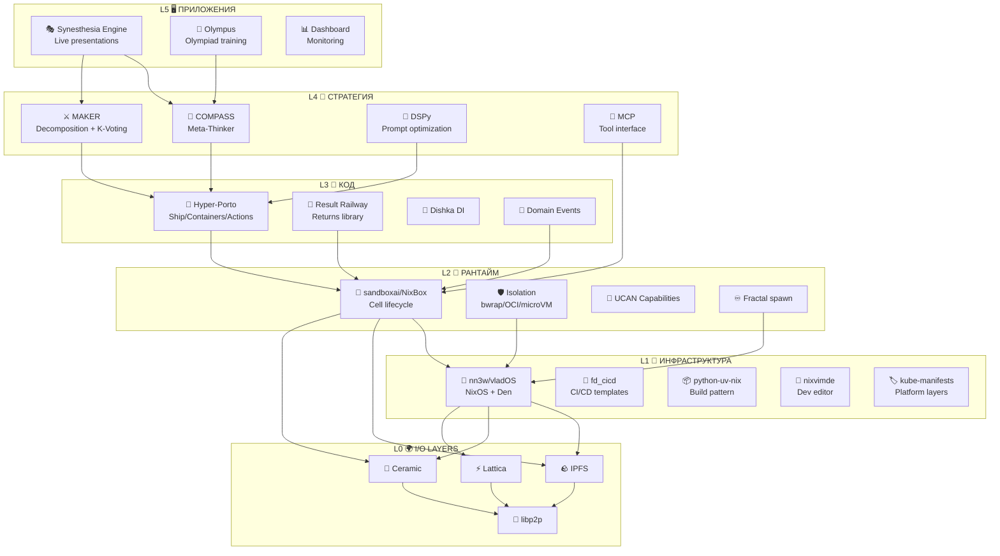

# 🌐🔗♾️ СУВЕРЕННАЯ СЕТЬ ♾️🔗🌐
### Sovereign Mesh: Как все проекты связываются в единую экосистему
### Серия 2 из 3 — Экосистема

> 📎 **Серия:** [00-FRACTAL-ATOM](./00-FRACTAL-ATOM.md) → [01-SYNESTHESIA-ENGINE-V3](./01-SYNESTHESIA-ENGINE-V3.md) → `02-SOVEREIGN-MESH`
> 📅 Дата: 2026-04-13
> 🔬 Статус: Архитектурное исследование
> ⚛️ Строится на: Фрактальный Атом (Cell + Aspect + Layer + Adapter)

---

## 🗺️ Легенда символов

> Та же легенда, что в [00-FRACTAL-ATOM](./00-FRACTAL-ATOM.md) и [01-SYNESTHESIA-ENGINE-V3](./01-SYNESTHESIA-ENGINE-V3.md), плюс символы экосистемы:

| 🏷️ Группа | Символы → Значение |
|---|---|
| 🏗️ **Проекты** | 🏰 nn3w/vladOS · 🧫 sandboxai/NixBox · 🏭 factory-ai · ☁️ oblakagent · 📚 myaiteam · 🏛️ new_porto · 🎭 Synesthesia Engine |
| 📐 **Паттерны** | 📐 Hyper-Porto · 🧭 COMPASS · ⚔️ MAKER · 🧪 DSPy · 🔌 MCP |
| 🚀 **Фазы** | P0 инвентарь · P1 content-addressing · P2 hybrid · P3 full P2P |

---

## 📑 Содержание

```
🏛️ Часть 0 — СТЕК: Пять слоёв, все проекты, одна архитектура             [стр.1]
🏰 Часть I — Слой инфраструктуры: nn3w + vladOS                          [стр.2]
🧫 Часть II — Слой рантайма: sandboxai / NixBox                          [стр.3]
🏭 Часть III — Слой оркестрации: factory-ai + oblakagent                  [стр.4]
📚 Часть IV — Слой знаний: myaiteam + Knowledge Graph                    [стр.5]
🎭 Часть V — Слой приложений: Synesthesia Engine + другие                 [стр.6]
🛤️ Часть VI — Миграция: Web2 → Web3 пошаговая дорожная карта              [стр.7]
🔧 Часть VII — Developer Experience: от кода до mesh                      [стр.8]
📎 Приложения: полная таблица проектов, ссылки                            [стр.9]
```

---

# 🏛️ Часть 0 — СТЕК: Пять слоёв, все проекты, одна архитектура

## 🎯 Тезис

> **Все проекты — не отдельные инициативы. Это слои ОДНОГО стека, связанные через четыре концепции Фрактального Атома.**

## 🏗️ Пять слоёв

```
┌─────────────────────────────────────────────────────────────────────────┐
│                                                                         │
│  L5 🖥️  ПРИЛОЖЕНИЯ                                                     │
│  ═══════════════                                                        │
│  🎭 Synesthesia Engine (live presentations)                             │
│  📊 Dashboard (monitoring, metrics)                                     │
│  🤖 Agent interfaces (chat, voice, API)                                 │
│  📄 Artifact viewers (HTML SPA, PDF, video)                             │
│                                                                         │
│  ↕️ Приложения используют L4 через MCP + Bus                            │
├─────────────────────────────────────────────────────────────────────────┤
│                                                                         │
│  L4 🧠  СТРАТЕГИЯ И НАДЁЖНОСТЬ                                         │
│  ═══════════════════════════                                            │
│  🧭 COMPASS (Meta-Thinker, Context Manager)                            │
│  ⚔️ MAKER (Decomposition, K-Voting, Red-Flagging)                      │
│  🧪 DSPy (Prompt optimization, MIPROv2)                                │
│  🔌 MCP (Unified tool interface)                                        │
│                                                                         │
│  ↕️ Стратегия работает внутри L3 (Hyper-Porto structure)                │
├─────────────────────────────────────────────────────────────────────────┤
│                                                                         │
│  L3 📐  СТРУКТУРА КОДА                                                  │
│  ═══════════════════                                                    │
│  📐 Hyper-Porto (Ship, Containers, Actions, Tasks)                      │
│  🔀 Result Railway (Returns library)                                    │
│  💉 DI Container (Dishka)                                               │
│  📡 Domain Events → Event Sourcing                                      │
│                                                                         │
│  ↕️ Код исполняется внутри L2 (Cell/sandbox)                            │
├─────────────────────────────────────────────────────────────────────────┤
│                                                                         │
│  L2 🧫  РАНТАЙМ (CELL)                                                 │
│  ═══════════════════                                                    │
│  🧫 sandboxai / NixBox (Cell lifecycle)                                 │
│  🛡️ Isolation (bubblewrap / OCI / microVM)                              │
│  🔑 Capabilities (UCAN tokens)                                         │
│  ♾️ Fractal spawn (Cell → child Cell → ...)                             │
│  📦 Targets: OCI, WASM, nspawn, native                                  │
│                                                                         │
│  ↕️ Cell'ы запускаются на инфраструктуре L1                             │
├─────────────────────────────────────────────────────────────────────────┤
│                                                                         │
│  L1 🏰  ИНФРАСТРУКТУРА                                                 │
│  ═══════════════════                                                    │
│  🏰 nn3w / vladOS (NixOS, Den, deploy-rs)                              │
│  🌿 Den aspects (конфигурация хостов, юзеров, анклавов)                 │
│  🔐 SOPS (secrets) → UCAN (future)                                     │
│  🌐 WireGuard mesh → libp2p mesh (future)                              │
│  📦 Nix binary cache → IPFS binary cache (future)                      │
│                                                                         │
│  ↕️ Хосты подключены к 3 I/O слоям                                     │
├─────────────────────────────────────────────────────────────────────────┤
│                                                                         │
│  L0 🌍  ТРИ I/O СЛОЯ (из 00-FRACTAL-ATOM)                              │
│  ═════════════════════════════════════════                               │
│  🪨 IPFS ─── 🌊 Ceramic ─── ⚡ Lattica ─── 🔗 libp2p                  │
│                                                                         │
└─────────────────────────────────────────────────────────────────────────┘
```

## 📊 Маппинг проектов на слои

| 🏗️ Проект | Слой | Роль | Ключевые файлы |
|---|---|---|---|
| 🏰 **nn3w** | L1 Infrastructure | NixOS monorepo, Den, exclaves, deploy | `flake.nix`, `docs/00-architecture.md` |
| 🧫 **sandboxai** | L2 Runtime | Cell lifecycle, isolation, WASM | `flake.nix`, `docs/architecture-vision/` |
| 📐 **new_porto** | L3 Code Structure | Hyper-Porto patterns, Result Railway | `docs/README.md`, `src/Ship/` |
| 🧭⚔️ **COMPASS_MAKER** | L4 Strategy | Agent strategy, reliability | `COMPASS.md`, `MAKER_ARCHITECTURE_RU.md` |
| 🏭 **factory-ai** | L3+L4 | Grand architecture document | `06-GRAND-ARCHITECTURE.md` |
| ☁️ **oblakagent** | L2+L3 (concrete) | Working Web2 implementation | `src/oblakagent/`, `ARCHITECTURE.md` |
| 📚 **myaiteam** | L0+L5 | Knowledge graph, team OS | `docs/architecture/`, `operating-system/` |
| 🎭 **Synesthesia** | L5 Application | Live presentation engine | `01-SYNESTHESIA-ENGINE-V3.md` |
| 🔧 **nixvimde** | L1 (dev tooling) | Nix + Neovim IDE | `README.md`, `modules/` |
| 🚀 **fd_cicd** | L1 (delivery) | CI/CD templates | `templates/`, `research/VISION.md` |
| 📦 **python-uv-nix** | L1+L2 | Python + Nix + OCI pattern | `flake.nix`, `nix/oci.nix` |
| 🏷️ **kube-manifests** | L1 (platform) | Platform engineering research | `PLATFORM_LAYERS_*.md` |
| 📝 **aiobsh** | L5 (product) | Olympus product specs | `OLYMPUS_*.md` |

---

## 🔮 Мега-диаграмма: Как проекты связаны



---

## ❓ Таблица вопросов и ответов

| ❓ Вопрос | 📍 Слой | 🏗️ Проект | Ответ |
|---|---|---|---|
| **ГДЕ** это запускается? | L1 | 🏰 nn3w | NixOS хосты, exclaves, decentralized nodes |
| **В ЧЁМ** изоляция? | L2 | 🧫 sandboxai | Cell с UCAN capabilities, bubblewrap/OCI/WASM |
| **КАК** организован код? | L3 | 📐 new_porto | Hyper-Porto (Ship → Containers → Actions → Tasks) |
| **КУДА** направлять агентов? | L4 | 🧭 COMPASS | Meta-Thinker → strategy → decomposition |
| **НАСКОЛЬКО** надёжно? | L4 | ⚔️ MAKER | K-Voting, Red-Flagging, Evidence Bundles |
| **КАК** улучшать? | L4 | 🧪 DSPy | MIPROv2 prompt optimizer |
| **ЧЕМ** инструментировать? | L4 | 🔌 MCP | Standard tool protocol |
| **ЧТО** показывать пользователю? | L5 | 🎭 Synesthesia | Infinite canvas, live AI presentations |
| **КАК** общаться? | L0 | 🔗 libp2p | IPFS + Ceramic + Lattica |

> 📎 Источник: `factory-ai-framework/06-GRAND-ARCHITECTURE.md`

---

# 🏰 Часть I — Инфраструктура: nn3w + vladOS

## 🌿 Den-based NixOS Monorepo

**nn3w** — суверенная NixOS-инфраструктура на основе **Den** (aspect-oriented Nix configuration).

### Текущее состояние

```
nn3w/
├── flake.nix           ← flake-parts + Den + deploy-rs + sops-nix
├── modules/
│   ├── den.nix         ← den.hosts, den.default, den.provides
│   ├── aspects.nix     ← imports всех аспектов
│   ├── deploy.nix      ← deploy-rs nodes
│   └── devshell.nix    ← dev tools
├── aspects/
│   ├── core/           ← базовая конфигурация
│   ├── desktop/        ← Plasma, Wayland
│   ├── dev/            ← toolchains, editors
│   ├── server/         ← SSH, monitoring
│   └── exclave/        ← company machine isolation
├── hosts/
│   ├── vladOS/         ← main desktop
│   ├── vladLaptop/     ← laptop
│   ├── vladServer/     ← headless
│   └── exclaves/       ← company exclaves
├── users/vladdd183/    ← user-level aspects
└── research/           ← 14+ research documents
```

### 🌐 Как nn3w станет Web3-ready

| Компонент | 🏠 Сейчас (Web2) | 🌐 Будущее (Web3) | Механизм перехода |
|---|---|---|---|
| **Конфигурация** | Den aspects в Git | Den aspects → CID-addressed | `den.ful.*` cross-flake sharing |
| **Секреты** | SOPS + age | 🔑 UCAN + Lit Protocol | Adapter swap в sops-nix |
| **Deploy** | deploy-rs через SSH | P2P deploy через libp2p | Clan fleet management |
| **Binary cache** | cache.nixos.org | 🪨 IPFS binary cache (PR #3727) | nix.conf substituter |
| **Networking** | WireGuard mesh | libp2p mesh (Mycelium/ZeroTier) | Clan networking module |
| **Service discovery** | Static IPs / DNS | 🔗 DHT (Kademlia) | Clan inventory |
| **Code hosting** | Git (GitHub) | Radicle / Tangled | Remote URL swap |

### 🏰 Exclave model → Decentralized model

```
ТЕКУЩИЙ: Exclave = microVM на чужом хосте, управляемый из nn3w
                    ↓
БУДУЩИЙ: Exclave = Cell на произвольном decentralized node
         Spec_CID → IPFS → любой node с IPVM/OCI → запуск
         Auth: UCAN (не SSH keys)
         Secrets: Lit Protocol (threshold encryption)
         Communication: Lattica P2P (не WireGuard tunnel)
```

> 📎 Источник: `nn3w/docs/03-exclave-mechanism.md`, `nn3w/research/07-nn3w-sovereign-stack-vision.md`

---

# 🧫 Часть II — Рантайм: sandboxai / NixBox

## ⚛️ Cell = f(Spec_CID, Capabilities, State_CID)

**sandboxai/NixBox** — это **Cell Factory** и **Cell Runtime**:

### Cell Lifecycle

```
1. 📝 DEFINE:     CellSpec (JSON/Nix) → Spec_CID
2. 🏗️ BUILD:      Nix build → OCI/WASM/nspawn artifact → Artifact_CID
3. 📦 PUBLISH:    ipfs add artifact → available globally
4. 🔑 AUTHORIZE:  UCAN token → capabilities for this Cell
5. 🚀 DEPLOY:     Runtime pulls artifact by CID → starts Cell
6. 💓 SUPERVISE:  Supervisor monitors heartbeat, metrics
7. 🔄 EVOLVE:     New Spec_CID → hot-swap → old Cell drains → new Cell active
8. 🗃️ ARCHIVE:    State_CID preserved in Ceramic stream
```

### 📦 Multi-target builds

Одна Cell spec → множество целей:

| 📦 Target | Когда использовать | Isolation | Performance |
|---|---|---|---|
| **Native** | Dev-time, maximum performance | ❌ Minimal | ⚡⚡⚡ |
| **bubblewrap** | Quick sandbox, Linux namespaces | 🛡️ Good | ⚡⚡⚡ |
| **OCI** | Production, Docker/K8s | 🛡️🛡️ Strong | ⚡⚡ |
| **microVM** | Maximum isolation, GPU passthrough | 🛡️🛡️🛡️ Maximum | ⚡ |
| **WASM** | Browser, IPVM, portable | 🛡️🛡️ Strong | ⚡⚡ |
| **nspawn** | Systemd containers | 🛡️🛡️ Strong | ⚡⚡ |

### ♾️ Fractal Runtime

```
Root Cell (Synesthesia Engine)
├── spawn(BrainCell_CID)           ← child Cell
│   ├── spawn(DirectorCell_CID)    ← grandchild
│   │   ├── spawn(COMPASS_CID)    ← great-grandchild
│   │   └── spawn(MAKER_CID)
│   └── spawn(SupervisorCell_CID)
├── spawn(CanvasCell_CID)
│   ├── spawn(PixiRenderer_CID)
│   └── spawn(D3Renderer_CID)
└── spawn(SensorPipeline_CID)
    ├── spawn(ASRCell_CID)
    └── spawn(VisionCell_CID)
```

Каждый `spawn` создаёт Cell с **аттенуированными** capabilities (потомок **не может** получить больше прав чем родитель).

> 📎 Источник: `sandboxai/docs/architecture-vision/04-fractal-runtime.md`

---

# 🏭 Часть III — Оркестрация: factory-ai + oblakagent

## 🏭 Factory = Hyper-Porto + COMPASS + MAKER + DSPy + MCP

**factory-ai** — это **документация и архитектура**, описывающая как AI-оркестрация работает внутри Cell:

```
Factory = Hyper-Porto project INSIDE sandboxai Cell
    │
    ├── Ship (entry point)
    │   ├── Intake: file / API / MCP → Task
    │   └── TaskRouter → specialist containers
    │
    ├── Containers (domain modules)
    │   ├── Strategy Container
    │   │   └── COMPASS (Meta-Thinker + Context Manager)
    │   ├── Execution Container
    │   │   └── MAKER (Decompose + K-Vote + Red-Flag)
    │   ├── Agent Container
    │   │   └── DSPy modules + MCP tool access
    │   └── Evidence Container
    │       └── Evidence bundles + audit trail
    │
    └── Core (shared)
        ├── TaskRouter
        ├── SpecGenerator → CellSpec
        └── EvidenceBundle
```

## ☁️ oblakagent = Working Web2 Implementation

**oblakagent** — **конкретная реализация** (Litestar + NATS + Python):

| Компонент | Технология | Роль |
|---|---|---|
| **Orchestrator** | Litestar (REST + WebSocket) | Task intake, routing, UI |
| **Bus** | NATS (+ JetStream) | Task distribution, output streaming |
| **Workers** | Python daemons + adapters | Execute agents (Claude, Aider, etc.) |
| **Storage** | SQLite (→ Postgres) | Task state, metadata |
| **DevEnv** | Nix flake (uv2nix) | Reproducible Python environment |
| **Orchestration** | process-compose | Local multi-service management |

### ☁️→🌐 Миграция oblakagent → Web3

| Компонент | 🏠 Сейчас | 🌐 Будущее | Adapter |
|---|---|---|---|
| Orchestrator API | Litestar HTTP | Lattica RPC | `HTTPAdapter → LatticeAdapter` |
| Bus | NATS | Lattica Pub/Sub + CRDT | `NATSAdapter → LatticeAdapter` |
| Storage | SQLite | Ceramic (ComposeDB) | `SQLiteAdapter → CeramicAdapter` |
| Task state | DB rows | Ceramic stream events | Event sourcing pattern |
| Worker isolation | System processes | sandboxai Cells | `ProcessAdapter → CellAdapter` |
| Auth | None / basic | DID + UCAN | `AuthMiddleware` swap |
| Binary distribution | Docker registry | IPFS | `RegistryAdapter → IPFSAdapter` |

💡 **Код бизнес-логики не меняется.** Только адаптеры. Это **ровно** то, что описано в `factory-ai/06-GRAND-ARCHITECTURE.md` как «adapter swap, not rewrite».

> 📎 Источник: `oblakagent/ARCHITECTURE.md`, `factory-ai/06-GRAND-ARCHITECTURE.md`

---

# 📚 Часть IV — Знания: myaiteam + Knowledge Graph

## 📊 Decentralized Knowledge System

**myaiteam** описывает архитектуру **децентрализованной системы знаний**:

### Стек знаний

```
┌─────────────────────────────────────────────────────────────┐
│ 📊 QUERY LAYER                                               │
│ GraphQL (ComposeDB) · SQL (OrbisDB) · Vector search          │
├─────────────────────────────────────────────────────────────┤
│ 🌊 STATE LAYER (Ceramic)                                     │
│ Entities · Relations · Sources · Citations · Metadata         │
│ Streams signed by DID, anchored to Ethereum                  │
├─────────────────────────────────────────────────────────────┤
│ 🪨 STORAGE LAYER (IPFS)                                      │
│ Documents · Images · Audio · Models · WASM plugins            │
│ Content-addressed, deduplicated, persistent                  │
├─────────────────────────────────────────────────────────────┤
│ 🔑 AUTH LAYER                                                │
│ DID · UCAN · Lit Protocol (threshold encryption)             │
│ Who can read/write/query each piece of knowledge             │
├─────────────────────────────────────────────────────────────┤
│ 🔗 TRANSPORT LAYER (libp2p)                                  │
│ P2P sync · Recon protocol · DHT discovery                    │
└─────────────────────────────────────────────────────────────┘
```

### Для Synesthesia Engine

Knowledge Graph **напрямую** используется движком:

| Использование | Механизм |
|---|---|
| 🏗️ **Prefabs** | ComposeDB query: «все визуализации с тегом X» → prefab CIDs |
| 📂 **RAG** | Vector search по IPFS documents → KnowledgeEvent |
| 📊 **Post-lecture KG** | NER extraction → ComposeDB entities + relations |
| 🔍 **Asset search** | ComposeDB: «все картинки с описанием Y» → image CIDs |
| 📖 **Lecture history** | Ceramic stream → все прошлые лекции → переиспользование |

---

# 🎭 Часть V — Приложения: Synesthesia Engine + другие

## 🎭 Synesthesia Engine в контексте стека

```
Synesthesia Engine:
    L5: CanvasCell + MoodSystem + Camera transitions
    L4: COMPASS (visual strategy) + MAKER (task decomposition) + DSPy (prompt optimization)
    L3: Hyper-Porto structure (Ship → Containers → Actions) inside DirectorCell
    L2: sandboxai Cells (each component = Cell with UCAN)
    L1: nn3w hosts (NixOS + Den + deploy-rs) or decentralized nodes
    L0: IPFS (assets) + Ceramic (state) + Lattica (real-time bus)
```

💡 **Synesthesia Engine — это НЕ отдельный продукт. Это конкретная КОНФИГУРАЦИЯ стека** — набор Den aspects, Cell specs, и COMPASS/MAKER prompts, применённый к задаче live-визуализации.

Другие приложения на том же стеке:
- 📝 **Olympus** (olympiad training) — другие Cell specs, та же L1-L4
- 📊 **Dashboard** — CanvasCell заменяется на DashboardCell
- 🤖 **Chat agent** — CanvasCell заменяется на ChatCell

---

# 🛤️ Часть VI — Миграция: Web2 → Web3

## 📊 Текущее состояние каждого слоя

| Слой | Текущее состояние | Готовность к Web3 | Первый шаг |
|---|---|---|---|
| L1 🏰 nn3w | ✅ Working (NixOS + Den) | 🟡 70% (content-addressed builds) | IPFS binary cache |
| L2 🧫 sandboxai | 🟡 Research + partial code | 🟡 60% (Cell vision documented) | CellSpec → Nix → OCI pipeline |
| L3 📐 new_porto | ✅ Working patterns | 🟢 80% (Result Railway = deterministic) | Event Sourcing → Ceramic |
| L4 🧭 COMPASS/MAKER | 📝 Documented, not coded | 🟢 80% (immutable prompts = CID) | DSPy modules as Nix derivations |
| L5 🎭 Synesthesia | 📝 v2 documented | 🟡 50% (needs Cell refactor) | Canvas state → Ceramic |
| L0 🪨 IPFS | 📝 Researched | 🟢 90% (mature tech) | `ipfs init && ipfs add` |
| L0 🌊 Ceramic | 📝 Researched | 🟢 85% (350M events proven) | ComposeDB schema for canvas |
| L0 ⚡ Lattica | 📝 Researched | 🟡 60% (beta, needs testing) | Replace one NATS topic |

---

## 🗺️ Пошаговая дорожная карта

### P0: Инвентарь и стабилизация (2-3 недели)

> **Цель:** Работающий Web2 MVP движка на текущем стеке.

| # | Задача | Результат |
|---|---|---|
| P0.1 | Запустить oblakagent (`process-compose up`) | Working orchestrator + NATS + worker |
| P0.2 | Создать CellSpecs для ASR, Director, Canvas (JSON) | Cell definitions (not yet CID-addressed) |
| P0.3 | Nix flake для всего движка | `nix develop` → all deps |
| P0.4 | Базовый Canvas (React + PixiJS) | Infinite canvas with camera control |
| P0.5 | WebSocket bus (Commands protocol) | Director → Canvas communication |
| P0.6 | Базовый Director (LLM API calls) | SpeechEvent → Commands |

### P1: Content Addressing (2-3 недели)

> **Цель:** Всё имеет CID. Storage = IPFS.

| # | Задача | Результат |
|---|---|---|
| P1.1 | `ipfs init` на dev-машине | Local IPFS node |
| P1.2 | Assets → IPFS (`ipfs add`) | Image/SVG CIDs вместо URLs |
| P1.3 | Cell specs → IPFS | CID-addressed specifications |
| P1.4 | Nix outputs → IPFS cache | PR #3727 substituter (experimental) |
| P1.5 | Prefabs → IPFS | Shareable prefab collections |

### P2: Hybrid (3-4 недели)

> **Цель:** State = Ceramic. Auth = DID. Transport = still local.

| # | Задача | Результат |
|---|---|---|
| P2.1 | Ceramic node (`ceramic-one`) | Local ComposeDB |
| P2.2 | Canvas state → Ceramic stream | Persistent, replayable state |
| P2.3 | Command log → Ceramic stream | Verifiable decision trail |
| P2.4 | DID:key для каждой Cell | Self-sovereign identity |
| P2.5 | UCAN tokens (basic) | Capability-based Cell auth |
| P2.6 | ComposeDB schema: Plugin registry | Plugin discovery via GraphQL |
| P2.7 | Knowledge Graph (basic) | Entity-Relation model in ComposeDB |
| P2.8 | Post-lecture: lecture → Ceramic → artifacts → IPFS | CID-addressed replay |

### P3: Full P2P (4-8 недель)

> **Цель:** Bus = Lattica. Compute = IPVM-ready. Full sovereignty.

| # | Задача | Результат |
|---|---|---|
| P3.1 | Lattica integration (replace one NATS topic) | P2P messaging proof-of-concept |
| P3.2 | Multi-node test (2 machines) | Cells on separate hosts |
| P3.3 | WASM plugins (first: PhysicsCell as WASM) | Portable computation |
| P3.4 | IPVM integration (Homestar, experimental) | Decentralized compute |
| P3.5 | Plugin marketplace (ComposeDB + UCAN + CID) | Publish/discover/pay for plugins |
| P3.6 | Lit Protocol for secrets | Threshold encryption |
| P3.7 | Full Lattica bus | Replace NATS completely |
| P3.8 | Cross-machine lecture | Presenter + renderer on different nodes |

### P∞: Beyond (ongoing)

| Задача | Описание |
|---|---|
| 🪙 Token economics | Pay-per-use for plugins and compute |
| 🌐 Public mesh | Join global Synesthesia network |
| 🤖 Self-evolution | AI-driven Cell mutation and selection |
| 📡 Satellite/inter-planetary | IPFS delay-tolerant networking |
| 🧬 DAO governance | Community-governed plugin standards |

---

# 🔧 Часть VII — Developer Experience

## 🔄 Полный цикл разработки

```
Code → Build → Test → Publish → Deploy → Monitor → Evolve

 ✏️          🏗️         🧪          🪨           🚀          📊          🔄
nixvimde → nix build → nix check → ipfs add → deploy-rs → Ceramic → new CID
 (IDE)     (Cell)      (tests)    (IPFS)     (L1 host)   (metrics)  (evolution)
```

### Инструменты

| Этап | Инструмент | Из какого проекта |
|---|---|---|
| ✏️ **Code** | nixvimde (Neovim + AI + MCP) | 🔧 nixvimde |
| 🏗️ **Build** | Nix flake → OCI/WASM | 🏰 nn3w, 📦 python-uv-nix |
| 🧪 **Test** | nix check, pytest, playwright | 🚀 fd_cicd |
| 🔍 **Lint** | treefmt-nix, ruff, pyright | 🚀 fd_cicd |
| 📦 **Package** | nix2container → OCI, wasm-pack → WASM | 📦 python-uv-nix |
| 🪨 **Publish** | ipfs add → CID | L0 IPFS |
| 🌊 **Register** | ComposeDB → plugin/asset registry | L0 Ceramic |
| 🚀 **Deploy** | deploy-rs (L1) / Cell.spawn (L2) | 🏰 nn3w, 🧫 sandboxai |
| 📊 **Monitor** | Ceramic metrics stream, HyperDX | 🏷️ kube-manifests |
| 🔄 **Evolve** | New Spec_CID → hot-swap | 🧫 sandboxai |

### 🏗️ Nix: единая система сборки

```
nix build .#cells.asr          → OCI image для ASRCell
nix build .#cells.director     → OCI image для DirectorCell
nix build .#cells.physics      → WASM module для PhysicsCell
nix build .#cells.canvas       → Browser bundle для CanvasCell
nix build .#plugins.rapier     → WASM Component для Rapier plugin
nix develop                    → All tools: node, python, wasm-pack, ipfs, ceramic
```

---

# 📎 Приложение A: Полная таблица проектов

| # | 🏗️ Проект | Путь | Слой | Статус | Технологии | Роль в Sovereign Mesh |
|---|---|---|---|---|---|---|
| 1 | 🏰 nn3w | `~/kwork/nn3w` | L1 | ✅ Working | NixOS, Den, deploy-rs, sops-nix | Host infrastructure |
| 2 | 🧫 sandboxai | `~/kwork/sandboxai` | L2 | 🟡 Research+code | Nix, flake-parts, nix2container | Cell runtime |
| 3 | 📐 new_porto | `~/kwork/new_porto` | L3 | ✅ Working | Litestar, Piccolo, Returns, Dishka | Code patterns |
| 4 | 🧭 COMPASS | `~/kwork/COMPASS_MAKER_*` | L4 | 📝 Docs only | — | Agent strategy |
| 5 | ⚔️ MAKER | `~/kwork/COMPASS_MAKER_*` | L4 | 📝 Docs only | — | Agent reliability |
| 6 | 🏭 factory-ai | `~/kwork/factory-ai-framework` | L3+L4 | 📝 Docs only | — | Grand architecture |
| 7 | ☁️ oblakagent | `~/kwork/oblakagent` | L2+L3 | 🟡 Partial impl | Litestar, NATS, uv2nix | Web2 task execution |
| 8 | 📚 myaiteam | `~/kwork/myaiteam` | L0+L5 | 📝 Docs | IPFS, Ceramic, DID | Knowledge system |
| 9 | 🎭 Synesthesia | `~/kwork/vkr-denis/research` | L5 | 📝 v3 designed | This document series | Live presentations |
| 10 | 🔧 nixvimde | `~/kwork/nixvimde` | L1 dev | ✅ Working | Nix, nixvim, AI plugins | Developer IDE |
| 11 | 🚀 fd_cicd | `~/kwork/fd_cicd` | L1 delivery | 📝 Templates | Nix, GitHub Actions | CI/CD patterns |
| 12 | 📦 python-uv-nix | `~/kwork/python-uv-nix` | L1+L2 | ✅ Working | uv2nix, nix2container | Build pattern |
| 13 | 🏷️ kube-manifests | `~/kwork/kube-manifests` | L1 platform | 📝 Research | nixidy, Argo CD, Pulumi, Crossplane | Platform engineering |
| 14 | 📝 aiobsh | `~/kwork/aiobsh` | L5 product | 📝 Specs | — | Olympus product |

---

# 📎 Приложение B: Crossplane и Platform Engineering

> Из исследования `kube-manifests/PLATFORM_LAYERS_CROSSPLANE_NIXIDY_RESEARCH_2026.md`:

### Как platform engineering встраивается в Sovereign Mesh

Для deployment на K8s-кластерах (Phase 0-1, до full P2P) нужен platform stack:

| Platform Layer | Инструмент | Роль | Статус |
|---|---|---|---|
| L0 Host/OS | 🏰 vladOS (NixOS) | Declarative OS, WireGuard | ✅ Working |
| L1 Cluster | K3s via vladOS | Lightweight K8s | ✅ Working |
| L2 Bootstrap | **Pulumi** (TypeScript) | Platform authoring | 🟡 Planned |
| L3 Mesh | **Istio Ambient** | Service mesh | 🟡 Partial |
| L4 Manifests | **nixidy** | Nix → typed YAML | 🟡 Planned |
| L5 GitOps | **Argo CD** | Continuous reconciliation | 🟡 Planned |
| L6 Self-service | **Crossplane** | K8s-native APIs (XRDs) | 🔬 Future |
| L7 Secrets | **Varlock + Infisical + ESO** | AI-safe .env, vault | 🟡 Planned |
| L8 Observability | **HyperDX** (ClickHouse + OTel) | Logs, traces, metrics | 🟡 Planned |

💡 **Ключевой инсайт:** Pulumi **авторизует** платформу, Crossplane **продуктизирует** платформу, nixidy **типизирует** манифесты, Argo CD **синхронизирует**. Они не конкуренты, а слои.

### Маппинг на Web3

| Platform Layer | Web2 Tool | Web3 Equivalent |
|---|---|---|
| Host/OS | NixOS + SSH | NixOS + DID + libp2p |
| Cluster | K3s | IPVM cluster / Decentralized compute |
| Bootstrap | Pulumi | Nix derivation → IPFS |
| Mesh | Istio | libp2p mesh (native) |
| Manifests | nixidy YAML | CellSpec CIDs |
| GitOps | Argo CD | Ceramic stream → auto-reconcile |
| Self-service | Crossplane XRDs | ComposeDB models → Cell spawn |
| Secrets | Varlock/SOPS | UCAN + Lit Protocol |
| Observability | HyperDX | Ceramic metrics streams |

---

# 📎 Приложение C: Конкретные технологические решения по фазам

### P0: Что конкретно использовать

| Задача | Технология | Почему |
|---|---|---|
| Orchestrator | **Litestar** (Python) | Proven in oblakagent, async, fast |
| Bus | **NATS** (+ JetStream) | Low latency, proven, JetStream = replay |
| Workers | **Python + uv** | Fast package management, Nix integration |
| Canvas | **React 19 + PixiJS v8** | WebGPU/WebGL2, 60fps, rich ecosystem |
| Animation | **GSAP** | Industry standard, 4 animation slots |
| Charts | **D3.js** | Maximum flexibility |
| Physics | **Rapier** (Rust→WASM) | Deterministic, fast, WASM-native |
| ASR | **Deepgram Nova-2** (primary) / **Whisper Large v3** (fallback) | Streaming + quality |
| Director LLM | **Claude Sonnet 4** / **GPT-4o** | Fast + smart enough |
| Meta-Thinker LLM | **Claude Opus 4** | Deep reasoning for strategy |
| Dev environment | **Nix flake** | Reproducible everything |
| Process management | **process-compose** | Multi-service local orchestration |

### P1: Что добавляется

| Задача | Технология | Конфигурация |
|---|---|---|
| IPFS node | **Kubo** (Go) | `ipfs init --profile server` |
| Asset publishing | `ipfs add` CLI | Integrate into build pipeline |
| CID resolution | IPFS HTTP Gateway | `http://localhost:8080/ipfs/{cid}` |
| Binary cache | Nix IPFS substituter | `nix.conf: substituters = ipfs://...` |

### P2: Что добавляется

| Задача | Технология | Конфигурация |
|---|---|---|
| Ceramic node | **ceramic-one** (Rust) | `ceramic-one daemon --network inmemory` |
| ComposeDB | **@composedb/client** | GraphQL schema for canvas state |
| DID creation | **did:key** | Ed25519 keypair → DID |
| UCAN tokens | **@ipld/dag-ucan** | JS/TS UCAN library |
| Canvas state | Ceramic TileDocument | JSON patch stream |

### P3: Что добавляется

| Задача | Технология | Конфигурация |
|---|---|---|
| P2P messaging | **Lattica** (Rust + Python SDK) | `pip install lattica` |
| WASM runtime | **wasmtime** (Rust) | Plugin execution engine |
| Decentralized compute | **Homestar** (IPVM) | Experimental WASM task execution |
| Encryption | **Lit Protocol** | Threshold encryption for secrets |
| P2P code | **Radicle** | Decentralized Git |

---

# 📎 Приложение D: Unified Formula

> **Sovereign Mesh = Σ Cell_i(Spec_CID, UCAN, Ceramic_State) composed via Den_Aspects | communicating over (IPFS ⊕ Ceramic ⊕ Lattica) / libp2p | deployed on nn3w hosts or decentralized nodes | structured as Hyper-Porto | strategized by COMPASS+MAKER | optimized by DSPy | tooled via MCP**

На человеческом языке:

> **Суверенная Сеть = множество Cells (sandboxai), скомпонованных дендритно (Den), общающихся через три I/O слоя (IPFS + Ceramic + Lattica), развёрнутых на NixOS-хостах (nn3w) или децентрализованных узлах, организованных по Hyper-Porto (new_porto), управляемых COMPASS+MAKER (factory-ai), оптимизированных DSPy, инструментированных через MCP.**

```
Это не набор проектов.
Это один организм.
Каждый проект — орган.
Каждый орган — фрактал из Cells.
Каждый Cell — CID.
Каждый CID — кротовая нора.
Вся сеть — суверенная.

Web2 — колесо.
Это — варп-двигатель на кротовых норах. 🕳️♾️🚀
```

---

> 📎 **Фундамент:** [00-FRACTAL-ATOM](./00-FRACTAL-ATOM.md) — теория (Cell, Aspect, Layer, Adapter)
>
> 📎 **Движок:** [01-SYNESTHESIA-ENGINE-V3](./01-SYNESTHESIA-ENGINE-V3.md) — применение теории к live-презентациям
