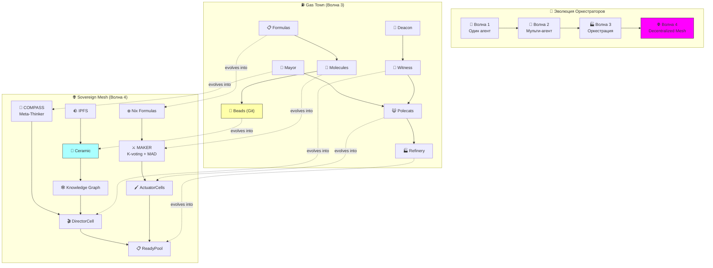

# 🐙🧬🏭 ЭВОЛЮЦИЯ ОРКЕСТРАТОРОВ АГЕНТОВ 🏭🧬🐙
### От ручного управления к Sovereign Mesh: Gas Town → COMPASS/MAKER → factory-ai → ∞
### Серия заметок — Часть 4

> 📎 **Серия:** [00-FRACTAL-ATOM](./00-FRACTAL-ATOM.md) · [01-SYNESTHESIA-ENGINE-V3](./01-SYNESTHESIA-ENGINE-V3.md) · [02-SOVEREIGN-MESH](./02-SOVEREIGN-MESH.md) · [03-GAS-TOWN-ANALYSIS](./03-GAS-TOWN-ANALYSIS.md)
> 📅 Дата: 2026-04-13
> 🔬 Статус: Философско-аналитическая заметка

---

## 🧭 Содержание

```
🌌 I — Три волны оркестрации                                              
🧬 II — Таксономия паттернов: 12 архетипов                                
🏗️ III — Сравнительный анализ: 6 систем, 1 таблица                        
🔬 IV — Глубокий анализ паттернов Gas Town                                 
🧠 V — COMPASS + MAKER: теоретическая база                                
🏭 VI — factory-ai + oblakagent: наш путь                                  
📚 VII — myaiteam: от знаний к агентам                                     
🔮 VIII — Kubernetes for Agents: разные интерпретации                      
🎯 IX — Что строить: Architecture Decision Records                        
```

---

# 🌌 I — Три волны оркестрации

```
Волна 1 (2023-2024):     🤖 ОДИН АГЕНТ, ОДИН ПРОМПТ
                          ▸ ChatGPT, Claude Chat, Copilot
                          ▸ Стадии Йегге 1-3
                          ▸ Человек = оператор

Волна 2 (2025):           🐙 МУЛЬТИ-АГЕНТ, РУЧНОЕ УПРАВЛЕНИЕ
                          ▸ Claude Code, Codex CLI, Amp
                          ▸ Стадии Йегге 4-7
                          ▸ Человек = менеджер N агентов

Волна 3 (2026+):          🏭 ОРКЕСТРАЦИЯ, АВТОНОМИЯ
                          ▸ Gas Town, factory-ai, будущие системы
                          ▸ Стадии Йегге 8+
                          ▸ Человек = PM, агенты = команда
                          ▸ → Стадия 9 (наша): Decentralized Autonomous Swarm
```

## 🔍 Стадия 9: чего не видит Йегге

Йегге определил 8 стадий. Но его горизонт ограничен **одной машиной + tmux**. Стадия 9 — то, что мы проектируем:

| Стадия Йегге | Что делаешь | Инфраструктура |
|---|---|---|
| 8 | Свой оркестратор | tmux + Git + один комп |
| **9** | **Decentralized Agent Mesh** | **IPFS + Ceramic + libp2p + IPVM** |
| **10** | **Autonomous Agent Economy** | **UCAN + crypto payments + reputation DAG** |

💡 **Стадия 9 = Gas Town, но P2P.** Агенты не привязаны к одной машине. Они — Cells с DID, работающие на любом узле сети, оплачиваемые криптой, с UCAN-авторизацией.

💡 **Стадия 10 = агенты нанимают агентов.** Director (COMPASS) может автономно находить, нанимать и оплачивать ActuatorCells в сети. Человек задаёт только высокоуровневую цель. **Это и есть factory-ai в full Web3.**

---

# 🧬 II — Таксономия паттернов: 12 архетипов

На основе анализа Gas Town, COMPASS, MAKER, oblakagent, factory-ai, myaiteam, LangGraph, CrewAI, AutoGen и других систем — 12 фундаментальных паттернов оркестрации:

## 📊 Карта паттернов

| # | Паттерн | Что решает | Кто использует |
|---|---|---|---|
| 1 | 🎯 **Pipeline** | Последовательная обработка | MAKER (step chain), Molecules |
| 2 | 🔀 **Fan-out / Fan-in** | Параллельная обработка | Polecats swarm, ActuatorCells |
| 3 | 🗳️ **Consensus (K-voting)** | Надёжность выбора | MAKER K-voting, Refinery |
| 4 | 👑 **Supervisor** | Контроль + recovery | Witness, SupervisorCell, Meta-Thinker |
| 5 | 🪝 **Hook / Claim** | Персистентная привязка работы | GUPP hook, Cell state_stream |
| 6 | 💓 **Heartbeat** | Liveness detection | Deacon, DeaconCell |
| 7 | 📋 **Declarative Workflow** | Описание сложных процессов | Formulas, Nix Aspects |
| 8 | 🧫 **Template Instantiation** | Переиспользование workflows | Protomolecules, Cell Spec_CID |
| 9 | 🔄 **Crash Recovery** | Продолжение после падения | NDI, Ceramic stream replay |
| 10 | 🚫 **Red-Flagging** | Фильтрация плохих результатов | MAKER red-flag, quality gates |
| 11 | 📬 **Mailbox / Event** | Асинхронная коммуникация | Beads mail, Lattica, NATS |
| 12 | 🏪 **Marketplace** | Обнаружение + выбор агентов | Mol Mall (GT), IPFS Cell Registry |

### 🧬 Как паттерны комбинируются

```
                    ┌─────────────────────────────────────────┐
                    │  📋 DECLARATIVE WORKFLOW (Formula/Aspect) │
                    │  «ЧТО делать»                            │
                    └────────────────┬────────────────────────┘
                                     │ compile
                    ┌────────────────▼────────────────────────┐
                    │  🧫 TEMPLATE INSTANTIATION               │
                    │  «Конкретный план с конкретными данными»  │
                    └────────────────┬────────────────────────┘
                                     │ deploy
                    ┌────────────────▼────────────────────────┐
                    │  🎯 PIPELINE + 🔀 FAN-OUT                │
                    │  «Пошаговое + параллельное выполнение»    │
                    │                                          │
                    │  ┌───────┐  ┌───────┐  ┌───────┐        │
                    │  │Cell A │  │Cell B │  │Cell C │  ← 😺   │
                    │  └───┬───┘  └───┬───┘  └───┬───┘        │
                    │      │          │          │             │
                    │      ▼          ▼          ▼             │
                    │  🗳️ CONSENSUS (K-voting / pick best)     │
                    │  🚫 RED-FLAG (filter bad results)        │
                    └────────────────┬────────────────────────┘
                                     │
                    ┌────────────────▼────────────────────────┐
                    │  🪝 HOOK / 🔄 CRASH RECOVERY              │
                    │  «Персистентность + продолжение»          │
                    │  💓 HEARTBEAT (liveness)                  │
                    │  👑 SUPERVISOR (oversight)                │
                    └────────────────┬────────────────────────┘
                                     │
                    ┌────────────────▼────────────────────────┐
                    │  📬 MAILBOX / EVENT                      │
                    │  «Результаты → следующий шаг / отчёт»    │
                    └─────────────────────────────────────────┘
```

---

# 🏗️ III — Сравнительный анализ: 6 систем

## 📊 Mega-Table

| Критерий | ⛽ Gas Town | 🧭 COMPASS | ⚔️ MAKER | 🏭 factory-ai | ☁️ oblakagent | 📚 myaiteam |
|---|---|---|---|---|---|---|
| **Тип** | Практический оркестратор | Теоретический фреймворк | Теоретический метод | Архитектурный blueprint | Рабочий прототип | Research knowledge base |
| **Стадия** | ✅ Production (Йегге) | 📄 Paper (arXiv) | 📄 Paper (arXiv) | 📋 Design | 🔧 Prototype | 📄 Research |
| **Язык** | Go | Agnostic | Agnostic | Python/Nix | Python (Litestar) | Docs + Python sketches |
| **Agents** | 20-30 Claude Code | 3 (Meta-Thinker, Context, Main) | N micro-agents | COMPASS+MAKER+MCP | Litestar+NATS workers | LangGraph/CrewAI |
| **Persistence** | Git (Beads JSONL) | In-memory context | External state | Ceramic streams | PostgreSQL/Redis | IPFS+Ceramic |
| **Workflow** | Molecules | Episode loop | Step pipeline | Cell pipeline | Task queue | KG pipeline |
| **Templates** | Formulas (TOML) | — | — | Nix Aspects | — | — |
| **Swarming** | ✅ Polecats | ❌ | ✅ (parallel samples) | ✅ ActuatorCells | ❌ | ❌ |
| **Consensus** | Refinery pick | Meta-Thinker signal | K-voting | ReadyPool pick | — | — |
| **Recovery** | NDI (Git persist) | — | Retry | Ceramic replay | NATS retry | — |
| **Identity** | Agent Bead | — | — | DID + UCAN | — | DID + UCAN |
| **Transport** | tmux send-keys | In-process | API calls | Lattica / NATS | NATS | libp2p |
| **Web3** | ❌ | ❌ | ❌ | ✅ (full) | ❌ | ✅ (storage) |
| **Cost** | 💸💸💸 (multi CC accounts) | Free (1 LLM call chain) | Moderate (N samples) | Variable (crypto) | Self-hosted | Variable |

## 💡 Ключевые наблюдения

**1. Конвергентная эволюция** 🧬

Gas Town (снизу вверх, из практики) и factory-ai (сверху вниз, из теории) пришли к **одинаковым паттернам**:
- Persistent agents with ephemeral sessions
- Declarative workflow templates
- Parallel speculative execution
- Supervisor + heartbeat
- Merge/consensus для выбора лучшего

Это **не совпадение**. Это **необходимые свойства** любого оркестратора ненадёжных workers.

**2. MAKER = теоретическое обоснование Polecats** 📐

MAKER доказывает математически то, что Йегге обнаружил эмпирически:
- Декомпозиция до атомарных шагов → **логарифмическое** масштабирование ошибок
- K-voting → **экспоненциальное** снижение вероятности ошибки
- Red-flagging → **декорреляция** ошибок между workers

Gas Town реализует MAD (Polecats делают по одному шагу) и Consensus (Refinery), но **без K-voting и без red-flagging**. Добавление этих паттернов значительно улучило бы Gas Town.

**3. COMPASS = Mayor + Witness + Context Manager** 🧠

COMPASS разделяет стратегию (Meta-Thinker), тактику (Main Agent) и контекст (Context Manager). Gas Town делает то же, но распределяет роли между Mayor (стратегия), Witness (мониторинг) и Hook system (контекст). **Более отказоустойчиво** — каждая роль в отдельном процессе.

**4. myaiteam = knowledge layer для всех** 📚

myaiteam проектирует **слой знаний** (KG + RAG + IPFS + Ceramic), которого нет ни у Gas Town, ни у COMPASS/MAKER. Это **Memory layer** из нашей архитектуры Synesthesia Engine (Layer 5). Gas Town хранит всё в Git (flat). Нам нужен **structured knowledge graph** поверх Ceramic.

---

# 🔬 IV — Глубокий анализ паттернов Gas Town

## 🧬 Молекулярная алгебра

Йегге описывает, что молекулы **composable** и **Turing-complete**. Разберём формально:

### Операции над молекулами

| Операция | Смысл | Аналог в нашей системе |
|---|---|---|
| `chain(A, B)` | A → B последовательно | Cell pipeline |
| `par(A, B)` | A \|\| B параллельно | Fan-out ActuatorCells |
| `gate(A, cond, B, C)` | if cond(A) then B else C | Director conditional command |
| `loop(A, cond)` | while cond: A | Deacon patrol cycle |
| `wrap(A, template)` | Apply template to molecule | Aspect composition |
| `sling(A, agent)` | Assign molecule to agent | Cell.deploy(spec_cid) |

### 📐 Формальная модель

```
Molecule = Step | Chain(Molecule, Molecule) | Par(Molecule, Molecule)
         | Gate(Molecule, Pred, Molecule, Molecule) | Loop(Molecule, Pred)

Step = Bead(id, description, acceptance_criteria, assignee)

Execute(molecule, agent) =
  match molecule with
  | Step(b) → agent.do(b); mark(b, done)
  | Chain(a, b) → Execute(a, agent); Execute(b, agent)
  | Par(a, b) → fork(Execute(a, agent_a), Execute(b, agent_b)); join
  | Gate(a, p, b, c) → let r = Execute(a, agent) in
                        if p(r) then Execute(b, agent) else Execute(c, agent)
  | Loop(a, p) → while p(): Execute(a, agent)
```

💡 **Это лямбда-исчисление для workflows.** Молекулы Gas Town — полноценный DSL для описания агентских рабочих процессов. Наши Nix Aspects могут выразить то же самое, но с **типизацией и проверками на этапе компиляции**.

## 🔄 NDI глубже: почему это работает

NDI (Non-Deterministic Idempotency) Йегге — неочевидно мощный паттерн:

```
Классическая идемпотентность:       f(f(x)) = f(x)
                                    Один путь, один результат

Temporal deterministic replay:       replay(log) = same_state
                                    Один путь (записанный), один результат

Gas Town NDI:                        run₁(mol) ≠ run₂(mol)  (разные пути)
                                    result₁ ≈ result₂       (эквивалентные результаты)
```

**Почему работает:** Критерии приёмки (acceptance criteria) в каждом Bead определяют **инвариант результата**. Путь недетерминирован (разные агенты, разные решения), но результат **удовлетворяет инвариант**.

💡 **Это content-addressing на уровне семантики.** CID = hash(content). NDI = «результат удовлетворяет spec, независимо от пути». Наша архитектура делает это **строже**: CID результата = content-addressed → одинаковый результат = одинаковый CID.

## 🏭 Refinery: merge intelligence

Refinery — самая недооценённая часть Gas Town. Это **AI-powered merge queue**:

```
Worker A: ────────────────── PR #1 ──►┐
Worker B: ──────────────── PR #2 ────►├──► 🏭 Refinery ──► main
Worker C: ────────── PR #3 ──────────►│
Worker D: ──── PR #4 ────────────────►┘
```

Проблема: к моменту merge PR #4, main уже изменился из-за PR #1-3. Refinery **переосмысливает** изменения и адаптирует. Это **не git rebase** — это **intelligent merge** с пониманием семантики кода.

💡 **В нашей архитектуре Ceramic CRDT решает это автоматически** для данных. Но для **кода** (Cell specs, WASM modules) нужен аналог Refinery. Возможное решение: **MergeCell** — специализированный Cell, который принимает N CID-вариантов и создаёт merged CID.

---

# 🧠 V — COMPASS + MAKER: теоретическая база

## 🔬 Почему MAKER математически работает

MAKER paper (arXiv:2511.09030) доказывает:

| Метрика | Без MAKER | С MAKER | Разница |
|---|---|---|---|
| P(ошибка на шаге) | p | p | Одинаково |
| P(ошибка на N шагах) | 1 - (1-p)^N ≈ Np | 1 - (1-p_k)^N, p_k ≪ p | K-voting снижает p_k экспоненциально |
| Стоимость N шагов | O(N) | O(NK) | Линейный overhead |
| Стоимость vs reliability | Trade-off | K controls trade-off | **Tunable** |

Где p_k = P(ошибка после K-voting) ≈ p^(K/2) при условии независимости.

**Для Gas Town:** Если p = 0.1 (10% ошибка на шаге), без MAKER:
- 10 шагов: P(all correct) = 0.9^10 = 0.35
- 100 шагов: P(all correct) = 0.9^100 ≈ 0.00003
- 1M шагов: P(all correct) ≈ 0

С K-voting (K=3): p_k ≈ 0.1^1.5 ≈ 0.03:
- 10 шагов: P(all correct) = 0.97^10 = 0.74
- 100 шагов: P(all correct) = 0.97^100 = 0.048
- 1M шагов: всё ещё ~0, но **с K=5**: p_k ≈ 0.1^2.5 ≈ 0.003 → 100 шагов: 0.74

💡 **Вывод:** Для длинных workflows (>100 шагов) K-voting **необходим**. Gas Town не имеет K-voting → будет ненадёжен на длинных цепочках. MAKER доказывает: без K-voting N>50 уже проблематично.

## 🧭 COMPASS: три слоя когнитивной архитектуры

```
                    ┌─────────────────────────────────┐
                    │     🧭 META-THINKER              │
                    │     ▸ Стратегия                   │
                    │     ▸ Мониторинг прогресса        │
                    │     ▸ Сигналы: CONTINUE/REVISE    │
                    │       /VERIFY/STOP/ESCALATE       │
                    └───────────┬─────────────────────┘
                                │ signals
                    ┌───────────▼─────────────────────┐
                    │     📋 CONTEXT MANAGER            │
                    │     ▸ Long-term notes             │
                    │     ▸ Short briefs                │
                    │     ▸ Context compression         │
                    │     ▸ Episode management          │
                    └───────────┬─────────────────────┘
                                │ brief
                    ┌───────────▼─────────────────────┐
                    │     🤖 MAIN AGENT                 │
                    │     ▸ Think → Act → Observe       │
                    │     ▸ Tool use (MCP)              │
                    │     ▸ One step at a time          │
                    └─────────────────────────────────┘
```

### 💡 COMPASS vs Gas Town: разделение обязанностей

| COMPASS | Gas Town | Что лучше |
|---|---|---|
| Meta-Thinker = 1 модуль | Mayor + Witness + Deacon = 3 агента | GT: более отказоустойчиво |
| Context Manager = 1 модуль | Hook system + Beads = data in Git | GT: persistent, версионируемый |
| Main Agent = 1 модуль | Polecat = ephemeral worker | GT: scalable (N workers) |
| Всё в одном процессе | Каждая роль — отдельный процесс | GT: **distribution** |
| Signals = in-memory | Mail = Beads in Git | GT: **persistent signals** |

💡 **Gas Town — это COMPASS, декомпозированный в микросервисы.** Каждый COMPASS-модуль стал отдельным агентом с persistent identity.

## 🏗️ AIOBSH: интеграция COMPASS + MAKER

AIOBSH (AI-Orchestrated Brain System Hub) из наших исследований объединяет:

```
                    ┌──────────────────────────────────────────────┐
                    │  🏗️ AIOBSH                                   │
                    │                                              │
                    │  ┌─────────────────┐  ┌──────────────────┐  │
                    │  │ 🧭 COMPASS       │  │ ⚔️ MAKER          │  │
                    │  │  Meta-Thinker    │  │  MAD decomposer  │  │
                    │  │  Context Manager │→│  Agent Pool       │  │
                    │  │  Signals         │  │  Red-Flag filter  │  │
                    │  │                  │  │  K-Voting         │  │
                    │  └────────┬────────┘  └────────┬─────────┘  │
                    │           │                     │            │
                    │           ▼                     ▼            │
                    │  ┌──────────────────────────────────────┐   │
                    │  │ 🚢 PORTO Architecture (Litestar)      │   │
                    │  │  containers_bay → bridge_deck →       │   │
                    │  │  ship_ballast → engine_room           │   │
                    │  └──────────────────────────────────────┘   │
                    │                                              │
                    │  ❄️ Nix: reproducible environments per agent │
                    └──────────────────────────────────────────────┘
```

**AIOBSH Modes** (от LITE до PARANOID) управляют K, количество samples и строгость red-flagging:

| Mode | K | Max Samples | Red-Flag | Monitor | Use Case |
|---|---|---|---|---|---|
| LITE | 1 | 3 | Basic | Low | Простые задачи |
| STANDARD | 2 | 5 | Standard | Medium | Обычная работа |
| FULL | 3 | 10 | Strict | High | Важные задачи |
| PARANOID | 5 | 20 | Maximum | Full | Критические системы |

💡 **Gas Town = AIOBSH LITE mode всегда.** Нет K-voting, нет red-flagging. Результат: работает быстро, но ненадёжно на длинных цепочках. Наш AIOBSH может адаптивно переключаться.

---

# 🏭 VI — factory-ai + oblakagent: наш путь

## 🏭 factory-ai: Grand Architecture

factory-ai — наш blueprint для AI orchestration, который **включает** Gas Town-подобные паттерны как подмножество:

| factory-ai Layer | Gas Town equivalent | Что добавляет factory-ai |
|---|---|---|
| **Infrastructure** (nn3w, Nix, IPFS) | tmux + Git | Decentralized, reproducible |
| **Runtime** (sandboxai, Cells, WASM) | Claude Code sessions | Isolated, CID-addressed, portable |
| **Orchestration** (COMPASS+MAKER) | Mayor + Witness + Deacon | K-voting, red-flagging, adaptive modes |
| **Knowledge** (myaiteam, KG, RAG) | — (нет) | Structured knowledge graph |
| **Application** (Synesthesia Engine) | — (нет) | Real-time presentation generation |

💡 **factory-ai = Gas Town^5.** Gas Town покрывает 1 слой (Orchestration). factory-ai покрывает все 5.

## ☁️ oblakagent: рабочий прототип

oblakagent (Python, Litestar, NATS) — наш ближайший аналог Gas Town, но с другой архитектурой:

| Аспект | ⛽ Gas Town | ☁️ oblakagent |
|---|---|---|
| **Runtime** | tmux sessions | Litestar workers |
| **Bus** | tmux send-keys + Beads | NATS pub/sub |
| **Persistence** | Git (JSONL) | PostgreSQL |
| **Workers** | Claude Code (external) | LLM API calls (internal) |
| **Isolation** | None (same tmux) | Process isolation |
| **UI** | tmux | Web API |
| **Scaling** | More tmux panes | NATS scaling |

💡 **oblakagent + Gas Town patterns = наш P0 MVP.** Берём:
- Лучшее от Gas Town: Molecules, GUPP, NDI, Swarming
- Лучшее от oblakagent: Litestar API, NATS bus, proper isolation
- Лучшее от COMPASS/MAKER: K-voting, red-flagging, adaptive modes
- Добавляем: CID-addressing, Ceramic persistence (P1+)

---

# 📚 VII — myaiteam: от знаний к агентам

## 📊 6-слойная архитектура myaiteam

myaiteam проектирует **knowledge layer**, которого нет ни у Gas Town, ни у COMPASS/MAKER:

```
Layer 6: 🖥️ Application (UI, APIs, agent interfaces)
Layer 5: 🤝 Human-AI Collaboration (trust, escalation, co-creation)
Layer 4: 🔍 Query & RAG (hybrid retrieval, GraphRAG, vector+graph)
Layer 3: 🕸️ Knowledge Graph (entities, relations, embeddings)
Layer 2: 🔐 Access Control (DIDs, UCAN, Lit Protocol encryption)
Layer 1: 📦 Decentralized Storage (IPFS, Ceramic, OrbitDB)
Layer 0: 🤖 ML Pipeline (ingestion, NER, embeddings, generation)
```

### 💡 Как myaiteam усиливает Gas Town / factory-ai

| Без myaiteam | С myaiteam | Выигрыш |
|---|---|---|
| Agent context = flat text (Beads description) | Agent context = KG query + RAG retrieval | 🧠 **Смысловой контекст** |
| No knowledge reuse between tasks | KG accumulates knowledge across all tasks | ♻️ **Кумулятивное обучение** |
| Search = grep in Beads | Search = vector + graph hybrid | 🔍 **Семантический поиск** |
| History = Git log | History = temporal KG with embeddings | 📈 **Аналитика трендов** |
| No access control on knowledge | UCAN + Lit per knowledge node | 🔑 **Granular access** |

💡 **myaiteam = Memory layer для всей Sovereign Mesh.** В Synesthesia Engine это MemoryCell Layer 5 (Substrate → Sensors → Brain → Actuators → Canvas → **Memory**).

### 🔗 Конкретная интеграция

```
Gas Town Bead (task result) ──► myaiteam KG (as entity)
                                    │
                                    ▼
                           Knowledge Graph
                           ┌─────────────┐
                           │ Entity: Fix  │
                           │ for bug #42  │──relations──► Entity: Module X
                           │ Agent: Cat3  │              Entity: API v2
                           │ Quality: 0.9 │              Entity: Test suite
                           └─────────────┘
                                    │
                                    ▼ query
                           RAG retrieval for next task:
                           "Similar fixes in Module X had 
                            edge cases with API v2..."
```

Каждый результат работы (Bead completion) → entity в Knowledge Graph → доступен через RAG для будущих задач → агенты учатся на прошлых результатах.

---

# 🔮 VIII — «Kubernetes для агентов»: разные интерпретации

Йегге говорит: «Gas Town — это как Kubernetes, но для агентов.» Разберём, что это значит на разных уровнях:

## 📊 K8s ↔ Agent Orchestrator mapping

| K8s Concept | ⛽ Gas Town | 🏭 factory-ai (Sovereign Mesh) |
|---|---|---|
| **Pod** | Claude Code session | Cell (WASM/OCI, CID-addressed) |
| **Node** | tmux pane | Compute node (local/cloud/IPVM) |
| **Deployment** | Convoy | Cell Spec deployment to mesh |
| **Service** | Agent Bead (persistent name) | DID + IPNS (persistent identity) |
| **ConfigMap** | Bead description + acceptance | Cell Spec_CID (immutable config) |
| **Secret** | — (none) | UCAN + Lit Protocol encrypted |
| **etcd** | Git (Beads JSONL) | Ceramic (CRDT streams) |
| **kube-scheduler** | Mayor + Witness | COMPASS Meta-Thinker |
| **kubelet** | GUPP + Deacon | Cell Runtime (bubblewrap) |
| **Ingress** | tmux attach | Lattica / libp2p listener |
| **HPA** | Manual scaling (more polecats) | Automatic Cell.spawn based on load |
| **CRD** | Formula (TOML) | Nix Aspect (custom Cell type) |
| **Operator** | Patrol (Deacon/Witness) | SupervisorCell (reconciliation loop) |
| **Namespace** | Rig | Mesh Partition (UCAN-scoped) |
| **RBAC** | — (trust everything) | UCAN capability delegation |
| **Helm Chart** | Protomolecule | Nix Flake (composable Cell package) |

## 💡 Главное различие

> **K8s оптимизирует uptime. Gas Town оптимизирует completion. Sovereign Mesh оптимизирует trustless completion.**

```
K8s:             "Держи N реплик живыми навсегда"
Gas Town:        "Заверши этот workflow, неважно как"
Sovereign Mesh:  "Заверши этот workflow, докажи результат,
                  оплати вычисления, верифицируй через CID"
```

---

# 🎯 IX — Architecture Decision Records

На основе всего анализа — конкретные решения для нашей системы.

## ADR-001: Молекулярный workflow engine

**Контекст:** Gas Town доказал, что Molecules (цепочки задач с crash recovery) работают на практике.

**Решение:** Реализовать Molecule Engine на базе Ceramic streams.

**Почему:** Git-based Beads работают, но не масштабируются за пределы одной машины. Ceramic streams = distributed, CRDT, CID-addressed.

**Формат:**
```jsonc
// Ceramic stream: Molecule
{
  "mol_id": "ceramic://k2t6wz...",
  "spec_cid": "bafy2bz...",   // Formula CID (template)
  "steps": [
    {"step_cid": "bafy...", "status": "done", "result_cid": "bafy...", "agent_did": "did:key:z..."},
    {"step_cid": "bafy...", "status": "in_progress", "agent_did": "did:key:z..."},
    {"step_cid": "bafy...", "status": "open"}
  ],
  "hooks": {
    "did:key:zDirector": {"current_step": 1},
    "did:key:zPolecat3": {"current_step": 1}
  }
}
```

## ADR-002: K-voting для критических решений Director

**Контекст:** MAKER доказывает, что K-voting экспоненциально снижает ошибки. Gas Town **не** использует K-voting → ненадёжен на длинных цепочках.

**Решение:** Director (COMPASS) использует K-voting для важных решений:
- Выбор из ReadyPool: 3 независимых оценки, K=2
- Scene transitions: 3 оценки, K=2
- Knowledge retrieval: 5 оценок, K=3

**Стоимость:** ~3x latency, ~3x LLM cost для важных решений. Приемлемо, т.к. только для критических точек.

## ADR-003: Heartbeat system (DeaconCell)

**Контекст:** Gas Town's Deacon доказал, что periodic heartbeat + nudge необходим для поддержания живости системы.

**Решение:** DeaconCell с 3-уровневым heartbeat:
- **Level 1** (5s): Lattica ping → все Cells отвечают
- **Level 2** (30s): Deep health check → каждый Cell сообщает текущий шаг Molecule
- **Level 3** (5min): Full patrol → проверка KG consistency, cleanup, garbage collection

## ADR-004: Persistent Agent Identity (как Agent Beads)

**Контекст:** Gas Town's Agent Beads дают постоянную идентичность каждому агенту. Сессии эфемерны, но личность и репутация накапливаются.

**Решение:** Каждый Cell получает DID + Ceramic profile stream:
```jsonc
{
  "did": "did:key:zDirectorCell",
  "role": "director",
  "created": "2026-04-13T...",
  "stats": {
    "tasks_completed": 1547,
    "avg_quality": 0.87,
    "specializations": ["physics-diagrams", "code-visualization"]
  },
  "current_session": "session_abc123",
  "reputation_cid": "bafy2bz..."  // accumulated reputation DAG
}
```

💡 **Это Agent Bead + DID + on-chain reputation.** Gas Town хранит это в Git. Мы — в Ceramic, что даёт P2P discoverability и trustless verification.

## ADR-005: Nix Formulas (аналог GT Formulas, но мощнее)

**Контекст:** Gas Town Formulas (TOML) описывают workflows. Nix — более мощный язык для этого.

**Решение:** Workflow templates как Nix expressions:
```nix
{ lib, cells, ... }:
let
  formula = name: steps: { inherit name; steps = lib.pipeline steps; };
in
formula "lecture-realtime" [
  (cells.TranscriptCell { model = "whisper-large-v3"; })
  (cells.NERCell { backend = "gliner"; })
  (cells.ParallelFanOut {
    workers = [
      (cells.DiagramCell { style = "cetz"; })
      (cells.ImageSearchCell { engine = "brave"; k = 10; })
      (cells.PhysicsCell { engine = "matter-js"; })
    ];
    consensus = cells.KVoting { k = 2; };
  })
  (cells.DirectorCell { compass_mode = "FULL"; })
  (cells.CanvasCell { renderer = "pixi"; })
]
```

Nix compile → CID-addressed Molecule Spec → deploy to mesh.

---

## 📊 Итоговая мега-диаграмма: всё вместе



---

## 🏁 Заключение

> **Gas Town — это археологическая находка.** Стив Йегге, не зная о наших исследованиях, пришёл к **тем же паттернам** эмпирическим путём. Это **конвергентная эволюция** — доказательство того, что эти паттерны **необходимы и достаточны** для оркестрации AI-агентов.

> **Наша архитектура — это Gas Town 2.0 на стероидах.** Там, где Йегге использует Git, мы — IPFS + Ceramic. Где он — tmux, мы — Cells + WASM. Где он — «trust everything», мы — UCAN + DID. Где он — одна машина, мы — межгалактическая P2P сеть.

> **Но Йегге доказал главное: это работает.** 75K LOC, 2000 коммитов, 17 дней. Sovereign Mesh — это формализация и децентрализация того, что Gas Town уже делает на практике.

---

> 📎 **Серия:**
> [00-FRACTAL-ATOM](./00-FRACTAL-ATOM.md) · [01-SYNESTHESIA-ENGINE-V3](./01-SYNESTHESIA-ENGINE-V3.md) · [02-SOVEREIGN-MESH](./02-SOVEREIGN-MESH.md) · [03-GAS-TOWN-ANALYSIS](./03-GAS-TOWN-ANALYSIS.md)
