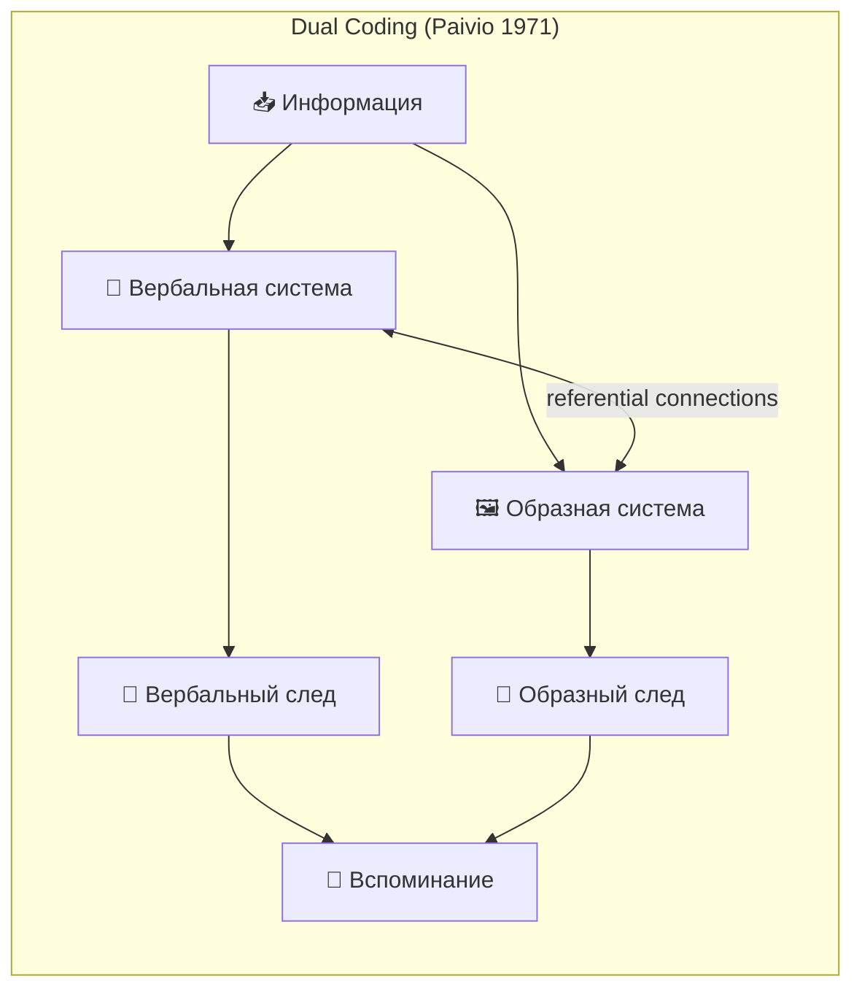
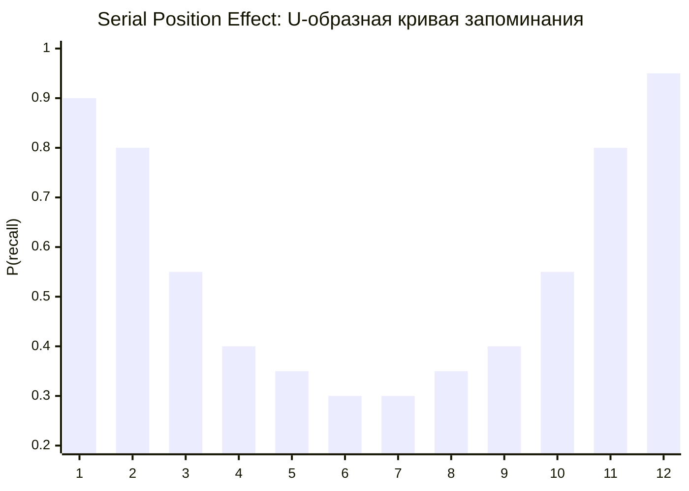
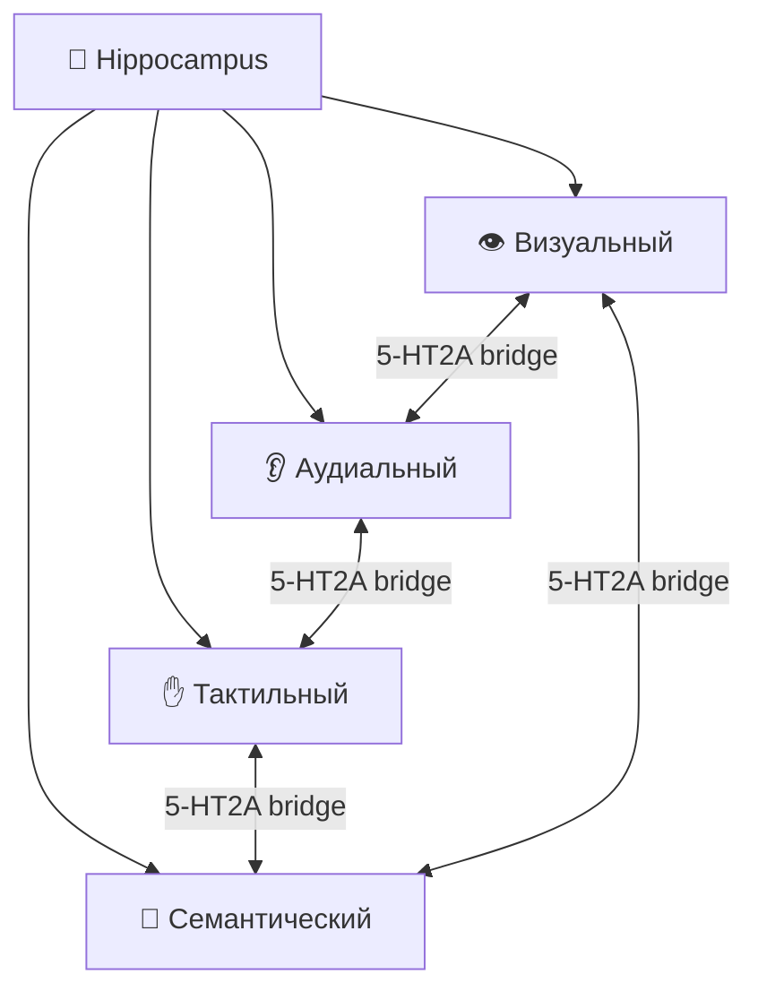
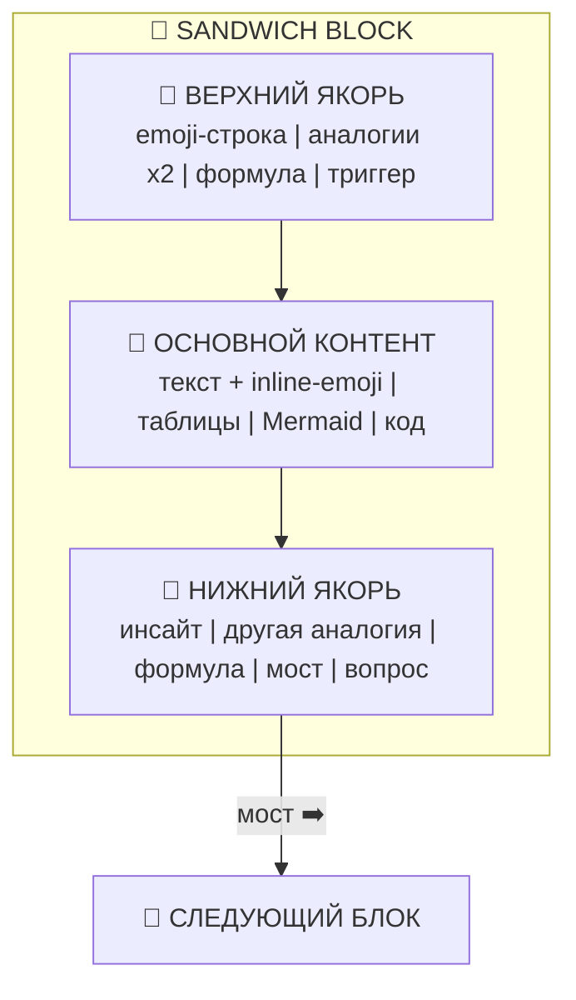
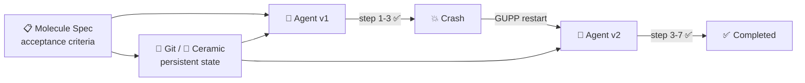

# 🧠🎨👁️🔊👃✋ SYNESTHETIC NOTE SYSTEM v2.0 ✋👃🔊👁️🎨🧠
### Нейрокогнитивный фреймворк для генерации мультисенсорных заметок
### Мета-промпт + Шаблон + Научная база + Mermaid + $\LaTeX$

> 📅 Дата: 2026-04-13
> 🔬 Статус: Мастер-документ / Промпт-шаблон / Руководство v2.0
> 🎯 Назначение: Отправь этот документ (или секцию VI) любой нейронке → получай заметки в нашем стиле
> 📎 Связано с: [06-UNIVERSAL-SENSORY-FORMAT](./06-UNIVERSAL-SENSORY-FORMAT.md) (Progressive Enhancement Levels)

---

## 📑 Содержание

| # | Часть | Суть |
|---|---|---|
| 0 | 🔬 **НАУЧНАЯ БАЗА** | 12 когнитивных принципов с доказательствами и $\LaTeX$ |
| I | 🧬 **АНАТОМИЯ БЛОКА** | Структура «Сэндвич» — формализация через Mermaid |
| II | 🎨 **ВИЗУАЛЬНЫЙ КОД** | Система символов, Мастер-Легенда, тематические наборы |
| III | 🔮 **12 ЛИНЗ ВОСПРИЯТИЯ** | Аналогии из разных сфер с формальным маппингом |
| IV | 📐 **ФОРМУЛЫ** | 4 типа $\LaTeX$-формул: структурные, трансформационные, сравнительные, метрические |
| V | 🏗️ **MERMAID COOKBOOK** | Когда, какой тип, конкретный синтаксис с примерами |
| VI | 📋 **МАСТЕР-ПРОМПТ** | Copy-paste промпт v2.0 с $\LaTeX$ и Mermaid |
| VII | 📝 **ПОЛНЫЙ ПРИМЕР** | NDI-заметка по всем правилам системы |
| VIII | 🔧 **ЧЕКЛИСТ + АНТИПАТТЕРНЫ** | 16-балльная самопроверка + галерея ошибок |
| IX | 🔄 **RETRIEVAL PRACTICE** | Встроенные хуки для интервального повторения |
| X | 🌌 **МОСТЫ** | Связи с MEOW, SensoryCell, Gas Town |

---

# 🔬 Часть 0 — НАУЧНАЯ БАЗА

## 🧬 12 принципов, на которых стоит система

Каждый принцип подтверждён рецензированными исследованиями. Формулы написаны на $\LaTeX$.

---

### 📊 1 · Dual Coding Theory (Paivio, 1971)

> **Мозг кодирует информацию через две независимые, но связанные системы: вербальную и образную. Двойное кодирование даёт $2\text{--}3\times$ лучшее запоминание.**



Вероятность вспоминания при двойном кодировании (при независимости каналов):

$$P(\text{recall}_{\text{dual}}) = 1 - \bigl(1 - P_v\bigr)\bigl(1 - P_i\bigr)$$

где $P_v$ — вероятность вспоминания через вербальный канал, $P_i$ — через образный.

**Пример:** $P_v = 0.6,\ P_i = 0.5 \implies P_{\text{dual}} = 1 - 0.4 \cdot 0.5 = 0.80$ — на 33% лучше, чем только текст.

**Подтверждение:** Morita et al. (2025, arXiv:2503.07463) показали, что GenAI-сгенерированные визуализации к учебным текстам повысили результаты тестов на **7.5%** (n=24).

**Применение:** 📝 Текст = вербальный код. 🔮 Emoji = образный код. Вместе = двойной след.

---

### 📊 2 · Serial Position Effect (Ebbinghaus 1885, Murdock 1962)

> **Человек лучше помнит начало (primacy) и конец (recency) последовательности. Середина проваливается.**



$$P(\text{recall}_i) = \alpha \cdot e^{-\lambda \cdot d(i, \text{boundary})} + \beta$$

где $d(i, \text{boundary})$ — расстояние позиции $i$ до ближайшего края (начала или конца), $\alpha, \lambda, \beta$ — параметры.

**Применение — структура «Сэндвич»:** поместить якорные блоки (иконки, аналогии, формулы) в начало и конец каждой секции → превратить «провал середины» в серию коротких последовательностей с высоким recall на обоих концах.

---

### 📊 3 · Cross-Modal Encoding (Oxford DPAG, 2024)

> **Мультисенсорное обучение формирует «мосты» между модальностями через серотониновые 5-HT2A рецепторы. Мозг реконструирует полную память из одного сенсорного фрагмента.**



$$P(\text{full recall} \mid \text{partial cue}) = 1 - \prod_{j \in \text{modalities}} \bigl(1 - w_j \cdot P_j\bigr)$$

**Применение:** привязка одной концепции к нескольким каналам (emoji = визуальный, метафора = аудиальный/вербальный, пространственное расположение = spatial) создаёт множественные пути к одной памяти.

---

### 📊 4 · Von Restorff Effect / Isolation Effect (1933)

> **Элемент, который выделяется среди однородных, запоминается значительно лучше.**

$$P(\text{recall}_{\text{isolated}}) \gg P(\text{recall}_{\text{homogeneous}})$$

**Применение:** emoji, формулы, таблицы, Mermaid-диаграммы — всё, что **визуально отличается** от потока текста, автоматически получает приоритет. Emoji каждые 1–3 предложения = регулярные якоря Von Restorff.

---

### 📊 5 · Method of Loci / Spatial Memory (Simonides, ~500 BC; Legge et al. 2012)

> **Привязка информации к пространственным локациям создаёт «дворец памяти». VR-исследования (PMC, 2022) показали статистически значимое улучшение recall.**

$$\text{Recall}_{\text{MoL}} = f(\text{vividness}, \text{distinctiveness}, \text{spatial\_order})$$

**Применение:** бесконечный холст = цифровой дворец памяти. Каждая заметка = «комната». Серия заметок = «маршрут». Иконки = «предметы в комнатах».

---

### 📊 6 · Cognitive Load Theory (Sweller, 1988)

> **Рабочая память ограничена ~4 чанками (Cowan, 2001). Три типа нагрузки: intrinsic (сложность материала), extraneous (плохой дизайн), germane (построение схем).**

$$\text{CL}_{\text{total}} = \underbrace{\text{CL}_{\text{intrinsic}}}_{\text{сложность}} + \underbrace{\text{CL}_{\text{extraneous}}}_{\text{дизайн}} + \underbrace{\text{CL}_{\text{germane}}}_{\text{схемы}} \leq \text{WM}_{\text{capacity}}$$

**Цель дизайна:** минимизировать $\text{CL}_{\text{extraneous}}$ (шум) → максимизировать $\text{CL}_{\text{germane}}$ (глубокая обработка). Чистая структура Сэндвич, консистентные emoji, таблицы вместо стен текста — всё это снижает extraneous load.

---

### 📊 7 · Levels of Processing (Craik & Lockhart, 1972)

> **Чем глубже обработка информации, тем прочнее след в памяти.**

$$\text{Retention} \propto \text{depth}(\text{processing})$$

Уровни: поверхностный (шрифт, цвет) → фонемический (звучание) → семантический (значение) → **генеративный** (создание связей, аналогий).

**Применение:** аналогии из 12 линз = принудительная **семантическая и генеративная обработка**. Читатель не просто видит факт — он строит мост к знакомой сфере.

---

### 📊 8 · Spacing Effect (Ebbinghaus 1885, Cepeda et al. 2006)

> **Распределённое повторение эффективнее массированного.**

$$S(t) = S_0 \cdot e^{-t / \tau}, \quad \tau_{\text{spaced}} \gg \tau_{\text{massed}}$$

**Применение:** структура «серия заметок» (00 → 01 → 02 → ...) с перекрёстными ссылками и повторением ключевых концептов = естественный spacing. Retrieval practice hooks в конце блоков усиливают эффект.

---

### 📊 9 · Testing / Generation Effect (Roediger & Karpicke, 2006)

> **Активное вспоминание (retrieval practice) укрепляет память сильнее, чем перечитывание.**

$$\text{Retention}_{\text{test}} \approx 2 \times \text{Retention}_{\text{restudy}}$$

**Применение:** каждый нижний якорь содержит **вопрос-вызов** (retrieval hook): «Можешь ли ты объяснить X через аналогию Y?». Это превращает пассивное чтение в активное вспоминание.

---

### 📊 10 · Chunking (Miller, 1956)

> **Рабочая память вмещает $7 \pm 2$ элемента, но через chunking (группировку) ёмкость растёт.**

$$\text{Effective capacity} = n_{\text{chunks}} \cdot \overline{|\text{chunk}|}$$

**Применение:** легенда символов = обучение чанкам. После запоминания 🔮 = CID, один символ заменяет целый абзац. Иконки — это **визуальные чанки**.

---

### 📊 11 · Schema Theory (Bartlett, 1932; Piaget)

> **Новая информация усваивается лучше, когда «цепляется» за существующие когнитивные схемы.**

$$P(\text{assimilation}) \propto |\text{Schema}_{\text{prior}} \cap \text{Info}_{\text{new}}|$$

**Применение:** аналогии из 12 линз = подключение к **существующим схемам** читателя. Биолог цепляет через клетку, физик — через поле. Больше линз = больше шансов найти «точку входа».

---

### 📊 12 · Picture Superiority Effect (Nelson et al. 1976; Paivio 1971)

> **Картинки запоминаются в $2\text{--}3\times$ лучше слов. Через 3 дня: recall изображений ~65% vs recall текста ~10%.**

Подтверждено в контексте Wikipedia: Silva et al. (2024, arXiv:2403.07613) на n=704 показали, что изображения рядом с текстом значительно повышают accuracy в задачах визуальной идентификации.

**Применение:** Mermaid-диаграммы, таблицы с emoji, визуальные схемы — используй **образ** везде, где это возможно.

---

## 📐 Единая формула запоминаемости v2.0

$$\boxed{M = \prod_{k=1}^{12} \alpha_k^{w_k}}$$

где $\alpha_k$ — коэффициент усиления от $k$-го принципа, $w_k$ — вес (зависит от реализации).

В упрощённой мультипликативной форме:

$$M = \underbrace{\alpha_D}_{\text{Dual Coding}} \cdot \underbrace{\alpha_S}_{\text{Serial Pos.}} \cdot \underbrace{\alpha_V}_{\text{Von Restorff}} \cdot \underbrace{\alpha_X}_{\text{Cross-Modal}} \cdot \underbrace{\alpha_L}_{\text{Loci}} \cdot \underbrace{\alpha_C}_{\text{Cog. Load}} \cdot \underbrace{\alpha_P}_{\text{Processing}} \cdot \underbrace{\alpha_E}_{\text{Spacing}} \cdot \underbrace{\alpha_T}_{\text{Testing}} \cdot \underbrace{\alpha_K}_{\text{Chunking}} \cdot \underbrace{\alpha_H}_{\text{Schema}} \cdot \underbrace{\alpha_I}_{\text{Picture}}$$

| Принцип | $\alpha$ диапазон | Как активируем |
|---|---|---|
| Dual Coding | $1.5\text{--}3.0$ | Emoji + текст |
| Serial Position | $1.2\text{--}2.0$ | Структура Сэндвич |
| Von Restorff | $1.3\text{--}1.8$ | Выделяющиеся элементы |
| Cross-Modal | $1.2\text{--}1.5$ | Мульти-аналогии |
| Method of Loci | $1.1\text{--}1.4$ | Пространственная структура |
| Cognitive Load | $1.2\text{--}1.6$ | Минимизация extraneous |
| Levels of Processing | $1.3\text{--}2.0$ | Генеративные аналогии |
| Spacing Effect | $1.2\text{--}1.8$ | Серия заметок + повторение |
| Testing Effect | $1.5\text{--}2.0$ | Retrieval hooks |
| Chunking | $1.2\text{--}1.5$ | Легенда символов |
| Schema Theory | $1.2\text{--}1.5$ | 12 линз аналогий |
| Picture Superiority | $1.5\text{--}3.0$ | Mermaid + визуальные таблицы |

---

# 🧬 Часть I — АНАТОМИЯ БЛОКА: Структура «Сэндвич»



### 🍞 Верхний якорь (3–7 строк)

| Поле | Обязательно | Пример |
|---|---|---|
| **Emoji-строка** | ✅ | `🔮⚛️🧬 \| CID = hash(content) \| ...` |
| **Аналогия 1** (близкая сфера) | ✅ | 🧫 Био: «Как ДНК определяет организм...» |
| **Аналогия 2** (далёкая сфера) | ✅ | ⚛️ Физика: «Как $E = mc^2$ стирает границу...» |
| **$\LaTeX$ формула** | 🟡 | $\text{CID} = H(\text{content} \oplus \text{links})$ |
| **Ассоциативный триггер** | 🟡 | «Вход: ты знаешь что такое хеш...» |

### 🥩 Основной контент

- Текст с **inline-emoji** каждые 1–3 предложения (Von Restorff)
- **Таблицы** с emoji в первом столбце для любого сравнения $\geq 2$ элементов
- **Mermaid-диаграммы** для взаимосвязей $> 5$ элементов
- **$\LaTeX$-формулы** для точных определений
- Вложенные **мини-сэндвичи** для подразделов

### 🍞 Нижний якорь (3–7 строк)

| Поле | Обязательно | Пример |
|---|---|---|
| **💡 Инсайт** | ✅ | Одно предложение — ключевой вывод |
| **Аналогия** (ДРУГАЯ линза) | ✅ | 🚗 Транспорт: «как GPS с пересчётом...» |
| **$\LaTeX$ резюме** | 🟡 | $\lim_{n \to \infty} P(\text{completion} \mid n) = 1$ |
| **➡️ Мост** | ✅ | «Далее: из NDI → K-voting» |
| **🔄 Retrieval hook** | ✅ | «Вопрос: чем NDI отличается от Temporal replay?» |

---

# 🎨 Часть II — ВИЗУАЛЬНЫЙ КОД

## 📊 6 правил выбора символов

| # | Правило | Зачем | Когнитивная основа |
|---|---|---|---|
| 1 | 🎯 **Семантическая точность** | Образ ДОЛЖЕН соответствовать слову | Dual Coding |
| 2 | 🔄 **Консистентность** | Один концепт = один emoji ВЕЗДЕ | Chunking |
| 3 | 📊 **Частота 1/1–3** | Каждые 1–3 предложения ≥ 1 emoji | Von Restorff |
| 4 | 🌈 **Разнообразие** | Не повторять один emoji > 3 раз подряд | Адаптация (habituation) |
| 5 | 📐 **Иерархия** | Заголовки: 2–3. Текст: 1. Таблицы: в каждой ячейке | Levels of Processing |
| 6 | 🏷️ **Легенда** | Таблица символ → значение в начале | Schema Theory |

## 📋 Мастер-Легенда

### Ядро (ВСЕГДА)

| Символ | Значение | Символ | Значение |
|---|---|---|---|
| 💡 | Ключевой инсайт | 🏆 | Лучший выбор |
| ⚠️ | Риск, предупреждение | 📐 | Формула, определение |
| 🟢 | Плюс, преимущество | 🔗 | Связь, зависимость |
| 🔴 | Минус, недостаток | 🔄 | Цикл, рекурсия |
| 🟡 | Нюанс, контекст | ➡️ | Переход, следующий шаг |
| 🎯 | Цель, фокус | 📎 | Ссылка на другой документ |

### Тематические наборы

**🖥️ Технологии:** 🔮 CID · ⚛️ Cell · 🧬 Spec · 🌿 Aspect · ♾️ фрактал · 📦 контейнер · 🔑 auth · 🛡️ изоляция · 📡 mesh · 🚀 deploy

**🧫 Биология:** 🧫 клетка · 🧬 ДНК · 🦠 вирус · 🌳 дерево · 🧠 мозг · 🫀 heartbeat · 🦴 скелет · 🩸 поток

**⚛️ Физика:** 🌋 big bang · 🕳️ wormhole · ⚡ энергия · 🌊 волна · 🪨 иммутабельность · 🌀 суперпозиция · 💫 сингулярность · 🔥 энтропия

**🎵 Музыка:** 🎼 партитура · 🎹 интерфейс · 🎧 мониторинг · 🎬 Director · 🎨 визуализация · 🎭 роли · 🎪 спектакль

**💰 Экономика:** 💰 ценность · 📈 рост · 🏦 хранилище · 🪙 токен/gas · 📊 метрика · 🤝 контракт

---

# 🔮 Часть III — 12 ЛИНЗ ВОСПРИЯТИЯ

Формально: пусть $\mathcal{C}$ — множество концептов, $\mathcal{L} = \{L_1, \ldots, L_{12}\}$ — множество линз. Для каждого концепта $c \in \mathcal{C}$ и линзы $L_k$, функция $\operatorname{Analogy}(c, L_k) \to \text{метафора}_k$ создаёт «мост» к существующей схеме читателя.

$$\text{Accessibility}(c) = \max_{k} \bigl\{ P(\text{prior schema} \mid L_k) \cdot \text{quality}(\operatorname{Analogy}(c, L_k)) \bigr\}$$

| # | 🔭 Линза | Базовые метафоры | Пример: «Контейнер» |
|---|---|---|---|
| 1 | ⚛️ **Физика** | Энергия, волны, поля, частицы | «Атом: протоны (код) + нейтроны (данные) + электроны (API)» |
| 2 | 🧫 **Биология** | Клетка, ДНК, экосистема | «Клетка: мембрана (namespace), ядро (runtime), ДНК (spec)» |
| 3 | 🔢 **Математика** | Функции, графы, топология | $f: \text{Spec} \to \text{Runtime}$, детерминированная |
| 4 | 🏗️ **Архитектура** | Фундамент, комнаты, город | «Квартира: изолирована, но с общими коммуникациями» |
| 5 | 🎵 **Музыка** | Партитура, инструменты, ритм | «Инструмент: играет партию по общей партитуре» |
| 6 | 🎮 **Игры** | Юниты, уровни, инвентарь | «Юнит в RTS: шаблон + характеристики + автономия» |
| 7 | 🍳 **Кулинария** | Рецепт, ингредиенты | «Рецепт + ингредиенты + оборудование → блюдо» |
| 8 | ⚖️ **Право** | Конституция, законы, иммунитет | «Дипломат: свои правила, но рамки международного права» |
| 9 | 🚗 **Транспорт** | Дороги, маршруты, контейнеры | «Грузовой контейнер: стандартный снаружи, любое внутри» |
| 10 | 🧒 **Детская** | LEGO, коробки, песочница | «Коробка LEGO: что внутри неважно, важна форма крышки (API)» |
| 11 | 💰 **Экономика** | Рынок, контракт, франшиза | «Франшиза: стандартный бренд (spec), уникальный менеджмент (state)» |
| 12 | 🌌 **Философия** | Платон, Гёдель, дзен | «Платоновская форма: spec=идея, instances=тени на стене» |

**Правила:** минимум **2 разные линзы** на ключевой концепт. Верхний якорь — близкая линза, нижний — далёкая (контраст усиливает запоминание).

---

# 📐 Часть IV — ФОРМУЛЫ: $\LaTeX$

## 🔢 4 типа формул

### Тип 1 — Структурная (определение)

$$\text{Cell} = f\bigl(\text{Spec}_{\text{CID}},\ \text{Capabilities},\ \text{State}_{\text{CID}}\bigr)$$

$$\text{Note} = \bigoplus_{i=1}^{n} \operatorname{Sandwich}\bigl(A_i^{\text{top}},\ C_i,\ A_i^{\text{bot}}\bigr)$$

### Тип 2 — Трансформационная (процесс)

$$\text{Events} \xrightarrow{\text{Director}} \text{Commands} \xrightarrow{\text{Canvas}} \text{Visuals}$$

$$\text{Formula} \xrightarrow{\text{cook}} \text{Proto} \xrightarrow{\text{instantiate}} \text{Molecule} \xrightarrow{\text{execute}} \text{Result}$$

### Тип 3 — Сравнительная (отношение)

$$\text{CID} \equiv \text{Content} \quad \text{(как } E \equiv mc^2\text{)}$$

$$\text{Gas Town} \subset \text{Sovereign Mesh} \quad \text{(как Ньютон} \subset \text{Эйнштейн)}$$

### Тип 4 — Метрическая (качество)

$$\text{Reliability}(N) = 1 - (1 - p_{\text{step}})^N$$

$$\text{Latency}_{\text{speculative}} \approx \max(T_{\text{context}},\ T_{\text{pick}}) \ll T_{\text{generate}}$$

## 🔧 Правила $\LaTeX$ в заметках

1. **Inline:** `$...$` для выражений внутри текста: $P_v = 0.6$
2. **Block:** `$$...$$` для отдельных формул на целую строку
3. **Функции:** `\operatorname{}` для имён: $\operatorname{Sandwich}$, $\operatorname{Analogy}$
4. **Текст внутри формул:** `\text{}`: $P(\text{recall}_{\text{dual}})$
5. **Максимум 1–3 формулы на блок** — формула должна СЖИМАТЬ, а не запутывать

---

# 🏗️ Часть V — MERMAID COOKBOOK

## 📊 Когда какой тип

| Ситуация | Тип Mermaid | Пример |
|---|---|---|
| Pipeline / поток данных | `graph LR` | Events → Director → Canvas |
| Иерархия / зависимости | `graph TD` | Архитектура системы |
| Временная последовательность | `sequenceDiagram` | Handshake, API flow |
| Концептуальная карта | `mindmap` | 12 линз, таксономия символов |
| Хронология / фазы | `timeline` | Roadmap, Progressive Enhancement |
| Распределение по 2 осям | `quadrantChart` | Сравнение технологий |
| Статистика / тренд | `xychart-beta` | Serial Position Effect |
| Decision tree | `flowchart TD` | Pipeline принятия решений |

## 🔧 Правила

1. **Emoji в узлах** — каждый узел содержит emoji + название
2. **Subgraph** для группировки — но не > 2 уровней вложенности
3. **Подписи на рёбрах** — в кавычках если содержат спецсимволы: `-->|"label"|`
4. **Не более 30–40 узлов** — иначе разбить на несколько диаграмм
5. **Без стилизации** — пусть тема рендерера определяет цвета
6. **Mermaid вместо ASCII** везде, кроме совсем тривиальных inline-схем

---

# 📋 Часть VI — МАСТЕР-ПРОМПТ v2.0

Скопируй этот блок и отправь любой нейронке вместе с темой:

````markdown
# СИСТЕМНЫЙ ПРОМПТ: Генерация синестетической заметки v2.0

## Роль
Ты — мастер синестетических заметок. Создавай документы, задействующие
максимум когнитивных каналов: визуальный (emoji, Mermaid), вербальный (текст),
математический (LaTeX), пространственный (структура, таблицы),
ассоциативный (аналогии из 12 сфер), мнемонический (retrieval hooks).

## Научная основа (12 принципов)
1. Dual Coding (Paivio 1971): текст + образ = двойной след
2. Serial Position (Ebbinghaus): начало/конец запоминаются → «Сэндвич»
3. Cross-Modal Encoding (Oxford 2024): мульти-сенсорные мосты
4. Von Restorff (1933): выделяющееся запоминается лучше → emoji-якоря
5. Method of Loci: пространственная организация → структура серии
6. Cognitive Load (Sweller 1988): минимизируй extraneous, максимизируй germane
7. Levels of Processing (Craik 1972): глубокая обработка → аналогии
8. Spacing Effect (Cepeda 2006): распределённое повторение → серия заметок
9. Testing Effect (Roediger 2006): retrieval practice hooks в конце блоков
10. Chunking (Miller 1956): легенда символов = обучение чанкам
11. Schema Theory (Bartlett): аналогии цепляются за существующие схемы
12. Picture Superiority (Nelson 1976): Mermaid-диаграммы запоминаются 2-3x лучше текста

## Структура документа

### Шапка
- Заголовок: 3-5 тематических emoji с ОБЕИХ сторон
- Подзаголовок: суть в одной строке
- Мета: дата, статус, ссылки
- Легенда символов: таблица «символ → значение» (10-25 записей)
- Содержание: таблица с частями

### Каждый блок: Структура «Сэндвич»

**🍞 Верхний якорь (3-7 строк):**
- Emoji-строка: визуальная суть секции
- 2 аналогии из РАЗНЫХ линз (12 доступных линз ниже)
- LaTeX-формула: $определение$ или $процесс$
- Ассоциативный триггер: «что привело к этому блоку»

**🥩 Основной контент:**
- Текст с inline-emoji каждые 1-3 предложения
- Таблицы с emoji в первом столбце для сравнений (≥2 элементов)
- Mermaid-диаграммы для сложных взаимосвязей (>5 элементов):
  - graph LR/TD: потоки, иерархии
  - sequenceDiagram: протоколы
  - mindmap: концептуальные карты
  - xychart-beta: данные
- LaTeX: $inline$ и $$block$$ формулы
- Вложенные мини-сэндвичи для подразделов

**🍞 Нижний якорь (3-7 строк):**
- 💡 Ключевой инсайт: одно предложение
- Аналогия из ДРУГОЙ линзы (контраст)
- LaTeX-резюме (если применимо)
- ➡️ Мост к следующему блоку
- 🔄 Retrieval hook: вопрос/вызов для активного вспоминания

### 12 линз аналогий (минимум 2 разные на ключевой концепт)
⚛️ Физика | 🧫 Биология | 🔢 Математика | 🏗️ Архитектура |
🎵 Музыка | 🎮 Игры | 🍳 Кулинария | ⚖️ Право |
🚗 Транспорт | 🧒 Детская | 💰 Экономика | 🌌 Философия

### LaTeX-формулы: 4 типа
1. Структурная: $X = f(A, B, C)$ — из чего состоит
2. Трансформационная: $A \xrightarrow{\text{process}} B$ — что происходит
3. Сравнительная: $X \equiv Y$, $A \subset B$ — как соотносится
4. Метрическая: $\text{Quality} = \text{formula}$ — насколько хорошо

### Emoji: правила
- СЕМАНТИЧЕСКАЯ ТОЧНОСТЬ: emoji = точное значение
- КОНСИСТЕНТНОСТЬ: одна концепция = один emoji ВЕЗДЕ
- ЧАСТОТА: каждые 1-3 предложения ≥1 emoji
- В ТАБЛИЦАХ: emoji в первом столбце обязательно
- В ЗАГОЛОВКАХ: 2-3 emoji
- В Mermaid-узлах: emoji + название

### Mermaid: правила
- ТОЛЬКО для сложного (>5 связанных элементов)
- Для простого (<5) → таблица
- Без кастомных стилей — пусть тема решает
- camelCase для ID узлов, кавычки для спецсимволов в подписях
- Subgraph для группировки, не более 2 уровней
- 30-40 узлов максимум, иначе разбивать

### Стиль
- Смешанный русский/английский (термины на EN)
- Параграф = максимум 4-5 предложений
- Цитаты `>` для ключевых определений
- Не бояться сленга и ярких выражений

### АНТИПАТТЕРНЫ (НЕ делай так)
- ❌ Emoji как декорация без значения
- ❌ ASCII-арт вместо Mermaid
- ❌ Псевдо-формулы вместо LaTeX (типа `P(recall) >> P(verbal)`)
- ❌ Маленькие Mermaid из 2-3 узлов (используй таблицу)
- ❌ Стена текста без якорей (нарушает Serial Position)
- ❌ Одна и та же линза аналогии в верхнем и нижнем якоре
- ❌ Формулы без текстового пояснения
- ❌ Больше 40 узлов в одной Mermaid-диаграмме

## Формула качества
$$M = \prod_{k=1}^{12} \alpha_k^{w_k}$$
Максимизируй ВСЕ 12 принципов одновременно.
````

---

# 📝 Часть VII — ПОЛНЫЙ ПРИМЕР

## 🏭🧬⚡ NDI: Недетерминированная Идемпотентность ⚡🧬🏭

### 🍞 Верхний якорь

🏭 фабрика · 🧬 ДНК · 🔄 цикл · ✅ гарантия · 🎲 случайность

> 🧫 **Биология:** Иммунная система борется с вирусом каждый раз по-разному (разные антитела, разные клетки), но **результат один** — вирус побеждён.
> ⚛️ **Физика:** Броуновское движение: каждая молекула движется хаотично, но **средняя температура** стабильна — макро-инвариант из микро-хаоса.

$$\forall\, r_1, r_2 \in \text{Runs}(m):\quad \text{path}(r_1) \neq \text{path}(r_2),\quad \text{result}(r_1) \cong \text{result}(r_2) \iff \text{spec}(m) \text{ is fixed}$$

### 🥩 Контент

**NDI** — паттерн из Gas Town (Стив Йегге, 2026). Суть: workflow **гарантированно** завершается, хотя каждый прогон идёт **разным путём**.



Как это работает:
1. 📋 Workflow (Molecule) хранится в **persistent storage** (Git / 🌊 Ceramic)
2. 🤖 Агент берёт текущий шаг и **выполняет** его
3. 💥 Если агент упал → новый агент **продолжает** с того же шага
4. ✅ Критерии приёмки в каждом шаге → **инвариант результата**

| Подход | 🔄 Deterministic Replay | 🎲 NDI (Gas Town) | 🔮 CID-NDI (Sovereign Mesh) |
|---|---|---|---|
| Путь | 📏 Воспроизведённый | 🎲 Произвольный | 🎲 Произвольный |
| Результат | ✅ Идентичный | ✅ Эквивалентный | ✅ Идентичный CID |
| Recovery | 🔄 Replay из лога | 🔄 Continue from step | 🔄 Ceramic stream replay |
| Overhead | 🔴 Запись каждого action | 🟢 Только milestones | 🟢 Только milestone CID |

### 🍞 Нижний якорь

💡 **Инсайт:** NDI работает потому, что задача определена точно (acceptance criteria), а путь — нет. Детерминированная цель, недетерминированный маршрут.

🚗 **Транспорт:** NDI = GPS-навигатор с пересчётом маршрута. Пробки, объезды — маршрут меняется, но пункт назначения фиксирован.

$$\lim_{n \to \infty} P\bigl(\text{completion} \mid n \text{ restarts}\bigr) = 1$$

➡️ **Далее:** NDI + K-voting (MAKER) = экспоненциальное снижение ошибок на длинных цепочках.

🔄 **Retrieval hook:** *В чём ключевое отличие NDI от Temporal deterministic replay? Какой trade-off делает NDI?*

🏭🧬⚡ | **ХАОС ПУТИ, ПОРЯДОК РЕЗУЛЬТАТА** | навигатор с пересчётом $\cong$ иммунная система | ⚡🧬🏭

---

# 🔧 Часть VIII — ЧЕКЛИСТ + АНТИПАТТЕРНЫ

## ✅ 16-балльная самопроверка

| # | Критерий | Проверка | Вес |
|---|---|---|---|
| 1 | 📋 **Легенда символов** | Таблица символ → значение в начале документа | 🔥 |
| 2 | 🍔 **Сэндвич-структура** | Каждая секция: верхний якорь + контент + нижний якорь | 🔥 |
| 3 | 🎨 **Emoji-частота** | Каждые 1–3 предложения ≥ 1 emoji | 🔥 |
| 4 | 🔭 **Аналогии** | Минимум 2 разные линзы на ключевой концепт | 🔥 |
| 5 | 📐 **$\LaTeX$ формулы** | Хотя бы 1 формула на секцию, правильный синтаксис | 🔥 |
| 6 | 📊 **Таблицы** | Каждое сравнение ≥ 2 элементов = таблица с emoji | 🟡 |
| 7 | 🖼️ **Mermaid** | Сложные связи (> 5 элементов) = Mermaid, не ASCII | 🔥 |
| 8 | 🎯 **Консистентность** | 1 символ = 1 значение во всём документе | 🔥 |
| 9 | 🔗 **Навигация** | Содержание, ссылки, мосты между частями | 🟡 |
| 10 | 💡 **Инсайты** | Каждая секция заканчивается ключевым инсайтом | 🔥 |
| 11 | ➡️ **Мосты** | Каждый нижний якорь ведёт к следующему блоку | 🟡 |
| 12 | 🌈 **Разнообразие** | Нет повтора emoji > 3 раз подряд | 🟡 |
| 13 | 🔄 **Retrieval hooks** | Каждый нижний якорь содержит вопрос | 🔥 |
| 14 | 🚫 **Нет ASCII-арта** | Все визуализации через Mermaid или таблицы | 🟡 |
| 15 | 🚫 **Нет псевдо-формул** | Все формулы в $\LaTeX$, не в plaintext | 🔥 |
| 16 | 🎭 **Разные линзы в якорях** | Верхний и нижний якорь используют РАЗНЫЕ линзы | 🟡 |

**Оценка:** 🏆 S-тир (16/16) · 🥇 A (13–15) · 🥈 B (10–12) · 🥉 C (7–9) · 🔴 D (< 7)

## 🚫 Галерея антипаттернов

| ❌ Плохо | ✅ Хорошо | Принцип |
|---|---|---|
| `P(recall) >> P(verbal)` | $P(\text{recall}_{\text{dual}}) \gg P(\text{recall}_{\text{verbal}})$ | Proper $\LaTeX$ |
| ASCII box-art `┌───┐` | Mermaid `graph LR` | Picture Superiority |
| 🎉🎊🥳 (рандомные emoji) | 🔮 CID · ⚛️ Cell · 🧬 Spec | Semantic precision |
| Стена текста на 20 строк | Сэндвич с якорями | Serial Position |
| Формула без объяснения | Формула + текст + аналогия | Levels of Processing |
| Диаграмма из 2 узлов | Таблица | Cognitive Load |
| Одна аналогия (только физика) | 2+ линзы (физика + кулинария) | Schema Theory |
| Нет вопроса в конце блока | «Чем X отличается от Y?» | Testing Effect |

---

# 🔄 Часть IX — RETRIEVAL PRACTICE

## 🧠 Зачем

Testing Effect (Roediger, 2006): активное вспоминание укрепляет память в $\approx 2\times$ сильнее, чем перечитывание. Каждый блок должен заканчиваться **retrieval hook** — вопросом, который:

1. Требует **вспомнить** ключевой концепт блока
2. Требует **применить** аналогию из другой линзы
3. Требует **сравнить** с чем-то из предыдущих блоков

## 📊 3 типа retrieval hooks

| Тип | Шаблон | Пример |
|---|---|---|
| 🔍 **Recall** | «Что такое X?» | «Что такое NDI и чем оно отличается от replay?» |
| 🔮 **Transfer** | «Объясни X через линзу Y» | «Объясни CID через аналогию с ДНК» |
| 🔗 **Connect** | «Как X связан с Y?» | «Как GUPP связан с Cell lifecycle?» |

## 🔧 Правило

Каждый нижний якорь содержит **ровно 1 retrieval hook** — помечается символом 🔄.

---

# 🌌 Часть X — МОСТЫ

## 🔗 Связь с MEOW (Gas Town)

Заметки сами по себе могут быть «молекулами» (Molecules) в системе Gas Town:

$$\text{NoteSeries} = \operatorname{Chain}\bigl(\text{Note}_0,\ \text{Note}_1,\ \ldots,\ \text{Note}_n\bigr)$$

Каждая заметка = Bead с acceptance criteria (чеклист из 16 пунктов). Серия = Molecule. Чтение серии = execution of molecule. Retrieval hooks = GUPP nudges для мозга.

## 🔗 Связь с SensoryCell (06-UNIVERSAL-SENSORY-FORMAT)

Каждая заметка = SensoryCell Level 1 (Markdown + emoji). При Progressive Enhancement:

| Level | Формат заметки | Дополнительные каналы |
|---|---|---|
| 0 | Plain text | Только вербальный |
| 1 | Markdown + emoji + $\LaTeX$ + Mermaid | Визуальный + математический |
| 2 | HTML + CSS + анимации | + анимация + интерактивность |
| 3 | WASM + Canvas | + звук + физика |
| 4 | WebXR | + пространственный + haptic |
| 5 | Full sensory | + все 18 каналов |

**Наша система работает на Level 1**, но структура Сэндвич, легенда символов и 12 линз **масштабируются на все уровни**.

---

## 🏁 Заключение

$$\boxed{\text{SynestheticNote} = \bigoplus_{i=1}^{n} \operatorname{Sandwich}\Bigl(\underbrace{A_i^{\text{top}}}_{\text{emoji + analogy + } \LaTeX},\quad \underbrace{C_i}_{\text{text + table + Mermaid}},\quad \underbrace{A_i^{\text{bot}}}_{\text{insight + analogy + hook}}\Bigr)}$$

где каждый $\operatorname{Sandwich}$ максимизирует $M = \prod_{k=1}^{12} \alpha_k^{w_k}$ по всем 12 когнитивным принципам.

---

> 📎 **Серия:** [00-FRACTAL-ATOM](./00-FRACTAL-ATOM.md) · [01-SYNESTHESIA-ENGINE-V3](./01-SYNESTHESIA-ENGINE-V3.md) · [02-SOVEREIGN-MESH](./02-SOVEREIGN-MESH.md) · [03-GAS-TOWN-ANALYSIS](./03-GAS-TOWN-ANALYSIS.md) · [04-ORCHESTRATOR-EVOLUTION](./04-ORCHESTRATOR-EVOLUTION.md) · [06-UNIVERSAL-SENSORY-FORMAT](./06-UNIVERSAL-SENSORY-FORMAT.md)
