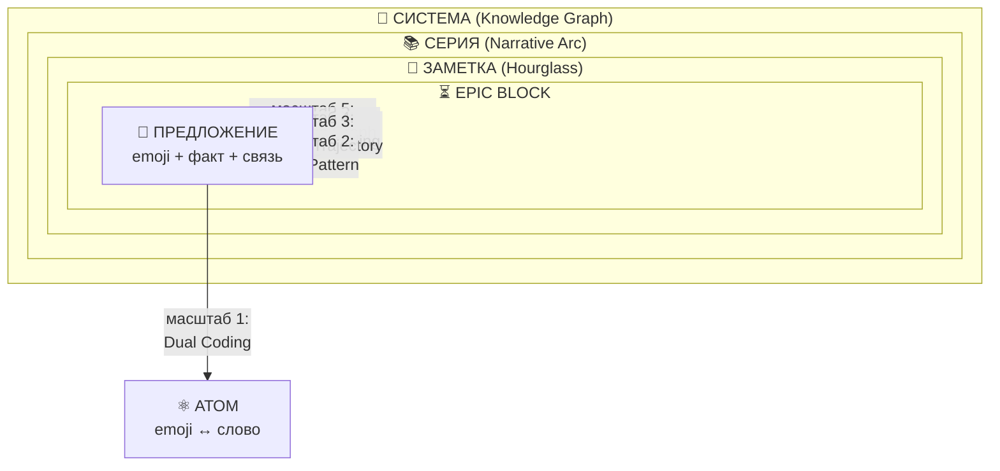
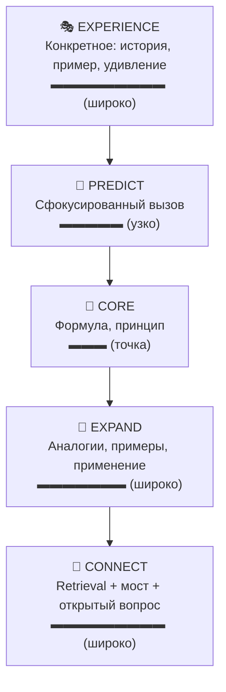
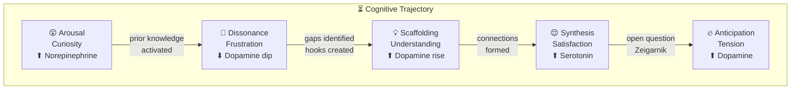
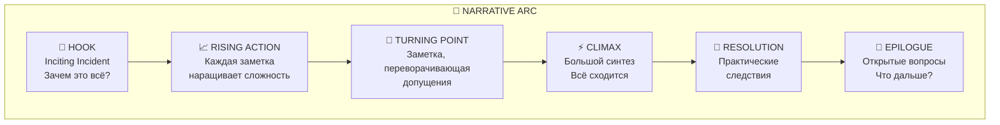

# 🧬🌀👁️🔮🧠 SYNESTHETIC NOTE SYSTEM v3.0 — Part I: FOUNDATIONS 🧠🔮👁️🌀🧬
### Фрактальная когнитивная архитектура для Живых Документов
### Когнитивный Резонанс · EPIC Block · Emotional Palette · 20 Принципов

> 📅 Дата: 2026-04-13
> 🔬 Статус: Фундаментальная теория · Part I of III
> 🎯 Этот файл: Научная база + Архитектура блоков + Теория эмоций
> 📎 Части: **[07-FOUNDATIONS]** · [08-TOOLKIT](./08-SNS3-TOOLKIT.md) · [09-PROMPT](./09-SNS3-PROMPT.md)
> 📎 Экосистема: [00-FRACTAL-ATOM](./00-FRACTAL-ATOM.md) · [01-ENGINE](./01-SYNESTHESIA-ENGINE-V3.md) · [02-MESH](./02-SOVEREIGN-MESH.md) · [06-SENSORY](./06-UNIVERSAL-SENSORY-FORMAT.md)

---

## 📑 Содержание

| # | Раздел | Суть |
|---|---|---|
| 0 | 🌋 **ФУНДАМЕНТАЛЬНЫЙ СДВИГ** | Заметка ≠ запись. Заметка = когнитивное событие |
| 1 | 🌀 **ФРАКТАЛЬНАЯ АРХИТЕКТУРА** | Один паттерн на 5 масштабах: предложение → система |
| 2 | 🔬 **20 ПРИНЦИПОВ** | Научная база с $\LaTeX$, Mermaid и цитатами |
| 3 | 📐 **ЕДИНОЕ УРАВНЕНИЕ** | Когнитивный Резонанс: $\cos\theta(\vec{S}_{\text{note}}, \vec{S}_{\text{brain}})$ |
| 4 | ⏳ **EPIC BLOCK** | Experience → Predict → Illuminate → Connect |
| 5 | 🎭 **EMOTIONAL PALETTE** | 7 эмоций → 7 нейрохимических путей → память |
| 6 | 📖 **NARRATIVE ARC** | Серия заметок как Hero's Journey |

---

# 🌋 0 — ФУНДАМЕНТАЛЬНЫЙ СДВИГ

## 📝 Заметка — не запись. Заметка — когнитивное событие.

v2.0 отвечала на вопрос: **«Как красиво оформить текст?»** — emoji, $\LaTeX$, Mermaid.

v3.0 отвечает на совершенно другой вопрос: **«Как спроектировать когнитивное событие в мозге читателя?»**

Оформление — лишь *инструмент*. Цель — **трансформация когнитивного состояния** читателя: от незнания к пониманию, от понимания к способности объяснить, от объяснения к способности применить.

### 📡 Аналогия из теории информации

В терминах Шеннона, заметка — **канал** между разумом автора и разумом читателя.

$$C = B \cdot \log_2(1 + \text{SNR})$$

- $B$ = **пропускная способность** — сколько когнитивных каналов активно одновременно (визуальный, вербальный, математический, пространственный, эмоциональный)
- $\text{SNR}$ = **отношение сигнал/шум** — какая доля поступающей информации действительно *обрабатывается глубоко*

**v2.0 максимизировала $B$** (мульти-канальность: emoji + текст + $\LaTeX$ + Mermaid).

**v3.0 максимизирует $\text{SNR}$** — не полируя *сигнал* (лучшее форматирование), а **активируя приёмник** (заставляя мозг читателя *работать*).

Именно это делают desirable difficulties, productive failure, generation effect, elaborative interrogation — они увеличивают *эффективную глубину обработки* на стороне приёмника.

### ⏳ Парадокс плотности информации

Добавление историй, вызовов, предсказаний, эмоций делает заметку *длиннее* — но *быстрее для обучения*:

$$T_{\text{total}} = T_{\text{read}} \cdot n_{\text{re-reads}}$$

| Формат | $T_{\text{read}}$ | $n_{\text{re-reads}}$ | $T_{\text{total}}$ |
|---|---|---|---|
| 📄 Plain text | Короткое | 3–5 (для запоминания) | **Высокое** |
| 🎨 v2.0 (визуальный) | Среднее | 2–3 | Среднее |
| ⚡ v3.0 (EPIC) | Длинное | ~1 (глубокая обработка за один проход) | **Низкое** |

EPIC-структура минимизирует *произведение* $T_{\text{read}} \cdot n_{\text{re-reads}}$.

---

# 🌀 1 — ФРАКТАЛЬНАЯ АРХИТЕКТУРА

## ♾️ Один паттерн на 5 масштабах

Ключевой прорыв v3.0: один и тот же паттерн **EPIC** (Experience → Predict → Illuminate → Connect) повторяется на каждом масштабе — от отдельного предложения до всей системы знаний. Как снежинка — дендритный фрактальный паттерн (vic/den), как Merkle-DAG в IPFS, как Cell в Fractal Atom.



### 📊 Каждый масштаб активирует свои принципы

| Масштаб | Единица | Паттерн | Первичные принципы |
|---|---|---|---|
| ⚛️ **Атом** | emoji ↔ слово | Dual Coding | Von Restorff, Chunking, Picture Superiority |
| 💬 **Предложение** | факт + эмоция + якорь | Micro-EPIC | Emotional Arousal, Concreteness |
| ⏳ **Блок** | EPIC Block | E→P→I→C | Productive Failure, Generation, Concreteness Fading, Testing, Elaboration |
| 📝 **Заметка** | Cognitive Trajectory | Hourglass | Narrative Transportation, Serial Position, Cognitive Load |
| 📚 **Серия** | Narrative Arc | Hero's Journey | Spacing, Spiral Re-encoding, Schema Theory |
| 🌌 **Система** | Knowledge Graph | Typed Links | Interleaving, Transfer, Metamemory |

### 🧬 Связь с Fractal Atom

Это та же денритная архитектура, что и в [00-FRACTAL-ATOM](./00-FRACTAL-ATOM.md):

$$\text{Note} = \text{Cell}(\text{Spec}_{\text{EPIC}},\ \text{Aspects}[\text{blocks}],\ \text{State}_{\text{reader}})$$

Заметка = Cell. EPIC-блок = Organelle. Серия = Organism. Knowledge Graph = Ecosystem. **Один паттерн, бесконечное масштабирование** — фрактал.

---

# 🔬 2 — 20 КОГНИТИВНЫХ ПРИНЦИПОВ

Принципы сгруппированы по масштабу, на котором они *наиболее* активны. Каждый подтверждён рецензированными исследованиями.

---

## ⚛️ Группа I: Масштаб Атома и Предложения

### 📊 1 · Dual Coding Theory (Paivio, 1971)

> Мозг имеет 2 независимые системы: вербальную и образную. Двойное кодирование = $2\text{--}3\times$ retention.

$$P(\text{recall}_{\text{dual}}) = 1 - (1 - P_v)(1 - P_i)$$

🔬 *Morita et al. (2025, arXiv:2503.07463): GenAI-визуализации → +7.5% на тестах.*

### 📊 2 · Von Restorff Effect (1933)

> Элемент, выделяющийся среди однородных, запоминается значительно лучше.

$$P(\text{recall}_{\text{isolated}}) \gg P(\text{recall}_{\text{homogeneous}})$$

🔬 Каждый emoji в потоке текста = Von Restorff якорь.

### 📊 3 · Picture Superiority Effect (Nelson et al. 1976)

> Изображения запоминаются в $2\text{--}3\times$ лучше слов. Через 3 дня: ~65% для картинок vs ~10% для текста.

🔬 *Silva et al. (2024, arXiv:2403.07613): n=704, изображения рядом с текстом → значительный рост accuracy.*

### 📊 4 · Chunking (Miller, 1956)

> Рабочая память: $7 \pm 2$ элемента. Через chunking — ёмкость растёт.

$$\text{Effective capacity} = n_{\text{chunks}} \cdot \overline{|\text{chunk}|}$$

Легенда символов = обучение чанкам. После тренировки: 🔮 = весь абзац про CID. **Emoji — визуальные чанки.**

---

## ⏳ Группа II: Масштаб Блока (EPIC)

### 📊 5 · Productive Failure (Kapur, 2008)

> Дать задачу *до* объяснения. Провал активирует prior knowledge и создаёт «крючки» для последующего понимания.

🔬 *Kapur (2025, BOLD): PF превосходит direct instruction в conceptual understanding и transfer.*

4 механизма: **activation** prior knowledge → **attention** к критическим чертам → **explanation** → **assembly**.

Применение: фаза **P (Predict)** в EPIC Block. Читатель пытается решить задачу *до* объяснения.

### 📊 6 · Generation Effect (Slamecka & Graf, 1978)

> Информация, сгенерированная самостоятельно, запоминается лучше, чем просто прочитанная.

$$\text{Retention}_{\text{generated}} \approx 1.5\text{--}2 \times \text{Retention}_{\text{read}}$$

Применение: «Запиши формулу сам, прежде чем смотреть ниже» → generation slot в EPIC.

### 📊 7 · Concreteness Fading / EIS (Bruner, 1966)

> Три фазы: **Enactive** (через действия/примеры) → **Iconic** (через образы/схемы) → **Symbolic** (через абстракции/формулы). Обучение идёт от конкретного к абстрактному.

🔬 *Minds.Wisconsin.edu (2025): EIS-последовательность облегчает grounding в STEM.*

Применение: внутри фазы **I (Illuminate)** контент подаётся в порядке EIS.

### 📊 8 · Elaborative Interrogation (Dunlosky et al. 2013; VanH et al. 2025)

> Вопросы «Почему?» и «Как?» к каждому факту → принудительная глубокая семантическая обработка.

🔬 *VanH et al. (2025, JCEHP): elaboration как стратегия Science of Learning.*

3 уровня: **Recall** → **Elaborative** → **Self-Explanation Chain**.

### 📊 9 · Testing / Retrieval Practice Effect (Roediger & Karpicke, 2006)

> Активное вспоминание укрепляет память в $\approx 2\times$ сильнее перечитывания.

$$\text{Retention}_{\text{test}} \approx 2 \times \text{Retention}_{\text{restudy}}$$

🔬 *Inc/Journal of Experimental Psychology (2025): self-testing — наиболее эффективная техника обучения.*

### 📊 10 · Cognitive Load Theory (Sweller, 1988)

> $\text{CL}_{\text{total}} = \text{CL}_{\text{intrinsic}} + \text{CL}_{\text{extraneous}} + \text{CL}_{\text{germane}} \leq \text{WM}_{\text{capacity}}$

Минимизируем extraneous (шум, плохой дизайн) → максимизируем germane (глубокая обработка, построение схем).

### 📊 11 · Levels of Processing (Craik & Lockhart, 1972)

> Чем глубже обработка, тем прочнее след.

$$\text{Retention} \propto \text{depth}(\text{processing})$$

Уровни: поверхностный → фонемический → семантический → **генеративный** (аналогии, формулы, объяснения).

---

## 📝 Группа III: Масштаб Заметки

### 📊 12 · Serial Position Effect (Ebbinghaus 1885, Murdock 1962)

> Начало (primacy) и конец (recency) запоминаются лучше. Середина проваливается.

Применение: EPIC Block делает *каждую секцию* коротким сегментом с сильным началом (Experience) и сильным концом (Connect).

### 📊 13 · Narrative Transportation (Green & Brock, 2000)

> При погружении в историю читатель: блокирует критическое мышление, формирует эмоциональные связи, мысленно визуализирует.

🔬 *Wikipedia: Transportation Theory — immersion в story → better memory of content, adoption of beliefs, reduced critical engagement.*

Применение: заметка = не справочник, а **история** с героем (система/концепт), препятствиями и разрешением.

### 📊 14 · Emotional Arousal & Memory Consolidation (bioRxiv 2025, Nature Communications 2023)

> Амигдала при эмоциональном возбуждении модулирует гиппокамп через норадреналин. Эмоциональный контент запоминается **драматически** лучше.

🔬 *PMC (2025): эмоциональные состояния **переносятся** — после эмоционального контента даже нейтральная информация запоминается лучше.*

🔬 *Nature Communications (2023): awake ripples после эмоционального кодирования предсказывают последующую дискриминацию в памяти.*

### 📊 15 · Zeigarnik Effect (1927)

> Незавершённые задачи запоминаются значительно лучше завершённых. Мозг держит «открытый гештальт» в рабочей памяти.

Применение: каждый EPIC Block заканчивается **клиффхэнгером** — незакрытым вопросом, создающим когнитивное напряжение.

### 📊 16 · Prediction-Driven Encoding (MIT Open Mind, 2026; bioRxiv, 2026)

> Точные предсказания *облегчают* кодирование в память. Даже неправильные предсказания усиливают subsequent encoding.

🔬 *MIT Open Mind (2026): precise predictions facilitate reliable memory encoding.*
🔬 *bioRxiv (2026): diffuse predictions stabilize neural code during WM encoding.*

Применение: **Prediction Prompts** перед ключевыми блоками.

---

## 📚 Группа IV: Масштаб Серии и Системы

### 📊 17 · Spacing Effect (Ebbinghaus 1885, Cepeda et al. 2006)

> Распределённое повторение эффективнее массированного.

$$S(t) = S_0 \cdot e^{-t/\tau}, \quad \tau_{\text{spaced}} \gg \tau_{\text{massed}}$$

### 📊 18 · Re-encoding / Memory Reconsolidation (EurekAlert, 2025)

> Каждое вспоминание = **перезапись** с включением нового контекста. Память — не файл, а живой процесс.

🔬 *EurekAlert (2025): память не статична — re-encoding обновляет воспоминания при каждом извлечении.*

Применение: **Spiral Pattern** — ключевые концепты возвращаются в новых контекстах через серию заметок (CID в 00, потом в 01, потом переосмысленный в 03).

### 📊 19 · Schema Theory (Bartlett, 1932; Piaget)

> Новая информация цепляется за существующие когнитивные схемы.

$$P(\text{assimilation}) \propto |\text{Schema}_{\text{prior}} \cap \text{Info}_{\text{new}}|$$

Применение: 12 линз аналогий = подключение к *разным* схемам читателя.

### 📊 20 · Concept Mapping (Novak; meta-analysis 2025)

> Мета-анализ 68 исследований: effect size $g = 1.047$ (большой). LLM-построенные concept maps → снижение когнитивной нагрузки на 31.5%.

🔬 *ACL BEA (2025): LLM-powered concept maps из учебных текстов → значимое снижение perceived cognitive load.*

Применение: каждая серия заметок сопровождается **метакартой** — concept map с типизированными связями.

---

## 📊 Сводная таблица 20 принципов

| # | Принцип | Масштаб | $\alpha$ | Ключевое действие в EPIC |
|---|---|---|---|---|
| 1 | Dual Coding | ⚛️ Атом | $1.5\text{--}3.0$ | Emoji + текст |
| 2 | Von Restorff | ⚛️ Атом | $1.3\text{--}1.8$ | Inline emoji каждые 1–3 предложения |
| 3 | Picture Superiority | ⚛️ Атом | $1.5\text{--}3.0$ | Mermaid, визуальные таблицы |
| 4 | Chunking | ⚛️ Атом | $1.2\text{--}1.5$ | Легенда символов |
| 5 | Productive Failure | ⏳ Блок | $1.5\text{--}2.5$ | **P**redict: задача до объяснения |
| 6 | Generation Effect | ⏳ Блок | $1.5\text{--}2.0$ | Generation slot: «запиши формулу сам» |
| 7 | Concreteness Fading | ⏳ Блок | $1.3\text{--}2.0$ | **I**lluminate: пример → схема → формула |
| 8 | Elaborative Interrogation | ⏳ Блок | $1.3\text{--}1.8$ | **C**onnect: 3 уровня «почему?» |
| 9 | Testing Effect | ⏳ Блок | $1.5\text{--}2.0$ | **C**onnect: retrieval hooks |
| 10 | Cognitive Load | ⏳ Блок | $1.2\text{--}1.6$ | Чистая структура, min extraneous |
| 11 | Levels of Processing | ⏳ Блок | $1.3\text{--}2.0$ | Генеративные аналогии |
| 12 | Serial Position | 📝 Заметка | $1.2\text{--}2.0$ | Сильное E и сильное C в каждом блоке |
| 13 | Narrative Transport. | 📝 Заметка | $1.5\text{--}3.0$ | Сквозная история |
| 14 | Emotional Arousal | 📝 Заметка | $1.5\text{--}3.0$ | Emotional Palette |
| 15 | Zeigarnik Effect | 📝 Заметка | $1.2\text{--}1.5$ | Клиффхэнгеры в **C**onnect |
| 16 | Prediction Encoding | 📝 Заметка | $1.3\text{--}1.8$ | Prediction prompts в **P**redict |
| 17 | Spacing Effect | 📚 Серия | $1.2\text{--}1.8$ | Серия заметок, перекрёстные ссылки |
| 18 | Re-encoding | 📚 Серия | $1.3\text{--}1.8$ | Spiral Pattern — концепты возвращаются |
| 19 | Schema Theory | 📚 Серия | $1.2\text{--}1.5$ | 12 линз аналогий |
| 20 | Concept Mapping | 🌌 Система | $1.3\text{--}2.0$ | Метакарта серии с typed links |

---

# 📐 3 — ЕДИНОЕ УРАВНЕНИЕ КОГНИТИВНОГО РЕЗОНАНСА

## 🧠 Мета-принцип

Все 20 принципов объединяет одна идея — **когнитивный резонанс**. Подобно физическому резонансу, когда внешняя частота совпадает с собственной частотой системы, когнитивный резонанс возникает, когда *структура* подачи информации совпадает со *структурой* естественной работы мозга.

Мозг *по природе*:
- Рассказывает истории (Narrative Transportation)
- Делает предсказания (Prediction-Driven Encoding)
- Испытывает эмоции (Emotional Arousal)
- Строит от конкретного к абстрактному (Concreteness Fading)
- Привязывает новое к известному (Schema Theory)
- Укрепляет через вспоминание (Testing Effect)
- Группирует в чанки (Chunking)
- Помнит начала и концы (Serial Position)
- Замечает отличающееся (Von Restorff)
- Использует несколько сенсоров (Cross-Modal)

**Когда мы проектируем заметки, совпадающие с этими процессами, информация «втекает» в память с минимальным сопротивлением.**

Мы не *обманываем* мозг. Мы *говорим на его родном языке*.

## 📐 Формализация

Определим вектор структуры заметки $\vec{S}_{\text{note}} \in \mathbb{R}^{20}$, где каждая компонента — степень активации соответствующего когнитивного принципа. Аналогично, вектор естественной обработки мозга $\vec{S}_{\text{brain}} \in \mathbb{R}^{20}$.

$$\boxed{\mathcal{R}_{\text{cognitive}} = \cos\theta\bigl(\vec{S}_{\text{note}},\ \vec{S}_{\text{brain}}\bigr) = \frac{\vec{S}_{\text{note}} \cdot \vec{S}_{\text{brain}}}{\|\vec{S}_{\text{note}}\| \cdot \|\vec{S}_{\text{brain}}\|}}$$

Максимальный резонанс ($\mathcal{R} = 1$) при $\theta = 0$ — полное совпадение структуры заметки и структуры работы мозга.

## 📐 Мультимасштабная модель

Поскольку архитектура фрактальна, резонанс **мультипликативен** по масштабам:

$$\mathcal{R}_{\text{total}} = \underbrace{\mathcal{R}_{\text{atom}}}_{\text{emoji + слово}} \cdot \underbrace{\mathcal{R}_{\text{block}}}_{\text{EPIC}} \cdot \underbrace{\mathcal{R}_{\text{note}}}_{\text{narrative}} \cdot \underbrace{\mathcal{R}_{\text{series}}}_{\text{spiral}} \cdot \underbrace{\mathcal{R}_{\text{system}}}_{\text{KG}}$$

**Произведение, а не сумма** — если один масштаб провален ($\mathcal{R} \to 0$), всё произведение обнуляется. Поэтому критично проработать *каждый* масштаб.

При идеальной реализации:

$$\mathcal{R}_{\text{max}} = 1^5 = 1 \quad \text{(идеальный резонанс на всех масштабах)}$$

При полностью случайной заметке:

$$\mathcal{R}_{\text{random}} \approx \left(\frac{1}{\sqrt{20}}\right)^5 \approx 0.00045$$

**Разница: ~$2000\times$** между идеальной и случайной заметкой. Это объясняет, почему хорошие заметки «просто ощущаются иначе» — это не субъективное впечатление, а измеримая разница в когнитивном резонансе.

---

# ⏳ 4 — EPIC BLOCK: Ядро Системы

## ⏳ Почему не Sandwich

Sandwich (v2.0): **Якорь → Контент → Якорь** — пассивная структура. Читатель *получает* информацию.

EPIC Block (v3.0): **Experience → Predict → Illuminate → Connect** — активная структура. Читатель *участвует* в когнитивном событии.

## ⏳ Модель «Песочные часы» (Hourglass)

EPIC Block имеет форму песочных часов по уровню абстракции:



Это **не** top-down (абстракция → примеры), **не** bottom-up (примеры → абстракция), **не** Sandwich (абстракция → контент → абстракция).

Это **Hourglass**: конкретное → сфокусированное → абстрактное → расширенное → связанное. Так мыслят эксперты: начинают с конкретного случая, извлекают принцип, затем применяют широко.

## ⏳ Четыре фазы EPIC

### 🎭 E — Experience (Опыт + Эмоция + Конкретика)

**Цель:** захватить внимание, активировать эмоции, заземлить в конкретике.

| Элемент | Что делает | Когнитивная основа |
|---|---|---|
| 😮 **Удивительный факт / парадокс** | Ломает ожидания, привлекает внимание | Emotional Arousal, Von Restorff |
| 🎭 **Мини-история / сцена** | Запускает narrative transportation | Narrative Transportation |
| 💥 **Когнитивный конфликт** | «Но подождите, ведь X противоречит Y!» | Desirable Difficulty |
| 🏗️ **Конкретный пример** | Enactive фаза Брунера | Concreteness Fading |
| 🔓 **Незавершённость** | Не раскрывать ответ | Zeigarnik Effect |

**Формат:**

```markdown
> 🎭 **Сцена:** [Конкретный пример, история, удивительный факт]
> [Эмоциональная реакция: удивление, конфликт, юмор, напряжение]
> [Ситуация остаётся НЕРЕШЁННОЙ — мозг "зацепился"]
```

### 🎯 P — Predict (Предсказание + Продуктивный провал)

**Цель:** активировать prior knowledge, создать «крючки», заставить мозг работать.

| Элемент | Что делает | Когнитивная основа |
|---|---|---|
| 🎯 **Вызов** | «Как бы ТЫ решил эту задачу?» | Productive Failure |
| 🔮 **Предсказание** | «Что произойдёт, если X?» | Prediction-Driven Encoding |
| ✏️ **Generation slot** | «Запиши формулу, прежде чем смотреть» | Generation Effect |
| 💡 **Подсказка** (опциональная) | Через аналогию из далёкой сферы | Schema Theory |

**Формат:**

```markdown
> 🎯 **Вызов:** Прежде чем читать дальше — [вопрос/задача].
> 💡 *Подсказка:* подумай через аналогию с [далёкая сфера]...
```

Даже *неправильный* ответ усиливает последующее кодирование (MIT, 2026).

### 🔬 I — Illuminate (Освещение: конкретное → визуальное → формальное)

**Цель:** передать знание через Progressive Disclosure в порядке EIS.

**Три фазы внутри I:**

| Фаза | Bruner | Формат | Пример |
|---|---|---|---|
| 🏗️ **Enactive** | Действие | Конкретный код, живой пример, «потрогай руками» | Реальный JSON CID |
| 🖼️ **Iconic** | Образ | Mermaid-диаграмма, визуальная таблица | graph LR архитектуры |
| 📐 **Symbolic** | Символ | $\LaTeX$-формула, формальное определение | $\text{CID} = H(\text{content} \oplus \text{links})$ |

Также внутри I:
- 🧠 **Think-Aloud блоки** — автор показывает *процесс* рассуждения: «Сначала я подумал X, но увидел проблему Y...» (Cognitive Apprenticeship, Collins 1991)
- 📝 **Inline emoji** каждые 1–3 предложения (Von Restorff)
- 📊 **Таблицы** с emoji для сравнений $\geq 2$ элементов
- 🧬 **Mermaid** для связей $> 5$ элементов

### 🔗 C — Connect (Связь: retrieval + мост + Зейгарник)

**Цель:** закрепить, проверить, создать мост и напряжение.

| Элемент | Что делает | Когнитивная основа |
|---|---|---|
| 💡 **Инсайт** | Ключевой вывод — 1 предложение | Chunking, Serial Position |
| 🔮 **Контрастная аналогия** | Из ДРУГОЙ линзы, чем в Experience | Schema Theory |
| 📐 **$\LaTeX$-резюме** | Формула-сжатие всего блока | Symbolic, Chunking |
| 🔄 **3-уровневый Retrieval** | L1: recall · L2: elaborate · L3: transfer | Testing, Elaboration |
| 📊 **Self-assessment** | «Оцени понимание 1–5» | Metamemory |
| ⏸️ **Клиффхэнгер** | Незакрытый вопрос → следующий блок | Zeigarnik Effect |

**Формат:**

```markdown
> 💡 **Инсайт:** [ключевой вывод]
> 🔮 **Аналогия:** [контрастная линза]
> 📐 **Формула:** $[LaTeX]$
>
> 🔄 **Проверь себя:**
> - L1 🔍 *recall:* «Что такое X?»
> - L2 🔬 *elaborate:* «Почему X работает именно так, а не иначе?»
> - L3 🌉 *transfer:* «Объясни X через линзу Y»
>
> 📊 **Уверенность:** насколько ты понял? (1–5). Если < 3 → перечитай I с другой аналогией.
>
> ⏸️ **Но...** [клиффхэнгер: неразрешённый вопрос, ведущий к следующему блоку]
```

---

## ⏳ Когнитивная траектория EPIC Block

Каждый блок проектируется как **траектория** когнитивного и эмоционального состояния:



Нейрохимический маршрут: **NE** (внимание) → **DA dip** (prediction error) → **DA rise** (обучающий сигнал) → **5-HT** (удовлетворение) → **DA** (предвкушение). Это *оптимальная* последовательность для кодирования в долговременную память.

---

# 🎭 5 — EMOTIONAL PALETTE

## 🎨 7 эмоций × 7 когнитивных функций

Эмоции — не декорация. Это **модуляторы памяти** (Nature Communications, 2023). Каждая эмоция активирует определённый нейрохимический путь и выполняет конкретную когнитивную функцию.

| Эмоция | Символ | Когнитивная функция | Нейрохимия | Как вызвать в заметке |
|---|---|---|---|---|
| 😮 **Удивление** | `😮` `🤯` | Захват внимания, Von Restorff | Norepinephrine | Контринтуитивный факт, парадокс |
| 🤔 **Любопытство** | `🤔` `🔍` | Поиск, exploration, Zeigarnik | Dopamine (anticipatory) | Открытый вопрос, partial information |
| 😂 **Юмор** | `😂` `😏` | Эмоциональное кодирование, снижение тревоги | Endorphins + Dopamine | Неожиданная аналогия, абсурдное сравнение |
| 😱 **Напряжение** | `😱` `⚡` | Arousal, амигдала → гиппокамп | Norepinephrine + Cortisol | Stakes: «Если это сломается...», последствия |
| 🤯 **Восхищение** | `🤯` `✨` | Глубокое кодирование, schema expansion | Dopamine (reward) | Элегантность решения, эмерджентность |
| 😤 **Контролируемая фрустрация** | `😤` `🎯` | Productive Failure, activation | Norepinephrine + DA dip | Challenge-first блоки: задача без решения |
| 😌 **Разрешение** | `😌` `💡` | Консолидация, удовлетворение | Serotonin + Dopamine | Чистая формула после борьбы, «ага!»-момент |

### 🎭 Эмоциональная дуга EPIC

Каждый EPIC Block проходит через эмоциональную дугу:

$$\text{E}(😮 \text{ surprise}) \to \text{P}(🤔 \text{ curiosity} + 😤 \text{ frustration}) \to \text{I}(🤯 \text{ awe}) \to \text{C}(😌 \text{ resolution} + 🤔 \text{ new curiosity})$$

**Правило:** блок, не вызывающий ни одной эмоции — **мёртвый блок**. Его нужно переписать.

### 🎭 Принципы эмоционального дизайна

1. **Surprise first** — начинай блок с чего-то неожиданного, а не с определения
2. **Stakes matter** — покажи, *почему это важно*, через реальные последствия
3. **Humor is legitimate** — юмор не «несерьёзность», а инструмент эмоциональной памяти
4. **Controlled frustration** — вызов должен быть *трудным, но решаемым* (desirable difficulty)
5. **Resolution earned** — инсайт ценен, только если ему предшествовала борьба
6. **End with hunger** — финал = новый вопрос, не точка, а многоточие...

---

# 📖 6 — NARRATIVE ARC для серии заметок

## 📖 Серия ≠ справочник. Серия = путешествие.

Вместо плоской нумерации (00, 01, 02...) серия заметок следует **нарративной структуре**:



### 📊 Маппинг на нашу серию

| Narrative Phase | Заметка | Что происходит |
|---|---|---|
| 🌋 Hook | 00-FRACTAL-ATOM | «Данные = идентичность. CID меняет всё.» |
| 📈 Rising | 01-ENGINE, 02-MESH | Усложнение: движок, экосистема |
| 🔄 Turning Point | 03-GAS-TOWN | «Оказывается, Gas Town уже реализовал часть наших идей!» |
| ⚡ Climax | 04-ORCHESTRATOR | Мега-синтез: все паттерны сходятся |
| 📐 Resolution | 05/07-SNS3 | Практический инструмент: как применить |
| 🌌 Epilogue | 06-SENSORY | Открытый горизонт: полная синестезия, Level 5 |

### 🔄 Spiral Re-encoding

Ключевые концепты **возвращаются** в каждой заметке, но на новом уровне глубины:

| Концепт | 00 (intro) | 01 (engine) | 03 (gas town) | 04 (synthesis) |
|---|---|---|---|---|
| 🔮 **CID** | Определение | Как Cell ID | CID vs TOML hash | CID-NDI fusion |
| ⚛️ **Cell** | Теория | Компонент движка | Bead как Cell | 12 архетипов Cells |
| 🔄 **NDI** | — | Упоминание | Полный разбор | NDI + K-voting |

Каждое возвращение = **re-encoding** с новым контекстом → более прочный след в памяти.

---

## 🏁 Итоги Part I

### Что нового в v3.0 vs v2.0

| Аспект | v2.0 | v3.0 |
|---|---|---|
| Единица | Sandwich (пассивная) | **EPIC Block** (активная) |
| Принципов | 12 | **20** |
| Модель подачи | Абстракция → контент → абстракция | **Hourglass** (конкретное → фокус → абстрактное → широкое) |
| Роль читателя | Получает информацию | **Участвует** (предсказывает, генерирует, проверяет) |
| Эмоции | «Emotional resonance» (абстрактно) | **7-эмоций Palette** с нейрохимией |
| Масштаб | Блок | **5 фрактальных масштабов** |
| Серия | Плоская нумерация | **Narrative Arc** + Spiral Re-encoding |
| Мета-теория | Множитель $M = \prod \alpha_k$ | **Когнитивный Резонанс** $\cos\theta(\vec{S}_{\text{note}}, \vec{S}_{\text{brain}})$ |

$$\boxed{\text{v3.0} = \text{Fractal} \times \text{EPIC} \times \text{Emotion} \times \text{Narrative} \times \text{Active Reader}}$$

---

> 📎 **Продолжение:** [08-SNS3-TOOLKIT.md](./08-SNS3-TOOLKIT.md) — Визуальный код, 12 линз (structural mapping), $\LaTeX$/Mermaid cookbooks, анти-паттерны
