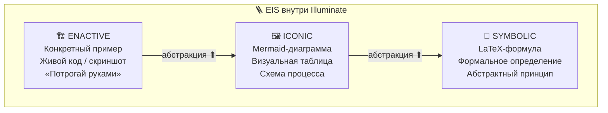

# 🎨🔧📐🗺️🔬 SYNESTHETIC NOTE SYSTEM v3.0 — Part II: TOOLKIT 🔬🗺️📐🔧🎨
### Практические инструменты: Visual Code · 12 линз · $\LaTeX$ · Mermaid · Anti-Patterns
### Всё, что нужно для *создания* заметок по системе EPIC

> 📅 Дата: 2026-04-13
> 🔬 Статус: Практический инструментарий · Part II of III
> 📎 Части: [07-FOUNDATIONS](./07-SNS3-FOUNDATIONS.md) · **[08-TOOLKIT]** · [09-PROMPT](./09-SNS3-PROMPT.md)

---

## 📑 Содержание

| # | Раздел | Суть |
|---|---|---|
| 0 | 🎨 **VISUAL CODE v3** | Система символов: правила, легенда, Symbolic Compression Protocol |
| 1 | 🔮 **12 ЛИНЗ v3** | Structural Mapping: не метафоры-однострочники, а *отображения отношений* |
| 2 | 📐 **$\LaTeX$ COOKBOOK** | Progressive Disclosure: интуиция → полуформально → формально |
| 3 | 🏗️ **MERMAID COOKBOOK** | Decision Matrix: что когда использовать + конкретный синтаксис |
| 4 | 🪜 **CONCRETENESS FADING** | EIS-протокол внутри фазы Illuminate |
| 5 | 🔀 **INTERLEAVING** | Чередование: теория–практика–сравнение |
| 6 | 🚫 **ANTI-PATTERN GALLERY v2** | 12 ошибок с Before/After примерами |

---

# 🎨 0 — VISUAL CODE v3: Symbolic Compression Protocol

## 🗜️ Emoji — не декорация. Emoji — визуальные чанки.

В теории информации, каждый emoji выполняет **lossy compression** концепта:

$$\operatorname{emoji}(c) = \operatorname{compress}(c) \quad \text{s.t.} \quad \operatorname{decompress}\bigl(\operatorname{emoji}(c),\ \text{context}\bigr) \approx c$$

Потери компенсируются контекстом (окружающий текст, позиция в блоке, обучение из легенды). После тренировки символ 🔮 заменяет целый абзац про CID — это **Chunking** (Miller, 1956) в чистом виде.

## 📊 7 правил (расширено из v2.0)

| # | Правило | Формализация | Когнитивная основа |
|---|---|---|---|
| 1 | 🎯 **Семантическая точность** | $\operatorname{emoji}(c) \cong c$ — образ ДОЛЖЕН соответствовать слову | Dual Coding |
| 2 | 🔄 **Консистентность** | $\forall\, \text{doc}:\ c \mapsto \operatorname{emoji}(c)$ — одна и та же | Chunking, Schema |
| 3 | 📊 **Частота 1/(1–3)** | Каждые 1–3 предложения $\geq 1$ emoji | Von Restorff |
| 4 | 🌈 **Разнообразие** | $\neg(\text{same emoji} > 3 \times \text{consecutive})$ | Habituation avoidance |
| 5 | 📐 **Иерархия** | Заголовок: 2–3 · Текст: 1 inline · Таблица: каждая ячейка · Mermaid: каждый узел | Levels of Processing |
| 6 | 🏷️ **Легенда в начале** | Таблица $\operatorname{emoji} \to \text{meaning}$ (10–25 записей) | Schema Theory |
| 7 | 🎭 **Эмоциональная адекватность** | Emoji отражает *эмоцию*, а не только *тему* — 😮 для удивления, 💡 для инсайта | Emotional Palette |

## 📋 Мастер-Легенда

### Ядро (используется ВСЕГДА)

| Символ | Значение | Символ | Значение | Символ | Значение |
|---|---|---|---|---|---|
| 💡 | Инсайт | 🏆 | Лучший выбор | 🔗 | Связь |
| ⚠️ | Риск | 📐 | Формула | 🔄 | Цикл |
| 🟢 | Плюс | 🔴 | Минус | 🟡 | Нюанс |
| 🎯 | Фокус | ➡️ | Переход | 📎 | Ссылка |
| 😮 | Удивление | 🤔 | Вызов/вопрос | 😌 | Разрешение |
| 🏗️ | Пример (enactive) | 🖼️ | Схема (iconic) | 📐 | Формула (symbolic) |

### Тематические наборы (расширяемые)

**🖥️ Технологии:** 🔮 CID · ⚛️ Cell · 🧬 Spec · 🌿 Aspect · ♾️ фрактал · 📦 контейнер · 🔑 auth · 🛡️ isolation · 📡 mesh · 🚀 deploy

**🧫 Биология:** 🧫 клетка · 🧬 ДНК · 🦠 вирус · 🌳 дерево · 🧠 мозг · 🫀 heartbeat · 🦴 скелет · 🩸 поток

**⚛️ Физика:** 🌋 big bang · 🕳️ wormhole · ⚡ энергия · 🌊 волна · 🪨 иммутабельность · 🌀 суперпозиция · 💫 сингулярность · 🔥 энтропия

**🎵 Музыка:** 🎼 партитура · 🎹 интерфейс · 🎧 мониторинг · 🎬 Director · 🎨 палитра · 🎭 роли

**💰 Экономика:** 💰 ценность · 📈 рост · 🏦 хранилище · 🪙 gas/токен · 📊 метрика · 🤝 контракт

---

# 🔮 1 — 12 ЛИНЗ v3: Structural Mapping

## 🧠 Почему одностроки не работают

v2.0: «CID — как ДНК данных». Это *attribute mapping* (поверхностный).

v3.0: **Structural mapping** (Gentner, 1983) — отображение *отношений между элементами*, а не атрибутов.

$$\operatorname{Analogy}(c, L_k) = \bigl\{(r_s, r_t) \mid r_s \in \text{Source},\ r_t \in \text{Target},\ \text{struct}(r_s) \cong \text{struct}(r_t)\bigr\}$$

### 📊 Пример: CID через 3 линзы

**❌ Attribute mapping (v2.0):** «CID — как ДНК, потому что обе — длинные строки»

**✅ Structural mapping (v3.0):**

| Source (🧫 Биология) | Отношение | Target (🔮 CID) |
|---|---|---|
| ДНК | **определяет** | Организм |
| CID | **определяет** | Данные |
| Через процесс: | экспрессия генов | Через процесс: hash function |
| Свойство: | иммутабельная | Свойство: иммутабельный |
| Сбой: | мутация → другой организм | Сбой: bit flip → другой CID |
| Восстановление: | репарация ДНК | Восстановление: re-fetch by CID |

Structural mapping **в 3–5 раз глубже** attribute mapping, потому что читатель строит *сеть отношений*, а не единичную ассоциацию.

## 📊 12 линз: базовые отношения для маппинга

| # | 🔭 Линза | Базовые *отношения* для маппинга | Когда |
|---|---|---|---|
| 1 | ⚛️ **Физика** | причина → эффект, поле → частица, энергия → работа | Фундаментальные механизмы |
| 2 | 🧫 **Биология** | ДНК → организм, клетка → функция, экосистема → баланс | Живые, адаптивные системы |
| 3 | 🔢 **Математика** | вход → $f$ → выход, множество $\supset$ элемент, $\exists!$ | Точные определения |
| 4 | 🏗️ **Архитектура** | фундамент → стены → крыша, room ⊂ building | Слои, структура |
| 5 | 🎵 **Музыка** | партитура → инструменты → звук, ритм → такт | Оркестрация, синхронизация |
| 6 | 🎮 **Игры** | шаблон → юнит → действие, правила → стратегия | Взаимодействие, тактика |
| 7 | 🍳 **Кулинария** | рецепт + ингредиенты → блюдо, огонь → трансформация | Процессы, результаты |
| 8 | ⚖️ **Право** | конституция → закон → приговор, иммунитет → рамки | Авторизация, политики |
| 9 | 🚗 **Транспорт** | маршрут → пункт назначения, пропускная способность | Потоки, capacity |
| 10 | 🧒 **Детская** | коробка → содержимое → крышка (API), песочница → правила | Максимально просто |
| 11 | 💰 **Экономика** | спрос ↔ предложение, контракт → обязательства, gas → вычисление | Стимулы, масштаб |
| 12 | 🌌 **Философия** | идея → тень (Платон), карта ≠ территория, пределы (Гёдель) | Парадоксы, глубина |

## 🔧 Правила использования линз

1. **Минимум 2 разные линзы** на ключевой концепт — в **E** (Experience) и в **C** (Connect)
2. **Близкая + далёкая** — E использует линзу из предметной области, C — контрастную из далёкой сферы
3. **Structural, не attribute** — маппинг *отношений*, не *поверхностных свойств*
4. **Таблица маппинга** для важных аналогий (source | relation | target)
5. **Не злоупотреблять** — аналогия должна ПОМОГАТЬ; если маппинг натянут, не используй

---

# 📐 2 — $\LaTeX$ COOKBOOK: Progressive Disclosure

## 🪜 Три уровня формализации

Каждый концепт проходит через **три уровня формализации** (Concreteness Fading):

| Уровень | Название | Формат | Пример: CID |
|---|---|---|---|
| L1 | 🏗️ **Интуиция** | Аналогия, плюс `$\sim$` | $\text{CID} \sim \text{ДНК данных}$ |
| L2 | 🖼️ **Полуформально** | Функция с именованными аргументами | $\text{CID} = H(\text{content})$, где $H$ — хеш-функция |
| L3 | 📐 **Формально** | Полная $\LaTeX$-формула | $\text{CID} = \operatorname{Multihash}\bigl(\text{codec},\ H_{\text{SHA-256}}(\text{content}),\ |\text{content}|\bigr)$ |

**Правило:** в EPIC Block фаза **I (Illuminate)** идёт в порядке L1 → L2 → L3. Не начинай с L3.

## 📐 4 типа формул (обновлённые)

### Тип 1 — Структурная (из чего состоит)

$$\text{Cell} = f\bigl(\text{Spec}_{\text{CID}},\ \text{Capabilities},\ \text{State}_{\text{CID}}\bigr)$$

$$\text{EPIC} = \operatorname{Block}\bigl(E_{\text{experience}},\ P_{\text{predict}},\ I_{\text{illuminate}},\ C_{\text{connect}}\bigr)$$

### Тип 2 — Трансформационная (что происходит)

$$\text{Events} \xrightarrow{\text{Director}} \text{Commands} \xrightarrow{\text{Canvas}} \text{Visuals}$$

$$\text{Reader}_{\text{naive}} \xrightarrow{\text{EPIC}} \text{Reader}_{\text{understanding}}$$

### Тип 3 — Сравнительная (как соотносится)

$$\text{CID} \equiv \text{Content} \quad \text{(как } E \equiv mc^2\text{)}$$

$$\text{EPIC} \supset \text{Sandwich} \quad \text{(Sandwich — частный случай EPIC без P)}$$

### Тип 4 — Метрическая (насколько хорошо)

$$\mathcal{R}_{\text{total}} = \prod_{s \in \text{scales}} \mathcal{R}_s \quad \in [0, 1]$$

$$\text{Reliability}_{\text{NDI}}(n) = 1 - (1 - p)^n \xrightarrow{n \to \infty} 1$$

## 🔧 Правила $\LaTeX$ в EPIC

1. **Inline** `$...$` для выражений в тексте: $P_v = 0.6$
2. **Block** `$$...$$` для формул на отдельной строке
3. **Максимум L1 в Experience**, L2 в начале Illuminate, L3 к концу Illuminate
4. **Функции:** `\operatorname{}` · **Текст:** `\text{}` · **Множества:** `\mathcal{}`
5. **Каждая формула = текстовое пояснение** (формула без объяснения = антипаттерн)
6. **1–3 формулы на EPIC Block** — формула СЖИМАЕТ, а не запутывает

---

# 🏗️ 3 — MERMAID COOKBOOK: Decision Matrix

## 📊 Когда какой формат

| Ситуация | < 3 элемента | 3–7 элементов | > 7 элементов |
|---|---|---|---|
| 📊 **Сравнение** | Inline текст | Таблица с emoji | `quadrantChart` |
| 🔀 **Процесс / поток** | $A \to B$ inline | `graph LR` | `graph LR` + `subgraph` |
| 🌳 **Иерархия** | Bullet list | Таблица или `mindmap` | `graph TD` + `subgraph` |
| 📅 **Хронология** | Inline текст | `timeline` | `timeline` с секциями |
| 🔗 **Связи / граф** | Текст | `graph` | `graph` + typed edges |
| 📈 **Данные / тренд** | Текст | Таблица | `xychart-beta` |
| 🔁 **Протокол** | Текст | `sequenceDiagram` | `sequenceDiagram` с notes |

## 🔧 Правила Mermaid

1. **Emoji в каждом узле**: `Node["🔮 CID<br/>Content Identity"]`
2. **Subgraph** для группировки, не более 2 уровней вложенности
3. **Подписи на рёбрах** в кавычках: `-->|"enables"|`
4. **Не более 30–40 узлов** — иначе разбить на несколько диаграмм
5. **Без кастомных стилей** — тема рендерера определяет цвета
6. **camelCase** для ID узлов: `specCID`, `stateCID`
7. **Заголовок + пояснение** — каждая диаграмма обёрнута в контекст

## 📊 Примеры синтаксиса по типам

### graph LR/TD (потоки, иерархии)

```
graph LR
    Input["📥 Input"] -->|"encode"| CID["🔮 CID"]
    CID -->|"store"| IPFS["📡 IPFS"]
    IPFS -->|"resolve"| Output["📤 Content"]
```

### sequenceDiagram (протоколы)

```
sequenceDiagram
    participant R as 🧑 Reader
    participant E as 🎭 Experience
    participant P as 🎯 Predict
    participant I as 🔬 Illuminate
    participant C as 🔗 Connect
    R->>E: reads hook
    E->>R: emotional arousal
    R->>P: attempts challenge
    P->>R: prior knowledge activated
    R->>I: reads explanation
    I->>R: connections formed
    R->>C: answers retrieval
    C->>R: memory consolidated
```

### mindmap (концептуальные карты)

```
mindmap
    root((🧬 EPIC Block))
        🎭 Experience
            😮 Surprise
            🎭 Story
            💥 Conflict
        🎯 Predict
            🎯 Challenge
            🔮 Prediction
            ✏️ Generation
        🔬 Illuminate
            🏗️ Enactive
            🖼️ Iconic
            📐 Symbolic
        🔗 Connect
            💡 Insight
            🔄 Retrieval
            ⏸️ Cliffhanger
```

### xychart-beta (данные)

```
xychart-beta
    title "Retention vs Processing Depth"
    x-axis ["Passive reading", "Highlighting", "Dual Coding", "EPIC Block"]
    y-axis "Retention %" 10 --> 90
    bar [15, 20, 45, 82]
```

### timeline (хронология)

```
timeline
    title Progressive Enhancement
    section Level 0-1
        L0 Plain text : No formatting
        L1 Markdown : Emoji, LaTeX, Mermaid
    section Level 2-3
        L2 Interactive : Clickable, animations
        L3 Immersive : WASM, 3D, sound
    section Level 4-5
        L4 XR : Spatial, haptic
        L5 Full Sensory : All 18 channels
```

---

# 🪜 4 — CONCRETENESS FADING: EIS-протокол

## 🪜 Порядок подачи внутри фазы Illuminate

v2.0 начинала с определения (Symbolic). v3.0 начинает с примера (Enactive) и проходит через три фазы Брунера:



### 📊 Пример: CID через EIS

**🏗️ Enactive (конкретное):**

```bash
$ echo "Hello, IPFS!" | ipfs add
added QmT78zSuBmuS4z925WZfrqQ1qHaJ56DQaTfyMUF7F8ff5o
```

Вот это `QmT78z...` — и есть CID. Попробуй изменить текст на «Hello, IPFS?» — получишь **совершенно другой** хеш.

**🖼️ Iconic (визуальное):**

| Вход | Процесс | Выход |
|---|---|---|
| 📝 «Hello, IPFS!» | 🔄 SHA-256 + кодирование | 🔮 `QmT78z...` |
| 📝 «Hello, IPFS?» | 🔄 SHA-256 + кодирование | 🔮 `QmX9kL...` (совершенно другой!) |

**📐 Symbolic (формальное):**

$$\text{CID} = \operatorname{Multihash}\bigl(\text{codec},\ H_{\text{SHA-256}}(\text{content}),\ |\text{content}|\bigr)$$

$$\text{content}_1 \neq \text{content}_2 \implies \text{CID}_1 \neq \text{CID}_2 \quad \text{(collision resistance)}$$

Читатель прошёл от «я попробовал команду» через «я вижу паттерн в таблице» к «я понимаю формулу».

---

# 🔀 5 — INTERLEAVING: Чередование модусов

## 🔀 Зачем чередовать

**Блочная подача** (вся теория → вся практика → все сравнения) создаёт *иллюзию мастерства* (Bjork, 1994): кажется, что понимаешь, но мозг не учится *различать* концепты.

**Interleaving** (чередование) заставляет мозг постоянно переключаться между *типами обработки*, что улучшает **дискриминацию** и **transfer**.

## 📊 Паттерн чередования внутри серии

| Блок | Модус 1 | Модус 2 | Модус 3 |
|---|---|---|---|
| 1 | 📝 Теория A | 🏗️ Практика A | 📊 Сравнение A vs B |
| 2 | 📝 Теория B | 🏗️ Практика B | 📊 Сравнение B vs C |
| 3 | 🧬 Синтез A+B | 🏗️ Применение A+B | 📊 Мета-сравнение |

Мозг после блока 3 должен уметь *различить* A и B, а не только *узнать* каждый по отдельности.

## 🔧 Правило для EPIC

Внутри фазы **I (Illuminate)** чередуй:
- Абзац теории → *конкретный пример* → *таблица сравнения* → абзац теории → *другой пример* → *формула*

Не: «10 абзацев теории подряд → 1 пример в конце».

---

# 🚫 6 — ANTI-PATTERN GALLERY v2

## 12 ошибок с Before/After

### ❌ AP-1: Pseudo-LaTeX

| ❌ Before | ✅ After |
|---|---|
| `P(recall) >> P(verbal)` | $P(\text{recall}_{\text{dual}}) \gg P(\text{recall}_{\text{verbal}})$ |

**Принцип нарушен:** Symbolic precision. Plain-text «формулы» не рендерятся и выглядят как код.

### ❌ AP-2: ASCII-art вместо Mermaid

| ❌ Before | ✅ After |
|---|---|
| `┌───────┐ → ┌───────┐` | `graph LR; A --> B` (Mermaid) |

**Принцип нарушен:** Picture Superiority. ASCII не масштабируется, не интерактивна.

### ❌ AP-3: Emoji как декорация

| ❌ Before | ✅ After |
|---|---|
| 🎉🎊🥳 (рандомные) | 🔮 CID · ⚛️ Cell · 🧬 Spec (семантические) |

**Принцип нарушен:** Dual Coding. Если emoji не соответствует концепту, оно создаёт *шум*, а не *сигнал*.

### ❌ AP-4: Стена текста

| ❌ Before | ✅ After |
|---|---|
| 20 строк без перерыва | EPIC Block с 4 фазами + emoji-якоря |

**Принцип нарушен:** Serial Position, Cognitive Load, Von Restorff.

### ❌ AP-5: Определение без примера

| ❌ Before | ✅ After |
|---|---|
| «CID = Multihash(codec, H(...))» | Enactive → Iconic → Symbolic (EIS) |

**Принцип нарушен:** Concreteness Fading. Начинай с конкретного, не с формулы.

### ❌ AP-6: Одна аналогия

| ❌ Before | ✅ After |
|---|---|
| Только ⚛️ физика в обоих якорях | ⚛️ физика в E + 🍳 кулинария в C |

**Принцип нарушен:** Schema Theory. Разные линзы цепляют разные схемы. Контраст усиливает запоминание.

### ❌ AP-7: Формула без объяснения

| ❌ Before | ✅ After |
|---|---|
| $M = \prod \alpha_k^{w_k}$ (и всё) | Формула + текстовое пояснение + пример расчёта |

**Принцип нарушен:** Levels of Processing. Формула без объяснения → поверхностная обработка.

### ❌ AP-8: Мини-Mermaid из 2–3 узлов

| ❌ Before | ✅ After |
|---|---|
| `graph LR; A --> B` (2 узла) | Inline: $A \to B$ или таблица |

**Принцип нарушен:** Cognitive Load. Mermaid для 2 узлов = extraneous cognitive load.

### ❌ AP-9: Passive ending (нет retrieval hook)

| ❌ Before | ✅ After |
|---|---|
| «➡️ Далее: K-voting» | «⏸️ Но NDI без K-voting катастрофически деградирует на цепочках > 5 шагов. Как?» + 🔄 Retrieval 3 уровней |

**Принцип нарушен:** Testing Effect, Zeigarnik, Generation.

### ❌ AP-10: Справочник вместо истории

| ❌ Before | ✅ After |
|---|---|
| «Раздел 1. Определение CID. Раздел 2...» | «Представьте: вы отправляете файл другу, а он получает совершенно другой...» |

**Принцип нарушен:** Narrative Transportation. Справочник не захватывает внимание.

### ❌ AP-11: Ответ до вопроса

| ❌ Before | ✅ After |
|---|---|
| Сразу объяснение | Challenge-First: «Как бы ты решил?» → пауза → объяснение |

**Принцип нарушен:** Productive Failure, Generation Effect. Ответ без предварительной борьбы → поверхностное кодирование.

### ❌ AP-12: Attribute mapping вместо Structural

| ❌ Before | ✅ After |
|---|---|
| «CID как ДНК — обе длинные строки» | Таблица: Source \| Relation \| Target с 5+ строками |

**Принцип нарушен:** Schema Theory, Levels of Processing. Поверхностная аналогия не строит связей.

---

## 🏁 Итоги Part II

Практический инструментарий v3.0 отличается от v2.0 в трёх измерениях:

1. **Глубина:** Structural Mapping вместо attribute-метафор, Progressive Disclosure вместо flat-формул
2. **Активность:** EIS-протокол, Interleaving, Challenge-First — инструменты *активируют* читателя
3. **Точность:** Decision Matrix для Mermaid, 7 правил Visual Code, 12 анти-паттернов — чёткие критерии вместо интуиции

---

> 📎 **Продолжение:** [09-SNS3-PROMPT.md](./09-SNS3-PROMPT.md) — Мастер-промпт v3.0 + Полный EPIC-пример (NDI) + Чеклист v3 + Adaptive Difficulty + Knowledge Graph
