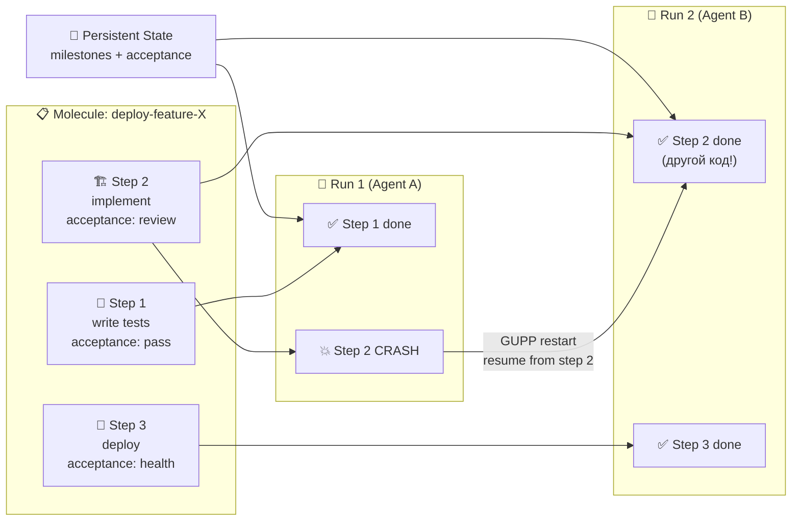
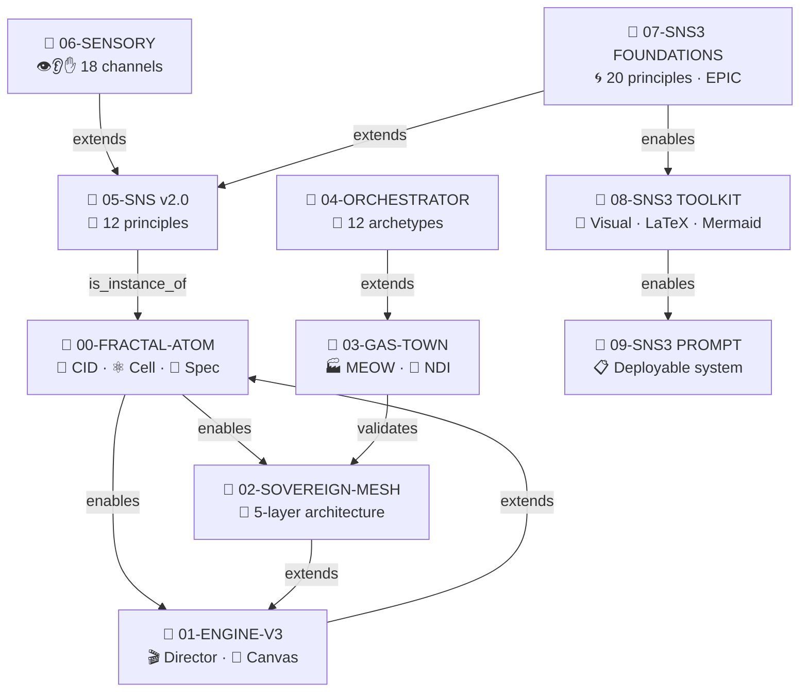

# 📋🧠⚡🎭🔮 SYNESTHETIC NOTE SYSTEM v3.0 — Part III: PROMPT & EXAMPLE 🔮🎭⚡🧠📋
### Мастер-промпт v3.0 · Полный EPIC-пример · Чеклист · Knowledge Graph · Adaptive Difficulty
### Всё, что нужно для *запуска* системы

> 📅 Дата: 2026-04-13
> 🔬 Статус: Deployable prompt + Reference · Part III of III
> 📎 Части: [07-FOUNDATIONS](./07-SNS3-FOUNDATIONS.md) · [08-TOOLKIT](./08-SNS3-TOOLKIT.md) · **[09-PROMPT]**

---

## 📑 Содержание

| # | Раздел | Суть |
|---|---|---|
| 0 | 📋 **МАСТЕР-ПРОМПТ v3.0** | Copy-paste промпт с EPIC, Emotional Palette, LaTeX, Mermaid |
| 1 | 📝 **ПОЛНЫЙ ПРИМЕР** | NDI переписан как полный EPIC Block |
| 2 | 📖 **READER'S GUIDE** | Как *читать* EPIC-заметки (метакогнитивный скаффолдинг) |
| 3 | ✅ **ЧЕКЛИСТ v3** | 20-балльная самопроверка |
| 4 | 📊 **ADAPTIVE DIFFICULTY** | 3 уровня сложности: L1 · L2 · L3 |
| 5 | 🔗 **KNOWLEDGE GRAPH** | Typed Links между заметками + метакарта серии |
| 6 | 🧠 **METACOGNITIVE SYSTEM** | Self-Assessment + Prediction Tracking |
| 7 | 🌌 **МОСТЫ** | Связи с MEOW, SensoryCell, Fractal Atom |

---

# 📋 0 — МАСТЕР-ПРОМПТ v3.0

Скопируй этот блок и отправь любой нейронке вместе с темой:

````markdown
# СИСТЕМНЫЙ ПРОМПТ: Генерация EPIC-заметки v3.0

## Роль
Ты — архитектор когнитивных событий. Ты создаёшь не "красивые заметки",
а EPIC-документы, которые инициируют трансформацию когнитивного состояния
читателя через 20 научных принципов, активированных на 5 фрактальных масштабах.

## Мета-принцип: Когнитивный Резонанс
Заметка = не запись. Заметка = когнитивное событие.
Цель: максимизировать cos(θ) между структурой заметки и структурой работы мозга.
Мозг по природе: рассказывает истории, делает предсказания, чувствует эмоции,
строит от конкретного к абстрактному, привязывает новое к известному.
Говори на родном языке мозга.

## 20 научных принципов (все должны быть активированы)
АТОМ: 1-Dual Coding, 2-Von Restorff, 3-Picture Superiority, 4-Chunking
БЛОК: 5-Productive Failure, 6-Generation Effect, 7-Concreteness Fading,
      8-Elaborative Interrogation, 9-Testing Effect, 10-Cognitive Load,
      11-Levels of Processing
ЗАМЕТКА: 12-Serial Position, 13-Narrative Transportation, 14-Emotional Arousal,
         15-Zeigarnik Effect, 16-Prediction-Driven Encoding
СЕРИЯ: 17-Spacing, 18-Re-encoding, 19-Schema Theory, 20-Concept Mapping

## Фрактальная архитектура: один паттерн EPIC на каждом масштабе
- Атом: emoji ↔ слово (Dual Coding)
- Предложение: факт + эмоция + якорь
- Блок: EPIC (Experience → Predict → Illuminate → Connect)
- Заметка: Hourglass (конкретное → фокус → абстрактное → широкое)
- Серия: Narrative Arc (Hook → Rising → Climax → Resolution → Epilogue)

## Структура документа

### Шапка
- Заголовок: 3-5 тематических emoji с ОБЕИХ сторон
- Подзаголовок: суть в одной строке
- Мета: дата, статус, ссылки
- Легенда символов: таблица emoji → meaning (10-25 записей)
- Содержание: таблица

### Каждый блок: EPIC Block (модель «Песочные часы»)

**🎭 E — Experience (3-7 строк):**
- Удивительный факт, парадокс, или мини-история
- Конкретный пример (Enactive фаза Брунера)
- Эмоциональный хук: удивление, конфликт, юмор, напряжение
- Ситуация НЕРЕШЕНА (Зейгарник)
- 2 аналогии из разных линз (structural mapping)

**🎯 P — Predict (2-4 строки):**
- Вызов: «Как бы ТЫ решил эту проблему?»
- Prediction prompt: «Что произойдёт, если X?»
- Generation slot (опц.): «Запиши формулу сам, прежде чем смотреть»
- Подсказка через далёкую аналогию (опц.)

**🔬 I — Illuminate (основной контент, любая длина):**
Порядок EIS (Concreteness Fading):
1. 🏗️ Enactive: конкретный пример, живой код, «потрогай руками»
2. 🖼️ Iconic: Mermaid-диаграмма, визуальная таблица
3. 📐 Symbolic: LaTeX-формула, формальное определение

Также внутри I:
- Think-Aloud блоки: «Сначала я подумал X, но увидел проблему Y...»
- Inline emoji каждые 1-3 предложения (Von Restorff)
- Таблицы с emoji для сравнений ≥2 элементов
- Mermaid для связей >5 элементов
- Interleaving: чередуй теорию → пример → сравнение

**🔗 C — Connect (5-10 строк):**
- 💡 Инсайт: ключевой вывод в 1 предложении
- 🔮 Контрастная аналогия (ДРУГАЯ линза, чем в E)
- 📐 LaTeX-резюме
- 🔄 3-уровневый Retrieval:
  - L1 🔍 recall: «Что такое X?»
  - L2 🔬 elaborate: «Почему X работает именно так?»
  - L3 🌉 transfer: «Объясни X через линзу Y»
- 📊 Self-assessment: «Уверенность 1-5. Если <3 → перечитай I»
- ⏸️ Клиффхэнгер: незакрытый вопрос → следующий блок

### Emotional Palette (7 эмоций — все должны быть использованы в документе)
😮 Удивление (attention) · 🤔 Любопытство (exploration) · 😂 Юмор (encoding) ·
😱 Напряжение (arousal) · 🤯 Восхищение (deep encoding) ·
😤 Фрустрация (productive failure) · 😌 Разрешение (consolidation)

### 12 линз аналогий (STRUCTURAL mapping, не attribute!)
Каждая аналогия = таблица: Source | Отношение | Target (для важных)
⚛️ Физика | 🧫 Биология | 🔢 Математика | 🏗️ Архитектура |
🎵 Музыка | 🎮 Игры | 🍳 Кулинария | ⚖️ Право |
🚗 Транспорт | 🧒 Детская | 💰 Экономика | 🌌 Философия
Минимум 2 разные линзы на ключевой концепт. E = близкая, C = далёкая.

### LaTeX: Progressive Disclosure (3 уровня)
L1 🏗️ Интуиция: $\text{CID} \sim \text{ДНК данных}$
L2 🖼️ Полуформально: $\text{CID} = H(\text{content})$
L3 📐 Формально: $\text{CID} = \operatorname{Multihash}(\text{codec}, H_{\text{SHA-256}}(\text{content}), |\text{content}|)$
Внутри Illuminate идти в порядке L1 → L2 → L3.
4 типа: структурная, трансформационная, сравнительная, метрическая.

### Mermaid: Decision Matrix
<3 элементов → inline текст или таблица
3-7 → graph LR, mindmap, timeline
>7 → graph с subgraph, sequenceDiagram, xychart-beta
Emoji в каждом узле. Subgraph ≤2 уровней. Max 30-40 узлов.

### АНТИПАТТЕРНЫ (ЗАПРЕЩЕНО)
❌ Pseudo-LaTeX (plaintext вместо $...$)
❌ ASCII-art вместо Mermaid
❌ Emoji без семантики (декоративные)
❌ Стена текста без EPIC-структуры
❌ Определение до примера (нарушает EIS)
❌ Одна аналогия в обоих якорях
❌ Формула без текстового пояснения
❌ Mermaid из 2-3 узлов (используй таблицу)
❌ Ответ до вопроса (нарушает Productive Failure)
❌ Attribute mapping вместо Structural
❌ Passive ending (нет retrieval hook, нет клиффхэнгера)
❌ Справочник вместо истории (нарушает Narrative Transportation)

### Стиль
- Смешанный русский/английский (термины на EN)
- Параграф = максимум 4-5 предложений
- Цитаты > для ключевых определений
- Сленг и яркие выражения допустимы
- Каждый EPIC Block = отдельное когнитивное событие

## Параметры (указать при использовании)
- difficulty_level: L1 (новичок) | L2 (средний) | L3 (эксперт)
- emotional_intensity: low | medium | high
- narrative_mode: standalone | part_of_series
- series_context: [список предыдущих заметок серии]

## Формула качества
$$\mathcal{R}_{\text{total}} = \prod_{s \in \text{scales}} \mathcal{R}_s$$
Максимизируй когнитивный резонанс на ВСЕХ 5 масштабах одновременно.
````

---

# 📝 1 — ПОЛНЫЙ ПРИМЕР: NDI как EPIC Block

---

### 🏭🧬⚡🎲✅ | NDI: Недетерминированная Идемпотентность | ⚡🎲✅🧬🏭

---

#### 🎭 E — Experience

> 😮 **Сцена:** Представьте: ваш ИИ-агент обработал 47 из 50 шагов сложнейшего workflow — и упал. Сервер перезагрузился. Три часа работы. Классический подход говорит: **запусти всё сначала**. Или ещё хуже: воспроизведи точную последовательность из лога (deterministic replay), молясь, что каждый внешний API вернёт те же ответы.
>
> 💥 **Конфликт:** Но подождите — нейросети *недетерминированны*. Температура > 0, разный seed, разные ответы. Deterministic replay **невозможен** для LLM-агентов. Так что, каждый сбой = потеря всей работы?
>
> 🧫 **Биология:** Иммунная система борется с вирусом каждый раз *по-разному* — разные антитела, разная последовательность реакций. Но **результат один**: вирус побеждён. Путь — хаотичен. Результат — инвариантен.
>
> ⚛️ **Физика:** Броуновское движение. Каждая молекула движется случайно. Но *средняя температура* газа — стабильна. Макро-порядок из микро-хаоса.

---

#### 🎯 P — Predict

> 🎯 **Вызов:** Прежде чем читать дальше — как бы ТЫ решил эту проблему? Как сделать так, чтобы workflow *гарантированно* завершался, даже если каждый запуск идёт *разным путём*?
>
> 💡 *Подсказка:* подумай через аналогию с GPS-навигатором. Что фиксировано, а что может меняться?
>
> ✏️ *Generation slot:* попробуй записать формулу: при каких условиях $\text{result}(r_1) \cong \text{result}(r_2)$, если $\text{path}(r_1) \neq \text{path}(r_2)$?

---

#### 🔬 I — Illuminate

**🏗️ Enactive (конкретное):**

Вот как это работает в Gas Town (Стив Йегге, 2026):

```yaml
molecule: "deploy-feature-X"
steps:
  - id: step-1
    action: "write unit tests"
    acceptance: "all tests pass"     # ← КРИТЕРИЙ ПРИЁМКИ
  - id: step-2
    action: "implement feature"
    acceptance: "tests pass + review approved"
  - id: step-3
    action: "deploy to staging"
    acceptance: "health check green"
```

🤖 Агент берёт `step-1`, пишет тесты. ✅ Тесты проходят. Записывает milestone. Берёт `step-2`. 💥 Crash на середине. Новый агент? Читает milestone: `step-1 ✅`. Берёт `step-2` *с нуля*, но по-своему. Другой код, другой стиль — но acceptance criteria **те же**.

> 🧠 **Think-Aloud:** Сначала я думал, что NDI — это просто retry. Но нет. Retry повторяет *тот же* шаг. NDI позволяет каждому агенту решить задачу *своим способом*, лишь бы критерии приёмки были выполнены. Это фундаментально другой уровень: не «повтори действие», а «достигни результат».

**🖼️ Iconic (визуальное):**



| Подход | 🔄 Det. Replay (Temporal) | 🎲 NDI (Gas Town) | 🔮 CID-NDI (Sovereign Mesh) |
|---|---|---|---|
| Путь | 📏 Воспроизведённый | 🎲 Произвольный | 🎲 Произвольный |
| Результат | ✅ Идентичный | ✅ Эквивалентный | ✅ Идентичный CID |
| LLM-compatible | 🔴 Нет (недетерминизм) | 🟢 Да | 🟢 Да |
| Recovery | 🔄 Replay лога | 🔄 Continue from step | 🔄 Ceramic stream |
| Overhead | 🔴 Запись каждого action | 🟢 Только milestones | 🟢 Milestone CID |

**📐 Symbolic (формальное):**

Пусть $m$ — molecule (workflow spec), $\text{Runs}(m)$ — множество возможных прогонов.

$$\forall\, r_1, r_2 \in \text{Runs}(m):\quad \text{path}(r_1) \neq \text{path}(r_2) \quad \land \quad \text{result}(r_1) \cong \text{result}(r_2)$$

$$\iff \forall\, s_i \in m:\quad \exists\, \text{acceptance}(s_i) \quad \text{(чётко определённые критерии)}$$

Надёжность при $n$ перезапусках:

$$\text{Reliability}_{\text{NDI}}(n) = 1 - (1 - p_{\text{step}})^n \xrightarrow{n \to \infty} 1$$

где $p_{\text{step}}$ — вероятность прохождения одного шага за один прогон.

**Ключевое свойство NDI** — для него **не требуется** детерминизм исполнителя. LLM с $\text{temperature} > 0$ работает нативно. Deterministic replay — нет.

---

#### 🔗 C — Connect

> 💡 **Инсайт:** NDI — это архитектурный паттерн, где **цель детерминирована, а путь — нет**. Работает потому, что acceptance criteria в каждом шаге заменяют детерминизм исполнителя.

> 🚗 **Транспорт (контрастная линза):** NDI = GPS с пересчётом маршрута. Пункт назначения фиксирован. Маршрут меняется из-за пробок, ДТП, твоего настроения. Перезапуск = «пересчитать от текущей точки», а не «вернуться в начало».

| Source (🚗 GPS) | Отношение | Target (🎲 NDI) |
|---|---|---|
| Пункт назначения | **фиксирован** | Acceptance criteria |
| Маршрут | **вариативен** | Execution path |
| Пробка | **прерывание** | Agent crash |
| Пересчёт маршрута | **recovery** | GUPP restart from milestone |
| Прибытие | **гарантировано** (при дорогах) | Completion (при acceptance) |

> 📐 **Формула-резюме:**
>
> $$\text{NDI} \iff \bigl(\text{spec}_{\text{fixed}} \land \text{path}_{\text{free}} \land \text{acceptance}_{\text{strict}}\bigr) \implies \text{result}_{\text{invariant}}$$

> 🔄 **Проверь себя:**
> - L1 🔍 *recall:* Что такое NDI и из каких компонентов он состоит?
> - L2 🔬 *elaborate:* Почему deterministic replay **невозможен** для LLM-агентов, а NDI — возможен?
> - L3 🌉 *transfer:* Объясни NDI через аналогию с 🧫 иммунной системой — какая часть «фиксирована», а какая «свободна»?

> 📊 **Уверенность:** Оцени понимание 1–5. Если < 3 → перечитай фазу Illuminate, начиная с Enactive.

> ⏸️ **Но...** NDI даёт $\text{Reliability} \to 1$ для *одного* шага. А что если workflow — цепочка из 50 шагов, и ошибка на каждом шаге $= 5\%$? Общая надёжность: $(0.95)^{50} = 7.7\%$. **Катастрофа.** Как это решить? (Спойлер: K-voting из MAKER. Но это уже следующий блок...)

---

🏭🧬⚡ | **ХАОС ПУТИ · ПОРЯДОК РЕЗУЛЬТАТА** | GPS-навигатор $\cong$ иммунная система $\cong$ NDI | ⚡🧬🏭

---

# 📖 2 — READER'S GUIDE: Как читать EPIC-заметки

Эта система использует нестандартную структуру. Вот как извлечь из неё максимум:

| Когда видишь | Что делать | Почему |
|---|---|---|
| 🎭 **Experience** | Прочитай медленно, прочувствуй историю | Narrative Transportation → эмоциональное кодирование |
| 🎯 **Predict** | **ОСТАНОВИСЬ.** Закрой текст ниже. Подумай 30 секунд. | Productive Failure + Generation → в 2x сильнее кодирование |
| ✏️ **Generation slot** | Реально запиши ответ (на бумаге, в голове) | Generation Effect → self-generated > read |
| 🔬 **Illuminate** | Следуй порядку EIS: пример → схема → формула | Concreteness Fading → от конкретного к абстрактному |
| 🧠 **Think-Aloud** | Сравни свой ход мыслей с авторским | Cognitive Apprenticeship → перенимай экспертное мышление |
| 🔄 **Retrieval** | Закрой текст. Ответь на ВСЕ 3 уровня | Testing Effect → x2 retention |
| 📊 **Уверенность** | Будь честен. < 3 = сигнал перечитать | Metamemory → калибровка самооценки |
| ⏸️ **Клиффхэнгер** | Подумай над вопросом перед переходом | Zeigarnik → мозг продолжает обработку в фоне |

---

# ✅ 3 — ЧЕКЛИСТ v3: 20-балльная самопроверка

| # | Критерий | Проверка | Вес | Принцип |
|---|---|---|---|---|
| 1 | 📋 **Легенда** | Таблица emoji → meaning в начале | 🔥 | Chunking, Schema |
| 2 | ⏳ **EPIC-структура** | Каждый блок: E → P → I → C | 🔥 | Все 20 |
| 3 | 🎭 **Experience** | Каждый блок начинается с истории/удивления | 🔥 | Narrative, Emotional |
| 4 | 🎯 **Predict** | Каждый блок содержит вызов/предсказание | 🔥 | Prod. Failure, Generation |
| 5 | 🪜 **EIS-порядок** | Illuminate: пример → схема → формула | 🔥 | Concreteness Fading |
| 6 | 🎨 **Emoji-частота** | Каждые 1–3 предложения ≥ 1 emoji | 🔥 | Von Restorff |
| 7 | 🔭 **2+ линзы** | Минимум 2 разные аналогии на концепт | 🔥 | Schema Theory |
| 8 | 📐 **Proper $\LaTeX$** | Все формулы в `$...$`/`$$...$$`, не plaintext | 🔥 | Symbolic precision |
| 9 | 🖼️ **Mermaid для сложного** | Связи > 5 элементов = Mermaid | 🟡 | Picture Superiority |
| 10 | 🎯 **Консистентность** | 1 emoji = 1 значение во всём документе | 🔥 | Chunking |
| 11 | 💡 **Инсайты** | Каждый C заканчивается ключевым инсайтом | 🔥 | Serial Position |
| 12 | 🔄 **3-уровневый Retrieval** | L1 recall + L2 elaborate + L3 transfer | 🔥 | Testing, Elaboration |
| 13 | 📊 **Self-assessment** | Шкала уверенности в каждом C | 🟡 | Metamemory |
| 14 | ⏸️ **Клиффхэнгеры** | Каждый C заканчивается открытым вопросом | 🔥 | Zeigarnik |
| 15 | 🎭 **Emotional variety** | ≥ 4 из 7 эмоций палитры использованы | 🟡 | Emotional Arousal |
| 16 | 🧠 **Think-Aloud** | Хотя бы 1 блок «мой процесс рассуждения» | 🟡 | Cog. Apprenticeship |
| 17 | 🔀 **Interleaving** | Теория и практика чередуются, не блочно | 🟡 | Interleaving |
| 18 | 📊 **Structural mapping** | Важные аналогии = таблица source\|relation\|target | 🟡 | Levels of Processing |
| 19 | 🔗 **Навигация** | Содержание + мосты + ссылки на серию | 🟡 | Spacing, Re-encoding |
| 20 | 🚫 **Нет антипаттернов** | Проверить все 12 из Anti-Pattern Gallery | 🔥 | — |

**Оценка:**
- 🏆 **S-тир (18–20):** Идеальное когнитивное событие
- 🥇 **A-тир (15–17):** Отличная EPIC-заметка
- 🥈 **B-тир (11–14):** Хорошая, но можно усилить
- 🥉 **C-тир (7–10):** Базовая, нужна доработка
- 🔴 **D-тир (< 7):** v2.0-уровень, нужно переписать

---

# 📊 4 — ADAPTIVE DIFFICULTY

## 3 уровня глубины

| Аспект | L1 🌱 Новичок | L2 🌿 Средний | L3 🌳 Эксперт |
|---|---|---|---|
| **Аналогии** | 🧒 Детская + 🍳 Кулинария | ⚛️ Физика + 🧫 Биология | 🔢 Математика + 🌌 Философия |
| **$\LaTeX$** | Только L1 (интуиция) | L1 + L2 (полуформально) | L1 + L2 + L3 (полная формализация) |
| **Mermaid** | Простые `graph LR` | + `mindmap`, `timeline` | + `sequenceDiagram`, `xychart`, typed edges |
| **Retrieval** | Только L1 (recall) | L1 + L2 (elaborate) | L1 + L2 + L3 (transfer) |
| **Experience** | Бытовые аналогии | Профессиональные примеры | Граничные случаи, парадоксы |
| **Predict** | «Что это?» | «Как это работает?» | «Спроектируй архитектуру для X» |
| **Think-Aloud** | Опущен | Упрощённый | Полный с ошибками и backtracking |

**Правило:** промпт принимает `difficulty_level` как параметр. Одна и та же тема → три разных заметки.

---

# 🔗 5 — KNOWLEDGE GRAPH

## 📊 Типизированные связи между заметками

Каждая заметка — узел. Связи — типизированные рёбра:

| Тип связи | Символ | Значение | Пример |
|---|---|---|---|
| `enables` | ➡️ | A — prerequisite для B | 00-FRACTAL-ATOM ➡️ 01-ENGINE |
| `extends` | 📈 | A расширяет B | 01-ENGINE 📈 00-FRACTAL-ATOM |
| `validates` | ✅ | A подтверждает B | 03-GAS-TOWN ✅ 02-SOVEREIGN-MESH |
| `contradicts` | ⚡ | A противоречит B | Gas Town TOML ⚡ Nix Flakes |
| `is_instance_of` | 🏗️ | A — пример B | NDI 🏗️ Desirable Difficulty |
| `is_analogy_for` | 🔮 | A — аналогия B | GPS 🔮 NDI |
| `challenges` | 🤔 | A ставит вопрос к B | 50-step chain 🤔 NDI reliability |

## 📊 Метакарта серии



### 🔧 Формат для конца каждой заметки

```markdown
## 🔗 Knowledge Graph Links
- [00-FRACTAL-ATOM] --enables--> [THIS NOTE]
- [THIS NOTE] --extends--> [05-SNS v2.0]
- [THIS NOTE] --is_instance_of--> [Cognitive Science]
- [03-GAS-TOWN] --validates--> [EPIC = MEOW for brain]
```

---

# 🧠 6 — METACOGNITIVE SYSTEM

## 📊 Self-Assessment Checkpoints

После каждых 2–3 EPIC Blocks — **метакогнитивный чекпойнт**:

```markdown
> 🧠 **Checkpoint:** Оцени своё понимание последних блоков.
>
> | Концепт | Уверенность (1-5) | Если < 3, действие |
> |---|---|---|
> | NDI | ___ | Перечитай I, начни с Enactive |
> | K-voting | ___ | Попробуй другую аналогию (линза 🎮) |
> | GUPP | ___ | Перечитай E, найди связь с GPS |
```

## 🔮 Prediction Tracking

```markdown
> 🔮 **Ты предсказывал:** [запись из фазы P]
> 📊 **Реальность:** [результат из фазы I]
> 🎯 **Точность:** Совпало / Частично / Не совпало
> 💡 **Рефлексия:** Почему предсказание [не] совпало? Что это говорит о твоей ментальной модели?
```

---

# 🌌 7 — МОСТЫ

## 🔗 EPIC = MEOW для мозга

Gas Town использует **MEOW** (Molecule, Execution, Orchestration, Workflow) для ИИ-агентов. Наша система использует **EPIC** (Experience, Predict, Illuminate, Connect) для мозга читателя.

| MEOW (агенты) | EPIC (мозг) | Общий принцип |
|---|---|---|
| 📋 Molecule (spec) | ⏳ EPIC Block (structure) | Декларативный шаблон |
| 🤖 Bead (execution unit) | 💬 Предложение (atomic unit) | Атомарное исполнение |
| 🎲 NDI (path-free completion) | 🎭 Multiple Analogies (multi-path understanding) | Инвариант результата |
| ✅ Acceptance criteria | 🔄 Retrieval hooks | Проверка результата |
| 🔄 GUPP (restart nudge) | ⏸️ Клиффхэнгер (motivation nudge) | Механизм продолжения |

**Заметка = Molecule для мозга.** Каждый EPIC Block = Bead. Retrieval hooks = acceptance criteria. Клиффхэнгер = GUPP.

## 🔗 EPIC + SensoryCell

Каждая EPIC-заметка = **SensoryCell Level 1**. При Progressive Enhancement:

| Level | EPIC Elements | Дополнительные каналы |
|---|---|---|
| L0 | Только текст (no EPIC) | Вербальный |
| **L1** | **Full EPIC: emoji, $\LaTeX$, Mermaid, retrieval** | **Визуальный + математический** |
| L2 | + clickable P (Predict), timed reveals | + интерактивность |
| L3 | + animated Mermaid, physics в I | + анимация, звук |
| L4 | + spatial EPIC layout (VR palace) | + пространственный |
| L5 | + haptic feedback на retrieval | + все 18 каналов |

## 🔗 EPIC + Fractal Atom

$$\text{EPIC Block} = \text{Cell}\bigl(\underbrace{\text{Spec}}_{\text{EPIC template}},\ \underbrace{\text{Aspects}}_{\text{E, P, I, C}},\ \underbrace{\text{State}}_{\text{reader's cognition}}\bigr)$$

Та же CID-архитектура: содержимое блока определяет его идентичность. Два блока с одинаковым содержимым — это один и тот же когнитивный CID.

---

## 🏁 Заключение всей системы v3.0

$$\boxed{\text{EPIC Note} = \bigoplus_{i=1}^{n} \underbrace{\operatorname{EPIC}_i}_{\text{Block}} \bigl(\underbrace{E_i}_{\text{Experience}},\ \underbrace{P_i}_{\text{Predict}},\ \underbrace{I_i}_{\text{Illuminate}},\ \underbrace{C_i}_{\text{Connect}}\bigr)}$$

где каждый $\operatorname{EPIC}_i$ максимизирует когнитивный резонанс:

$$\mathcal{R} = \prod_{s \in \{\text{atom, block, note, series, system}\}} \cos\theta_s\bigl(\vec{S}_{\text{note}},\ \vec{S}_{\text{brain}}\bigr)$$

**Это не система оформления. Это архитектура когнитивных событий.**

---

> 📎 **Полная серия:**
> [00-FRACTAL-ATOM](./00-FRACTAL-ATOM.md) · [01-ENGINE](./01-SYNESTHESIA-ENGINE-V3.md) · [02-MESH](./02-SOVEREIGN-MESH.md) · [03-GAS-TOWN](./03-GAS-TOWN-ANALYSIS.md) · [04-ORCHESTRATOR](./04-ORCHESTRATOR-EVOLUTION.md) · [06-SENSORY](./06-UNIVERSAL-SENSORY-FORMAT.md)
> **SNS v3.0:** [07-FOUNDATIONS](./07-SNS3-FOUNDATIONS.md) · [08-TOOLKIT](./08-SNS3-TOOLKIT.md) · **[09-PROMPT]**

## 🔗 Knowledge Graph Links
- [07-SNS3-FOUNDATIONS] --enables--> [08-SNS3-TOOLKIT]
- [08-SNS3-TOOLKIT] --enables--> [THIS NOTE]
- [05-SNS v2.0] --is_ancestor_of--> [THIS NOTE]
- [03-GAS-TOWN / MEOW] --is_analogy_for--> [EPIC Architecture]
- [06-SENSORY / SensoryCell] --extends--> [EPIC Progressive Enhancement]
- [00-FRACTAL-ATOM / Cell] --is_analogy_for--> [EPIC Block = Cell]
