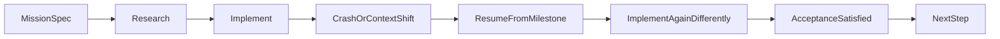

# 🎲✅🧬🚀 NDI для software delivery 🚀🧬✅🎲
### Детерминированная цель, недетерминированный путь

> 📅 Дата: 2026-04-13
> 🔬 Статус: Концептуальное ядро серии
> 📎 Серия: [00-Why](./00-why-the-current-loop-breaks.md) · **[01]** · [02-Formulas-Molecules-Beads](./02-formulas-molecules-beads-for-dev-work.md)
> 📎 Мосты: [03-GAS-TOWN-ANALYSIS](../03-GAS-TOWN-ANALYSIS.md) · [09-SNS3-PROMPT](../09-SNS3-PROMPT.md)

---

## 🗺️ Содержание

| # | Раздел | Суть |
|---|---|---|
| 0 | 🎯 Тезис | Почему delivery не должен опираться на deterministic replay |
| 1 | 🎭 Experience | Интуитивная проблема длинных workflow |
| 2 | 🎯 Predict | Почему обычный retry и обычный CI не решают задачу |
| 3 | 🔬 Illuminate | Формальная модель NDI для разработки |
| 4 | 🔗 Connect | Что меняется в проектировании workflow и acceptance |

---

## 🎯 Тезис

> Автономная разработка не может опираться на идею, что один и тот же агент, в том же контексте, тем же способом воспроизведёт тот же результат.

Для LLM-driven систем это ложная предпосылка:

- агенты недетерминированы
- внешние сервисы недетерминированы
- ветка репозитория движется
- соседние фичи влияют на интеграцию
- окружения живут и дрейфуют

Значит, базовый вопрос должен быть не:

> “Как повторить ровно те же действия?”

А другой:

> “Как гарантировать достижение результата, даже если путь к нему разный?”

Это и есть **NDI для software delivery**.

---

## 🎭 1 — Experience

> 😮 Представь: агент уже исследовал код, написал часть реализации, поднял preview env, прогнал integration-тесты и почти готов отправить всё в merge queue. В этот момент один из специализированных агентов падает, preview удаляется, соседняя фича меняет `main`, а stage успевает обновиться.
>
> Классический ответ звучит так: “Ну, запустим весь pipeline заново”.
>
> Но это не решение. Это признание того, что система не умеет **продолжать**, а умеет только **повторять**.

### 🚗 Транспортная линза

NDI похож на GPS:

- пункт назначения фиксирован
- маршрут может быть любым
- авария на дороге не требует вернуться домой
- система просто перестраивает оставшийся путь

### 🧫 Биологическая линза

Иммунная система не воспроизводит одну и ту же микропоследовательность действий каждый раз. Но критерий успешности фиксирован:

- патоген подавлен
- организм выжил

Путь вариативен. Инвариант результата строгий.

---

## 🎯 2 — Predict

> 🎯 Вопрос: почему обычные retry, CI reruns и “пересоздай ветку от main” не решают проблему автономной разработки?

Подумай до чтения дальше:

- что именно повторяет retry?
- что именно теряется между итерациями?
- почему повторение шага не равно гарантии completion?

> 💡 Подсказка: сравни “повтори действие” и “достигни acceptance criteria”.

---

## 🔬 3 — Illuminate

## 3.1 Что такое NDI в delivery

NDI в контексте software delivery:

> Каждый шаг workflow может выполняться разными агентами, в разном контексте, разными способами, но считается завершённым только тогда, когда выполнены его acceptance criteria и собран требуемый evidence bundle.

### 🏗️ Enactive

Представим workflow:

```yaml
mission: "ship feature X"
steps:
  - id: research
    acceptance: "affected modules mapped + risk memo emitted"
  - id: implement
    acceptance: "code compiles + focused tests green"
  - id: integrate
    acceptance: "merge candidate compatible with queued changes"
  - id: verify
    acceptance: "verification lattice required gates passed"
  - id: promote_stage
    acceptance: "stage health green + rollout checks satisfied"
```

Если `implement` был начат одним агентом, а затем подхвачен другим, это не должно ломать workflow. Новый агент не обязан повторить те же рассуждения или написать тот же код. Он обязан только **достичь того же acceptance state**.

### 🖼️ Iconic



### 📐 Symbolic

Пусть:

- $m$ — molecule
- $s_i$ — шаг внутри molecule
- $\text{Runs}(s_i)$ — множество возможных исполнений шага
- $A_i$ — acceptance criteria шага
- $E_i$ — evidence bundle шага

Тогда шаг считается завершённым, если:

$$\exists r \in \text{Runs}(s_i): \quad A_i(r) = \text{true} \land E_i(r) \supseteq E_i^{\text{required}}$$

А вся molecule считается завершённой, если:

$$\forall s_i \in m:\ \exists r_i \in \text{Runs}(s_i)\ \text{such that}\ A_i(r_i)=\text{true}$$

Ключевой сдвиг:

$$\text{path}(r_1) \neq \text{path}(r_2) \quad \text{вполне допустимо}$$

если при этом:

$$\text{acceptance}(r_1) \cong \text{acceptance}(r_2)$$

## 3.2 Чем NDI не является

| Подход | Что фиксирует | Почему недостаточно |
|---|---|---|
| 🔄 Retry | Повтор того же шага | Не меняет стратегию и не использует новый контекст |
| 📼 Deterministic replay | Точный путь | Плохо сочетается с LLM и живой системой |
| ✅ CI rerun | Повтор проверки | Не решает проблему самого workflow |
| 🎲 NDI | Инвариант результата | Позволяет перезапуск, смену агента и смену пути |

## 3.3 Почему это особенно важно для LLM-систем

LLM-driven engineering почти всегда имеет:

- разный reasoning path
- разные декомпозиции
- разные candidate implementation branches
- разные intermediate artifacts

Попытка заставить всё это быть строго replayable противоречит самой природе системы.

Зато можно жёстко фиксировать:

- step contract
- acceptance criteria
- required evidence
- escalation policy
- mutation budget

То есть детерминировать **контур успеха**, а не **траекторию мышления**.

## 3.4 NDI и длинные цепочки

Есть важное ограничение.

Даже если вероятность успешного прохождения одного шага высока, длинные molecules деградируют:

$$P(\text{all success}) = \prod_{i=1}^{n} p_i$$

Если для простоты:

$$p_i = 0.95,\ n=50 \Rightarrow 0.95^{50} \approx 0.077$$

То есть без дополнительных механизмов длинные workflow разваливаются.

Значит, NDI недостаточно сам по себе. Ему нужны:

- атомизация шагов
- supervisor / witness
- evidence checkpoints
- K-voting или best-of-N на рискованных шагах
- selective re-execution вместо полного restart

---

## 🔗 4 — Connect

> 💡 Инсайт: NDI переводит software delivery из режима “повтори тот же процесс” в режим “достигни тот же acceptance state”.

### ⚖️ Контрастная аналогия

Право:

- важен не буквальный маршрут чиновника по коридорам
- важна юридическая валидность решения и следы его принятия

NDI делает то же для engineering:

- не путь действий
- а валидный результат + доказательства

### 📐 Формула-резюме

$$\text{NDI}_{\text{delivery}} \iff \bigl(\text{goal}_{\text{fixed}} \land \text{path}_{\text{free}} \land \text{acceptance}_{\text{strict}} \land \text{evidence}_{\text{required}}\bigr)$$

### 🔄 Проверь себя

- L1 🔍 recall: Что именно фиксирует NDI в software delivery?
- L2 🔬 elaborate: Почему deterministic replay плохо подходит для LLM-driven engineering?
- L3 🌉 transfer: Объясни NDI через GPS или иммунную систему. Что там является acceptance criteria?

### ⏸️ Но...

Если NDI — это принцип надёжности, то где физически хранится структура работы? Что именно инстанцируется, перезапускается и продолжается?

Ответ: **Formula -> Molecule -> Beads**.

---

## 🔗 Knowledge Graph Links

- [00-Why the current loop breaks](./00-why-the-current-loop-breaks.md) --enables--> [This Note]
- [03-GAS-TOWN-ANALYSIS](../03-GAS-TOWN-ANALYSIS.md) --validates--> [NDI for software delivery]
- [This Note] --enables--> [02-Formulas-Molecules-Beads for dev work]
