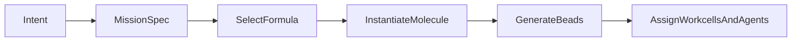
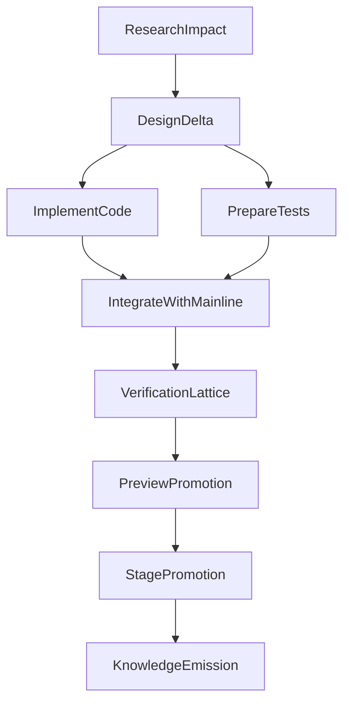

# 📋🧬🧵⚙️ Formula -> Molecule -> Beads для dev-work ⚙️🧵🧬📋
### Новая единица работы для автономной разработки

> 📅 Дата: 2026-04-13
> 🔬 Статус: Архитектурная заметка
> 📎 Серия: [01-NDI](./01-ndi-for-software-delivery.md) · **[02]** · [03-Agent-Roles-A2A-MCP](./03-agent-roles-a2a-and-mcp.md)
> 📎 Мосты: [03-GAS-TOWN-ANALYSIS](../03-GAS-TOWN-ANALYSIS.md) · [02-SOVEREIGN-MESH](../02-SOVEREIGN-MESH.md)

---

## 🗺️ Содержание

| # | Раздел | Суть |
|---|---|---|
| 0 | 🎯 Тезис | Почему workflow должен быть компилируемой сущностью |
| 1 | 🧱 Словарь сущностей | `intent`, `mission spec`, `formula`, `molecule`, `bead` |
| 2 | 🔬 Компиляция | Как из пожелания рождается исполнимый граф |
| 3 | 📦 Типы beads | Исследование, код, тест, интеграция, knowledge |
| 4 | 📐 Контракты | Acceptance, evidence, escalation, rollback |

---

## 🎯 Тезис

> Автономная разработка начинается в тот момент, когда workflow перестаёт быть традицией команды и становится структурой данных.

Пока процесс живёт только в:

- описании задачи
- привычках людей
- чеклистах в головах
- наборе разрозненных CI-джоб

никакой настоящий autonomy невозможен.

Появляется только assistive automation.

Чтобы появилась оркестрация, нужна новая цепочка:

$$\text{intent} \to \text{mission spec} \to \text{formula} \to \text{molecule} \to \text{beads}$$

---

## 🧱 1 — Словарь сущностей

| Сущность | Роль | Короткое определение |
|---|---|---|
| 🎯 `intent` | Вход | Намерение человека или агента: что нужно и зачем |
| 📄 `mission spec` | Нормализация | Структурированный контракт на работу |
| 📋 `formula` | Шаблон | Декларативная схема workflow данного класса |
| 🧬 `molecule` | Исполнение | Конкретный граф шагов для этой mission |
| 🧵 `bead` | Атом | Минимальная единица работы с acceptance criteria |
| 📦 `artifact` | Выход | Любой результат шага: diff, memo, image, schema, report |
| 🧾 `evidence bundle` | Доказательство | Комплект проверок и артефактов, подтверждающий bead |
| 🧫 `workcell` | Среда | Изолированное место, где bead выполняется |
| 🚦 `promotion` | Продвижение | Разрешённый переход изменения на следующий уровень среды |

## 1.1 Intent

Intent ещё не workflow. Он выглядит примерно так:

- “Добавь поддержку X”
- “Исправь деградацию latency”
- “Переосмысли весь цикл разработки”

Он полезен как человеческий вход, но слишком неопределённый для swarm-исполнения.

## 1.2 Mission spec

Mission spec уже пригоден для компиляции. Он должен явно содержать:

- цель
- границы
- affected systems
- risk class
- required environments
- acceptance gates
- rollout policy
- human approvals

## 1.3 Formula

Formula — это не конкретная работа, а **тип workflow**.

Например:

- feature delivery
- bug investigation
- migration
- architectural refactor
- release hardening
- postmortem remediation

Formula отвечает на вопрос:

> Какого рода molecule нужно породить для данного класса задач?

## 1.4 Molecule

Molecule — это уже конкретная инстанция workflow под конкретную mission.

В ней появляются:

- конкретные beads
- зависимости между ними
- параллельные ветки
- точки слияния
- required evidence
- recovery semantics

## 1.5 Bead

Bead — минимальный шаг, который можно:

- отдать одному агенту
- выполнить в одном workcell
- перезапустить отдельно
- проверить отдельно
- задокументировать отдельно

Если шаг слишком большой, чтобы это сделать, значит это не bead.

---

## 🔬 2 — Компиляция

## 2.1 От input к execution graph



## 2.2 Пример mission spec

```yaml
mission_id: ms-feature-telegram-source
intent: "Добавить новый тип источника и довести до stage"
risk_class: medium
affected_systems:
  - backend
  - bot
  - database
required_environments:
  - local_sandbox
  - preview_env
  - shared_stage
acceptance_gates:
  - api_contract_green
  - migration_safe
  - browser_flow_green
  - stage_health_green
human_approvals:
  - architecture_if_schema_changes
  - product_if_ui_changes
rollout_policy:
  strategy: stage_then_manual_promote
```

## 2.3 Пример formula

```yaml
formula: feature_delivery_v1
phases:
  - research
  - design
  - implement
  - integrate
  - verify
  - promote
  - chronicle
rules:
  if risk_class == high:
    add:
      - chaos_validation
      - load_validation
      - extra_human_gate
  if affected_systems includes database:
    add:
      - migration_review
      - ephemeral_data_twin
```

## 2.4 Пример molecule



---

## 📦 3 — Типы beads

### 📊 Базовая таксономия

| Тип bead | Что делает | Типичный workcell |
|---|---|---|
| 🔍 `research` | Исследует код, историю, внешние источники | readonly worktree + docs fetch |
| 🧠 `design` | Формирует delta-дизайн и ограничения | spec workspace |
| 🏗️ `build` | Пишет код, миграции, инфраструктуру | isolated git worktree |
| 🧪 `test` | Пишет или обновляет проверки | test worktree |
| 🔗 `integrate` | Проверяет совместимость с текущим mainline | merge candidate env |
| 🌐 `simulate` | Поднимает preview/simulacrum | ephemeral env |
| 📈 `load` | Гоняет нагрузку и performance assertions | load arena |
| ⚡ `chaos` | Проверяет устойчивость к сбоям | chaos sandbox |
| 👀 `review` | Дает вердикт по качеству и рискам | review context |
| 🧾 `chronicle` | Пишет Huly/PR/ADR/KB артефакты | knowledge workspace |
| 🚀 `promote` | Выполняет controlled promotion | deploy pipeline |

### 💡 Правило гранулярности

Хороший bead:

- выполняется за ограниченное время
- имеет один главный результат
- имеет явный вход
- имеет явный выход
- имеет однозначную проверку завершения

Плохой bead:

- “исследуй, спроектируй, реализуй и задокументируй всё”

Это уже molecule, а не bead.

---

## 📐 4 — Контракты bead

Каждый bead должен иметь четыре обязательных поля:

| Поле | Что означает |
|---|---|
| ✅ `acceptance` | Когда bead считается успешно завершённым |
| 📦 `required_artifacts` | Какие артефакты он обязан произвести |
| 🚫 `escalation_policy` | Когда и кому он обязан передать проблему выше |
| 🔄 `recovery_policy` | Как bead продолжает работу после crash / timeout / context shift |

## 4.1 Acceptance

Acceptance нельзя писать в стиле:

- “сделать нормально”
- “чтобы всё работало”

Acceptance должен быть проверяемым:

- `tests pass`
- `route contract unchanged`
- `load p95 < 220ms`
- `preview smoke green`
- `migration reversible on twin`

## 4.2 Evidence bundle

NDI без evidence опасен. Поэтому bead обязан оставлять следы.

Минимальный evidence bundle может включать:

- diff summary
- logs / traces
- test verdicts
- screenshots / HAR / browser traces
- benchmark metrics
- structured reasoning summary

## 4.3 Escalation

Bead обязан знать, когда не продолжать автономно.

Примеры escalation triggers:

- архитектурный конфликт
- schema ambiguity
- contradictory product requirements
- repeated verifier disagreement
- unsafe production promotion

## 4.4 Recovery

Recovery semantics должны быть разными для разных bead types:

| Тип bead | Recovery |
|---|---|
| research | перечитать контекст и продолжить |
| build | подхватить последний accepted diff или начать заново |
| integrate | пересобрать merge candidate на свежем mainline |
| simulate | пересоздать workcell из шаблона |
| chronicle | восстановить событие из evidence bundle |

---

## 🏁 Итог

> Как только workflow становится компилируемой структурой, orchestration перестаёт быть магией и превращается в инженерную задачу.

Теперь можно строить следующий слой:

- какие именно агенты будут взаимодействовать
- где кончается orchestration и начинается tools layer
- почему A2A и MCP должны быть разведены

---

## 🔗 Knowledge Graph Links

- [01-NDI for software delivery](./01-ndi-for-software-delivery.md) --enables--> [This Note]
- [03-GAS-TOWN-ANALYSIS](../03-GAS-TOWN-ANALYSIS.md) --validates--> [Formula -> Molecule -> Beads pattern]
- [02-SOVEREIGN-MESH](../02-SOVEREIGN-MESH.md) --extends--> [Mission compilation into execution graph]
- [This Note] --enables--> [03-Agent roles, A2A and MCP]
