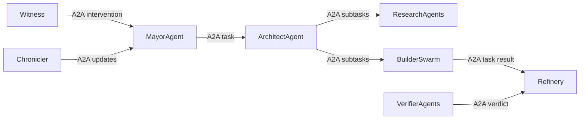

# 🤖🧭🔌🌐 Роли агентов, A2A и MCP 🌐🔌🧭🤖
### Кто думает, кто делает, кто наблюдает, и как они общаются

> 📅 Дата: 2026-04-13
> 🔬 Статус: Оркестрационная заметка
> 📎 Серия: [02-Formulas-Molecules-Beads](./02-formulas-molecules-beads-for-dev-work.md) · **[03]** · [04-Dynamic-Simulacra](./04-dynamic-simulacra-and-ephemeral-envs.md)
> 📎 Внешняя опора: [Agent2Agent (A2A) Protocol Specification](https://a2a-protocol.org/latest/specification/)

---

## 🎯 Тезис

> Автономная система разработки ломается, если смешать две разные проблемы: агент-агент координацию и агент-инструмент доступ.

Их надо развести:

- **A2A** — для взаимодействия агентов друг с другом
- **MCP** — для доступа агентов к инструментам, данным и действиям

Это фундаментально разные слои.

---

## 🧠 1 — Почему нужен role split

Один “мощный универсальный агент” полезен как director, но плох как вся система целиком.

Почему:

- у него слишком широкий context window burden
- он становится единичной точкой отказа
- ему трудно одновременно быть стратегом, билд-системой, тестером, merge-агентом и хроникёром
- сложно калибровать риск и бюджет

Значит, нужна **role taxonomy**.

---

## 📊 2 — Базовые роли

| Роль | Что делает | Главный output |
|---|---|---|
| 🎩 `Mayor` / `IntentAgent` | принимает intent и формирует mission spec | mission spec |
| 🧭 `Architect` / `Compiler` | раскладывает mission в formula/molecule/beads | executable molecule |
| 🔍 `ResearchAgent` | исследует код, историю, внешние знания | research memo |
| 🏗️ `Builder` | пишет код и конфигурацию | candidate artifact |
| 🧪 `Verifier` | гоняет проверки и собирает evidence | verification verdict |
| 👑 `Witness` / `Supervisor` | следит за liveness и нарушениями | intervention or escalation |
| 🌊 `Refinery` | интегрирует competing outputs и mainline reality | merge candidate |
| 🧾 `Chronicler` | публикует summaries, ADR, Huly/GitHub updates | knowledge artifacts |

## 💡 Ключевой принцип

Каждая роль должна иметь:

- узкую зону ответственности
- небольшой required context
- чёткий вход
- чёткий формат выхода
- понятный escalation path

---

## 🌐 3 — Где A2A

Согласно спецификации A2A, протокол нужен для:

- capability discovery
- task-based collaboration
- async interactions
- streaming updates
- webhook/push notifications для долгих задач

Это идеально ложится на autonomous dev mesh.

### 🖼️ A2A в нашей системе



### 📦 Что именно брать из A2A

| Элемент A2A | Как использовать |
|---|---|
| `Agent Card` | описывать capabilities и policy каждого агента |
| `Task` | атом взаимодействия между агентами |
| `Message` / `Artifact` | передача briefs, verdicts, evidence bundles |
| `Streaming` | живые обновления исполнения beads |
| `Push notifications` | long-running jobs и environment events |

### ⚠️ Важный принцип

A2A не должен переносить “внутренние мысли” агента. Он должен переносить:

- task contract
- required context
- output artifacts
- status transitions

Именно это хорошо согласуется с идеей opaque execution из спецификации A2A.

---

## 🔌 4 — Где MCP

MCP нужен там, где агенту надо:

- читать код
- вызывать shell
- смотреть CI
- общаться с Huly
- деплоить в среду
- читать знания
- дергать observability

То есть MCP — это **tool plane**, не coordination plane.

### 📊 Простая формула

$$\text{A2A} = \text{agent} \leftrightarrow \text{agent}$$

$$\text{MCP} = \text{agent} \leftrightarrow \text{tool/data/system}$$

Если смешать их, получится туманная система, в которой:

- неизвестно, кто владеет задачей
- кто исполняет действие
- где сохраняется workflow state

---

## 🧭 5 — Контракт между ролями

Каждый A2A task между ролями должен содержать как минимум:

```json
{
  "mission_id": "ms-123",
  "molecule_id": "mol-123",
  "bead_id": "bead-7",
  "role": "builder",
  "goal": "implement route contract",
  "acceptance": [
    "focused tests green",
    "contract snapshot updated"
  ],
  "required_artifacts": [
    "diff_summary",
    "test_results"
  ],
  "budget": {
    "time_minutes": 25,
    "parallel_attempts": 3
  },
  "escalate_if": [
    "schema ambiguity",
    "architectural conflict"
  ]
}
```

### 💡 Следствие

Агент перестаёт быть “чёрным ящиком с неясной задачей”.

Он становится исполнителем **task contract**.

---

## 👑 6 — Почему обязательно нужен Witness

Без supervisor-роли swarm быстро уходит в хаос:

- зависшие подзадачи
- бесконечные retries
- агрессивные parallel runs
- несогласованность статусов
- потеря evidence

Witness нужен не для микроменеджмента, а для:

- liveness detection
- stuck detection
- policy enforcement
- escalation orchestration

Это эквивалент ролей `Witness` / `Deacon` / `Supervisor` из твоих исследований про Gas Town и эволюцию оркестраторов.

---

## 🔗 Connect

> 💡 Инсайт: A2A и MCP образуют два ортогональных слоя. Один организует команду агентов, другой даёт ей руки и глаза.

### 🔄 Проверь себя

- L1: Чем отличается A2A от MCP?
- L2: Почему один универсальный агент хуже role split?
- L3: Объясни через аналогию: A2A — это нервная система или почта? MCP — это конечности или инструменты?

### ⏸️ Но...

Если roles уже есть, где именно они работают? В каких средах? И почему одна shared stage недостаточна?

Следующая заметка: **динамические simulacra и ephemeral environments**.

---

## 🔗 Knowledge Graph Links

- [02-Formulas-Molecules-Beads](./02-formulas-molecules-beads-for-dev-work.md) --enables--> [This Note]
- [04-ORCHESTRATOR-EVOLUTION](../04-ORCHESTRATOR-EVOLUTION.md) --validates--> [Role taxonomy]
- [This Note] --enables--> [04-Dynamic simulacra and ephemeral envs]
