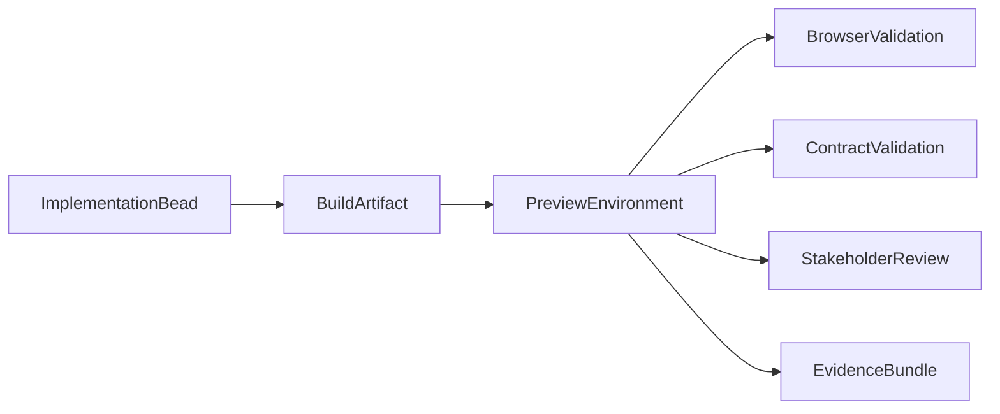

# 🧫🌐🪞⚙️ Динамические simulacra и ephemeral environments ⚙️🪞🌐🧫
### Почему одной stage-среды недостаточно

> 📅 Дата: 2026-04-13
> 🔬 Статус: Environment architecture note
> 📎 Серия: [03-Agent-Roles](./03-agent-roles-a2a-and-mcp.md) · **[04]** · [05-Verification-Lattice](./05-verification-lattice-property-stateful-load-chaos.md)
> 📎 Внешние опоры: [Managing a merge queue](https://docs.github.com/en/repositories/configuring-branches-and-merges-in-your-repository/configuring-pull-request-merges/managing-a-merge-queue) · [Preview environments guide](https://www.signadot.com/articles/comprehensive-guide-to-preview-environments/)

---

## 🎯 Тезис

> Общая stage-среда полезна как поздняя интеграционная арена, но катастрофически плоха как единственная среда проверки.

Она создаёт:

- очередь
- смешение изменений
- дрейф
- неясный root cause
- низкую воспроизводимость

Значит, autonomous dev mesh должен уметь **синтезировать разные simulacra среды под разные beads и molecules**.

---

## 🪞 1 — Что такое simulacrum

Simulacrum — это не просто “ещё один environment”.

Это **целенаправленно собранный двойник части реальности**, достаточный для конкретного типа проверки.

### 📊 Типы simulacra

| Тип | Что моделирует | Зачем нужен |
|---|---|---|
| 🧱 `local_workcell` | узкий изолированный кусок репо | быстрый build/test loop |
| 🌿 `merge_candidate_env` | ветка + свежий mainline + соседние queued changes | ранняя интеграция |
| 🌐 `preview_env` | production-like slice для PR / molecule | UAT, browser, integration |
| 🗄️ `data_twin` | данные, схемы, миграции | db-safe validation |
| 📡 `service_slice` | subset микросервисов + shared baseline | экономичная интеграция |
| 📈 `load_arena` | среда под нагрузочные профили | performance / SLO |
| ⚡ `chaos_arena` | среда для fault injection | resilience / recovery |
| 🏭 `stage_env` | реалистичная интеграционная среда | финальная pre-prod валидация |

---

## 🌐 2 — Почему preview environments обязательны

Из современных практик видно три устойчивых вывода:

- preview env должен жить lifecycle PR / molecule
- он должен быть production-like
- он должен быть isolated enough, чтобы тесты не мешали друг другу

### 🧠 Важный сдвиг

Preview env — это не luxury для фронтенда.

Это базовый механизм для:

- параллельного тестирования
- межкомандной интеграции
- раннего stakeholder review
- агентного browser-based validation

### 🖼️ Flow

---

## 🔬 3 — Не один тип preview, а несколько

## 3.1 Full duplication

Это модель:

- namespace-per-PR
- почти полный стек на каждый preview

Плюсы:

- простая ментальная модель
- сильная изоляция

Минусы:

- дорогая
- медленная на больших системах

## 3.2 Shared baseline + service forking

Это модель “share more, copy less”:

- стабильный baseline
- форк только изменённых сервисов
- динамическая маршрутизация запросов

Плюсы:

- очень дешёвая
- очень быстрая
- хороша для больших микросервисов

Минусы:

- требует propagation контекста
- сложнее для stateful / destructive changes

## 3.3 Virtual cluster

Подходит, когда PR меняет не только код приложения, но и cluster-level сущности:

- operators
- CRDs
- policies
- network behavior

### 💡 Следствие

Autonomous mesh должен уметь выбирать **не один стандарт preview env**, а правильный simulacrum под класс bead.

---

## 📐 4 — Environment selection policy

Пусть:

- $C$ — класс change
- $R$ — risk level
- $S$ — scope

Тогда выбор simulacrum должен быть функцией:

$$\text{simulacrum} = f(C, R, S, \text{statefulness}, \text{integration\_surface})$$

### 📊 Практическая матрица

| Change class | Recommended simulacrum |
|---|---|
| UI / route / handler | preview env |
| library refactor | local workcell + merge candidate env |
| db migration | data twin + preview env + stage |
| microservice interaction | service slice / preview env |
| cluster config / operator | virtual cluster |
| high-load path | load arena |
| fault-tolerance changes | chaos arena |

---

## 🧫 5 — Workcell как минимальная среда

Не каждый bead требует полноценный preview.

Нужна самая маленькая возможная среда, где шаг можно валидно выполнить.

### Формула минимальности

$$\text{workcell}_{\text{chosen}} = \arg\min_{w \in W} \text{cost}(w) \quad \text{s.t.} \quad \text{fidelity}(w) \ge \text{required fidelity}$$

То есть:

- не надо поднимать stage-класс среду, если достаточно isolated worktree
- не надо ограничиваться unit loop, если нужен service slice

---

## 🔗 6 — Stage переосмысляется

Stage не исчезает. Но меняет роль.

### Было

Stage = главное место, где впервые выясняется, что всё несовместимо

### Должно стать

Stage = поздний integrative proving ground после:

- preview validation
- merge candidate checks
- required verification lattice
- integration guard verdict

То есть stage перестаёт быть местом discovery и становится местом final confirmation.

---

## 🏁 Итог

> Среды должны быть не статическими остановками конвейера, а динамически выбираемыми workcells и simulacra под конкретную проверку.

Следующий слой очевиден:

если сред много, то проверка уже не может быть одной “запусти CI”.

Она становится **verification lattice**.

---

## 🔗 Knowledge Graph Links

- [03-Agent-Roles-A2A-MCP](./03-agent-roles-a2a-and-mcp.md) --enables--> [This Note]
- [This Note] --enables--> [05-Verification lattice]
- [02-SOVEREIGN-MESH](../02-SOVEREIGN-MESH.md) --extends--> [Dynamic environment architecture]
