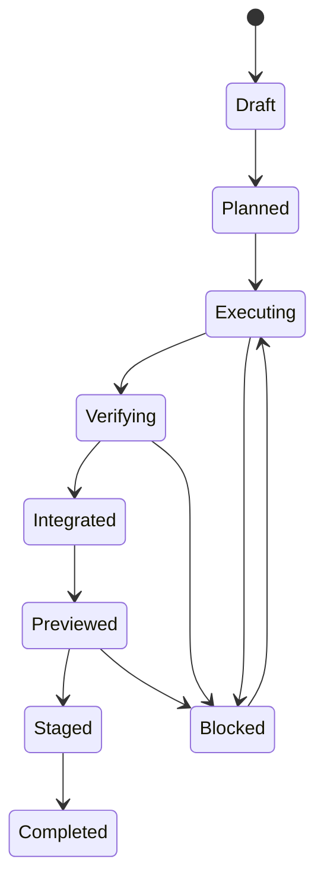

# 🧪📐🌐⚡ Verification Lattice: property, stateful, load, chaos ⚡🌐📐🧪
### Почему одного CI pipeline недостаточно

> 📅 Дата: 2026-04-13
> 🔬 Статус: Verification architecture note
> 📎 Серия: [04-Dynamic-Simulacra](./04-dynamic-simulacra-and-ephemeral-envs.md) · **[05]** · [06-Refinery](./06-refinery-intelligent-merge-and-architecture-guard.md)
> 📎 Внешняя опора: [Hypothesis documentation](https://hypothesis.readthedocs.io/en/latest/) · [Stateful tests](https://hypothesis.readthedocs.io/en/latest/stateful.html)

---

## 🎯 Тезис

> Линейный CI отвечает на вопрос “всё ли зелёное сейчас?”, но плохо отвечает на вопрос “достаточно ли доказательств, что изменение безопасно, корректно и интегрируемо?”.

Поэтому в autonomous dev mesh проверка должна быть не pipeline, а **lattice**.

Lattice означает:

- разные типы проверок
- частично независимые оси
- разные окружения
- разные уровни доказательности
- разные правила обязательности

---

## 🧱 1 — Из чего состоит lattice

| Ось | Что проверяет | Типичный инструмент |
|---|---|---|
| ✅ `unit` | локальная корректность функций и модулей | обычные unit tests |
| 🔗 `integration` | взаимодействие компонентов | preview env / service slice |
| 📜 `contract` | API / schema / event compatibility | snapshots, schema checks |
| 📐 `property` | инварианты на широком классе входов | Hypothesis |
| 🔄 `stateful` | последовательности операций и переходы состояния | Hypothesis RuleBasedStateMachine |
| 📈 `load` | latency, throughput, saturation | load arena |
| ⚡ `chaos` | устойчивость к fault injection | chaos arena |
| 🌐 `browser` | пользовательские и admin flows | browser agents |
| 🧠 `architectural` | согласованность с architecture rules | static architecture guard |
| 🧾 `knowledge` | полнота summaries, ADR, evidence | chronicler checks |

### 💡 Почему lattice, а не список

Потому что одно изменение может быть:

- слабым по unit risk
- сильным по integration risk
- критичным по migration risk
- почти нулевым по browser risk

Значит, система должна уметь включать и выключать оси проверки по change profile.

---

## 📐 2 — Property-based testing как first-class citizen

Property-based testing особенно важен там, где example-based tests систематически пропускают edge cases.

### Что брать из Hypothesis

Hypothesis даёт:

- генерацию широкого пространства входов
- shrinking до минимального failing case
- stateful testing через rule-based state machines

### 📊 Какие свойства стоит проверять в autonomous delivery

| Область | Примеры свойств |
|---|---|
| parsers / serializers | roundtrip сохраняет смысл |
| planners / compilers | formula -> molecule не нарушает invariants |
| schedulers | bead ordering respects dependencies |
| merge logic | idempotent merge metadata, monotonic evidence accumulation |
| routing / policy | forbidden transitions never occur |
| config transforms | normalization preserves valid schema |

### 📐 Формально

Если есть трансформация:

$$f: X \to Y$$

то часто надо тестировать не конкретные примеры, а свойства:

$$P(x) \Rightarrow Q(f(x)) \quad \forall x \in X$$

Именно это даёт property-based подход.

---

## 🔄 3 — Stateful testing как модель workflow

Stateful testing особенно полезен для систем, где важны **последовательности операций**, а не только одиночные вызовы.

Это идеально подходит для:

- issue lifecycle
- environment lifecycle
- merge queue transitions
- retry / recovery logic
- promotion gates

### 🖼️ Rule-based state machine для delivery



### 💡 Главное преимущество

Stateful testing позволяет генерировать **последовательности шагов**, а не только данные.

То есть можно искать баги типа:

- “после cancel + retry + requeue система теряет artifact”
- “после promotion rollback статус knowledge plane не синхронизируется”

Это класс дефектов, который очень плохо ловится обычными unit tests.

---

## 📈 4 — Load и performance проверки

Слишком часто load testing делается “когда-нибудь потом”.

В autonomous mesh он должен включаться по policy:

- high traffic path
- orchestrator hot path
- queueing logic
- shared infrastructure routing
- observability / dashboard fanout

### 📊 Performance evidence bundle

Минимальный load evidence:

- p50 / p95 / p99 latency
- throughput plateau
- error rate under load
- saturation indicators
- resource footprint

### ⚠️ Важный нюанс

Load test — это не просто “запустить k6”.

Это отдельный bead с:

- fixed workload profile
- environment assumptions
- SLO contract
- regression comparator

---

## ⚡ 5 — Chaos как проверка recovery semantics

Если система всерьёз хочет быть NDI-driven, она обязана уметь переносить:

- падение агента
- пропажу workcell
- потерю streaming connection
- merge queue reordering
- timeout verifier
- staged rollout interruption

Chaos testing проверяет, что molecule действительно продолжает жить.

### 📊 Примеры chaos-инъекций

| Инъекция | Что проверяем |
|---|---|
| kill builder mid-bead | resume from milestone |
| destroy preview env | reproducible recreation |
| delay CI verdict | timeout policy and escalation |
| break one dependency | graceful degradation |
| reorder queued changes | integration recalculation |

---

## 🌐 6 — Browser и UX-flow проверки

Когда в системе есть UI, browser verification должен быть отдельной осью lattice, а не случайным ручным действием.

Что важно:

- smoke flows
- critical admin flows
- auth / permissions
- visual regressions при необходимости
- scripted exploratory checks агентом

Browser-agents в preview env особенно важны, потому что они переводят UI-проверку в reproducible artifact:

- screenshots
- snapshots
- traces
- HAR

---

## 🧠 7 — Verification policy engine

Не все изменения должны проходить все оси lattice.

Нужен policy engine:

```yaml
if change_class == "db_migration":
  require:
    - unit
    - contract
    - stateful
    - data_twin
    - preview
    - stage

if risk == "high":
  require:
    - load
    - chaos
    - architecture_guard
    - human_gate
```

### 📐 Итоговая идея

$$\text{required lattice} = g(\text{change profile}, \text{risk}, \text{scope}, \text{affected systems})$$

---

## 🔗 8 — Evidence bundle как выход lattice

Lattice не должен просто говорить “green”.

Он должен производить:

- verdict
- structured metrics
- failing minimal examples
- state machine traces
- screenshots
- logs
- architectural guard results

То есть:

> результат lattice = не булев флаг, а **evidence bundle**.

---

## 🏁 Итог

> Verification lattice делает качество не ступенью конвейера, а многомерной системой доказательств.

Следующий вопрос:

кто синтезирует все эти доказательства при реальной интеграции нескольких фич и движущегося `main`?

Ответ: **Refinery**.

---

## 🔗 Knowledge Graph Links

- [04-Dynamic-Simulacra](./04-dynamic-simulacra-and-ephemeral-envs.md) --enables--> [This Note]
- [This Note] --enables--> [06-Refinery]
- [03-GAS-TOWN-ANALYSIS](../03-GAS-TOWN-ANALYSIS.md) --is_instance_of--> [Crash recovery validation]
