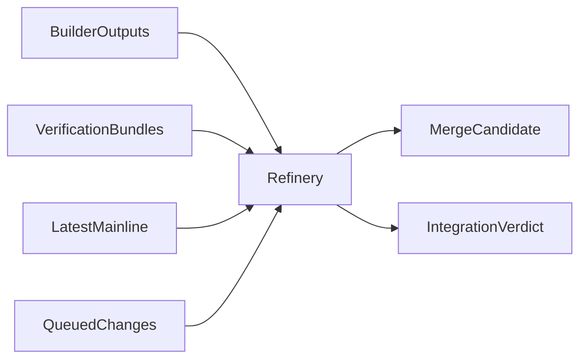

# 🌊🔗🏗️🛡️ Refinery: intelligent merge и architecture guard 🛡️🏗️🔗🌊
### Merge как фаза синтеза, а не как git-команда

> 📅 Дата: 2026-04-13
> 🔬 Статус: Integration architecture note
> 📎 Серия: [05-Verification-Lattice](./05-verification-lattice-property-stateful-load-chaos.md) · **[06]** · [07-Knowledge-Plane](./07-knowledge-plane-huly-github-dashboards-kb.md)
> 📎 Внешняя опора: [Managing a merge queue](https://docs.github.com/en/repositories/configuring-branches-and-merges-in-your-repository/configuring-pull-request-merges/managing-a-merge-queue)

---

## 🎯 Тезис

> В сложной агентной разработке merge должен перестать быть финальной кнопкой и стать отдельным интеллектуальным слоем.

Этот слой я называю **Refinery**.

Его задача не просто слить ветки, а ответить на вопрос:

> Совместимо ли изменение с уже движущимся mainline, соседними фичами, архитектурными инвариантами и rollout-политикой?

---

## 🧠 1 — Почему обычный PR merge недостаточен

Обычный merge обычно проверяет:

- зелёный ли CI
- нет ли конфликтов
- одобрил ли кто-то PR

Но не проверяет системно:

- конфликт intent’ов
- скрытый контрактный конфликт двух независимых фич
- архитектурное расхождение с действующим направлением репо
- накопительный эффект нескольких изменений в очереди
- совместимость с текущими queued changes

Именно поэтому merge queue полезен, но недостаточен сам по себе.

Он даёт:

- FIFO-подобную дисциплину
- временные ветки `merge_group`
- re-check against fresh base

Но он не даёт semantic synthesis.

---

## 🌊 2 — Что такое Refinery

Refinery — это агентный и policy-driven интеграционный слой.

### Его функции

| Функция | Что делает |
|---|---|
| 🔄 `rebase reality` | пересобирает candidate against latest main + queued changes |
| 🧠 `semantic diffing` | понимает смысл изменений, а не только строки diff |
| 🛡️ `architecture guard` | проверяет инварианты архитектуры |
| 🗳️ `candidate selection` | выбирает лучший из best-of-N результатов |
| 🚦 `promotion decision` | решает, готово ли изменение к preview/stage |
| 📎 `integration memo` | выпускает structured verdict и объяснение |

### 🖼️ Картина слоя



---

## 🛡️ 3 — Architecture guard

Architecture guard — это не линтер стиля.

Это система инвариантов архитектуры репозитория.

### 📊 Примеры guard-инвариантов

| Инвариант | Что проверяет |
|---|---|
| 📦 module boundaries | не пробит ли слой архитектуры |
| 🔌 protocol discipline | не появился ли запрещённый канал интеграции |
| 🧾 schema compatibility | не поломаны ли контракты/миграции |
| 🧠 domain ownership | не размазалась ли логика по чужим модулям |
| 🏗️ pattern adherence | соблюдён ли agreed architectural pattern |
| 📚 docs coupling | отражены ли важные architectural deltas в KB/ADR |

### 💡 Важный принцип

Guard должен быть:

- формализуемым
- объяснимым
- эволюционируемым

Он не должен быть магическим “чёрным ящиком ревьюера”.

---

## 🔀 4 — Intelligent merge как выбор лучшего пути

Когда есть best-of-N builder outputs, merge уже не бинарный.

Refinery должен уметь:

- сравнивать competing implementations
- учитывать verifier bundles
- учитывать integration surface
- учитывать maintainability / architecture fit

### 📐 Условная scoring-модель

$$\text{score}(c) = w_q Q + w_i I + w_v V + w_m M + w_r R$$

Где:

- $Q$ — quality
- $I$ — integration compatibility
- $V$ — verification strength
- $M$ — maintainability
- $R$ — rollout safety

Это не значит, что всё надо сводить к одной цифре. Но Refinery обязан уметь делать **многокритериальный выбор**, а не “прошёл CI, значит норм”.

---

## 🚦 5 — Promotion ladder

Promotion тоже не должен быть слепым переходом.

### Базовая лестница


### Что проверяет каждый переход

| Переход | Что нужно |
|---|---|
| candidate -> preview | compile + focused checks + env provisioning |
| preview -> integration verdict | required lattice subset + browser/contract evidence |
| integration -> stage | merge candidate stable against queue + architecture guard pass |
| stage -> release eligible | stage health + rollout policy + human gate if needed |

---

## 🔄 6 — Merge queue как execution primitive, не как whole strategy

Из GitHub merge queue полезно брать:

- `merge_group` как реальную проверку against queued changes
- branch protection coupling
- rebuild when queue reordered
- controlled concurrency

Но поверх неё нужен semantic layer.

### Хорошая модель

- merge queue = low-level transactional rail
- Refinery = high-level integrator and selector

То есть:

> Merge queue говорит “можно ли безопасно провести это изменение через очередь”.
>
> Refinery говорит “какое именно изменение и в какой форме вообще нужно проводить через очередь”.

---

## 🧾 7 — Output Refinery

Refinery должен выдавать не только merge candidate, но и понятный integration memo:

```yaml
integration_verdict:
  mission_id: ms-123
  candidate_id: cand-2
  compatible_with_mainline: true
  compatible_with_queue: true
  architecture_guard: pass
  risk: medium
  required_next_step: promote_preview
  reasons:
    - "contract checks stable"
    - "best-of-3 candidate chosen for smaller architecture delta"
    - "queue recomputation passed"
```

---

## 🏁 Итог

> Refinery превращает integration из позднего сюрприза в отдельную вычислимую фазу.

Следующий шаг естественный:

все эти verdicts, reasoning traces, environment events и summaries нужно не терять, а автоматически публиковать.

Это и есть **knowledge plane**.

---

## 🔗 Knowledge Graph Links

- [05-Verification-Lattice](./05-verification-lattice-property-stateful-load-chaos.md) --enables--> [This Note]
- [This Note] --enables--> [07-Knowledge plane]
- [03-GAS-TOWN-ANALYSIS](../03-GAS-TOWN-ANALYSIS.md) --is_analogy_for--> [Refinery layer]
