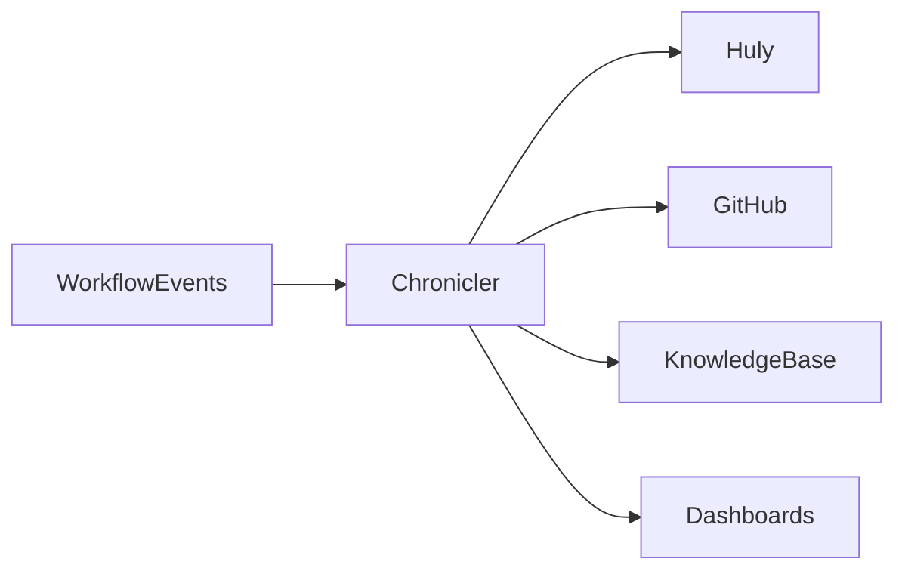

# 📚🧾📊🔗 Knowledge Plane: Huly, GitHub, dashboards, KB 🔗📊🧾📚
### Как сделать так, чтобы бюрократия умерла и превратилась в артефакты

> 📅 Дата: 2026-04-13
> 🔬 Статус: Knowledge architecture note
> 📎 Серия: [06-Refinery](./06-refinery-intelligent-merge-and-architecture-guard.md) · **[07]** · [08-Web2-First-MVP](./08-web2-first-mvp-roadmap.md)

---

## 🎯 Тезис

> В нормальной системе разработки документация, summaries, статусы и dashboards не должны создаваться вручную как отдельная работа. Они должны эмититься как побочный продукт исполнения workflow.

Это и есть **knowledge plane**.

---

## 🧠 1 — Что сегодня идёт не так

Сейчас knowledge exhaust размазан между:

- Huly comments
- PR discussion
- commits
- CI logs
- локальными чатами
- памятью участников

Из-за этого:

- знание теряется
- бюрократия раздражает
- повторное исследование начинается с нуля
- dashboards не отражают реальную картину

---

## 📦 2 — Какие артефакты должны генерироваться автоматически

| Артефакт | Когда появляется |
|---|---|
| 🧾 `mission summary` | после компиляции mission spec |
| 🔍 `research memo` | после research beads |
| 🏗️ `design delta note` | после design bead |
| 🧪 `verification summary` | после lattice verdict |
| 🌊 `integration memo` | после Refinery |
| 🚀 `promotion report` | после preview/stage transitions |
| 📚 `ADR-like note` | при архитектурных отклонениях |
| 📊 `live dashboard event` | при каждом state transition molecule |
| 🧠 `knowledge graph links` | при публикации заметок и решений |
| 🗒️ `Huly update` | при значимых переходах workflow |
| 🐙 `PR synthesis` | при открытии/обновлении/финализации PR |

### 💡 Принцип

Не “попросить человека написать summary”.

А:

> bead завершён -> evidence bundle собран -> chronicler synthesizes artifacts -> plane публикует туда, где нужно.

---

## 🌐 3 — Каналы knowledge plane

### Huly

Huly должен получать:

- краткие state transitions
- blockers
- final result
- stage/prod promotion status

Не нужно сыпать туда весь шум.

### GitHub

GitHub должен получать:

- PR summary
- merge reasoning
- integration memo
- preview links
- verification highlights

### Knowledge base

KB должна получать:

- долговечные решения
- ADR-like записи
- reusable patterns
- incident learnings

### Dashboard / observability

Dashboards должны показывать:

- active molecules
- bead states
- queue pressure
- verifier verdicts
- preview/stage utilization
- promotion funnel

---

## 📊 4 — Событийная модель

Knowledge plane лучше всего строить как event-sourced слой поверх lifecycle molecules.

### Базовые события

```yaml
events:
  - mission.created
  - molecule.compiled
  - bead.started
  - bead.completed
  - bead.failed
  - verifier.passed
  - verifier.failed
  - refinery.selected_candidate
  - preview.created
  - stage.promoted
  - human.approval_requested
  - mission.completed
```

### 🖼️ Поток



---

## 🧾 5 — Evidence bundle как источник правды

Knowledge plane не должен фантазировать.

Все его публикации должны опираться на evidence bundle.

### Минимальная структура evidence

```yaml
evidence_bundle:
  mission_id: ms-123
  bead_id: bead-8
  artifacts:
    - diff_summary.md
    - browser_trace.zip
    - test_results.json
    - metrics.json
  verdicts:
    - verifier: browser
      status: pass
    - verifier: property
      status: pass
  timestamps:
    started_at: ...
    completed_at: ...
```

То есть chronicler должен быть не “писателем из воздуха”, а **semantic compiler of evidence**.

---

## 📈 6 — Какие dashboards реально нужны

### Для операторов системы

- throughput molecules/day
- mean time per phase
- blocked molecules
- rework rate
- verifier failure hotspots

### Для engineering lead / architect

- integration conflicts by subsystem
- architecture guard violations
- merge queue pressure
- preview env cost / utilization

### Для человека-заказчика

- что сейчас происходит
- где риск
- что уже доказано
- что ждёт только approval

---

## 🔗 7 — Knowledge Graph как долговременная память

Не каждый Huly comment достоин вечной жизни. Не каждый лог стоит помнить.

Нужна слоистая память:

| Слой | Что хранит |
|---|---|
| transient | логи, live events, ephemeral diagnostics |
| operational | task states, verifier verdicts, stage events |
| durable | ADR, architecture decisions, incident learnings, reusable formulas |

Именно durable слой должен собираться в knowledge graph:

- what changed
- why changed
- what was validated
- what constraints were discovered

---

## 🏁 Итог

> Knowledge plane убирает ручную бюрократию не тем, что “автоматически заполняет формы”, а тем, что превращает lifecycle workflow в поток структурированных артефактов.

Теперь остаётся практический вопрос:

как к этому прийти без попытки сразу построить весь sovereign future разом?

Нужен **Web2-first MVP roadmap**.

---

## 🔗 Knowledge Graph Links

- [06-Refinery](./06-refinery-intelligent-merge-and-architecture-guard.md) --enables--> [This Note]
- [This Note] --enables--> [08-Web2-first MVP roadmap]
- [02-SOVEREIGN-MESH](../02-SOVEREIGN-MESH.md) --extends--> [Durable knowledge layer]
