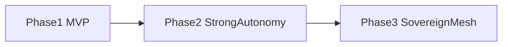

# 🛠️🌱🚦 Web2-first MVP roadmap 🚦🌱🛠️
### Как прийти к Autonomous Development Mesh без мегапрыжка в космос

> 📅 Дата: 2026-04-13
> 🔬 Статус: Практическая дорожная карта
> 📎 Серия: [07-Knowledge-Plane](./07-knowledge-plane-huly-github-dashboards-kb.md) · **[08]** · [09-Stage9-Sovereign-Dev-Mesh](./09-stage9-sovereign-dev-mesh.md)

---

## 🎯 Тезис

> Самая опасная ошибка здесь — попытаться сразу построить полный sovereign mesh и умереть под весом собственной концептуальности.

Нужен двухскоростной подход:

- дальняя теория остаётся широкой
- ближняя реализация остаётся жёстко прагматичной

---

## 🧱 1 — Что должно войти в MVP

### Не надо тащить сразу

- IPFS
- Ceramic
- UCAN
- full decentralized orchestration
- economic marketplace агентов

### Надо взять сразу

- Huly как intake
- GitHub как execution rail
- merge queue
- preview environments
- worktrees / isolated sandboxes
- role-split агентов
- molecule state store
- evidence bundles
- chronicler

---

## 📊 2 — Phase 1: operational MVP

### Цель

Сделать систему, которая уже:

- принимает intent
- компилирует mission spec
- создаёт molecule
- гоняет beads по role-split агентам
- поднимает preview env
- собирает evidence
- постит статусы сама

### Практический стек

| Слой | MVP-решение |
|---|---|
| Intake | Huly issue + lightweight mission compiler |
| State | PostgreSQL / SQLite / JSON event log |
| Code execution | git worktrees + isolated shells/containers |
| Agent coordination | простой orchestrator + HTTP/A2A-like contracts |
| Tool access | MCP |
| Preview env | namespace-per-PR или cheap preview tooling |
| Verification | pytest + Hypothesis + browser flows + load subset |
| Integration | GitHub merge queue + Refinery service |
| Knowledge | auto comments + ADR markdown + dashboard events |

---

## 🔄 3 — Phase 2: stronger autonomy

Когда MVP реально работает, добавляются:

- полноценный A2A control plane
- stateful multi-agent recovery
- richer policy engine
- semantic candidate scoring
- route groups / combined previews
- durable knowledge graph

### Сдвиг

На этой фазе система перестаёт быть “автоматизированным CI+bot” и становится настоящим orchestrator.

---

## 🌌 4 — Phase 3: sovereign horizon

Только потом имеет смысл подтягивать:

- decentralized state
- DID / capability delegation
- mesh execution across nodes
- portable workcells
- marketplace of agents

Это уже не MVP delivery-system, а стадия 9-10 из твоей оркестраторной линии.

---

## 🗺️ 5 — Минимальная последовательность внедрения

### Phase 1 beads

1. mission compiler
2. molecule schema
3. role split agents
4. evidence bundle format
5. preview env automation
6. verification lattice subset
7. chronicler
8. refinery-lite

---

## 📐 6 — Как не потерять реализм

### Правило 1

Не строить слои, которые нельзя проверить на реальном репо.

### Правило 2

Любая абстракция должна сразу получать operational embodiment:

- formula -> YAML/DSL
- molecule -> state graph
- bead -> executable contract
- evidence -> concrete files
- chronicler -> реальные публикации

### Правило 3

Сначала Web2 NDI, потом sovereign NDI.

---

## 🏁 Итог

> Правильный MVP для Autonomous Development Mesh — это не “маленькая версия мечты”, а работающий operational core, который уже убирает ручные handoff, stage bottlenecks и бюрократический шум.

И только теперь можно честно смотреть в дальний горизонт.

---

## 🔗 Knowledge Graph Links

- [07-Knowledge-Plane](./07-knowledge-plane-huly-github-dashboards-kb.md) --enables--> [This Note]
- [This Note] --enables--> [09-Stage9-Sovereign-Dev-Mesh]
- [04-ORCHESTRATOR-EVOLUTION](../04-ORCHESTRATOR-EVOLUTION.md) --extends--> [Phase model toward stage 9]
