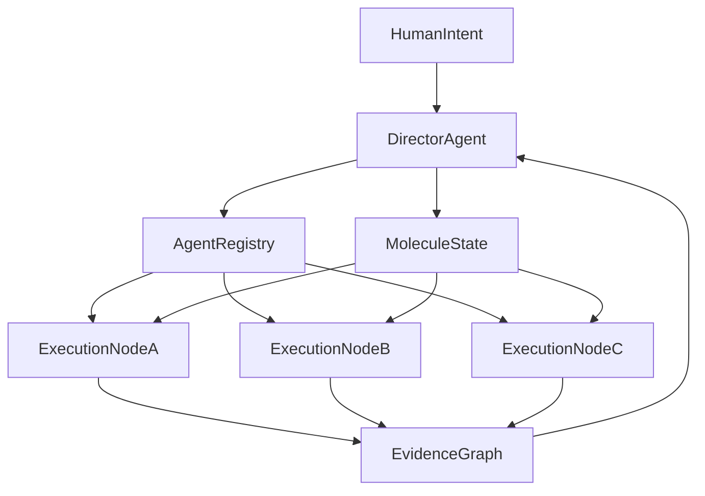

# 🌌♾️🕸️🤖 Stage 9: Sovereign Development Mesh 🤖🕸️♾️🌌
### Дальний горизонт: decentralized autonomous swarm для software delivery

> 📅 Дата: 2026-04-13
> 🔬 Статус: Horizon note
> 📎 Серия: [08-Web2-First-MVP](./08-web2-first-mvp-roadmap.md) · **[09]**
> 📎 Мосты: [02-SOVEREIGN-MESH](../02-SOVEREIGN-MESH.md) · [04-ORCHESTRATOR-EVOLUTION](../04-ORCHESTRATOR-EVOLUTION.md)

---

## 🎯 Тезис

> Stage 9 для development systems начинается там, где агентная разработка отвязывается от одной машины, одного CI, одного репозитория и одной управляющей сущности.

Это уже не просто advanced DevOps.

Это:

- distributed orchestration
- capability-based trust
- portable workcells
- persistent workflow identity
- autonomous hiring of agents

---

## 🧭 1 — Чем Stage 9 отличается от хорошего MVP

### Хороший MVP

- централизованный state
- один GitHub / Huly backbone
- orchestration inside one organization
- preview/stage управляются из единого control plane

### Stage 9

- много execution nodes
- federation of agents
- portable task contracts
- cross-org A2A interaction
- decentralized evidence and state
- capability delegation instead of implicit trust

---

## 🕸️ 2 — Картина sovereign mesh

### Что появляется нового

- `registry` агентов и их capabilities
- переносимые workcells
- устойчивый task identity
- evented knowledge graph состояния
- reputation / trust layer

---

## 🔑 3 — Capability-based trust

Если система распределённая, “просто доверять агенту” уже нельзя.

Нужны:

- identity
- capability delegation
- attenuation
- auditable invocation chain

Иначе swarm быстро превращается в хаос и security hole.

### 💡 Важный тезис

Sovereign mesh без capability model — это просто распределённый бардак.

---

## 🧫 4 — Portable workcells

Сегодня workcell можно мыслить как:

- worktree
- container
- namespace

В Stage 9 workcell должен быть переносим:

- по узлам
- по облакам
- по командам
- по поставщикам агентов

Это значит, что bead contract должен быть отделим от конкретной машины и среды.

---

## 📚 5 — Knowledge plane становится memory substrate

В далёком горизонте knowledge plane уже не просто:

- summaries
- comments
- dashboards

А полноценный слой памяти, который позволяет:

- нанимать новые агенты без полного cold start
- переносить molecules между execution domains
- поддерживать lineage решений
- строить reusable formula marketplace

---

## 🏛️ 6 — Чем этот горизонт полезен уже сейчас

Даже если до него далеко, он влияет на MVP уже сегодня.

Он говорит, какие интерфейсы стоит делать переносимыми:

- mission spec
- formula DSL
- molecule state model
- bead contract
- evidence bundle schema
- event model

Если это сделать сейчас грязно, потом sovereign evolution почти невозможна.

---

## 🏁 Итог всей серии

> Autonomous Development Mesh — это попытка перевести software delivery из ручного управленческого ритуала в систему исполнимых молекул работы, где intent компилируется в graph, graph исполняется swarm-агентами, verification lattice собирает доказательства, Refinery синтезирует интеграцию, а knowledge plane автоматически публикует память системы.

В ближнем горизонте это может быть прагматичный Web2-first orchestrator.

В дальнем — Stage 9 decentralized development mesh.

Обе версии важны.

Первая даёт пользу сейчас.

Вторая не даёт первой скатиться в очередной “немного умнее CI”.

---

## 🔗 Knowledge Graph Links

- [08-Web2-First-MVP](./08-web2-first-mvp-roadmap.md) --enables--> [This Note]
- [02-SOVEREIGN-MESH](../02-SOVEREIGN-MESH.md) --extends--> [This Note]
- [04-ORCHESTRATOR-EVOLUTION](../04-ORCHESTRATOR-EVOLUTION.md) --validates--> [Stage 9 trajectory]
